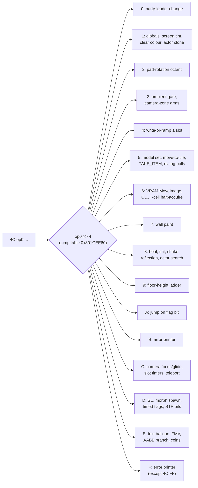

# Field VM - `0x4C` `MENU_CTRL` outer-nibble dispatch

`0x4C` is the field script's grab-bag opcode. Despite the name it is not a
menu: the byte after `0x4C` picks one of sixteen small sub-dispatchers, and
between them they paint walls into the walkability grid, steer the camera,
tint and clone actors, wobble the floor, take items from the bag, spend casino
coins, start FMVs and schedule escape timers. This page is the reference for
all sixteen; the rest of the field VM is in [`script-vm.md`](script-vm.md),
whose opcode table links here.



## How it works

### 0x4C MENU_CTRL - outer-nibble dispatch

The instruction is `[4C, op0, operands...]`. The **outer high nibble** of
`op0` indexes a sixteen-entry jump table at `0x801CEE60` (`srl v1,s3,4` at
`0x801E0C44`, bound `sltiu v0,v1,0x10` at `0x801E0C48`, base pair at
`0x801E0C50`/`0x801E0C54` in `FUN_801DE840`). Most arms then index a second
table on the low nibble, and each sub-op has its own width - so a linear walk
of a script must know every width (the disassembler `legaia_asset::field_disasm`
carries them for all sixteen nibbles).

Three exits recur on this page:

- **Advance** - the arm adds its width to the script cursor `s8` and returns
  (often with the `addiu` in a branch-delay slot, which the decompiled C hides).
- **Halt at PC** - the arm returns the cursor unchanged, so the op re-runs next
  frame. This is how a sub-op *waits*.
- **Halt-acquire** - the standard idiom for freezing another actor: on its
  predicate (`saved_pc != 0` or the target is the player, and not already
  halted or the scene busy) the arm writes the target's `+0x94` payload
  pointer, clears `wait_accum`, sets the halt bit `0x400`, then advances the
  caller; on failure it halts the caller at PC (`LAB_801dee50`).

| Outer nibble | Range | Theme |
|---|---|---|
| 0 | 0x00..0x0F | Party-leader change. |
| 1 | 0x10..0x1F | Five-entry sub-table: global write, screen tint, the [field clear colour](#0x4c-nibble-1-sub-3---the-field-clear-colour) and the [actor clone](#0x4c-nibble-1-sub-4---the-actor-clone). |
| 2 | 0x20..0x2F | [Camera-octant / pad-rotation setter](#0x4c-nibble-2---the-camera-octant--pad-rotation-setter) - one arm, no sub-table. |
| 3 | 0x30..0x3F | The [ambient-particle master gate](#0x4c-nibble-0x300x3f---the-ambient-particle-master-gate), the [camera-zone arms](#0x4c-nibble-0x380x3e---the-camera-zone-arms), no-op cluster, player-resync chain, party-state clear. |
| 4 | 0x40..0x4F | [Immediate-or-ramp cluster](#0x4c-nibble-4---immediate-or-ramp-cluster): write or ramp ctx slots / globals. |
| 5 | 0x50..0x5F | [Five sub-ops](#0x4c-nibble-0x500x5f---the-five-sub-op-table): model select, move-to-tile, **TAKE_ITEM**, two dialog polls. |
| 6 | 0x60..0x6F | [VRAM `MoveImage` + CLUT-cell halt-acquire](#0x4c-nibble-6---vram-moves-and-the-clut-cell-write). |
| 7 | 0x70..0x7F | [Collision-grid rectangular wall paint](#0x4c-nibble-0x700x7f---collision-grid-rectangular-wall-paint). |
| 8 | 0x80..0x8F | [Multi-purpose dispatcher](#0x4c-nibble-0x800x8f---large-multi-purpose-dispatcher): party heal, tint, shake, reflection controller, actor-search jumps. |
| 9 | 0x90..0x9F | [Floor-height ladder](#nibble-9-is-the-floor-height-ladder-not-a-fade). |
| A | 0xA0..0xAF | [Conditional jump on a flag bit](#0x4c-nibble-a---jump-on-a-flag-bit). |
| B | 0xB0..0xBF | [Error printer](#two-outer-nibbles-are-the-error-printer) - no valid sub-op. |
| C | 0xC0..0xCF | [Small per-actor / per-scene writes](#0x4c-nibble-0xc00xcf---small-per-actor--per-scene-writes): camera focus and glide wait, slot-table timers, script teleport. |
| D | 0xD0..0xDF | [Party state + inverted-Y mirror cluster](#0x4c-nibble-0xd00xdf---party-state--inverted-y-mirror-cluster): SE trigger, morph-actor spawn, timed flags, [VRAM STP bits](#0x4c-nibble-d-sub-4--sub-5---vram-stp-bit-setclear). |
| E | 0xE0..0xEF | [Misc scene writes + emitter helpers](#0x4c-nibble-0xe00xef---misc-scene-writes--emitter-helpers): text balloon, FMV trigger, AABB branch, camera animate/zoom, casino coin delta. |
| F | 0xF0..0xFF | [Error printer](#two-outer-nibbles-are-the-error-printer); only `4C FF` passes through. |

The per-sub-op bodies are in the field-VM dump
`ghidra/scripts/funcs/overlay_0897_801de840.txt`.

## Nibble reference

### 0x4C nibble 0x30..0x3F - the ambient-particle master gate

Sub-`0` and sub-`1` are a 2-byte pair that raise and clear one word,
`_DAT_8007B854`, then exit via the STATE_RESUME path. Both stores sit in a
jump delay slot (`0x801E0F38` `sw v0,-0x47ac(v1)` with `v0 = 1`; `0x801E0F44`
`sw zero,-0x47ac(v0)`), reached off the 16-entry nibble-3 jump table at
`0x801CEEB8`.

The word is the **ambient-particle master gate**, not an input lock. Its six
references disc-wide, none of them pad state:

| Site | Form | Role |
|---|---|---|
| `0x800259AC` | `sw zero` | SCUS clear |
| `0x8003B690` | `sw zero` | SCUS clear (field reset `FUN_8003AEB0`) |
| `0x80026EBC` | `lw` | field render pass - stages the `0x8007322C` particle table into scratchpad `0x1F8002D0` when the game mode is `3` and the word is set |
| `0x801D605C` | `lw` | the ambient particle emitter `FUN_801D6058`, its opening `lui`/`lw` pair |
| `0x801E0F38` | `sw` | this sub-`0` |
| `0x801E0F44` | `sw` | this sub-`1` |

So a field script decides, per scene, whether ambience emits at all. The
emitter and its spawn are in
[`field-ambient-fx.md`](field-ambient-fx.md#mechanism-4---the-ambient-particle-emitter).

Sub-`4`, sub-`B` and sub-`C` are 2-byte no-ops: the arm at `0x801df208` jumps
with `addiu s8,s8,2` in the delay slot to the dispatcher's default continue
(the inline `_DAT_8007b5f0 = uVar31` write stores back the value it just read).

### 0x4C nibble 0x38..0x3E - the camera-zone arms

Four of nibble 3's arms are the field camera's **only** script-side grip on
the camera parameter block (`0x8007B607..0x8007B627`, see
[`encounter.md`](../formats/encounter.md#man-section-3-the-camera-region-table)).
Arm addresses are from the nibble-3 jump table at `0x801CEEB8` in PROT `0897`:

| Op | Arm | Body | Width |
|---|---|---|---|
| `[4C 38]` | `0x801E1048` | `FUN_801DE3E0((X - 0x40) >> 7, (Z - 0x40) >> 7)` - query + load at the player's tile. | 2 |
| `[4C 39]` | `0x801E1078` | the same query, then `FUN_80019278(player)` into `player[+0x16]`, then falls into the `[4C 3E]` tail. | 2 |
| `[4C 3D]` | `0x801E10F8` | `FUN_800180EC` at the player's tile - the walk-region **attribute** refresh, not a camera load. | 2 |
| `[4C 3E]` | `0x801E10BC` | `FUN_801DB8EC(player)` snap + `FUN_801DAA50()` focus clamp. | 2 |

Between them sits `[4C 3A]` (arm `0x801E10DC`): the player's heading
`+0x26` takes the **arrival facing** `_DAT_80073EFC` (`lhu v0,0x3efc(v1)` /
`sh v0,0x26(a0)`). Every scene's entry script issues it once. A door's
op `0x3F` sets the word from its `dir` byte through the compass table at
`0x80073F04`, and the card load (`FUN_8003AEB0`, `0x8003B778`) and the
new-game seed zero it, so a card-loaded hero stands at retail heading `0`,
facing the default camera. The values are retail headings; the engine's
`render_26` holds each a half-turn round (`World::apply_arrival_facing`).

`[4C 3E]`'s table entry points **inside** `[4C 39]`'s arm, seventeen
instructions in: the snap arm is the query arm with its head cut off, and
`[4C 39]` falls through into it rather than branching.
`FUN_801DE3E0` is query-and-load in one: `FUN_801DBA20` picks the record
covering the tile, `FUN_801DBC20` splits it into the block, and a miss
installs the fixed zone-miss set. `[4C 3D]` shares only the tile arithmetic
with `[4C 38]`; it calls a different routine.

### Who else loads the block

Nothing re-queries on a bare tile crossing. `FUN_801DE3E0` has seven `jal`
sites disc-wide:

| Site | Caller |
|---|---|
| `0x801E1068` | `[4C 38]` |
| `0x801E109C` | `[4C 39]` (`[4C 3E]` is its tail and has no call of its own) |
| `0x801E2884` | `[4C C4]` |
| `0x801D1FF4` | the player **seat / warp** path, which runs the `[4C 39]` sequence in code (query, `FUN_80019278`, `FUN_801DB8EC`, `FUN_801DAA50`) |
| `0x801D2BCC` | its sibling |
| `0x8003B800` | SCUS field init |
| `0x801D182C` | the field **per-frame** controller `FUN_801D1344` - gated |

The per-frame site runs only while scratchpad flag bit `22`
(`_DAT_1F800394 & 0x400000`) is set; otherwise the frame only eases
(`FUN_801DB510`) and clamps (`FUN_801DAA50`). The bit is not in the per-mode
seed of the flag word (the seed copies a `u16`), so it starts clear on every
game-mode change and only a script raises it, with op `0x2E` / `0x2F` operand
`0x16`. Eight CDNAME scenes carry such a site, every one a `0x2E` SET:
`ropeway`, `station`, `tunnela`, `tunnelb`, `tunnelc`, `nilboa`, `nilboa2`,
`noaru` (PROT `208`, `228`, `236`, `273`, `310`, `638`, `648`, `717`).

The per-frame arm uses the **other** tile convention, `(coord + 0x40) >> 7`,
where the seat path and every arm above use `(coord - 0x40) >> 7` - one tile
apart on the same position.

### 0x4C nibble 0x70..0x7F - collision-grid rectangular wall paint

`[4C, 0x7s, col0, row0, col1, row1 (, mask)]`, handler `0x801e1c64`. Writes
the walkability grid at `_DAT_1f8003ec + 0x4000` - one byte per 128-unit
tile, **high nibble = 4 sub-cell wall bits** - the grid the locomotion
collision check `FUN_801cfe4c` reads.

The painted rectangle is `col ∈ [col0, col1+1)`, `row ∈ [row0+1, row1+2)` at
index `_DAT_1f8003ec + col + row*0x80 + 0x4000`. The **row** bounds carry an
extra `+1` the column bounds do not (`0x801e1cb4`: `addiu a2, v0, 1` for the
row start vs the raw `lbu` for the column start).

| Sub `s` | Effect | Width |
|---|---|---|
| `0` | clear walls, `byte &= 0x0F` (walkable) | 6 (exits via `s8 += 6` at `0x801e1d24`) |
| `1` | block all, `byte |= 0xF0` | 6 |
| `2` | clear mask bits, `byte &= ~(mask << 4)` | 7 |
| `3` | set mask bits, `byte |= mask << 4` | 7 |

These deltas layer on top of the disc-streamed base grid (see
[`field-locomotion.md`](field-locomotion.md)); they ride the scene event
script and are commonly gated behind system-flag tests (story-conditional
terrain). The byte's low nibble is a separate floor-elevation tier; the
sibling `_DAT_1f8003ec + 0x8000` grid is a per-tile object/attribute map.

### 0x4C nibble 0x80..0x8F - large multi-purpose dispatcher

Sub-table at `0x801CEF48`, indexed by `op0 & 0xF` under a `sltiu` bound of
`0x10` (base pair at `0x801E1EAC`).

| Sub | Form | What it does |
|---|---|---|
| 0 | `[4C 80 count records...]` | Child-actor allocator (halt-acquire family) - [below](#4c-80-the-child-actor-allocator). |
| 1 | `[4C 81 r g b blend_lo blend_hi ticks_lo ticks_hi]` | Actor draw **tint** - [below](#4c-81-the-actor-tint). |
| 2 | `[4C 82 slot]` | **Full HP/MP restore of one party slot**: `hp_cur(+0x106) = hp_max(+0x104)`, `mp_cur(+0x10A) = mp_max(+0x108)` on the `0x414`-stride record. |
| 3 | `[4C 83 c0 r0 c1 r1 value]` | Rectangular tile fill - [below](#4c-83-rectangular-tile-fill). |
| 4 | `[4C 84 amplitude]` | **Screen-shake amplitude** - [below](#4c-84-screen-shake). |
| 5 / E / F | `[4C op0 p0 p1 p2]` | Halt-acquire on the resolved target; aimed at the player, a face-turn - [below](#4c-85--8e--8f-halt-acquire-and-the-player-face-turn). |
| 6 | `[4C 86 w0..w5 actor]` (15 bytes) | Installs the [reflection controller](#4c-86--4c-87-are-the-reflection-controllers-install-and-teardown). |
| 7 | `[4C 87]` | Retires every reflection controller. |
| 9 | `[4C 89 lo hi]` | `_DAT_80073F00 = i16`, the dialog pager's **automatic press** - [below](#4c-89-the-dialog-auto-press). |
| B | `[4C 8B type lo hi]` | Jump to absolute u16 if any actor of `type` is active, else PC += 5. |
| D | `[4C 8D char marker lo hi]` | Tristate per-character actor search: empty slot -> advance 6, found -> jump to the u16, no match -> halt. |

The slot in sub-2 is a literal operand, not "every active member". It is the
primitive every inn / rest / infirmary script is built on; there is no inn
opcode - the charge is a separate op-`0x4E` gate plus op-`0x3A` debit, so the
price is per-scene script data (see
[field-menu.md](field-menu.md#inn-stay-there-is-no-inn-screen)).

#### `4C 80`: the child-actor allocator

Halt-acquire with `which = 0x80`. `count` is the byte at `operand+1`; the
`count` variable-length child records that follow are walked with the
[`packet_length`](script-vm.md#helper-functions) rule (`FUN_8003CA38`: a byte
`<= 0x1E` ends a record, a byte with top nibble `0xC` consumes one extra).
The parent's PC always advances by 3; the records stay embedded in the
bytecode and become the spawned actors' own scripts. The retail allocator
(`overlay_world_map_801de840.txt:7080-7123`) allocates from pool `0x801f28a0`
and writes `actor[+0x90]` (bytecode start), `actor[+0x94]` (parent
back-pointer) and `actor[+0x54] = 0`. It does **not** write `+0x3C` / `+0x3E`
- only the [`4C D8`](#what-the-0x4c-0xd8-spawner-builds) spawner carries
explicit immediates.

#### `4C 81`: the actor tint

`+0x74 = colour` (`FUN_8003CEB8`, 24-bit `0xBBGGRR`) and `+0x78 = blend`
outright when `ticks` is `0`; otherwise tweened through `FUN_8003C5F0` - only
the blend when `+0x78` was `0` (the colour is written first), the colour and
blend otherwise (`0x801E1FC4..0x801E2068`). The actor draw stages the pair as
the GTE far colour and `IR0` (`FUN_8001ADA4` -> `FUN_80043390`,
`0x8001B46C..0x8001B474`), so `00 00 00 / 0x1000` pushes the actor fully to
black - on an additive prim, invisible.

The arm runs on the actor `FUN_8003C83C` resolves, never on the caller's
record, and the disc aims it everywhere: `CC F8 81 ..` tints the player,
`CC <id> 81 ..` an NPC; it appears in every kingdom MAN and most towns.
Typical uses:

- A cutscene blacks an actor out at full blend and tweens the blend back to
  `0` to fade it in, or washes it red at a low blend.
- `chitei2`'s hologram panels (partition-0 records 19..27) black themselves
  out in their spawn prologue once flag `0x4C5` (the generator destroyed) is up.
- The kingdom MANs' partition-0 records tint the overworld landmarks they bind
  (map02's records 2.. go black at `0x800` or `0x1000` depending on a story
  flag; a retail map02 state holds records 2..28 at `0x800`).

#### `4C 83`: rectangular tile fill

Walks the inclusive rectangle `[col_start..=col_end] × [row_start..=row_end]`,
calling `FUN_801D5630(col, row, ...)` per tile to resolve a tile-record
pointer; on a hit it writes `tile[+0x3] = 0; tile[+0x2] = value`. The loop
exits on `j 0x801e3624` with `addiu s8,s8,7` in its delay slot (`0x801E212C`)
and writes nothing else.

#### `4C 84`: screen shake

The whole arm is five instructions at `0x801E2134` (jump-table slot
`0x801CEF58`): `addiu s8,s8,0x3` / `lbu v1,0x1(s6)` / `lui v0,0x8008` /
`j 0x801e3624` / `_sw v1,-0x49d0(v0)` - `_DAT_8007B630 = operand`,
zero-extended. That global is the only input to the LCG camera jitter
`FUN_801D9D30` (`0` = no shake, `1..=0x15` widens the sample window) and this
opcode is its only non-zero writer, so the field script is the sole source of
camera shake. The scene reset `FUN_8003A024` zeroes it on every load
(`0x8003A07C`): a shake left running ends at the door.

#### `4C 85` / `8E` / `8F`: halt-acquire and the player face-turn

The standard halt-acquire on the resolved cross-context target. The arm
(`0x801E2148..0x801E21DC`) stores the op's own address into the target's
`+0x94`, zeroes its `+0x54` and raises its `0x400`, then advances the caller
by five (`li s7,5` at `0x801E21B8`). Those bytes are the walk kernel's `0x4C`
FaceTarget leg (`FUN_8003774C`, [motion-vm.md](motion-vm.md)), which the
target's actor tick runs while `0x400` is up: the target turns toward actor
bind `<id>` (`0xF8` = the player) over the `u16` frame budget, a budget of
zero snapping at once, and the leg's terminal frame clears the target's halt
(`0x80038004`). So the op is not a freeze: every actor a cutscene record
acquires this way turns to face someone.

Aimed at an NPC or a party placement, the caller runs on while the actor
turns, and the record's next cross-context op on that actor waits for the
turn (the halted-target refusal). Cutscene records issue over a thousand of
these on NPCs and as many again on the Noa / Gala placements - "Noa turns to
Vahn" is `CC <noa> 85 <budget> F8`. The port arms the leg as
`CutsceneTimeline::npc_faces`.

Aimed at the player (`CC F8 85|8E|8F <lo> <hi> <id>`) the arm also raises the
caller's own `0x400` (`0x801E21B4..0x801E21CC`), and the leg's terminal frame
clears both (`0x80038004` / `0x80038028`). A cutscene record therefore waits
on the player's turn - `jouine` `P2[5]` turns Vahn toward Cort this way before
the evolved-Cort fight.

#### `4C 89`: the dialog auto-press

While `_DAT_80073F00` is positive, each `0x19` call of `FUN_801D84D0`
subtracts the frame step, and the call that reaches zero clears it and presses
confirm (`0x801D8F4C..0x801D8F88`). This op is its only writer, at 37 sites in
12 scenes; it advances by 4.

#### `4C 86` / `4C 87` are the reflection controller's install and teardown

`4C 86` makes the executing script's actor the **mirror image** of an actor it
names; `4C 87` stops every mirror.

```text
4C 86  w0 w1 w2 w3 w4 w5 (6 x s16)  actor_id      15 bytes
```

The `4C 86` arm at `0x801E21E0` reads the **last** operand byte
(`lbu a0,0xd(s6)`) as a cross-context actor id and resolves it through
`FUN_8003C83C`. An unresolved id returns early with the PC already advanced
(the `addiu s8,s8,0xf` sits in that call's delay slot). On a hit it decodes
the six `s16` at operand `+1..+0xB` through `FUN_8003CE9C` and calls
`FUN_801E573C(executing_ctx, resolved_actor, w0..w5)`.

That spawner allocates from the descriptor at `0x801F2948` (handler word
`0x801E5154`, the reflection tick) and writes `+0x90 = executing ctx`,
`+0x94 = resolved actor`, `+0x54 = 0` and the six halfwords into
`+0x80..+0x8A` - the controller's mirror line plus tracking rect, not a
transform for the named actor.

The tick decides direction: `FUN_801E5154` reads `+0x94` (`lhu 0x14(a2)`,
`lhu 0x5c(a2)`, the tile test) and writes `+0x90` (`sw 0x10(a3)`,
`sh 0x14(a3)`, `sh 0x26(a3)`). So the **named** actor is the source and the
executing script's own context is the destination. While the source stands
inside the rect the destination is written to `(x, y, 2*zz - z)` facing
`-0x800 - a`; outside it, the image stays put. The rect test quantises with
`(v + 0x40) >> 7`, half a tile the other way from the walk-on trigger compare.

`4C 87`'s arm at `0x801E2284` loads the same handler VA and actor list
`_DAT_8007C34C` and tail-jumps to the shared exit `0x801E2DC4`
(`jal 0x8003CF40`, `addiu s8,s8,2` in the delay slot). `FUN_8003CF40`
**retires** every node with that handler. `4C 9F` (arm `0x801E2548`) is the
same five instructions against `0x801DA930` and the same exit. Neither op
parks: the advance has already run before the call is entered.

On the disc:

- Four scenes issue `4C 86`, ten sites: `concnow`, `conc2`, `urudre2`, `opurud`.
  No scene issues `4C 87`; controllers drop on the scene boundary.
- All ten take `w0 = 0` (no X mirror) and put the Z plane one or two tiles past
  the rect's own `max_tile_z`, so the image stands beyond the far wall.
  `concnow` `p1[1]` is `w = (0, 0x37A0, 30, 90, 38, 110)` against `0xF8`, the
  player; its `p1[4]` and `p1[5]` name two further actors.
- **Every one is installed at scene entry, not on a talk.** Each sits in its
  record's spawn prologue - after the leading `0x25`, before the first `0x21`
  park where the `(Silence)`-style talk loop begins - so addressing the image
  only replays its line.

### 0x4C nibble 0xC0..0xCF - small per-actor / per-scene writes

| Sub | Form | What it does |
|---|---|---|
| 0 | `[4C C0]` | Move-table cancel via `func_0x800204F8` (gated on whether a move is active). |
| 1 | `[4C C1]` | **Fog-region enable reset** - [below](#4c-c1-fog-region-enable-reset). PC += 2. |
| 3 | `[4C C3]` | Script-table teleport + spawn-section re-run - [below](#4c-c3-script-table-teleport). |
| 4 | `[4C C4 x z]` | Camera-zone query at an explicit tile: arm `0x801E2878`, `FUN_801DE3E0(x & 0x7F, z & 0x7F)`. Frames a shot from a region record the player is not standing in. |
| 5 / 6 | `[4C C5|C6 lo hi]` | Jump-if-zero / jump-if-nonzero on a 16-bit trigger-flag index; both branches advance 4 (the joined tail at `LAB_801E28C4`). |
| 9 | `[4C C9]` | PC += 2 unless `_DAT_8007BAB8 != _DAT_8007BA9C`, then halts. |
| A / B / C | `[4C CN slot lo hi]` | Slot-table set / add / subtract - [below](#4c-ca--cb--cc-script-counters). |
| D | `[4C CD]` | [Camera-glide wait](#4c-cd-waits-for-the-camera-glide). |
| E | `[4C CE value]` | **Player clip override** (`0x801E2A20..0x801E2A30`): `_DAT_8007B6AC = value`, pointing a party-flagged player's walk, idle and run at scene-bank records `base + value - 1`. Scene entry zeroes it; used by `jagaroom`, `urudre1` ([`field-locomotion.md`](field-locomotion.md#the-clip-base-and-the-settle-tail)). |
| F | `[4C CF x z]` | [Script camera-focus override](#4c-cf-is-the-script-camera-focus-override). |

#### `4C C1`: fog-region enable reset

Walks `_DAT_80073ED8[..count]` (stride `0xB`) - the MAN section-4 fog-region
table the ambient particle spawner searches
([field-ambient-fx](field-ambient-fx.md#mechanism-4---the-ambient-particle-emitter))
- tests each record's 16-bit story-flag index at `+9..+10` through
`FUN_8003CE64`, and writes `record[0] = flag set ? 0 : 1`
(`0x801E2674..0x801E26EC`). Most scene entry scripts carry it, so a region's
fog goes out for good once its beat's flag is up: retail's `retock` inn holds
every region off under `0x51C` with the gate raised and the pool empty.

#### `4C C3`: script-table teleport

Resolves `func_0x8003C8F0(field_50, 0)` and writes `world_x/z` with the
tile-centre formula `b * 0x80 + 0x40`. It also rebases the context's script
offset `+0x9E` onto the record's first opcode (`0x801E2798..0x801E27A4`), and
when that opcode is `0x25` runs the record inline through `FUN_8003CF7C`
(`0x801E2800..0x801E2820`) - the same op-until-`0x21` slice the scene-entry
install gives a placement, so the spawn section's story-flag dispatch runs
again (a seat op seats that actor, never the player).

- `nilboa` `P2[17]`'s Fire Ravine arm (and `P2[27]`, the walk-on band at the
  boulder room's mouths) sends the two boulders (`P1[13]` / `P1[14]`) home with
  `CC 27 C3` / `CC 28 C3`; their spawn sections, finding `0x457` set, move them
  straight back to where they were pushed.
- `rayman` `P2[17]` re-seats the whole village cast after each quake beat, so
  the gate guard (`P1[18]`) returns beside the `tunnelb` door and, once `0x1FC`
  is up, steps aside to `(13, 44)`; that last re-seat is spawned by `P2[19]`'s
  closing `44 7A`.

#### `4C CA` / `CB` / `CC`: script counters

5-byte writes on the u16 array at `0x801C6460`: sub-A sets, sub-B adds, sub-C
subtracts; B/C substitute the per-frame tick `_DAT_1F800393` when the literal
is `0xFFFF`. The read side is op `0x4E` sub-ops 5..8 (`slot = sub - 5`;
[script-vm.md](script-vm.md) op table). Nothing else writes or clears the
table, so it survives scene loads.

Uses: cave01's interact counter gating the `0x15D` beat-key spawn, and
`tunnelc`'s hammer tremor - while system flag `0x360` is set, the scene-entry
loop adds the frame tick to slot `1`, raises the shake (`4C 84 02`) on counts
`1..=10`, drops it on `11..=30` and wraps by `-30`; Xain's script starts it at
`30` and stops it by writing `80`, which the loop's `79 < slot` exit turns
into a flag clear.

#### `4C CD` waits for the camera glide

The arm at `0x801E29E0` advances the PC by 2, then looks up the first node on
actor list 0 (`_DAT_8007C34C`) whose tick word is the cutscene camera mover
`FUN_801DC0BC` (`FUN_8003CF04`). No mover, or one whose `+0x10 & 0x8` dead
bit is up, returns the advanced PC (`0x801E29FC` / `0x801E2A10`); a live one
takes the restore-PC exit (`j 0x801DEE50` / `move s8,s4`), so the op re-runs
next frame. The mover raises its dead bit the frame its progress `+0x9C`
reaches the duration `+0x9E` (`0x801DD238..0x801DD260`), so an op-`0x45`
glide followed by `4C CD` holds the script until the shot has landed.
`town01`'s opening parks on it after each establishing glide; `jouine`
`P2[16]` after a 2200-frame pan. Retail allocates the mover inside op `0x45`,
so a `4C CD` later in the same slice already sees it.

#### `4C CF` is the script camera-focus override

The arm at `0x801E2A34` zeroes two halfwords, then rewrites each from its own
operand byte: `0xFF` takes the subject actor's live coordinate (`+0x14` for X
at `0x801E2A54`, `+0x18` for Z at `0x801E2A8C`), `0` leaves it cleared, any
other byte is the tile centre `(b << 7) + 0x40`. PC += 4 through the `+4`
epilogue at `0x801E3620`.

The destinations are `_DAT_8007B628` (X) and `_DAT_8007B62A` (Z). The focus
clamp `FUN_801DAA50` tests each halfword and, when non-zero, stores its
**negation** into the field camera's focus point - `0x80089118` for X at
`0x801DAB68`, `0x80089120` for Z at `0x801DAB84`, the words the field view
builder feeds the MVMVA as translation. So the op moves the camera's look-at
target, and a zero halfword means "no override", which is why both are
cleared first. All eight references to the pair are in the field overlay: the
two `lh` reads in the clamp and the six stores of this arm.

Only `uru` (PROT 0435) uses it: 46 coherent occurrences beside `0x45 C0`
camera applies and `CamCfg` writes - one scene's hand-framed shots.

### 0x4C nibble 0xD0..0xDF - party state + inverted-Y mirror cluster

Jump table at `0x801CEFC8`.

| Sub | Form | What it does |
|---|---|---|
| 0 | `[4C D0 a_lo a_hi b_lo b_hi]` | Field SE trigger: `func_0x8002B994(a, b)` gated on `_DAT_8007B874`, `_DAT_800846D0`, `_DAT_800846D4`; PC += 6. |
| 1 | `[4C D1]` | Gate on `FUN_8003CF04(_DAT_8007C34C, FUN_801DC0BC)`: a live camera mover takes the `LAB_801E360C` relative-jump exit, a miss advances. |
| 2 | `[4C D2 channel]` | Resolve the channel via `FUN_8003C83C`; when nothing answers, spawn the placement through `FUN_8003A1E4` inside the `*(_DAT_801C6EA4) + 8` bracket. PC += 3 (arm `0x801E2B7C`). |
| 3 | 14 bytes | `SCHEDULE_TIMED_FLAGS` - [below](#4c-d3-the-timed-flag-scheduler). |
| 4 / 5 | `[4C D4|D5 x_lo x_hi y_lo y_hi]` | [VRAM STP-bit set / clear](#0x4c-nibble-d-sub-4--sub-5---vram-stp-bit-setclear). |
| 6 | `[4C D6 b1]` | `ctx.field_74`: `b1 == 4` clears the top bit only, else sets `0x80000000` and shifts `b1` into the top byte - the draw's blend argument ([`field-locomotion.md`](field-locomotion.md)). PC += 3 (arm `0x801E2D64`). `chitei2` P2[0]/[1] and P2[9]/[10] run it over the corridor lights. |
| 7 | `[4C D7]` | Retire every cutscene camera mover `FUN_801DC0BC` on actor list 0 via `FUN_8003CF40`; PC += 2 (arm `0x801E2DB4`). |
| 8 | 9 bytes | Synchronous morph-actor spawn - [below](#what-the-0x4c-0xd8-spawner-builds). |
| B | 13 bytes | Calls `FUN_801E57F0(operand)`, then PC += 13 (`LAB_801E2EA0`). |
| C / E | `[4C DC|DE needle ...]` (5 bytes) | [`small_table_search`](script-vm.md#helper-functions) on a 1-byte needle, then a scan of the active party records (stride `0x414`, byte `+0x196`); a hit takes the `LAB_801E360C` jump (sub-C also writes the matching slot), a miss advances 5. |

#### `4C D2` / `4C D6` / `4C D7` advance in retail

All three advance: sub-2 and sub-6 exit through `0x801E00B8`
(`addiu s8,s8,0x3`), sub-7 through its own `addiu s8,s8,0x2`. `rugi` runs
`4C D2 0F .. 4C D2 16` back to back. A VM that halts on them holds a
cross-context `CC <ch> D6 <b1>` record forever.

#### `4C D3`: the timed-flag scheduler

```text
4C D3  expiry_flag:u16  below_flag:u16  duration:u32  threshold:u32
```

Writes `_DAT_800845C0 = (expiry << 16) | below`, the duration into
`_DAT_800845B8` / `_DAT_800845A0`, the threshold into `_DAT_800845BC`, and
snapshots the clock (`_DAT_80073ED4 = _DAT_80084570`); PC += 0xE. Installer
at `~0x801E2C08` (0897 file `+0x143F0`). The per-tick consumer `FUN_801d2ebc`
decrements by the clock delta, calls `FUN_8003CE08(expiry & 0xFFF)` and
disarms on expiry, and `FUN_8003CE08(below & 0xFFF)` when under the threshold
(`0x88888889` magic divide for the seconds display). The slots live in the
persisted `0x80084140` save block. Retail use: `chitei2`'s collapsing-dungeon
escape timer (flag `0x4C7`, duration 2400, threshold 910), with disarm records
in `chitei2` / `map03`.

### 0x4C nibble-D sub-4 / sub-5 - VRAM STP-bit set/clear

6-byte `[4C, 0xD4|0xD5, x_lo, x_hi, y_lo, y_hi]`: a `(vram_x, vram_y)` origin
with a hard-coded `16 x 1` rect. The arm (dump lines 7621-7666) runs:

```c
DrawSync(0);
StoreImage(rect, buf16);   // FUN_8005842c - read 16 u16 pixels from VRAM
DrawSync(0);
for (i = 0; i < 16; i++) {
    if (sub_4) {           // op 0xD4: set STP on non-zero pixels
        if (buf16[i] != 0)      buf16[i] |= 0x8000;
    } else {               // op 0xD5: clear STP unless already STP-only
        if (buf16[i] != 0x8000) buf16[i] &= 0x7FFF;
    }
}
LoadImage(rect, buf16);    // FUN_800583c8 - write 16 u16 pixels back
return iVar47 + 6;
```

`FUN_8005842c` / `FUN_800583c8` / `FUN_80058104` carry the strings
`s_StoreImage` / `s_LoadImage` / `s_DrawSync`; the buffer is on the
dispatcher's stack, pixels read at runtime.

The bit matters for CLUT rows a CLUT-cell HSV cycler later darkens: the cycler
keeps each word's STP bit and maps zero to zero, so an entry taken to black
reads `0x8000` (opaque black) only if this op marked it first, and `0x0000`
(transparent) otherwise. `teien` `P1[0]`, behind flag `0x1C9`, runs `4C D4`
over every CLUT of rows 505..507 and then installs the dusk cycler
(`34 30 06`, H/S/V adds `-8 / -80 / -48` on those rows); unmarked, the hedge
texels behind the darkest entries go transparent and the clear colour shows
through.

### What the `0x4C 0xD8` spawner builds

```text
4C D8  vdf_idx:u8  tmd_idx:i16  rise:u16  fall:u16       9 bytes
```

The arm calls the overlay-resident `FUN_801D77F4`
([`functions/renderer.md`](../reference/functions/renderer.md#801d77f4);
`ghidra/scripts/funcs/overlay_cutscene_dialogue_801d77f4.txt`) and advances 9.
The spawn is synchronous. `FUN_801D77F4` allocates from the
**morph-weight descriptor** `0x8007068C`, whose `+0x8` handler word is
`0x8002174C`, so every actor this opcode spawns is a mesh-morph actor. Its tail
(`0x801D7848..0x801D79BC`, PROT 0897 file `+0x8FDC`) fills:

| Actor field | Filled from |
|---|---|
| `+0x4C` morph block | a **VDF** body: the VDF buffer at `0x8007B7DC`, indexed by operand 1 as `base + u32_at(base + 4 + idx*4)`, opening with its own `u32` record count |
| `+0x48` TMD base | the resident-object table `0x8007C018` at operand 2 **plus the scene-bank base** `*(u16*)0x8007B6F8` - see [below](#the-model-operand-is-a-scene-bank-index) |
| `+0x90` rest pose | a **snapshot**, not an asset - see below |
| `+0x3C` / `+0x3E` | the two `u16` immediates, verbatim |

The rest pose is built, not loaded: the spawner sums `n_vert` over the block's
records through the object table's `0x1C` stride, allocates `sum * 8` bytes via
`FUN_80017888`, and copies each named group's live vertices into it with
`lwl`/`lwr` + `swl`/`swr`. That is why no rest-pose asset exists on the disc.

The `+0x3C` / `+0x3E` immediates are **not** an actor class and variant:
`FUN_8002174C` reads them at `0x80021890` and `0x800218B4`, on the `+0x40`
direction gate, as the two per-frame steps of the morph-weight envelope it
drives at `+0x6E` - its **rise and fall rates**. `+0x56` (render mode),
`+0x68` and `+0x6E` (live weight) are zeroed, so a fresh morph actor starts at
rest.

#### The model operand is a scene-bank index

The `0x4C` arm adds the scene-bank base before the call - `lhu s0,-0x4908(v1)`
(`0x8007B6F8`) then `addu s0,s0,v0` at `0x801E2DE0..0x801E2DE8` - and
`FUN_801D77F4` reads `DAT_8007C018[slot]` with no further adjustment
(`0x801D7854..0x801D7878`). With the base at `5` (the five player meshes ahead
of the scene's own), operand `n` names the scene's `n`th registered model.

The disc agrees structurally: every shipped morph block is one record
`[group][first_vertex][delta_count]`, and on all seventeen sites
`first_vertex + delta_count` equals the vertex count of object `0` of scene
model `n` exactly - `balden`'s operands `99` / `100` / `109` / `110` included,
through `balden2`'s count-`5` MAN-less table. Read as raw pool slots against
the battle effect-model library, `balden`'s operands resolve nothing and
`jagaroom` / `garmel` bind models whose vertex counts disagree on seven of
eight sites.

#### Three record pitches over one morph block

Retail walks the `+0x4C` block three times, and the loops disagree about where
record `n + 1` begins:

| Loop | Stride | Where |
|---|---|---|
| the spawner's size sum | `0xC` - the record header | `0x801D78D0..0x801D7900` |
| the spawner's rest-pose copy | `n_vert * 8` | `0x801D792C..0x801D799C` |
| the apply pass `FUN_8002174C`, both halves | `n_vert * 0x60` | `0x800217B4`, `0x80021860` |

Only a **single-record** block makes them agree, and that is every block the
disc ships: all seventeen sites resolve a VDF block whose count word is `1`,
naming TMD object `0`. The disagreement is real in the code and unobservable in
the shipped game.

#### Where `0x4C 0xD8` occurs on the disc

**17 sites in 5 scenes** - `balden` (4), `balden2` (4), `garmel` (2),
`jagaroom` (6), `juui2` (1) - every one in **partition 1 record 0** of a scene
MAN, the scene-entry system script. No interaction script or cutscene-timeline
record uses it. Within a scene the sites chain contiguously at the 9-byte
stride, walking successive `vdf_idx` values.

- **The carrier is the MAN** (bundle MAN or streaming variant), never the
  `scene_event_scripts` entries, which carry move-VM prescripts.
- **`balden` and `balden2` are two carriers, not one seen twice**: byte-identical
  clusters at the same record offsets, but different PROT entries (183, the
  `balden` bundle MAN; 320, the `balden2` streaming variant). No two MAN
  carriers on the disc share bytes.

### 0x4C nibble 0xE0..0xEF - misc scene writes + emitter helpers

| Sub | Form | What it does |
|---|---|---|
| 0 | `[4C E0 b1]` | 3-way state write: `b1 == 0` sets `DAT_801F2744 = 1`, `b1 < 100` writes `DAT_801F2740 = b1`, `b1 >= 100` writes `picker[+0xE] = b1 - 100`. PC += 3 on every path (`0x801E306C` exits through the `0x801E00B8` `+3` entry). |
| 1 | variable | **Text balloon spawn** - the field VM's most visible opcode, alongside [`crates/mes`](../formats/mes.md). PC = `pc + 3 + packet_length(operand+1)` ([`packet_length`](script-vm.md#helper-functions)). |
| 2 | `[4C E2 lo hi _ _ _]` | **FMV trigger**: `(s16)bytecode[2..3]` -> `_DAT_8007BA78`, `_DAT_8007B83C = 0x1A` (next mode 26 `StrInit`); the trailing 3 bytes are reserved. See [`cutscene.md`](cutscene.md#field-vm-fmv-trigger-op). |
| 3 | `[4C E3 actor]` | Position-copy teleport - [below](#4c-e3-position-copy-teleport). |
| 4 | `[4C E4 x0 z0 x1 z1 lo hi]` | World-unit AABB branch - [below](#4c-e4-aabb-branch). |
| 5 | `[4C E5 lo mid hi]` | **Casino coin delta** - [below](#4c-e5-casino-coin-delta). |
| 6 | 8 bytes | `FUN_801D8280`. |
| 7 | 7 bytes | Camera animate: 24-bit LE target + 16-bit LE duration; `func_0x8003C5F0` tween, or an instant write when the duration is 0. |
| 8 | 10 bytes | Camera zoom: four LE16 `zoom_x` / `zoom_y` / `zoom_z` / `mode`; `mode = 0` writes the camera struct's default zoom triplet `+0x4C/+0x4E/+0x50`, `mode = 1/2/3` per-mode actor flag writes. |
| 9 | `[4C E9]` | Clear `_DAT_8007B9C4`; PC += 2. |
| A | `[4C EA]` | Call `func_0x8003C7EC`, then halt. |
| B | `[4C EB actor lo hi]` | Guard - [below](#4c-eb-actor-guard). |
| C | `[4C EC]` | [Encounter step-counter reroll](#encounter-step-counter-reroll-fun_801ddf48); no shipped script issues a clean `4C EC`. |
| D | 3 bytes | Set `_DAT_8007BA66`. |
| E | `[4C EE]` | Snapshot `_DAT_80084570 -> _DAT_800845DC`. |

#### `4C E3`: position-copy teleport

Resolves `actor_id` via `FUN_8003C83C` and copies that actor's
`+0x14`/`+0x16`/`+0x18` position and `+0x26` facing **into the executing
context** - in the ext form `CC <target> E3 <src>` the target lands on the
source's spot, the dolk2 market-swap seat primitive
([script-vm § mid-visit re-arrangement](script-vm.md#mid-visit-npc-re-arrangement-beats-dolk2-market-swap--garmel-boss-staging)).
A ctx with the inverted-Y bit `0x20000000` also gets `+0x8E = -src_y`, and
only a **player** ctx refreshes the camera scroll (`0x801E3178..0x801E31AC`).
Arm `0x801E3108..0x801E31B0`; PC += 3 (in the `j 0x801E00BC` delay slot on
the player path, via the `0x801E00B8` entry on the NPC path).
The port applies it in `FieldHostImpl::op4c_n_e_sub_3_actor_sync_camera`:
a placement destination takes the source's live position and heading
(`stone` `P2[6]` seats Noa and Gala on Vahn with `CC 09 E3 F8` /
`CC 0A E3 F8`), a player destination moves the player actor; the player
arm's camera-scroll refresh is not modelled.

#### `4C E4`: AABB branch

`0x801E31C0..0x801E3288`. Min corner `(b & 0x7F) * 0x80 + 0x20` (`+0x60` with
the high bit) from `x0` / `z0`; max corner `+0x60` (`+0xA0` with the high bit)
from `x1` / `z1`; signed compares against the actor's `+0x14` / `+0x18`.
Inside -> PC += 8; outside -> relative skip to `pc + 6 + LE16(lo, hi)`
through the interior label `0x801E3614` (`addiu v0,v0,-2; j 0x801E3624;
addu s8,s8,v0`), the same skip the `0x4D` arm takes.

#### `4C E5`: casino coin delta

`0x801E328C..0x801E32E4`: a 24-bit signed value via
[`load_u24_le`](script-vm.md#helper-functions) + `sign_extend_24`, added to the
coin bank `_DAT_800845A4` (`sw v0,0x464(v1)` off `0x80084140`), capped at
`9999999` with **no** lower clamp; then system flag 8 (`FUN_8003CE08(8)`) and
PC += 5. The disc's uses are the casino's fees and prices - see
[`minigame-slot-machine.md`](minigame-slot-machine.md#entry-from-the-field).
Not an XP add.

#### `4C EB`: actor guard

`0x801E34DC..0x801E34F4`: resolve `actor` through `FUN_8003C83C` (`0xF8` is
the player, anything else a live context's `+0x50` id) with `s8 += 5` in the
call's delay slot. A hit returns `pc + 5`; a miss takes the shared
`0x801E360C` exit - `FUN_8003CE9C` (signed LE16), then
`addiu v0,v0,-2; addu s8,s8,v0` - a **relative** skip to `pc + 3 + i16`. The
shipped uses guard the one op that follows: koin3's entry script pairs
`4C EB 39 05 00` with the 3-byte `B1 39 03` flag write.

### Encounter step-counter reroll (`FUN_801DDF48`)

`FUN_801DDF48` (PROT 0897, two `jal 0x80056798`) returns
`r1 % 487 - r2 % 487 + 0x3CE`: each draw is reduced by the `0x43491159` /
`sra 7` reciprocal and a shift-add rebuild of `* 487`, then
`s0 - (v0 - 0x3CE)` with the **first** draw as the added term. The result is a
triangular count over `488..=1460`, centred on 974. Every caller stores it in
the encounter step counter `_DAT_8007B5FC`:

| Caller | Store |
|---|---|
| op `4C EC` (`0x801E34F8`) | replaces the counter (`sw` in the `j` delay slot at `0x801E3508`) |
| op `0x3E` formation arm (`0x801E076C`) | replaces the counter after the `sys_ctx[+0x94]` install, before `FUN_8003CE08(0xE)` |
| the region roll `FUN_801D9E1C` | the same arithmetic inlined, on a trigger |
| SCUS system-script installer `FUN_8003AB2C` (`0x8003AC90`) | only when the counter is below `0x1E7`: adds **half** a reroll (signed halve toward zero) |

The last row is why the counter is one global rather than per-scene state:
`FUN_8003AB2C` runs once per field scene entry (from `FUN_8003AEB0`), and a
counter at or above 487 crosses the door untouched.

### Two outer nibbles are the error printer

The outer table's bound cannot fail (a byte's high nibble is always below
`0x10`), and its `beqz` lands on `0x801E3550` - the nibble-`B` arm - so even
the unreachable exit is the error printer. Two of the sixteen arms are not
handlers:

- **nibble `B`** (arm `0x801E3550`) forms the string pointer `0x801CECAC` and
  falls into `jal 0x8001A068`, retail's message printer, returning the PC
  unchanged. No `case 0xb` exists.
- **nibble `F`** (arm `0x801E3538`) forms `0x801CEC98` (`"SUB_CMD_0F_ERROR"`)
  and jumps into `B`'s last three instructions (the `jal` at `0x801E3558` and
  the return) - except sub-`F` (`4C FF`), which first branches to the
  dispatcher's ordinary continue at `0x801DF098`.

The disc agrees: the [opcode census](../tooling/field-op-census.md) finds no
coherent `4C Bx` or `4C Fx` in any scene (its `4C FF` / `4C FA/FB` totals are
all inside records that had already desynced, i.e. text).

### 0x4C nibble 1 sub-3 - the field clear colour

Nibble 1's entry adds `7` to the cursor (`addiu s8,s8,0x7`) and indexes a
five-entry table at `0x801CEEA0` under `sltiu v0,v1,5` at `0x801E0CA4`. Slot 1
is the common exit `0x801E3624`, so `0x11` and `0x15..0x1F` advance seven
bytes and do nothing. The real arms are `0x10` (`_DAT_8007B7B0`), `0x12`
(screen tint), `0x13` (this one) and `0x14` (the clone below).

`4C 13 r g b n_lo n_hi` (`0x801E0D6C..0x801E0EAC`) is the frame's
**background**: it stores `r g b` into `0x8007B636 / 35 / 34` and, with a zero
frame count, straight into the `r0 / g0 / b0` bytes of both draw environments
(`0x8007BF5D..5F` and the `+0x74` mirror), which `PutDrawEnv` fills the frame
with wherever no primitive lands; a non-zero count schedules one
`FUN_8003C5F0` slot job per byte. The MAN loader `FUN_8003AEB0` zeroes the pair
on every scene load (`0x8003B470..0x8003B48C`), so a scene that issues no
`4C 13` clears to black. 38 carriers issue it:

- `teien` `P1[0]` sets `4C 13 14 30 6C`: the garden's sea is no mesh, it is this
  colour behind the walls (`(16, 49, 107)` through the 15-bit buffer, no
  primitive covering it in either ordering table).
- `town01`'s entry loop sets cave brown `(60, 40, 20)` inside its cliff region
  box and black outside it.

The pause menu's tint capture (`FUN_801ED308`, [world-map.md](world-map.md))
uses the same pair.

### 0x4C nibble 1 sub-4 - the actor clone

`4C 14` is the field VM's after-image: it duplicates one actor's transform
onto a fresh pool node that fades itself out and retires. It is the **only**
eight-byte instruction in nibble 1 and the only allocation site for the static
actor template at SCUS `0x80070644`.

```text
4C 14 <r> <g> <b> <rate_lo> <rate_hi> <src_id>
```

The arm at `0x801E0E80` reads `lbu a0,6(s6)` - a byte past the five every
other nibble-1 arm uses - resolves it through `FUN_8003C83C`, and calls
`FUN_801D835C(src, u24, s16)` with `FUN_8003CEB8(&operand[1])` (24-bit colour)
and `FUN_8003CE9C(&operand[4])` (signed rate). Its exit is `j 0x801E3624`
with `addiu s8,s8,1` in the delay slot, so the eighth byte is consumed on the
unresolved path too (`beqz s5` skips the helper).

`FUN_801D835C` (48 instructions, field overlay file `0x9B44`) stores the
source's `+0x64` into the descriptor's `+0x04` **low halfword** (`sh`, so the
`0xFFFF` marker half survives), allocates through `FUN_80020DE0` against the
generic effect-actor list, then copies `src[+0x14..+0x1B]` (position) and
`src[+0x24..+0x2B]` (rotation) through `lwl`/`lwr`, copies `src[+0x4C]` (the
bound model word) and `src[+0x68]`, and writes `dst[+0x54] = rate`,
`dst[+0x74] = colour`. A null allocation writes nothing else.

The clone's tick is the descriptor's `+0x08` word, `FUN_801D820C`:
`+0x78 += (i16)+0x54 * DAT_1F800393` each frame; at `0x1000` it pins `+0x78`
to `0xFFF` and sets the retire bit `+0x10 |= 8`. So the rate is the clone's
lifetime (`0x199` is about ten vsyncs) and `+0x74` is the modulation colour the
sprite / widget family reads as packed RGB (`FUN_801F7A9C` draws from it,
`FUN_801F8004` writes it; see [`move-vm.md`](move-vm.md)).

#### What the disc asks for

Ninety-four clean sites in six scenes - `vozz`, `retona`, `urudre3`, `kor5`,
`nilboa`, `noaru` - all eight bytes wide, always as short bursts joined by
`WaitFrames`. Three rates, five `(colour, rate)` pairs:

| colour word (`r`,`g`,`b`) | rate | vsyncs alive | where |
|---|---|---|---|
| `0x32,0x28,0x1E` / `0x37,0x2D,0x23` / `0x3C,0x32,0x28` | `0x0199` | 11 | `vozz` only - one word per ramp step |
| `0x3C,0x3C,0x28` | `0x00B2` | 24 | every other scene's bursts |
| `0x2A,0x2A,0x3F` | `0x0080` | 32 | `noaru` only |

- Nothing sets the colour word's top byte (the `sw` at `0x801D83FC` is a 24-bit
  write in practice), and every rate is positive - a clone always retires.
- **Trail depth is cadence against lifetime**, not a property of the opcode:
  `vozz`'s clones outlive their spacing by three frames (two copies deep);
  every other scene's rate is under half `vozz`'s, so trails run five or six
  deep.
- `vozz` P2[13] is one burst of four at eight frames (the ramp's foot
  `0x32,0x28,0x1E` issued twice, at `+0x0A2E` and `+0x0A39`), then three, six,
  three, eight, three, six and three, six.
- **The source id is per burst, not per scene**: `nilboa`'s P2 record switches
  from `0x25` to `0x23` partway through.

### 0x4C nibble-2 - the camera-octant / pad-rotation setter

Nibble 2 has no sub-table: `0x801CEE60[2]` points straight at one arm at
`0x801E0EB8` (PROT 0897), and every `0x20..0x2F` runs it. It writes the
**pad-rotation octant** `gp+0x2D8` (absolute `0x8007B5F0`; `gp = 0x8007B318`,
set at `0x80026CA8`/`0x80026CAC`):

```text
801e0eb8  lui   v1, 0x8008
801e0ebc  lw    v0, -0x4a10(v1)   ; old octant
801e0ec0  andi  a1, s3, 7         ; new octant = sub_op & 7
801e0ec4  beq   a1, v0, <exit>    ; unchanged -> nothing to do
801e0ed0  sw    a1, -0x4a10(v1)   ; gp+0x2D8 = sub_op & 7
```

The pad remapper `func_0x800467E8` re-emits `ring[(index + gp[0x2D8]) & 7]`
over the 8-entry compass ring `DAT_800766FC`, so raising the octant turns
"screen up" by that many eighth-turns. The rest of the arm keeps the party
**facing the same way on screen**, in one scene mode only:

```text
801e0ed4  lw    v1, -0x4950(v0)   ; 0x8007B6B0
801e0ed8  addiu v0, zero, -0x3e8  ; -1000
801e0edc  bne   v1, v0, <exit>    ; only when 0x8007B6B0 == -1000
801e0ee4  lw    a0, -0x3c9c(v0)   ; 0x8007C364 = player actor
801e0ee8  subu  v0, a1, s7        ; delta = new - old
801e0ef0  sll   v0, v0, 9         ; delta * 0x200
801e0efc  sh    v1, 0x26(a0)      ; actor[+0x26] += delta * 0x200
```

`0x200` is an eighth of the `0x1000` turn the `+0x26` yaw uses, so the actor
is counter-rotated by exactly the octant the pad gained.

**The octant is scene-authored, not camera-derived.** Nothing computes it from
a camera azimuth. Its complete write set is six stores, all in the field
overlay:

- this arm's `sw` at `0x801E0ED0`;
- a `sw zero` at `0x801E5664` (delay slot of the leaf `FUN_801E565C`, which the
  SCUS MAN loader `FUN_8003AEB0` calls at `0x8003B710` on every ordinary scene
  change - the `_DAT_8007B8B8 != 2` arm - so a scene starts unrotated);
- the tile-board walker's delay-slot clear and banded stores at `0x801EF8B0` /
  `0x801EF8B8` / `0x801EF8CC`
  ([tile-board.md](tile-board.md#the-walkers-octant-store));
- the walker's restore at `0x801EFE7C`.

The read set is four: the **pad remapper** loads it twice in `SCUS_942.54`
(`0x800467E8`, `0x80046840`) - which is what makes it a rotation - plus this
arm's compare at `0x801E0EBC` and the walker's save at `0x801EF320`.

### 0x4C nibble-0x50..0x5F - the five sub-op table

The arm at `0x801E1780` runs `andi v1, s3, 0xf; sltiu v0, v1, 0x5` against a
**5-entry** jump table at `0x801CEF30` (PROT 0897 file `+0x718`). Sub-ops
`5..0xF` have no arm and halt at PC. None of the five uses the halt-acquire
predicate.

| Sub | Arm | Instruction | What it does |
|---|---|---|---|
| 0 | `0x801E17AC` | `[4C, 50, lo, hi]` | Actor model select; `>= 0xF0` sets ctx flag `0x01000000`. See [sub-0](#sub-0-the-model-set-re-stages-the-actor). |
| 1 | `0x801E1828` | `[4C, 51, x, z, depth, move_id]` | NPC / player move-to-tile with run dispatch (side-effect only, always advances). On the player (`0x801E1954..0x801E1A3C`) the `move_id` is also the clip base `_DAT_8007BDD8`, picked and bound at once ([`field-locomotion.md`](field-locomotion.md#the-clip-base-and-the-settle-tail)). |
| 2 | `0x801E1ABC` | `[4C, 52, item_id]` | **TAKE_ITEM** - see below. |
| 3 | `0x801E1AF8` | `[4C, 53]` | Dialog-wait poll, `FUN_801D65D8(1)`. |
| 4 | `0x801E1B0C` | `[4C, 54]` | Dialog-advance poll, `FUN_801D65D8(0)`. |

#### Sub-0: the model set re-stages the actor

The arm resolves the operand against the scene bank (`_DAT_8007B6F8 + value`
below `0xF0`, clearing ctx flag `0x01000000`) or the player bank
(`_DAT_8007B824 + value - 0xF0`, setting it) and calls
`FUN_80024E08(ctx, model)`: `+0x5C = 0`, `+0x64 = model`,
`+0x10 &= ~0x1000`, the `+0x60` mirror on the world map, then the re-stage
`FUN_80020F88`, which binds the actor's render node to the TMD at pool slot
`+0x64` - the actor starts drawing the new mesh. The census counts hundreds of
clean sites across most field scenes. Aimed at the player (`CC F8 50 ..`, four
sites: `jagaroom` twice with `0x26`, `urudre1` with `0x5D` and then `0xF0`) it
resolves through `FUN_8003C83C` to the player object, so the party-bank bit and
the re-stage land on the player.

#### Sub-2 is TAKE_ITEM, not a menu poll

The give-side mirror of op `0x39` `GIVE_ITEM`: the same inventory
active-window setup (`FUN_8004313C`), then the **consume** primitive
`FUN_80042310(item_id, 1)` instead of the adder `FUN_800421D4`. When the consume
returns the `0x100` not-found sentinel, the arm falls through to
`FUN_800430AC(item_id)`, the party accessory unequip-by-id (see
[`equipment-table.md`](../formats/equipment-table.md)) - so a script that takes
an item the player is *wearing* still removes it.

- **`0x100` is the miss sentinel**; the `== 0x100` branch is the fallback, not a
  success signal.
- **Both arms advance by 3.** The `addiu s8, s8, 0x3` rides the `jal 0x800430AC`
  delay slot, and the `bne` that skips that `jal` targets `0x801E00B8`, the
  shared advancing exit. There is no poll and no halt
  ([`script-vm.md`](script-vm.md#intra-function-label-catalogue) explains the
  `switchD_801e00f4::default()` trap).

63 sites (34 with a clean walker run-up) across 13 scenes, among them `balden`,
`balden2`, `deroa`, `geremi`, `korb3`, `nilboa`, `ropeway`, `ropeway2`,
`station3`, `town0c`, `vozz`.

### 0x4C nibble 6 - VRAM moves and the CLUT-cell write

- **`4C 60`** hands six literal words `[src_x, src_y, w, h, dst_x, dst_y]` to the
  libgpu `MoveImage` wrapper `FUN_80058490` (handler `0x801E1B28..0x801E1B90`,
  `jal` at `0x801E1B84`). Its known user is the one-shot face-frame stamps onto
  the player texture atlas (town01's opening record stamps the Noa blink/mouth
  cells; see [`character-mesh.md`](../formats/character-mesh.md)).
- **`4C 61`** is a 16-byte halt-acquire (`which = 0x61`) whose payload is a
  **one-shot 16x1 VRAM CLUT-cell write**: source `(x, y)` at `+5`/`+7` ->
  `MoveImage` cell copy, or a flat BGR555 fill of all 16 entries when the
  source y is zero; destination `(x, y)` at `+9`/`+0xB`. It is the one-shot
  half of the world-map palette cycling (see
  [`functions.md` § 801E4C58](../reference/functions/script-vms.md#801e4c58)
  and [`world-map.md`](world-map.md) "Ocean animation").
- `4C 62..6F` have no arm.

### 0x4C nibble-4 - immediate-or-ramp cluster

The unified 6-byte "write or ramp a slot" pattern:
`[4C, op0, val_lo, val_hi, ticks_lo, ticks_hi]`, slot = `op0 & 0x0F`. With
`ticks == 0` the value is written directly; otherwise a `func_0x8003C5F0` ramp
runs from the current value to `val` over `ticks` frames. The nibble-4 head
adds the 6 bytes before it dispatches (`addiu s8,s8,6` at `0x801E1138`), and
every ramping sub tails into the shared scheduler exit `0x801E205C`
(`jal 0x8003C5F0`, then `j 0x801E3628` with `v0 = s8`). The ramp is a
scheduled actor; **the script never waits on it**.

| Sub | Slot | Notes |
|---|---|---|
| 0 | `ctx[+0x72]` | Plain s16 write or ramp. Speed multiplier and draw scale (`0` = not drawn); aimed at `0xF8` it lands on the player ([world-map.md](world-map.md#overworld-walk-speed-and-clip)). |
| 1 | `ctx[+0x6A]` | Input is `(value >> 1).max(1)` (signed halve, floor 1). |
| 2 | `ctx[+0x8E]` | When ramp == 0 and `flags & 0x20000000`, also writes `world_y = -value`. |
| 3 | `ctx[+0x24]` | Plain s16 write or ramp (`0x801E1234`). No jump. |
| 4 | `ctx[+0x28]` | Plain s16 write or ramp (`0x801E126C`). No jump. |
| 5 | `actor[+0x44].{0x9A,0x94,0x96,0x98}` | 11-byte instruction - [below](#4c-45-the-11-byte-form). |
| 6 | `_DAT_8007B92C` | Gated by `_DAT_800845A8 == 0`; when set, the gate clears both 6 and 7. |
| 7 | `_DAT_8007B930` | Sister of sub-6. |
| 8 | `ctx[+0x26]` | Plain s16 write or ramp. The actor's drawn heading: nilboa's Delilas pair (`P1[4]` / `P1[5]`) stand at `0x300` from their spawn prologue's `4C 48 00 03 00 00`. Port: `FieldHost::op4c_n4_heading_write` and the sub-8 ramp into `World::npcs.heading_ramps`. |
| 9 | `_DAT_801C6EA4 + 0x4A` *or* player-relative *or* delta-bank | Branched on two bits of `_DAT_1F800394` - see below. |
| A | `_DAT_8007BCD0` | Plain global write or ramp. |
| B | `_DAT_8007BCD4` | Sister of A. |
| C | `_DAT_8007BCD8` | Sister of A. |
| D | `_DAT_8007B910` | Value `(input * _DAT_8008457C) >> 12` - a fixed-point fraction of the configured **audio** level, so `0x1000` means 100% ([battle-action.md](battle-action.md#the-_dat_8007b910-ramps-are-an-audio-duck)). |
| E / F | - | No `case` arm: the inner `default:` prints `"SUB_40_ERROR"` and halts at PC. |

**Sub-3 and sub-4 do not jump.** Each arm either calls `FUN_8003CE9C` and
leaves through `j 0x801E3624` with the slot store (`sh v0,0x24(s5)` /
`sh v0,0x28(s5)`) in the delay slot, or tails into the ramp scheduler;
`0x801E3624` is `move v0,s8`, the shared exit with the PC already `+6`.
`taiku` P2[16] (Zora Castle's post-boss cutscene, `CC 25 43 00 00 00 00`)
depends on it.

**Sub-2's ramp moves `+0x8E` alone, and the actor tick turns it into Y.** The
tween writes the slot and nothing else; the `world_y = -value` mirror is the
immediate arm's. An actor carrying `+0x10 & 0x20000000` takes
`+0x16 = -(+0x8E)` every frame in the per-actor tick's height arm
(`FUN_8003BC08`, [motion-vm.md](motion-vm.md)) instead of the ground sample.
A `.MAP` placed object is drawn at its actor, so this is how a script lifts or
drops scenery: `chitei2`'s boulder pieces (partition-0 records 28..30) raise
the bit (`31 1D`) and park at `700` in their spawn prologue, and the collapse
beat (P2[17]) seats them at the foot of the escape stairs with `A3` and tweens
the slot to `0` over 21..27 frames.

#### `4C 45`: the 11-byte form

`[4C, 0x45, b1, w94_lo, w94_hi, w96_lo, w96_hi, w98_lo, w98_hi, ticks_lo, ticks_hi]`.
Splits on `ticks == 0` between a direct write and one scheduled
`FUN_8003C5F0` ramp per changed field. Both advance 11 bytes
(`addiu s8,s8,0x5` at `0x801E12A4` over the head's 6), leaving through the
common exit or the scheduler exit `0x801E2054`.

The fields are the actor's **look turn**. `b1` lands in the side buffer's
`+0x9A` at once on both arms (`sh v0,0x9a(v1)` at `0x801E12C8` /
`0x801E1304`); the three words are X / Y / Z angles at `+0x94` / `+0x96` /
`+0x98`, and the ramp arm schedules one only for an angle that differs from
its live value (`beq s7,a3` at `0x801E1318` / `0x801E134C` / `0x801E1380`).
The animated renderer `FUN_8001B964` turns the object whose index equals
`+0x9A` by `RotZ(+0x98) RotY(+0x96) RotX(+0x94)` ahead of that object's
keyframe rotation (`0x8001BB40..0x8001BB88`; each helper post-multiplies,
so the object draws with `R_look * R_key` about its own pivot). The
allocator seeds `+0x9A = -1`, and the static bracket `FUN_8001ADA4` never
reads it. Every captured state that holds a look names object `0` - the head
of a field rig - so this is how a cutscene turns a head toward a speaker:
`cort_evolved_pre_battle`
holds Vahn's and his party's at `X = -412`, looking up at the wall; the
casino counter clerk's is turned `Y = -512`. The op is common - the
[field-op census](../tooling/field-op-census.md) finds it in most town and
dungeon scenes.

Port: [`engine-core::actor_look`](../../crates/engine-core/src/actor_look.rs)
holds each actor's look and its ramps (ticked at the frame step, reset on a
scene entry); `CC F8 45 ..` lands on the player through the same stand-in
context `CC F8 40` / `CC F8 C2` use. `World::actor_look` answers per actor,
and both play hosts fold it into the pose with `actor_look::apply_look`
before they skin the mesh - the native window's player rig and NPC pose
cache (the look rides the cache key), the browser page's player rig and its
NPC `live_bones` (the look rides the clip-state generation, so a head turns
on a held frame).

#### Sub-9's tristate

| Bit `0x02000000` | Bit `0x01000000` | Path |
|---|---|---|
| clear | clear | write/ramp `_DAT_801C6EA4 + 0x4A` |
| clear | set | player-relative: write/ramp `value + player_anchor[+0x16]` into `+0x4A` |
| set | (ignored) | delta: write/ramp both the target slot **and** the delta global `_DAT_8007BCAC` |

Every path advances 6 bytes. In the cutscene-dialogue overlay's copy of the
dispatcher (`overlay_cutscene_dialogue_801de840.txt`, at the
`_DAT_1f800394 & 0x1000000` test) the bit-24 arm is the player-relative write,
not an absolute jump: `opurud`'s entry script reaches its op-`0x44` at `+0x7A`
with bit 24 set, unreachable under a jump arm. A VM that parks on a sub-9 ramp
stalls `conc3` `P2[10]` on its `4C 49` and never sets `0x3E5`.

### 0x4C nibble A - jump on a flag bit

Sub-0 reads `ctx.flags`, sub-1 `ctx.local_flags`, sub-2 the global story flag
word. Bit SET -> absolute jump to operand `[2..4]`; bit CLEAR, or sub-3..`0xF`,
-> skip 5 bytes. The asm dispatches on the sub-op first (`0x801e2568`), so
sub-3..`0xF` skip both the bank check and the jump.

## Nibble 9 is the floor-height ladder, not a fade

The tick output of `4C 90..92` goes to `0x1F800314 + 0x48 + rung * 2` =
`0x1F80035C + rung * 2`: the scene's 16-entry `i16` floor-elevation ladder -
the one `FUN_8003AEB0` fills from the MAN header, `FUN_80019278` interpolates
for ground height, and `FUN_8003A55C` adds to every placed object's Y
([`field-locomotion.md`](field-locomotion.md#where-the-collision-grid-comes-from)).

| Op | What it does |
|---|---|
| `4C 9E` | Installs all sixteen rungs: `-words[i]` into `0x1F80035C + i*2`. Its loop (`0x801E24F8..0x801E2538`) also stores each raw word into the MAN-header ladder at `*(_DAT_8007B898) + 2`, the copy the camera composer `FUN_801DAB90` swaps in around its floor sample - so an installed ladder moves the follow camera. |
| `4C 90..92` | Sets one rung oscillating via `FUN_801DDE34` (live rungs only, so the camera does not follow). |
| `4C 9F` | Retires every oscillator: `func_0x8003CF40(_DAT_8007C34C, &LAB_801DA930)`, then PC += 2. A retire sweep, not a callback; it does not park. |

`jou`'s scene-entry script is the clean example. `P1[0]` installs the linear
ramp `i * 0x20` with `4C 9E`, sweeps with `4C 9F`, re-installs a second ramp,
then issues `4C 90 <rung> 50 00 16 00 <phase> 80` over consecutive rungs -
period `0x50`, amplitude `0x16`, and a burst-arm word whose count rises by ten
per rung: a travelling wave across the ladder, the organic Seru interior's
undulating floor. `jou` carries 57 such sites and `concnow` 34; `concnow`'s
entry script installs a ladder about a thousand units off the one its MAN
header ships.

Two of the three oscillator sub-ops are dead. `FUN_801DA930` seeds its phase
from `+0x6C + 1`, so sub-`1` and sub-`2` land on phases 2 and 3 - and only the
phase-1 arm decrements the tick's outer loop counter, so those phases spin
forever. Nothing ships them: `4C 91` / `4C 92` occur in none of the 101
extractable scene MANs, while `4C 90` occurs 180 times across 19 scenes.

### What a moving ladder moves

Three readers see the live rungs:

- **The ground pass.** PROT 0900's per-cell emitter `FUN_801F6D48` takes each
  ground cell's four corner tiers through the ladder every frame it draws, so
  the ground deforms **per vertex** - `jouina`'s pulsing path, `concnow`'s flesh.
- **The decoration sweep** (`FUN_801F7088`) places each terrain / decoration
  cell at its corner-block floor term once per frame, so a whole mesh rides up
  and down. It skips every `flags & 4` record (`0x801F7580..0x801F758C`), so
  **placed objects are not on it**.
- **The floor sampler** `FUN_80019278`, so the player walks the same shape and,
  through the settle's every-frame glide, rides it while standing.

A placed object is an actor, and its Y is written once. `FUN_8003A55C` (bound
objects, at scene init) and the window sweep `FUN_801D7B50` (the rest, on every
re-plan) both store `ladder[nibble] + y_off` into the spawn record
(`0x8003A62C..0x8003A64C`, `0x801D7CF4..0x801D7D14`). Their template at
`0x80073E70` (handler `FUN_8003BC08`, flags `0x8082`) sets neither height-arm
bit (`0x20200`) that would make the per-frame driver re-sample the floor. So
when `concnow`'s system script lifts rungs 1..3 by up to about 1300 units after
the init sweep, the bound objects on those rungs stay where they spawned.

On `jouina` and `concnow` almost every moving vertex is ground: `concnow`'s
animated rungs touch about 3500 ground vertices against about 120 translated
draws, and `jouina`'s touch none of its translated draws.

## Port notes

The dispatcher lives in `legaia_engine_vm::field` (`step/menu_ctrl/`), with one
`FieldHost` hook per sub-cluster implemented by `engine-core`'s
`FieldHostImpl`; per-feature homes include `field_actor_reflect`,
`field_actor_clone`, `morph_weight_apply`, `casino_coin_bank`,
`escape_timer::EscapeTimer`, `region_encounter` (step-counter reroll) and
`world::camera_hooks` (camera-zone requests).

## Evidence

- Dispatcher bodies: `ghidra/scripts/funcs/overlay_0897_801de840.txt`,
  `overlay_world_map_801de840.txt`, `overlay_cutscene_dialogue_801de840.txt`.
  All arm addresses above are from the disassembly, not the decompiled C.
- The ambient emitter at `0x801D6058` is a **phantom-VA** case: an unrelated
  93-instruction routine occupies that address in another image and reads
  nothing at `-0x47ac`. Cite the 145-instruction field body
  (`overlay_cutscene_dialogue_801d6058.txt` /
  `overlay_cutscene_mapview_801d6058.txt`).
- Reference sweeps: `find-gp-relative-refs.py 0x310 0x312` (`$gp = 0x8007B318`)
  for `4C CF`'s pair and `--va 0x8007b5f0` for the octant, over `SCUS_942.54`
  and every based overlay image. Both are `lui`+store / `gp`-relative forms
  that an absolute-word scan cannot see.
- Disc counts come from the [field-op census](../tooling/field-op-census.md)
  (`asset field-op-census extracted/PROT --only 2E --context` over all 203
  carriers for the bit-22 sites, cross-checked against an independent walker),
  taken at decoded instruction boundaries; for `4C D8` the walk and a raw
  byte-pair scan agree carrier by carrier.

<details><summary>Readings that turned out wrong</summary>

- **Bit-22 site count.** A count of fifteen came from testing flag bank and bit
  rather than the literal operand; the decoder masks (`bit = operand & 0x1F`),
  so other operands also reduce to bit 22, all inside already-desynced records,
  and the fifteenth needed op `0x30` (a TEST) counted. The real count is eight.
- **`4C 82`** was once a "party-page inventory mirror"; **`4C 81`**'s operands
  were once "model id + animation frame"; **`4C C4`** was a "sub-tile
  broadcast"; **`4C CF`** a "position broadcast"; **`4C CD`** a "script-context
  allocation" (the lookup read as an allocation); nibble 2 a
  "party-view-swap"; nibble 9 a "fade family" (the tick's destination had not
  been resolved).
- **`4C 83`** was given a post-loop `_DAT_8007B630 = col_start` trailer - those
  are the next arm's bytes (`4C 84` at `0x801E2134`), never reached.
- **`4C E3`**'s player-only scroll refresh was read as "syncs to the active
  camera".
- **`4C E4`** was read with the tile-centre formula for all four corners, a
  9-byte length, and `0x801E3614` as a halt helper.
- **`4C E5`** was read as an XP add clamped to `[0, 9999999]` with a party-stats
  refresh.
- **`4C EB`**'s operand was read as an absolute target, which sent every missed
  lookup into a record-header byte.
- **`4C 43` / `4C 44`** were read as absolute jumps because the decompiled C
  renders the shared exit as a `return` of the operand; on the disc that would
  restart `taiku` P2[16] at its first byte on every pass.
- **`4C 89`**'s "FUN_801E3620 dispatch" was Ghidra rendering an internal
  `goto code_r0x801e3620` label.
- **`4C 52`** (TAKE_ITEM) was read as a menu poll that halts, with `0x100` as
  success - both decompiler artifacts
  ([`ghidra.md`](../tooling/ghidra.md#decompiler-artifacts-that-have-produced-false-claims)).
- **`4C 49`**'s absolute-jump arm read from the 0897 dump does not apply to the
  New-Game opening's cutscene-dialogue copy (live probe on `opurud`).
- **`4C D2` / `D6` / `D7` / `4C 87` / `4C 9F`** were read as halts; each
  advances, the `4C 87` / `4C 9F` advance sitting in the retire call's delay
  slot.
- **`4C D8`**'s operands were read as raw pool slots against the battle
  effect-model library, and its `+0x3C` / `+0x3E` as kind / variant; an
  event-script census of it once reported non-zero only because a one-sector
  prescript entry was read under the superseded PROT entry size and ran into
  the neighbouring bundle MAN (see [`prot.md`](../formats/prot.md)).

</details>

<details><summary>Captures</summary>

- **Reflection controllers.** A retail `conc` -> `conc2` crossing with exec
  breakpoints on `FUN_801E573C` and `FUN_801E5154`
  (`scripts/pcsx-redux/autorun_w6c_spoke_walk.lua`, `LEGAIA_MIRROR=1`) shows all
  three of `conc2`'s controllers spawned on one entry frame with no pad input,
  each returning into the arm (`ra` `0x801E227C`), each with words
  `(0, 0x3700, 37, 98, 46, 110)`: `P1[1]` reflects the player, `P1[4]` / `P1[5]`
  reflect the actors placed at `P1[2]` / `P1[3]` (targets `0x2A` / `0x2B`, the
  scene's global record indices). With the player held by tile poke, every tick
  whose source stood inside the rect wrote the mirrored pose (132 of 132 tick
  pairs) and every tick outside left the image (194 of 194); a player poked to
  the centre of tile 41 reads as tile 42 in the rect test.
- **Clear colour.** `teien_field_run` reads `(16, 49, 107)` in the sea with no
  primitive covering it in either ordering table; the same capture shows the
  dusk cycler's H/S/V adds on rows 505..507.

</details>
