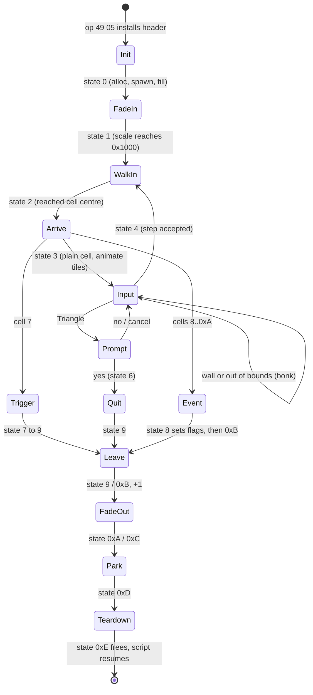

# Tile-board grid (puzzle / board minigame mode)

A discrete board mode inside the field overlay (`0897`). A field script hands
the engine a small grid; the game fills it with random tiles, and the player
then steps one cell per d-pad press - walls block, animated tiles cycle as
you walk, and reaching one of three event tiles (or a trigger tile) ends the
board and raises story flags. Each cell value also selects a field actor that
is drawn standing on that cell, so the board is built from actors, not from a
mesh.

**No retail scene installs a board.** A disc-wide census of every scene MAN
and event-script carrier finds no op-`0x49` sub-`5` site, so the mode is
script-reachable but unused on the shipped disc (see [Open](#open)).

**This is not town / field locomotion.** Towns use free movement through a
separate controller (`FUN_801d01b0`, see
[`field-locomotion.md`](field-locomotion.md)). The board shares the overlay and
also reads the pad, but its per-cell tile-actor rendering and procedural fill
set it apart.



## Where the board comes from

Field-VM op `0x49` **sub-op `0x05`** points the global `_DAT_8007b450` at a
board header carried **inline in the field-VM event script** (the "data is an
operand of the install op" pattern, as with encounter records - see
[`formats/encounter.md`](../formats/encounter.md)). The header is a **fixed
14-byte structure**: the install op advances the script cursor by a constant
`+0xe` regardless of `width x height`, so the cells are never carried inline
(see [always procedural](#always-procedural-no-inline-cell-boards)).
`_DAT_8007b450` points at byte `[1]`, the sub-op, so the `+N` offsets below are
opcode byte `[N+1]`:

```text
op byte:  [0]  [1]  [2]  [3]  [4]  [5]  [6]  [7]  [8]  [9]  [10] [11] [12] [13]
hdr off:   -   +0   +1   +2   +3   +4   +5   +6   +7   +8   +9   +A   +B   +C
         +----+----+----+----+----+----+----+----+---------+---------+----+----+
         | 49 | 05 | oX | oZ | w  | h  | rad|mode| base A  | base B  |plyr|tile|
         +----+----+----+----+----+----+----+----+---------+---------+----+----+
```

| From opcode | `_DAT_8007b450` offset | Meaning |
|---|---|---|
| `[0]` | - | opcode `0x49` |
| `[1]` | `+0` | sub-op `0x05` |
| `[2]` | `+1` | world tile origin X (added to `col`) |
| `[3]` | `+2` | world tile origin Z (added to `row`) |
| `[4]` | `+3` | board width (columns), `u8` |
| `[5]` | `+4` | board height (rows), `u8` |
| `[6]` | `+5` | draw/scan radius around the player |
| `[7]` | `+6` | mode flag (`0` = full-board draw, else windowed draw around the player) |
| `[8]`..`[9]` | `+7`..`+8` | event-flag **base A** (`u16` LE) - event-SET base |
| `[10]`..`[11]` | `+9`..`+0xa` | event-flag **base B** (`u16` LE) - TEST / already-done gate base |
| `[12]` | `+0xb` | player actor template id |
| `[13]` | `+0xc` | tile-actor template base id (one per drawable cell value) |

To scan a disc for boards, search the decompressed field scripts for the
two-byte prefix `49 05`.

Runtime state:

| Address | Content |
|---|---|
| `DAT_801f35c0` | the mutable `width x height` cell buffer (heap) |
| `DAT_801f35c8` / `DAT_801f35cc` | player cell column / row |
| `DAT_801f35d0` / `DAT_801f35d4` | walk target (world X / Z) |
| `DAT_801f35bc` | per-cell-value tile-actor table (`0x3c` bytes, ~15 entries; heap) |
| `DAT_801f35c4` | the saved camera octant `gp+0x2D8` |
| `DAT_801f35e0` | 2-byte-stride `(col, row)` of the three event tiles |

**Field overlay only.** Every install / walk-SM / fill / render site lives in
`0897` and is reached from the field/event VM. The `_DAT_8007b450` references in
the minigame overlays (`dance` / `slot_machine` / `baka_fighter` / `fishing`)
all sit inside one shared library function, `FUN_801e5b4c` - the
equipment/stat **comparison-panel renderer** (2228 bytes, byte-identical across
the `dance`/`cutscene`/`world_map`/`slot_machine` overlay dumps), which reads
`_DAT_8007b450` only as a boolean layout hint (`== 0` -> row pitch `0xe`, else
`0xd`). The dance-core functions (`FUN_801cf470` / `FUN_801d1af4` /
`FUN_801d231c`) do not touch it.

### Always procedural (no inline-cell boards)

Sub-op-5 boards are **always procedurally generated**. The op `0x49` case
advances the script cursor by a constant `+0xe` independent of
`width * height`, so the cell array can never be part of the operand stream:
at `0x801e093c..0x801e0948` the sub-op-5 arm is `beq v1,v0` (v0 = 5) then
`j 0x801e3624` with delay slot `addiu fp,fp,0xe`.

The cell buffer is heap-allocated at install: `DAT_801F35C0 =
FUN_80017888(0, width * height)` at `0x801EF3E8..0x801EF3F4`, with `width` and
`height` re-read from the header (`_DAT_8007B450[3]` / `[4]`) - exactly one
byte per cell, unpadded. `FUN_80017888` is the logging wrapper over the game's
allocator `FUN_8002B468` (a best-fit walk of a doubly-linked free list,
`(size + 3) & ~3` alignment, heap index in `a0`); its failure arm prints
`malloc err size %d` and bumps a byte counter at `gp+0x510`. The pointer has
exactly **one** writer in the disc corpus (12 references across 84 images, one
store), so this is the allocation.

The fill at **`0x801EF334`** (an interior label of the walk SM - see the
[address note](#address-note-there-is-no-fun_801e0b1c)) then runs three phases:

| Phase | Addresses | Behaviour |
|---|---|---|
| Base fill | `0x801ef418..0x801ef450` | `rand()%6 + 2` per cell, for `width * height` cells. The `%6` is a magic-multiplier divide (`lui s1,0x2aaa; ori s1,s1,0xaaab`), multiply-back `x6`, `subu`, then `addiu v0,v0,2`. |
| Animated tiles | `0x801ef484..0x801ef500` | Four cells, values **`0xB`, `0xC`, `0xD`, `0xE`** (`addiu a0,s3,0xb` with `s3` = 0..3), each placed at `rand() % (width * height)` - anywhere on the **whole** board. |
| Event tiles | `0x801ef508..0x801ef5b0` | Three cells, values `8` / `9` / `0xA`, placed at `col = rand() % width`, `row = rand() % ((height+1)>>1) + (height>>1)` - the **bottom half** only. |

The four animated tiles are four distinct values, not four `0xB`s, and only
the event tiles use the half-height modulus. The fill does not protect the
start cell, so a trigger tile dropped there ends the board on arrival.

The teardown state `0xE` frees the buffer and the tile-actor table
`DAT_801F35BC` through the matching wrapper `FUN_80017B94` (`0x801EFE78` /
`0x801EFE88`; it decrements the live-allocation count at `gp+0x488` that
`FUN_80017888` raises). The per-scene control-block reset zeroes
`_DAT_8007B450`, not this pointer.

## Cell value semantics

Cells are indexed `board[row * width + col]`.

| Value | Meaning |
|---|---|
| `2` | **wall** - destination cell `== 2` rejects the move |
| `3`..`6` | walkable terrain types; sets `_DAT_8007b5f0 = (v - 3) * 2` (step variant) - [the walker's octant store](#the-walkers-octant-store) |
| `7` | trigger; routes the walk SM to its exit |
| `8`..`10` | event tile; consumes header `+7`/`+9` as flag **bases** into the system-flag bank `DAT_80085758` ([event-cell flags](#event-cell-flags-state-8)), and the walker stops half a step short of its centre |
| `0xb`..`0xe` | animated tiles; every plain arrival cycles each one `0xb -> 0xc -> 0xd -> 0xe -> 0xb`, and standing on one writes the same `(v - 3) * 2` octant formula as `3`..`6` - [below](#the-walkers-octant-store) |
| other | plain walkable floor |

### The walker's octant store

Standing on a cell sets the camera octant that the pad remap rotates by - so
terrain types turn the controls. The cluster is six instructions at
`0x801EF8A4`..`0x801EF8CC` in the walk SM:

```text
801ef89c  lbu   s3, (v0)          ; the cell byte
801ef8a4  addiu v1, s3, -3        ; v1 = cell - 3, and it is NOT recomputed below
801ef8a8  sltiu v0, v1, 4         ; band 1: cells 3..6
801ef8ac  beqz  v0, 801ef8bc
801ef8b0  sw    zero, -0x4a10(a0) ; DELAY SLOT - always runs, taken or not
801ef8b4  sll   v0, v1, 1
801ef8b8  sw    v0, -0x4a10(a0)   ; gp+0x2D8 = (cell - 3) * 2
801ef8bc  addiu v0, s3, -0xb      ; band 2: cells 0x0B..0x0E
801ef8c0  sltiu v0, v0, 4
801ef8c4  beqz  v0, 801ef8d0
801ef8c8  sll   v0, v1, 1         ; DELAY SLOT - still (cell - 3) * 2
801ef8cc  sw    v0, -0x4a10(a0)
```

- The `sw zero` at `0x801EF8B0` sits in a branch **delay slot**, so every
  walkable cell clears the octant first; a cell outside both bands leaves it
  at 0.
- The second band's shift (delay slot at `0x801EF8C8`) reuses `v1`, still
  `cell - 3` - not `cell - 0xB`. So the animated tiles `0x0B`..`0x0E` store
  `16`, `18`, `20`, `22`, which the pad remapper's `& 7` folds onto octants
  `0`, `2`, `4`, `6`: the animated band aliases onto the even half of the
  `3`..`6` band.

`0x801EF320` saves the incoming `gp+0x2D8` into `0x801F35C4` on entry and
`0x801EFE7C` restores it on exit - a save/restore pair, not a third write.
The octant is a plain scene-authored word, not a camera reading - see
[script-vm-menuctrl.md](script-vm-menuctrl.md#0x4c-nibble-2---the-camera-octant--pad-rotation-setter)
for its complete writer/reader census.

## Tile <-> world coordinates

Each tile is `0x80` (128) world units; the actor sits at the tile centre:

```text
world_x = (header[+1] + col) * 0x80 + 0x40
world_z = (header[+2] + row) * 0x80 + 0x40
```

(walk SM case 4, target-position setup.)

## Walk state machine

The controller is a state machine on the controller actor's `+0x54`: fifteen
states, bounded by `sltiu 0xF` and dispatched through the jump table at
`0x801CF65C` (PROT 0897 image). Every arm falls into the
[render tail](#the-render-tail-0x801efea0) at `0x801EFEA0`.

| State | Entry | Role |
|---|---|---|
| `0` | `0x801EF310` | init: allocate the cell buffer + tile-actor table, spawn the player + tile actors from header ids, run the procedural fill at `0x801EF334`; its tail clears system flags `A..A+3` (`FUN_8003CE34`, `A` = header `+7`), seats the player cell at column `4`, row `0` (`sw` at `0x801EF634` / `0x801EF640`, without moving the actor) with the walk-in target `(hdr[1] * 128 + 0x240, hdr[2] * 128 + 0x40)` (`0x801EF650` / `0x801EF67C`), saves the octant `_DAT_8007B5F0` into `DAT_801F35C4` and zeroes `+0x9C` |
| `1` | `0x801EF680` | fade-in: `+0x9C += (d * 3) << 5` (`d` = `DAT_1F800393`), copied into every tile actor's `+0x72` render scale; at `0x1000` it clamps and goes to `2`, the walk-in |
| `2` | `0x801EFA88` | step the walker toward the target cell centre (`DAT_801f35d0`/`d4`), each axis clamped to `+-0x20`, facing the octant of the remaining delta; on arrival bind the idle clip and -> `3` - [the walk legs](#the-walk-legs-clip-cue-and-facing) |
| `3` | `0x801EF6FC` | arrival: cell `7` -> state `7`; cells `8..0xA` -> state `8`; otherwise every animated cell **on the whole board** steps `0xB -> 0xC -> 0xD -> 0xE -> 0xB`, then -> `4` |
| `4` | `0x801EF824` | **read input + collision + commit** - [below](#state-4---input-collision-commit) |
| `5` | `0x801EFBD0` | quit prompt (entered on the menu edge `_DAT_8007b874 & 0x10`, Triangle, which also sets `+0x9C = 0x1000` and the cursor `_DAT_8007BB88 = 1`): `FUN_80031D00`, then the two-choice picker `FUN_801E9DC8(0x8007BB88, 2, 1)` - Up/Down wrap (SFX `0x21`), confirm SFX `0x36`, cancel SFX `0x37`; confirm with `*0x8007BB88 == 0` -> `6`, confirm on row `1` or cancel back to `4` |
| `6`, `7` | `0x801EFC2C` | -> `9` (quit, trigger cell) |
| `8` | `0x801EFC38` | event cell: the flag writes below, then -> `0xB` |
| `9`, `0xB` | `0x801EFCD0` | `+0x54 += 1` |
| `0xA`, `0xC` | `0x801EFCE4` | fade-out: `+0x9C -= DAT_1F800393 << 8`, copied into every tile actor's `+0x72` except the event tile the player stands on (cell `8..0xA` under the player skips the slot of that value); below zero -> `0xD` |
| `0xD` | `0x801EFDA8` | park every tile actor at `(0x3FC0, 0x3FC0)` (`FUN_8003D344`), the same event tile excepted, -> `0xE` |
| `0xE` | `0x801EFE64` | teardown: free the cell buffer and the tile-actor table (`FUN_80017B94`), restore `_DAT_8007B5F0` from `DAT_801F35C4`, zero the scene control block's `+0x3E` |

Zeroing `+0x3E` is how the board ends: the op-`0x49` subsystem actor
(descriptor `0x8007065C`) polls it (`0x801F163C..0x801F16AC`), retires, and
sets `_DAT_8007B450 = 1`, which the parked op reads as "done" and advances past
its operand block.

Because state `0` seats the player cell at column 4 without moving the actor,
the walk-in (state `2`) walks the actor there from wherever it stood, and the
arrival pass then runs on the start cell. A board narrower than five columns
seats the player off its east edge.

### Event-cell flags (state 8)

With `v = cell - 8` and the two header bases read through the sign-extending
halfword reader `FUN_8003CE9C` (`A` = `+7`, `B` = `+9`), state 8 **sets** system
flag `A + v + 1` (`FUN_8003CE08`), **tests** flag `B + v` (`FUN_8003CE64`), and
when that test is clear also **sets** flag `A`. So each of the three event cells
owns one flag above the base, the base flag records "an event cell was
reached", and the `B` bank lets a script pre-mark cells whose reach should not
raise the base flag.

### State 4 - input, collision, commit

1. If the menu-button edge (`_DAT_8007b874 & 0x10`) is set, go to state `5`.
2. Read the pad `_DAT_8007b850` and remap it through `FUN_800467e8`, so
   "screen up" maps to the world direction the current octant names. The remap
   is a **quantized 45° rotation**: it isolates the direction bits
   (`mask & 0xf000`), finds their index in the 8-entry compass ring
   `DAT_800766fc` (diagonals included), and re-emits
   `ring[(index + gp[0x2d8]) & 7]`. `gp[0x2d8]` is the scene-authored octant
   ([the walker's octant store](#the-walkers-octant-store)).
3. Decode one direction from the remapped mask, in this priority order:

   | mask bit | delta |
   |---|---|
   | `0x1000` | `row + 1` |
   | `0x4000` | `row - 1` |
   | `0x2000` | `col + 1` |
   | `0x8000` | `col - 1` |
   | none | no move |

   Screen-up (`0x1000`) walks row `+1` - into the board from the row-`0` start
   cell - as `0x1000` walks `Z+` on the field.
4. Reject the move (bonk `FUN_80035bd0(0x23)`, stay put) when the candidate is
   out of bounds **or** `board[candidate] == 2`.
5. Otherwise accept: play the step cue (`FUN_80035b50(0x21)`), compute the
   target world position, commit `DAT_801f35c8/cc = candidate`, and go to
   state `2`. The target is the candidate cell's centre
   `((origin + idx) << 7) + 0x40` per axis, **except onto an event cell**
   (`8`..`0xA`, the unsigned `cell - 8 < 3` test at `0x801EFA0C`): there it is
   pulled back by half the step,
   `centre - (((origin + new) << 7) - ((origin + old) << 7)) * 4 >> 3`, so the
   walker stops on the edge it shares with the cell it came from
   (`0x801EFA1C..0x801EFA70`). The player cell is committed to the event cell
   all the same (`0x801EFA74..0x801EFA80`).

### The walk legs: clip, cue and facing

State 4's accept arm and state 2 each drive the walker's clip, and state 2
turns it (PROT 0897 image at base `0x801CE818`):

- **Accept** (`0x801EF990..0x801EF9D0`): the step cue through the ring's push
  producer (`FUN_80035B50(0x21)`), then the clip base `_DAT_8007BDD8 = 3` and
  the walker's clip id `+0x5C = leader * 7 + 3` (`sllv` by 3, minus the leader,
  plus 3), bound at once through `FUN_800204F8`. The arm stores state `2` at
  `0x801EFA84` and falls straight into it, so the first step moves on the
  accepting tick.
- **Refuse** (`0x801EF980`): the bonk through the overwrite producer
  (`FUN_80035BD0(0x23)`). State 4 re-reads the held pad every game tick, so a
  direction held into a wall repeats it at that rate.
- **Moving** (`0x801EFAFC..0x801EFBCC`): the remaining delta per axis is clamped
  to `+-0x20` and added to `+0x14` / `+0x18`, and `+0x26 = octant << 9` from the
  delta's signs - `0` for `(0, -)`, `1` `(-, -)`, `2` `(-, 0)`, `3` `(-, +)`,
  `4` `(0, +)`, `5` `(+, +)`, `6` `(+, 0)`, `7` `(+, -)`.
- **Arrived** (`0x801EFAC0..0x801EFAF8`, both deltas zero on entry): the base `2`
  and `+0x5C = leader * 7 + 2`, bound, then state `3`. No facing is written.

The clip id is the leader's stride plus the base, with neither the `4C CE`
override nor the `99` sentinel the field settle reads.

## Rendering

The board carries **no geometry or texture data** - only ids and dimensions. It
draws real field **actors** keyed by cell value: `DAT_801f35bc[cell]` selects
the actor for each cell. Slot `0` is the player, spawned from the header `+0xb`
template id; slots `2`..`14` are the tile actors, spawned from the header `+0xc`
base id as `header[+0xc] + (slot - 2)`. `DAT_801F35BC` is a **runtime** pointer
array the install fills, not a table of art on the disc. One actor backs each
cell value, so the renderer repositions it to each cell centre and draws it
there, cell after cell.

### The render tail (`0x801EFEA0`)

The renderer is not a function. It is the tail block of the walk SM
`FUN_801ef2b0`, entered by nineteen `j` / `beq` sites spread across the SM's
cases and running to that routine's own epilogue at `0x801F03E8`. Every case
ends by falling into one shared draw pass.

It opens by re-reading the SM state at `actor[+0x54]`. States `0` and `0xE`
draw nothing and return. State `5` - the confirm menu - first draws its panel:
a box through `FUN_8002C69C(0x64, 0x5C, 0x78, 0x28)`, three strings through
`FUN_80036888`, and a selection highlight through `FUN_8002B994` keyed on
`_DAT_8007BB88`. Every other state, and state `5` after its panel, falls into
the board pass, which forks on the header `+6` mode flag:

| Header `+6` | Draw set | Cells skipped | Fixed-slot pass after |
|---|---|---|---|
| `0` (full board) | every cell of the board | value `< 2` | no - returns straight to the epilogue |
| non-zero (windowed) | the `+5`-radius square around the player cell, clamped to `[0, width)` / `[0, height)` | value `< 2` **and** values `8`..`0xA` | yes |

Both arms walk rows outer / columns inner, step the world position by `0x80`
per cell rather than recomputing it, look the cell value up in
`DAT_801f35bc[value]`, store the position into the actor's `+0x14` / `+0x18`,
commit it through `FUN_8003d344` and draw through `FUN_8001b964`.

**The full-board arm advances its cell cursor only on a drawn cell.** The
windowed arm computes `row * width + col` per iteration, but the full-board arm
keeps a running index that it increments inside the draw branch, so a skipped
cell leaves it pointing at the same byte for the next `(row, col)`. No retail
board can show it: the fill never writes a value below `2`, so the skip branch
never runs.

**The fixed-slot pass** (windowed mode only) walks tile-actor slots `2`..`14`
once more. Slots `8`, `9` and `0xA` - the three event tiles - take their
`(col, row)` from the table at `DAT_801f35e0` and are positioned and drawn at
board coordinates. Every other slot is moved to `(0x3FC0, 0x3FC0)` and **not**
drawn, which stops the shared per-value actor from being left standing at the
last cell the board pass moved it to.

## Open

- **No retail scene installs a board.** Every partition record of all scene
  MANs (scripted-table + v12-embedded forms, walked with the field-VM
  disassembler) plus a raw byte-pair sweep finds zero op-`0x49` sub-5 sites.
  The [field-op census](../tooling/field-op-census.md) agrees:
  `asset field-op-census --only "49 05"` finds **0** clean occurrences, and its
  single non-clean decode (in `deene`'s event carrier) sits past a decode
  error.
- Consequently the intended per-cell tile *art* (the header `+0xc` template
  base) and the board-plane Y have no retail reference: no `+0xc` value exists
  on the disc to read. Only a live capture of a debug-menu entry into the mode,
  recording the installed header's `+0xb`/`+0xc` and the board-plane Y, could
  pin them.

## Port notes

[`legaia_engine_minigames::tile_board`](../../crates/engine-minigames/src/tile_board.rs)
holds the board, header parse, procedural fill, octant / step decode and event
flag writes; `legaia_engine_core::tile_board` re-exports it and adds the
per-cell draw assembly, which reads the `World`; `World::tick_tile_board` runs the
walk SM off op `0x49` sub-5. The play-window's `LEGAIA_TILE_BOARD_DEMO=1`
synthesizes a retail-shaped install near the player, since no scene provides
one.

## Evidence

- Install: field-VM op `0x49` in `ghidra/scripts/funcs/overlay_0897_801de840.txt`
  (`_DAT_8007b450 = pbVar47` arms the header pointer).
- Walk SM: `overlay_0897_801ef2b0.txt`, jump table read from the PROT 0897
  image; a denser duplicate of the state-4 logic appears inside
  `overlay_0897_801f7b88.txt`.
- Render tail: `overlay_0897_801efea0.txt`.
- Pad remap: `800467e8.txt`.
- Minigame references: `overlay_dance_801e5b4c.txt`.
- Single writer of `DAT_801f35c0`: `find-gp-relative-refs.py --va 0x801f35c0`.

#### Address note: there is no `FUN_801e0b1c`

The procedural fill was once cited as `FUN_801e0b1c`. **That address is not a
function.** The dump filed under that name was produced against the field
overlay loaded at base `0x801C0000` instead of its correct base `0x801CE818`,
so every address in it is short by exactly `0xE818`:
`FUN_801e0b1c + 0xE818 = 0x801EF334`. At VA `0x801e0b1c` the field overlay
actually holds `addiu v0,v0,-5`, part of an unrelated operand-nibble table
lookup. `0x801EF334` is not a function entry either - it is an **interior label
of `FUN_801ef2b0`** (the walk SM), promoted to a fake `FUN_` entry by the
label-call idiom. Likewise `FUN_801E0F3C`, once cited for the board renderer,
is the same `+0xE818` print of the [render tail](#the-render-tail-0x801efea0)
`0x801EFEA0`, and `overlay_0897_801e0f3c.txt` is a second print of its
instructions.

The walk SM's extent is `0x801ef2b0..0x801f03ec`: the epilogue at
`0x801F03E8` (`jr ra` / `addiu sp,sp,0x48`, unwinding the
`addiu sp,sp,-0x48` at the entry), 1104 instructions from the top. Not
`..0x801efe9c` - that stops at the last instruction *before* the render tail
and cuts the routine's whole draw half out of view.

`func_0x800204f8`, also called on the install path, is the move-table consumer,
not an allocator.

## See also

**Reference** -
[Field locomotion](field-locomotion.md) ·
[Field/event VM](script-vm.md) ·
[Encounter record](../formats/encounter.md)
