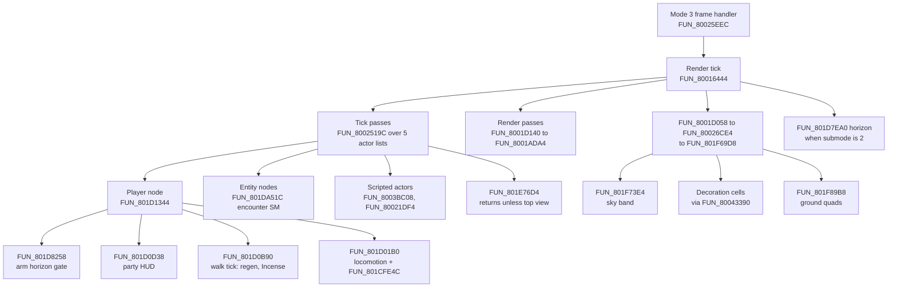
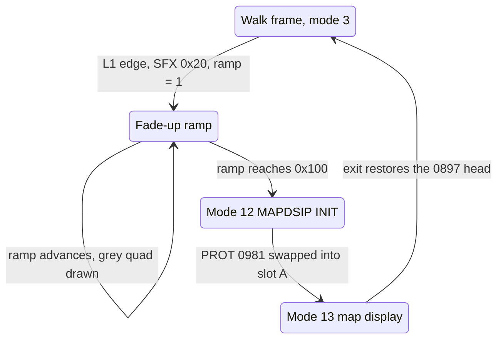
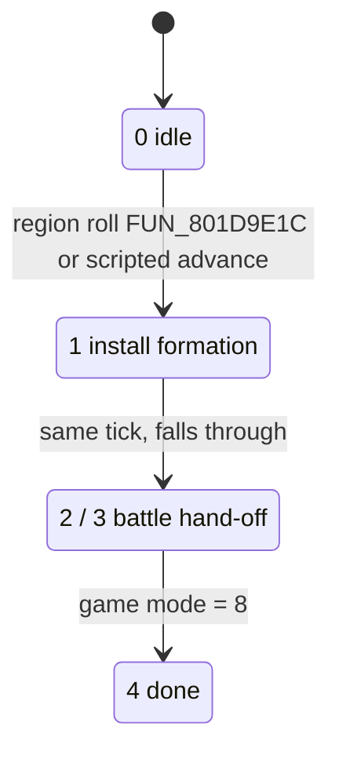
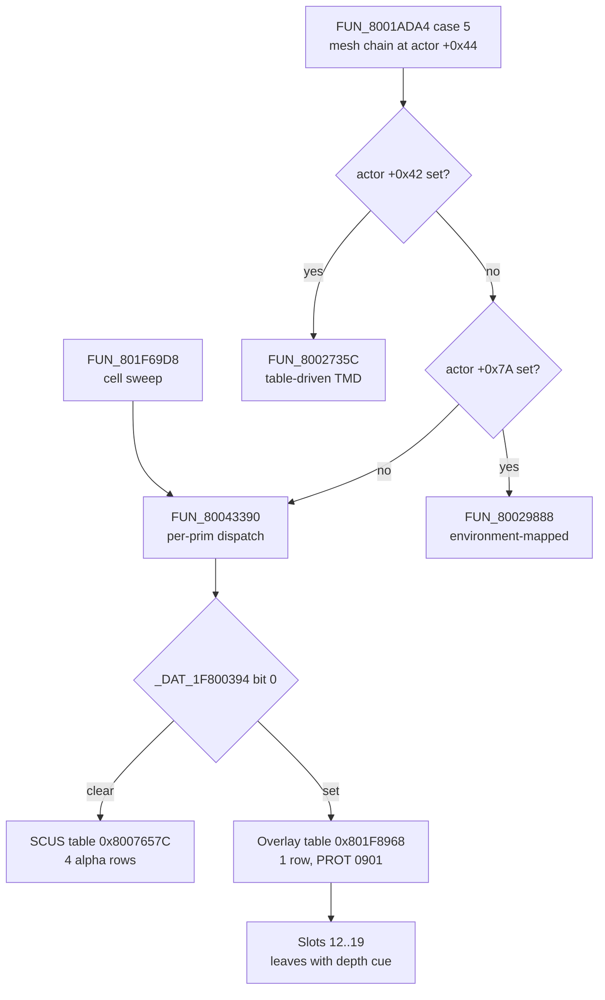

# World Map Subsystem

The world map is the overworld you walk between towns and dungeons: three
kingdom scenes (`map01` Drake, `map02` Sebucus, `map03` Karisto). In retail it
is **not a separate engine mode**. A kingdom map is an ordinary field scene
(game mode `0x03`) that runs the field overlay (PROT 0897) with a few inputs
changed: a smaller, slower player, a heightfield ground with per-cell textures,
a sky band, region-keyed random encounters, and town entrances carried by
walk-on triggers. What *is* world-map-specific is small: the top-down map
display with its place labels (PROT 0981), a debug top-view toggle with a
developer menu, and the PROT 0901 draw kernels.

This page covers the retail routines (addresses, tables, formulas) and how the
Rust port implements each. The static-site WebGL viewer of the same data is a
separate page, [`world-overview-viewer.md`](world-overview-viewer.md). The
function directory for this subsystem is
[`reference/functions/world-map.md`](../reference/functions/world-map.md).

Terms used throughout: **PROT** = an entry of the disc's `PROT.DAT` archive;
**overlay** = a code image loaded from PROT into RAM at `0x801C0000+`;
**MAN** = a scene's script / placement file (partitions `P0` object binds,
`P1` actor placements, `P2` event records); **`.MAP`** = a scene's
`0x12000`-byte grid file ([`field-map.md`](../formats/field-map.md));
**GTE** = the PSX geometry coprocessor; **CLUT** = a 16-colour palette row in
VRAM; **OT** = the GPU ordering table.

## At a glance

| Piece | Retail | Port |
|---|---|---|
| Walk frame | Field chain `FUN_801D1344` -> `FUN_801D01B0`, collision `FUN_801CFE4C` | `World::tick_world_map`, `step_world_map_locomotion`, `advance_with_collision` |
| Walk camera | Field zone camera (`FUN_801DAB90` / `FUN_801DB510`) | `camera::zone_camera_scene`, `FieldCameraFrame::WorldMapWalk` |
| Random encounters | Region roll `FUN_801D9E1C` | `World::live_world_map_tick`, `set_world_map_regions` |
| Entity / encounter SM | `FUN_801DA51C` | `legaia_engine_vm::world_map::step` |
| Town / dungeon entrances | `.MAP` walk-on trigger -> MAN `P2` record -> field-VM `0x3F` | `OverworldPortal` entities, `overworld_portal_sites` |
| Ground | `FUN_801F89B8` (PROT 0901), heights via `FUN_80019278` | `Scene::walk_heightfield`, `build_ground_heightfield` |
| Decorations / landmarks | `FUN_801F69D8` cell sweep; `FUN_8003A55C` placed actors | `parse_walk_decorations`, `walk_object_placements` |
| Sky band | `FUN_801F73E4` | `world_map_sky`, `screen_prim::sky_band_prims` |
| Water shimmer | Kingdom-bundle slot-5 CLUT-walk table, `FUN_8001ADA4` case `0xB` | `clut_walk_anim::ClutWalkAnim` |
| Horizon plane | `FUN_801D7EA0` | `world_map_horizon::emit_horizon` |
| Map display (L1) | Fade ramp `FUN_800196A4`, modes 12 / 13, PROT 0981 | Arm + ramp modelled (`WorldMapEntryFade`); the screen itself is not ported |
| Top-view debug + dev menu | `FUN_801E76D4`, `FUN_801EAD98` | `WorldMapController`, `DevMenuSession` (opt-in) |
| Pause / panel actors | `FUN_801ED308` and five siblings | `world_map_panel_actors`, `PanelActorHost` |

Both play hosts (native `play-window` and the browser play page) walk the
overworld, enter and leave towns, roll encounters, and draw ground, landmarks,
sky, water shimmer and the distance cue through shared kernels. Two things are
not there: the L1 map display (retail's PROT 0981 screen with the place
labels), and retail's top-view camera - the port's debug top view uses a
synthetic framing.

## Contents

- [How a world-map frame runs](#how-a-world-map-frame-runs)
- [Overlay structure](#overlay-structure)
- [Top-view debug controller and developer menu](#key-functions) - controller, dim pass, place labels, dev menu, panel window system, panel actors, party HUD, save-screen hand-off
- [Entity tick and encounters](#fun_801da51c---world-map-entity-tick) - encounter install, the port's entity roles, NPC dialogue text
- [Walking the overworld](#walking-the-overworld) - movement, speed, collision, axes, walk camera, system script
- [Scenes and entrances](#scenes-and-entrances) - placement table, destinations, the Drake hub, `.PCH`-carried exits
- [Terrain and geometry](#terrain-and-geometry) - pool loading, mesh resolver, heightfield, sky band, ground texturing, water
- [Render pipeline](#render-pipeline) - frame dispatch, horizon emitter, per-prim tables, actor passes
- [Globals used](#globals-used)

## How a world-map frame runs

The overworld's per-frame chain is the field one. The mode-3 frame handler
reaches the SCUS render tick `FUN_80016444`, which walks the actor lists
(tick, then render) and calls the terrain sweep. The player's node runs
`FUN_801D1344`, the same master handler a town runs.



`FUN_801D1344`'s calls, in address order: `jal 0x801D8258` at `0x801D1470`,
`jal 0x801D0D38` at `0x801D1660`, `jal 0x801D0B90` at `0x801D16EC`,
`jal 0x801D01B0` at `0x801D16F4`.

### Entering the map display

The top-down map with place labels is a separate game mode, entered from the
walk frame:



- **Arm.** In the locomotion controller `FUN_801D01B0`
  (`0x801D01F8..0x801D0238`): when the per-scene byte `_DAT_8007B6A8` is set
  (the three kingdom maps) and the newly-pressed word `_DAT_8007B874 & 0x4`
  (packed L1) is up, it cues SFX `0x20` (`FUN_80035B50`) and stores `1` to the
  ramp `_DAT_8007BAF4`.
- **Ramp.** While the ramp is non-zero `FUN_801D1344` suppresses locomotion
  (`player+0x10 |= 0x80000`) and ticks `FUN_800196A4` instead. That routine
  adds `DAT_1F800393 << 5` per frame, draws a full-screen grey quad
  (`FUN_80024EE4(1, 2, grey * 0x010101)`, grey clamped to `0xFF`), and on
  reaching `0x100` parks the ramp at `0xFF` and stores game mode
  `_DAT_8007B83C = 0xC`.
- **Swap.** Mode 12 loads PROT 0981 over the field overlay's head and its
  init sets mode `0x0D`; see
  [per-frame dispatch](#per-frame-dispatch-scus-resident).

Port: `WorldMapController` models the arm and the ramp
(`WorldMapEntryFade`, port of `FUN_800196A4`) and raises
`map_display_requested` when the ramp completes. No host consumes it: the
engine has no map-display mode, so L1 on the overworld plays the cue and
returns to the walk.

Because the overworld is a field-run scene, the pause menu opens there through
the field path too - the Save row is legal only on the three kingdom scenes
([`save-screen.md`](save-screen.md#where-the-save-rows-pad-route-is)).

## Overlay structure

Two capture variants are paged into `0x801C0000..0x801EFFFF`:

| Variant | First prologue | What it is |
|---|---|---|
| Normal walk (`overlay_world_map`) | `0x801CFC40` | The field overlay in a kingdom scene (mode `0x03`) |
| Top view (`overlay_world_map_top`) | `0x801CE850` | The map display (mode `0x0D`), PROT 0981 in slot A |

The walk variant is the field overlay itself: the world map is a PROT
0897-hosted *mode*, not an overlay of its own, and the `overlay_world_map_*`
capture dumps are byte-identical to `overlay_field_0897.bin` (base
`0x801CE818`) at the same VAs. Both variants share the field VM
(`FUN_801DE840`), the move-VM extension (`FUN_801D362C`) and all rendering
helpers. Resolve addresses against the extracted image rather than a capture
dump; see [`dump-corpus-integrity.md`](../tooling/dump-corpus-integrity.md)
for the two mis-based dump clusters.

The image extends past `0x801F0000`: PROT 0897 runs to `0x801F3817`, and the
PROT 0901 prim-mode dispatch table at `0x801F8968` with its eight emit leaves
sits at `0x801F7644..0x801F8690`. Capture with the wide window
`0x801C0000..0x801F9000` (228 KB), the default of
`scripts/ghidra-analysis/extract-mednafen-overlay.py`; a 192 KB window clips
both.

### The top-view image on the disc is PROT 0981

The top-view variant is the **map display** module: a PROT entry of its own,
**extraction 0981**, a
`0x1000`-byte slot-A image at `0x801CE818`
(`crates/asset/data/static-overlays.toml`). Its `monster_test` label is CDNAME
inheritance - the block opens at extraction 0978 and names run forward
([`cdname.md`](../formats/cdname.md#numbering-space)). Its operands are
world-map ones throughout: the location table pointer `DAT_80073EE0`, the
kingdom filter `uRam8007b970`, the camera translation pair `_DAT_80089118` /
`_DAT_80089120` and the eye-space `TR` trio `0x800840B8`. The bytes at
`0x801CE9C4` (the place-label arm) occur in no other PROT entry.

The image holds **one framed function and three frameless leaves**:

| Entry | Bytes | What it is |
|---|---|---|
| `0x801CE850` | 3164 | The top-view tick, and the prologue the table above names. A six-arm mode dispatcher: `sltiu a0, 6` against the mode word `0x801CF76C`, table at `0x801CE838`. All six arms are `jr $v0` targets inside this one body - `0x801CE9C4` is an arm, not a function head. |
| `0x801CF4AC` | 316 | Enter / reset. Zeroes the mode word, sets the record cursor `0x801CF77C` and its neighbour to `-1`, and snapshots the live world-map state - the `0x800840B8` quad, the scroll trio `0x8007B790`, the camera pair `0x80089118`, the projection word `0x8007B6F4` and four scratchpad bytes - into the image's own zeroed block at `0x801CF70C..0x801CF790`. Sets the game-mode word `0x8007B83C = 0x0D`. |
| `0x801CF5E8` | 144 | The location-record stepper. Walks the `DAT_80073EE0` table (count byte at `[0]`, `0x20` stride) up or down by `a0` until a record's `region` matches `uRam8007b970`, wrapping on the count, and stores the index back. |
| `0x801CF678` | 112 | The camera clamp: bounds `_DAT_80089118` to `[-0x3380, -0xD00]` and `_DAT_80089120` to `[-0x3580, -0xC00]`. |

None of the four is ported; the engine has no map-display mode (see
[entering the map display](#entering-the-map-display)).

PROT 0981 and PROT 0897's head never coexist: they are alternative occupants
of slot A. The mode-12 handler swaps 0981 in over 0897's first `0x4000` bytes
and restores them on exit ([per-frame dispatch](#per-frame-dispatch-scus-resident)).

## Key functions

This section covers the top-view debug controller, the developer menu and the
panel actors that share the band. All of it is field-overlay code (PROT 0897)
unless noted.

### `FUN_801E76D4` - top-view debug controller (9320 bytes)

Entry: `(ctx_ptr)`. A debug controller, **not the overworld's per-frame
update**, and separate from the L1 map display above: its top view is a flag
flip inside the walk overlay, behind a debug flag. It handles:

1. **Top-view toggle.** Fires when `_DAT_8007B98C != 0` (debug flag) and
   `_DAT_8007B850 == 0x4A` (pad mask) and `_DAT_8007B874 == 0x40` (held mask).
   On trigger: `DAT_801F2B94 ^= 1`, the actor camera position is captured into
   `_DAT_801F35A8/AA/AC`, `ctx[+0x54]` and `ctx[+0x50]` are cleared, and
   `FUN_80035C10` is called.
2. **Top-view camera controls** (while `DAT_801F2B94 != 0`):
   - `_DAT_8007B850 & 0x1000` / `0x4000` (Up / Down): `_DAT_80089120 -= 8` / `+= 8` (**Z** scroll)
   - `_DAT_8007B850 & 0x2000` / `0x8000` (Right / Left): `_DAT_80089118 -= 8` / `+= 8` (**X** scroll)
   - `_DAT_8007B850 & 0x20` / `0x80`: `_DAT_8007B794 += 0x14` / `-= 0x14` (azimuth)
   - `_DAT_8007B850 & 8` / `2`: `_DAT_8007B6F4 -= 4` / `+= 4` (zoom / height)
   - `DAT_801F2B95 & 1` enables the [screen-dim pass](#fun_801e75dc---top-view-screen-dim-pass-248-bytes); `& 2` is a second flag.

The toggle compares both pad words for **equality** (`li v0,0x4a; bne` at
`0x801E7710`, `li v0,0x40; bne` at `0x801E7724`), so any extra held button
cancels it. The masks are packed pad bits: `0x4A` = Cross | R1 | R2, `0x40` =
Cross.

<a id="there-is-no-normal-walk-path-here"></a>
**There is no walk path in it.** With `DAT_801F2B94 == 0` the test at
`0x801E779C` jumps to `0x801E9B14`, the function's own epilogue, so the
routine does nothing. Since the toggle needs the debug flag retail leaves
clear, that is the only path retail takes:

```text
801e7794  lbu   v0,0x2b94(v0)     ; DAT_801F2B94 (top-view flag)
801e779c  beq   v0,zero,0x801e9b14
...
801e9b14  lw    ra,0x44(sp)       ; <- the epilogue
801e9b34  jr    ra
```

Port: `WorldMapController` (`crates/engine-field`) carries the toggle, scroll,
azimuth and zoom, gated on its `debug_enabled` flag.

### `FUN_801E75DC` - top-view screen-dim pass (248 bytes)

Takes no arguments and reads no state. It posts three primitives into the OT
at `*(0x1F800314 + 0xE0) + 8`, allocated off the scratchpad prim-pool cursor
at `0x1F800314 + 0x8C`:

| # | Packet | Bytes | Construction |
|---|---|---|---|
| 0 | `DR_MODE` | 12 | `SetDrawMode(p, dfe=0, dtd=0, tpage=0x1E, tw=NULL)` via `FUN_80059010` |
| 1 | `POLY_F4` | 24 | tag `0x05000000`, GP0 word `0x2A808080` whose three colour bytes are then zeroed |
| 2 | `DR_MODE` | 12 | `SetDrawMode(p, dfe=0, dtd=1, tpage=0x1E, tw=NULL)` |

GP0 `0x2A` is a flat, untextured, semi-transparent quad; three
`sb zero, 4/5/6` stores at `0x801E7674` make it black. `tpage = 0x1E` selects
blend mode `ABR = 0` (`0.5*back + 0.5*front`), so the pass is a **50% screen
darken** behind the top-view panels. The quad's vertices are literals at
`0x801E764C..0x801E7670`: `(0, -4)`, `(320, -4)`, `(0, 224)`, `(320, 224)`.

The table is **posting** order (`jal 0x8003D2C4` at `0x801E7620`,
`0x801E7684`, `0x801E76B8`). `AddPrim` (`FUN_8003D2C4`) inserts at the head of
the OT entry, so the GPU runs them in reverse: the `dtd = 1` `DR_MODE`, the
quad, then the `dtd = 0` one. The quad is drawn with dither on, and dither is
left off behind it.

The bytes are at PROT 0897 file offset `0x18DC4`. The single call site is the
branch pair at `0x801E7794..0x801E77B8` inside `FUN_801E76D4` (top view on
**and** `DAT_801F2B95 & 1`), so retail reaches it only behind the debug flag.

Port: `legaia_engine_vm::world_map_dim::emit_screen_dim`, gated by
`WorldMapController::run_screen_dim` and called once per frame from the
world-map tick.

### The place-label pass - `0x801CEBB6..0x801CEC30`

The named markers drawn over the map ("Rim Elm", "Sol Tower", ...) come from a
per-frame loop over the **world-map location table**: the trailing data of the
kingdom scene MAN, reached through the section pointer `DAT_80073EE0` the MAN
walker installs. Byte layout and the other two carriers a place name has are
on [`place-names.md`](../formats/place-names.md).

Per record (`0x20` bytes: region, map x, map y, discovery flag, 24-byte name):

| Step | Call | Note |
|---|---|---|
| Kingdom filter | `record.region == uRam8007b970` | all three kingdom MANs carry the *whole* 29-record table; `region` is what selects the visible subset |
| Discovery gate | `FUN_8003CE64(record.discovery_flag)` | `_DAT_8007B868` (debug show-all) bypasses it |
| Place | `FUN_8003D368((x << 7, y << 7))` | the record's map cell projected to screen |
| Draw | `FUN_80036888(&record.name, 0, 0, screen)` | the shared glyph renderer |
| Underline | `FUN_8002C69C(x, y, FUN_80035F04(&name), 8)` | width measured off the same string |

A marker's label, position and visibility are one record. Renaming a place is
a same-size overwrite of its 24-byte name field, which the
[randomizer](../tooling/randomizer.md#location-names) does in all three
kingdom MANs at once. See `ghidra/scripts/funcs/overlay_world_map_top_801ce9c4.txt`.

### `FUN_801EAD98` - world map debug menu renderer (7280 bytes)

Entry: `(ctx_ptr, x, y, scroll_idx, max_visible)`. Renders the vertically
scrolling developer menu list. String table at `0x801CF344..`:

| Index | Label |
|---|---|
| 0 | `MAP CHANGE` (or `CLOSED` when `_DAT_8007B868 != 0`) |
| 1 | `CARD OPTION` (or `CLOSED`) |
| 2 | `PLAYER STATUS` |
| 3 | `CAMERA` - the follow switch `_DAT_8007B606` as `OFF` / `ON`; while on, the region box `0x1F800384` as two averages (`000 000` for the whole-map sentinel). See [the CAMERA row](#the-camera-row). |
| 4 | `ENCOUNT` - shows encounter rate from `DAT_8007B5F8` |
| 5 | `OTHER SETTINGS` |
| 6 | `BGM CALL` - shows `_DAT_801F2E90` as `00` |
| 7 | `DEBUG` |
| … | At least 24 entries total (bounds check `local_40 > 0x17`) |

Called by `FUN_801ECA08` when the panel's `ctx[+0x54]` phase resolves to 1
or 3.

The renderer and its strings are both in the field overlay (extraction 0897,
uncompressed, base `0x801CE818`): the label run sits at file offset `0xB2C`,
and `$a0 = 0x801CF344` is formed by two `lui`/`addiu` pairs inside the body
(`0x801EAE44`/`0x801EAE48` and `0x801EB320`/`0x801EB324`). `0x801CF344` is a
slot-A address, and in PROT 0981 that VA is code, so score the table against
0897 only. A `map03` overworld state's `0x801CE818..0x801D0000` window is
byte-identical to the first `0x17E8` bytes of
`extracted/overlays/overlay_field_0897.bin`, labels included.

#### The CAMERA row

Row 3 is the follow-camera switch `_DAT_8007B606` - the byte `FUN_801DB510`
tests before it composes and eases. Its only writers after new-game init are
this row's two arms:

- `FUN_801E9F64`'s row-3 edit arm (`0x801EA1A4`, table `0x801CF294` entry 0)
  flips it on either horizontal edge (`_DAT_8007B874 & 0xA000`, packed
  Right | Left) and, while it is on, snaps the camera (`FUN_801DB8EC` then the
  edge clamp `FUN_801DAA50`).
- The `FUN_801EA9B0` table's row-3 arm (`0x801EAD20`) flips it too.

`FUN_801EAD98`'s row-3 arm draws one of two 8-byte strings at `0x801F318C`
(`OFF`, `ON`) indexed by the switch. With the switch on it adds the
walk-region box readout: it loads `0x1F800384` (`lw v1,0x70(a3)`,
`a3 = 0x1F800314`), draws `000 000` for the whole-map sentinel `0x7F7F0000`,
and otherwise prints `(box[0] + box[2]) >> 1` and `(box[1] + box[3]) >> 1`
three digits wide - the centre tile of the box, not a camera angle (the arm
forms neither `_DAT_80089120` nor `_DAT_80089118`). Port: `DevMenuRow::Camera`
(`camera_row_readout`), writing the switch to `ZoneFollow::follow_enabled`.

**The CLOSED gate is a string selection.** Cases 0 and 1 of `FUN_801EAD98`
read `_DAT_8007B868` and branch on zero (`0x801EAE40` / `0x801EB31C`), loading
the row's own label on the zero leg and `CLOSED` on the fall-through; no other
arm consults it. `DevMenuSession::row_label` is that selection.
`DevMenuSession::closed_gate` is a host input that defaults to `0` (nothing in
the engine publishes `_DAT_8007B868`), so every row draws its name, as retail
does with the gate clear.

### `FUN_801ECA08` - world map panel sizer / list picker (256 bytes)

Entry: `(ctx_ptr, row_start, row_end, col_idx)`. Sizes the panel, then runs a
vertical list picker over rows `row_start..=row_end`.

Sizing, with `rows = row_end - row_start + 1`, into the 28-byte panel
descriptor at `0x801F2B98 + col_idx * 28`:

| Descriptor field | Value |
|---|---|
| `+0x08` | Panel x (read back, used as `x + 4` for the cursor sprite). |
| `+0x0A` | Panel y = `0xD0 - rows * 8` (bottom-anchors a 208-pixel viewport). |
| `+0x0E` | Panel height = `rows * 8`. |

The picker's cursor row is `ctx[+0x9E]`, the phase `ctx[+0x54]` (6-way jump
table at `0x801CF4CC`):

| Phase | Behaviour |
|---|---|
| 0 | Seed cursor `= row_start`, open the panel, `phase++` - then **falls through** into phase 1. |
| 1 | Cursor up (`0x1000`) / down (`0x4000`) with SFX `0x21`, wrapping at both ends; confirm → SFX `0x37`, phase 2; cancel → SFX `0x36`, phase 3. |
| 2 | Confirm settle - clears `DAT_801C6EA4[+0x3E]`. |
| 3 | Cancel unwind via `FUN_801EA9B0`. |
| 4 | Teardown - restores the saved selection and resets phase to 0. |

Cursor wrap is a **swap, not a clamp**: below `row_start` jumps to `row_end`
and above `row_end` jumps back to `row_start`. Input is suppressed entirely
while `_DAT_8007BB80 != 0`.

The list is drawn by `FUN_801EAD98(ctx, x, y, row_start, row_end)`, gated on
the phase / helper product being `1` or `3`: phase 1 draws while input is
allowed, phase 3 always draws, phases 2 and 4 never draw. Phase 3 is
unconditional because its multiplicand, `FUN_801EA9B0`'s return, is the
constant `1` (`s1` is loaded in the delay slot of the bound check at
`0x801EA9D0`, and every arm, including the out-of-range one at `0x801EAD7C`,
exits through `move v0,s1`).

#### Engine port

The renderer-free dev-menu leaves live in
`legaia_engine_vm::world_map_overlay`:

- `panel_geometry`, `dev_menu_cursor_step` (swap-wrap), `list_body_draws` (the
  phase x gate draw gate);
- `DevMenuRow` + `is_closed` (the 24-row model, including the `MAP CHANGE` /
  `CARD OPTION` CLOSED gating);
- `format_fixed_decimal` (the zero-padded digit kernel `FUN_801EAD98` inlines
  per numeric readout) and `decode_camera_readout`;
- the battle-records data model (`records_screen`, from `FUN_801ED710`) and
  the equipment stat-comparison kernels (`aggregate_slot_stats` /
  `resolve_equip_slot` / `stat_deltas`, from `FUN_801E5B4C`).

The cursor step is named `dev_menu_cursor_step` rather than `cursor_step`
because `legaia_engine_core::baka_cabinet` has a free function of that name
and the port catalog's reachability pass identifies free functions by name
([`stale-not-wired-triage.md`](../tooling/stale-not-wired-triage.md)).

The host is `legaia_engine_core::dev_menu_host::DevMenuSession`, the engine's
opt-in developer screen. Its row list is the subset whose backing state the
engine owns; each row carries retail's own list index
(`DevMenuRow::retail_index`), so the CLOSED gate, row formatter, panel
geometry, cursor step and draw gate are all retail's kernels. Rows of retail's
list the engine keeps no state for have no consumer. Both hosts drive the
screen through `DevMenuSession::tick_host(world, camera, edge, held)`, which
also carries the `CAMERA` row's state in and out.

The **draw** half - retail's GPU-packet emitters `FUN_8001AA68` /
`FUN_80034B78` / `FUN_80034E4C` / `FUN_8003C1F8` / `FUN_8003CC98` - lives in
`engine-ui`. `records_screen_draws_for` ports the
`FUN_801ED710` layout (nine heading rows, six per-character categories x three
columns, the `H:MM:SS` play clock and the treasure line) from the ported model
plus caller-supplied labels; `records_screen_fields` is the structured
emit-order intermediate the unit tests assert. `dev_menu_list_draws_for` ports
the `FUN_801EAD98` row loop geometry (label column `x + 8`, 8-px row pitch,
the `0x17` clamp). The per-character portrait / separator icons
(`FUN_8002C488`) are a UI-icon-atlas sprite the host supplies, as with the
status page's LV/HP/MP icons.

The escape-timer scheduler `FUN_801D2EBC`, a leaf of the same overlay, has its
own module `legaia_engine_vm::escape_timer`: the field VM's `0x4C 0xD3`
installer reaches `World::schedule_timed_flags` and
`World::tick_escape_timer` drains the counter once per retail frame
([`script-vm-menuctrl.md`](script-vm-menuctrl.md#0x4c-nibble-0xd00xdf---party-state--inverted-y-mirror-cluster)).

### The panel window system - `FUN_801E9B3C` / `FUN_801E9DC8` / `FUN_801EA9B0`

The dev menu and the window-owning panel actors do almost no window work
themselves. Three shared leaves carry it, all in PROT 0897.

Which actors reach them is not uniform. `FUN_801ED590`, `FUN_801EE5D4`,
`FUN_801EE90C` and `FUN_801EF014` run panel scripts through `FUN_801E9B3C`;
only `FUN_801ED590`, `FUN_801EE90C` and `FUN_801EF014` read the pad through
`FUN_801E9DC8`. `FUN_801ED308` (brightness ramp) and `FUN_801EDF00` (records
screen) call neither. The actors are described
[below](#the-panel-actor-state-machines).

#### `FUN_801E9B3C` - panel command-script interpreter (652 bytes)

Entry `(script_ptr)`. Walks a table of 8-byte records until one reads zero:

| Field | Type | Role |
|---|---|---|
| `+0x00` | `u16` | Opcode. `0` terminates the script. |
| `+0x02` | `i16` | Panel index into the descriptor array at `0x801F2B98`. |
| `+0x04` | `u32` | Operand. Position arms read it as packed `(x = lo, y = hi)`. |

The arm index is `(i16)(op - 1)` bounded by `sltiu ..,0xd`, dispatched through
the 13-entry table at `0x801CF25C`. Both cursors advance by 8 on every path,
including the default arm, so a record is always consumed exactly once.

| `op` | Arm |
|---|---|
| 1 | Ensure the panel exists, place it at `desc[+0x08]` / `desc[+0x0A]`. |
| 2 | Ensure the panel exists, place it at the operand position. |
| 3 | Store the operand's low byte into the window object's `+0x1D`. |
| 4 | Close this panel (`FUN_80035978`). |
| 5 | Close every panel (`FUN_80035A4C`). |
| 6 | Zero the window object's `+0x20` halfword. |
| 8 | Retire the panel's actor (`FUN_800319A8`). |
| 9 | Snap (`FUN_800358C0` writes source and target alike and clears `+0x20`) to the operand position, or to the descriptor position when the operand is zero. |
| 10 | Retire and respawn, sliding back to the live object's own `+0x0A` / `+0x0C`. |
| 12 | Resize the party panel, then recurse into the nested script at `0x801F3170`. |
| 7, 11, 13, `> 13` | Shared default - the record is consumed and nothing happens. |

"Ensure the panel exists" is the `FUN_80035334(idx)` lookup followed, on a
miss, by `FUN_80032434(idx, &desc[idx])`.

The `op 12` party arm reads the live party count at `0x80084594` and writes
descriptor 7's height (`+0x0E`) `= members * 56 - 7` and its `y` (`+0x0A`,
mirrored at `+0x12`) `= 202 - height`: the panel is bottom-anchored at 202.

Confidence: the arm-to-opcode mapping is Ghidra's resolution of the jump
table; the arm bodies, the bound, the record stride and the party arithmetic
are read from the instruction stream.

#### `FUN_801E9DC8` - shared vertical list cursor (412 bytes)

Entry `(cursor_ptr, count, wrap)`, returns `0`/`1`/`2`/`3`. `FUN_801EE90C`
invokes it as `(0x8007BB88, 2, wrap = 1)`; `FUN_801EF014` drives its
destination list through it.

The two action buttons are tested first, against the **held** mask
`_DAT_8007B874` and the two configurable button masks at `0x800846D0` /
`0x800846D4`; either returns immediately (SFX `0x36` -> `1`, SFX `0x37` ->
`2`) without touching the cursor. Then Up (`0x1000`) and Down (`0x4000`) are
tested against the **newly-pressed** mask `_DAT_8007BB84`, both without an
`else`, so a frame carrying both edges runs both steps.

| | `wrap == 0` | `wrap != 0` |
|---|---|---|
| Up | only when `cursor > 0` | always; `0` jumps to `count - 1` |
| Down | only when `cursor + 1 < count` | always; `count` folds to `0` |
| SFX `0x21` | only when the cursor actually moves | on every press |

#### `FUN_801EA9B0` - dev-menu row-action dispatcher (1000 bytes)

Entry `(ctx)`. Bounds `ctx[+0x9E]` against `0x18` and dispatches through the
24-entry table at `0x801CF2E4`; the out-of-range arm parks `ctx[+0x54] = 1`.
The return is the constant `1` on every path. The arms are debug cheats:
restore the party's HP/MP from their maxima, cycle the encounter rate at
`_DAT_8007B5F8`, max every stat on the three `0x80084140 + n*0x414` records,
grant the whole item table through `FUN_800421D4`, play a track, toggle
`_DAT_8007B606`.

**The `BGM CALL` arm is a writer of the BGM request global `_DAT_8007BAC8`**
(the fourth disc-wide). It plays a track; cycling the cursor is
`FUN_801E9F64`'s job. The arm (`0x801EACBC..0x801EAD20`) indexes the
sound-test table at `0x801F2E94` by the cursor `_DAT_801F2E90`: a 10-byte
stride whose first halfword is the **global BGM id** (`2000 + i` for
sound-test track `i`; [`music-tracks.md`](../reference/music-tracks.md)) and
whose remaining eight bytes are the row's ASCII label. The table runs
`2000..=2043` then `2045..=2071` - seventy-one rows for seventy-two ids, with
`2044` carrying no row - so a cursor position and the id it plays differ above
the gap. Row seventy-one reads `-1` and is the `OFF` row: it raises
`_DAT_8007B438` instead of installing an id. The writers that install a track
in ordinary play are the field-VM ones ([`audio.md`](audio.md)).

Some dumps list only 25 instructions at this VA: Ghidra stops at the `jr v0`
and resumes at the epilogue because jump-table cases are not reachable by
linear flow. It is the same body.

#### Engine port

`legaia_engine_vm::world_map_panel` carries all three: `PanelCommand` /
`PanelEffect` / `decode_panel_command` / `run_panel_script` /
`party_panel_geometry` for `FUN_801E9B3C`, `list_cursor_input` for
`FUN_801E9DC8`, and `dev_menu_action` for `FUN_801EA9B0`'s bound, park-phase
and constant-return contract. The cheat arms' global pokes are not modelled.

`legaia_engine_core::world_map_panel_host::PanelWindowHost` owns the
`0x801F2B98` descriptor array and one window object per slot; `run_script`
decodes a script through `run_panel_script` and applies every effect.
`dev_menu_action` is hosted by the dev-menu screen's cancel leg.

### The panel actor state machines

Six `ctx[+0x54]`-phase actors in the band and one field HUD builder. All seven
are function entries in the PROT 0897 image at base `0x801CE818` and in no
other
([`locate-entry-image.py`](../../scripts/ghidra-analysis/locate-entry-image.py)).
The `overlay_0897_*`-prefixed dumps at these addresses are mis-based
([`dump-corpus-integrity.md`](../tooling/dump-corpus-integrity.md)).

| Actor | Phases | Shape |
|---|---|---|
| `FUN_801ED308` | 8, JT `0x801CF4FC` | Pause-menu session (handler `0x30`): ramp, menu spawn, park, Door hand-off. |
| `FUN_801ED590` | 4, if/else ladder | Two-option sub-list. |
| `FUN_801EDF00` | 4, if/else ladder | Return to title. |
| `FUN_801EE5D4` | 5, JT `0x801CF5E4` | Screen-fill fade. |
| `FUN_801EE90C` | 15, JT `0x801CF5FC` | Text box + a near-copy of the fill fade. |
| `FUN_801EF014` | 4, if/else ladder | Flag-window picker. |
| `FUN_801D0D38` | none - an idle timer | Field party HUD. |

Every terminal arm makes the same four stores through the scene struct at
`0x801C6EA4`: `scene[+0x2E] = -1`, `scene[+0x40] = ctx[+0x50]`,
`ctx[+0x50] = <next handler id>`, `ctx[+0x54] = 0`. The handler id is what
`FUN_801F159C` dispatches on next frame. `scene[+0x2E]` (the hand-back
sentinel) and `scene[+0x3E]` (the completion gate the scene manager polls) are
different halfwords, and the exit writes only the first: in `FUN_801ED308`,
`case 5` is `sh zero,0x3e(v0)` at `0x801ED52C` and the exit arms are
`li v0,-0x1; sh v0,0x2e(v1)` at `0x801ED538`.

Behaviour that the decompiled C hides:

- **Fall-through between arms.** `FUN_801ED308`'s case 0 and `FUN_801EE5D4`'s
  case 0 end on the phase store and continue into the next case, so arming and
  the first ramp step share a frame. `FUN_801ED308`'s case 2 does the same
  into case 3 on its saturating path, so the hold phase can reach phase 4 with
  a tint restore in one tick.
- **The fill-fade block is copied, not shared.** `FUN_801EE90C`'s phases
  10..13 repeat `FUN_801EE5D4`'s cases 0..3 with two omissions: no opening
  panel script, and the first hold arm consults neither the input lock
  `_DAT_8007BB80` nor the text-actor tick `FUN_80031D00`. The dispatcher's
  epilogue runs `FUN_80031D00` only while `ctx[+0x54] < 10`.
- **`FUN_801ED590` picks its next phase from the cursor.** Confirm sets
  `ctx[+0x54] = _DAT_8007BB88 + 2`: option 0 closes the window (state 2),
  option 1 takes the `FUN_800266E0` / `FUN_801D84B4` hand-off (state 3);
  cancel goes straight to state 2.
- **`FUN_801ED308` is the pause-menu session.** The menu button's subsystem
  actor reaches it from its default handler `7` (`FUN_801F1F4C`). Its two
  terminal arms are the Door of Light / Door of Wind hand-offs
  ([below](#the-save-screen-hand-off)).
- **`FUN_801ED308`'s tint capture also spawns an actor.** The arm at
  `0x801ED398..0x801ED3E0` saves the live tint triple `0x8007BF5D..5F` into
  `0x8007B634..636`, zeroes the triple and its `+0xA1..A3` mirror, clears the
  flash counter, and calls `FUN_801D841C` - a thirteen-instruction spawn of
  descriptor `0x800706BC` into pool `_DAT_8007C34C` with `+0x5C = 1`. The
  `jal` at `0x801ED3DC` is the only reference to `0x801D841C` on the disc.
  Ported as `FadeFlashEffect::CaptureAndClearTint` then
  `FadeFlashEffect::SpawnSaveScreen`, both applied by `PanelActorHost`.
- **`FUN_801EF014` works in an inverted row space.** The list draws bottom-up,
  so the picker converts the selection to a screen row with
  `row = rows - (sel - first_visible) - 1`, hands that to `FUN_801E9DC8` with
  `wrap = 0`, then applies the same expression to recover the selection: Down
  decreases the flag index. Its panel is descriptor 14 of the `0x801F2B98`
  array: `height = rows * 16`, `y = (8 - rows) * 16 + 0x48`, a window growing
  upward from a fixed bottom edge at `0xC8`.
- **`FUN_801EE90C`** (1100 bytes, 275 instructions) dispatches `ctx[+0x54]`
  through the 15-entry table at `0x801CF5FC`; `FUN_80031D00` is the
  text-actor tick that advances the MES bytecode one frame. Listings that show only a
  32-instruction (`128`-byte) head are cut at the `jr v0`; the bytes are
  identical across every dump.

Every kernel reads the **packed** pad words `FUN_8001822C` builds, not the raw
BIOS layout: the confirm mask is packed `0x40` where the raw Cross bit is
`0x4000`, and the party HUD's suppress mask is the packed d-pad. The port's
host converts once, in `packed_pad`.

Two arms write game state. `FUN_801EE90C`'s confirm arm is a **full party
HP/MP restore**: save-block stores `+0x6CC -> +0x6CE` and `+0x6D0 -> +0x6D2`,
which rebase (less the `0x5C8` block-to-record distance) onto record
`+0x104 -> +0x106` and `+0x108 -> +0x10A` - `hp_max -> hp_cur` and
`mp_max -> mp_cur` in `legaia_save`. The travel art's resolve phase warps the
party to the tile stored for the current map; the engine records that tile
every frame no panel actor is up, so opening the screen freezes the return
point.

#### `FUN_801D0D38` - the field party HUD

A per-frame panel builder behind an idle timer, not a phase machine. It runs
in the player's tick (`jal 0x801D0D38` at `0x801D1660`).

**Suppress terms.** It bails when `_DAT_8007B868` is set, when
`_DAT_800845C4 == 2`, when any D-pad bit (`_DAT_8007B850 & 0xF000`) is held,
or when `_DAT_1F800394 & 0x0800_0000` is set - so the HUD hides while walking.
`_DAT_800845C4` is the pause menu's **Field HP Display** option
([`field-menu.md`](field-menu.md#options-screen)): `0` Immediate, `1` Gradual,
`2` Display Off.

**Idle countdown.** It compares the player's `+0x14` / `+0x18` against the
pair cached at `_DAT_801F3488` / `_DAT_801F348A`. A mismatch rearms
`_DAT_801F348C` (`0x28` frames under Immediate, `0xA0` otherwise) and caches
the position. A match decrements it by `_DAT_1F800393` (`lbu v1,0x7f(t1)` at
`0x801D0EF8`, `t1 = 0x1F800314`; the soft-reset actor reads the same cell at
`0x801EE02C`). The panel is built once it reaches zero.

**Scene-entry arm.** It arms the same countdown but consults `_DAT_8007B5F4`,
shortening it to `0` under Immediate and `0x50` under Gradual. It is taken on
any of four terms (`0x801D0DC0..0x801D0E0C`): the player's engaged bit
`+0x10 & 0x80000` (`lw a1,0x1c(s0)` off `0x8007C348` is `_DAT_8007C364`),
`_DAT_1F800394 & 0x400`, `_DAT_8007B6B4 != 0`, `_DAT_8007B6B0 == 0`. The
script runner `FUN_80039B7C` raises the engaged bit on every frame it steps a
spawned context, so a script that holds the player keeps the countdown
rearming and the HUD never appears - which is why no ending scene shows a
party readout. The bit is read a frame behind: the player node is on
`_DAT_8007C34C`, the first list `FUN_80016444` walks, and the runner steps
from `FUN_8003BC08` on the later `_DAT_8007C354` list, so the frame a record
first engages the player still draws the readout. Port:
`world_map_panel_host::field_hud_rearm_held` answers the term for both hosts
and `FieldPartyHud::rearm_term` delays it the same frame.

**Slot residency.** The routine lives in slot A, so it draws nothing while
another image holds the slot. The field-to-battle transition overlay (PROT
0979 `field_battle_intro`) loads there, so no readout appears over the intro.
Port: `field_hud_suppressed` carries the term
`field_battle_transition_active` (the encounter session's `Transition` phase).

**Layout.** The panel's top edge is `12`; the player's position is projected
through `FUN_800195A8` first and the panel drops to `0xAA` when the projected
screen `y` is under `0x30`. Each party member gets a column `0x64` pixels
further right, drawn from the `0x80084140 + n*0x414` record: name `+0x86F`,
level `+0x6F8`, HP `+0x6CC`/`+0x6CE`, MP `+0x6D0`/`+0x6D2` (relative to the
`0x80084140` base). A second pass emits the bar frames as `0x05`-tagged line
primitives.

#### Engine port

`legaia_engine_vm::world_map_panel_actors` carries all seven as pure
phase-transition kernels: `fade_flash_tick`, `sub_list_tick`,
`soft_reset_tick`, `fill_fade_tick`, `text_box_tick`, `flag_window_tick` and
`field_hud_tick`. Each returns its next phase plus an effect list naming the
retail calls (post the fill primitive, capture or restore the tint triple, run
a panel script, set a story flag); the host applies them.

The host is `legaia_engine_core::world_map_panel_host::PanelActorHost`, on
`WorldMapController::panels`, stepped once a frame by `World::tick_world_map`.
It owns the state the phases read - the brightness accumulator and flash
counter, the shared cursor, the records slide, the tint triple and its saved
copy, the scene-struct fields - and routes the picker's flag traffic into the
world's system flag bank. `ActorExit::apply` performs the four exit stores
against the host's mirrors.

**Several machines park rather than exit**, and a host must provide for it:

- `FUN_801EE90C` entered at phase 0 jumps to the fill-fade block at phase 10,
  walks 11..13, and settles on phase **14**, whose body is
  `scene[+0x3E] = 0`.
- `FUN_801ED308` parks at phase 3 until the save-screen hand-off answers on
  the flash counter.
- `FUN_801EDF00`'s phase 3 only redraws.

Retail releases them from outside (the scene manager watching `scene[+0x3E]`,
the menu overlay's save UI, the executable reload). The port supplies an entry
phase per actor (`PanelActorKind::entry_phase`, which seeds the text box at
its prompt) and a dismiss (`PanelActorHost::dismiss`).

Three inputs are the **port's**, not retail's:

- **The panel scripts.** Retail's live at overlay VAs (`0x801F3274`,
  `0x801F3284`, `0x801F32B4`, `0x801F32DC`, `0x801F2A88`, `0x801F3304`) the
  engine does not load. `PanelScripts::stand_in` ships a minimal table keyed
  by the same VAs.
- **The handler-id table.** `FUN_801F159C` turns a retiring actor's new
  `ctx[+0x50]` into a function pointer through the 52-entry
  `PTR_FUN_801F33B4`. The dispatcher is ported
  (`legaia_engine_vm::baka_hub_actors::hub_dispatch`) but takes the resolved
  handler as a closure, and seven of the table's slots are read out of the
  image. The sub-list, text-box and flag-window exits hand back to slot
  `0x1A`, one of the seven; the fade/flash exits pick `0x29` and `0x2B`, which
  are not. So `PanelActorHost::retire` drops the actor and records the handler
  pair in `PanelFrame::exits`. The pause-menu path follows those two ids
  itself (`World::tick_pause_session`, through `TravelArt::for_handler_id`);
  the panel host's debug fade/flash does not.
- **The chords that install an actor.** Retail reaches this band from debug
  branches in the controller. The engine gates it behind the top-view toggle's
  `debug_enabled` flag and binds Square (sub-list), L1 (fade/flash, pressed
  again to release), L2 (fill fade), R1 (flag window), R2 (text box) and Start
  (soft reset), walk mode only. The sub-list's state-3 hand-off installs the
  Riremito travel art, and Square while an actor is up dismisses it.

#### The per-entry equipment sub-panel

`FUN_801F16C0`, the stacked per-entry label list, publishes each entry's code
byte to `DAT_8007B469` and then calls `FUN_801E5B4C` for that entry, advancing
the pen `0x0D` before and `0x2A` after. The `jal` at `0x801F1778` is
`FUN_801E5B4C`'s only reference on the disc: the panel is not the pause-menu
equip preview, which has its own aggregator.

The code byte is a **character index**: the sub-draw multiplies it by `0x414`
against the save block at `0x80084140` and reads that character's five equip
slots at `+0x75E`. So the list is the party roster and each row's panel is
that member's equipment stats.

It draws three rows. The aggregation sums all five bonus bytes of the stride-8
equipment table, but only accumulators `1`, `2`, `3` - ATK, UDF, LDF per
[`equipment-table.md`](../formats/equipment-table.md) - are painted, each
added to the character's base stat at `+0x6DA` / `+0x6DC` / `+0x6DE` (record
`+0x112` / `+0x114` / `+0x116`). INT and SPD are summed and discarded.

| Column | Offset from the pen | Emitter |
|---|---|---|
| Stat label | `x + 0x08` | `FUN_80036888`, pointer from `0x801F29CC + row*4` |
| Current total | `x + 0x38` | `FUN_80034B78`, 3 digits |
| Delta arrow | `x + 0x50` | `FUN_8003C1F8`, only when the totals differ |
| Candidate total | `x + 0x58` | `FUN_80034B78`, 3 digits |

Rows step `0x0E`, or `0x0D` while the op-`0x49` descriptor cell
`_DAT_8007B450` is set; the third row does not step.

- **The ink is a store between draws.** `_DAT_8007B454` is set to `7` before
  each label; the up-arrow arm stores `1` and the down-arrow arm `6` *after*
  drawing the glyph, so the ink an arrow selects colours the **candidate
  column beside it**.
- **The comparison columns depend on a mode word.** `_DAT_8007BB9C` selects
  the candidate: `0x1000` / `0x6000` / `0x9000` index the inventory list at
  `0x80084140 + 0x1818` with the shared cursor, `0x3000` uses the cursor as
  the item id, `0x4000` with cursor `1` compares against an empty loadout, and
  anything else draws the three rows with no candidate column.
- **The candidate's item kind picks one of three outcomes.** Kind `1` runs the
  equippability mask and trial-equips into the slot `(slot_bits & 0x60) >> 5`
  resolves; a mask miss replaces the panel with one line at
  `(x + 0x0C, y + 8)` under ink `9`. Kind `2` draws the plain three rows. Any
  other kind draws nothing (the arm at `0x801E6280` branches to the epilogue).

Port: `legaia_engine_vm::world_map_overlay::equip_stat_panel` is the whole
sub-draw, composing `aggregate_slot_stats` (twice), `can_equip`,
`resolve_equip_slot` and `stat_deltas`. `baka_hub_actors::entry_list` calls it
where the `jal` sits and splices its rows in as `HubDraw::EntrySubPanel`. The
painter dispatch is `World::tick_submode_screen` -> `HubPainter::for_window`
-> `EntryList`; which record index that dispatch gets is covered on
[the triage page](../tooling/live-audit-triage.md#what-still-chooses-which-painter-runs).

##### Where the panel's data comes from

Retail addresses every input directly. `field_submode_screen::submode_env`
projects each onto world state (`World::submode_equip_env`):

| Retail read | World source |
|---|---|
| `char[+0x75E..]`, the five equip slots | `World::party.roster`, re-ordered by `hub_panel_slots` |
| `char[+0x6DA/+0x6DC/+0x6DE]` ATK / UDF / LDF | the same record's `+0x112` / `+0x114` / `+0x116` |
| `DAT_80074368[id].+0/+1` kind + stat index | `World::tables.item_effects` |
| `DAT_80074F68[row][+0..+4]` the five bonuses | `World::tables.equipment_table`, re-keyed row-wise through the same `+1` byte |
| `0x80084140 + 0x1818`, the bag id list | `World::party.inventory`, id-ordered |
| `0x8007B42C`, the weapon-slot table | `field_submode_screen::RETAIL_WEAPON_SLOTS` |
| `_DAT_8007BB9C`, the class word | `World::set_hub_equip_mode` |
| `DAT_80074F68[row].+6/+7` mask + slot byte | `World::install_hub_equip_restrictions` |

The last two rows are **host hand-ins**. The class word is a menu-list global
the list machinery publishes ([`field-menu.md`](field-menu.md)); the engine's
list ports carry no mirror of it, so a hub screen opened without a list up
sees `0`, retail's no-candidate arm. The mask and slot bytes are the two
equipment-row columns the boot-time modifier-only view drops; they survive on
the `DiscEquipInfo` a host builds for its menu runtime. A mode set without
them is ignored, because a zero mask would paint the reject line over every
entry. So `aggregate_slot_stats` runs on every painted frame, and `can_equip`,
`resolve_equip_slot` and `stat_deltas` run once a host supplies both.

##### The five slots are not in the engine's order

Retail's `+0x196` array is `[body, head, weapon, weapon, footwear, goods x3]`:
byte `0` body armour, `1` head, `4` footwear, and the weapon in byte `2` or
`3` per the character halfword at `DAT_8007B42C` (`2, 3, 2` for Vahn / Noa /
Gala). Two disc tables pin it: this panel's `(+7 & 0x60) >> 5` resolution, and
the equip screen's row map `DAT_801E43E8` = `00 01 00 04 05 06 07` (weapon,
overridden per character; helmet `1`; body armour `0`; footwear `4`; three
Goods slots).

The engine's equip array is weapon-first with a hand-guard slot retail has no
row for (`equip_session::ARMAMENT_ENGINE_SLOTS`), so
`field_submode_screen::hub_panel_slots` re-orders a record before the kernel
walks it. The aggregation is order-blind, but the trial-equip destination is
not.

An empty slot holds id `0`, whose item-table `+1` byte names bonus row `0x6A`,
eight zero bytes. Retail looks id `0` up like any other and adds zero; the
port does the same.

#### The save-screen hand-off

`FUN_801D841C` spawns the in-field save/load screen. Its `jal` target
`FUN_80020DE0` is the actor allocator, and the following `sh 1,0x5c(v0)` uses
the allocator's return value as its base, so the `1` lands on the new actor's
`+0x5C`. Descriptor `0x800706BC`'s `+0x8` handler word is `0x80024190`, the
[in-field save/load screen driver](../reference/functions/game-modes.md),
whose `+0x5C` is the save-vs-load discriminator: `1` is save.

`FUN_801EE5D4` (the fill fade) spawns the same descriptor at `0x801EE6D8` from
the same pool and never writes `+0x5C` - the load side. Both then do the same
tint capture. So the two transitions are the field-side wrappers around the
memory-card UI, one per direction, and the brightness ramp covers the overlay
swap.

While the field overlay is paged out the two halves talk through two globals.
Their only writers in any based image are `FUN_801ED308` and the menu
overlay's save/load screens:

| Global | Field side (`FUN_801ED308`) | Menu side (PROT 899) |
|---|---|---|
| `_DAT_8007B440` brightness | ramps up, holds, ramps down | pinned to `0xF2` at `0x801DC9DC` / `0x801D8B60` / `0x801DD190` |
| `_DAT_8007B43C` counter | parks on `< 6`, then decodes it | seeded `1`..`5`, then `+= 3` at `0x801DC9E0` |

`FUN_801DC6B4`'s epilogue returns `counter >= 6`, the threshold the hold phase
waits on, and the ramp-down arm reads `phase = counter - 1`. So the seed the
menu leaves is a **return value**. The two seeds that reach the terminal arms
are the Door items' Use screens:

- `FUN_801D8A58` consumes a Door of Light (`addiu a0,zero,0x88` into
  `jal 0x80042310` at `0x801D8B20..0x801D8B24`) and stores `4` (`0x801D8B6C`).
- `FUN_801D8B90` consumes a Door of Wind (`0x89` at `0x801D8CC8..0x801D8CD0`)
  and stores `5` (`0x801D8D3C`).

The menu's close adds `3`, so `7` selects phase 6 and handler `0x29`
(Riremito) and `8` selects phase 7 and handler `0x2B` (Rula). See
[field-locomotion.md](field-locomotion.md) for the arts. The engine's
`World::tick_pause_session` runs this hand-off for the two items on both play
hosts. The panel host mirrors the counter in
`PanelActorHost::release_flash_with`, which refuses to write it unless a
hand-off is outstanding, as only the menu writes it in retail.

### Dev-menu sub-panel renderers and the value-adjust input SM

Sibling routines draw and edit each dev-menu panel's values. All read the
overlay data region `0x801F28F0..0x801F2Fxx` and the context `_DAT_801C6EA4`.

- **`FUN_801E6400`** (556 bytes, 139 instructions, `801e6400.txt`) - the
  numeric-field draw helper, `(ctx_ptr)`. Draws two `i16` readouts from
  `_DAT_801C6EA4[+0x42]` / `[+0x44]` through the digit emitter `FUN_80034B78`
  and, keyed on `_DAT_8007BB9C` (`0x3000` / `0x1000`), one product-scaled
  value indexed off the 12-byte-stride table at `0x80074368` by
  `_DAT_8007BB88`. Labels come from `0x801F29E4` / `0x801F2AB4..0x801F2AC0`.
  Pure draw; not ported (scope row in `port-catalog-ignore.toml`).
- **`FUN_801E6984`** (432 bytes, `801e6984.txt`) - the painter of panel-window
  record 14 in the table at `0x801F2B98` (record `+0x18`). The only descriptor
  naming record 14 is `0x801F3304`, installed by the op-`0x49` sub-op-4
  handler (slot `0x23`, `FUN_801EF014`, `lui`/`addiu` at `0x801EF144`). Its
  rows are `_DAT_8007B450[+3]` entries of the op-`0x49` operand (`[+2]` is the
  scroll base) at `0x10` pitch, bottom-up. It draws the cursor sprite
  (`FUN_8002B994`) on the entry equal to `_DAT_8007BB88`, a first glyph cell
  `entry + 0x4F` (`0x58` on the entry equal to `_DAT_8007BB9C`), for entries
  above zero a second cell `0x57` / `0x60`, then two labels and a
  `0x9C x 0x20` frame box (`FUN_8002C69C`). The handler seeds both words from
  a run of story flags named by the operand (`FUN_8003CE64` /
  `FUN_8003CE34`) and runs `FUN_801E9DC8` over the rows: a numbered choice
  list used by the `kor` / `kor3` / `kor4` scripts only
  (`asset field-op-census --only "49 04"`). Port:
  `legaia_engine_core::field_submode::submode_panel_rows` (layout) and
  `flag_window_tick` (handler), hosted on the field path by
  `engine-core::field_submode_flag_window` and drawn on both hosts.
- **`FUN_801E6B34`** (1084 bytes) - the **name-entry renderer**: the `6 x 17`
  glyph grid from the string at `0x801F29F0` (cells laid out with
  `idx % 0x66`), the cursor (when `_DAT_8007BB94 != 4`) and three label lines
  resolved through `_DAT_8007B450[+1]` into the 8-byte-stride name table at
  `0x801F2A6C`. Specified in
  [`boot.md`](boot.md); port `engine-ui::name_entry_draws_for`. The
  `overlay_world_map_top_801e6b34.txt` dump is this routine, not a map grid.
- **`FUN_801ECD0C`** (1532 bytes in PROT 0897; the 168-byte dumps at this VA
  are the minigame overlays' unrelated code) - a destination / map-list picker
  keyed on `ctx[+0x54]` (6-case table `0x801CF4E4`), sizing off the panel
  descriptor at `0x801F2B98[+0x5C/+0x5E]`. Case 0 seeds `ctx[+0x94]` with the
  16-byte rows `FUN_80019788` returns, raises window `3` from `0x801F2BEC`
  (`FUN_80032434`), sorts the rows (count `_DAT_8007B806`, the CDNAME
  define-table count) on each row's 3-byte key, then seeks the row whose
  `FUN_8003CE9C(row + 0xC)` matches the live scene word `0x80084540`. The
  cursor is `FUN_801ECA08`'s swap-wrap picker. **Retail never runs it:** its
  only reference is slot `1` of the subsystem actor's handler table
  `0x801F33B4`, and no store on the disc puts `1` in that actor's `+0x50` -
  the installer `FUN_801F1278` writes `7` or a `0x801F33A4` byte (`-1` or
  `0x21..0x33`), and every handler exit writes one of `0x02`, `0x13`, `0x1A`,
  `0x29`, `0x2B`, `0x2C`, `0x30`. Verdict row:
  `scripts/ci/image-scoped-verdicts.toml`.
- **`FUN_801E9F64`** (659 bytes, `overlay_world_map_walk_801e9f64.txt`) - the
  **input** half of the dev menu: a 20-case dispatcher on `ctx[+0x9e] - 3`
  (table `0x801CF294`). Each case edits one row's value from the
  newly-pressed mask `_DAT_8007BB84` (Right `0x2000` up, Left `0x8000` down).
  The counter `_DAT_8007B6D0` wraps in a 12-bit ring, the rate
  `_DAT_801F2E8C` clamps to `[1, 255]`, the BGM index `_DAT_801F2E90` cycles
  the sentinel-terminated (`0x58`) table at `0x801F2E94`, and later arms poke
  per-character party records. Port: the two integer bounding kernels and the
  pad-edge decode, `legaia_engine_vm::world_map_dev_menu` (`wrap12_step`,
  `clamp1_255_step`, `pad_step`); the table-cycle and party-record arms are
  not ported.

### Light-pool primitive batch (`FUN_801E3984` family)

A small GPU-primitive family shares a **screen-origin + colour-gradient
state** block in the overlay data region: `_DAT_801F28F0` / `_DAT_801F28F4`
the origin, `_DAT_801F28F8` / `_DAT_801F2900` the two colour endpoints,
`_DAT_801F2904` a scale word.

- **`FUN_801E3984`** (1148 bytes, `overlay_world_map_top_801e3984.txt`) - the
  batch seeder, `(rect_ptr, colour_start, colour_end, flag)`. Emits a
  `DR_MODE` (tpage `0x1E`) through `FUN_80059010`, stores the colour endpoints
  into `0x801F28F8` / `0x801F2900` and the rect's `[0]`/`[2]` into the origin
  globals, and precomputes per-component colour deltas (masks `0xFC` /
  `0xFC00`, quarter-steps).
- **`FUN_801E3658`** / **`FUN_801E3764`** / **`FUN_801E3894`** (`801e3658.txt`
  etc.) - the shape emitters. Each allocates a packet off the scratchpad prim cursor
  `0x1F800314[+0x8C]`, offsets every vertex by the origin, tints from the
  colour globals and posts via `AddPrim`: a gouraud quad (tag `0x06`, 28
  bytes), a larger gouraud/textured packet (tag `0x08`, 36 bytes), and a flat
  semi-transparent quad (tag `0x05`, 24 bytes, `0x140`-wide branch).

They are field-overlay helpers, and the batch draws the attached light's two
colours ([below](#the-fog-rgb-script-is-the-attached-lights)). Port:
`legaia_engine_vm::field_actor_billboard::light_pool_polys`.

### Field-overlay actor state machines (sparkle / travel-magic / dev)

More `+0x54`-keyed actor state machines share the band (`ctx[+0x54]` = phase,
`ctx[+0x9e]` = a vsync accumulator, `ctx[+0x10] |= 8` = retire):

| Function | Dump | What it is | Port |
|---|---|---|---|
| `FUN_801E5338` | `801e5338.txt` | Sparkle emitter: up to 8 `SPRT` particles at `rand()` offsets (`FUN_80056798`) around `ctx[+0x14/+0x16]`, each through a 10-frame sprite anim, posted via `AddPrim`; phase `2` waits for all to retire, then sets bit `0x8`. | None - [retail never runs it](#the-sparkle-burst-has-no-spawner) |
| `FUN_801EA9B0` | `overlay_cutscene_dialogue_801ea9b0.txt` | Dev-menu row-action dispatcher ([above](#fun_801ea9b0---dev-menu-row-action-dispatcher-1000-bytes)). | `world_map_panel::dev_menu_action` |
| `FUN_801EE094` | `801ee094.txt` | **Riremito** travel-art actor (string `"ON RIREMITO"`): scans the CDNAME define table (`0x80088758`, count `_DAT_8007B806`, `0x10` stride, `s16` define number at `+0xC`) for the TOC index `_DAT_80084628`; a miss parks phase `99` and prints `"UNFIND MAP NUMBER %d"`. | `engine-vm::travel_art_actor` |
| `FUN_801EE328` | `801ee328.txt` | **Rula** travel-art actor (string `"ON RULA"`): same define-table search; phase 2 raises the halt bit on `_DAT_8007C364[+0x10]`, scrolls `_DAT_8007C364[+0x16]` and spawns a hold-at-black fade via `FUN_80024E80`. | `engine-vm::travel_art_actor` |
| `FUN_801EF014` | `801ef014.txt` | Flag-window picker over the tile descriptor `_DAT_8007B450`: counts selectable cells (`+1`), drives `FUN_801E9DC8`, commits the pick into `_DAT_8007BB88`, exits via `ctx[+0x50] = 0x1A`. | `flag_window_tick` |
| `FUN_801E3E00` | `overlay_world_map_walk_801e3e00.txt` | The attached light's keyframe script, a subroutine of `FUN_801E4470` ([below](#the-fog-rgb-script-is-the-attached-lights)). | `attached_sprite_script_tick` |

#### The fog-RGB script is the attached light's

`FUN_801E3E00` is not a world-map actor tick and does not set a haze colour.
Its only reference on the disc is `jal 0x801E3E00` at `0x801E450C` inside
`FUN_801E4470`, taken when `+0x94` is non-null. `FUN_801E4470` is the tick the
field-VM op `0x34` sub-1 spawner `FUN_801E5668` installs (template
`0x801F28B8`), and `+0x74` / `+0x88` are that light pool's two colours, drawn
by `FUN_801E3984`
([script-vm.md](script-vm.md#0x34-sub-1-is-an-attached-light)). The script's
operands are sixteen-bit little-endian (`FUN_8003CE9C`); its targets are the
two extents `+0x3C` / `+0x3E`, the two colours and the lift `+0x16`. No
world-map MAN carries an op `0x34` sub-1 (`asset field-op-census`), and no
catalogued mednafen state holds the word `0x801E3E00` in RAM. Port:
`legaia_engine_vm::field_actor_billboard::attached_sprite_script_tick`, run
from `World::tick_field_attached_lights`. The walk-view ground's haze colour
is a code literal - see [ground texturing](#ground-texturing).

#### The sparkle burst has no spawner

`FUN_801E5338` is reached only as the tick word of the static template
`0x801F2978` (the word sits at `0x801F2980`; the eight-byte-per-row palette
table the tick reads sits at `0x801F2960`). The one routine that materialises
the template is `FUN_801E5834` (`lui`+`addiu` at `0x801E5858`, into the
allocator `FUN_80020DE0` on list `_DAT_8007C34C`, seeding the row `+0x50`, the
screen origin `+0x14` / `+0x16` and the spawn frames `+0x9C`), and
`FUN_801E5834` has no reference of any form on the disc - no word, `jal`, `j`,
branch, `lui` pair, `gp`-relative access or base-plus-offset walk in
`SCUS_942.54`, the based overlay images or any PROT entry
([address-reference-scan.md](../tooling/address-reference-scan.md)). No
catalogued mednafen state holds a live actor ticked by it. It is filed under
the port catalogue's `unreferenced` rows, like the template tick `80025054`,
and has no port.

### Addresses in this band that are not world-map routines

- **`FUN_801CFC40`** `(actor, scene, dx, dz, ex, ez)` (`801cfc40.txt`) is the field band's
  **actor collision / touch box probe**
  ([`field-locomotion.md`](field-locomotion.md#collision---fun_801cfe4c), port
  `engine-core::world::field_movement`), not a sprite batcher. Its only stores
  are the probe point into scratchpad `0x1F800020/22/24`, the mutual `+0x98`
  partner links on a hit, and the result accumulator; there is no packet or OT
  link in its 131 instructions. The list `DAT_801C93C8` with count
  `_DAT_8007B6B8` (cap `0x20`, built by `FUN_801CF754`) is the collision
  candidate table: the loop box-tests each entry's anchor at
  `tile*128 + (i8)sub*16` against the probe point with half-extent `0x40`
  widened by `(ex, ez)`, then calls `FUN_8003D038(entry[+0x50])` on contact
  (it also delegates to `FUN_801CF9F4`). Every image carries the same body;
  the static PROT 0897 print stops at 110 instructions where Ghidra lost the
  loop.
- **`FUN_801D5DE0`** is the **casino prize list's row renderer** in the menu
  overlay (PROT 0899), not a world-map tile cursor
  ([shop.md](shop.md#row-layout-whose-list-this-is)). Its operands
  (`DAT_801EF0D0`, `_DAT_8007BB98`, `FUN_8002B994`, `_DAT_8007B454 = 7`, and
  `DAT_801E4518` keyed by `_DAT_8007B450[+1]`, the casino prize table) are
  menu-overlay ones. The three dumps of the VA (`801d5e20.txt`,
  `overlay_menu_801d5de0.txt`, `overlay_shop_save_801d5de0.txt`) are
  byte-identical across 151 instructions and the tagged two name the menu
  overlay; no world-map dump of the VA exists.

## Entity tick and encounters

### `FUN_801DA51C` - world map entity tick

Entry: `(entity_ptr)`. 724 bytes / 181 instructions (a 65-instruction print
stops at the `jr v0` and is a truncation). A 5-state dispatcher on
`entity[+0x8A]` (jump table at `0x801CEC28`), called once per entity per frame
through the actor list's tick pointer. It is the **encounter -> battle
hand-off**. Scene and town transitions are not here; they are the field-VM
`0x3F` op ([scene destinations](#scene-destinations)).



In state 0 with `_DAT_8007B868 == 0` it calls `FUN_800243F0` - the per-frame
**BGM / asset poller**, which resolves the pending BGM id to a PROT slot
([`asset-loader.md`](asset-loader.md#music--sfx-selection-bgm-lookup)), not a
location resolver - and checks pad buttons against `_DAT_8007BB38` for entity
interaction.

#### Encounter-record installation

State 1 (`0x801DA620..0x801DA678`) populates the global formation cell from
the record at `entity[+0x94]`:

1. Clear the 4-slot formation array at `0x8007BD0C..0x8007BD0F` (slots 3, 2,
   1, then 0 - slot 0 in the delay slot of `JAL 0x801DE190`).
2. Read `monster_count = entity[+0x94][+0x3]`.
3. Copy `entity[+0x94][+0x4 .. +0x4 + monster_count]` into the cell.

The same invocation clears `entity[+0x94]`, sets `entity[+0x88] = 0`, advances
`entity[+0x8A]` to `2`, and **falls through** into the `case 2/3` arm, which
writes `_DAT_8007B83C = 8` (the game-mode hand-off that launches the battle),
sets `entity[+0x8A] = 4`, and clears the `0x80000` "encounter active" flag on
the player context (`_DAT_8007C364[+0x10]`, raised by state 1). So formation
install and battle launch happen in one tick.

State 0 reaches state 1 through the random roll `FUN_801D9E1C` (which sets
`+0x88` / `+0x8A` / `+0x94` from the rolled formation) or, in a 0%-random town
like `town01`, through a scripted advance from the scene's interaction
bytecode.

The carrier is a **dedicated field entity**, not the player context: the
routine reads `param_1[+0x8A]` / `param_1[+0x94]` but writes the `0x80000`
flag onto `_DAT_8007C364` separately, and the player object (`0x80083794`)
carries no `+0x8A` / `+0x94` state. It is one of the scene's MAN-placed
entities.

`entity[+0x94]` is set by field-VM op handlers in the dispatcher
`FUN_801DE840` ([`script-vm.md`](script-vm.md)): the family at `0x801DEEDC` /
`0x801DEF08` / `0x801DEFA0` / `0x801DF038` / `0x801DF3FC` / `0x801E1C38` /
`0x801E1F44` / `0x801E21C0`. Each is a different "trigger encounter on
actor X" op, and all share the clause:

```mips
sw   <record_ptr>, 0x94(<actor>)
sh   $zero,         0x54(<actor>)
ori  $tmp, $tmp, 0x400      ; raise "encounter armed" flag in actor[+0x10]
sw   $tmp,         0x10(<actor>)
```

The record format is in [`formats/encounter.md`](../formats/encounter.md). The
formation cell at `0x8007BD0C` is the input to the battle-scene loader
`FUN_800520F0`; the adjacent byte `0x8007BD11` selects between **raw TOC**
entries `0x367` and `0x36D` - extraction entries 869 and 875, the paired
battle stage packs
([`battle.md`](battle.md#battle-scene-loader-fun_800520f0)).

#### From-scratch port - both overworld and field

The port is `legaia_engine_vm::world_map::step` (host trait
`WorldMapEntityHost`). `legaia_engine_core::World` ticks it in two modes:

- **`SceneMode::WorldMap`** (`tick_world_map`): one `WorldMapEntityCtx` per
  installed overworld entity. The Idle state's encounter latches the
  configured formation, which the world resolves into a battle through the
  same `formation_table` machinery as a field encounter, tagged through
  `World::battle.return_mode` to return to the overworld.
- **`SceneMode::Field`** (`tick_field_carriers`): the scene's MAN-placed
  carriers, derived from the MAN (`man_field_scripts::derive_field_carriers`,
  `World::install_field_carriers_from_man`). A
  `FieldCarrierConfig::ScriptedEncounter { formation_id }` sits Idle (towns
  run a 0% rate, so it never self-fires). Talking to the carrier's placement -
  a button press, not a field-VM opcode - arms the engage, and accepting the
  prompt (the `0x4C` n5 sub-4 dialog dismiss) calls
  `World::engage_field_carrier`. The next tick runs the state-1 body
  (`on_activating`) and the `case 2/3` fall-through (`on_scene_transition`),
  resolving the carrier's MAN formation by index and flipping Field ->
  Battle. The Rim Elm Tetsu fight is `formation_id` 4: the carrier is
  `town01`'s `P1` placement at tile `(76, 65)`, model `0x6A`, installed by the
  scripted-battle op `3E FF 04`.

Each overworld entity carries an optional role
(`engine-core::world::WorldMapEntityConfig`, paired by index with the SM list,
installed via `install_world_map_entities_with_configs`). Entities without a
config fall back to the shared formation and a generic interaction.

- **`EncounterZone { formation_id }`** - spawns its own formation when it
  fires, instead of the map-wide shared one.
- **`MinigameDoor { sub_id }`** - engaging it (`World::engage_world_map_entity`)
  drives the SM to its transition state, which arms the **mode-24 minigame
  door warp** (`World::arm_minigame_warp` + `World::minigames.pending_warp`)
  as the field-VM `0x3E` arm and the walk-touch arm do. `sub_id` is
  `op0 - 100` off a partition-1 actor's `0x3E`: a *code-overlay* selector,
  never a map id. On the three overworld scenes the only such placements are
  the `map02` / `map03` fishing signboards (`sub_id 0`). It raises no
  transition event.
- **`OverworldPortal { scene_name, index, entry_x, entry_z, dir }`** - a town
  or dungeon entrance, sourced from the `.MAP` walk-on tile trigger -> MAN
  `P2` record -> `0x3F` bridge (`man_field_scripts::overworld_portal_sites`).
  The kingdom hubs have **no** partition-1 door placements: each gate-1 kind-1
  tile trigger references a `P2` record whose `0x3F` carries the destination
  scene name and arrival tile. Engaging it surfaces
  `FieldEvent::WorldMapTransition { dest_index, slot }` (its only producer),
  where `slot` points back at the config and `dest_index` echoes the `0x3F`
  index. No `MapIdResolver` is involved on any overworld path.
- **`Npc { interact_id, text_id, inline }`** - surfaces
  `FieldEvent::FieldInteract`. `inline` is the record's inline dialog-text
  block ([below](#npc-dialogue-text-source)); `tick_world_map` opens it (sets
  `World::dialog.current` and emits `FieldEvent::OpenDialog`) when the player
  presses confirm within one tile of the entity, and dismisses it on the next
  confirm / cancel. `text_id` is `None` from the MAN classifier; the inline
  block is the text source.

`WorldMapTransition` is emitted by the SM's `on_scene_transition` and
**drained by `SceneHost::tick`**, which loads the portal's `scene_name` (field
or world map) and seats the player at the entry tile - the same arrival
semantics as the named warp.

The "player walking" gate that suppresses the talk / interaction path reads
the d-pad direction bits, the same bits locomotion consumes - not the face
buttons.

#### Auto-engage on walk-over

Portals fire themselves. `World::auto_engage_world_map_portals` runs each
`tick_world_map`, after locomotion and before the entity-SM step: any walk-onto
entity (`OverworldPortal` or `MinigameDoor`) whose placement tile (`pos >> 7`)
matches the player's tile is driven to its transition state, so the same
tick's SM step surfaces the transition and the host loads the destination.
Only `Idle` portals are engaged, so a portal fires once per visit. NPCs are
talk-to and are not auto-engaged. This is the port's stand-in for retail's
per-tile trigger lookup.

`SceneHost::enter_world_map_scene` seeds one portal per bridge site at its
trigger-tile centre.

#### Entrance gating

**Record-level C1/C2 gate.** `enter_world_map_scene` runs each bridge site's
`P2` record through `partition2_record_gates` + `World::p2_record_gates_pass`
(retail `FUN_8003BDE0`: C1 blocks the spawn if ANY listed flag is set, C2
requires ALL set) and installs a portal only when the gate passes. Most Drake
entrances carry empty gates; the Ravine (`keikoku`) portals carry
`C1=[0x193]`. The portal set is rebuilt each time the overworld loads, so a
flag that latched during a dungeon run re-gates the entrance on the next
arrival.

**Story-conditional destination (in-record `0x70` branch).** The destination
can change while the trigger tile stays the same. The Drake dungeon entrance
(`map01` `P2[1]` / `P2[2]`) selects its `0x3F` target by an op-`0x70`
`SysFlag.Test` on system flag `0x142`: clear falls through to `3F -> dolk`
(pre-boss), set jumps to `3F -> dolk2` (post-boss), both at arrival tile
`(49, 45)`. `overworld_portal_sites` decodes the conditional pair
(`OverworldPortalSite::conditional` / `ConditionalDest`) and the seeder
resolves it through `World::system_flag_test`. `dolk2` is reached only this
way - no interior scene lists it.

**Object-bound entrances.** A few hub entrances are a `.MAP` **object** whose
key tile binds a MAN record through a gate-0 trigger (the scene-init spawner
`FUN_8003A55C`; [field-locomotion.md](field-locomotion.md)). The record runs
on contact and its path to a `0x3F` branches on story flags like any door.
`map01`'s Garmel mouth is `P0[6]`: it tests `0x2C5` and `0x19A` (the latter
parks it shut), and otherwise raises the place-name flag `2` and changes to
GARMEL. `P0[10]`, the Drake castle door, runs the same `0x142` `dolk` /
`dolk2` choice; the castle door is reachable only this way. The port walks
every object bind's flat record against the live flags
(`man_field_scripts::flat_record_path_walk`) and installs an
`OverworldPortal` with `object: true` at the object's contact centre for each
path ending in a `0x3F`; the crossing replays the flag writes along that path.
The object is solid, so the portal engages on **contact**: the player's
position or one of the leading actor probes (`FIELD_ACTOR_PROBES`) inside the
`+-0x50` static box, the points `FUN_801CFE4C` both refuses the step with and
posts the touch from.

**Walk-on beat records.** Not every gate-1 kind-1 tile trigger on a hub is a
portal. The Drake mist-wall force-walk bands (`map01` `P2[34..36]`,
`C1=[0x482]`) carry no `0x3F`; they shove the player back off the path while
their flag is clear. `SceneHost::dispatch_walk_on_trigger` runs in both field
and world-map mode: on the overworld a gate-1 trigger whose record is a portal
(`p2_record_is_portal`) is left to the entity SM, and non-portal records spawn
through the `install_gated_p2_record` cutscene-timeline path a town beat uses,
honouring the C1 one-shot latch. While such a timeline runs,
`step_world_map_locomotion` stands the player down and `World::tick`'s
world-map arm steps the timeline.

#### NPC dialogue text source

Placement-NPC and event dialogue text is **inline** in the record, not in the
scene MES container, and is found **structurally**: a run of `0x1F`-lead /
`0x00`-terminated MES-glyph segments. `first_inline_dialog_offset` locates the
first segment directly, because a field-VM walk desyncs on glyph bytes that
look like opcodes. `OwnedDialogPanel::from_inline_dialog` decodes it through
the MES interpreter; `SceneHost::open_pending_dialog` prefers this path and
falls back to a `text_id` -> scene-MES lookup for message-table dialogue.

The `0x1F` lead is the line-start marker of a MES glyph run with nothing after
it but glyphs
([mes.md](../formats/mes.md#dialog-window-pager---fun_801d84d0)). Box geometry
belongs to the pager ([field-menu.md](field-menu.md#dialog-reading-box-fun_801d84d0);
row capacity `_DAT_801F2740 = 3`). Consecutive `0x1F` lines pack into one
window: `legaia_mes::pack_box` groups up to three rows,
`OwnedDialogPanel::seed_box_at_lead` types them as one box and `advance_page`
pages the chain (`field_dialog_boxpack_disc`). Which segment a talk lands on
is decided by the record's own field-VM prologue.

Field dialogue has **no opcode**. The touch / button-press interaction
resumes the actor's parked script, and the per-frame actor-dialog SM
(`FUN_80039B7C`) plus the pager (`FUN_801D84D0`) display the inline text
([`script-vm.md`](script-vm.md#field-dialogue-has-no-opcode)). Not `0x3F`
(the named scene change; a literal `?` = `0x3F` inside a message is where
that reading comes from), and not `0x3E` with `op0 < 100` (the
scripted-battle install,
[`script-vm.md`](script-vm.md#0x3e-scripted-battle-op0--100)).

## Walking the overworld

### Overworld player movement + region-keyed encounters

`tick_world_map` walks the player from the held d-pad
(`World::step_world_map_locomotion`, camera-relative, at the field
controller's [speed](#overworld-walk-speed-and-clip)). On each 128-unit tile
crossed (`World::live_world_map_tick`) it rolls the scene's region-keyed
encounter table (`World::set_world_map_regions`), the port of `FUN_801D9E1C`
([`region_encounter`](../formats/encounter.md#engine-port-region-keyed-roll)):
the player's tile selects the first region whose AABB contains it, the
region's rate increment depletes a step counter, and a `<= 0` counter rolls a
formation from the region's `[base, base + count)` slice. The latched
formation (`WorldMapState::pending_encounter`) resolves in the same tick into
a `SceneMode::WorldMap -> SceneMode::Battle` transition that returns to the
overworld.

**Walk tick.** The frame driver `FUN_801D1344` calls the field overlay's walk
tick `FUN_801D0B90` (`jal` at `0x801D16EC`) on the overworld as in a town. So
the walk-regen passives restore on the continent, the **Incense** window
(`_DAT_8007B600`) drains there, the region roll skips while it is open (the
Incense test at `0x801DA174`; the step counter does not move), and its zero
edge shows the wear-off notice. The tick, the driver, the region roll and the
notice handler are byte-identical to the PROT 0897 image in the
`sebucus_overworld_resident` state. Port: `World::tick_world_map` runs the
same fill (`walk_regen_steps`, bumped on a committed step),
`World::tick_field_walk_regen`, `World::tick_incense_notice` and the Incense
gate in `World::live_world_map_tick`
([field-menu.md](field-menu.md#command-sub-flows-use--throw-out--arrange)).

**Diagonals.** Diagonal movement applies the field controller's
`speed -= speed >> 2` normalise.

**Heading.** `step_world_map_locomotion` records the heading into the actor's
`render_26` field, the same field the field path stores.

**Cutscene camera.** While a cutscene timeline that staged op-`0x45` camera
params owns the overworld, the walk cameras stand down and the hosts render
the cutscene GTE camera the field prologue scenes use (`compute_scene_camera`'s
cutscene branch;
[`cutscene.md`](cutscene.md#timeline-execution-engine-port)). Retail's Rim Elm
aerial fly-in is three camera beats in `map01`'s opening record `P2[38]`: a
snap to the high aerial shot (pitch `735`, H `368`, eye trio
`(-1268, -3756, 18784)`, focus `(12162, ?, 3510)`), then a
`45 0B .. apply 900` beat - mode 2, quadratic ease-out on every component -
descending to pitch `355` / eye trio `(412, -2336, 12384)`, confirmed against
a per-frame RAM capture of the live camera globals. The player / entity marker
overlay is hidden while it runs. A beat record without camera beats (the
mist-wall bands) keeps the walk camera. Pin:
`engine-core/tests/map01_flyin_camera.rs`.

### Overworld walk speed and clip

The overworld's frame pump `FUN_801D1344` and pad controller `FUN_801D01B0`
are the field overlay's, so the overworld player is the field player with two
inputs changed:

- **`+0x72 = 0xC00`.** Each kingdom's entry script (`P1[0]`) opens with
  `CC F8 40 00 0C 00 00`, op `4C` nibble-4 sub-0 aimed at the player: the
  speed multiplier the pad step folds in and the render scale the animated
  renderer `FUN_8001B964` applies (`0x8001BA6C..0x8001BAA4`). Every retail
  overworld state holds `0xC00`; a town holds `0x1000`. The overworld figure
  is three quarters of its town size.
- **`_DAT_8007B6A8 = 1`.** The per-scene MAN flag (the save-allow byte) is set
  on the three kingdom maps only. The pad step's base-step selector then
  forces the slow step `5` and skips the run test, and while a direction is
  held it stores the scene-sentinel clip base `99`, which the settle
  `FUN_801D1BA0` turns into clip `leader + 1` bound from the **scene** bank:
  body `leader` of the kingdom's own ANM bundle
  ([`world-map-overlay.md`](../formats/world-map-overlay.md#per-kingdom-clip-inventory)).
  Standing stores the idle base `2`, the party-bank idle.

So the step is `(5 * 0xC00) >> 12 = 3` units per `dt`. Retail runs the
overworld at `dt = 3`, and the 2-unit stepper rounds the `9` up to `10`:
captured tile crossings on `map01` are `130` units every `39` vsyncs, against
a town's `128` every `16`.

**Port.** The world-map tick runs the controller's pieces: the base-step
selector (`World::field_base_step`, reading `_DAT_8007B6A8` as
`World::party.scene_save_allowed`), the clip-base store, the settle's clip
tail, the system channel's idle store and the clip advance into the player's
`pose_frame`. Both hosts draw the player at `World::player_render_scale`. Pin:
`engine-core/tests/world_map_player_anim_disc.rs` (130 units over 39 ticks).

**Displacement over time.** The port ticks once per vsync. At `dt = 1` the
3-unit step would round up to `4` every tick, 20% faster than retail's `10`
every three vsyncs. So the overworld walk computes the step for one retail
frame at `dt = 3` (`WORLD_MAP_FRAME_STEP`), rounds it to whole 2-unit
sub-steps, and pays it out over three ticks through a carry
(`WorldMapState::walk_carry`, cleared on release): `2, 4, 4` units. A town
needs no carry (`8` walk, `12` run at `0x1000` are whole sub-steps). The walk
clip needs no correction: `FUN_800204F8` multiplies its cursor step by the
same `DAT_1F800393`.

**Hiding and resizing the player.** `+0x72` is also how cutscenes hide the
player: `FUN_8001B964` returns before drawing an actor whose word is `0`
(`0x8001B9A0`). The disc carries `CC F8 40 00 00 00 00` throughout its
cutscene and talk scripts, `CC F8 40 00 10 00 00` to restore, and a few
tick-counted ramps (`CC F8 40 00 10 64 00`, back to full size over 100
frames). The branch lands on the routine's shadow tail, so a hidden actor
still casts its drop shadow. `FUN_8003C83C` resolves `0xF8` to the live player
whichever script issues the op; the port routes it the same way from every
runner (`field_step_routed`). A tick-counted form installs a kind-2 slot of
the generic ramp pool (`FUN_8003C5F0`), which `World::tick_player_scale_ramp`
lerps each frame; scene entry clears it. A `0` word is `World::player_hidden`
and `player_render_scale` is `0.0`: the posed mesh collapses on both hosts and
the drop shadow stays.

### Overworld collision / walkability

Overworld walkability is **not** a separate format. The controller is the
field locomotion integrator `FUN_801D01B0`, colliding through `FUN_801CFE4C`
against the per-scene walkability grid at `*(_DAT_1F8003EC) + 0x4000`
([`field-locomotion.md`](field-locomotion.md)). The kingdom scenes carry real
wall data there: the `.MAP`'s `+0x4000..+0x8000` region holds thousands of
wall sub-cells (high-nibble bits: `map01` about 7968, `map02` about 2283,
`map03` about 3837). The engine loads it through
[`Scene::field_collision_grid`](../../crates/engine-core/src/scene.rs) and
steps the player through `World::advance_with_collision`, as on the field.

The world-map capture's copy of `FUN_801CFE4C` matches the field overlay's
across all 217 instructions (`overlay_0897_801cfe4c.txt`,
`overlay_world_map_top_801cfe4c.txt`), and the probe offset tables it indexes
(`DAT_801F21B4`, `DAT_801F2214`) are overlay 0897 data. `FUN_801D01B0` commits
its axis steps in **2-unit** increments (`addiu v0, v0, 0x2` / `-0x2` on the
actor's `+0x14` / `+0x18`;
`overlay_world_map_walk_801d01b0.txt`), so a faster walk takes more sub-steps
per frame, each re-probing at the same 47-48 unit reach.

### The overworld is not one walk component

`map01`'s wall bits split the kingdom into **two** walk components joined by a
scene. Flooding the grid from Rim Elm's arrival tile `(96, 25)` reaches
roughly 850 tiles and none of the six `keikoku` (Ravine) mouths; the
components are separated by at least four 64-unit wall sub-cells everywhere,
the thinnest crossing near world `(7584, 7584..7776)`.

`suimon` is the crossing. `map01` `P2[18]`, fired by the kind-1 gate-1 trigger
tiles `(55, 62)` and `(56, 61)` on the northern component, changes scene to
`suimon`. `suimon`'s records `0`/`1` return to `map01` tile `(54, 61)` on the
northern side; its record `2` returns to `map01` tile `(59, 61)` on the
**southern** one. Every `keikoku` mouth (`map01` `P2[21/23/25/27]`, tiles
`(53, 93)`, `(53, 94)`, `(64, 68)`, `(77, 69)`, `(81, 82)`, `(81, 83)`) is on
the southern side. So the chapter-1 approach to the Ravine is
`map01 -> suimon -> map01 -> keikoku`.

Neither `suimon` record carries a spawn gate. The `keikoku` records are gated
`C1 = 0x193` (blocked *after* the Ravine is cleared), the mist-wall records
`34`/`35`/`36` `C1 = 0x482`.

**Which chamber of `suimon` the crossing lands in is flag `0x27B`.** `map01`
`P2[18]` is a two-armed `0x3F`: a `SysFlag.Test 0x27B` at bytecode `+0x0E`
branches to `+0x2D` when the flag is set, and the two arms name the same scene
at different entry tiles - `(0x44, 0x2C)` = `(68, 44)` on the clear arm,
`(0x15, 0x54)` = `(21, 84)` on the set one. Flooding `suimon`'s grid with its
trigger tiles honoured, `(68, 44)` reaches a few thousand sub-cells and none
of record `2`'s twenty southern-door tiles; `(21, 84)` reaches the whole scene
and all twenty. With `0x27B` clear the crossing is a dead end: `suimon` is a
sluice-gate puzzle, and its own entry script `P1[0]` sets the flag.

[`man_field_scripts::partition2_scene_changes`](../../crates/engine-field/src/man_field_scripts/scene_triggers.rs)
recovers the second arm. Two arms differ when the whole destination differs,
not just the name: a post-beat variant differs by name (`dolk` -> `dolk2`), a
two-ended pass names one scene twice with different arrival tiles.

### Camera-relative movement remap

The held d-pad is remapped through the camera so "screen up" walks toward the
top of the screen. Retail's remap is `FUN_800467E8`
([axis convention](#overworld-axis-convention)).
`World::world_map_camera_relative_bits(azimuth, sx, sy)` rotates the screen
delta into world space. The native `play-window` feeds one controller azimuth
to both the camera and the remap.

The kingdom pack is drawn at raw retail Y-down coordinates and the world-map
cameras compose a single world Y-negation (the field render's frame). The
top-view debug camera
([`window::world_map_camera_mvp`](../../crates/engine-render/src/window.rs),
`eye = center + (d cos a, +0.7d, d sin a)`) frames the negated Y range from
positive Y.

### Overworld axis convention

Retail's overworld walk pins its axes in two places.

**The compass ring.** `FUN_800467E8`, the pad remap, is not a trigonometric
rotation: it looks the held direction nibble (`pad & 0xF000`) up in the
eight-entry table at `DAT_800766FC`, adds the integer octant count at
`gp + 0x2D8`, masks to `& 7`, and writes the ring entry back over the pad's
direction bits.

| ring index | 0 | 1 | 2 | 3 | 4 | 5 | 6 | 7 |
|---|---|---|---|---|---|---|---|---|
| pad bits | `0x1000` | `0x3000` | `0x2000` | `0x6000` | `0x4000` | `0xC000` | `0x8000` | `0x9000` |
| world dir | Z+ | Z+X+ | X+ | X+Z− | Z− | Z−X− | X− | X−Z+ |

The remap is a whole number of 45-degree steps around a compass turning from
`+Z` toward `+X`. A rotation count of `0` is the identity: Up walks world
`Z+`, Right walks world `X+`.

**The step arms.** `FUN_801D01B0` consumes the post-remap bits and steps one
axis per bit, each arm gated on `FUN_801CFE4C(dir)`:

| bit | probe `dir` | store | world |
|---|---|---|---|
| `0x1000` | `2` | `actor[+0x18] += 2` | Z+ |
| `0x4000` | `0` | `actor[+0x18] -= 2` | Z− |
| `0x2000` | `3` | `actor[+0x14] += 2` | X+ |
| `0x8000` | `1` | `actor[+0x14] -= 2` | X− |

Those are the raw PSX d-pad bit positions. `World::advance_with_collision` is
the port of this table. The routine also writes the facing angle
`actor[+0x26]` from the ring index as `((index + 4) & 7) * 0x200`, so retail's
heading `0` is world **Z-**. The engine's `render_26` puts `0` at world
**Z+** and compensates at the animation-sector lookup
(`(render_26 + 0x800) & 0xFFF`).

**The port's walk frame is retail's.** Retail's yaw-`0` walk camera is a GTE
`Rx(pitch)` frame looking down `+Z`: screen-up is `+Z`, screen-right is `+X`.
`world_map_camera_relative_bits` at azimuth `0` is the identity, and non-zero
azimuths apply a plain rotation (screen-up -> world `(-sin a, cos a)`,
screen-right -> `(cos a, sin a)`, determinant `+1`).

Locomotion never runs under the top-view debug camera
(`step_world_map_locomotion` early-returns in top view), which frames azimuth
`0` from `+X` with a reflected screen frame; a mover under that camera would
need its own remap.

Two tests pin this. `crates/engine-shell/tests/world_map_camera_remap.rs`
projects the chosen world direction through the walk-view composition for
every azimuth, and fails on a single-axis sign flip because a reflection and a
rotation project differently.
`crates/engine-core/tests/world_map_axis_convention.rs` pins the bit-to-axis
table above, mover-follows-remap agreement, and the frame's handedness
(`Up x Right = -1` in world XZ at every azimuth).

### Walk-view camera (retail model, RAM-pinned)

The walk camera is the **field zone camera**
([`camera_zone`](../../crates/engine-field/src/camera_zone.rs)): the kingdom
MAN's section-3 camera-region record loaded into the parameter block at
`0x8007B606`, composed by `FUN_801DAB90` into the staging descriptor at
`0x801F3580`, and eased into the live globals by `FUN_801DB510`. On all three
resident overworld states the live words equal the staging descriptor:

| State | pitch | yaw | eye trio `0x800840B8` | `H` |
|---|---|---|---|---|
| `keikoku_chest_preload` (`map01`) | 370 | 0 | `(-69, 776, 8875)` | 368 |
| `sebucus_overworld_resident` (`map02`) | 360 | 0 | `(-71, 536, 9139)` | 368 |
| `karisto_overworld_resident` (`map03`) | 476 | 0 | `(-86, 406, 11041)` | 368 |

The eye X on each is the composer's `-(depth >> 7)`, the block's `H` word is
`0x170` = 368, and the staging focus is the player. The composition is the
field one:

```
screen = H * (R * (S*(v - focus)) + TR) / Ze     R = Rx(pitch) * Ry(yaw)
```

- `S`: the base matrix `DAT_8007BF10` holds `24576 * I` - a **6.0x uniform
  world scale** (the battle sibling holds `16384 * I` = 4x).
- `focus`: the player's world X/Z - `_DAT_80089118/20` hold its negation;
  focus Y (`_DAT_8008911C`) = 0.
- `TR`: the eye trio, carrying the per-region pitch, depth and the
  floor-height compensation of eye Y.

It is not a single pose sliding on a zoom: the Sebucus and Karisto rows above
are two region records' compositions.

**Port.** The engine runs the zone camera in both walkable modes
(`camera::zone_camera_scene`).
[`camera_view::resolve_field_camera`](../../crates/engine-core/src/camera_view.rs)'s
world-map arm hands both hosts the pose as `FieldCameraFrame::WorldMapWalk`
(the eye trio in retail GTE units, the 6x scale applied as a world transform
about the player). `camera_view::world_map_walk_view` is the fallback pose for
a world with no field terrain loaded. Oracle:
`crates/engine-shell/tests/world_map_zone_camera_oracle.rs` enters each
library overworld state's scene, seats the player on the state's position and
asserts the live pose and resolved frame equal retail's words.

#### Captured walk-camera trajectories

The state-poll probe streams the camera tuple on the overworld (`wmcam` rows:
rotation trio + H + the TR low halves, on change; `diff_wmcam` in
`scripts/pcsx-redux/autorun_state_poll.lua`,
[pcsx-redux-automation.md](../tooling/pcsx-redux-automation.md)). Whole-game
runs across all three kingdoms show these regimes (roll is `0` in every row):

**Steady walk** (`H = 368`, yaw `0`). The camera holds a per-kingdom,
per-region pose:

| Scene | pitch | ty | tz | rows sampled |
|---|---|---|---|---|
| `map01` | 370 | 159..797 | two bands, about 7557..7600 and 8500..8900 | 501 |
| `map01` | 550 | 360..775 | 9013..9188 | 83 |
| `map02` | 360 | 334..536 | 9097..9139 | 153 |
| `map03` | 386 / 428 / 447 | 301..819 | 11009..11150 | 3 |

At a held pitch, `ty` tracks the terrain under the focus and `tz` is
region-dependent. `tz` is not a function of pitch. The Karisto state in the
table above (pitch 476, tz 11041) shares the `map03` tz band with a pitch
above the walked samples.

**Pose eases.** Crossing a region boundary runs a smooth ease (about 150
ticks, decelerating tail) between two region records - e.g. `map01`
`(370, ty 584, tz 8835)` -> `(550, 482, 9071)`. Two eases captured far apart
replay byte-identical TR trajectories, so the path is position-keyed. Eases
run with no pad input; the captures show no player zoom input. Longer drifts
hold pitch while TR slides across a walked leg (`map02` pitch 300: ty
2342->1762, tz 8033->11713; pitch 400: tz 9064->11624).

**Entry swoop.** (Re)entering a kingdom animates `H` itself (336..892 against
the walk value 368), with yaw sweeping (-5467..3811, multi-turn) and pitch
transiently negative (-287). First arrivals also run survey pans at `H = 368`
outside the walk band (`map01` pitch up to 700 with ty down to -2470; the
`map03` arrival sweeps yaw -540..180).

**Straight-down far view** (`map03`, between the taiku and son story beats):
pitch 1024, `tx = ty = 0`, tz easing 32767->21854 with `H` animating
760->543, then a held `(H 768, yaw 1540, pitch 240, tz 27424)` pose. A
scripted cinematic regime; its mechanism is not attributed.

Retail never yaws or rolls the walk camera in steady walk.

### The scene system script runs on the overworld

Each kingdom MAN carries a scene system script (`P1[0]`, field-VM context
`0xFB`), stepped on the overworld as in a town. `map01`'s sets the visible
tile window to `(-18, -12, 18, 32)` (`46 24 EE F4 12 20`, the window every
library `map01` state holds) and raises the ambient-particle gate (`4C 30`),
which puts fog over the continent
([`field-ambient-fx.md`](field-ambient-fx.md#the-pool-on-the-kingdom-overworld));
`map02` and `map03` raise and clear the gate behind flag fences. The engine's
world-map frame arm steps the same slice the field arm does
(`World::step_field_frame_slice`).

### Boot-path seeding

The overworld shares game mode `0x03` with towns, so retail distinguishes it
by the loaded scene; the engine uses
[`is_world_map_scene`](../../crates/engine-core/src/scene.rs) (the three
kingdom `mapNN` labels). When a scene transition resolves to an overworld
scene, [`SceneHost::tick`](../../crates/engine-core/src/scene.rs) routes it
through `SceneHost::enter_world_map_scene`: `enter_field_scene` (resources,
walkability grid, player), then the region-keyed encounter table from the
scene's MAN, the typed entities, and the switch into `SceneMode::WorldMap`.
The `--world-map` window flag and `enter_world_map_live` call the same
routine.

## Scenes and entrances

### Entity / actor placement table

A scene's on-map entities are the **MAN partition-1 actor-placement records**,
decoded by `FUN_8003A1E4` and ported as
[`ManFile::actor_placements`](../../crates/asset/src/man_section.rs) /
[`Scene::field_actor_placements`](../../crates/engine-core/src/scene.rs). The
scene-init routine `FUN_8003AEB0` runs `FUN_8003A1E4` over records `1..N1`
(record `0` is the scene-entry controller, the
[system script](field-locomotion.md)). Each record is:

```
[u8 local_count N][N x 2 bytes locals][u8 model][u8 anim_id][u8 tile_x][u8 tile_z][field-VM script...]
```

- **model** `< 0xF0` indexes the kingdom-TMD pool from `DAT_8007B6F8`;
  `>= 0xF0` selects a special model from `_DAT_8007B824` (the lead-actor /
  party slot) and sets the actor's `0x1000000` flag.
- **anim_id** (installed into actor `+0x5C`) is the clip: scene-bundle ANM
  record index + 1, `0` = none
  ([placement-header resolution](script-vm.md#placement-header-model--animation-resolution)).
- **tile_x / tile_z**: bits 0-6 are the 128-unit tile column / row; bit 7
  shifts the spawn a half-tile. World position is
  `(b & 0x7F) * 128 + (bit7 ? 128 : 64)`.
- the **script** starts at `record + 1 + 2N + 4` with the record base as its
  buffer; the actor's encounter record (`+0x94`) is initialised to `-1` and
  set later by that script.

`town01` places 52 actors; `map01` / `map02` / `map03` place 8 / 7 / 19
(several parked at tile `(127, 127)` - preloaded models the script
repositions).

#### Classifying the entity kind from its script

Retail has no "entity kind" field: a placed actor is what its script does.
[`classify_placements`](../../crates/engine-field/src/man_field_scripts.rs)
linearly disassembles each placement's interaction script and reads the kind
off its opcodes:

- a **genuine warp** (the *base* `0x3E` with `op0` in `100..=106`) -> a
  **minigame door** carrying the mode-24 `sub_id = op0 - 100`. The sub-id
  selects a code overlay (PROT `0x4d + sub_id`), not a scene
  ([`asset-loader.md`](asset-loader.md#warp-opcode--minigame-door-warp-flow-sub_id));
- an inline `0x1F`-lead dialog-text block or a scripted-battle install
  (`0x3E` with `op0 < 100`) and no warp -> an **NPC**;
- none of those -> **Plain** (a moving / model-only actor, e.g. the lead-actor
  slot).

The walk is an over-approximating linear disassembly, so it desyncs inside
embedded message / SJIS text and can land on a `0x3E` whose next byte is
`>= 100`. Every such phantom on the disc rides the `0x80` cross-context prefix
and carries an out-of-range `op0` (175 / 179 / 200), so the gate
`!extended && op0 in 100..=106`
([`classify_placement`](../../crates/engine-field/src/man_field_scripts.rs))
rejects it - e.g. `geremi` (a talk NPC, `op0 = 200`) and `other7`
(`op0 = 175 / 179`).

Real data: `town01` classifies 14 NPCs / 38 plain. Across the disc **12**
genuine door placements exist: `koin1` `P1[9]` / `P1[51..53]` / `P1[54..56]`
to sub-ids 5 / 4 / 3, `koin3` `P1[16]` to 6, `balden` and `balden2` `P1[24]`
to 3, and one overworld fishing signboard each on `map02` `P1[7]` / `map03`
`P1[19]` (sub-id 0). Pins: `world_map_portal_classification_disc.rs` (id
range), `placement_interact_disc.rs` (per-door interaction records).

`SceneHost::enter_world_map_scene` seeds these through
`World::install_world_map_entities_at`: each door / NPC placement installs a
matching [`WorldMapEntityConfig`](../../crates/engine-core/src/world.rs) with
its spawn position; Plain placements are skipped.

#### Scene destinations

The overworld enters towns through `0x3F` named scene-change ops, not
partition-1 warp NPCs. The op carries the destination scene **name** inline
(`[0x3F][i16 index][u8 name_len][name][entry_x][entry_z][dir]`) and hands it
to the scene-change packet `FUN_8001FD44`, so destinations are recoverable
from the disc bytes.

[`man_field_scripts::scene_destinations`](../../crates/engine-field/src/man_field_scripts.rs)
walks the partition-1 records, decodes the `0x3F` ops, and keeps each whose
inline name passes a clean-CDNAME-label gate (rejecting text-desync phantoms).
On `map01` it recovers `town01`, `town0b`, `town0c`, `dolk`, `dolk2`,
`rikuroa`, `cave01`, `vell`, `vozz`, `suimon`, `keikoku`, `jou`. Pin:
`scene_destinations_disc.rs`.

The partition-1 scan under-reports doors carried only by `P2` records
(`jouinb`'s `jouina` return door); the `P2` walker and the portal-site join
see them.

**In the engine.** `SceneHost` caches the table on every scene load
(`load_scene` -> `refresh_scene_destinations`) and exposes
`SceneHost::scene_destinations()` plus a `SceneDestinationResolver`
(`SceneHost::destination_resolver()`). The `0x3F` op's `i16 index` is a
story / entry id in its own space (observed past `u8` range, e.g. `630`), so
the resolver keys on `i16` and is not the `u8`-keyed
[`MapIdResolver`](../../crates/engine-core/src/scene/resolvers.rs) (which
serves the `0x3E` door-warp's selectors `0..=6`). The field-VM executor drives
`0x3F` as a live named scene change: it decodes the name, calls
`host.scene_transition_named`, and `SceneHost::tick` drains
`World::pending_named_scene_transition` to load the scene (world map vs field
routed by `is_world_map_scene`), ahead of the `0x3E` map-id path.

### The Drake round trip (Rim Elm <-> map01 <-> cave01)

The two directions of a hop are **different mechanisms**. Field -> overworld
is the walk-on tile trigger -> `P2` record -> `0x3F` path
(`SceneHost::dispatch_walk_on_trigger`); overworld -> field is the entity SM's
`OverworldPortal`. Every row below is asserted end-to-end by
`engine-core/tests/scene_round_trip_disc.rs`.

| From | Trigger tile(s) | P2 record | To | Arrival tile | `dir` |
|---|---|---|---|---|---|
| `town01` / `town0b` / `town0c` | (24..26, 46) | `P2[0]` | `map01` | (96, 25) | 4 |
| `map01` | (96, 24) | `P2[0]` | `town0c` | (25, 45) | 0 |
| `map01` | (37, 110) | `P2[5]` | `cave01` | (93, 97) | 4 |
| `cave01` | (93..94, 96) | `P2[1]` | `map01` | (37, 109) | 0 |

Each arrival seat is one tile clear of the reciprocal trigger, so a return
never immediately re-fires the entrance; that spacing is authored.

`world = tile * 128 + 0x40` is exact for `0x3F` entry bytes: the
`door_warp_town01_to_map01` capture parks the retail player at world
`(3264, 5824)` in `town0c`, which is `seat_player_at_tile(25, 45)`.

The field walk uses world axes (`decode_field_direction`); the overworld walk
is camera-relative. The overworld entrance at `(96, 24)` is reached by holding
Right from the arrival seat.

**Rim Elm's south gate is a story gate enforced in the collision grid.** The
exit trigger band is walled off on a fresh New Game. The seal is a **collision
delta**, and the record carrying it differs per Rim Elm variant: `town0c`
holds the sequence twice - in its entry script `P1[0]` and in `P0[20]`, the
gate object's own record (bound by the `.MAP` gate-0 kind-1 trigger at tile
`(23, 43)`, run by the scene-init bind prologue `FUN_8003A55C`) - while
**`town01` holds it only in `P0[20]`**, so nibble-7 deltas must be applied
from object records too. The record first clears the approach band (three
`0x4C` nibble-7 sub-0 paints), then branches on system flags `327` and `321`:

| `327` | `321` | Effect |
|---|---|---|
| clear | any | Both arms skipped; the base map's wall stands. |
| set | clear | Re-blocks the band (`sub-1` `x=23..29 z=44..45` and friends). |
| set | set | Open-gate arm: `sub-1 x=26..27 z=45..46`, `sub-0 x=24..25 z=45..46` (the opening), `sub-1 x=21..22 z=45..45` (the side wall). |

Only the last arm clears grid row 47 cols 24-25, the cells that block the
walk. The resulting grid is byte-identical to the retail live grid in the
`door_warp_town01_to_map01` capture's `*(_DAT_1F8003EC) + 0x4000` region.
(The paints need the nibble-7 per-sub widths to disassemble;
[`script-vm.md`](script-vm.md).)

#### Chapter-1 story-flag writers

`man-scripts --system-flag-census` walks the field-VM ops `0x50/0x60/0x70`
across every carrier per scene (bundle plus the streaming variant MANs). The
other disc bytecode writing the same bank is the second motion VM
`FUN_80038158` (op `7` sets, op `8` clears, flag =
`operand[1] | operand[2] << 8`; carrier = MAN tail-section 1,
[`motion-vm.md`](motion-vm.md)), swept by `--motion-flag-census`. A flag in
neither census would have to be set by a direct call to the SET helper
`FUN_8003CE08` from overlay code.

- **`549` (`0x225`)**, the `town01` opening one-shot: set by `town01` `P2[3]`
  itself, a `52 25` at body `+0x3` in the record its own C1 gates (a
  self-latching one-shot). No motion-VM op-7 site carries it. See
  [re-settled-threads.md](../reference/re-settled-threads.md).
- **`0x142`** (the Caruban beat / `dolk`-`dolk2` switch): plain field-VM
  `51 42` in the rikuroa streaming-carrier MAN (extraction 157), record
  `P2[50]` (C1 = `0x142` itself), re-asserted on entry by dolk2's carrier
  `P1[0]`. Rikuroa `P1[10..12]`, dolk2 `P1[1]` and dolk `P1[26]` also carry
  the op, as arms of a developer flag menu
  ([script-vm.md](script-vm.md#shipped-scene-scripts-carry-developer-flag-setting-menus)).
  A capture caught the write live (`ra 0x801E3598`, the dispatcher's `0x5x`
  SET arm). In the engine the chain is organic record execution: approaching
  the rikuroa boss-stager placement `P1[3]` runs the record
  (`World::install_boss_stagers_from_man` / `run_boss_stager_record`; park
  gate = `0x142`), whose `52 89` sets the transient marker `0x289` and whose
  `3E FF 11` enters the fight; the post-battle field return re-runs `P1[0]`,
  whose `72 89` test arm spawns `P2[50]`, which sets `0x142` (and `62 89`
  clears the marker). Oracle:
  `engine-core/tests/organic_beat_records_disc.rs`.
- **`0x482`** (Drake mist walls): **no writer fires.** No script carries a
  clean set (the apparent `54 82` / `64 82` sites are text bytes - full-width
  SJIS digits and an `EXIT` label table - flagged by the census
  decode-coherence check in `man_variant_carrier_census_disc.rs`), and a byte
  write-watch across the whole post-Zeto beat sees it never flip
  ([re-settled-threads.md](../reference/re-settled-threads.md#spine-flag-0x482-drake-mist-wall-writer)).
  The `map01` `P2[34..36]` C1 block therefore never latches; the engine
  leaves the gate as authored.

### Chapter-1 Drake hub sweep

The Drake overworld is a hub: its `.MAP` walk-on triggers install one
`OverworldPortal` per entrance. The interior legs `cave01`, `vell`, `vozz`,
`suimon`, `jou` are each decoded and driven from disc bytes by
[`chapter1_hub_sweep_oracle.rs`](../../crates/engine-shell/tests/chapter1_hub_sweep_oracle.rs):
driving `town01 -> map01` and stepping onto the leg's portal tile loads the
scene in `SceneMode::Field` with its MAN present.

| leg | map01 portal tile | entrance record | bundle | MAN partitions | onward `0x3F` |
|---|---|---|---|---|---|
| `cave01` | `(37,110)` | `P2[5]` | Scripted (PROT 38) | `[1,13,18]` | `map01` |
| `vell` | `(77,97)` | `P2[6]` | Scripted (PROT 45) | `[8,17,13]` | `map01` |
| `vozz` | `(107,91)` | `P2[8]` | Scripted (PROT 103) | `[4,24,20]` | `map01` |
| `suimon` | `(57,61)` | `P2[19]` | Scripted (PROT 77) | `[10,7,3]` | `map01` |
| `jou` | `(95,23)` | `P2[37]` | Scripted (PROT 630) | `[15,8,7]` | `map01`, `jouina` |

`dolk2` (the post-boss `dolk` variant; its MAN is the streaming carrier
extraction 70, partitions `[29,73,17]`) lists a single `0x3F`, back to
`map01`.

**Gate census.** All five swept entrance records are ungated (empty
`C1`/`C2`). On `map01` the only C1-gated entrance is `keikoku`
(`C1=[0x193]`), and the only op-`0x70` branch among the entrances is the
`dolk` / `dolk2` switch on `0x142`. So the chapter-1 story order on this hub
is carried by those two flags alone.

`suimon` and `dolk2` are distinct MANs: `suimon` keeps its 2345-byte
`[10,7,3]` scripted bundle and `dolk2` resolves its own streaming carrier.
`Scene::load` converts CDNAME raw-TOC block ranges to the extraction frame
(`raw - 2`); a scene's `.MAP` is its block's first entry
([scene-v12-table.md](../formats/scene-v12-table.md#the-embedded-man-at-0x1000-is-an-extended-footprint-over-read)).

#### Chapter-1 hub depth: vozz + jou -> jouina

One level deeper, driven by
[`chapter1_hub_depth_oracle.rs`](../../crates/engine-shell/tests/chapter1_hub_depth_oracle.rs):

- **`vozz` is the Ravine unlock.** Its `0x3F` set is `{map01}` (exit
  `P2[10]`, gate-1 tiles `(60..62, 2)`). The only `0x193` SET on the disc is
  `vozz` `P1[7]` (`51 93` at MAN offset `0xDA6`, guarded by an op-`0x72` test
  on `0x2AC` with a companion `52 AC` SET), alongside three tests and one
  `P1[12]` clear. `P2` gates: seven records share `C1=[0x7]`; `P2[11..=13]`
  are self-latching one-shots (`0x2B2` / `0x2B3` / `0x2B4`); `P2[18]` is
  `C1=[0x2AC]` `C2=[0x2B3]`.
- **`jou`'s castle door is chapter-gated.** The `jouina` warp is `P2[5]`
  (`0x3F` index 655, gate-1 tiles `(93..95, 97)`) behind `C2=[0x44D]`. The
  opener chain is `P2[2]` (C1=[0x3E7], sets `0x3E7`) -> `P2[3]` (C1=[0x44C],
  C2=[0x44B], sets `0x44C`) -> `P2[4]` (C1=[0x44D], C2=[0x44B], sets `0x44D`,
  its only setter on the disc). `0x44B`'s setters are `izumi` `P1[15]` /
  `noaru` `P2[31]` (the Noa beat). In-engine a fresh walk-on installs nothing;
  with `0x44D` set the same walk-on spawns `P2[5]`.
- **`jouina`** lists `{jou, jouinb}`, both ungated; `P2[0..=19]` all carry the
  `C1=[0xF]` busy-latch pattern.
- **Player-channel handshake.** `jou` `P2[5]`'s door cutscene drives the
  player channel (`A2 F8 06` ExecMove + `C3 F8 ...` HaltAcquire). The
  timeline stepper models it (ExecMove arms an in-flight countdown,
  HaltAcquire parks then steps past by encoded width;
  [cutscene.md](cutscene.md)), so the record reaches its trailing `0x3F`.

#### Chapter-1 hub breadth: cave01 / vell / suimon + the Drake Castle chain

The remaining legs, driven by
[`chapter1_hub_breadth_oracle.rs`](../../crates/engine-shell/tests/chapter1_hub_breadth_oracle.rs):

- **`cave01`** is a two-mouth pass-through: one destination (`map01`) carried
  by two exit records (`P2[0]` gate-0 trigger `(8, 89)`, `P2[1]` gate-1 band
  `(93..94, 96)`). Nine of 18 `P2` records are gated: six self-latch one-shots
  plus an ordered beat chain `P2[13]` (C1 `0x15E` / C2 `0x15D`) -> `P2[14]`
  (C1 `0x169` / C2 `0x15E`) -> `P2[15]` (C1 `[0x13, 0x142]` / C2 `0x169`; the
  final beat stops replaying once the Zeto flag sets). Ungated `P2[16]` sets
  the `0x15D` entry key.
- **`vell`**: single exit `P2[10]` (band `(88..92, 7)`). `P2[11]` self-latch
  C1=[`0x2AF`]. `P2[7]` carries `C1=[0x63A, 0x7]`, byte-identical to `vozz`
  `P2[7]`'s gate; `0x63A`'s writers are late-game beats, so the block passes
  for the whole first visit
  ([settled](../reference/re-settled-threads.md#flag-0x63a---the-vellvozz-p27-gate-with-no-script-writer)).
  Also carries a gate-4 trigger family (record 53, five scattered tiles).
- **`suimon`**: three ungated `0x3F` exits to `map01`
  ([above](#the-overworld-is-not-one-walk-component)).
- **Drake Castle is four scenes deep**: `jou -> jouina -> jouinb -> jouinc ->
  jouind`. `jouinb` (`[19,7,13]`) is ungated: `P2[9]` back to `jouina`,
  `P2[10]` on to `jouinc` (`[43,18,60]`, lists `{jouinb, jouind}`). The oracle
  drives `jou -> jouina -> jouinb -> jouinc` in one session. `jouinc` /
  `jouind`'s `P2` records are door-choreography families (a `0x00F` busy-mutex
  and a per-visit `0x4BE..0x4C2` band), not story gates
  ([`script-vm.md`](script-vm.md#door-choreography-record-families-the-0x00f-busy-mutex--the-jouind-per-visit-band)).

### Uru Mais and `jouine`: exits carried by the `.PCH` sidecar

`uru`, `urudre1`, `urudre2`, `urudre3` and `jouine` each carry a walk-on exit
band in the **second** trigger table: the scene's
[`.PCH` sidecar](../formats/scene-v12-table.md), a one-sector file with the
same four-kind header shape, staged by the loader at `+0x12000` inside the
`0x28`-sector window it reads from the `.MAP`'s LBA. The per-tile lookup
searches it whenever the map's own table misses
([`field-map.md`](../formats/field-map.md#trigger-block-0x10000)). The `.PCH`
is the next PROT entry after the `.MAP`, so a decoder that reads only the
`.MAP` sees these scenes as one-way.

| scene | exit record | gate-1 band (tile) | carrier | tail op (MAN offset) | destination |
|---|---|---|---|---|---|
| `uru` | `P2[42]` | `(36..39, 5)` | `.PCH` | `0x3F` `0x0D4B7` | `MAP03` at `(0x24,0x46)` |
| `uru` | `P2[37]` | `(37..39, 44)` | `.PCH` | `4C E2 07` `0x0CB11` | `uru2` via FMV 7 |
| `urudre1` | `P2[2]` | `(35..37, 22..24)` | `.PCH` | `0x3F` `0x01804` | `uru` at `(0x40,0x40)` |
| `urudre2` | `P2[9]` | `(26,14)` + `(24,13)` | `.MAP` + `.PCH` | `0x3F` `0x01D78` | `map01` at `(0x26,0x51)` |
| `urudre3` | `P2[0]` | `(51,90)` | `.PCH` | `0x3F` `0x02461` | `uru` at `(0x40,0x40)` |
| `jouine` | `P2[16]` | `(17, 17..19)` | `.PCH` | `4C E2 08` `0x03E90` | `town0e` via FMV 8 |

`uru` is the hub and carries six doors: the `MAP03` exit, the story-gated FMV
record (`C2=[0x36F]`), and three dream entrances - `P2[29]` `(110..112, 35)`
to `urudre1`, `P2[33]` `(10..12, 98)` to `urudre2`, `P2[31]` `(80..82, 99)` to
`urudre3`. All six bands are `.PCH`-only; `uru`'s exit band is `.PCH` records
23..26, `jouine`'s is records 3..5.

**The four `0x3F` records share one tail idiom**: `B1 F8 13` (set the player's
control flag), `34 05 FF FF FF 41 00` (white fade), the `0x3F` op, then the
`26 FF FF` / `21` / `26 FE FF` park pair. `uru` `P2[42]` is 41 bytes: that
tail plus a leading `0x379` flag test and a `0x6E6` set.

**`jouine` has no `0x3F`.** `P2[16]` is a 6809-byte cutscene record (the
evolved-Cort boss fight) whose tail fades, stops the BGM and fires the
FMV-trigger op `4C E2 08`. `fmv_id 8` plays `MOV/MV6.STR` and returns to
`town0e` with door word `0x2E5`
([`str-fmv-table.md`](../formats/str-fmv-table.md#authoritative-runtime-mapping));
port `engine-core::cutscene::fmv_post_play_handoff`.

**Decoding notes.** Every exit here is a `P2` record, and three sit `0x124C`,
`0x1A8F` and `0x2034` bytes into their bodies past kilobytes of `0x1F` text,
so a walk must be record-local and re-sync after text. The `.PCH` rows sort
after the `.MAP`'s (deduplicated gate-1 tile counts: 118 for `uru`, 186 for
`urudre2`, 55 for `jouine`; `uru`'s `MAP03` band is at positions 63..66 and
its FMV band at 73..75). The records run long: `urudre1` `P2[2]` spends
240 + 60 + 60 frames in explicit `WaitFrames` before its `0x3F`.

**Live confirmation (`uru`).** Walking four tiles north from the arrival tile
`(38, 6)` under PCSX-Redux fires the door: `FUN_8003BDE0(36, 5, 42, 1)` spawns
the record and `FUN_8001FD44("MAP03")` is called with `ra = 0x801DEB1C`, the
instruction after the `jal` in the field VM's `0x3F` arm (`0x801DEB14`; see
`ghidra/scripts/funcs/overlay_0897_801de840.txt`). `(36, 5, 42, 1)` exists
only in the `.PCH`, so the hit also confirms the lookup falls through to the
sidecar. Probe: `scripts/pcsx-redux/autorun_uru_exit_probe.lua`, scenario
`uru_field_run`. `jouine`'s exit is established from the bytes plus the FMV
hand-off; its catalogued state is already inside `P2[16]`.

**In-engine.** All five leave headlessly to the destinations above (`uru` ->
`map03`, `urudre1` / `urudre3` -> `uru`, `urudre2` -> `map01`, `jouine` ->
FMV 8 -> `town0e`), measured by `chapter1_frontier_ladder`. Three behaviours
they depend on: the destination case fold in `clean_scene_name`; authored
`0x4A` waits discounted from the timeline's anti-hang cap; and the field VM's
op `0x45` sub-`0xC0` arm as a four-byte fall-through whose `s16` is the camera
apply trigger, not a jump target
([`script-vm.md`](script-vm.md#0x45-camera-arm-widths)) - the King Nebular
dream carries `45 C0 00 00` about `0x670` bytes before its `0x3F` tail.

## Terrain and geometry

The walk view is built from four layers over one `.MAP` object grid. Each
grid cell is a 16-bit word: `cell & 0x1FF` indexes a `0x20`-byte object
record, bit `0x1000` is the walk / ground bit, bit `0x2000` the draw bit.

| Layer | Retail | Selects | Mesh / texture source |
|---|---|---|---|
| Ground | `FUN_801F89B8` (PROT 0901) | every cell of the visible window | one textured quad per cell; record `+0x14..+0x18`; heights from the `+0x4000` nibble grid |
| Decorations | `FUN_801F69D8` cell sweep | cells with `0x2000`, record not placed | pack mesh `record[+0x10]` via `FUN_80043390` |
| Placed landmarks | `FUN_8003A55C` actors, record flag `0x4` | records with a MAN bind for their cell | pack mesh `record[+0x10] + prefix`, drawn as actors |
| Scene actors | MAN `P1` placements, script spawns | - | actor models, effect nodes |

The **map display** (game mode `0x0D`) is a different view of a different
`.MAP` and pool: per-cell meshes from the larger overview pack, documented
with the viewer in [`world-overview-viewer.md`](world-overview-viewer.md).

### Loading the kingdom geometry (engine port)

**Retail load.** The global TMD pointer table `DAT_8007C018` is filled by one
descriptor walk. The per-scene field initializer `FUN_801D6704` runs
`FUN_80020118` (party meshes -> `[0..4]` via `FUN_8001E890`), then
`FUN_80020224`, which walks the scene's main field file (streamed into
`_DAT_8007B85C`) and dispatches every descriptor through `FUN_8001F05C`.
**Only dispatcher cases `0x02` (TMD pack) and `0x09` (bare TMD) install** into
`DAT_8007C018`, via `FUN_80026B4C`. The type-`0x05` slot-4 "MOVE" case only
allocates a buffer and publishes it at `_DAT_8007B888` (the scene's animation
bank), so slot 4 is not a mesh source.

**The walk-view pool.** A `map01` walk capture settles `DAT_8007C018` to
exactly **45 entries**: `[0..4]` = 5 party meshes (heap addresses about
`0x8014xxxx`), `[5..44]` = the 40-mesh kingdom-bundle slot-1 pack
(`prefix = DAT_8007B6F8 = 5`). The 40 meshes are small object-local tile /
prop meshes (dx/dz up to about 768, centred near origin, Y <= 0): trees,
mountains, the castle. They are the landmark and decoration layers, not the
ground.

PROT 0086's and 0093's slot-0 atlases target the same VRAM pages, so the walk
and overview pools are mutually exclusive sets.

**Port.** When `SceneHost::enter_field_scene` loads a `map\d\d` scene it
selects `SceneLoadKind::WorldMap`, and
`SceneResources::build_targeted_with_options` decodes the scene's
kingdom-bundle slot 1 (Drake 40, Sebucus 36, Karisto 56 TMDs; via
`legaia_asset::kingdom_bundle` + `legaia_asset::pack`) into the TMD pool and
slot 0 into the VRAM upload set, instead of the generic raw/LZS `tmd_scan`
sweep, which cannot follow the LZS-compressed descriptor table. Only the
scene's primary kingdom entry contributes; sibling sub-area entries are
skipped so they neither add stray meshes nor inflate `scene_aabb`.

**Both prim families of a pack mesh draw.** The pack meshes mix textured prims
with untextured `F*` / `G*` vertex-colour prims. Rim Elm (Drake slot 29) is
textured walls plus four hut roofs of 24 gouraud triangles; Karisto slot 8 -
the Uru Mais temple, placed record 441 at cell `(36, 75)` - is colour prims
only; 14 Drake, 8 Sebucus and 12 Karisto slots carry some. The per-prim
dispatch `FUN_80043390` selects the renderer by the group header's
`flags >> 1` (`0x80043614`), and the untextured slots 12..=15 (F3 / F4 / G3 /
G4, descriptor rows 2/3 of `DAT_8007326C`) are populated in the SCUS row
`0x8007657C` and the overlay row `0x801F8968` alike. The port's shared pack
kernel `legaia_engine_core::scene_assembly::build_hybrid_pack_mesh` builds
both.

#### Which PROT entry is the walk `.MAP`

The field-file loader `FUN_8001F7C0` (`ghidra/scripts/trace_field_loader.py`)
is dual-mode:

```c
if (_DAT_8007b868 == 0 && _DAT_8007b8c2 != 0)   // RETAIL
    FUN_8003e8a8(param_3, 1);   // param_3 = PROT entry index
else                                            // DEV-HOST
    FUN_8003e6bc("DATA\FIELD\<scene>.MAP", ...) // break 0x103 fopen on the dev PC
```

On retail (`_DAT_8007B8C2 != 0`, `_DAT_8007B868 == 0`, both confirmed live)
the `.MAP` is resolved by **TOC index**: the field-init caller (`FUN_801D6704`
at `0x801D6AE8`) reads `param_3` from the global at `0x80084540` (the word
before the scene-name string at `0x80084548`), and `FUN_8003E8A8` indexes the
in-RAM PROT TOC at `0x801C70F0` (`toc[index + 2]` = start LBA).

A live Drake walk capture reads `0x80084540 = 0x55 = 85`, the raw CDNAME
number of `map01`. That resolves to `toc[87] = 3243`, PROT.DAT offset
`0x655800`: the `.MAP` records and grid, stored **raw** (99.7% byte-identical
to the live buffer; records and walkability 100%). In extraction numbering
(raw - 2, [`cdname.md`](../formats/cdname.md#numbering-space)) that is entry
**0083**; entry 0084 is the `.PCH` staged behind it, and entry 0085 is a
`[u16 count = 46][46 x u16 offsets]` field-object / script pack at `0x668000`.
The overview scene is a separate block: `opmap01 = 768` (`0768..0772`).

The `break 0x103` path (`FUN_800608F0`) is a PsyQ host-link `fopen` of
`DATA\FIELD\<scene>.MAP` (+ `<scene>.PCH` at `+0x12000`, + `\efect.dat`;
extensions from `DAT_8007B3BC` / `DAT_8007B3C4`) on the developer's PC. It is
never taken when `_DAT_8007B8C2 != 0`, and the retail disc has no
`DATA\FIELD\` tree.

### Placed actors and the mesh resolver

The walk-placer `FUN_8003A55C` spawns the records carrying the placed flag
`0x4` (Drake 51, Sebucus 20, Karisto 24; distance-culled to about 14 live
actors in a capture, where most live actors are script-spawned). It allocates
via `FUN_80024C88` -> `FUN_80020DE0` (free-list `FUN_80020454`, pool
`_DAT_8007C354`), with `actor[+0x60]` = the `.MAP` record index and
`actor[+0x90]` = the object's MAN interaction script.

**The mesh resolver is `FUN_80020F88`, and it runs inside the allocator.**
`FUN_80020DE0` seeds the actor from its spawn descriptor -
`actor+0x60 = desc[+0x04]` (`0x80020E7C`), `actor+0x64 = desc[+0x04]`
(`0x80020E70`), `actor+0x10 = desc[+0x0C] | 2` (`0x80020EDC`) - zeroes the
mesh chain at `0x80020F04` (`sw zero,0x44(s0)`) and `jal`s `FUN_80020F88` at
`0x80020F18`:

1. When `actor[+0x10] & 0x8000`, it reads the `.MAP` object record
   `rec = *_DAT_1F8003EC + actor[+0x60]*0x20` and sets
   **`actor+0x64 = rec[+0x10] + DAT_8007B6F8`** (`0x80020FDC..0x80020FF0`),
   plus `actor+0x58 = rec[+0x1E]` and `actor+0x52 = rec[+0x12] & 0x3E8`. It
   bounds-checks `actor+0x64` against `DAT_8007BB38 + 1` and calls the dev
   error printer at `0x80021034` on overflow - `+0x64` is a `DAT_8007C018`
   index.
2. When `actor[+0x10] & 0x00100000`, it re-derives the same and takes the
   render mode from `rec[+0x12] & 3` (`0 -> 0`, `1 -> 6`, `2 -> 7`, `3 -> 8`)
   into `actor+0x56`, with `actor+0x52 = rec[+0x12] & 0x380`.
3. For `actor[+0x56]` in `{1,2,3,4,5,7,8}` it allocates the `0x9C`-byte chain
   block (`FUN_80017888(0, 0x9C)` at `0x80021184`) into `actor+0x44`; on OOM
   it sets `+0x56 = 0` and `_DAT_8007B828 |= 0x4000`.
4. Unless `actor[+0x10] & 0x00040000`, it calls **`FUN_80024D78`** (31
   instructions), which fills the chain from the pool TMD:
   `tmd = DAT_8007C018[(i16)actor+0x64]` (`lui 0x8008; addiu -0x3FE8`),
   `chain[0] = tmd[+8]` (`nobj`), `chain[1+i] = tmd + 0xC + i*0x1C`, then
   `actor[+0x10] |= 0x08000000`.

`FUN_80024E08(actor, model)` is the script-driven entry: it writes
`actor+0x64 = model`, clears `actor[+0x10] & 0x00108000` unless
`DAT_8007B83C == 15`, and tail-calls `FUN_80020F88` at `0x80024E60`. These are
the resolver's only two callers (`find-address-word-refs.py 80020f88`).

So the rule is:

```text
actor+0x64 = *(s16*)(_DAT_1f8003ec + (actor+0x60)*0x20 + 0x10) + DAT_8007b6f8
           = .MAP_record[obj_idx].+0x10 (model) + prefix          (prefix = 5)
```

The port's `legaia_asset::field_objects::pack_mesh_index` plus
`FIELD_ACTOR_PACK_BIAS` is that rule. A live `map01` render-list walk (head
`*(0x8007C354) = 0x80083BCC`, live `.MAP` buffer `_DAT_1F8003EC =
0x80139530`) matches 14 of 14 actors: records `414 / 430 / 349 / 411 / 474`
carry `+0x10 = 31 / 29 / 6 / 14 / 16` and `+0x64 = 36 / 34 / 11 / 19 / 21`
(also `409 -> 7`). The chain writer was located with
`ghidra/scripts/find_mesh_chain_writer.py`.

**Each placed spawn is gated on a MAN interaction record** for the cell. The
placer calls the overlay lookup `FUN_801D5630(1, col + rec[+6], row +
rec[+7])` and skips the spawn when it returns null. The lookup searches a
partitioned cell-keyed table at **walk-`.MAP` + `0x10000`** (header =
per-partition `(u16 rec_off, u16 count)` pairs at `+4p+2` / `+4p+4`; records
`[u8 col][u8 row][u8 script_id][u8 aux]`, stride from the per-partition byte
table at `0x8007B318`; searcher `FUN_801D5AE0`), falling back to the same
shape at `+0x12000` - the `.PCH` staged behind the map (Drake: extraction
0084). The matched `script_id` indexes the live MAN's global record-offset
table (`_DAT_8007B898 + 0x2B`, 3-byte entries, count = the
`+0x22/+0x24/+0x26` partition totals). The actor stores the resolved script at
`+0x90` and the placer **immediately steps its leading ops** (first opcode
`0x24` / `0x25` enters the field VM until a yield), so a placed object's
resting position and visibility are script-managed. Record flags seed actor
status bits: flag `0x800` -> actor `+0x74 |= 0x10000000`, nonzero `rec[+0x1E]`
-> `|= 0x40000000`, and flag `0x2` selects render type 5 (the mesh-chain draw)
vs 0.

Example: Drake has two golden-bridge (mesh 6) stamps. Record 441 is a plain
decoration at the road crossing `(12224, 6336)` and draws there. Record 349
(placed, flags `0x0017`, grid cell over the river at `(10688, 5312)`) is
spawn-scripted and does not rest at its cell. Retail shows one bridge, at the
record-441 site.

**A landmark whose prologue parks it draws nothing.** Record 349's bind record
and record 414's (pack mesh 31, cell `(96, 20)` in the sea south of Rim Elm's
gate) both open with `23 7F 7F`, the move to the off-map hide box; a retail
capture at the gate holds both actors at `(0x3FC0, 0x3FC0)` with meshes
resolved. The port pre-runs the prologues at scene entry
(`World::hidden_object_records`; `map01` hides partition-0 records 9 and 11)
and all three hosts drop each placed record whose bind is hidden
(`legaia_engine_core::field_env::retain_visible_landmark_placements`). The
decoration sweep runs no script and is never filtered. `map02` and `map03`
park no landmark on a cold entry.

**A landmark is an actor, so a script moves and re-skins it.** The actor
stands at the object's own position (`tile * 128 + 0x40` plus the descriptor's
fine offsets), not on the key tile its record lookup uses - `map01`'s Rim Elm
(record 8) is keyed two tiles north of where it stands - so the port seats
each object-bind context on that position
(`man_field_scripts::object_script_bind_seats`; the portal and walk-touch
layers keep the contact centre). A record that seats the actor (`A3 <id> ..`)
or swaps its model (`CC <id> 50 ..`, `FUN_80024E08`) changes what the
overworld draws: the credits walk (`map01` `P2[40]`) runs `A3 08 60 17` and
`CC 08 50 20 00`, and the state `ending_vignette_rimelm_walkaway` holds the
landmark on model `32` (`+0x64 = 37` over a bank base of `5`). The swap lands
on `World::object_live_models` (the table op `0x0E` writes) and the seat on
`World::object_draw_displacements`; the native landmark pass and the browser
page's overworld placements both draw a landmark's first stamp from the two.

### Placing the continent terrain (engine port)

#### The ground is a heightfield

`FUN_80019278` (SCUS) is the bilinear **ground-height sampler**. From an
entity's XZ (`actor+0x14/+0x18`) it reads the object-grid cell (`+0x8000`;
tests the `0x1000` walk bit and the `0x1800` mask, sets the actor's
`0x800000` off-map flag), then the 2x2 floor-nibble block at `+0x4000`
(`grid[0],[1],[0x80],[0x81]`, each `& 0xF`) and bilinearly interpolates the
four corner LUT values (`DAT_1F80035C[nibble]`) by the sub-tile position
(`pos & 0x7F`), `>> 0xE`. So the `+0x4000` grid is terrain elevation and the
continent is a smooth surface. The live `map01` grid has 15389 `0x1000`
cells; for 97% of the walk grid the record's `+0x10` is 0.

The two cell bits are independent: a river cell is ground without a mesh, an
enterable-mountain cell is a mesh without ground.

#### The decoration sweep `FUN_801F69D8`

`FUN_801F69D8` (PROT 0901) is the per-cell mesh emitter and the sole caller of
`FUN_80043390` for cells. It is reached every frame in modes `3`, `0xD` and
`0x19`: `FUN_80016444` -> `FUN_8001D058` -> `FUN_80026CE4`, whose body
(`0x80026E50..0x80026E98`) picks `FUN_801F69D8` when the world-map selector
`_DAT_8007BA90` is set (`jal` at `0x80026E84`; the word reads `1` on `map01`
and `0` in `town01`) and the field sibling `FUN_801F7088` (PROT 0900)
otherwise.

Per cell:

- **Gate**: `cell & 0x2000` only (`andi v0,v1,0x2000` at `0x801F6ECC`). The
  walk bit is never tested.
- **Record**: grid base + `(cell & 0x1FF) * 0x20`. Records with the placed
  flag (`+0x12` bit `0x4`, tested at `0x801F6EE8`) are **skipped** - they
  belong to the actor placer.
- **Mesh**: `record[+0x10]` plus the per-scene base, into the drawable-pointer
  table. There is no `+0x10 == 0` test and no flag-`0x2` test, so the two
  retail cells whose record has `+0x10 = 0` under the draw bit (Drake
  `(98, 66)`, Sebucus `(60, 49)`, both `0x0813` props) stamp pack slot 0.
- **Rotation**: flags `0x380` drop the camera rotation on the matching axis
  (`0x801F706C..0x801F70FC`; no kingdom record uses it). The record's
  `+0x08/+0x0A/+0x0C` angles apply when nonzero.
- **Height**: the **flat mean of the four corner tiles' LUT heights** - the
  `+0x4000` bytes at `+0`, `+1`, `+0x80`, `+0x81`, each `& 0xF` through the
  scratchpad LUT, summed and divided by 4 rounding toward zero
  (`if (sum < 0) sum += 3; sum >>= 2`; `0x801F6FC8..0x801F7040`) - plus the
  record's `+0x02` `y_off`. That is the bilinear surface at the tile centre,
  so a tier-edge cell lands mid-slope where its mesh's baked ramp expects it.

The walk view's decoration counts are Drake 298, Sebucus 242, Karisto 218
cells (the kingdom walk `.MAP`s carry 304 / 275 / 243 `0x2000` cells in all).
They are the
crossed-quad billboard trees (one tree mesh stamped from dozens of cells), the
mountain groups, small props, and the **big enterable mountains**, whose cells
carry `0x2000` with no `0x1000` because the mesh replaces the ground (Drake
record 412, mesh 23, cell `(39, 80)`; Karisto's cull-radius-8..10 records
444 / 445 / 447 / 462 / 463 / 473). A `0x1000`-gated sweep loses exactly
those. The `0x0011` riverbank / system family (record 408 in every kingdom
walk `.MAP`: `+0x10 = 4`) stays out because its cells never carry `0x2000`.

The field sibling `FUN_801F7088` (PROT 0900, the town static-object pass,
body `0x801F7668..0x801F76E0`) is instruction-identical over this cell kernel.
Sampling only the cell's own nibble instead of the corner mean snaps edge
cells a whole tier and shears a terraced town (Vidna / `balden`). Port:
`legaia_asset::field_objects` carries the corner block on each terrain
`Placement`, `engine-core::field_env` applies the mean, and
`parse_walk_decorations` is the sweep.

After the cell loop the routine sets the far colour and calls the ground
emitter ([ground texturing](#ground-texturing)); before it, the sky band.
(`0x801F5748` is not a terrain routine: in a continent-walk RAM image that
address is data, and the `0x801F76xx` range aliases across overlays.)

#### Sky band `FUN_801F73E4`

`FUN_801F73E4` (608 bytes, PROT 0901,
`overlay_world_map_top_ext_wm_ext_dispatcher_caller_helper_801f73e4.txt`) is
the overworld sky band. `FUN_801F69D8` calls it first, unconditionally (`jal`
at `0x801F6A18`), and it links into the farthest OT bucket
(`*0x1F8003F4 + *0x1F8003A6 * 4 - 8`), so terrain draws over it.

- **Placement.** It saves the yaw word `_DAT_8007B792`, zeroes it and rebuilds
  the view (`FUN_800172C0`), loads `TR` with the raw eye trio `0x800840B8`
  (`FUN_8003D1EC`), and `RTPS`es `(0, 0, 10000)` (`FUN_8003D368`). Under the
  6x base matrix that vector's eye-space image is
  `TR + 60000 * (0, -sin pitch, cos pitch)`, so `sy` is the camera's horizon
  row; the band's top edge is `sy + 16`.
- **Scroll.** `x0 = ((sx + _DAT_80089118 / 64 + yaw) & 0xFF) - 0xFF`: the
  negated player X over 64 (rounded toward zero) plus the saved yaw, wrapped
  to one 256-pixel period. Sprite `n` of five sits at `x0 + 128 n`.
- **Sprites.** Five `SPRT`s (command `0x64`), 128x128, alternating the two
  tiles of the 8bpp page `(512, 256)` (draw-mode tpage `0x98`,
  `FUN_80059010`) with CLUT `0x7A80`; the texture is the kingdom bundle's
  256-colour TIM. Each is clipped against the left and top screen edges by
  moving its `u` / `v` origin. The right-edge arm computes
  `w = 128 - (x - 320)`, which **widens** the last sprite; the draw area crops
  the overhang.
- **Colour.** `0x808080`, or `0x404040` once system flag `0x14C` is set
  (`FUN_8003CE64`).
- It restores the yaw word and rebuilds the view before returning.

Both resident overworld states' packets reproduce at `OFY = 114` (Sebucus:
band top `-60`, sprites at `x = 0 / 41 / 169 / 297`). The band is mostly
hidden at the walk camera's pitch and shows where the visible-tile window or
the coast leaves the top of the frame open.

Port: `legaia_engine_vm::world_map_sky` (the packets),
`legaia_engine_core::world_map_sky` (the gate both hosts call), and
`legaia_engine_ui::screen_prim::sky_band_prims`, which depth-tests each quad
at the far plane so it lands only where the scene drew nothing.
`engine_screens::screen_layers::compose_screen_prims` puts the band first in
the under-text list, so the party HUD draws over it.

#### What the port draws

- **Ground**: `Scene::walk_heightfield` ->
  `legaia_asset::field_objects::build_ground_heightfield` emits one quad per
  cell (on the overworld every cell with a terrain record; in a field scene
  the `0x1000` cells), each corner's Y from the `+0x4000` nibble grid through
  the floor LUT. The baked corner height is `-lut[nibble]`, already the world
  height the placement transforms carry, so the hosts draw the heightfield
  **without** the mesh Y-flip the pack meshes get. `map01` / `02` / `03` build
  heightfields of more than 10k quads.
- **Walk decorations**: `Scene::walk_decoration_placements`, appended to the
  walk render in `resolve_world_map_terrain_draws`.
- **Placed landmarks**: `Scene::walk_object_placements` /
  `Scene::field_object_placements` -> `resolve_field_placement_draws`.
- **Overview terrain**: `Scene::field_terrain_tiles` ->
  `resolve_world_map_terrain_draws`, the `0x2000` cells of the *within-block*
  `.MAP` with mesh from `+0x10`
  (`legaia_asset::field_objects::parse_terrain_tiles`). That entry is the next
  scene's map, not the kingdom's (for `map01` it is `garmel`'s, 970 visible
  cells), and it targets the overview pack; against the 40-mesh walk pool the
  high indices resolve to no mesh.

All resolve through `resolve_placement_draws`: each tile draws the pack mesh
at `(col*0x80 + x_off, floor_height + y_off, row*0x80 + z_off)`, Y-flipped, in
the shared player / entity world frame. Positions match live actor positions
from a mode-`0x0D` save state.

### Ground texturing

The walk-view ground is a field of **`POLY_FT4` (cmd `0x2C`) textured quads,
one `32x32`-texel quad per cell** in a window around the player, emitted in a
row-major world-cell sweep. The emitter is `FUN_801F89B8` (PROT 0901),
`jal`'d from `0x801F733C` at the end of `FUN_801F69D8`. It links each cell at
OT bucket `(max corner SZ >> 5) + 14` of `*0x1F8003F4`
(`0x801F8DC8..0x801F8E20`), the table the fog sheets link into
([`field-ambient-fx.md`](field-ambient-fx.md#closing-the-draw-order-flat-per-primitive-terrain-depth)).

**Gate.** Unlike PROT 0900's field pair it tests no `0x1000` bit: every cell
of the window draws, its record taken from `cell & 0x1FF` (`0x801F8BA0`). The
port builds the overworld ground with that gate
(`GroundCellGate::TerrainRecord`, chosen by `Scene::walk_heightfield` for the
three `mapNN` scenes and by the world-overview viewer), which adds the cells
lacking the bit whose record carries a terrain page - two on `map01`, one each
on `map02` and `map03`. A cell whose record has no terrain page would texture
from VRAM page `(0, 0)`, the display area; the port skips those (`map01`'s
zero-word border row and a handful of decoration cells per kingdom).

**Texture selector.** Each cell's texture comes from its object record:

| record byte | meaning |
|---|---|
| `+0x14` | `8×8` atlas **tile** index (`u = (id % 8) × 32`, `v = (id / 8) × 32`); `0..63` |
| `+0x15` | PSX **`tpage`** word - the terrain VRAM page (= terrain type) |
| `+0x16..+0x18` | PSX **`clut`** (CBA) word (`r[0x16] | r[0x17] << 8`) |

Observed `+0x15` pages: `0x1A` fb `(640, 256)` **grass**, `0x0C` fb
`(768, 0)` **mountain / rock** (a full `8x8` atlas), `0x1B` / `0x1C` fb
`(704 / 768, 256)` **water**, `0x0B` fb `(704, 0)` **forest / coastal**, with
a family of CLUTs per page in VRAM rows `495..509`. Grass cells use `+0x14`
values in the top-left `3x3` block of the atlas.

The rule is verified against the retail prim pool
(`scripts/ghidra-analysis/analyze-walk-ground-tiles.py --verify-rule`):
aligning a quad run's tile sequence to the walk `.MAP`'s `+0x14` grid matches
exactly, and on the aligned cells tile / page / clut equal the record's bytes
for 100% of cells across mountain and coast captures.

**Corner orientation.** Within each cell's rect, **U runs along +X / col**,
and **V is flipped relative to +Z / row**: the low-Z corner takes the tile's
bottom texel row. `(c, r) -> (u_lo, v_hi)`, `(c, r+1) -> (u_lo, v_lo)` for
about 96-100% of cells on every terrain page (the residue is projection edge
noise). Baking V the other way mirrors every tile in place, which breaks
directional transition tiles (coastline sand, ridge faces).

**Ground depth cue.** The packet colour is depth-cued. The emitter loads the
colour word at scratch `0x1F800398` into `RGBC`, sets
`IR0 = max(SZ1 - 0x5000, 0) >> 3` from the depth of the corner `(x1, z0)` (the
first vertex of the column step's second `RTPT`, `0x801F8BA8`), runs `DPCS`
(`0x801F8D7C..0x801F8DBC`) and stores the result. The far colour is set by
the caller: `FUN_801F69D8` calls `SetFarColor(0x100, 0x100, 0x100)`
(`FUN_8005B7D8`, `jal` at `0x801F729C`, three `ctc2` of the arguments `<< 4`)
after the decoration loop. So the ground hazes toward a far colour one past
white, fixed in code, and the colour is `128 + ((SZ1 - 0x5000) >> 8)` on the
neutral base, saturating at `SZ1 = 0xCF00`. The word at `0x1F800398` is
rewritten every frame by `FUN_80026CE4` from `0x8007B7B0` under command byte
`0x2C` (`0x80026D38..0x80026D60`); every catalogued overworld state holds
`0x808080`, and no scene script carries the field-VM write to it (`4C 10`).

A PCSX-Redux capture on `karisto_sol_pre_encounter`
(`scripts/pcsx-redux/autorun_overworld_ground_far_colour.lua`) reads
`RFC = GFC = BFC = 0x1000` and `RGBC = 0x2C808080` at every hit, and the
`DPCS` arithmetic reproduces every logged packet colour from its `SZ1`. On
`keikoku_chest_preload` the grass ground packets hold `0x808080` up to bucket
676 and climb to about `0x9F9F9F` by bucket 950 (a bucket keys the farthest
corner while `IR0` reads `(x1, z0)`, so bucket fits read low).

Port: `engine-core::overworld_ground_cue` holds the arithmetic and the capture
rows; the mesh vertex stages apply it per cell from the flat-depth corner
references (`overworld_ground_cue` in `engine-render`'s VRAM-mesh WGSL,
`overworldGroundCue` in the play page's GLSL).

**Decoration depth cue.** Decoration cells are cued per object. Before each
`jal 0x80043390` (`0x801F7254`) the sweep loads the object's composed
translation into `TR` (`0x801F71E0..0x801F71F4`) and forms the dispatcher's
third argument from its `TRZ` (`s1 + 0x40`):
`IR0 = min(max(TRZ - 0x5000, 0) >> 3, 0x1000)` (`0x801F7200..0x801F7220`).
The second argument is `0x00D0D0D0` (`0x801F7218..0x801F7254`), raised to
`0x40D0D0D0` when the record's `+0x1E` byte is set and OR-ed with
`0x10000000` when its `+0x12` carries `0x800` (`0x801F7224..0x801F7250`).
`FUN_80043390` turns a non-zero third argument into the far colour (the low
three bytes `<< 4`, `& 0xFFFE`, into `RFC/GFC/BFC` at
`0x800434B0..0x800434D0`) and parks the argument at scratch `0x1F800038`. On
the overworld path it indexes the PROT 0901 table `0x801F8968` by kind alone,
never adding the bank (`0x800435E8..0x80043600`), and the 0901 handlers load
that word into `IR0` right before their `DPCS` (kind 13:
`lwc2 IR0, -0x2dc(t2)` at `0x801F7A44`, `dpcs` at `0x801F7A50`). All eight
leaves (`0x801F7644..0x801F8690`) run that load.

So every prim of a decoration hazes toward `0xD0` by one `IR0` from its
origin, while the ground under it hazes toward one past white by its own
corner. A near object (`TRZ <= 0x5007`) passes `IR0 = 0` and the dispatcher
skips the far-colour setup. The `+0x1E` / `+0x800` bits raise `a1`'s top
byte, which makes the dispatcher OR `1` into `a2` (`0x800433C0..0x800433CC`) -
under one colour step, and not modelled. Placed landmarks are not this sweep's
and take no cue from it.

Port: `engine-core::overworld_ground_cue::decoration_draw_cue` turns the draw
origin's clip `w` (times the frame's `clip.w`-to-`SZ` factor) into a far
colour and `IR0`; each host stages it as a per-draw constant on the
decoration draws only - the native window from `world_map_deco_start`, the
play page from `field_decoration_start` (`overworldDecorationCue` in
`site/js/webgl-tmd.js`). Off the overworld's own cameras the factor is `0`.
`LEGAIA_DIAG_NO_DECO_CUE` drops it on the native window.

**The gate is the object grid, in towns too.** In a Rim Elm field capture
every on-screen `0x1000` cell has a ground quad, no on-screen `objcell == 0`
cell has one, and all quads carry their record's `+0x14` / `+0x15` / `+0x16`.
A floor cell with no object record has no ground quad in retail; its surface
is an **env mesh** (the pack meshes the `+0x10` records place over it).
Widening the ground gate to the collision grid emits quads retail never draws,
which sample empty atlas space and are discarded. A missing mesh over such
cells shows as the clear colour; see the mesh-id rule in
[`field-locomotion.md`](field-locomotion.md#environment-geometry).

**Engine.** `build_walk_heightfield` bakes the per-cell tile UV (`+0x14`) into
`WalkHeightfield::uvs` and the per-cell `[clut, tpage]` (`+0x15` / `+0x16`)
into `WalkHeightfield::cba_tsb`, so one ground mesh samples all pages.
`GROUND_ATLAS_TPAGE` / `_CLUT` remain as the grass fallback for cells whose
record carries no terrain run. Pin:
`crates/engine-core/tests/field_ground_surface_disc.rs`.

**The atlas page is contested VRAM.** `0x0C` = fb `(768, 0)` is also where a
scene block's battle-side character pages land: two `64 x 256` pages at
`(768, 0)` and `(832, 0)` carried by a `scene_tmd_stream` entry of the block.
A VRAM pre-pass that sweeps a whole CDNAME block for TIMs uploads them after
the scene's own atlas, and the ground then samples character texels (Jeremi
renders a grid of grey tiles, Mt. Dhini a vine pattern). The source and the
build rule are on
[`pochi.md`](../formats/pochi.md#the-stale-scratch-hazard-belongs-to-the-next-entry);
regression `crates/engine-core/tests/field_ground_texture_pages_disc.rs`.

### Water and CLUT animation

#### The slot-5 CLUT-walk table

The water tile is a 4bpp texture at fb `(768, 256)` whose CLUT row at fb
`(0, 506)` (CBA `0x7E80`) retail rewrites every few game ticks, along with
seven more shoreline / terrain shimmer cells. The operand source is the
kingdom bundle's **slot 5** (the type-byte `0x06` slot of PROT 0086 / 0245 /
0392): an LZS-compressed 516-byte **CLUT-walk animation table**,
byte-identical across the three kingdoms. Format (parser
`legaia_asset::clut_walk`):

```text
[u32 count = 8][u32 entry_offsets[8]]
per entry:  [u8 kind = 1][u8 nframes][u16 cumulative_size][u16 dest_x][u16 dest_y]
per frame:  [u8 0][u8 hold_vsyncs][u16 0][u16 src_x][u16 src_y]
```

At scene load the asset-type dispatcher `FUN_8001F05C` case 6 installs the
decoded table at `DAT_8007B7C8`, and field init `FUN_801D6704` spawns one
actor per entry via `FUN_80024CFC`, each with its own accumulator (actor
`+0x68`, seeded to `100` so every entry's first copy fires on the first game
tick - all eight share one epoch). `FUN_8001ADA4` **case `0xB`** steps each
actor: `acc += dt` per game tick (`dt` = the frame-step byte `DAT_1F800393`
that `FUN_80016B6C` rewrites; overworld `3`, towns `2`), and on
`acc >= hold_vsyncs` it emits a libgpu `MoveImage` of
`RECT{src_x, src_y, 16, 1}` onto `(dest_x, dest_y)`, **resets `acc` to zero**
(live traces show constant intervals), and advances the frame index with
wrap-around. The real interval is `ceil(hold / dt) * dt` vsyncs.

| Dest cell | Frames | Hold | Source |
|---|---|---|---|
| `(0, 506)` ocean head | 18 | 8 | row 505, `x = 0..208` in 16-px steps with a 128/144 ping-pong x3 mid-cycle; every 9 vsyncs at `dt = 3`, cycle 162 vsyncs |
| `(0, 508)` | 4 | 6 | row 504 |
| `(16, 508)` | 4 | 8 | row 504 |
| `(16, 506)` | 7 | 48 then 12 | row 503 |
| `(32, 506)` | 7 | 10 | row 502 |
| `(32, 509)` | 4 | 20 | row 501 (`x = 0, 16, 32, 16`) |
| `(32, 508)` | 4 | 6 | row 498 (the script-faded park cells) |
| `(48, 500)` | 4 | 6 | row 498, `x = 160..208` |

The cycle is live-verified on all three kingdoms
(`crates/engine-shell/tests/world_map_ocean_clut_live.rs`); `clut_walk_real`
pins the entry set against all three bundles. A ten-state `map01` capture
census agrees: every animating column falls inside a destination cell, and
row 507, which no entry targets, is static. Row 508's `[32..47] == [0..15]`
mirror on `map01` is strip content, not a second writer.

**Source-strip residency.** The sources park in VRAM rows 498 / 499 /
501..505 as raw CLUT-block records in the bundle's slot-0 TIM_LIST
(`[u32, u32]` prefix + a bare TIM CLUT block, no TIM magic;
`clut_walk::park_strips` locates them). `map01` ships the full six-record set
plus TIM CLUTs for rows 500 / 501 / 508. **`map02` / `map03` ship only rows
`{501, 503, 505}`** and inherit rows 498 / 499 / 502 / 504 as VRAM residue
from the Drake upload - `map01` is always the first world map, and the
resident Sebucus / Karisto captures hold `map01`'s bytes on those rows.

**Port.** `legaia_engine_core::clut_walk_anim::ClutWalkAnim` is the one
stepper both hosts and the field-scene viewer run: `install` resolves the
table (the kingdom's slot 5 on an overworld, the scene bundle's type-6 table
on a field scene), parks the strips, and parks the Drake complement for rows
the scene's own bundle lacks. All eight entries run as independent
accumulators with the retail semantics, clocked in retail vsync units (a game
tick every `World::clock.frame_step` vsyncs); each fire is a CPU-VRAM 16x1
`move_image` and re-upload. A single-cell ocean-head cycle
(`legaia_asset::ocean`) is the fallback for a bundle without a parseable
slot 5, which no retail bundle is. The VRAM parity oracle excludes the
destination cells for world-map scenes
(`vram_oracle::WORLD_MAP_CLUT_CYCLE_CELLS`).

#### Script-driven CLUT fades

The row-498 park-cell fades are a separate family: event-triggered MAN
`4C 61` ops. Two field-overlay handlers emit them.

- **`FUN_801E4C58`** - the field-VM `0x4C` n6 sub-`0x61` emitter. With the
  `+0xD` frame count zero it is a one-shot 16x1 CLUT-cell write whose
  coordinates are script operands (source `(x, y)` at instruction `+5`/`+7`,
  destination at `+9`/`+0xB`, read via the misaligned-u16 helper
  `FUN_8003CE9C`). Non-zero source-y enqueues a `MoveImage` cell copy; zero
  source-y replicates the `+5` halfword as a flat BGR555 colour across all 16
  entries and `LoadImage`s it. A non-zero `+0xD` spawns the cross-fade actor
  (descriptor `DAT_801F2918`).
- **`FUN_801E4794`** - the multi-frame **cross-fade** (installed via the
  `[0xFFFF0000][handler]` descriptor records at `0x801F291C+`). It captures
  two 16-colour cells (`StoreImage` of `+1`/`+3` and `+5`/`+7`), precomputes
  per-entry per-channel deltas `(B - A) / frames` (`+0xD`), accumulates
  `delta * dt` each game tick (`dt` = `0x1F800393`), and `LoadImage`s the
  repacked cell to `+9`/`+0xB`. So `+0xD` is denominated in **vsyncs**. On
  `counter >= frames` it `MoveImage`s cell B (or flat-fills) onto the
  destination, frees the scratch, and clears the spawning script context's
  halt bit (`*(ctx+0x94)+0x10 &= ~0x400`).

Port: `legaia_engine_core::clut_fx` (arithmetic) + `World::step_clut_fx` (the
VRAM driver), fed by the `op4c_n6_sub_61_emitter` field-VM host hook.

`map01`'s field MAN holds exactly eight `4C 61` ops, all on row 498: four
one-shots (`frames = 0`) copying cell `(112, 499)` onto `(0/16/32/48, 498)`,
and four cross-fades (`frames = 0x80` = 128 vsyncs) fading those cells back
toward `(112, 499)` (`man_field_scripts::scene_clut_cell_fx`, pin
`map01_clut_fx_disc`).

A third CLUT-fade actor lives in the same band: **`FUN_801E4D8C`**
(`overlay_world_map_top_801e4d8c.txt`), a *single-source blend-to-target*
fade. Its first tick `LoadImage`s one 16x1 CLUT row, decodes each BGR555
entry into three 8-bit-scaled channel bytes, and precomputes an endpoint:
`end = base + ((target - base) * frac >> 12)` (`frac`, the target bytes and
the duration are the data record at actor `+0x90`, read via `FUN_8003CE9C`).
Every tick `acc += DAT_1F800393` and, while `acc < duration`, each entry
interpolates `base + (end - base) * acc / duration` per channel and
`StoreImage`s the row; on `acc >= duration` it repacks from the endpoint
bytes, frees the scratch and sets flag bit `0x8`. Two retail quirks are kept:
the endpoint uses a **logical** shift over a possibly-negative product, and
the per-tick term an **unsigned** `divu`. Port (arithmetic):
`legaia_engine_vm::world_map_clut_fade::ClutBlendFade`.

Both families end in the statically-linked libgpu (`MoveImage`
`FUN_80058490`, which patches the static 5-word GP0 packet template at
`0x80078DFC`; `LoadImage` `FUN_800583C8`; `StoreImage` `FUN_8005842C`). That
is why no `y = 506/508/509` rect constant exists in any code image: the walk
operands are slot-5 data and the fade operands are MAN script operands.

### Rendering the placed entities

Retail's placements are actor models sorted into the OT with the terrain. The
port draws landmarks, decorations and scene actors as meshes (above); on top
of that it has a debug **marker** layer.

[`World::world_map_entity_markers`](../../crates/engine-core/src/world.rs)
returns one `WorldMapEntityMarker { world_pos, kind }` per installed entity
with a position (`WorldMapEntityKind`: Portal / Npc / EncounterZone); the
marker `y` is the player's current plane.
[`World::world_map_player_marker`](../../crates/engine-core/src/world.rs)
returns the player's position and heading.

One kernel draws them for both hosts,
[`engine-core::world_map_markers`](../../crates/engine-core/src/world_map_markers.rs).
Each entity is a kind-coded upright post plus a base cross (portals cyan,
NPCs green, encounter zones red); the player is a taller white-yellow post
with a facing tick, drawn only while the party leader's mesh is missing. The
kernel projects every segment through the resolved frame's
`camera_view::frame_vp` and emits one-pixel-wide quads on the 320x240 display
for the shared screen-primitive pass (`screen_prim::world_map_marker_prim`).

The entity markers are off by default
(`WorldToggles::overworld_marker_overlay`; `LEGAIA_WORLD_MAP_MARKERS=1` on the
native window), because retail draws nothing over a town entrance. The
player's stand-in marker is not gated.

Under the walk camera each marker quad carries its corners' scene depth
(`MarkerQuad::depth`, sampled `DEPTH_PULL` units toward the eye) and both
hosts depth-test it against the terrain: `screen_prim::FLAG_DEPTH_TESTED`
marks the vertex, the native overlay maps its depth through the scene pass's
reversed-Z remap and the page writes it to `gl_Position.z`. The overworld fog
sheets carry the same flag. The top-view debug camera draws markers over
everything.

### Slot-4 inspection overlay

The kingdom bundle's slot 4 is the scene's **actor animation bank**, an
asset-type-`0x05` ANM container whose 8-byte entries are per-(frame, object)
rigid transforms ([`world-map-overlay.md`](../formats/world-map-overlay.md)).
It carries no geometry. It is decoded onto `SceneResources::world_map_slot4`
for every `SceneLoadKind::WorldMap` scene. With `LEGAIA_WORLDMAP_SLOT4=1`,
`play-window` draws
`legaia_asset::world_map_overlay::translation_path_segments` - one polyline
per (clip, part) through the decoded 12-bit translations - as a debug line
list about the world origin (the paths are object-local).
`wireframe_segments_3d` plots raw `i16` field pairs straddling the entries'
packed nibble boundaries and is a byte-diffing aid, not geometry; the
web-viewer's `slot4_wireframe_{lines,points,bounds}` exports serve the same
inspection role.

## Render pipeline

The per-frame render dispatches from the SCUS-resident game loop into the
overlay code. This section covers the frame handlers, the horizon emitter and
its gate, the per-prim dispatch tables, and the actor tick / render passes.
The cell sweep and ground emitter are under
[terrain and geometry](#terrain-and-geometry).

### Per-frame dispatch (SCUS-resident)

Two handlers from the 28-mode dispatch table at `0x8007078C`
([game-mode state machine](../reference/functions/game-modes.md#game-mode-state-machine))
reach the render tick:

| Address | Mode-table role | Tick call |
|---|---|---|
| `FUN_80025EEC` | Default per-frame handler (used by 12 of the 14 per-frame modes - not world-map-specific; disc-confirmed by `legaia_asset::mode_table`). | `FUN_8001698C` → `FUN_80016444(1)` → `FUN_80016B6C`. |
| `FUN_80025F2C` | Mode 13 (MAPDSIP MODE) - field/world-map display per-frame handler. | `FUN_8001698C` → `func_0x801CE850` (overlay entry) → `FUN_80016444(0)`. |

`a0` controls whether `FUN_80016444` skips its early `FUN_8005FB84` block
(mode 13 skips it). Both reach the horizon branch deeper in the function, so
the horizon emitter can fire from any of the 14 modes that route through
`FUN_80016444` whenever the submode register holds `2`.

**Mode 12 (MAPDSIP INIT), `FUN_80025DA0`**, is a transient sub-overlay swap.
It saves the field overlay's slot-A head (`*0x8001038C` = `0x801CE818`,
`0x4000` bytes) into a scratch buffer, loads PROT 981 over it
(`FUN_8003EBE4(0x56)`), and calls the display module's init `0x801CF4AC`
(file `+0xC94`). The module seeds the scratchpad display-list base
`0x1F800314` from world-state globals (player pos `0x800840B8`, scroll vec
`0x80092118`) and runs its display state machine over the still-resident 0897
body (it reads `0x801D5334`, beyond its swap window). On mode exit
`FUN_80025DA0` restores 0897's head and re-enters it (`0x801CE8CC`). See
[`boot.md`](boot.md#game-mode-state-machine).

### `FUN_80016444` - SCUS world-map render tick (1352 bytes)

Entry: `(submode_flag)`. Runs one frame's passes: five tick walks
([`FUN_8002519c`](#per-frame-render-pass-iterator---fun_8002519c)), six render
walks ([`FUN_8001ADA4`](#per-actor-render-dispatcher---fun_8001ada4)), the
cell sweep through `FUN_8001D058`, and a gated direct call into the horizon
emitter:

```mips
80016750  lui   v1, 0x8008
80016754  lw    v1, -0x43c4(v1)        ; v1 = _DAT_8007BC3C (submode register)
80016758  li    v0, 0x2
8001675c  bne   v1, v0, 0x8001676c     ; skip unless submode == 2
80016764  jal   0x801d7ea0             ; -> overlay-resident emitter
```

The register `0x8007BC3C` has six SCUS write sites, in `FUN_80016230` (a
set / clear pair), `FUN_80025980`, `FUN_80025DA0` and `FUN_8001D424`; the one
that stores `2` enables the horizon branch.

### `FUN_801D7EA0` - world-map POLY_FT4 batch emitter (832 bytes)

Entry: `()`. A horizon / sky / background plane drawn as 224 one-pixel
scanline bands whose horizontal extents follow a trig sample, so the plane
appears to rotate with the angle. One-shot, gated by `_DAT_801F351C`:

```c
if (_DAT_801F351C != 0) {
    _DAT_801F351C = 0;                   // self-clear gate
    iVar11 = 4;
    local_30 = 0x2C808080;                // POLY_FT4 GP0 cmd + neutral grey
    uVar6 = _DAT_801F3518
          + DAT_1F800393 * _DAT_801F3524; // angle += per-frame-tick * step
    _DAT_801F3518 = uVar6;
    local_3c = _DAT_801F3520;
    local_34 = _DAT_801F3520 / 5;
    local_38 = _DAT_801F3520 - local_34;
    do {
        iVar10 = trig[(uVar6 & 0xFFF)];   // table behind _DAT_8007B81C
        // emit one scanline band - see the packet table below.
        ...
        uVar6 += 0x10;
        iVar11++;
    } while (iVar11 < 0xE4);              // 224 iterations
}
```

`_DAT_8007B81C` is a **pointer** to a `0x1000`-entry `i16` trig table
([`memory-map.md`](../reference/memory-map.md)), indexed `(angle & 0xFFF)` -
the pointer the [move VM](move-vm.md) and [effect VM](effect-vm.md) also
index. It is the **sine** view: `FUN_80026BE0` stores `&DAT_80070A2C` into
`_DAT_8007B81C` and that address `+0x800` (`&DAT_8007122C`) into
`_DAT_8007B7F8`; entry `0` of the first is `0` and entry `1024` is `4096`,
while entry `0` of the second is `4096` and entry `1024` is `0`. `0x800` bytes
is 1024 halfwords, a quarter turn, so `_DAT_8007B7F8` is the cosine view of
one `4096 * sin` table.

#### Per-iteration packets

Each of the 224 iterations emits a **one-pixel-tall horizontal band** at
`y_top = i - 4`, `y_bottom = i - 3`, painting scanlines `0..=223`:

| Packet | Chain tag | Contents |
|---|---|---|
| `POLY_FT4` | `0x09000000` | Band's left half. Code+colour `0x2C808080`, tpage `0x0100`, `u` 0/0xFF, `v` 1/2. |
| `POLY_FT4` | `0x09000000` | Band's right half. Same code+colour, tpage `0x0103`, `u` 0x3F/0x7F, `v` 1/2. |
| `LINE_F2` | `0x03000000` | Full-width (`0..0x140`) near-black scanline at `y_top`; code+colour `0x40010101`. |
| `MoveImage` | 6-word `DR_MOVE` | VRAM row blit, source `(0, i + band_off)` sized `0x140 x 1`, destination `(0, 1)`. |

Four prims per iteration, 896 per call. `band_off` is `0` normally and `0xF0`
when `_DAT_8007B74C != 0` - an alternate source band, the only thing that flag
changes.

#### Horizontal extents

Three x coordinates per band, from the staged scale and the per-row trig
sample `c`. Every term is truncated to `i16` individually before the adds:

```text
half = scale >> 1;  lo = scale / 5;  hi = scale - lo
x_a  = -half - ((half * c) >> 12)
x_b  = x_a + ((hi * c) >> 12) + hi + 0xFF
x_c  = x_b + lo + ((lo * c) >> 12) + 0x40
```

Quad 0 spans `x_a..x_b`, quad 1 spans `x_b..x_c`; they tile without a gap.

The persisted angle (`_DAT_801F3518`) is stored **before** the loop, so it
advances only by `tick * step` per call; the per-row `+= 0x10` is loop scratch.

The emitter is called by a direct `jal` from SCUS. A reference sweep of the
overlay alone misses the cross-program call; sweep SCUS to find the caller.

Port: `legaia_engine_vm::world_map_horizon::emit_horizon`, driven from the
controller's gate consumer (`WorldMapController::run_horizon_emitter`).

### Gate-arm chain - `FUN_801D1344` -> `FUN_801D8258`

| Address | Role |
|---|---|
| `FUN_801D1344` | The field overlay's **player master frame handler** (1332 bytes; function-pointer-only entry). One early leg is the gate arm: when `_DAT_8007BCD0` or `_D4` is non-zero it forwards `_DAT_8007BCD0/_D4/_D8` to `FUN_801D8258` as scale / step / OT layer (`jal` at `0x801D1470`). Every capture at this VA holds the same body. Port: the Field arm of `World::tick` (scoped `PORT: FUN_801d1344`). |
| `FUN_801D8258` | 40-byte gate setter. Writes `_DAT_801F351C = 1`, then `_DAT_801F3520 = param_2`, `_DAT_801F3524 = param_3`, `_DAT_801F3528 = param_4`. Its first argument is unused. |

The gate flag is field-overlay data (PROT 0897's image runs to `0x801F3817`),
so it is reloaded with the overlay rather than surviving a swap.
`FUN_801D7EA0` is the one routine that reads and clears it.

Two phantom VAs print these routines `0xE818` low (a PROT 0897 dump imported
at `0x801C0000` rather than `0x801CE818`): `0x801C2B2C` is `FUN_801D1344`
(its `jal 0x801D8258` at `0x801C2C58` is the call at `0x801D1470`), and
`0x801C9688` is `FUN_801D7EA0`. Neither is a second copy; PSX overlays are not
relocated ([`overlay-va-aliases.md`](../reference/overlay-va-aliases.md)).

### Top-view bulk-terrain render path (overlay-replaced per-prim renderers)

There is no single bulk-terrain emit function. The map display's terrain
(game mode `0x0D`), the walk view's decoration cells and the landmark actors
all come out of ordinary TMD rendering through `FUN_80043390`, the SCUS
per-prim renderer, whose dispatch is **mode-switched** to overlay-resident
leaves on the world map.



`FUN_80043390` selects one of two function-pointer tables on
`_DAT_1F800394 & 1`:

| Flag | Table base | Rows | Where it lives |
|---|---|---|---|
| clear | `0x8007657C` | 4 (alpha 0/50/A0/F0) | SCUS_942.54 |
| set | `0x801F8968` | 1 (alpha 0 only) | world-map overlay |

The overlay branch does not add the alpha offset `_DAT_1F800028`, so only its
first row is meaningful. `0x801F8968` is the base the dispatcher materialises
(`lui s4,0x8020` / `addiu s4,s4,-0x7698` at `0x800435F4..F8`), not the first
populated word: slots `0..7` are eight zero words and the twelve live entries
begin at `0x801F8988`. The SCUS table has the same shape. The index is the
prim group's flag halfword `>> 1` (`srl s5,s7,0x11` at `0x800435A4`,
`sll s5,s5,2` at `0x800435C4`, selection at `0x80043614`;
`legaia_tmd::descriptor` decodes the same field).

Slots 8..11 are the lit rows and share SCUS's low-mode dispatchers
(`0x8004409C, 0x8004423C, 0x80044434, 0x800445B0`). Slots 12..15 are the
untextured flat / gouraud shapes and 16..19 the textured ones, all
overlay-resident. A shape's `olen` is its GPU packet length, and each leaf's
GTE sequence agrees (`RTPT` alone for three vertices, `RTPT` + `RTPS` for
four; `dpct` where the packet carries three colour words):

| Slot | Address | Shape (group `flags`, `olen`) | GTE cue |
|---|---|---|---|
| 12 | `0x801F7644` | `F3` untextured flat triangle (`0x19`, 4) | `dpcs` `0x801F7764` |
| 13 | `0x801F7838` | `F4` untextured flat quad (`0x1B`, 5) | `dpcs` `0x801F7A50` |
| 14 | `0x801F7F78` | `G3` untextured gouraud triangle (`0x1D`, 6) | `dpct` `0x801F80A4` |
| 15 | `0x801F8198` | `G4` untextured gouraud quad (`0x1F`, 8) | `dpct` `0x801F8330` + `dpcs` `0x801F83F4` |
| 16 | `0x801F7AA4` | `FT3` textured flat triangle (`0x21`, 7) | `dpcs` `0x801F7BD0` |
| 17 | `0x801F7CCC` | `FT4` textured flat quad (`0x23`, 9) | `dpcs` `0x801F7E64` |
| 18 | `0x801F8454` | `GT3` textured gouraud triangle (`0x24`/`0x25`, 9) | `dpct` `0x801F8590` |
| 19 | `0x801F8690` | `GT4` textured gouraud quad (`0x26`/`0x27`, 12) | `dpct` `0x801F890C` + `dpcs` `0x801F8928` |

Each leaf loads vertex indices from the TMD prim body, looks vertices up in
the actor's vertex pool (`a2`), runs them through the GTE, and emits one GPU
packet into the chain at `_DAT_1F8003A0`. The prim command byte is read from
the per-mode descriptor table `DAT_8007326C`, not built with `lui` / `li`
immediates, so a static `addprim` scan does not surface these leaves (nor
`FUN_8002735C`); it finds only direct emitters such as the horizon, the HUD
sprite batch `FUN_8002C69C` and the screen tint. The dynamic probe
[`scripts/pcsx-redux/autorun_prim_pool_writers.lua`](../../scripts/pcsx-redux/autorun_prim_pool_writers.lua)
lands its top PC hits in `0x801F7344..0x801F8DBC`.

The source meshes are the kingdom slot-1 TMD pack plus the runtime-positioned
character / NPC mesh chains in `_DAT_8007C354` and siblings.

`mednafen-state prim-dispatch-table <save>` decodes both tables out of a save
state's main RAM; `--overlay-targets-only` emits the eight addresses for a
Ghidra `dump_funcs.py` `TARGETS` list
([`legaia_mednafen::prim_dispatch`](../../crates/mednafen/src/prim_dispatch.rs)).

#### Per-slot delta vs SCUS sibling

Every overlay leaf is its SCUS sibling plus a **distance-cue pass** inserted
between the GTE projection and the OT packet write: `Z_far = max(z1,z2,z3) >>
shift`, seed `IR0` and `RGBC`, `dpcs` / `dpct`, then a per-Z LUT value added
into the packet's vertex screen coordinates. The gouraud shapes (slots 14, 15,
18, 19) cue three colours with `dpct` (the quads add a `dpcs` for the fourth);
the flat shapes (12, 13, 16, 17) cue one colour with `dpcs`. The untextured
leaves run the pass too. The parameters sit at GP-relative offsets in the
per-frame render context:

| GP offset | Role |
|---|---|
| `-0x2e0` | Word OR'd into the value written to `RGBC` (cop2 data reg 6) at `0x801F774C..0x801F7758`. |
| `-0x2dc` | Loaded by `lwc2 t0` into cop2 data reg **8 = `IR0`**, the depth-cue interpolation factor - *not* a fog colour. |
| `-0x2d1` | Flags byte; bit `0x10` selects the OT-bucket index source (`max(SZ) >> shift` vs `AVSZ`/`OTZ`), with the cue path running either way. |
| `-0x2bc` | Pointer to a per-Z LUT (2-byte entries, indexed by `Z >> 5`) whose entry is shifted **left by 16** and added to each vertex `SXY` word - i.e. a per-vertex **screen-Y nudge**, not an RGB tint (`0x801F776C..0x801F7794`). |
| `+0x90`  | Z shift exponent (controls how aggressively far-plane Z compresses). |

The per-slot disassembly and the WebGL port of this pass are in
[`world-overview-viewer.md`](world-overview-viewer.md); how the walk view
feeds `IR0` is under [ground texturing](#ground-texturing).

### Per-frame render-pass iterator - `FUN_8002519c`

Five times per frame `FUN_80016444` invokes the actor-list iterator
`FUN_8002519c` (328 bytes) against linked-list heads at
`_DAT_8007C34C..._DAT_8007C36C`. Each list is one pass:

```c
for (node = *(list_head); node != NULL; node = node->next) {
    if (node->flags & 0x8) {
        if (node->flags & 0x200) {
            // already-emitted path: skip the heavy work
        } else if (node->fn == &FUN_80021df4) {
            // standard per-frame actor tick
            ...
        }
    } else {
        ((void (*)(void *))node->fn)(node);   // jalr node->fn
    }
    // mark `flags |= 0x200` to dedupe in case the list is walked again
}
```

Per-actor record fields the iterator reads:

| Offset | Type | Role |
|---|---|---|
| `+0x00` | `actor *` | Next pointer (singly linked list, `NULL` terminates). |
| `+0x0C` | `void (*)(actor *)` | Tick function (the entry point `jalr` calls). |
| `+0x10` | `u32` | Flags; bit `0x8` selects the early-return path, bit `0x200` is the "already-emitted this frame" guard. |
| `+0x14` | `u32` | Saved next-pc copy used by the early-return path. |
| `+0x18` | `u16` | Halfword count exposed at `+0x20` for the early-return path. |
| `+0x44` | `chain *` | Optional prim-chain head; freed via `FUN_80017b94` when bit `0x800` is set. |
| `+0x48` | `u8 *` | Move-VM bytecode base (for actors whose tick is `FUN_80021df4`). |
| `+0x70` | `u16` | Move-VM PC in halfword units; the actual byte offset is `2 * actor[+0x70]`. |

Tick functions seen in the world-map passes:

| Tick function | Role |
|---|---|
| `FUN_80021DF4` (SCUS) | Steps the move VM via `FUN_80023070(actor)`. The effect nodes on list `_DAT_8007C350` use it. |
| `FUN_8003BC08` (SCUS) | Calls the motion VM (`FUN_8003774C`), move-buffer setup (`FUN_800204F8`) and the field overlay's visibility cull `FUN_801D79E8` ([motion-vm.md](motion-vm.md)). The placed / scripted actors on list `_DAT_8007C354` use it. |
| `FUN_801D1344` (PROT 0897) | Player master frame handler. |
| `FUN_801DA51C` (PROT 0897) | Entity / encounter SM. |
| `FUN_801E76D4` (PROT 0897) | Top-view debug controller; returns immediately when top view is off. |

### Per-actor render dispatcher - `FUN_8001ADA4`

The same frame issues six render calls into the stack-swap wrapper
`FUN_8001D140`, which forwards into `FUN_8001ADA4` (2456 bytes). It walks the
same lists and switches on `actor[+0x56]` (render mode `1..0xB`). The only
skips are node flags `& 0xA` and the draw-kind range; there is no mode or
overworld test.

- **Case 4** (effect nodes), on `actor[+0x9E]` flags
  (`0x8001B060..0x8001B160`), followed by the ordinary model draw:
  - bit `0x4000` -> `FUN_8002A5A4` (SCUS, `8002a5a4.txt`, 183 instructions), the **sprite
    arm**. Builds one billboard quad into the actor's prim group: four corner
    vertices from the source record's half-dims (`+0x18` / `+0x1A`, `z = 0`),
    orientation from `param_2 & 3` (0 / 90 / 180 degrees). The primitive is a
    textured-gouraud `POLY_GT4` (GP0 `0x26`, 9-word stride, `tpage` / `clut`
    `0x3C` / `0x9`) when `(param_2 >> 3) & 7 == 0`, otherwise a shorter
    semi-transparent gouraud quad (GP0 `0x22`, 6-word stride, `0x2C`); colour
    from record `+0xC..+0x12`. Ends by zeroing a `0x14`-word tail. Port:
    `engine-core::effect_sprite_arm::sprite_arm_draws` (the `PORT:` tag sits
    on `engine-minigames::baka_impact_fx`).
  - bit `0x2000` -> `FUN_801CFA48`, a function entry (`addiu sp,sp,-0x70`) in
    the **battle-action** overlay PROT 0898 and in no other image. It is the
    lightning effect-ribbon emitter the PROT 0973 dev harness labels
    `THERNDER1`, so the arm resolves only while the battle overlay is
    resident ([`battle-action.md`](battle-action.md#overlay-local-prng-fun_801d0290)).
  - else -> `FUN_80028158` (SCUS, `80028158.txt`, 1395 instructions; distinct from the motion
    VM `FUN_80038158`). The multi-primitive default shape: walks the source
    record and emits a batch of gouraud / textured `POLY` packets
    (`0x24`-word stride). Port: `engine-effects::effect_default_arm`.
- **Case 5** (full TMD). Iterates the mesh chain at `actor[+0x44]`
  (`[0]` = count, `[1..n]` = mesh pointers, each `pool_tmd + 0xC + obj*0x1C`)
  and per entry calls one of:
  - `FUN_8002735C` - the 60-GTE table-driven TMD renderer, when
    `actor[+0x42] != 0` (`bne $s7` at `0x8001B454`). No sampled state's drawn
    actor has that word set, though the disc ships writers of it
    ([renderer.md](renderer.md#the-disc-does-ship-writers-of-0x42)).
  - `FUN_80029888` - environment-mapped TMD, when `+0x42 == 0` and
    `actor[+0x7A] != 0`. Also unentered in every sampled state.
  - `FUN_80043390(mesh, color, tpage)` - the fall-through, and the leaf every
    measured overworld landmark draws through
    ([renderer.md](renderer.md#which-mesh-leaf-a-frame-actually-enters)).
- **Cases 1, 2, 3, 6, 7, 8** - distance-LOD / particle / sprite-billboard
  branches calling `FUN_8001B73C`, `FUN_8001B964`, `FUN_800480D8`,
  `FUN_8002B944/94C/954`, `FUN_8001C204`.
- **Case `0xB`** - the [CLUT-walk stepper](#water-and-clut-animation).

#### Case 4 on the overworld: the ridge puffs

The `map01` state `keikoku_chest_preload` holds seven live kind-4 nodes on
list `_DAT_8007C350`, all move-VM ticked (`FUN_80021DF4`) with bit `0x4000`
set, in a column at `x = 9152`. Together they are the white band retail shows
above the ridges of `map01`.

**The tree.** A spawner record re-seats itself at
`(9152, -320 + rand % 160, 10432)` (ext op `0x2F 0x05` rewrites op `0x07`'s Y
operand), spawns child `0x26`, waits `24 + rand % 32`, spawns child `0x27`,
waits 64, and loops while story flag `0x2FA` stays clear (`2F 14 02FA`). One
child holds at the spawn point; the other sets a Z velocity of `-4 << 3` with
op `0x00` and drifts down the column. The capture holds four of the first
(`z = 10432`) and three of the second (`z = 9216 / 9624 / 10068`).

**The sheet.** Each puff is a `1024 x 256` sheet (`+0xB4 / +0xB6`) on texture
page `0x26` (VRAM `(384, 0)`, ABR `1` additive), texels
`(0, 0x40)..(0x3F, 0x5F)` through CLUT `0x774A` (`(160, 477)`, a grey ramp
with `STP` set). The sprite arm scales the sheet by the render scale `+0x72`,
which the seater `FUN_80021B04` stores from its fourth argument
(`0x80021DAC`, before the first move-VM run); the ambient install
`FUN_800252EC` and op `0x25`'s child spawn both pass `0x1000`. A part seated
with `+0x72 = 0` collapses every corner onto the node.

**Eight sheets per node.** Both children run move-VM op `0x3C` with a count of
`8` after their sprite op: it sets the model list's count word to `8`,
switches the node to the keyframe-mesh mode `+0x5A = 6`, and seats an
eight-part keyframe pose behind `+0x4C`. Op `0x3D` gives every part a target
and the cursor rate `+0xD0 = 0x0C`, which the part tick adds to the blend
cursor `+0x22` each frame
([move-vm.md](move-vm.md#keyframe-pose-ops-0x3c--0x3d)). Case 4 points all
eight slots of the list at the one built quad (`0x8001B08C..0x8001B0B4`) and,
at `0x8001B160`, hands a `+0x5A == 6` node to the animated renderer
`FUN_8001B964` with `+0x4C` as a one-frame clip, so slot `i` is the quad
translated by part `i`'s blended keyframe. The keyframes are pure X / Z
translations: the sheets open out from about `+-256` to `+-1280` units either
side of the node over a puff's life.

**In the capture.** The walked OT holds 52 page-`0x26` packets: seven nodes
with a pose block (two more hold none and draw nothing), eight slots each,
less four off screen. Their colours (`0x7F`, `0x5C`, `0x1F`) are the depth cue
of each node's fade level `+0x78`. Later opaque terrain in the OT paints over
the lower part of the band; what remains is a white band along the far ridge,
most of it under the party HUD.

**Port.** Both hosts draw the kind-4 list on the overworld
(`World::active_effect_kind4_draws`), one quad per posed part
(`engine-core::effect_sprite_arm::sprite_arm_draws`). The ambient tick runs
the part tick's motion block (`engine-core::part_motion`, `FUN_80021DF4`
`0x800228A0..0x80022B90`), which reproduces the population: six to eight live
sprite-arm nodes, half of them drifting. Pin:
`crates/engine-core/tests/overworld_puff_column_disc.rs`. The hosts' other FX
passes (effect-pool billboards, effect models, summon and stager parts) stay
off on the overworld - a port gate with no retail counterpart in this
dispatcher, kept until an overworld state carrying one of them is measured.

## Globals used

| Address | Role |
|---|---|
| `DAT_801F2B94` | View-mode flag of `FUN_801E76D4`: `0` = walk, `1` = top-view debug. Past the 192 KB capture window. |
| `DAT_801F2B95` | Top-view bitfield: `& 1` enables the screen-dim pass, `& 2` is a second flag. |
| `_DAT_8007B98C` | Debug flag gating the top-view toggle; clear in retail. |
| `_DAT_8007BAF4` | Map-display fade ramp (`FUN_800196A4`). |
| `_DAT_8007B6A8` | Per-scene MAN byte, set on the three kingdom maps: forces the slow step, arms the L1 map display, allows saving. |
| `_DAT_80089120` | Camera **Z** translation: the negated focus Z (`_DAT_80089120 = -(int)*(short *)(actor + 0x18)`; `overlay_dance_801cf470.txt:1143`, `overlay_slot_machine_801db8ec.txt:115`). Top-view scroll moves it by 8 per frame. |
| `_DAT_80089118` | Camera **X** translation: the negated focus X (`-(int)*(short *)(actor + 0x14)`; `overlay_dance_801cf470.txt:1142`, `overlay_slot_machine_801db8ec.txt:114,118`). Top-view scroll moves it by 8 per frame. |
| `_DAT_8007B794` | Top-view azimuth (`+-0x14` per frame). |
| `_DAT_8007B6F4` | Shared word. On the world map: projection `H` / top-view zoom (`+-4` per frame; walk view loads `0x0170`). Elsewhere it doubles as a camera-mode flag (the "Small Maps" debug toggle in [`builds.md`](../reference/builds.md) / [`cheats.md`](../reference/cheats.md); walk-in-field states load `0x0002`). |
| `_DAT_8007B606` | Follow-camera switch (dev-menu `CAMERA` row); head of the zone-camera parameter block. |
| `_DAT_8007B868` | Dev flag: swaps `MAP CHANGE` / `CARD OPTION` to `CLOSED`, bypasses the place-label discovery gate, hides the party HUD, selects the dev-host file loader. `0` in retail. |
| `_DAT_8007B6B8` | Collision candidate count (cap `0x20`) for the list at `DAT_801C93C8`. |
| `_DAT_80083808` | World-map entity activation gate. |
| `_DAT_8007BA90` | World-map selector: `FUN_80026CE4` picks `FUN_801F69D8` (PROT 0901) when set, `FUN_801F7088` (PROT 0900) otherwise. |
| `_DAT_8007BC3C` | Submode register. `FUN_80016444` gates its `jal 0x801D7EA0` on `2`. |
| `_DAT_801F351C` | One-shot gate for the horizon emitter. `FUN_801D8258` sets it; `FUN_801D7EA0` clears it. |
| `_DAT_801F3518` | Running horizon angle. Advanced by `DAT_1F800393 * _DAT_801F3524` per call; masked to 4096 entries when indexing the sine table behind `0x8007B81C`. |
| `_DAT_801F3520` | Horizon scale / range, from `FUN_801D8258`'s `param_2`. Used as `local_3c` and `local_3c / 5`. |
| `_DAT_801F3524` | Horizon angle step per frame tick, from `param_3`. |
| `_DAT_801F3528` | Horizon OT layer / draw priority, from `param_4`. |
| `_DAT_8007BCD0..D8` | Three contiguous `u32` globals `FUN_801D1344` forwards as scale / step / OT layer (`a1` / `a2` / `a3`). |
| `_DAT_8007C34C..0x36C` | Seven actor-list heads (`C34C` / `C350` / `C354` / `C358` / `C35C` / `C360` / `C36C`): the five passes `FUN_80016444` issues per frame plus two scratch heads. |
| `0x800840B8` | Eye-space `TR` trio of the walk camera. |
| `DAT_8007C018` | Global TMD pointer table; `DAT_8007B6F8` is the scene pack's base index (`5`). |

## World-overview viewer

The `/world-overview/` page of the static site renders each kingdom from a
disc image in WebGL: layout of unplaced slot-1 TMDs, the distance-cue pass,
the bulk-terrain placement resolver, per-kingdom fog colour, the ocean tile
and its CLUT animation, camera anchors. It is documented on
[`world-overview-viewer.md`](world-overview-viewer.md).

## See also

[World-overview viewer](world-overview-viewer.md) ·
[Function directory](../reference/functions/world-map.md) ·
[Field locomotion](field-locomotion.md) ·
[Field ambient FX](field-ambient-fx.md) ·
[Motion VM](motion-vm.md) ·
[Encounter record](../formats/encounter.md) ·
[World-map overlay (slot 4)](../formats/world-map-overlay.md) ·
[Field map](../formats/field-map.md) ·
[Place names](../formats/place-names.md)
