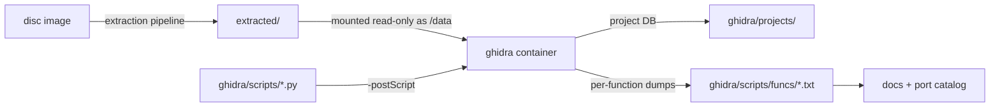

# Ghidra setup

The static-analysis path: how this project disassembles `SCUS_942.54` (the game's main executable) and the code overlays, and how the per-function dumps the rest of the docs cite are produced.

Ghidra runs headlessly in Docker and is driven by scripts, not by a GUI. You ask a question by running a Jython script inside the container; the answer lands as a text file on the host. Reach for it when you want to know what a function *is* - its disassembly, its decompiled C, who calls it.



| If you want to... | Go to |
|---|---|
| Run your first query | [The short version](#the-short-version) |
| Build the container and import the executable | [Bringing the service up](#bringing-the-service-up), [Importing](#importing-scus_94254) |
| Find who reads, writes or calls something | [Investigation patterns](#investigation-patterns) |
| Dump a function | [Adding a new function dump](#adding-a-new-function-dump) |
| Find the right script | [Script catalogue](#script-catalogue) |
| Know what not to trust in a dump | [Decompiler artifacts](#decompiler-artifacts-that-have-produced-false-claims) |

**Three things to know before you start.**

- *You need extracted disc files first.* The container mounts `./extracted` read-only, so run the [extraction pipeline](extraction.md) before importing anything.
- *Static analysis of the executable alone hits a wall.* Most of Legaia's game logic - the field/event VM, the dialog renderer, the actor / battle / menu VMs - is not in `SCUS_942.54`. It lives in **overlays**: code images loaded from `PROT.DAT` into RAM at `0x801C0000+`. A function can be heavily used at runtime and have **zero static callers** in the executable. The overlay side is covered by [overlay capture](overlay-capture.md) and the [static overlay pipeline](static-overlay-pipeline.md).
- *Dumps are Sony-derived and gitignored.* `ghidra/scripts/funcs/` and `ghidra/projects/` never get committed; docs cite a dump by path (`ghidra/scripts/funcs/<addr>.txt`).

## The short version

```bash
docker compose up -d ghidra          # once - leave it running

docker compose exec ghidra /ghidra/support/analyzeHeadless \
    /projects legaia -process SCUS_942.54 -noanalysis \
    -postScript /scripts/dump_funcs.py
```

Bring the service up **once** and issue one `exec` per query - don't restart it per command. The invocation shape is always the same: project directory `/projects`, project name `legaia`, `-process <program>` to pick the imported program, `-noanalysis` to skip re-analysis, and `-postScript /scripts/<script>.py` for the query. Dumps land in `ghidra/scripts/funcs/<addr>.txt` on the host.

Settings travel into the container with `exec -e NAME=value` (for example `DUMP_ONLY`, `GHIDRA_FIND_ADDRS`). Exporting a variable in the host shell has no effect, because the script reads it inside the container.

## Toolchain

- **Ghidra 12.x** in `blacktop/ghidra:latest`. Bundles OpenJDK 21 and stock Ghidra at `/ghidra`.
- **Jython 2.7** (bundled with Ghidra) for analysis scripts. Scripts must be **ASCII-only** - Jython 2 chokes on Unicode in source unless an encoding declaration is added.
- **PCSX-Redux** for runtime tracing. See [overlay capture](overlay-capture.md).

The image is wrapped by `docker/ghidra.Dockerfile`, which maps the container user to the host's UID/GID so files written into the bind-mounted `/projects` and `/scripts` come back owned by you.

## Bringing the service up

```bash
# Build (auto-uses USER_ID / GROUP_ID from .env or defaults to 1000:1000)
docker compose build ghidra

# Start the long-running container
docker compose up -d ghidra
```

The service uses these mounts (from `docker-compose.yml`):

| Mount | Mode | Purpose |
|---|---|---|
| `./extracted` → `/data` | read-only | Disc-extracted files (BIN, TIM, TMD, etc.) |
| `./ghidra/projects` → `/projects` | read-write | Ghidra project DB (gitignored) |
| `./ghidra/scripts` → `/scripts` | read-write | Analysis scripts + per-function dumps |

The first build handles the UID/GID matching - see the comment at the top of `docker-compose.yml` for `.env` overrides.

## Importing SCUS_942.54

PSX executables are PSX-EXE format: a 0x800-byte header, then the text section, which the header's `t_addr` (file `0x18`) places at `0x80010000`. So the mapping every dump and citation in this repo assumes is `file offset = 0x800 + va - 0x80010000`, and the import has to reproduce it. Basing the **whole file** at `0x8000F800` does that with no extra loader option - the header occupies `0x8000F800..0x80010000` and the first text byte lands on `0x80010000`:

```bash
docker compose exec ghidra /ghidra/support/analyzeHeadless \
    /projects legaia \
    -import /data/SCUS_942.54 \
    -loader BinaryLoader \
    -loader-baseAddr 0x8000F800 \
    -processor MIPS:LE:32:default
```

> **Use `MIPS:LE:32:default`, not `MIPS:LE:32:R3000`.** Ghidra rejects `R3000` as `Unsupported language`. The PSX R3000A is a strict subset of MIPS-I; the default little-endian profile handles it correctly.

> **A base of `0x80010000` on the whole file shifts every address by `0x800`.** It reads as the natural choice - it is the text VA - but it loads the header there too, so each function's printed entry point is `0x800` high while the instruction text stays perfectly plausible. That is the failure class [`dump-corpus-integrity.md`](dump-corpus-integrity.md) covers. Check the import before dumping anything from it: the TMD renderer at `0x8002735C` must open on `addiu sp,sp,-0x158`, and any function entry that opens mid-body instead means the base is wrong.

After import, run analysis:

```bash
docker compose exec ghidra /ghidra/support/analyzeHeadless \
    /projects legaia -process SCUS_942.54
```

This takes a few minutes and populates the database with functions, references, and decompilation results.

## The LUI+ADDIU gotcha

MIPS forms 32-bit constants from two 16-bit immediates:

```asm
lui   r1, 0x801C       ; r1 = 0x801C0000
addiu r1, r1, 0x70F0   ; r1 = 0x801C70F0
```

**Ghidra's reference manager does NOT auto-resolve this combination across instructions.** A direct query "give me xrefs to `0x801C70F0`" returns zero results, even when the address is heavily used.

Workaround: `ghidra/scripts/find_lui_writers.py` walks instructions, tracks per-register LUI immediates, and flags `addiu` / load / store offsets that combine with a tracked LUI to land in a target range. Use it any time you suspect a static address is being missed.

```bash
docker compose exec ghidra /ghidra/support/analyzeHeadless \
    /projects legaia -process SCUS_942.54 -noanalysis \
    -postScript /scripts/find_lui_writers.py
```

Modify `LO` / `HI` constants in the script to scan a different range.

The off-container equivalent is [`address-reference-scan.md`](address-reference-scan.md), and it is the one to reach for when the question is "does *anything* reference this address". It sweeps SCUS, every based overlay image and the raw PROT corpus for the materialisation pair alongside the four other reference forms - literal word, `jal`, `j`, and the PC-relative branch that reaches an intra-function label. An empty result there is a statement about the bytes rather than about the reference manager.

Computed addresses are still missed - `lw r4, 0x18(r3)` where `r3 = 0x80080000 + index*4` can't be statically resolved when `index` is only known at runtime. Functions reading from arrays via runtime-computed indexing won't appear in xref lists; for these, a runtime watchpoint ([PCSX-Redux automation](pcsx-redux-automation.md)) is the way in.

## Investigation patterns

| Question | Script |
|---|---|
| What writes / reads this global? | `find_lui_writers.py` with `LO` / `HI` narrowed to the address - catches the LUI+ADDIU / load / store combos the reference manager misses. |
| Where is this constant address used? | Same script; if the address is passed to a helper first, see [the materializer pattern](#ghidra-says-nothing-writes--reads-this-global-but-i-know-something-does). |
| Who calls this function? | `find_callers_of.py` (edit `TARGETS_HEX`), or `dispatcher_callers.py` for the asset-dispatcher / LZS chain. |
| Is this function called at all? | `find_callers_of.py` for direct `jal`s **plus** `find_addr_data.py` for the address as data (function-pointer tables, callbacks). |
| Does anything on the disc reference this address? | [`address-reference-scan.md`](address-reference-scan.md) - all five reference forms, all images. |

**Zero hits is a bounded negative, not "dead code".** If both caller checks come back empty, the function has no static caller *in the program currently loaded into Ghidra*. Most game logic lives in the overlays, which are separate programs. The negative bounds where the caller can live; it does not prove the function unreachable.

### "Ghidra says nothing writes / reads this global, but I know something does"

Common when the address is materialized by `lui+addiu` and then *passed* to a helper (so the actual `sw`/`lw` is in the helper, against `$a0`/`$a1`), OR when it's stored as a function-argument base that an `addu` reroutes (so the constant tracker bails and the final `sw` doesn't appear in the xref database).

Use `find_addr_materializers.py` to walk every instruction in a program, track per-register `lui` + `addiu` pairs, and report every site where the combined value lands on one of your target addresses - plus the next 6 instructions for use-classification (store base = writer, load base = reader, `jal`/`jalr` follows = address passed as argument).

```bash
docker compose exec ghidra /ghidra/support/analyzeHeadless \
    /projects legaia -process SCUS_942.54 -noanalysis \
    -postScript /scripts/find_addr_materializers.py \
    0x8007C018 0x8007BB38 0x8007B7DC
```

Arguments may be decimal or hex (`0x...` prefix). Multiple addresses are scanned in a single pass. Alternative: pass the address set through the environment with `docker compose exec -e GHIDRA_FIND_ADDRS='0x8007c018,0x8007bb38' ghidra …` and run the script without args - the variable is read inside the container, so exporting it in the host shell has no effect.

The pattern this catches (the actual installer for `DAT_8007C018` at `FUN_80026B4C` - missed by the reference manager):

```asm
lui   v0, 0x8008
lui   v1, 0x8008
lw    v1, -0x488c(v1)     ; v1 = *DAT_8007B774 (index counter)
addiu v0, v0, -0x3fe8     ; v0 = 0x8007C018   <-- the materializer site
sll   v1, v1, 0x2         ; v1 = idx * 4
addu  v1, v1, v0          ; v1 = idx*4 + 0x8007C018
sw    a0, 0(v1)           ; store to table    <-- the missed writer
```

The reference manager tracks `lui+addiu` pairs but bails when `addu` mixes the propagated constant with a value loaded from memory. So `sw a0, 0(v1)` is invisible to it - but the `addiu v0, v0, -0x3fe8` site IS visible to a manual scanner that knows the combination forms the target address. Once you see the materializer, the surrounding 6 instructions usually make the role obvious.

### "What format does this PROT entry use?"

Empirical workflow:
1. `xxd extracted/PROT/<entry>.BIN | head -5` - eyeball the header.
2. Try each known parser:
   - `asset stream <file>` - DATA_FIELD streaming.
   - `asset describe <file>` - descriptor format (when applicable).
   - `lzs-decode raw --size N <file>` - top-level LZS.
   - `asset categorize <DIR>` - runs every detector and emits a per-class breakdown.
3. If nothing matches, dig into the function that loads it (find by reversing the call site).

## Adding a new function dump

1. Edit `ghidra/scripts/dump_funcs.py`'s `TARGETS` list to add the entry-point address. **SCUS-resident addresses only.** The script writes `funcs/<addr>.txt` with no overlay prefix, so an overlay-resident address (VA `>= 0x801C0000`) would collide with any other overlay's function at the same VA. Those belong in a per-overlay `dump_<label>_overlay.py`, whose `out_path_for()` prefixes the output as `overlay_<label>_<addr>.txt`.
2. Run the dump:
   ```bash
   docker compose exec -e DUMP_ONLY=8002735c ghidra /ghidra/support/analyzeHeadless \
       /projects legaia -process SCUS_942.54 -noanalysis \
       -postScript /scripts/dump_funcs.py
   ```
   `DUMP_ONLY=<addr>[,<addr>...]` dumps just those; without it the whole
   `TARGETS` catalogue is re-dumped, which is the slow path. It is read inside
   the container, so it has to travel via `exec -e` - exporting it in the host
   shell does nothing.
3. Open `ghidra/scripts/funcs/<addr>.txt` and analyze.
4. Update [`reference/functions.md`](../reference/functions.md) if it's a notable entry point.

### Dumping an overlay function

Each imported overlay is its own Ghidra program, and overlays that share a load base hold different code at the same address. So an overlay dump is always made by a **per-overlay script** run against the right program:

```bash
docker compose exec ghidra /ghidra/support/analyzeHeadless \
    /projects legaia -process overlay_shop_save.bin -noanalysis \
    -postScript /scripts/dump_shop_overlay.py
```

A per-overlay script is a header, a `TARGETS` list and one `dump_targets(currentProgram, TARGETS)` call into the shared `lib_dump.py`. That helper skips addresses the current program does not hold and names the output `overlay_<label>_<addr>.txt`. To add a function, add its address to the matching script's `TARGETS`; to cover a new overlay, copy an existing script and change the label. `list_programs.py` shows which program names exist for `-process`, and `report_program_bases.py` shows where each one is based - check that before trusting a dump's printed addresses ([`dump-corpus-integrity.md`](dump-corpus-integrity.md)).

## Script catalogue

The Ghidra-side scripts (Jython, run inside the container) live in `ghidra/scripts/`; one-off investigation scripts are kept in `ghidra/scripts/archive/`. Edit the `TARGETS` / `LO` / `HI` constants at the top of a script to point it at the addresses you want to trace.

| Group | Use it for |
|---|---|
| [Symbol re-application](#symbol-re-application) | Naming known functions on a fresh import. |
| [Per-function dumps](#per-function-dumps) | Disassembly + decompiled C, for SCUS and each overlay. |
| [Address resolution](#luiaddiu-and-address-resolution-helpers) | References the reference manager misses. |
| [Callers and xrefs](#caller--xref-helpers) | Who calls a function, in one program or all of them. |
| [Subsystem scanners](#subsystem-targeted-scanners) | Ready-made hunts aimed at one buffer, table or cluster. |
| [Game-mode recon](#game-mode-state-machine-recon) | The mode register, mode table and dispatcher. |
| [Overlay capture and analysis](#overlay-capture-and-analysis) | Finding, importing and inventorying overlays. |
| [Host-side helpers](#host-side-helpers) | Tools under `scripts/` that work on the dumps. |

Every script needs the `# @runtime Jython` header line (with `# @category Legaia`); without it the headless analyzer routes `.py` to the PyGhidra (Python 3) provider, which the image doesn't enable, and the load fails with *"Ghidra was not started with PyGhidra"*.

### Symbol re-application

| Script | Purpose |
|---|---|
| `apply_known_symbols.py` | Re-applies this project's pinned function names to a fresh import of `SCUS_942.54`, from the curated `(address, name, role-comment)` table in `known_symbols.py`: names each function and sets a one-line plate comment. Replays the project's own labels, no external SDK database. SCUS-resident (`0x80010000..0x8007C000`) only - overlays alias by address, so naming them blind would mislabel. |

### Per-function dumps

| Script | Purpose |
|---|---|
| `dump_funcs.py` | Dump disassembly + decompiled C for a list of function entry points. Output goes to `ghidra/scripts/funcs/<addr>.txt`. SCUS-resident targets only - see [adding a new function dump](#adding-a-new-function-dump). |
| `dump_<label>_overlay.py` | The per-overlay dumper family (title, shop / menu, dialog, cutscene, level-up, magic capture, summon, STR FMV, world map and its top / walk views, save UI, debug menu, state resume, field battle intro, and the fishing / slot machine / dance / Baka Fighter / Muscle Dome minigames). Each names its `-process` program in its header - see [dumping an overlay function](#dumping-an-overlay-function). |
| `lib_dump.py` | The shared body of the per-overlay dumpers: `dump_targets(currentProgram, TARGETS, scus_bare=False)` decompiles each target the current program holds into `/scripts/funcs` (or `LEGAIA_DUMP_OUT_DIR`). A `dump_<label>_overlay.py` is a header, a `TARGETS` list and that call; the module takes the program as an argument because an imported Jython module cannot see a script's `currentProgram`. |
| `dump_pending_helpers.py` | An overlay-aware dumper with a rotating `TARGETS` list, an `in_program()` guard that silently skips addresses the current program doesn't hold, and `out_path_for()` naming output `<addr>.txt` under SCUS but `<prog_label>_<addr>.txt` under an overlay. One target list, run once per program, no per-program lists to maintain. |
| `dump_wave_closeout.py` | Works the `--missing-dumps` worklist of [`port-catalog.py`](port-catalog.md): addresses some dump cites that have no dump of their own. Separates real function entries (dumped normally) from citation artifacts such as interior addresses, instead of dumping blindly. |
| `dump_globals.py` | Dumps the program's defined data-symbol table to `funcs/globals_<program>.txt`, one `== <name> <addr> (len=N) ==` line per symbol - the format `scripts/pcsx-redux/build-symbols.py` parses. |
| `dump_scus_gaps.py` | Dumper for the disc-denominated **code gap** worklist [`disc-coverage.py`](disc-coverage.md) emits. Takes address `RANGES` rather than entry points, because a gap is bounded by dumped functions rather than named by one: it walks the listing per range, dumps every function entry inside, and reports the bytes no function covers. Those go in `FORCE_RANGES`, which force-disassembles the run and creates one function per `jr ra` + delay-slot unit - the shape a sequence of separately-emitted library leaves has, where `force_disasm_dump.py`'s one-entry-per-address model needs the entries known in advance. `in_program()`-guarded. |
| `dump_slot_a_gaps.py` | The same worklist for the **slot-A overlay images** (the statically extracted `overlay_<label>_<entry>.bin` programs). `RANGES` and `FORCE_RANGES` are keyed by PROGRAM LABEL, not by address: nineteen of those images load at `0x801CE818` and hold different bytes at the same VA, so a bare address list would force-disassemble one image's gap inside another's and print convincing garbage. Its `jr ra` walk also stops at the range end rather than running off the image, because PROT 0902 and PROT 0977 both end mid-routine at their sector boundary. |
| `dump_static_overlay.py` | Dumper for the statically extracted overlay images, one Ghidra program per PROT entry. Takes `RANGES` (function extents recovered from the bytes - the prologue / `jr ra` partition) rather than entry points, because the slot-B modules have no internal `jal` for analysis to follow; also `WALK_RANGES` for ordinary overlays and `JUMPTABLES` to teach the decompiler a computed jump. Keyed by **program label**, since every slot-B image loads at one base. The container's `/data` bind can be stale - images travel by `docker compose cp`. |
| `repair_truncated_dumps.py` | Repairs dumps whose function **body ends before the routine does** - the defect class on [`dump-corpus-integrity.md`](dump-corpus-integrity.md) that no header or base check can see, because such a dump is internally consistent. Ignores Ghidra's boundary, walks the routine's real extent, deletes the interior `FUN_` entries that cut the body, and rebuilds over the whole span. → [detail](#repair_truncated_dumpspy-detail) |
| `force_disasm_dump.py` | Force-disassemble + create-function at addresses Ghidra didn't auto-detect (JALR-only entry points), then dump. Targets are one hex address per line in `force_disasm_targets.txt` beside the script (gitignored - populate it per run), not a `TARGETS` constant. The walk must reach a `jr $ra` and produce at least two instructions before the function is committed; the floor is low on purpose, so `jr ra; nop` PsyQ thunks survive it. |
| `resolve_render_tail.py` | Companion to the [trace-driven coverage](playthrough-coverage.md) program: for the hardcoded `HITS` list of overlay trace-hit addresses (the S5 battle render-tail, with hit counts), reports each hit's `getFunctionContaining` result in the currently-open overlay program plus whether a dump for that entry already exists on disk, then rolls the hits up per enclosing function. A hit with no containing function is undefined code in this program - a create+dump target, or a sign the address belongs to a co-resident overlay. Run against `overlay_battle_action.bin`. |
| `dump_battle_rendertail.py` | Disassemble + create-function + dump the in-`0898` battle render-tail functions the trace found un-analyzed (e.g. `FUN_801E0080`). Output naming matches the overlay dumps (`overlay_battle_action_<addr>.txt`). Run against `overlay_battle_action.bin`. |
| `dump_battle_rendertail_0x801f.py` | Dump the `0x801F` render tail, which the windowed `overlay_battle_action.bin` import stops short of. Run against a **full-length** re-import of the `0898` blob at base `0x801CE818` (`-import /data/overlays/overlay_battle_action_0898.bin -loader BinaryLoader -loader-baseAddr 0x801CE818`, span `0x801CE818..0x801F8018`); resolves the `0x801F0xxx` hits cleanly (`FUN_801F0450`). The `0x801F6xxx`/`0x801F7xxx` sub-cluster is *not* `0898` (the resident bytes differ from the `0898` image) - it is the co-resident sparring-tutorial overlay PROT 0967 (next row). |
| `dump_effect_overlay_0967.py` | Dump the battle **sparring-tutorial overlay PROT 0967**, co-resident at base `0x801F69D8` during the Tetsu tutorial fight (overlapping `0898`'s rodata tail). Run against a fresh import of `/data/PROT/0967_xxx_dat.BIN` at `-loader-baseAddr 0x801F69D8`; create+dumps the S5 `0x801F6xxx`/`0x801F7xxx` hit functions (message-pacing driver `FUN_801F71E0` + the step text emitters) as `overlay_effect_0967_<addr>.txt`. |
| `dump_menu_inventory_refs.py` | Content-grep dumper: decompiles every function in the current program and dumps the C for any whose body mentions a configurable needle list (default: the inventory array `0x80085958` + the SCUS accessor family + the `gp+0x2D2/0x2D4/0x2D6` window registers). Robust against the LUI+ADDIU xref gap (matches decompiled text, not the reference manager). Its standing result on `overlay_menu.bin`: no raw-index inventory write exists - every mutation goes through the bounds-checked helpers. |
| `dump_arts_input.py` | Decompiles the battle-overlay (0898) arts-combo execution cluster: the Arms resolver `FUN_801EC3E4` (with its caller list from the reference manager) plus every function referencing the move-power tables (`0x801F4F5C` per-move power, `0x801F64E4` power-byte, `0x801F4E63` 128-byte action map). The resolver is dispatched by a runtime function pointer (no static caller), and the move-power referrers are damage / action-step builders, not the arts-input bar builder. |
| `dump_terrain_trigger.py` | Per-overlay-aware dumper for the world-map render-pipeline chain around the continent-terrain emitter `FUN_801D7EA0`: its gate writer `FUN_801D8258`, the outer callers `FUN_801D1344` / `FUN_80016444` + their SCUS callers, and the 0897 relocation copy. Uses `prog.getMemory().contains(addr)` to skip any TARGET that isn't mapped in the current program, so the same script can be run against SCUS plus each overlay and only emits files for the addresses that exist there. Output naming: `<program_label>_<addr>.txt`. |
| `dump_battle_backdrop_draw.py` | Dumps the battle-overlay backdrop draw `func_0x801d02c0` (called by the static `FUN_80026f50` for game mode `0x15`) plus its callees one level deep. Run against the battle-action program. |
| `dump_world_map_top_prim_leaves.py` | Dumps the eight overlay-resident high-mode primitive renderers the world-map top view swaps in through `FUN_80043390`'s overlay path. Addresses come from `mednafen-state prim-dispatch-table --overlay-targets-only` on a state with the world-map overlay loaded. |
| `dump_save_ui_handlers.py` / `dump_save_ui_handler_0x15.py` | Dump every sub-state handler of the save-screen dispatch table `PTR_FUN_801e4f40` (the second covers sub-state `0x15` at `0x801DA2A0`). Run against the menu overlay. |
| `dump_levelup_data_section.py` | Dumps the data section of `overlay_magic_level_up.bin` (small lookup tables in the `0x801f4b80..0x801f4cff` band and above). |
| `trace_field_loader.py` | Targeted trace of the per-scene field-file loader `FUN_8001f7c0`; pins the loader's **dual-mode** dispatch. → [detail](#trace_field_loaderpy-detail) |
| `find_mesh_chain_writer.py` | Finds the writer of the field/world-map actor's mesh-chain pointer `actor+0x44` (the chain `FUN_8001ADA4` case 5 draws). Scans for non-stack `sw/sh …,0x44(reg)`, scores each containing function by pool-table (`DAT_8007C018`) refs / TMD object-stride (`0x1c`) math / actor-field reads, dumps the top candidates. The resolver chain it pins for the walk view: `FUN_80024d78` builds `actor+0x44` from `DAT_8007C018[*(u16*)(actor+0x64)]`, and `FUN_80020f88` sets `actor+0x64 = .MAP_record[+0x10] + DAT_8007b6f8 (prefix)` → so the per-object pool index is `record[+0x10] + prefix`. |

###### `trace_field_loader.py` detail

Targeted trace of the per-scene field-file loader `FUN_8001f7c0`:

- Dumps the load chain; reads the path-template + extension string constants (`DATA\FIELD\`, ext globals `DAT_8007b3bc=".MAP"` / `DAT_8007b3c4=".PCH"`, `\efect.dat`).
- Finds LUI+ADDIU/mem accessors of the scene-name (`0x80084548`), PROT-index (`0x80084540`) and dual-mode gate (`0x8007b868`/`0x8007b8c2`) globals.
- Verifies the in-RAM PROT TOC base (`0x801c70f0`) inside the retail resolver `FUN_8003e8a8`.

Pins the loader's **dual-mode** dispatch: retail resolves the `.MAP` by **PROT index** (`FUN_8003e8a8(param_3=*(0x80084540))`, e.g. `map01` → entry `0085`), while the `break 0x103` path (`FUN_800608f0`) is the **dev-host `fopen`** of `DATA\FIELD\<scene>.MAP` (no extension→PROT map, never taken on retail).

###### `repair_truncated_dumps.py` detail

Targets come from `TARGETS` or the gitignored `redump_targets.txt`, one
`addr[!?]` per line: a bare address is a plain re-dump, `!` forces the rebuild,
`?` audits and writes a verdict without touching the database, and a `+` prefix
restores a function entry an over-long rebuild deleted. **Only force where the
sweep says `NO_RETURN`** - a rebuild deletes every function entry inside its
span, which is a database mutation, so it wants a body already shown to be cut.

Neither obvious walking rule is safe alone, and they fail silently in opposite
directions: stopping at the first `jr ra` truncates any routine with an
early-exit arm, and stopping at the first unconditional `j` truncates any
routine that jumps forward into a shared epilogue. So the walk tracks the
highest forward branch or jump target seen, and a return or outbound jump below
that frontier is an early exit rather than the end. A walk that ends any other
way is reported and the target skipped - an instruction count that is really a
lower bound is indistinguishable from a whole body once it is quoted elsewhere.

Output is named from `getEntryPoint()`, never from the requested address, which
is preserved in the header as `requested=`. Ghidra resolves an address with
`getFunctionContaining()`, so a dumper that names its file after what it asked
for asserts an entry point that may not exist; an interior request is reported
as `INTERIOR` here and never rebuilt.

### LUI+ADDIU and address-resolution helpers

| Script | Purpose |
|---|---|
| `find_lui_writers.py` | Generic LUI+ADDIU resolver. Walks instructions, tracks per-register LUI immediates, reports any combined access landing in `[LO, HI]`. Critical for finding references the ref manager misses. Edit `LO`/`HI` per run. |
| `find_addr_materializers.py` | Per-address LUI+ADDIU materializer finder. Reports every `addiu` whose combined value lands on one of the targets, plus the next 6 instructions for use-classification. Takes addresses as script arguments or the `GHIDRA_FIND_ADDRS` env var - no source edit per run. See [the materializer pattern](#ghidra-says-nothing-writes--reads-this-global-but-i-know-something-does). `find_addr_materializer_dat_8007c018.py` is a shim that keeps the original fixed-target invocation working. |
| `find_addr_data_xref.py` | One address as a data word **or** as the combined target of a `lui`+`addiu` / `lui`+`ori` pair, in one pass. |
| `find_addr_const_allprogs.py` | The same two forms swept across **every** program in the project from one invocation. |
| `find_addr_data.py` | Search the program memory for any 4-byte LE word equal to a target address - catches function-pointer tables. |
| `find_data_word.py` | Generic u32-LE-literal scanner across every initialized memory block, with surrounding-dword context. Useful when you suspect a function pointer is stuffed in a dispatch table somewhere; reports the containing function (if any) plus 8 dwords of surrounding data so the table structure is visible. |
| `find_terrain_emitter_caller.py` | Combined ref-manager + LUI+ADDIU + ori + `jal` / `j` direct-target sweep against a configurable target-address set. Reports every overlay where each target is loaded as an immediate, stored / loaded via `base+offset`, or called directly. Reusable for any "who calls function X across the overlay set?" question: edit `TARGET_ADDRS` and `TARGETS_HEX`, run against each `-process <overlay>` in turn. Ghidra's reference manager only sees references internal to one program, so the cross-program `jal` sweep is what finds overlay callers. |
| `find_string_xrefs.py` | Resolve dev-path string literals (`h:\\prot\\...`) to RAM addresses and dump every code site that references them. |

### Caller / xref helpers

| Script | Purpose |
|---|---|
| `find_callers_of.py` | Generic "callers of these target functions" tool. Edit `TARGETS_HEX`. |
| `find_jal_target.py` | Every `jal` whose target equals `TARGET` in the current program - a standalone sweep independent of the reference manager. |
| `find_jal_allprogs.py` | The same for `jal` / jump / branch across every program in the project, opened read-only from one invocation. |
| `find_jal_rawbytes_allprogs.py` | Raw-byte sweep of every program's initialized memory for the `jal TARGET` encoding - catches call sites in regions Ghidra never disassembled. |
| `find_refs_allprogs.py` | Asks the reference manager for all references to each target in every program, and whether a function or symbol is defined there. |
| `dispatcher_callers.py` | Callers of `FUN_8001f05c` (asset dispatcher) and `FUN_8001a55c` (LZS). |
| `find_jalr_handlers.py` | Locate dispatch-table indirect calls (`lw R, +0x10(...)` followed by `jalr R`). |

### Subsystem-targeted scanners

| Script | Purpose |
|---|---|
| `find_sound_path_builders.py` | LUI+ADDIU pairs landing in the sound-driver string cluster `0x8007B380..0x8007B3D0` (see [`docs/formats/sound-driver.md`](../formats/sound-driver.md)). |
| `find_debug_flag_writers.py` | Two-pass scan for writers/readers of the documented debug-flag RAM band `0x8007B400..0x8007BCFF`. |
| `find_move_table_consumers.py` | Readers of the MOVE / MOVE2 buffers (`0x8007B888` / `0x8007B840`). |
| `find_anm_buffer_users.py` | Readers/writers of the ANM buffer pointer (`_DAT_8007b7c8`). |
| `find_mes_buffer_users.py` | Readers/writers of the MES dialog buffer pointer (`_DAT_8007b8a8`). |
| `find_tmd_renderer.py` | Readers of the TMD pointer table at `0x8007C018 + idx*4`. |
| `find_gte_users.py` | Count COP2 / GTE instructions per function - surfaces renderer + transform candidates. |
| `find_streaming_consumers.py` | DATA_FIELD streaming buffer trail: callers of `FUN_8002541c` plus direct readers of `0x8007b85c`. |
| `find_xp_table_readers.py` / `find_xp_table_all_overlays.py` | LUI+ADDIU resolvers (one program / every program) aimed at `0x8007123C..0x80071300`, which is **not** the XP table: the XP curve is `DAT_80076AF4`, read by the overlay applier `FUN_801E9504` ([`level-up.md`](../subsystems/level-up.md#xp-table)); `0x8007123C` is that reading `0x800` high, and `0x80070A3C` is a sin-LUT slice. Retarget before running. |
| `find_addprim_emitters.py` | Sweeps the current program for `POLY_FT4` / `POLY_GT4` emitter sites by the primitive code byte (`0x2C..0x2F` for textured quads) stored at packet `+7`. |
| `find_prot_consumers.py` | Static map of every call site that passes a constant PROT index to the LBA resolver chain. |
| `find_scene_name_writers.py` | Writers of the scene-name buffer at `0x80084548`. |
| `find_field_loader_callers.py` | Callers of the field/town asset loaders (`FUN_8001f7c0` / `FUN_800255b8`) with arg-prep context. |
| `asset_table_xrefs.py` | Xrefs to and around `0x801C70F0` (the in-RAM PROT TOC). |
| `find_effect_bundle_consumers.py` | Effect-bundle init / spawn / walker (run on an imported battle overlay). |
| `dump_field_locomotion_cluster.py` | Re-decompile the 0897 field camera / region cluster (`TARGETS` leads with `801db81c` / `801dbec4`) + raw-disassemble the surrounding windows in `RAW_WINDOWS`. Read-only; surfaces the data holes that corrupt the decompiles. |
| `fix_field_locomotion_flow.py` | DB-modifying repair for the same cluster: force-disassemble the `jal 0x8003ce9c` (non-returning operand reader) data holes, drop mid-block fake `FUN_` entries, re-create functions at real `addiu sp,sp,-N` prologues, then re-decompile. General pattern for any overlay region split into bogus mid-block functions by a non-returning-call hole. |
| `dump_player_locomotion_integrator.py` | Dumps the field free-movement cluster the `scripts/pcsx-redux/autorun_player_pos_watch.lua` write-watchpoint pinned: collision `FUN_801cfe4c` / `FUN_801cf9f4` and pad-remap `func_0x800467e8` / `FUN_80046494`, alongside the position-writing callers in `TARGETS`. `in_program` guards run it across SCUS + overlay_0897. See [`subsystems/field-locomotion.md`](../subsystems/field-locomotion.md). |
| `dump_4c_jumptables.py` | Dumps the field-VM main dispatcher JT (`0x801E00F4`) + the `0x4C` outer-nibble JT (`0x801CEE60`, 16 entries) with each target's containing function. Use to pin a `0x4C` sub-opcode's exact nibble when the decompiler's reconstructed `case` numbering is ambiguous: the collision-grid paint is nibble 7 (`0x801e1c64`), where the decompile prints "case 5". |

### Game-mode state-machine recon

| Script | Purpose |
|---|---|
| `find_field_program_xrefs.py` | Resolve the field-program / mode-name string literals and dump xrefs. |
| `find_game_mode_dispatcher.py` | Hunt for the game-mode dispatcher via the documented mode strings. |
| `find_game_mode_writers.py` | Writers of the game-mode register at `gp[0x524]` / `gp[0x494]`. |
| `find_gp_init_and_mode_table.py` | Locate `$gp` initialization and readers of the 28-entry mode table at `0x8007078C`. |
| `find_per_mode_callers.py` | Direct or indirect callers of any handler in the mode table. |

### Overlay capture and analysis

| Script | Purpose |
|---|---|
| `find_overlay_candidates.py` | Stand-alone Python (no Ghidra) - scans extracted PROT entries for MIPS-code-likelihood and ranks candidates. |
| `dump_overlay.lua` | PCSX-Redux Lua: dump the runtime overlay code window `0x801C0000..0x801EFFFF` to `/tmp/`. |
| `import_overlay.sh` | Bash wrapper that imports + analyzes a captured overlay dump as Raw Binary at base `0x801C0000`. |
| `find_overlay_calls.py` | Every call (jal or resolved jalr) into the RAM-resident overlay region `0x801C0000..0x801FFFFF`. |
| `find_overlay_asset_loads.py` | Run on an imported overlay program: const-track every `jal` to a known SCUS asset loader and emit a CSV of `loader,prot_index_or_string,caller_func,call_site`. |
| `inventory_overlay.py` | Per-program function inventory. Emits `inventory_<programname>.csv` with one row per function (entry / size / outgoing / incoming / top callees). |
| `list_overlay_functions.py` | List functions in the active overlay program sorted by size, with outgoing-call counts. |
| `list_programs.py` | List every program currently in the Ghidra project. `list_all_programs.py` (recursive walk) and `list_programs_quiet.py` (`name [size]` lines) are variants. |
| `list_overlay_memory.py` | List the memory blocks of the current program. |
| `report_program_bases.py` | Per-program memory-block VA span + analyzed function count, for every program in the project. `list_programs.py` names the imports; this says where each one thinks it lives - the fact that decides whether a dump taken from it is usable at all. Run as a `-preScript`. |

### Static-analysis utilities

| Script | Purpose |
|---|---|
| `explore.py` | Dump a JSON report of `SCUS_942.54`: every function with an LZSS-decoder fingerprint score, plus every defined string and its inbound xrefs. |

### Host-side helpers

Cross-cutting helpers under `scripts/` (run on the host, not in Ghidra):

| Script | Purpose |
|---|---|
| `scripts/ci/function-coverage.py` | Citation-ranked missing-helper tracker over the function dumps. |
| `scripts/ghidra-analysis/call-graph.py` | `callees` / `callers` / `xref` over the dumps; replaces grep-across-files. |
| `scripts/asset-investigation/scene-asset-detect.py` | Joins `categorize.json` with TIM/TMD scan hits to surface unknown-bucket entries that look like scene bundles. |
| `scripts/ghidra-analysis/bulk-import-overlays.sh` | Reads `find-overlay` output, imports each high-score candidate, runs analysis + the inventory dumper. |
| `scripts/ghidra-analysis/extract-mednafen-overlay.py` | Slices the overlay code window `0x801C0000..0x801F9000` out of a gzipped mednafen save state; `--start` / `--end` take PSX virtual addresses for a different slice. |
| `scripts/ghidra-analysis/analyze-overlay.sh` | One-shot capture pipeline: decompress save → slice → import → emit asset-load CSV. |

## Known dev paths in the binary

`SCUS_942.54` contains leftover Windows paths from the dev environment. Useful for guessing format families:

```
h:\PROT\FIELD\
DATA\FIELD\
data\field\player.lzs
h:\prot\all\data\field\player.lzs
h:\prot\field\card\tim.dat
h:\prot\battle\etim.dat
\tim.dat
\move.mdt
```

The `h:\` prefix indicates a Windows dev box. The runtime doesn't actually open these paths in retail (no real `h:\` drive on a PSX); the strings are leftover format artefacts that point at where each subsystem's data lives in PROT.

## Decompiler artifacts that have produced false claims

Ghidra's C output is a *rendering* of the instruction stream. Each artifact below has put a wrong statement into this repo's docs at least once, which is why the rule is: **port and document from the disassembly; treat the C as a hint that tells you where to look.** The table gives, for each artifact, how to recognise it and what counts as evidence instead.

A dump can also be defective *as a file*, independently of how anyone reads it: truncated bodies, missing headers, addresses printed at the wrong base, slices of a larger function, and filenames that name an address the content does not start at. That is a separate axis with its own sweep, `scripts/ghidra-analysis/check-dump-base-integrity.py --shape` - see [`dump-corpus-integrity.md`](dump-corpus-integrity.md).

| Artifact | What it looks like | What settles it |
|---|---|---|
| Dropped register arguments | A call printed `f(1)` whose callee reads three arguments. Ghidra infers the signature from one call site, so arguments left untouched in `a1`/`a2` never appear. | Read the `jal` and its delay slot; check whether `a1`/`a2` are written between the caller's prologue and the call. |
| `\|\|` rendered as nested `if`s | Two siblings that share one branch pair look like they use different operators, inventing a behavioural difference. | Compare the branch pairs themselves, not the C. De Morgan makes `if (w) { if (h) }` and `w == 0 \|\| h == 0` the same predicate. |
| Reordered or dropped stores | A store hoisted above its neighbours, or omitted entirely - so "field X is copied from field Y" and "only three of four slots are written" both come out wrong. | Take store order and store count from the instruction stream. |
| Hand-written annotations | A Ghidra label or plate comment (`path_opener`, "dev path -> PROT index via CDNAME map") read as fact. It is somebody's earlier guess. Example: `FUN_8003E6BC` carried the name `path_opener`, which reads as a filesystem abstraction retail could own; its body is `strcpy` -> `break 0x103` -> fseek/fread/fclose, a dev-station host trap retail cannot service. | Read the body. An annotation is provenance-free. |
| `size=1 bytes, 0 instructions` | A dump with decompiled C but an empty disassembly section - nothing to cross-check the C against. A sizeable share of the corpus is in this shape, some files carrying no disassembly section at all; `check-dump-base-integrity.py --shape` counts them. | Disassemble from `SCUS_942.54` directly: text VA `0x80010000`, file offset `0x800 + va - base`. |
| Dump-sweep negatives | "An exhaustive sweep of the dumped corpus finds no reader of X." The sweep ran over dumps, and the instruction-less ones contribute nothing to sweep. The searcher sees zero hits either way, so the failure is silent and looks like a clean result. | Sweep **bytes**, not dumps - word-wise capstone over `extracted/SCUS_942.54` and the images in `extracted/overlays/`. State coverage explicitly (which images were swept exhaustively, which only through dumps) instead of asserting exhaustiveness. |
| Mis-based dumps | Printed addresses are a property of the load base a dump was imported at. Get it wrong and every address is wrong by a constant while the instruction text stays plausible. Many dumps are shifted, most of them by exactly `0xE818`. A filename prefix is not evidence of base correctness. | Verify against the extracted image, and see [`dump-corpus-integrity.md`](dump-corpus-integrity.md) - it carries the census, the clusters, and a re-runnable checker. |
| `unaff_*` / `in_stack_*` | Read as proof the address is a mid-function fragment. But leaf functions legitimately open on `lw`, `unaff_gp` is ordinary gp-relative addressing, and a prologue can sit several instructions in. | A fragment is proven by a missing `addiu sp,sp,-N` in the **disassembly**, plus callee-saved reads with no matching save. |
| Absolute-only address sweeps | A "no static writers" claim from a sweep that searched only the absolute `lui`+offset form. MIPS reaches the same address gp-relative, and that form carries a different immediate, so it is invisible to the scan. Example: `0x8007B8C2` has no absolute-form writer; its writer is `0x80015F08 sh v0,0x5aa(gp)`. The same form hides **reads**: three gp-relative `lh 0x5aa(gp)` sites (`0x80015FD4` / `0x80016038` / `0x8001631C`) bring its read total to 43, where an absolute-form scan finds 40. | Resolve `gp` first (`lui gp` / `addiu gp,gp` in the entry stub), then scan **both** forms - absolute `lui base`+offset and `gp`-relative - before asserting anything about writers **or reader counts**. |

The label-call idiom (intra-function labels promoted to fake `FUN_` entries) belongs to this family too; it has its own catalogue in [`script-vm.md`](../subsystems/script-vm.md#intra-function-label-catalogue).

A "no writers" result compounds faster than any other row here, so hold a negative about writers to the same evidence bar as a positive. The `_DAT_8007B8C2` chain shows why: "zero writers" was read as "BSS zero-init establishes the value", then as "retail runs with the flag at 0", inverting the flag's documented polarity. The second step fails on its own terms as well - `SCUS_942.54`'s PS-X EXE header has `b_size = 0`, so the BIOS clears no BSS for this executable at all.

### `lui` plus a negative displacement, transcribed by its literal

This one is a **disassembly transcription hazard**, not a decompiler artifact. A `lui reg,0x8008` several instructions above an `lw`/`sw` with a *negative* displacement resolves to a `0x8007xxxx` address, not a `0x8008xxxx` one: `lui a0,0x8008` then `sw v0,-0x454c(a0)` writes `0x8007BAB4`. Transcribing the `lui` immediate and the displacement separately, or reading the displacement as positive, lands the name a whole 64 KiB page high.

Known instances of the wrong name, for anyone who meets them in old notes: `_DAT_80084500` is `0x8007BB00`, `_DAT_8008454C` is `0x8007BAB4`, and `0x800846A8` in the pause-menu save gate is `0x8007B6A8`.

- **How to spot it:** any `0x8008xxxx` global whose cited site loads or stores with a negative displacement.
- **What counts as evidence:** resolve the pair - `(lui_imm << 16) + sign_extend(displacement)` - rather than reading either half alone.
- **Why it survives:** the wrong name is plausible. `0x8008xxxx` is a real RAM region, so nothing downstream trips.

### Two rules for any negative, code or data

The artifacts above are about misreading what a sweep *found*. These two are about misreading what a sweep *didn't* find. They are not specific to dumps - they apply equally to negatives over disc bytes, where the range is bounded and the sweep really can be exhaustive.

**A negative needs a positive control.** Before reporting "0 hits", run the *same scanner and the same validator* over a corpus where the thing is known present, and show it finds exactly the known instances - no more, no fewer. A negative from an unvalidated detector is indistinguishable from a detector that finds nothing anywhere. State the control's numbers next to the negative's.

The worked example is the `"ME"` archive negative in [`battle-data-pack.md`](../formats/battle-data-pack.md#the-me-footprint-sweep): 5 raw magic hits across the player files, 0 validating. Alone, that is unfalsifiable. The same scanner over `readef.DAT`, where the archives are documented, accepts exactly 8 of 151 raw hits - one per documented slot, with the documented entry counts, no false positives and no false negatives. The validator rejects 143 of 151, so it is doing real work, and that is what licenses reading the player-file zero as absence.

**Structural fit is not validation.** Size tables that fit, offsets that align, counts that look plausible: these survive a shallow check and are why a sweep reports a hit it should have rejected. Decompose every near-miss before calling it one. Two hits from that same sweep pass the `"ME"` size-table fit test and still fail on the body chain and the codec.

The mirror case is a near-miss that is really pool overlap. Scanning the PROT 867 monster record for the steal table, byte offset `0x48` agrees with the SCUS steal item for 31 of 185 ids - far above the noise floor of 7, and readable as "nearly the field". It is not: `0x48` is `drop_item`, and steal and drop draw from the same 39-item consumable pool, so the agreement is expected, and none of those 31 also agree on chance at `0x49`. A rate well above chance is a prompt to explain the mechanism, not evidence of a hit.

## See also

- [`docs/reference/functions.md`](../reference/functions.md) - the canonical directory of Ghidra-traced entry points these scripts dump.
- [`docs/reference/memory-map.md`](../reference/memory-map.md) - RAM map + globals the LUI+ADDIU writer hunts resolve.
- [`docs/tooling/port-catalog.md`](port-catalog.md) - tracks which dumped functions are documented / ported.
- [`docs/tooling/extraction.md`](extraction.md) - the disc-side extraction that feeds `extracted/` into the container.
