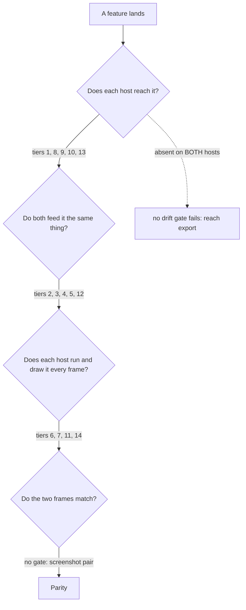

# Host drift: keeping three hosts running one engine

The port ships one engine behind three framebuffers. A feature wired into one
host and not another is invisible in a diff, because no file holds two of the
columns. This page is the reference for the gates that catch that class of
defect, for what each gate cannot see, and for where each shared decision lives
so a host does not re-spell it.

| Host | Crate | Driven by |
|---|---|---|
| native play-window | [`crates/engine-shell`](../../crates/engine-shell/) | wgpu via [`crates/engine-render`](../../crates/engine-render/README.md) |
| browser play page | [`crates/web-viewer`](../../crates/web-viewer/README.md) `runtime.rs` + `play_*.rs` | [`site/js/play-app.js`](../../site/js/play-app.js) |
| browser minigames page | same crate, `minigames*.rs` (`LegaiaMinigames`) | per-minigame modules under `site/js/` |

Both play hosts tick one `engine-session::BootSession`; the minigames page
drives the `World`-free rules engines directly and holds no `World`.

Every tier is a source scan. Each answers exactly one question and is silent
about the rest, so a green suite is a floor, not host parity.

| Tier | Question | Declared in | Blind to |
|---|---|---|---|
| 1 reachability | does each `engine-ui` draw builder reach both hosts? | derived | arguments, runtime reach, screens whose kernel is not an `engine-ui` builder |
| 2 paired constants | do two named constants carry one value? | `CONSTANT_PAIRS` | how the value is used, the space it lands in |
| 3 simulation | do two injection sites name the same kernels? | `SIM_PAIRS` | arguments, order, runtime reach |
| 4 trait overrides | does every implementer override the same defaulted hooks? | derived | what the override bodies do |
| 5 input | does a page carry its own keyboard table? | derived over `site/` | - |
| 6 diagnostics | is an additive debug draw default-off on both hosts? | `DIAG_GATES` | un-gated debug draws under another name |
| 7 render kernels | does every surface assembling a draw list name its kernel? | `RENDER_KERNEL_RULES` | arguments, a kernel with no rule |
| 8 ownership | does each host hold the engine type, or only read it? | `OWNED_TYPES` | how the type is driven |
| 9 variant coverage | does each host answer every enum variant? | `ENUM_COVERAGE` | whether the arm draws |
| 10 entry symmetry | is a phase armed only from a debug key? | `HOTKEY_SOURCES` | data a launcher decodes beside the phase |
| 11 frame path | does an early exit skip a kernel the frame still draws? | `FRAME_PATHS`, `[[frame_arm]]` | whether paired kernels do the same work |
| 12 content | do two paired frame kernels reach the same engine calls? | `[[frame_content]]` | arguments, order, guards, std-named calls |
| 13 boot installs | does the page's boot make every `world.install_*` / `set_*` call the native boot makes? | derived, `[[boot_install]]` | tables written as field assignments |
| 14 save routing | does every save / load go through the retail screen's applier? | `SAVE_IO_ROUTES` | the page's save-bar import |

Tiers 1-3 and 5-14 live in
[`scripts/ci/check-ui-host-drift.py`](../../scripts/ci/check-ui-host-drift.py)
(`--list` prints the full surface table, `--selftest` the detector controls,
`--quiet` findings only); tier 4 is
[`check-trait-override-symmetry.py`](../../scripts/ci/check-trait-override-symmetry.py).
Waivers are in
[`ui-host-drift-waivers.toml`](../../scripts/ci/ui-host-drift-waivers.toml).

Related pages: [`shipped-bundle-freshness.md`](shipped-bundle-freshness.md)
(the bundle a host actually runs), [`port-catalog.md`](port-catalog.md)
(whether a ported function is reached at all),
[`reach-triage.md`](reach-triage.md) (whether a ladder executes it).

## Where the gates run

The host-drift tiers below all run in the `gates` job of
[`.github/workflows/main-ci.yml`](../../.github/workflows/main-ci.yml) and from
[`scripts/git-hooks/pre-commit`](../../scripts/git-hooks/pre-commit) as a fast
local mirror. CI is the authority: a gate that lives only in a hook is one
`LEGAIA_SKIP_PRECOMMIT=1`, or one clone that never ran
`scripts/ci/install-hooks.sh`, away from being fiction, and neither leaves a
trace in the repository.

That job is disc-independent by construction - every gate in it reads the
repo's own sources, docs and site fragments - so it stays green on a runner
that has no `extracted/`.

### The one class of gate allowed to be hook-only

"Every gate runs in both places" is the rule, not a description of the whole
gate corpus, and the exception has to be stated or it becomes an excuse. A
gate may be hook-only when **its input is gitignored** - the Ghidra dump
corpus under `ghidra/scripts/funcs/`, or `extracted/`. Such a gate cannot
measure anything on a runner, and the hook is the only place the bytes exist,
so "it cannot run in CI" argues for wiring it into the hook rather than for
wiring it nowhere.

Two obligations come with that exemption. The gate must **self-skip** where
its inputs are absent, so a clone without disc data passes rather than fails.
And where skipping is free it should appear in CI anyway - a step that reports
`SKIPPED` is a step whose deletion someone would notice, which a hook-only
gate is not. The disc-coverage ratchet is wired that way.

Currently hook-only under this exemption: the three dump-corpus integrity
checks (`check-dump-stat-drift.py`, `check-dump-base-integrity.py`,
`check-jal-target-integrity.py`) - see
[`dump-corpus-integrity.md`](dump-corpus-integrity.md) and
[`call-target-integrity.md`](call-target-integrity.md).

### The browser host is also the one nothing here compiles

Every tier below reads sources. Every cargo gate beside them - `cargo fmt`,
`cargo clippy --all-targets --workspace`, `cargo test`, `cargo build` - builds
for the **host** triple, so the `#[cfg(target_arch = "wasm32")]` blocks that
run through much of `crates/web-viewer/` are code none of those four ever
sees. A page feature written inside one can name a private field, a moved
method or a deleted type and stay green through the whole ladder; the first
thing that compiles it is a wasm build, which is where one was found.

[`scripts/ci/check-wasm-target.sh`](../../scripts/ci/check-wasm-target.sh)
closes that: `cargo check --release --target wasm32-unknown-unknown -p
legaia-web-viewer`, run from the pre-commit hook whenever a staged file
belongs to a crate carrying such a block. It is a type-check rather than a
build and shares the profile `build-wasm.sh` and the CI wasm step use, so a
warm run costs about a second.

It runs in two places. The pre-commit hook runs it on a staged file in such a
crate, and the `pr-lint` job of `.github/workflows/main-ci.yml` runs it on
every push to a pull request, beside `cargo fmt` and `cargo clippy`, so the
browser host is compiled before a merge rather than only after one.

### A wasm export is a property of its impl block, and no compiler reads that

Compiling the browser host is still not the same as exporting from it. A
method the page calls through `wasm-bindgen` exists in JavaScript only if it
sits in the `#[wasm_bindgen] impl` block; the same method in a plain
`impl LegaiaRuntime` compiles, type-checks for `wasm32`, passes clippy and the
drift tiers, and is `not a function` in the browser. That is how the play
page's save-select backdrop accessor shipped undrawn - the page's call sat
behind a `try` that fell back to `null`, so nothing reported it. The only
instrument that sees this is a headless run of the **built** bundle, which is
therefore the check a new page export owes before it counts as wired.

## Tier 1 - reachability: does a screen reach both hosts?

[`scripts/ci/check-ui-host-drift.py`](../../scripts/ci/check-ui-host-drift.py).

The surface is derived, not listed: every `pub fn` in
[`crates/engine-ui`](../../crates/engine-ui/README.md) whose return type
mentions one of the crate's draw-record types is one screen's geometry
builder, and a host "has" that screen when its shipped source reaches the
builder. No hand-maintained list of screens can fall out of date.

**Record types on the surface.** `TextDraw` / `SpriteDraw` are the terminal
records a renderer consumes; `HudDraw`, `HudQuad`, `DigitCell`, `BarFrame` and
`ComparePanelField` are intermediate - a resolved screen that still needs a
host-owned atlas or font. Both count. A builder that *takes* draw records and
returns them is a transform over a draw list rather than a projection of a
model, and is excluded.

**Reachability is transitive, over every `fn`.** Builders compose, and they
compose through methods as often as through free functions: engine-ui's
`FishingBanners::service_frame` takes the four banner builders as function
pointers, and `HudDraw::resolve_bar` is what reaches `bar_frame` /
`power_bar_frame`. A builder-to-builder graph reports six wired builders as
unused, so the graph spans every `fn` the crate defines. Non-builder functions
are graph nodes only; nothing classifies them.

Per builder: **both hosts** → ok; **native only** → DRIFT (fails);
**web only** → informational; **neither** → ORPHAN (fails).

**A shared composer counts for the hosts that call it.** Some builders have no
host call site at all: the shop-family screens' only caller is
[`crates/engine-screens`](../../crates/engine-screens/README.md), the
projection both hosts share. The gate's `SHARED_COMPOSERS` table names each
such crate with its entry points, and a builder named in the crate's source is
credited to exactly the hosts that **call** an entry (`shop_overlay_frame`).
The credit is per host, not per crate: a host that stops calling the entry
loses every builder behind it, so a one-host composition still reads as
`DRIFT`.

Every orphan is named on stdout, waived or not. A bare count cannot tell "the
same six as yesterday" from "a builder's last caller was deleted this
morning", which is how deleting `RecipientWindowRects::active_compare`
orphaned window 25's entire painter chain without a line of output changing.

**Waivers** live in
[`scripts/ci/ui-host-drift-waivers.toml`](../../scripts/ci/ui-host-drift-waivers.toml)
and are validated in both directions - a waiver for a deleted builder, for a
builder now wired on both hosts, or in the wrong bucket, each fails. See
["What a waiver may say"](#what-a-waiver-may-say).

### What tier 1 does not prove

It asks whether a host's source *names* a builder. It says nothing about what
the host passes, whether the call is reached at runtime, or whether the two
hosts render the result the same way. The web bucket is also one label for two
surfaces on purpose: both browser pages ship in one cdylib, so splitting them
would not find a gap - it would manufacture eighty, because the minigames page
is a different screen set rather than a second copy of the play page. The real
cost of that collapse is a *model* question, which tier 3 answers.

### The tier's denominator is `engine-ui`, and a screen can live outside it

Tier 1 enumerates **`engine-ui` draw builders** and asks which hosts name each.
A screen whose content comes from an `engine-core` or `engine-vm` kernel
instead is not in the denominator at all, so a panel one host draws and the
other does not is not a `DRIFT` row, not an `ORPHAN` row, and not a count that
moved - it is simply absent.

That is not a hypothetical. The shop's two *pens-returning* windows are both in
this class, because a kernel that hands back pens rather than a draw list has
no `engine-ui` builder to be enumerated:

* window 35, the buy-quantity readout
  (`engine-core::shop::shop_buy_quantity_panel`, `FUN_801D5510`) - it drew on
  the browser page alone, so a native-window buyer sized a stack with no held
  count, no unit price and no running total on screen.
* window 39, the sell-list item detail
  (`engine-core::shop::shop_sell_detail_panel`, `FUN_801D5AE8`) - likewise, so
  a native-window seller picked a row with no name, no description, no price
  and no accessory-passive lines beside it.

Both draw on both hosts. Window 39 carried a prerequisite window 35 did not,
and it is worth naming because it is the sort a "just call the kernel" reading
misses. Its passive lines route through `shop::item_passive_index`, whose
equipment arm needs the equip record's `+5` byte, so a host that holds
equipment restrictions as `equipment::DiscEquipInfo` cannot resolve the
equipment-arm passive index until that byte is kept beside `+6` / `+7`. The
missing piece was never the call site - it is
`DiscEquipEntry::passive_index` and `DiscEquipInfo::row_passive_index`, which
the shop's window-39 painter reads on both hosts.

The general shape: **tier 1 is silent about every screen whose content kernel
is not an `engine-ui` builder.** A cheap sweep that finds them is "public
content-shaped `fn` in `engine-core` / `engine-vm` named by exactly one host's
sources" - both shop windows surface on it. Read the hits, though, rather than
counting them: most one-host kernels are correct, because the minigame pages
and the native minigame screens are genuinely different screen sets.

## Tier 2 - paired constants: do paired values agree?

`CONSTANT_PAIRS` in the same script. Each row names a constant on each host
that both feed to the *same* shared kernel - an `engine-ui` builder for the
screen rows, `swap_bgm` for the BGM transition row - and the two initialisers
must normalise to one token stream. Formatting, comments and import aliasing are
noise; a changed digit, a dropped row and a reordered table are all value
changes. The normaliser's control suite pins both directions, because a
normaliser that collapsed everything to `""` would report every pair equal.

Proves the two named constants carry equal values and that neither was renamed
out from under the pairing. Proves nothing about how either host *uses* them,
nor about any unpaired literal - and nothing about the **space** a paired value
lands in. The shop pen pair stayed equal while one host extended the builders'
stage-placed rows into a surface-pixel list and the other scaled them: a paired
constant pins a value, not the transform applied after it. That split is a
tier-3 `SIM_PAIRS` question (the `build_hud` / `play_overlay_draws_json` row).

### A deleted pair is not always lost coverage

A pair exists because a value exists twice. The better outcome is that it
exists **once**, in a crate both hosts already depend on - at which point the
row comes out of `CONSTANT_PAIRS` and nothing is left to check. The pinned
menu window-descriptor rect table and the near-fullscreen sub-screen rect went
that way: both are now single constants in `engine-ui::pause_menu`, read by
the shared pause-menu composition.

So a missing pair reads two ways, and they are opposites. Before restoring
one, look at where the constant went: a *shared* constant needs no pair, a
*re-duplicated* one needs its row back. The checker cannot tell them apart -
it only reports that a named constant is gone - so the reasoning belongs in
the comment where the row used to be, which is where it now sits.

## Tier 3 - simulation: do both hosts feed the same kernel?

`SIM_PAIRS`, the simulation twin of tier 2. Each row names a feature and, per
host, the **injection site** where that host hands a model to a shared kernel.
Three assertion modes:

| mode | assertion |
|---|---|
| `symbols_all` | each named symbol appears in both bodies |
| `symbols_same` | each named symbol appears in both, or in neither |
| `pattern_same` | the *set* of regex captures is equal across the two |

`pattern_same` is the mode that does not need the answer in advance: it says
the two sites must agree without saying what they must agree on, so it keeps
working when the right set changes.

A row may carry `blocked_on`, marking a divergence that is known and being
closed elsewhere. The marker is validated in both directions like a waiver: a
`blocked_on` row that diverges reports without failing, and a `blocked_on` row
that has gone **clean** fails, demanding the marker be deleted. A pending row
therefore cannot decay into a permanent exemption.

Proves the two sites mention (or omit) the same kernels. Does not prove the
arguments are equal, that the calls run in the same order, or that either site
is reached at runtime.

### Rows on the surface today

| feature | assertion |
|---|---|
| Muscle Dome damage | `pattern_same` over the `resolve_turn*` family each host names. |
| save-select model | `pattern_same` over the `SaveRack` variant each host builds. |
| live-loop arming | `symbols_all` on the shared `World::arm_live_loop`. |
| pause-menu press | `symbols_all` on `press_field_menu` at every host's press site. |
| pause-menu open with no press | `symbols_all` on `open_field_menu` (the title's Continue / Options rows). |
| party wipe | `symbols_all` on `GameOverOutcome::ReturnToTitle` across the two routing sites. |
| dev-menu tick | `symbols_all` on `retail_packed` + `commit_equip_row` + the records-page toggle. |
| dev-records model | `symbols_all` on `record_counters` + `records_screen` across the two model builders. |
| play clock | `symbols_same` on `advance_play_time` across the two menu draw sites. |
| walk-ground render surface | `symbols_all` on `field_ground::render_positions` (the sink) and `render_indices` (the winding) across the native mesh builder and the play page's ground exports. |
| CD-XA staging | `symbols_all` on `xa_banks::install_shout_file` / `install_clip_file` across the native boot's two bank readers and the play page's `play_xa_install`. |
| visible-tile crop | `symbols_all` on `field_view_window::field_view_cells` + `framing_is_retail` (whether a frame crops), `terrain_draw_visible` (the terrain list) and `field_ground::crop_indices` (the ground) across the native redraw / ground re-upload and the play page's crop exports. |
| dance-hall placement composition | `symbols_all` on `EnvDraw::place_point` across the native venue upload (`build_dance_venue_gpu`) and the browser bake (`DanceEnv::append_draw`). |
| Muscle Dome surface cadence | `symbols_all` on `MuscleDomeSurface::frame_at` + `sim_ticks` across the native `refresh_muscle_dome_gpu` and the play page's `play_mg_muscle_scene_frame`. |

The last three exist because each named a divergence the reachability tier
could not see, and each divergence was a *model* one rather than a missing
screen.

**Pause-menu open.** Retail gates the root list's last two rows on two
scene-scoped values - the op-`0x49` entry context and the MAN header's
save-allow bit - and suspends field dispatch while the menu owns the frame. A
host that opens the menu without sampling them into a `FieldMenuGate` draws
every row white and opens every row, which lets a player Save in one of the
scenes whose header forbids it (see [`save-screen.md`](../subsystems/save-screen.md)).
Both open sites call the same builder, so tier 1 was green throughout.

**Menu-open precondition.** *Whether the menu opens at all* is the same kind of
invisible split, so it is a row of its own: every host that turns a Start edge
into an open menu must ask `World::field_menu_open_allowed` rather than spell
the test out locally. That predicate carries both halves - the scene mode, and
the locomotion controller's engaged bit, which is why Start is inert while the
player is talking (see
[`field-menu.md`](../subsystems/field-menu.md#the-menu-does-not-open-at-all-while-a-dialogue-is-up)).
Three hosts each wrote their own copy and all three said `mode == Field`, which
is how the overworld lost the pause menu: retail runs one locomotion controller
across the field and the kingdom overworlds, and the port splits that one retail
mode into `Field` + `WorldMap`.

**Party wipe.** The pairing is on the *routing* sites, not the draw sites,
because retail's wipe arm has exactly one exit store - so a host that offers the
player a row here has invented a destination. The panel that used to sit in this
slot was exactly that, drawn from a pinned literal pair on one host and from a
live cursor on the other: two pictures of a menu retail never shows.

**Play clock.** The H:MM:SS box reads `World::clock.play_time_seconds`, and that
counter only moves if a host drives `advance_play_time`. Substituting a frame
count at the *draw* site looks identical on screen and is not: the save writes
the world's counter, so a save taken from a host that never advanced it
records the play time it was loaded with.

## Tier 4 - trait-override symmetry

[`scripts/ci/check-trait-override-symmetry.py`](../../scripts/ci/check-trait-override-symmetry.py),
with waivers in
[`scripts/ci/trait-override-waivers.toml`](../../scripts/ci/trait-override-waivers.toml).

`engine-core` hands hosts their behaviour through traits, and several give
every method a default body - `BgmDirector`, in
`crates/engine-core/src/scene/host.rs`, is the one to look at. That is a
deliberate convenience (a test stub can implement it with an empty block) and
a silent failure mode: a host that never types `start_owned_vab` loses every
global-pool track, which is every real music cue, with no compile error and
nothing in the diff.

The rule: **for every `engine-core` trait with default method bodies that more
than one host implements, the set of overridden methods must match.** Pure
syntax, no call graph. Comparison is pairwise over every implementer, so
intra-host asymmetry is a finding too - which is how the `audio-trace` parity
oracle's missing owned-VAB hooks surfaced.

Proves that a defaulted hook one implementer overrides is overridden by all of
them. Does not prove the overrides *do* the same thing, nor say anything about
a hook every host leaves defaulted - that is a host-identical gap, not drift,
and reachability of it is the [port catalog's](port-catalog.md) question.

## Tier 5 - input: does any page carry its own keyboard table?

`check_page_key_tables` in the same script.

The three hosts share one keyboard layout, served out of the engine by
`pad_bindings_json`
([`legaia_engine_core::input::Mapping::web_default`](../../crates/engine-system/src/input.rs)),
and the whole point of serving it is that a page cannot write a second one
down. A page that does write one down never looks like a table: it looks like
a `switch` on `e.key`, or an object literal indexed by `e.key.toLowerCase()`.
The minigames page carried exactly that, binding `A` / `S` / `D` to the three
face buttons while the engine binds them to Left / Down / Right, and printing
labels that said so - so the page and the engine contradicted each other key
for key on the same three buttons, and a rebind reached neither.

The rule, on **pad-driving** sources only (a `site/` file that reaches an
engine input entry point - `main.js` closing a dialog on Escape is ordinary
web UI and out of scope):

- `KeyboardEvent.key` may not be read at all. It is the layout-dependent
  character property; the engine's table is keyed by `code`, so a `key`
  comparison cannot be reconciled with a binding even in principle.
- `KeyboardEvent.code` may be compared to a literal only for a key the PSX pad
  has no button for (`NON_PAD_CODES` in the gate). Those cannot contradict a
  binding - the pad has no Escape.
- A **set membership test** on a bindable code - `held.has('Enter')`,
  `pulse.includes('Space')` - is the same defect in a third shape. The literal
  never touches `event.code`, so the two rules above are blind to it. The
  bindable set is parsed from `KEY_NAME_DOM_CODES` in the engine rather than
  restated here, so the gate cannot drift from the table it polices.

That third rule exists because the first two passed a live bug. The play page
decided whether Start was pressed with `p.has('Enter')`, so binding Start to
Space bound it on both hosts and in the engine's served table - and in every
handler except the one that opens the pause menu. The page read the engine's
table correctly and then dispatched on a key name anyway.

The fix a finding asks for is always the same: resolve the code through
`legaiaPadButtonOf` and dispatch on the pad **button**. Printed key labels go
the same way, through `legaiaPadKeysFor`, so a rebind relabels the page rather
than making it lie. Both live in
[`site/js/pad-bindings.js`](../../site/js/pad-bindings.js), the one place any
page adopts the engine's table.

There is deliberately **no waiver file** for this tier. A waiver names a
blocking capability, and no capability is missing here: the table is exported,
the adoption helper ships, and the answer is always to type the lookup.

## Tier 6 - diagnostics: is a debug draw off on BOTH hosts?

Every tier above asks whether a host **reaches** a surface. None can see the
shape where both hosts reach it and only one of them turns it off.

That shipped, and a user reported it. The effect billboards carry a tinted
wireframe outline so a spawn stays readable when its texels are not resident.
The native window gates it behind `LEGAIA_DIAG_FX=1`; the browser twin had no
gate at all. Retail draws no such rectangle, so every play-page fight stamped
an opaque red-ish box around every effect sprite - up to 25 at once. Both hosts
called the builder, the constants matched, the sim pairs matched, no page
carried a key table: **all five tiers above passed.**

`DIAG_GATES` in [`check-ui-host-drift.py`](../../scripts/ci/check-ui-host-drift.py)
declares every `LEGAIA_DIAG_*` gate in the engine crates and whether it is
`additive` - whether it draws something retail does not. The asymmetry is the
whole point:

| kind | example | a host missing it |
|---|---|---|
| subtractive | `NOFX` (suppress the layer), `NOSEMI` (blend off), `LAYERS` / `PLACE_RANGE` (draw a subset) | renders retail-correctly; it just cannot bisect |
| additive | `FX` (outline strips), `HUD` (diagnostic text over the frame) | **paints it in normal play, for every user** |

Only additive gates require a twin. A WASM module has no process environment,
so the browser twin is a module static a page or devtools console flips - which
is why this cannot be checked by looking for the env name on both sides. The
check is that the twin's *initialiser* reads false.

Validated both ways, like the waiver files: an undeclared `LEGAIA_DIAG_*` fails
(declare what it draws), and a declared gate that no longer appears fails (drop
the row). What it does **not** prove: that the two gates suppress the same
draw, that the twin is wired to anything, or that no un-gated debug draw exists
under some other name.

One gate declares `web_toggle = None` with a reason rather than a twin:
`LEGAIA_DIAG_HUD` reads its env inside the shared `engine-ui` leaf, so it is
one implementation both hosts call, and `std::env::var` answers `Err` under
`wasm32` - default-off by construction rather than by a second toggle.

## Tier 7 - render kernels: same draw list, same kernel, every surface

`RENDER_KERNEL_RULES` in
[`check-ui-host-drift.py`](../../scripts/ci/check-ui-host-drift.py).

Every tier above measures a UI screen, a constant, a simulation injection
site, a trait hook or a keyboard table. None of them asks the question that has
shipped every bug in the table below: two surfaces assemble the same kind of
draw list and only one runs the kernel that makes it correct.

| what shipped | who missed it |
|---|---|
| coplanar draw lifts never computed | browser play page |
| hand-rolled white vertex streams | Muscle Dome's three bodies |
| synthetic Lambert on both shader paths | every site 3D page |
| ground heightfield left out of the coplanar soup | every host |
| occlusion-fade radius staged at a different value | browser play page |

The last one is tier 2's; the other four are this tier's, and each was
invisible in a diff because no file held two of the columns.

### Why this is not another `SIM_PAIRS` row

The denominator. A tier-3 row names **two** function bodies by hand, so a
third surface that grows the same draw list is outside the measurement by
construction - and this tree has **five** render surfaces, not two:

| surface | assembles |
|---|---|
| native `play-window` | `field_render.rs` + `geometry.rs` |
| browser play page | `play.rs` |
| browser field-scene viewer | `field_scene.rs` (+ `scene_geom.rs` for the world map) |
| browser dance-hall venue | `minigames_dance.rs` |
| browser fishing venue | `minigames_fishing_scene.rs` |

The last two resolve `EnvDraw`s and instance env-pack meshes exactly like the
first three, and the tier-3 coplanar rows named three of the five. So here the
surface is **derived**: every non-test source under the render roots. A new
surface joins the measurement by existing.

### The two rule kinds

| kind | assertion |
|---|---|
| `requires` | a file whose comment-stripped source matches `trigger` must also match every `requires` pattern |
| `forbids` | a file matching `trigger` may not match `forbids` inside any 3-line window |

The 3-line window is the statement scale: these kernels are written as
`self.flat` / newline / `.extend(...)` as often as on one line, and a
line-scoped detector misses the multi-line half. Comments are stripped first,
in both languages, for the same reason tier 1 strips them - a doc comment
naming `coplanar_draw_offsets` is prose, not a wiring, and under-counting
"satisfied" is the safe direction.

### Rules on the surface today

| kernel | rule |
|---|---|
| cross-draw coplanar lifts | resolving `EnvDraw`s requires `draw_plane_summaries` + `coplanar_draw_offsets` |
| walk-ground heightfield sink | emitting the heightfield's vertices requires `GROUND_SINK` |
| packet-colour stream fill | a packet-colour stream may not be filled with white |
| placement tilt composition | reading `placement_rot_y` requires `rot_x` + `rot_z` |
| shared value layout -> shared quad emitter | resolving `battle_value_readout` requires `battle_numerals` + one of its prim builders |
| world-map markers through the shared quad kernel | reading the marker seams (`world_map_entity_markers` / `world_map_player_marker`) or `marker_quads` requires `marker_quads` + `world_map_marker_prim` |
| field attached lights through the shared prim kernel | reading `field_light_draws` requires `light_pool_prims` |
| retained field ground pass gated off in battle | a file that both uploads a field ground (`uploadGround`) and drives a battle frame (`play_battle_active`) requires `setGroundEnable(false)` |

**The ground-pass rule is about a retained pass, which no draw list shows.**
The WebGL renderer draws `uploadGround`'s mesh inside `renderAssembled`
before the placements, so a draw-list bisect that filters every battle draw
out still paints it. Its trigger is an `\A`-anchored lookahead over both
halves (the uploader and the battle driver) so one scan decides it; the
unanchored form re-scans the file from every position.

**The heightfield rule triggers on the emitter, not the type.** An early draft
keyed on `WalkHeightfield` / `walk_heightfield` and reported four files that
only pass the struct on - one of them a log line reading `hf.positions.len()`.
The trigger is the vertex walk (`for p in &hf.positions`, `.clone()`), which is
what "this file is a render site for the ground" actually looks like.

**The white-fill rule is a prohibition because there is no legal case.** The
shader reads `a_flat_rgba` as `texel * rgb * 255/128`, so a fabricated stream
of white is `texel * 2`; the one correct fill for geometry with no colour word
is `MODULATION_NEUTRAL` (`0x80`). The rule has to distinguish that from the
*flag* byte, which is legitimately `255` on every textured vertex -
`[c[0], c[1], c[2], 255]` is correct and `[255u8; 4]` is not, and the control
suite pins both.

**A retired rule is worth one line: the fade quad.** The rule "resolving the
intro fade ramp requires `fade_prim`" existed while two surfaces each resolved
`intro_fade(...)` and could each hand-roll the packet. The whole transition
emission - fade included - is single-assembler now (`engine-ui`'s
`battle_intro`, ticked by both hosts), so the question the rule asked can no
longer be posed and the rule is deleted rather than left matching nothing.
See [the section below](#the-version-of-this-tier-that-needs-no-rule).

**A shared layout is not a shared draw.** The battle damage numerals and the
`N HIT` / `TOTAL` counter resolved through one kernel
(`engine-vm::battle_value_readout`) on both hosts - and the native window
sampled retail's 24x24 cells out of VRAM while the browser restyled the same
digits in the dialog font. Every tier saw one model, because both hosts named
the kernel; what differed was the record family the resolved cells became. The
rule closes the gap the layout kernel left: a surface that resolves the layout
must also reach `engine-ui::battle_numerals` and one of its prim builders, so a
font path is an explicit before-the-atlas fallback rather than the draw.

**The tilt rule earns its place on measured data, not on plausibility.** The
comment it replaced said "the handful of disc placements carrying a real X/Z
tilt". Over 49 field scenes that is 94 of 1667 placements - and `juui1` tilts
all nine of its by a quarter turn about X.

### `blocked_on` and `exempt`

`blocked_on` marks a divergence that is known and being closed elsewhere, and
is validated in both directions exactly like a waiver: an entry whose file has
gone clean **fails**, demanding the entry be deleted, and so does one whose
file no longer assembles that draw list at all.

`exempt` is the stronger claim - the rule does not apply to that file - and it
must rest on the **data**, not on the schedule. The two on the surface are the
world-map walk placements, whose records carry `rot_x = rot_z = 0` across the
retail corpus: the yaw-only path there is not a shortcut, it is what the disc
says.

### What tier 7 does not prove

It asks whether a file that assembles a draw list *names* the kernel. It says
nothing about the arguments, the order, or whether the call runs. A host can
name `coplanar_draw_offsets` and drop the map on the floor, and this tier will
report it clean - that is tier 3's shape of question, one function body down.
It also cannot see a kernel nobody has written a rule for; the rule list is
the claim, and it grows one defect at a time.

### The version of this tier that needs no rule

A rule is what you write when two surfaces each assemble the list. When there
is only **one** assembler, the question this tier asks cannot be posed - and
that is the cheaper fix wherever the surfaces are genuinely the same screen.

The pause menu went that way. Its draw-list assembly used to live twice: in
`engine-shell`'s `window/menu_draws.rs` + `window/title_save_draws.rs` and in
`web-viewer`'s `play_menu.rs`. Two of the divergences that had already grown
there are exactly this tier's shape - one host resolved a title tab through
the descriptor painter and the other through a pinned-pen label builder, and
the Items screen's Use-route confirm framed before the screen's window set on
one host and after it on the other. Neither is expressible as a `requires`
rule, because both are *ordering and choice* inside one assembly rather than a
kernel a file does or does not name.

The assembly now lives once, in `engine-ui::pause_menu`, with each host
resolving its own rects and projecting its own model into the shared view
structs. Two `CONSTANT_PAIRS` rows retired with it (see
[tier 2](#a-deleted-pair-is-not-always-lost-coverage)), and the composition
became reachable from a library test - `engine-ui/tests/pause_menu_compose.rs`
- which it could not be while it sat inside a binary's private module, since
a `tests/` target cannot import one.

The dance hall has a native twin of the browser venue surface: while a dance
runs, `window/minigames.rs` draws the same venue in place of the walked-in
scene. Both take the draw list, the coplanar lifts, the VRAM (face stamps and
HUD page included) and the camera from one kernel,
`engine-core::dance_venue::DanceVenue::build`, so only the mesh build and the
instance transform are per host.

The reason this is not the answer everywhere: it needs the two surfaces to be
the same screen with the same model. The five *render* surfaces above are not
- the dance hall and the fishing venue bake venue-specific geometry - so there
the rule is the instrument, and this is not a plan to replace it.

## Tier 8 - ownership: does the host hold the engine type, or only read it?

`OWNED_TYPES` in
[`check-ui-host-drift.py`](../../scripts/ci/check-ui-host-drift.py).

Every tier above asks whether a host **reaches** something: a builder, a
constant, a kernel, a gate, a hook. None can see a host that reaches an engine
type's *outputs* while holding none of the type - there is no builder to miss,
no constant to pair, and an injection site that does not exist cannot diverge
from one that does.

The camera is the worked case and it is
[below](#gaps-the-tiers-were-blind-to-closed-by-reading-the-two-hosts-side-by-side):
one absence produced a projection difference, a simulation difference and two
missing screens at once, with all seven tiers green.

Ownership is a **field declaration or a construction** in that host's own
shipped source. Holding the session (`BootSession`, a field, a construction or
a type alias of it) owns every type the session's own fields hold: both hosts
reach the scene host and the camera through their session, so they own them
through it. The three things that are not ownership are the three the page
had: a `use` line, a match arm, and a borrowed parameter. Two shapes look like
constructions and are not - `-> Camera {` is a return type and
`impl Trait for Camera {` is an impl block - and the control suite pins every
one of these directions, because a detector that accepts a `use` line reports
every type as owned by everybody.

Declared rather than derived, for the same reason tiers 2 and 3 are: "which
engine types must a host own" is a judgement about the architecture. The
derived version of the question - every `engine-core` type one host constructs
and the other only names - reports 26 rows over this tree, and reading them is
what settles it: they are types **both** hosts use, where one happens to name a
constructor (`PadButton::from_name`) or to hold a session the other reaches
through its runtime. None is a Camera-shaped absence, and a tier that failed on
all 26 would be asserting 26 architectural claims nobody made. A row here is a
pinned juncture and does not claim to be a census.

Scope: it proves each named type is constructed or held by both hosts, and that
the type still exists. It proves nothing about how either host drives it.

## Tier 9 - variant coverage: does each host answer every variant?

`ENUM_COVERAGE` in the same file.

A shared enum's variant can be **entered on both hosts and answered on one**.
Four minigame `SceneMode`s shipped that way: the shared scene host drains the
mode-24 door warp for either host, and the browser landed in each with a frozen
field and no screen, because their native presentation is text lines and a
hand-rolled 3D scene rather than an `engine-ui` builder tier 1 enumerates.

The variant list is **derived from the enum's own source**, so a variant added
tomorrow is measured; what is declared is the enum and the per-(variant, host)
waivers. Both waiver directions are validated: a waiver for a variant the host
now names fails, and so does one naming a variant or host that does not exist.

A host "answers" a variant by naming it **qualified** (`SceneMode::Fishing`).
The qualification is the whole rule - an unqualified `Fishing` matches a
session type, a module name and half the fishing HUD, and a detector that
accepted it would report every host as covering everything.

Scope: it proves each host's shipped code mentions the variant. It does not
prove the arm draws anything, that two arms agree, or that the variant is
reachable at runtime.

## Tier 10 - entry symmetry: is the phase armed only from a debug key?

`HOTKEY_SOURCES` / `HOTKEY_ONLY_WAIVERS` in the same file.

A gap that reads as "one host has it" can turn out to be "one host's *debug
path* has it", and no tier above can tell those apart because both end at a
live call site. The dance count-in is the case: a complete shared kernel the
native window drove from a count-in driver of its own, reached only by the `K`
/ `U` hotkeys, so **neither** host counted in when a player walked into the
hall.

For every `world.<method>()` the native key arms call, this asks whether any
call site exists outside `crates/engine-shell/src/bin/` - in the shared engine
crates, or on the browser hosts. Derived over the hotkey sources, so a new
hotkey arm joins the measurement by existing.

The call test matches `.method(` / `::method(` rather than a bare name, because
a bare match counts the method's own `pub fn` as its caller and makes the tier
vacuous. `#[cfg(test)]` bodies and `tests/` files are out of the scan for the
same reason they are out of tier 1: a unit test is not a host.

### What a hotkey waiver may say, and the distinction it has to keep

Two different answers put a row here, and only one of them is work:

- **a debug probe**, with no retail counterpart and no business on a
  player-reachable entry. The effect-pool marker spawners are this: they exist
  so the pool's ageing can be watched.
- **a superseded stand-in**, where the production route moved to another
  mechanism. `World::spawn_field_stager` stages an ambient record into the
  older `SummonScene` pool while the op-`0x34` sub-3 route runs
  `World::spawn_ambient_record_at` (the full `FUN_80021B04` port) on both
  hosts; `World::spawn_summon` parses a stager overlay while the battle cast
  band produces `casting.active_summon` through `SummonScene::spawn_parts`.

Both take a waiver naming the ARM or the mechanism. What neither may say is
"not wired yet" - that is the third answer, a phase whose shared caller is
genuinely **missing**, and it belongs in `HOTKEY_ONLY_BLOCKED`, which is
validated like every other pending marker here: an entry that goes clean fails.
The dict ships empty, because both rows drafted for it turned out to have a
live replacement. "The shared caller is elsewhere" is not "the shared caller is
missing", and collapsing the two is how a superseded probe acquires a wiring
task nobody owes.

## Tier 11 - frame path: does an early exit skip a kernel the frame still draws?

`FRAME_PATHS` / `WEB_PAGE_FRAME` in the same file, `[[frame_arm]]` and
`[[frame_kernel]]` rows in `scripts/ci/ui-host-drift-waivers.toml`.

Every tier above measures what a host **has**: a builder it reaches, a
constant it declares, a kernel it names, a type it owns, a variant it answers,
an entry it arms. This one measures what a host **runs this frame**, and the
difference is a failure class none of them can see.

Both hosts drive the engine through one frame path - the native window's
per-tick body (`sim_tick`, run once per tick the redraw drains, with its
step helpers spliced back in), the browser runtime's `tick_frame` - and both
paths short-circuit. The native body `return`s out of five arms; the browser
runtime `return`s out of three; the page's own `_frame` gates the whole call
to `tick_frame` behind a fourth kind of arm in JavaScript. The **draw** does
not short-circuit with them: the native draw passes run after the loop
whatever an iteration did, and `tick_frame` returns to a page that draws
either way. So an arm that skips a per-frame kernel does not skip the draw
that reads that kernel's answer, and the host paints last frame's decision for
as long as the arm is taken.

The case it was written for is the field party readout. `FUN_801D0D38` reads
its suppress global at its first instruction and jumps to its epilogue when it
is set; the port splits that into a decision kernel stepped once per tick and
a draw pass that reads the decision back. The native window's boot-UI arm
`continue`d **before** the step, so on every pause-menu frame the kernel never
saw the state its predicate was written to suppress on, and the readout stayed
painted under the menu. Tiers 1-10 were green throughout: no builder was
missing (both hosts call the same one), no constant was paired, no injection
site diverged (both hosts *have* the call), no render kernel was absent, no
type unowned, no variant unanswered, no entry hotkey-only.

### The two questions, and the third source the first one needs

1. **Completeness.** For each early exit, the fall-through kernels that come
   after it are the ones that arm skips. Each must either be called inside the
   arm's own block, or be listed in that arm's `[[frame_arm]]` waiver with a
   reason - which is how "this arm deliberately freezes the world" gets
   written down once instead of re-derived per reader.
2. **Pairing.** Each host's frame path is a list of per-frame kernels, and a
   step one host takes every frame while the other never does is a simulation
   the two hosts do not share. Names differ across the two crates, so a
   `[[frame_kernel]]` alias row pairs `tick_minigame_extras` with
   `tick_minigame_ui`, and a `host_only` row declares the ones that really are
   one host's - with a reason that says *where the other host does the same
   work*. The claim a `host_only` row makes is about the frame path, which is
   what the checker measures, not about a capability.

The browser's frame path is **two** files, and the Rust half is the one
without the interesting arm. `site/js/play-app.js::_frame` calls
`rt.tick_frame()` inside `if (advance && !menuOpen && !shopOpen &&
!namingOpen)` and calls `this._drawOverlay()` outside it, so a guarded frame
runs no kernel at all and still draws - all nineteen at once. A Rust-only scan
sees none of that, which is how "the browser page has no early-out" came to be
written down while the page carried the same defect the native window did. The
tier therefore walks the JS function too, takes the guards `tick_frame` sits
inside and the draw does not, and treats each as an arm of the browser host
whose skip list is the whole Rust path.

### What the tier does not prove

That a kernel an arm runs runs *correctly* there, that the draw pass reads
what the kernel wrote, or that two paired kernels do the same thing - that
last one is tier 3's question, asked of hand-named pairs. It proves only that
no arm silently drops a step the fall-through path takes, and that neither
host's per-frame list has grown a member the other's has not.

It also covers two of the three hosts, and for a structural reason rather than
an oversight: the minigames page has no frame path to walk. It exports one
tick per minigame (`dance_tick`, `baka_tick`, `slot_step`, `fishing_pond_tick`,
`muscle_tick_time_meter`), each called by its own page module, so there is no
fall-through list for an arm to skip part of. A shared frame path is the thing
this tier measures; that host does not have one.

What it does share is the clock. The page's one animation loop asks the
engine's `frame_step::SimStepper` (`LegaiaMinigames::drain_sim_steps`, the
play page's `play_drain_sim_steps` and the native redraw's drain) how many
60 Hz game frames each display frame runs. Fishing takes the count as its
step budget (its frame function steps the pond in a loop and draws once); the
other four run their frame function at most once, and not at all on a frame
the stepper answers `0` - each of them draws inside it, so a catch-up frame
would be an extra 3D or raster pass, and a slow machine plays them in slow
motion rather than spiralling. The page used to step every game once per
`requestAnimationFrame` - and fishing rounded its own wall-clock gap up to at
least one frame - so on a 120 Hz display every minigame on the page ran at
twice retail speed.

Both halves are derived from the sources rather than declared, so a new arm or
a new kernel joins the measurement by existing. The ratchet is the `skips`
list on each waiver row: one that no longer matches is stale and fails, and a
kernel added to the fall-through path lands in no arm's list and fails on
every arm at once - which is exactly the moment to decide, per arm, whether
the new step belongs there.

### The fix a disclosure does not replace

An arm's waiver says the frame may draw without those kernels. It does not
say the frame may draw their *stale answers*, and for a decision kernel the
two are different claims. The page's guard is the page's field freeze and
cannot move; what moved instead is the reader. Both hosts' field-party-readout
and passive-badge draw builders now ask the suppress gate on the **draw** path
as well as on the tick, so a decision that went stale on a guarded frame
cannot reach the screen whichever host skipped the step.

The predicate they ask is one kernel,
`legaia_engine_core::world_map_panel_host::field_hud_suppressed`. It used to be
an enumeration spelled out in each host, and the copies had drifted: the page's
was missing all three of the window-side terms, and the native window gated the
badge column on a different test again - which put the badges over every dialog
box, every cutscene beat and every fight. Retail reaches the badge routine
`FUN_801d095c` from exactly one place, `FUN_801D0D38`'s `jal` at `0x801D130C`,
eight bytes above the epilogue the suppress arm jumps to, so the badges carry
the readout's suppression exactly (see `ghidra/scripts/funcs/overlay_0897_801d0d38.txt`).
Each host now answers only the term the world cannot: whether a host-side panel
with no `World` state behind it owns the frame.

## Tier 12 - content: do two paired kernels call the same engine?

`check_frame_content` / `frame_kernel_pairs` in the same file,
`[[frame_content]]` rows in `scripts/ci/ui-host-drift-waivers.toml`.

Tier 11 pairs a frame path's kernels by **name** (or by an alias row). That
answers "does each host take this step", and it is silent on what the step
does on each side - which is exactly the question the pairing invites a reader
to assume it answered. The case that proves the point was on the surface the
whole time: the native window's `tick_field_prop_anims` was an **empty body**,
`pub(super) fn tick_field_prop_anims(&mut self) {}`, aliased to the browser's
`drive_npc_clips`, which drains the op-`0x4B` ANIMATE cues, advances every NPC
clip player and drains the player move cues. A `{}` body pairs perfectly with
anything, and the alias row's reason asserted that both sides "advance the
scene's posed actors" - a sentence no line of native code supported. The
window does that work; it does it inline in its own tick loop, which is a
different claim, and the one the row made next. Both hosts now name the
step (`drain_anim_cues` natively) and both bodies call the one engine kernel
`World::drain_field_anim_cues`; the `[[frame_content]]` row carries the one
remaining difference, the page advancing its clip players inside the step.

This tier asks the next question with the only evidence a source scan carries:
for each paired kernel, the set of **engine functions** each host's body
reaches. Engine means the wgpu-free crates both hosts link
(`ENGINE_API_CRATES`: `engine-core`, `engine-battle`, `engine-effects`,
`engine-minigames`, `engine-fishing`, `engine-minigame-scenes`, `engine-dialog`, `engine-vm`, `engine-battle-vm`, `engine-ui`,
`engine-audio`, `engine-session`, `engine-screens`). A host's own
helpers are followed transitively, so a step spelled as five private methods
is compared against a twin that inlines them.

### What it proves, and the blind spot it is built on

It proves that two paired bodies reach the same engine surface, or that the
difference is written down with a reason and both lists. It does **not** prove
they call it with the same arguments, in the same order, or under the same
guard - those are tier 3's question and the side-by-side audit's, and a
difference this tier cannot see is not evidence of agreement.

The join is by name, and that carries one deliberate hole: nothing here can
tell `world.clear()` from `Vec::clear()`. Names that are also ordinary std /
collection / iterator methods are therefore excluded wholesale
(`STD_METHOD_NAMES`), so a genuinely divergent engine call spelled `insert`
is invisible. Stating the hole is the point - the alternative is a report
where two thirds of every row is `len`, which is a report nobody reads.

### The ratchet is the difference, not the pair

A `[[frame_content]]` row carries the exact `native_only` / `web_only` lists
it was written against. When the difference moves - a call added to either
side, or one half closed - the row goes stale and fails, which is what stops a
content waiver from outliving the thing it described. A row is not a licence
for the difference; it is a statement of **where the other host does the same
work**, in the form the waiver rules above require.

## Tier 13 - boot installs: does the page's boot install what the native boot installs?

`[[boot_install]]` rows in `ui-host-drift-waivers.toml`.

The tier takes every `world.install_*` / `world.set_*` call in
`crates/engine-session/src/boot.rs` and requires a shipped `crates/web-viewer`
source to call the same method, or a waiver.

The case it exists for: the native boot installed six static-SCUS progression
tables one read at a time (the XP curve and the Noa / Gala threshold divisors,
the stat-growth curves, the victory-pose table, the XA cue durations, the
magic-XP thresholds, the accessory passives) and the page's `load_disc`
installed none. Every consumer has a disc-free fallback, so nothing failed: the
page levelled on the placeholder growth, never levelled a summon, granted no
accessory passive, played no melee grunt or cast voice (a zero cue duration),
and skipped the victory pose's `rand()` - so its RNG stream left the native
one's after every battle. Both boots now call one entry,
`World::install_retail_progression_tables`
(`crates/web-viewer/tests/play_boot_tables_parity.rs`).

Blind spot: a table the boot writes as a **field assignment**. Four of the six
were, which is the argument for the single entry - a table installed through a
method both boots must call is one the tier can pair.

## Tier 14 - save routing: does every save go through the retail screen?

`check_save_io_routes` / `SAVE_IO_ROUTES` / `PAGE_CARD_RACK_RULES` in the
same file.

Retail moves save bytes in one place, the card driver behind the save screen
([`save-screen.md`](../subsystems/save-screen.md)). Each host owns the bytes
behind that screen - the native save directory and `--card` image, the
page's card rack - and one **commit applier** that turns the screen's
`SaveCommit` into I/O (`apply_save_commit` / `apply_card_save_commit`
natively, `apply_card_outcome` on the page), plus the write a Save's commit
beat asks for (`write_save_commit` / `service_card_save`). The tier pins every
shipped call of each rack primitive (`write_slot_save`, `read_slot_save`,
`write_save_into_card`, `MountedCard::save_at`, the page's
`write_session_into_card` / `load_session_from_card`) to its applier, so a
hotkey or page button that saves or loads around the screen fails as `SAVE
BYPASS`. A primitive with no shipped call at all fails too: a renamed applier
must not leave the tier checking nothing.

The page half is a text check on `site/_content/play.html`: port 1 starts
with the browser card, the card is formatted by the engine
(`formatted_memory_card`), and both the disc load and a trap recovery
remount the rack.

Not covered: the page's save bar imports a `.lgsf` or a card block and
resumes it directly. That is page chrome for getting a save into the browser
at all - the native twin is `legaia-engine load` - and it moves no bytes
into a card.

## Two JavaScript-side gates

No Rust tier reads `site/js/`. Two scripts do, in the pre-commit hook when
`site/` is touched and in CI.

**Sticky renderer state.**
[`check-js-sticky-frame-state.py`](../../scripts/ci/check-js-sticky-frame-state.py):
every `TmdRenderer` `set*` method whose body makes no `gl.` call stores a value
the renderer keeps until the next call, and every play-page call of one must
sit in `_stageFrameState` (called ahead of every mode branch) unless the setter
is classified `BRANCH_OWNED` with a reason. The five that motivated it - the
NCLIP cull word, the prologue colour grade, the depth-cue ramp, the palette
collapse and the overworld curvature - were staged in the field branch only, so
a battle entered from the overworld kept the overworld's screen-Y bend and
every battle kept the field's NCLIP cull on the stage dome. The native window
stages all five once a frame ahead of its mode branches.

**Depth space.**
[`check-js-depth-space.py`](../../scripts/ci/check-js-depth-space.py): every
GLSL fragment source under `site/js/` must write `gl_FragDepth`, unless waived
with the reason its depth never meets the log buffer (the overworld sea
backdrop, which draws first; a replay script no page loads). The page's mesh
program writes `log2(w) / LOG_DEPTH_RANGE` on perspective frames
(`LOG_DEPTH_GLSL`), because WebGL2 cannot select the native float reversed-Z
buffer; a second program drawn into the same buffer with the rasterised
`gl_FragCoord.z` loses nearly every depth test. The enhanced-lighting glow
program did exactly that until it wrote the same log depth.

## What a waiver may say

Both waiver files are validated for staleness on every run, so they cannot
name work that is done. What no checker validates is the *prose*: a reason
that was true when written outlives the thing it described, and the bucket is
re-derived while the reason is not.

So a waiver must name a **blocking capability** - something that does not
exist yet and would have to, spelled concretely enough to recognise when it
lands. "A `muscle_hud_quad_*` wasm export plus turning the page's blit into a
quad draw" is a blocking capability. "Not wired yet" is undone work. If the
answer is "someone has to type the method body", write the body.

Three rules that follow from rows that went wrong:

- **Re-derive an inherited blocking capability**, especially when two waivers
  share one. Two equip-screen painters were waived on the premise that retail's
  windows `2 / 24 / 25` are *the* Equip screen; [`field-menu.md`](../subsystems/field-menu.md)
  puts script `0x801E4DC8` on sub-screen `0x14`, the candidate list, which
  opens 24 and 25 on top of four windows already up. One sentence held two rows
  shut.
- **Re-derive a `[[frame_content]]` reason whenever you touch its pair.** The
  gate ratchets the two lists; it cannot check the sentence beside them.
- **A `host_only` reason says where the other host does the same work.** On the
  minigames page that is usually "this kernel hangs off `World`, which the page
  does not hold".

## Pairing frames: what a screenshot adds

A row closed by a tier is a claim about code, not pixels. Two hosts can be
paired by a gate, reach a kernel by a ladder, and still draw different frames,
so a closed row deserves a pair of pictures at the same state at least once.

| Source | Driver |
|---|---|
| browser play page | headless Chromium (`playwright-core`) against `python3 -m http.server` over `site/`; `window.__playRuntime` / `window.__playState` report the state; screenshot `.play-canvas-wrap` (GL canvas plus overlay canvas) |
| native window | `legaia-engine play-window --screenshot <png> --screenshot-tick N` or `--screenshot-every N --screenshot-dir`, with `--pad-script` / `--key-script` - an offscreen readback, not a screen-scrape |
| retail | `mednafen-state vram-dump --display-crop` on a library state; PCSX-Redux states through `scripts/pcsx-redux/extract_vram_from_sstate.py` |

**Tick-locked pairs** are the strongest form: drive both hosts with the same
pad script on the same world tick. Natively that is `--pad-script`
(`TICK:BUTTON` edge or `A-B:BUTTON` hold). On the page, pause the view before
its first frame (a setter on `window.__playView` calls `setPaused(true)`), then
step one tick per frame through `view.step()` while writing the page's held /
pulse key sets from the same script.

Traps, each of which has produced a false drift report:

| Trap | Rule |
|---|---|
| stale bundle | The served `wasm/SOURCE_STAMP.json` must equal the tree's own (`check-wasm-freshness.py`). A detached `http.server` on a port another worktree's server holds exits silently and the driver reads that other tree. |
| wall-clock waits | Match by engine frame: `window.__playState.frame` counts the sim ticks `--screenshot-tick` names. In a scripted span pair by **state** (which prompt is up), not by tick. |
| canvas size | Clip to the canvas at a device scale that makes it 960 wide; at its CSS size every glyph is resampled. |
| native stage | The stage is integer-scaled and centred (2x at 960x699): crop it out and halve before comparing. The 3D pass draws inside the same rect. |
| page key layout | `Mapping::web_default`: `X` is Circle, `V` Square, `C` Triangle, the d-pad `WASD`. |
| title confirm | `--pad-script` cannot confirm a boot-title row; the confirm lives in the keyboard handler, so use `--key-script "<tick>:Z"`. |
| multi-save `.mcr` | The page's import raises a block picker in `#save-status`; until one is clicked no card session exists and CONTINUE stays dim by design. |
| persisted options | Each host persists the camera-distance preset itself (`legaia-options.toml` in the working directory; `localStorage`). Pin it on both. Scripted native runs write neither options nor bindings. |
| `--seed-party` | Resets story flags to a fresh New Game, which changes a scene's entry script; the page's picker has no such seed. |
| play clock | `World::tick_play_clock` is wall time, so a tick-stepped page and a free-running window show different `TIME` values. |
| battle backdrop | `SceneHost::battle_stage_entry` picks the stage variant the region reader stored on the last field step (`_DAT_8007BD60`), else the scene default. Compare two hosts' battles only from the same region state (`LEGAIA_BATTLE_STAGE` forces one natively). |
| headless GPU | `--use-angle=swiftshader` runs a few frames a second; `--use-angle=vulkan` keeps a run to minutes. |

Paired tick-locked and matching frame for frame: field walk and camera, the
dialogue box (typewriter, page hand, row scroll), the pause menu's Items /
Magic / Equip / Status / Options screens, the battle open (`Begin | Run`, the
command ring, `Auto | Command`, the arts arm, `Begin | Reselect`), the swing
with its numerals and `HIT` / `TOTAL` cluster, the spoils banner and the field
return, the overworld leader, and the title card.

### Frames paired against retail

| Screen | Retail reference | Pairs | Differs |
|---|---|---|---|
| battle spoils banner | `noa_levelup_banner` | window rect `(9..309, 153..207)`, right-aligned XP / gold columns, text ink `(206, 206, 206)` (CLUT-7) | interior is flat where retail is a vertical gradient (the menu-window approximation) |
| battle letterbox | none (retail has no letterbox) | native letterbox is black | - |
| overworld walk | `keikoku_chest_preload`, `sebucus_overworld_resident`, `karisto_overworld_resident` | party panel position and rows | both hosts frame the walk from a higher, farther camera than retail's behind-the-leader view |
| field VRAM fog page | nine PCSX-Redux field / world-map states | effect-pool fog cells and CLUT row hash-identical; `dolk`'s own texels survive on the `(448, 0)` page | nothing |
| narration crawl | `captures/crawl1_capture` | stage-sized glyphs on a 16-line pitch | - |
| battle command phase | `v0_1_battle_command_menu` | bare gravel under the ring | - |
| dialogue box | `v0_1_tetsu_dialogue_accept` (border rows 9 and 63, columns 31..287, ink `(206, 206, 206)`) | no port frame: a talk needs a positioned walk-to-NPC input no harness provides | not paired |

Not frame-paired: shops, the inn, FMV, the Koru strip (no formation-`0xB6`
entry short of the dome) and scripted battles (op `0x3E`).

## Shapes no tier fails on

Reading the hosts side by side with every tier green finds the shapes below.
Each has produced a shipped defect; the shape is what the next sweep should
look for. Four became tiers (8, 9, 10, and the fifth render rule); the rest are
decidable per instance, not from a source pattern.

### Different inputs to one kernel

| Shape | Worked case | Where the fix lives |
|---|---|---|
| **One decision, two inputs.** A predicate both hosts run, fed from different state. | The occlusion-fade arming gate: native excluded boot UI, world map, cutscene camera and debug orbit; the page only battle and minigames. | Split into the half the world can answer (`field_occlusion::fade_armed`, with `player_body_centre` as both ray target and shader focus) and the half only the host can (master toggle, a UI owning the screen, debug vantage, VR eye). |
| **A rule spelled beside the shared predicate.** A host calls the predicate and adds its own clause. | Native asked `field_menu_open_allowed` *and* `!menu_runtime.is_open()` *and* its narration local; the page asked only the predicate, so Start opened the pause menu over a shop. | Move the clause into the kernel; a copy is two spellings again. |
| **A shared builder starved by its caller's slice.** The output degrades instead of failing. | Battle HUD status badges: `Stone` / `Rage` / `Faint` decode with the CLUT-only TIM one file *before* the system-UI sheet (`save_menu_atlas::SYSTEM_UI_CLUT_EXT_TIM_OFFSET`). Rooted at the sheet, 6 of 9 resolve; rooted at the extension, 9 of 9. | Run the builder both ways and assert they differ (`crates/web-viewer/tests/battle_hud_badges.rs`). |
| **An input contract one host does not honour.** | `MenuRuntime::tick` filters no repeats; the native window handed it the *held* word, so one press stepped several rows. | `menu_runtime::menu_input_from_pad_edges` on both. |
| **A raw word into a packed-mask reader.** | `World::input` holds the raw PSX word (Cross `0x4000`); the op-`0x49` submode family tests the packed masks `FUN_8001822C` builds (Cross `0x0040`). Cross did nothing on a coin cabinet on both hosts, and the tests fed the packed constant so they asserted the defect. | `World::submode_pad_words` through `dev_menu::retail_packed`. |
| **A typed channel narrowed at one host.** | The web strike-SFX scheduler was `u8` end to end and dropped every cue above `0xFF` through a `try_from`. | Widen to the event's `u16`. |
| **Opposite defaults on one knob.** | Three-probe wall footprint, solid NPC bodies and live NPC motion: on in the browser, opt-in natively. | Native defaults on with `--no-*`. |
| **Same camera, different control rates.** | Drag yaw ran `0.006` rad/px on the page, `0.008` natively, both writing `Camera::manual_orbit`, which the movement compass reads. | The gestures are engine setters (`Camera::orbit_by`, `tilt_by`, `zoom_by`, `reset_follow_knobs`) that carry the cutscene lock and the clamps. |
| **One mask applied to two index spaces.** | The page tagged placed draws with a terrain index, so the visible-tile crop hid placements by a terrain tile's mask entry (`town01` lost 30 of 35). | Tag by the property the mask is indexed by. |
| **A bind-time filter on state that changes later.** | The page skipped *uploading* a header-parked placement; a cutscene seats exactly those (`CC <ch> 37`, `bylon`'s `A3 3F 53 32`). | Upload every placement; test the hide box per frame. |

### Different clocks and cadences

| Shape | Worked case | Where the fix lives |
|---|---|---|
| **One animation, two clocks.** Sim tick on one host, display frame on the other; they agree only at 60 fps. | Name-entry caret, shop open fade, pause menu, game-over panel and boot chain ran at the monitor's rate on the page. | Drain `frame_step::SimStepper` once per display frame above the overlay arms and spend the count on the frozen clock. |
| **A per-call stepper behind a per-frame draw.** Sharing code does not share the call rate. | Muscle Dome surface stepped its camera per draw; the battle-intro emitter stepped per redraw natively. | `MuscleDomeSurface::frame_at` gated on the sim tick; `BattleIntro::advance_to(elapsed)`. |
| **A read on the wrong side of the tick.** | The page read `play_cutscene_state_json` before its ticks and staged the grade from it, one frame late. | Re-read after each tick. |
| **A cue fired before the filter that swallows its edge.** | The page blipped off the raw press before `play_menu_input` ran the save screen's refusal filters. | Fire on the filtered edge. |
| **A session choice the next entry re-arms.** | Native `F7` cleared the encounter toggle; the live-loop arming raised it again. | Write the session flag every entry reads. |

### A draw, queue or resource one side lacks

| Shape | Worked case | Where the fix lives |
|---|---|---|
| **Simulated and never drawn.** A layer with no draw site. | The page ticked field move-VM effects and drew none; its only FX draw sat in the battle branch. | - |
| **A producer with no consumer on either host.** Symmetric, so every drift gate reports parity. | The op-`0x34` sub-0 colour tween (`FUN_80024EE4`), the scene-entry fade. | The reach export's producer / consumer join ([`reach-triage.md`](reach-triage.md)), not a parity gate. |
| **A queue only a consumer empties.** | `World::pending_field_events` grew on the page: only the BGM router drained it and handed the rest back. | Drain every frame. |
| **A retained pass no draw list shows.** | The WebGL ground pass (`uploadGround`) drew the field heightfield through the battle camera. | Tier-7 rule `setGroundEnable(false)`. |
| **A texture upload one resource builder skips.** Reads as "the draw is broken": the quads exist, the texels do not. | Native field VRAM lacked the PROT 0874 section-2 effect pool, so fog quads (page `0x0027` = `(448, 0)`, CLUT `(0, 473)`) sampled zero. | Layer the pool under the scene build. |
| **A draw one host carries on a side channel.** | Fishing gauge fills came from a page-only `bars` payload. | Hand the shared consumer the solid texel. |
| **A GL state word the engine does not own.** | NCLIP cull, clear colour and the palette-collapse half of the prologue grade were JS decisions or had no uniform to land on. | `camera_view::nclip_cull_mode`, `battle_stage_clear::scene_clear`, `World::frame_grade`; the GL call only applies the answer. |
| **A host-side handle the world does not hold.** | The browser's summon actor seat survived `World::finish_battle` and was handed out twice. | - |
| **A write durable on one host only.** | A native Save persists in the commit (`card.persist()`); the page stored the card only on Export. | The runtime raises `card_take_written` and the page stores on it. |
| **A refusal the player cannot see.** | A save commit a host could not honour only logged. | `SaveScreenFlow::refuse` raises a shared notice. |
| **A wasm export outside the `#[wasm_bindgen]` block.** | See [above](#a-wasm-export-is-a-property-of-its-impl-block-and-no-compiler-reads-that). | A headless run of the built bundle. |

### Shared on paper only

| Shape | Worked case | Where the fix lives |
|---|---|---|
| **Same layout, different letterforms.** A shared layout is not a shared draw. | Battle numerals: VRAM cells natively, dialog font on the page. | `engine-ui::battle_numerals` + the fifth tier-7 rule. |
| **Same override set, different bodies.** | Two `BgmDirector`s disagreed on the duplicate-start guard, master volume and the pause gate. | One body: `engine-session`'s `AudioBgmDirector`. |
| **A law written twice in two shading languages.** | See [shading](#the-two-hosts-do-not-share-a-shading-law). | Only a rendered frame from each host compares them. |
| **A draw list that carries half a mesh.** | A surface running `tmd_to_vram_mesh` alone drops every untextured prim. | Assert the **untextured corner count**, never the total. |
| **Length parity is not coverage.** | A white `a_flat_rgba` stream has the right length. | Assert content. |
| **Two hosts agreeing on a wrong law.** | Both laid the crawl out in surface pixels with 1x glyphs. | Only a retail frame flags it. |
| **A hint string is an unpaired constant.** | Slot and Baka prompts named retired buttons on both hosts. | One engine text taking each host's key names (`PondSession::status_rows`, `minigame_status`). |
| **A stateless replay standing in for a stateful kernel.** | The minigames page replayed `FirstVisitHub` by tick: no press, no XA line. | Step a live hub (`muscle_first_visit_reset` / `_step`). |
| **Two hosts running different engines.** | Fishing was modelled twice; `catch_hud_draws` got a literal `0` depth because one model had no `DAT_801d9298`. | Delete the second model. |

### A "the page is missing it" reading can be backwards

| Reading | What it was |
|---|---|
| "native has the `apply == 0` Camera Configure arm, the page has none" | Dead on both: `Camera::route_camera_events` consumes the event before the window's later drain. Follow an event to the drain that consumes it. |
| "only the page hands the camera something on leaving `F3`" | The hand-off was the bug: the page wrote the *negation* of a private yaw into `manual_orbit`. `Camera::debug_orbit_by` is the shared setter. |
| "native projects the move-FX streak through the orbit camera" | Native was wrong: its FX passes ignored the dome / orbit choice its scene pass made. `battle_scene_mvp` is the one selector. |
| "the dance HUD quads are native-only" | The native materialiser returned an empty list; no host staged the 4bpp page. |
| "`HUB_TITLE_ART` is minigames-page-only" | A one-host *export* is not a one-host *screen*: the draw loop never passes that screen index. |
| "one host has the dance count-in" | Only its debug launcher had it (tier 10). |
| "neither host does X" | Check what each needs separately: for the dance count-in banner one host lacked the texels and the emit, the other only the emit. |
| "a one-host surface is a project" | Check whether the other host lacks the *paint* or only the *decision*: the dance HUD frame was text resolved inside one host's draw block (`DanceGame::hud_frame_rows`). |
| a tier-1 `web-ahead (informational)` line | It answers "which host calls this function", not "which host draws this screen". `battle_combo_cluster_draws_for` / `battle_value_readout_draws_for` are the readout's font fallback; both hosts draw the real cells whenever the battle VRAM is resident (`redraw::battle_value_readout_prims`, `play_battle::battle_value_readout_prims`). |
| "the panel is unframed on one host by choice" | The frame belonged to a pass that could not size it; see [shops](#menus-shops-and-saves). |

## Open differences

None is expressible as a waiver. They are engineering work, not
reverse-engineering questions, so they are not on
[`open-rev-eng-threads.md`](../reference/open-rev-eng-threads.md).

| Difference | State |
|---|---|
| shading law | One law in WGSL and GLSL; nothing pairs the shader bodies. See [shading](#the-two-hosts-do-not-share-a-shading-law). |
| battle body blend | Native keys the posed override by TMD index (two bodies sharing a TMD share one); the page orders blend passes per mesh, not per prim. |
| save rack port 1 | Native mounts its `.lgsf` directory as port 1 and `--card` as port 2; the page mounts two card images and resumes `.lgsf` through the save bar. Closing it is storage work. |
| per-tick screen owners | Both hosts hand a frame to the pause menu, then name entry, then a menu-overlay screen, each spelling that order itself; no gate reads the JS side. |
| placed-object move / turn tables | The page still applies them in `play-app.js`, in its own Y-up frame. |
| prologue lit-row ambient | Native stages the dim ambient (`0x20`, `DAT_8007B788`) on light-source rows; the page draws them neutral. |
| screen prims vs text | The page concatenates `under` and `over` into one sort; native draws its text between them. |
| STR decoders | The page counts assembled frames and assumes 4-bit XA; native counts decoded frames and reads the bit depth. |
| shop panel rows, inn prompt text | Written once per host over shared leaves; they agree today. |
| level-up banner without menu chrome | Raw surface pixels natively, stage-scaled on the page; only a run with no system-UI atlas takes that path. |
| cheats | One `World::cheat_*` call each; restore HP / MP is page-only, a GameShark file native-only, and native applies once at boot. |
| fishing wander readout | Native dev-menu aid for `FUN_801d2050`'s tracked points; no page twin by choice. |
| fishing exchange panel pen | Native adds the venue overlay's idle sway (`FUN_801d03b0`). |
| op `0x35` sub-op `8` | Open on purpose: `FUN_80019898` replays the record at `0x8007057C` through `FUN_80026478`, which in every captured state is silent, so the default no-op is faithful ([`audio.md`](../subsystems/audio.md#sub-op-8-replays-an-empty-record)). |
| absent on both | Dialogue text blip, door cue, footstep cue, casino prize-counter cues, world-map location labels ([`place-names.md`](../formats/place-names.md)), the Baka in-duel pause menu (`0xBE` / `0xBF`; the pause edge `0x110` includes Triangle, which the cameo test reads held). |

### The minigames page has no `World`

That page drives the `World`-free rules engines against JS state, so a kernel
that hangs off `World` reaches two hosts, not three. That is what a
`host_only` row there means, and the practical way to close the class is to
fold the standalone games into the play page.

| Lacks | Because |
|---|---|
| a frame path (tier 11) | It exports one tick per game (`dance_tick`, `baka_tick`, `slot_step`, `fishing_pond_tick`, `muscle_tick_time_meter`). It does share the clock: `LegaiaMinigames::drain_sim_steps`. |
| the Muscle Dome ringside still | Armed by `World::exit_muscle_dome` writing `MinigameState::muscle_ringside_still` ([`ringside-still.md`](../formats/ringside-still.md#in-the-port)). |
| fishing venue actors and exchange session | No venue scene; it lays the exchange out from `fishing_exchange_json` and treats every tackle item as held. |
| the round-start cameo | It passes the duel no held word. |
| the residency-driven slot-2 bank | `stage_sfx_slot` holds PROT 0869 in slot 2 for every game; no cue it plays differs today. |
| runtime-bank cues (`>= 0x200`) | It stages no `bse.dat`; the export reports the miss instead of truncating to static row 0. |
| a `World`-side SFX path | It owns its own `Spu`: `LegaiaMinigames::minigame_audio_open` builds a `WebAudioOut` from a user gesture (`MgSpu` in `site/js/minigame-bgm.js`), reached by `minigame_sfx_cue` and `muscle_tally_voice`. |
| mixer-side BGM | Its music is a rendered track on an `AudioBufferSourceNode`, by design. |

It alone draws the dome's command ring as chips (the cross-out X is
`FUN_801DBC30`, placed as `battle_party_panel::cross_out_mark`); the play hosts
present the dome's selection as text rows.

## Where each shared decision lives

One row per decision that has one engine implementation both hosts call. A
host that re-spells one locally is drift; most rows are pinned by a tier-3
`SIM_PAIRS` row on the kernel's name.

### Frame loop and clocks

Both play hosts run `legaia_engine_session::BootSession::tick`: the mode seat's
frame, the camera's half before the world tick, the world tick, the tick's BGM
events, the camera's half after it, the SFX queue dropped on a door, the field
SFX routing, and the mode word adopted. What stays host-side is the display
loop (winit's redraw, `requestAnimationFrame`) and the steps around the tick.
The frame model is in [`engine.md`](../subsystems/engine.md#the-frame-model).

| Decision | Kernel |
|---|---|
| ticks per display frame | `frame_step::SimStepper` (page: `play_drain_sim_steps`) |
| camera around the world tick | `camera_before_world_tick` / `camera_after_world_tick` |
| cutscene glide clock | `CutsceneGlide`, reset on every entry (retail's `FUN_80025C24` kills the mover) |
| move-VM strips | `MoveVmGlobals::strip_frame` |
| field frame tail | `World::tick_effect_scene_graphs`, `step_field_vram_effects`, `drain_field_anim_cues`; headless: `World::step_world_frame_tail` ([`reach-triage.md`](reach-triage.md#what-a-pad-only-ladder-structurally-cannot-execute)) |
| NPC clip playheads | `World::field_npc_clips_advance`, `tick_npc_clips` (a world cursor under each actor's `+0x62`), `sync_npc_clip` |
| play clock | `World::tick_play_clock`, reset by `begin_new_game` |
| field HUD suppression | `world_map_panel_host::field_hud_suppressed`, asked on the tick *and* the draw path; includes `field_battle_transition_active` |
| sub-frame key taps | `input::PadTapLatch` |
| movie clock | `cutscene::MovieClock` (page: `play_fmv_due_frame`); skip edge `cutscene::fmv_skip_edge_hit`, which only `fmv_id 0` passes |
| battle-intro emitter | `BattleIntro::advance_to(elapsed)`; arming `BattleIntro::arm_for_battle` |
| post-FMV hand-off | `BootSession::apply_pending_fmv_handoff` (camera globals reset, SFX queue dropped), `FmvHandoffOutcome::Entered` |
| direct scene entry | `BootSession::enter_scene_live`, `World::stage_picker_entry`, `scene::is_world_map_scene`, `World::arm_picker_world_map_debug` (the top-view chord `_DAT_8007B98C`, picked scenes only) |

Under a shop or the prize exchange both hosts freeze the whole frame tail:
retail runs those screens at game mode `0x17` with the field overlay swapped
out for the menu overlay (PROT 0899). The SFX scheduler still steps once per
sim tick under the pause menu and a shop - mode `0x17`'s handler `FUN_80025F74`
runs the cue drainer `FUN_80016B6C`
([`audio.md`](../subsystems/audio.md#the-scheduler-under-a-menu-overlay-screen)).
A suppressed `FieldPartyHud::tick` stores nothing but its cached decision, so
stepping it under an overlay or not leaves the same picture
(`a_suppressed_tick_changes_no_state`).

### Camera

The page once held no `Camera` at all (the case behind tier 8): one absence
produced a projection difference, a simulation difference and two missing
screens.

| Decision | Kernel |
|---|---|
| retail GTE projection, cutscene glide, frame convention | `legaia_engine_vm::psx_camera` |
| which camera owns the frame | `legaia_engine_core::camera_view::resolve_field_camera` + `frame_vp` (follow focus written back to `_DAT_80089118/20`) |
| compass azimuth | `compass_azimuth_units` |
| drag / wheel / double-click | `engine-core::camera::follow_knobs` |
| `F3` debug orbit | `Camera::debug_orbit_by` (un-gated by cutscenes, field-only) |
| camera-distance preset | `OptionsState::cycle_camera_distance` |
| snap-beat bank | on `Camera`, beside `route_camera_events` |
| battle | `battle_cam_script::battle_vp`; inputs `engine-core::battle_cam_inputs`; state `BattleState::camera`, read through `World::battle_cam_pose`; armed on `world.mode`, never on a render resource |
| script-arc follow (`FUN_801DB510` / `FUN_801DAA50`) | `World::script_arc_follow_camera` |
| scene viewport | Native hands the renderer its stage rect (`Renderer::set_scene_viewport`), so 3D draws inside the integer-scaled 4:3 stage as on the page's canvas. |

### Menus, shops and saves

| Decision | Kernel |
|---|---|
| pause-menu press and open | `BootSession::press_field_menu`, `World::field_menu_open_allowed` (dialogue engagement, narration, title card, locks, shop), `open_field_menu`, `close_field_menu` |
| pause-menu stack | `field_menu_dispatch::tick_root_list`, `tick_open_subsession`, `finish_subsession`; per host: rack I/O, key table, options store (`SubsessionHandoff`) |
| pause-menu draw assembly | `engine-ui::pause_menu` (`engine-ui/tests/pause_menu_compose.rs`) |
| boot Options | The title row opens the pause menu on the Options sub-screen (`open_menu_row_from_title`, `play_menu_open_row`); a `menu_from_title` / `PlayMenu::from_title` flag returns to the title. |
| Options rows | `OptionsSession::screen_model`; simulation knobs `OptionsState::apply_to_world` |
| shop / prize / inn step | `MenuRuntime::step_field_session` (returns the cue), `open_field_overlay_requests`, `session_edge` (the opening tick takes no edge), `suspends_field` (an inn is a field dialogue and is not suspended) |
| shop-family draw | `legaia_engine_screens::shop_overlay_frame`; frame rect from `shop_panel_rows` + `shop_panel_frame_rect`; labels `menu_runtime::shop_root_labels`, `MenuState::item_label` |
| Seru-trade text | `seru_trade::trade_screen_text` |
| save-select | `SaveScreenFlow::overlay_model`, `save_select_overlay_draws`, `title_band_sprites` + `TitleBandState` (page backdrop: `boot_title_backdrop_draws_json`) |
| Load / New Game | `engine-core::resume` (`resume_card_load`, `enter_new_game`), `TitleSession::for_front_end`, `SceneHost::current_resume` ([`save-screen.md`](../subsystems/save-screen.md#where-a-load-lands-and-when-continue-is-live)) |
| card write | `engine-core::card_write::write_save_into_card`, `MountedCard::persist` |
| menu blips | `menu_cues::menu_edge_blip`; a blip is a one-cue batch (`SfxFireBatch::immediate`) and ages no other cue |
| name entry | `NameEntryInput::from_pad_edge`, `NameEntry::cursor_cells`, `name_entry::caret_on` |
| dev menu | `DevMenuSession::tick_host` (CAMERA row, EQUIP commit), `DevMenuSession::route_sfx` |
| coin counter (op `0x49` sub-op 6) | `field_submode_screen::coin_counter_lines` through `ui_text_lines::pen_line_draws_for`: the field overlay's entry panel `FUN_801E6F70` (record 10) and confirm panel (record 11) |
| place-name banner | `engine-core::place_name_banner` from `SceneHost::load_scene` (a text balloon, not the slot-`0x2E` actor whose script `0x801F32B4` only closes panels) |
| minigame purses in a save | `World::save_full` / `load_full`, `LGSF` block `LGX7` ([`save-screen.md`](../subsystems/save-screen.md#the-minigame-purses-are-live-state-words-too)) |

Shop windows 35 and 39 are the tier-1 denominator case
([above](#the-tiers-denominator-is-engine-ui-and-a-screen-can-live-outside-it)).
Retail's title menu is **two** rows: its tick wraps the row counter with
`andi v1,v1,0x1` at `0x801DDC00` (see
`ghidra/scripts/funcs/overlay_title_801dd6b8.txt`), so `TitleSession` steps
`TITLE_MENU_ROWS` and never yields `TitleOutcome::Options`; the screen retail
reaches Options from is the pause menu. A card or LGSF load parks the save and
skips the picker's story baseline, which would otherwise clear system flags
`0x141` / `0x147`.

### Field scene and actors

| Decision | Kernel |
|---|---|
| NPC draw pose (hide, heading, tilt, `actor+0x72` render scale) | `World::field_npc_draw_pose`, `field_npc_render_y`; look key `ActorLook::pose_key_bits` |
| scripted mesh re-bind | `World::field_npc_live_model` through `SceneHost::model_bank` ([below](#scripted-mesh-re-bind-op-0x0e)) |
| placed-model swaps | `field_env::placed_model_swaps`, `live_placed_model` |
| placement tilt | `field_env::EnvDraw::place_point` (`Rx * Ry * Rz`, `FUN_80026988`) |
| scene-hidden lead | `World::actor_hidden_by_scene` |
| walk ground | `field_ground::render_positions` / `render_indices` / `crop_indices` |
| visible-tile crop | `field_view_window::field_view_cells`, `framing_is_retail`, `terrain_draw_visible` |
| script arcs (op `0x43`), attached lights (op `0x34` sub-1) | `World::script_actors`; lights through `light_pool_prims` ([`script-vm.md`](../subsystems/script-vm.md#0x34-sub-1-is-an-attached-light)) |
| CLUT-walk shimmer | `engine-core::clut_walk_anim` (`ClutWalkAnim::install`); parser `legaia_asset::clut_walk` |
| occlusion fade | `field_occlusion::host_fade_armed`, `FadeRamp`, `player_body_centre` |
| scene lights | `engine-screens::field_frame::field_scene_lights` |
| clear colour | `engine-screens::field_frame::frame_clear_color`, `battle_stage_clear::scene_clear` |
| prologue grade | `World::frame_grade`; lit-row restage `engine-core::fade::apply_prologue_lit_ambient` over `legaia_tmd::mesh::tmd_to_vram_mesh_filtered_lit` |
| object-effect clip (field-VM `4C C2 1`) | `World::object_effect_mesh_clip` ([`renderer.md`](../subsystems/renderer.md#what-a-raised-0x42-draws)) |
| world-map markers | `legaia_engine_core::world_map_markers` + `screen_prim::world_map_marker_prim` |
| narration crawl, title card | `cutscene_text_stage_draws` (stage pixels) |
| picker labels, two-line descriptions | `OwnedDialogPanel::picker_labels`; `broken_text_draws_for` (`FUN_80036888` breaks on `0x7C`) |

The site's full-map viewer is a fifth consumer of the same kernels:
`engine-core::scene_live::LiveScene` enters the scene through `SceneHost` and
ticks it headless, and `web-viewer::field_actors::FieldActors` +
`site/js/field-actors.js` are the one actor path both pages use. The disc-gated
`crates/web-viewer/tests/field_scene_anim.rs` runs the viewer and
`LegaiaRuntime` side by side and requires floor-wave offsets, ground positions,
prop pose keys, actor transforms and the **written** VRAM texel set to agree
tick for tick.

**Scripted mesh re-bind (op `0x0E`).** The scripted-motion VM compares the
operand unsigned against `0xF0`: below, it resolves against the scene's
model-bank base `*(u16*)0x8007B6F8`; at or above, `operand - 0xF0` against
`*(u16*)0x8007B824` with the translucent draw bit raised. Either way
`FUN_80024E08` zeroes the anim cursor `+0x5C`, stores the id at `+0x64` and
reloads the mesh. The bank is `DAT_8007C018`, the global registered-TMD array,
whose per-scene window is the loader's registration order - not
`SceneResources::tmds`, a magic scan blind to TMDs inside LZS bundle
descriptors. The port decodes it as `AmbientEffect::ModelSwap`
(`ambient_motion_ops::step_op_model_swap`) and records the id on
`FieldNpcState::models`.

| scene | sites | distinct targets | already a placement's spawn model | resolve in the scene bank |
|---|---|---|---|---|
| `bubu1` | 9 | 9 | 0 | 9 of 173 |
| `koin3` | 100 | 10 | 0 | 10 of 77 |
| `edbubu` | 6 | 6 | 0 | 6 of 160 |
| `other7` | 100 | 10 | 0 | 10 of 65 |

No site names a model some placement already binds, so the bytes come out of
the bank (`model_bank::SceneModelBank::tmd_bytes`). The `>= 0xF0` meshes live
in PROT 0874 (`legaia_asset::character_pack`); no authored site takes that arm.
Oracles: `crates/engine-core/tests/ambient_motion_op_census_disc.rs`,
`model_rebind_live_disc.rs`.

**Per-actor pitch and roll.** Motion-VM ops `0x15` / `0x16` tween the actor's X
and Z Euler angles (`+0x24` / `+0x28`). Retail composes all three through
`RotMatrix` (`FUN_80026988`) in the per-actor render dispatcher `FUN_8001ADA4`,
which hands the composer `actor+0x24` whole (`addiu a0,s0,0x24` /
`jal 0x80026988` at `0x8001af04`), so the heading at `+0x26` is the middle
angle. `World` publishes the pair as `FieldNpcState::tilts`
(`World::field_npc_tilt`), and each host composes through the builder the
placement-tilt rule already ties together (`battle_intro::placement_rotation`,
`placementModelEuler`). Disc-wide, op `0x15` has no authored site and op `0x16`
has 45, all in `juui1` (`crates/web-viewer/tests/play_npc_tilt_parity.rs`).

### Screen-space PSX primitives across the two hosts

Every screen-space effect retail draws is a PSX primitive: a quad whose texels
come out of VRAM through a per-primitive CLUT / texpage pair, blended by one of
four ABR equations, ordered by an ordering-table bucket
([`renderer.md`](../subsystems/renderer.md#screen-space-ordering-table-pass)).
`engine-ui`'s `SpriteDraw` cannot express that - it is an alias of `TextDraw`
(a rect, an atlas rect, one tint) - so the model is `screen_prim`, the
wgpu-free leaf both hosts link:

| piece | what it is |
|---|---|
| `ScreenPrim` / `ScreenQuad` / `FlatQuad` | four corners, four `(u, v)` pairs, a `(cba, tsb)` pair, flat or per-vertex colour, a semi-transparency flag, an OT index |
| `abr_mode` | the blend-equation selector, TSB bits 5..=6 |
| `order_primitives` | `AddPrim` + `DrawOTag`: descending OT index, LIFO within a bucket |
| `build_geometry` | the only public route from a primitive list to something drawable; it runs the ordering-table walk, so neither host is handed a list to sort |
| `ScreenVertex` + `SCREEN_VERTEX_OFF_*` | one byte layout, read by wgpu and WebGL2 alike |
| `fade_prim` / `display_rect_flat_quad` | the display-rect packets the transition family emits |
| `FLAG_DEPTH_TESTED` | a quad carrying scene depth is depth-tested with no depth write; every other prim sits on the near plane |

The page reads the arrays through `play_screen_prim_vertex_bytes` / `_indices`
/ `_runs`, runs its existing 4/8/15 bpp + CLUT decode with the texture-window
remap dropped, and binds the four ABR equations through
`TmdRenderer._setSemiBlend` (`blendColor` carries mode 0's `0.5` and mode 3's
`0.25`).

| Layer | Kernel | Notes |
|---|---|---|
| append order, under / over the HUD | `engine-screens::screen_layers::compose_screen_prims` over `HostScreenPrims` | A tie inside a bucket breaks by append order. Native draws `under_overlay` (fog, move strips, light pools) before its 2D overlays, so the HUD stays bright under a subtractive light mask, as retail's does. |
| battle transition (confetti, shatter, curtain, swirl, ring, backdrop, fade) | `engine-ui::battle_intro` | Per host: turning the drawn frame into RGBA (`Renderer::capture_rgba`; `gl.readPixels` into `play_intro_land_capture`). The page has one VRAM texture, so `field_vram_bytes` returns the captured clone while one is live. |
| field fog sheets | `World::fog_render_step(&view)` + `screen_prim::fog_puff_prim` | Retail's `FUN_8003F348` ages and emits in the render pass. Both resolve the camera without the cutscene view; gate `World::fog.gate`. Depth through `World::field_fx_view` ([`field-ambient-fx.md`](../subsystems/field-ambient-fx.md#the-fog-pool-spawner-records-render-pass)). |
| screen-effect wash (op `0x34` sub-0) | `screen_prim::screen_effect_push_prims`, `_split` | `FUN_80024EE4(a0, a1, packed)`: `a0` is an OT bucket, `a1` an ABR equation, `packed` a GP0 colour word with red in the low byte. Glyphs sit at bucket `1`; a push at bucket `0` draws over them ([`cutscene.md`](../subsystems/cutscene.md#a-push-in-front-of-the-text-or-behind-it)). |
| drop shadow | `engine-core::drop_shadow`, `World::field_drop_shadows`, `screen_prim::drop_shadow_prim` | `FUN_8001C394`, called from `FUN_8001B964`; matched to retail on three captured frames (`drop_shadow_retail_capture_disc.rs`). |
| world-map markers | `marker_quads` + `world_map_marker_prim` | A port marker, not a retail draw; `MarkerQuad::depth` restores occlusion. |
| battle numerals | `engine-vm::battle_value_readout` + `engine-ui::battle_numerals` | 24x24 cells off page `0x27` / CLUT `0x7703`; the font builders are the mutually exclusive before-the-atlas fallback on both hosts. |
| effect billboards | `EffectSprite::packet_tsb` | Retail sends prim code `0x2E` (semi-transparency bit set); the port forces TSB bit 15. |
| dance HUD | `ui_dance::dance_hud_prims`, `dance_countin_prims` | `DanceGame::hud_draw_quads` emits in `FUN_801d231c`'s order: digits, frames, gauges. |

The volumetric ground fog is simulated once (`World::tick_fog_volume`),
switched by `OptionsState::volumetric_fog` and read through
`World::fog_volume_frame`; the constants ride the frame
(`FogSpace::shader_constants`). The WGSL (`renderer/fog_volume.rs`) and GLSL
(`webgl-fog-volume.js`) shader *bodies* are the residue no gate reads.

### The two hosts do not share a shading law

The geometry is shared; the **fragment arithmetic** is WGSL on one side and
GLSL on the other, written separately. The law is in
[`renderer.md`](../subsystems/renderer.md): a textured prim is
`texel * packet_colour / 128` through the depth cue, an untextured prim is its
packet colour, and neither applies a light source. Both hosts implement it; the
browser has no light uniform left.

`a_flat_rgba` means the prim's packet colour everywhere, with alpha as the job:

| flag | meaning |
|---|---|
| `255` | textured - sample VRAM, then `texel * rgb * 255/128` |
| `0` | untextured - fill with `rgb` |

Traps in that stream, each of which has fired:

- **The hybrid builder reads two arrays.** An untextured vert's fill is in
  `VertexShading::colors`; a textured vert's modulation is in
  `VramMesh::colors`. `crates/web-viewer/src/packet_color.rs` is the one join.
- **The unbound-attribute constant is `0x80`, not white.** White is
  `texel * 255/128`, about 2x too bright; `_setNeutralPacketColor` is the only
  writer, and tier 7 forbids a white fill (`MODULATION_NEUTRAL`).
- **A fabricated vertex needs `0x80`.** Zero multiplies a textured floor to
  black (Baka Fighter's arena did); white doubles it (Muscle Dome's grid did).
- **Assert content, not length.** A hand-written white stream satisfies
  `len == n * 4`; the per-body tests are in `muscle_web_real.rs`.

Shader pairs with no gate between them: the overworld curvature
(`overworld_curve_clip` / `overworldCurve`), the continent's flat bucket depth
(`overworld_flat_depth` / `overworldFlatDepth`), the ground depth cue
(`overworld_ground_cue` / `overworldGroundCue`,
[`overworld_ground_cue`](../../crates/engine-field/src/overworld_ground_cue.rs)),
the PSX snap and dither (`psx_snap_clip` / `psxSnapClip`, `psx_dither`), the
effect clip (`EFFECT_CLIP_WGSL` / `u_eclip_m`, `u_eclip_b`) and the fog-volume
body. The CPU kernels they mirror are pinned against retail
(`overworld_curvature`, `overworld_draw_order`); the WGSL side is GPU-tested,
and the ground cue's GLSL twin has a shape-matched host-free check
(`overworld_ground_cue_glsl`). An edit to one shader is carried to the other by
hand.

**Enhanced lighting** is one source, `legaia_engine_ui::scene_lighting`: the
same `tag_emissive_*` calls, emitter clustering, `nearest_lights` pick around
`World::field_npc_live_anchor`, `TimeOfDay::mood` and `glow_vertices`; the page
asks per frame through `play_lighting_frame`. The PCF shadow term is GPU work
per host (`stage_scene_lights_and_shadows`; `TmdRenderer._renderLightShadows`
with a `DEPTH_COMPONENT24` array on its own texture unit), with its five
constants and the lighting law's constants paired in tier 2. "Lamp shadows"
(native `Y`) means shadows only; `I` is the lighting toggle.

**PSX rasterisation** is `u_psx` on the page (a session-only checkbox) and
`LEGAIA_PSX_RENDER` natively. Both dither both passes of an untextured prim and
the opaque pass of a textured one. `gl_FragCoord` counts rows from the bottom,
so the dither row reads `frag_top_px`; the page also snaps untextured prims,
because it draws both halves of a hybrid mesh in one program.

Three more surfaces sit outside every tier:

- **The `.glb` export.** `COLOR_0` carries the packet word as float (`0xFF/128`
  is 1.99) baked through the sRGB EOTF (`gltf_color::srgb_ratio_to_linear`),
  because a glTF viewer multiplies in linear light. Across the 32 summon casts
  the raw texel differs from `texel * colour / 128` by 12% of full scale on the
  average vertex. Convention: `legaia_asset::gltf_color`.
- **The world-map stamps.** `FUN_80043390` picks the per-prim renderer by the
  group's `flags >> 1`, and the untextured slots are populated in the world-map
  overlay's table as in the SCUS one ([`world-map.md`](../subsystems/world-map.md)).
  The port answer is `scene_assembly::build_hybrid_pack_mesh`
  (`world_map_pack_hybrid_real.rs`, `world_map_pack_untextured_real.rs`).
- **The monster bestiary** (`site/_content/monsters.html`) keeps its own lit
  program by design; it is a viewer aid, sibling of the asset-viewer's
  `MESH_SHADER_SRC`.

### Battle

| Decision | Kernel |
|---|---|
| body blend | `engine-core::battle_body_blend` behind `BattleActorDrawPlan::apply_body_blend`; cue precedence `body_cue`, `tint_cue_applies` |
| target cursor cue | `battle_action::cursor_cue` |
| monster action-tag clips | `SceneHost::install_battle_monster_action_clips` |
| HUD frame | `battle_hud::battle_intro_names`, `battle_commit_log`, `battle_banner_message` (elements `0x59` / `0x65` share the string at `ctx + 0x1F9`; [`battle-action.md`](../subsystems/battle-action.md#the-battle-message-banner-elements-0x59-and-0x65)) |
| effect spawns | `World::route_battle_effect_spawns`; a `ui_element` raise is a placement index for the HUD spawner `FUN_801D8DE8`, not an effect |
| effect ribbon (move-VM op `0x42`, `FUN_801CFA48`) | `World::active_effect_ribbons` (`effect_ribbon`); in play the carrier is Gilium's summon (PROT 0923) |
| ground shadow, default draw-kind-4 arm | `engine-core::effect_default_arm` (`FUN_80028158`), `World::active_effect_kind4_draws`, `World::battle_ground_shadows` ([`effect-vm.md`](../subsystems/effect-vm.md#the-default-arms-draw)) |
| move-FX spawn to sound | `engine-session::battle_fx::spawn_pending_move_fx` |
| scene matrix for FX passes | `battle_scene_mvp`, at the stage's 4:3 |
| labels | `battle_open::battle_ui_strings_for_disc`; `SCUS_LABELS` and `OVERLAY_LABELS` share no key |
| party wipe | `GameOverOutcome::ReturnToTitle`; the whole overlay list is empty for the hold |
| spoils leader | `World::battle_spoils_leader` |
| summon seat order | seated before the effect scene-graph tick (`tick_world_effects`) |

**Body blend.** Two retail writers put a whole body into a semi-transparent
mode through the top byte of its tint word: the near-camera ghost pass
`FUN_8004DC68` (mode `3`) and the capture / defeat fade (mode `1`).
`FUN_80043390` ORs the word's ABE bit into every packet and its ABR mode into
the tpage bits
([`battle.md`](../subsystems/battle.md#the-near-camera-ghost-pass-fun_8004dc68)).

**The Ra-Seru chip's cross-out.** Under special-battle bit `0x200` (the Rim Elm
ambush, monster `0xAF`) retail crosses the chip out with the red `etim` quad
(`FUN_801DBC30(0xF8, 0x42)`) and refuses its arm
([`battle.md`](../subsystems/battle.md#the-ra-seru-forbidden-bit-of-the-special-battle-word)).
Both hosts take the refusal from `battle_hud::battle_magic_chip` and draw the X
through `battle_command_ui::battle_command_menu_sprites`, switched by
`battle_hud::battle_raseru_cross_out` and placed at `RASERU_MARK_ANCHOR`. It is
an atlas sprite, not a screen primitive, because the page draws the chips on
its 2D overlay canvas above the GL view. Its texels live on the battle effect
page (PROT 870, page `(448, 0)`, CLUT `(64, 476)`); each host bakes them with
`save_menu_atlas::add_cross_out_mark` after `build_atlas`, which also seats the
Rot stamp and Curse plate (`BattleChromeRects::rot_stamp` / `curse_plate`,
`battle_hud::battle_ring_marks`, `arts_input::arts_input_rot_stamp_draws`).

### Audio

Both play hosts run `engine-session`'s `AudioBgmDirector` over their own
output, and lay SPU RAM out through `legaia_engine_audio::spu_layout`.

| Decision | Kernel |
|---|---|
| field SFX ring | `AudioBgmDirector::route_world_sfx` replaying `SfxRingOp`s; `World::side_band_bank`, `runtime_sfx_descriptor_in` |
| slot-2 / slot-6 region | `World::sync_sfx_residency`, `AudioBgmDirector::sync_shared_region`, `bgm::resolve_sfx_slot`, `World::release_field_audio` |
| SPU layout | `upload_owned_bank`, `upload_resident_sfx`, `upload_shared_region`; `SFX_BANK_SPU_BYTES`, `SPU_RESERVED_BYTES` |
| BGM tail banks | `legaia_engine_audio::bgm_tail::BgmTail` ([`audio.md`](../subsystems/audio.md#the-banks-that-borrow-the-bgm-regions-tail)) |
| scene-local BGM id | `SceneHost::route_bgm_events` -> `start_owned_vab` on `SCENE_LOCAL_BGM_FALLBACK_ID` |
| battle duck | `legaia_engine_audio::duck::duck_apply` |
| movies and the score | `legaia_engine_core::movie_audio::MovieScore` ([`audio.md`](../subsystems/audio.md#movies-and-the-score)) |
| pause latch | the output gate (`AudioOut::sequencer_paused`); the script's bit is mirrored as `AudioState::bgm_script_paused` |
| direct entry restage | `BootSession::restage_audio_for_direct_entry` |
| field CD-XA lines | `World::push_field_xa_cue`, `World::queue_xa_prestage`, `field_xa::scene_minigame_door_xa_prestage` |
| battle XA prestage | `World::drain_battle_xa_prestage`; page `prestage_xa_clip` |
| one-shot voices | `VoiceAttr::from_cue_words`, `key_on_voice_attr` |
| off-VM cues | world-map cue `0x20` and dev-menu cues ride the ring (`FUN_80035B50` in retail) |

Retail facts the audio rows rest on:

- **Ring ageing.** The ring ages by the vsyncs one host tick spans
  (`display_frame_step`), not by `frame_step`, and a ring id never goes through
  `classify_cue`: every runtime-bank id (`>= 0x200`) would land on the CD-XA
  leg and be declined.
- **Residency.** The field-bank latch is `0x8007BAFC`. Field and world map load
  PROT 0876 into slot 6, battle and the Baka duel PROT 0869 into slot 2;
  fishing, the slot machine and the dance load their own. Field-VM op `0x36`
  sub `3` releases.
- **No scene bank.** Retail loads a bank only with its track; a scene-local id
  plays a global fallback track
  ([`audio.md`](../subsystems/audio.md#a-scene-local-id-loads-a-fallback-track-not-a-scene-bank)).
- **The credits bank** (`0x631B0` bytes of bodies) is laid across the SFX
  region, as retail opens VAB 10 at slot 0's base; while it is resident the
  director keys no cue against it (`AudioBgmDirector::reclaim_sfx_region`)
  ([`audio.md`](../subsystems/audio.md#where-the-credits-bank-lands-in-spu-ram)).
- **Op `0x35` timed release.** Its expiry arm is `FUN_800266E0`'s body on the
  field-BGM slot - sub-op `2`'s pause
  ([`audio.md`](../subsystems/audio.md#the-timed-release-is-a-scheduled-bgm-pause)).
- **Scene-program XA.** Field-VM op `0x36`'s XA arm and the scripted-scene
  voice state both start `FUN_8003D53C` one-shots; the programs' other leg
  (`FUN_80019794`) is a seek-ahead that plays nothing
  ([`audio.md`](../subsystems/audio.md#streamed-cue-census-fun_8003eae4--fun_80019794)).
- **The dome tally voice** names no cue id: `FUN_801D1288` resolves a whole
  `(voice, VAB id, program, tone, note, fine, vol_l, vol_r)` set, which is why
  `SfxBank::play_one_shot` cannot sound it. A slot at or above `NUM_VOICES`
  keys nothing and reports success, so the clamp is not cosmetic.
- **The static SFX table** is byte-indexed (`DAT_8006F198 + id*8`); ids at
  `0x200+` come from the per-battle bank ([`bse-dat.md`](../formats/bse-dat.md)).
- **Dance award sounds** come from `dance::award_sounds`
  (`dance_take_award_sounds`), per `FUN_801d1af4`: a closed chain keys a random
  sting and no cue, a plain matched note and an unlanded groovy move are
  silent, and a landed groovy move keys the fixed `r = 5` sting beside its tier
  cue.

**The cast-voice leg.** A Seru cast speaks on both hosts through one engine
channel. The cast-audio dispatcher `FUN_801F3990`
(`engine-vm::battle_cast_cue::cast_audio_cue`) emits a cue band - player leg
`char_kind * 0x10 + 0xF8 ..`, enemy leg `0x20C..0x20E` - that neither measured
retail cast raised (`capture`, N = 2;
[`cast-module.md`](../subsystems/cast-module.md#the-casts-own-cd-xa-voice)), so
both hosts decline it (`voice_declined`).

The voice is a property of the spell's **module**. Each of the 64 slot-B cast
modules (PROT `0903..0966`) calls the cue dispatcher `FUN_8004FCC8` with its
own cue id - a literal in 62 (PROT `0936` and `0937` form it at runtime). PROT
`0903` names cue `0x134`, which `classify_cue` resolves through `DAT_800788B8`
to `FUN_8003D53C(6, 4, 686)`; PROT `0905` names `0x131` -> `(6, 1, 568)`; PROT
`0911` names `0x161`. `clip_slot + 1` is the `XA<n>.XA` number:

| clip slot | file |
|---|---|
| `6` | `XA7.XA` |
| `8`..`0xE` | `XA9.XA`..`XA15.XA` |
| `0x11`..`0x13` | `XA18.XA`..`XA20.XA` |
| `0x15`, `0x16` | `XA22.XA`, `XA23.XA` |
| `0x18` | `XA25.XA` |
| `0x21` | `XA34.XA` |

Three of the ninety literal ids (`0x21`, `0x22`, `0x56`) sit below the
dispatcher's `0x100` XA threshold and take its SFX-queue path.
`XA_CUE_DURATION_ENTRIES` is `0x110`.

The producer is the engine's: at `World::arm_summon_stager` and
`World::arm_capture_cast_module` the cast band scans the paged module for its
head cue (`battle_cast_cue::module_head_cue`) and runs it through
`admit_voice_cue`, yielding a `(clip, channel, dur)` triple on
`AudioState::battle_xa_cues`. Staging is lazy, one channel span per cast:
`read_span_sectors(dur)` = `(dur * 150 + 149) / 60` sectors, decoded by
`XaClipBank::decode_channel_span` and kept under `LAZY_CLIP_CAP`. Native reads
the disc (`AudioBgmDirector::set_xa_lazy_source`); the page lists what it wants
(`play_xa_stage_requests_json`) and installs it (`play_xa_install_span`).

The gates around it:

- `ctx[+0x276]` is the battle context's side-band applier stage, the
  `summon.dat` / `readef.DAT` streaming phase byte
  ([`summon-readef.md`](../formats/summon-readef.md)), seeded `1` by
  `FUN_801DABA4` each turn and stepped to `0` by `FUN_801F12D0`. A summon
  module polls it before installing its actor record (PROT 0903: `lbu 0x276`
  at `0x801F6CC0`, `jal 0x801F19EC` at `0x801F6D3C`, the cue at `0x801F6E50`).
  The port's side-band is resident, so the engine passes `0`
  (`side_band_streaming`).
- `FUN_8003DE7C(1)` is the read-span countdown `gp+0x91C`: a cast inside the
  previous clip's span plays nothing (`battle_xa_busy_frames`).

Not this path: the arts shout (`FUN_8004C140`, `XA2` / `XA4` / `XA6`) plays on
both hosts, and `cast_item_give` (`FUN_8003D53C(char_kind + 0x19, 0, 0x5A)`) is
dropped at the `BattleActionHost` trait default. Oracles:
`engine-core/tests/cast_voice_head_cue_disc.rs`,
`engine-shell/tests/cast_voice_lazy_stage.rs`.

### Minigames

Every native minigame hotkey arms the mode-24 door warp
(`World::request_minigame_warp`; page `play_mg_debug_warp`), so a launcher and
a walked door reach one session through `SceneHost::drain_minigame_warp`.

### The minigame side-channel step is paired; its contents are not

Tier 11 pairs `tick_minigame_extras` (native) with `tick_minigame_ui` (page) as
one frame kernel, which is true of the *step* and says nothing about the work
inside it. Tier 12 measures the inside, and the pair carries a
`[[frame_content]]` row with both difference lists.

| Native sub-step | Browser play page | Minigames page |
|---|---|---|
| `drain_minigame_sfx_cues` | `drain_minigame_sfx_cues_web` | per-game cue drain |
| `stage_dance_hud_art` | `sync_dance_hud_residency` + `ensure_minigame_art` | `dance_art_*` exports |
| `tick_fishing_actors` | `tick_fishing_actors` | pond session only |
| `tick_baka_chrome` | `tick_baka_ui` | `baka_chrome_json` |
| `tick_muscle_hub` | `tick_muscle_hub` | `muscle_*` exports |
| effect-pool ageing | `World::tick` | own pool, own tick |

| Game | Shared kernels | Per host |
|---|---|---|
| fishing | `PondSession` (the only session) through `SceneHost::enter_fishing_from_overlay`; `fishing::FishingTables`, `venue_for_departure_scene`, `SceneHost::fishing_venue_map`; `World::tick_fishing` (events on `fishing_events`); `PondSession::catch_hud`, `status_rows`, `hub_step`; `fishing_actors::bite_pad_nudge`; venue pass `fishing_venue::tick_fishing_venue_on_host` returning `VenueCameraWrites` | The minigames page drives the session with no `World`. |
| fishing hub (state `0x0C`) | `engine-core::fishing_hub` (`FishingHub::lines`, `FishingHubText::from_overlay`), `engine-ui::ui_fishing_hub`, `World::tick_fishing_hub` | The `0xCE` button escapes draw no glyph and the cursor is a `>` stand-in on every host. |
| slot machine | `SlotMachine::frame`, `slot_machine::projected_paylines` (`FUN_801D3380`), `engine-ui::ui_slot_cabinet`, `ui_slot_paylines`, `SlotMarqueeClock::frame` | The minigames page rasterises the same list on the CPU (`screen_prim_raster`). |
| Baka Fighter | `BakaFight::frame`; `baka_cabinet::BakaCabinet` (`FUN_801CF388`), `with_attract`, `cabinet_cells`, `install_rung`; `StrikeClock` (`FUN_801D6E5C`), `roster_clip_headers`; `engine-minigame-scenes::baka_duel_scene` (`BakaDuelSurface`, `DuelCamera::vp_raw`); labels `choice_sheet_labels`, `chrome_labels`, `glyph_u`, `hud_digit_placements`; `engine-core::baka_impact_fx` | Native resolves each glyph's cell rect without sampling it. |
| dance | `World::enter_dance` (arms `dance_countin`), `dance::CountIn`, `FinishCountdown`, `DanceTutorial`; `DanceGame::advance_body_clips`, `DanceCastSurface::frame`; `dance_venue::DanceVenue::build`, `sync_dance_venue`; `stage_dance_hud_vram`, with `World::minigames.dance_hud_art_staged` as the one residency predicate; `World::finish_dance_if_over` | Mesh build and instance transform. |
| Muscle Dome | `MuscleDomeSession::select_input`; `muscle_dome_scene::MuscleDomeSurface` (`frame_at`, `sim_ticks`, `DomeCamera::vp_raw`); `muscle_ringside::HubTimers::tick`, `HubBackdrop`, `FirstVisitHub`; `ringside_backdrop::ringside_still_quads`, `first_visit_hub_draw`; `SceneHost::dome_lead_fighter`; `World::leave_muscle_dome` | The minigames page keeps its own dome panel (`minigame-muscle.js`). |
| effect parts | `legaia_engine_core::minigame_fx::MinigameFxPool` on `World::minigames.fx`, drawn by `engine-ui::minigame_fx::fx_part_draws` | The minigames page keeps its own instance of the type. |
| status rows | `engine-core::minigame_status` + `ui_text_lines::status_row_draws_for` | each host's stage transform |

**The fishing point exchange** is a live `Option<PrizeExchange>` on
`World::minigames.fishing_exchange`, driven by `World::fishing_exchange_input`
and drawn through `legaia_engine_ui::ui_fishing_exchange`. The page holds it
open across frames (`play_fishing_exchange_state_json`;
`play_screen_parity_disc.rs`). `PrizeExchange::is_available` folds price, the
owned-stack cap and the one-time latch together, so the `sold` tag reads
`is_latched` alone (`exchange_row_tag`). The door entry decodes the two venue
pages into `World::minigames.fishing_prize_venues`.

Retail facts the minigame rows rest on:

- **Dance.** The pre-song count-in is `FUN_801cf470`'s below-10 states (READY,
  then `GO!`; the `1 2 3` belongs to the song's end -
  [`minigame-dance.md`](../subsystems/minigame-dance.md#the-count-in-state-by-state)).
  `DanceGame::judge_press` issues the three `FUN_801d3fd0` spawns into the
  run's own part pool; `dance::sprite_part_emit` (`FUN_801d387c`) is the dance
  overlay's routine and is not borrowed for other games' parts. A plain matched
  note is tier 0 in `FUN_801d1af4`; `Good!` + two stars is tier 2
  ([`minigame-dance.md`](../subsystems/minigame-dance.md#rating-banners-per-tier-fun_801d1af4-body)).
- **Baka Fighter.** Every cabinet exit runs through state `0x1F4`, so the
  ladder needs no save representation
  ([`minigame-baka-fighter.md`](../subsystems/minigame-baka-fighter.md#the-ladder-in-the-port)).
  The afterimage (`FUN_801D49E8`) and the round-start cameo (`FUN_801D6310`,
  on a held Triangle) drive **models** through the scene's type-`0x05` / `0x0B`
  ANM clip banks `_DAT_8007B888` / `_DAT_8007B840`, resolved by `FUN_800204F8`.
  The impact pair (`FUN_801D4DF8`) spawns four `FUN_80021B04` templates, one a
  draw-kind-4 node on the render dispatcher's `0x4000` sprite arm (flash quads
  through `FUN_8002A5A4`'s port, prop flashes as additive copies of stage TMDs
  `1` / `2`). Cabinets seed from `BAKA_RNG_BASE` folded with a frame count;
  slots from the overlay's `SLOT_RNG_SEED`.
- **Muscle Dome.** The first-visit walk starts two announcer lines,
  `FUN_8003D53C(0x1E, 0xB, 0xA9)` at arm `0` and
  `FUN_8003D53C(0x1F, round, 0x54)` at arm `0x15`, and waits their modelled
  span (`_DAT_8007BC20`).
- **Slot machine.** A launcher is the `0x3E` arm, not the cabinet record around
  it: an empty bank is refused at the walked door by that record's coin-bank
  compare, and a bank below three coins meets the machine's state-1 gate
  ([`minigame-slot-machine.md`](../subsystems/minigame-slot-machine.md#who-draws-the-machine)).
- **Stand-ins.** `World::spawn_field_stager` and `World::spawn_summon` are
  hotkey-only because the production routes are `World::spawn_ambient_record_at`
  (the `FUN_80021B04` port, op `0x34` sub-3) and `SummonScene::spawn_parts`.

## Gaps absent from both hosts: overworld curvature, ground shadow

Retail draws missing from **both** hosts fail no tier, because a drift gate
compares two hosts and a symmetric absence is parity. The reach export finds
them. The ones recorded here now draw on both hosts through one kernel each:

| Retail draw | Routine | Port |
|---|---|---|
| overworld curvature | `FUN_800271A8` builds a depth-indexed screen-Y table every overworld consumer adds to `SY` ([`renderer.md`](../subsystems/renderer.md#frame-setup--present)) | `overworld_curvature::frame_curve_scale`; `OVERWORLD_CURVE_WGSL` (`Renderer::set_overworld_curvature`) and `overworldCurve` (`play_render_curve_scale` -> `setOverworldCurve`), both closed-form (`curvature_closed_form`) |
| object-effect clip on a raised `+0x42` | `FUN_8001C204` and `FUN_8002735C` | `World::object_effect_mesh_clip`; the player asks under `ActorTintKey::Player` |
| field drop shadow | `FUN_8001C394` | `engine-core::drop_shadow` |
| battle ground shadow, default draw-kind-4 arm | `FUN_80028158` | `engine-core::effect_default_arm` |
| scene-entry fade | `FUN_80024EE4` | `screen_prim::screen_effect_push_prims` |

The port bends every overworld scene draw where retail's four SCUS lit rows
(`8..11`) do not; no overworld TMD on the disc carries a lit-row group, so no
pixel changes. The `/world-overview/` viewer's ocean plane stays flat.
`FUN_800460AC`'s `cop2 0x280030` is `RTPT`, not `NCDS`.

**The `opdeene` billboards.** The scene pack's one-quad billboards (pack slots
`4 8 9 10 11 13 16 28`, each a single `FT4` on descriptor row 4) carry disc
colour word `0x80`, which retail's prologue grade rewrites to `(98, 94, 42)`.
`0x80` is also the marker the mesh builder uses for light-source rows, so the
lit-row ambient restage keys on a per-vertex mask
(`tmd_to_vram_mesh_filtered_lit`) instead of on the value. Retail holds its own
exactly-black words (`2712` of `18425`) and draws those meshes dark.

## The field readout over the battle transition

Retail draws no party readout over the field-to-battle transition: the intro is
PROT 0979 `field_battle_intro`, a slot-A overlay at `0x801CE818` - the slot the
field overlay (0897), and so `FUN_801D0D38` itself, lives in. The suppress
kernel carries that term (`field_battle_transition_active`) for both hosts.

## Adding coverage

- a screen appears on the surface by existing; wire it on both hosts, or waive it;
- a paired constant joins tier 2 by being added to `CONSTANT_PAIRS`;
- a feature joins tier 3 by being added to `SIM_PAIRS` with its two sites;
- a trait joins tier 4 by having a default method body and two implementers;
- a diagnostic joins tier 6 by being declared in `DIAG_GATES` - an undeclared
  `LEGAIA_DIAG_*` fails the gate;
- a renderer setter that stores frame state is staged in the play page's
  `_stageFrameState`, or classified in `check-js-sticky-frame-state.py`'s
  `BRANCH_OWNED` with its reason;
- a boot install joins tier 13 by being a `world.install_*` / `world.set_*`
  call in the native boot - fold a new table into an engine install both boots
  call rather than a field assignment the tier cannot see.

Each script self-tests its own detectors on every run and refuses to report a
pass when a control fails - a "0 orphans" verdict from a classifier that
matched nothing is not a measurement.
