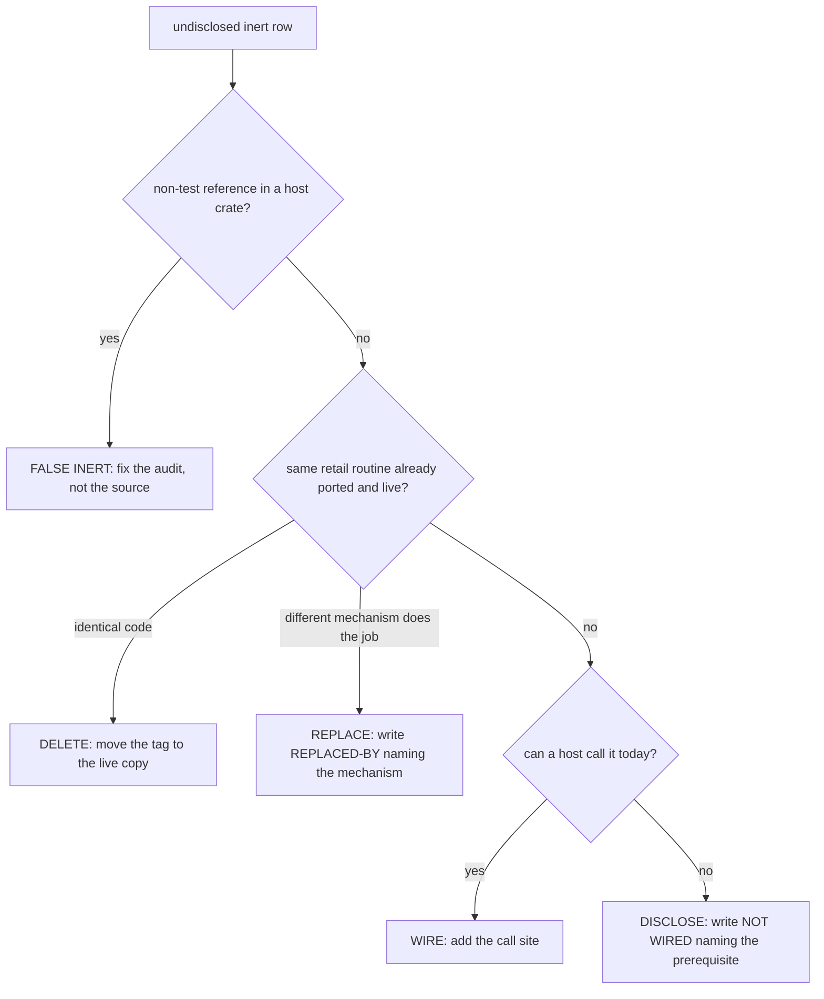

# Live-audit triage

`port-catalog.py --live-audit` lists every Rust port (a symbol carrying a
`// PORT: FUN_<addr>` tag) that no host entry point reaches. Each such row is
one of three things: a wiring gap, a missing disclosure, or a mistake in the
audit's own call graph. This page is how a row gets settled: the verdict
vocabulary, the checks that decide a verdict, the audit defects that produce
false rows, and the recurring ways a `NOT WIRED:` reason turns out wrong.
Reach for it when the audit shows a row you did not expect, or before writing a
`NOT WIRED:` / `REPLACED-BY:` tag.

## At a glance

| | |
|---|---|
| Command | `python3 scripts/ci/port-catalog.py --live-audit` |
| Output | `target/port-catalog/live-audit.md` |
| How the audit works | [`port-catalog.md`](port-catalog.md#the-audit) |
| Sections | stale tags (tagged `NOT WIRED` / `REPLACED-BY` but analysed live), **undisclosed inert**, disclosed inert, infra-replaced |
| This page | the **undisclosed inert** rows; the stale-tag section is [`stale-not-wired-triage.md`](stale-not-wired-triage.md) |
| Marker definitions | `NOT WIRED:` and [`REPLACED-BY:`](port-catalog.md#replaced-by) in `port-catalog.md` |

The row tables and cluster notes below are an **archive of settled rows**, kept
for the retail facts and the reasoning they record. They are not the live
worklist - run the audit for that. Rows are keyed by address and symbol; a
`file:line` site is where the anchor stood when the verdict was written, so find
the symbol by name.

## Verdict vocabulary

| Verdict | Meaning |
|---|---|
| `FALSE INERT` | The port **is** on a production path and the audit could not see the edge. No source change; the audit is what gets fixed. |
| `WIRE` | Genuinely unreached, and a host call site should exist. The row names that call site. |
| `DISCLOSE` | Genuinely unreached for a structural reason. The row supplies the `// NOT WIRED:` text. |
| `DELETE` | Redundant with an existing symbol that already covers the same retail routine. |
| `REPLACE` | Genuinely unreached, and no host is owed: the engine does the routine's job through a named different mechanism. The row supplies the `// REPLACED-BY:` text. |
| `VERIFY` | Could not be settled (for example, the file was being edited elsewhere). Never paste a tag on one. |

A `DISCLOSE` reason must say *why* there is no caller. "No caller" restates the
audit. The useful form names what must exist first: a host screen, a state
shape, an id space the engine does not carry.

A `REPLACE` reason must name the **mechanism**, not the absence. It is the
stronger claim: not "nothing calls this" but "nothing will, because the port
does this differently". [`port-catalog.md`](port-catalog.md#replaced-by) defines
the marker and carries two worked near-misses that stayed `DISCLOSE`. The bar: a
live sibling that computes a *different observable result* is a gap, not a
substitution. `depth_cue_scale_channel` (`8004A908`) stays `DISCLOSE` because the
live depth cue lerps toward a far colour where retail computes `raw*num/den`
with a floor of 4; `equip_compare_panel_fields` (`801D1290`) stays `DISCLOSE`
because the live panel prints a fixed ATK/UDF/LDF triple where retail selects
fields by category.

**A verdict is a hypothesis with evidence attached.** A wrong verdict becomes a
`NOT WIRED:` tag in source, and a wrong disclosure looks exactly like a correct
one: the next audit agrees with it. Re-check a row against the disassembly
before acting on it.

### How each verdict was settled

Three independent checks, because the audit's own graph is one of the suspects:

1. **Reverse-edge walk** over the audit's graph, to the point where each chain
   stops.
2. **Textual sweep** for the anchor symbol and every intermediate caller across
   the host crates (`engine-shell`, `web-viewer`, `asset-viewer`,
   `engine-render`, `engine-ui`). Run it with a positive control - a symbol
   known to have host references - so a zero is a real zero.
3. **Re-run of the audit** after any correction to the reachability pass,
   diffed section by section.

A correction to the pass should only ever move anchors from inert to live.
Then nothing becomes a newly claimed wiring gap and `--not-live` stays a floor.

### Which crate an anchor sits in decides whether it can be wired at all

`engine-core` has no `[[bin]]` and no `#[wasm_bindgen]` entry point, and neither
do the other library crates. Reachability is measured from *host* roots
(`engine-shell`, `web-viewer`, `asset-viewer`), so an anchor in a library crate
becomes live only through an edit in a crate that has a root.

Two consequences for scoping work. A pass limited to library files can produce
`DELETE` verdicts but structurally cannot produce a `WIRE`; if it reports one,
check what it edited. And wiring work partitions by the **host** whose flow is
missing, not by the crate the port lives in. The exception is a port whose
natural home is a rooted crate: the SC block checksum lives in `legaia-save`,
which `save-tool` roots, so it is live as soon as it exists.

## Analysis defects this triage found

Five shapes of audit false result. The first four are fixed in
`scripts/ci/port-catalog.py`; each can recur with a new trait or a new tag
placement. The `FALSE INERT` rows in the tables below are the regression set:
a change to the reachability pass that flips one back to inert has reintroduced
a defect.

### Trait default methods are invisible as call targets

A default method in a `trait` body has no `impl` block, so it was filed as a
free function while a caller writing `host.method(...)` is matched against
methods only. The two never met. Control: `op4c_n5_sub0_set_actor_model`
(`80024e08`) is the `FieldHost` default body; the production implementor
`FieldHostImpl` does not override it, so the default is what runs. **Fix:**
`trait Name { }` bodies are scanned alongside `impl` blocks and a default method
takes its trait's name as `impl_type`.

### winit `ApplicationHandler` callbacks are unreachable from `main`

The GUI hosts hand a struct to `event_loop.run_app(&mut app)`; winit then calls
`window_event` / `resumed` / `about_to_wait`. That dispatch crosses an external
crate, so the graph had no edge into it and everything below - `handle_keyboard`,
`handle_redraw`, `build_hud` and what they call - read inert. It is not a
root-set gap: `main` and `cmd_play_window` are reachable, and the chain dies one
call later. **Fix:** the methods of an `impl ApplicationHandler for T` block
join the root set (`EXTERNAL_DISPATCH_TRAITS`); see the
[root table](port-catalog.md#roots).

### Type anchors need an `impl` block in the same file

A `type` anchor was live only when a method of `impl <TypeName>` in the same
file was reachable. A tag on a plain data struct whose behaviour lives in free
functions could never be live: `MapObject` (`8003a55c`) and `ClutCellFx`
(`801e4c58`) have no `impl`, and `OptionsPhase` (`801da9f8`) is a phase enum
whose machine is `OptionsSession::tick`. **Fix:** fall back to the file's module
scope when the file gives the type no `impl` at all.

One residual by design: an `impl` that declares **no method**. `ActorExit` in
`world_map_panel_actors.rs` carried an `impl` holding one associated `const`.
A `type` anchor claims the behaviour lives on the type, so a method-less `impl`
is the audit correctly saying the behaviour is somewhere else. Read it as a
question about the port, not as a false negative (the resolution there was to
give the type its `apply` method; see the world-map rows below).

### The module-disclosure regex misses the markdown-heading form

`MODULE_NOT_WIRED_RE` accepted `//! NOT WIRED:` and `//! **NOT WIRED**` but not
`//! # NOT WIRED`. A file disclosed under that heading showed its *module*
anchors as disclosed and its *function* anchors as undisclosed - a split that is
itself the tell. **Fix:** the leading run is `[#*\s]*`. Still unrecognised:
`// PARTLY WIRED:`.

**Corollary for mixed modules.** A module-level marker declares every port site
in the file inert. That is right for a wholly inert module and wrong the moment
one member is wired: the audit then reports the live members as stale-tagged.
The fix belongs in the source. A mixed module carries no module-level marker;
its inert members take per-function tags. A module tag with *no* marker is a
live module tag - the only thing that can be stale is a marker that exists.

### An import alias erases every `Alias::assoc_fn` edge under it

A `Qual::name` call resolves by the qualifier **as written**. A call through a
`use ... as` alias looks for an `impl <alias>` nothing declares and contributes
no edge. `dev_menu_host.rs` imported `DevMenuRow as RetailRow` and called
`RetailRow::from_index(..)`; the `.is_closed(..)` method call three lines away
resolved fine, so half of one row model read wired and half did not. The fix is
in source: a `use` of the real type name scoped to the function body. This is
the counterpart of the free-function name collision in
[`stale-not-wired-triage.md`](stale-not-wired-triage.md): a collision
manufactures edges, an alias erases them.

### Over-approximations the corrections accept

- **Method-name collision hides a real gap.** `EmitterGate::arm` (`801d8258`)
  is unreached, but `route_camera_events` calls `.arm(` on a `CameraMover` and
  receiver types are not inferred, so the audit reads it live. The verdict
  stands on hand evidence.
- **Collision-prone names.** `new` in `scus_core_helpers.rs` resolves through
  any `new`; the receiver gate clears it
  ([`stale-not-wired-triage.md`](stale-not-wired-triage.md#how-the-recorded-rows-were-closed)).
- **Duplicate free-function names are a defect before they produce a row.** Two
  free functions named `description_source` in `engine-core` and `engine-ui`
  would have made the inert one read live on the other's first non-test call.
  Rename on sight (`row_description_source`), per the
  [recipe](stale-not-wired-triage.md#the-fix-each-mechanism-takes).

## How a disclosure goes wrong

Re-reading already-disclosed blocks against the disassembly found the same few
errors again and again. Each makes a reason that reads correct and sends the
next reader looking for a port that already exists.

| Shape | Example |
|---|---|
| The reason describes the subsystem the routine came from, not what the port is waiting on | `post_touch` (`8003d038`): "the collision path posts no touches" while `World::check_field_walk_touch` posts them |
| It names a dispatcher or table when the blocker is the other one | the panel painters are `+0x18` callbacks of `0x801F2B98` records, not `PTR_FUN_801F33B4` slots; `expand_cue_group` waited on a dispatch, not a table |
| It quantifies over two inputs when one is absent | the pause-menu Save gate: one input was a carry gap, the other a model gap |
| A kernel with a substitutable input reads as blocked by the input it does not need | `bearing_12bit` takes its arctan table as a parameter; `bearing_12bit_approx` is the host form |
| The engine holds one retail decision twice, under two addresses | `FUN_80046A20` (gauge colour) and `FUN_800349EC` (readout colour) share a threshold shape |
| An address-keyed catalog cannot separate VA-aliased twins | `801d388c` reads ported because the Muscle Dome routine at that VA is; the battle flow SM there is not |
| It names a lane or file-ownership boundary | not a structural fact; replace with the storage or dispatch prerequisite |
| It restates the audit | "nothing dispatches to it yet" |
| It claims a negative from the writer alone | "there is no checksum" - settled only by reading the *reader* |
| The same reason repeats verbatim across many anchors | that repetition is the worklist item: one missing host |
| Retail itself never calls the routine | `spawn_arc_helper` (`801d5780`): no wiring can close it |
| `delta / param` read as a step count | the consumer, not the kernel, says whether it is a count or an increment |

Two further rules the rows taught:

- **An unwired kernel's arithmetic is never exercised**, so a misreading
  survives until something calls it. Several kernels were wrong, not merely
  unwired (`bite_interval_bias`, the `0x400` floor in `FUN_801DCEAC`, the
  `PRO-` prefix). Wiring is the test.
- **An identity-valued port is the easiest to leave unwired and the cheapest to
  wire.** `tile_for_slot` (`801e1934`) maps a save slot to its icon tile; the
  card rack once open-coded `slot as usize`.

## Settled rows

### `engine-core` anchors

The modules later moved into `engine-battle`, `engine-minigames`,
`engine-menus`, `engine-field`, `engine-system` and their siblings keep their
verdicts; `engine-core` re-exports them.

| addr | symbol | site | verdict |
|---|---|---|---|
| `8001d7f8` | `sync_scene_name` | `crates/engine-system/src/scene_name_sync.rs` | DISCLOSE |
| `8001e54c` | `install_chunks` | `crates/engine-system/src/chunk_install.rs` | WIRE (wired) |
| `80021b04` | `from_model_sel` | `crates/engine-effects/src/summon.rs` | FALSE INERT |
| `80024e80` | `spawn_fade` | `crates/engine-system/src/fade.rs` | WIRE (wired) |
| `80026018` | `minigame_return_warp` | `crates/engine-core/src/world/frame_tick/minigame_sessions.rs` | WIRE (wired) |
| `80038050` | `confirm_menu` | `crates/engine-dialog/src/dialog.rs` | FALSE INERT |
| `8003a55c` | `MapObject` | `crates/engine-vm/src/field_regions.rs` | FALSE INERT |
| `8003ebe4` / `8003ec70` | `load_overlay_a` / `load_overlay_b` + module | `crates/engine-core/src/overlay_loader.rs` | DISCLOSE |
| `800520f0` | `battle_stage_overlay_entry` | `crates/engine-core/src/overlay_loader.rs` | DISCLOSE |
| `801cea3c` | `fmv_post_play_handoff` | `crates/engine-system/src/cutscene.rs` | WIRE (wired) |
| `801cf0d8` | `build_strip` | `crates/engine-minigames/src/slot_machine.rs` | WIRE (wired) |
| `801cf0d8` | `cash_out` | `crates/engine-minigames/src/slot_machine.rs` | FALSE INERT |
| `801cfc40` | `field_actor_dir_blocked` | `crates/engine-core/src/world/field_movement.rs` | WIRE (wired) |
| `801d06c8` | `buy` | `crates/engine-fishing/src/fishing/prize.rs` | FALSE INERT |
| `801d0748` | `hp_left` / `turns_left` | `crates/engine-menus/src/muscle_dome/session.rs` | FALSE INERT |
| `801d092c` | `max_qty` | `crates/engine-fishing/src/fishing/prize.rs` | FALSE INERT |
| `801d0b90` | `tick_walk_regen` | `crates/engine-field/src/walk_regen.rs` | WIRE (wired) |
| `801d0c3c` | `first_visible` | `crates/engine-fishing/src/fishing/prize.rs` | FALSE INERT |
| `801d4040` | `symbol_pad_bit` | `crates/engine-minigames/src/dance/types.rs` | DELETE (done) |
| `801d6f90` | `is_available` | `crates/engine-fishing/src/fishing/prize.rs` | FALSE INERT |
| `801d712c` | `select_owned_rod` | `crates/engine-fishing/src/fishing/rod_menu.rs` | FALSE INERT |
| `801d8258` | `arm` | `crates/engine-field/src/world_map.rs` | DISCLOSE |
| `801da9f8` | `OptionsPhase` | `crates/engine-core/src/options.rs` | FALSE INERT |
| `801dd0c0` | `category_check` | `crates/engine-menus/src/menu_item_category.rs` | WIRE (wired) |
| `801e1208` | `classify_card_directory` | `crates/engine-menus/src/save_select/card_directory.rs` | WIRE (wired) |
| `801e295c` | `advance_battle_mode` | `crates/engine-core/src/world/battle/monster_ai.rs` | WIRE (wired) |
| `801e3af0` | `card_directory_scan` | `crates/engine-menus/src/save_select/card_directory.rs` | WIRE (wired) |
| `801e3ba0` | `card_free_blocks` | `crates/engine-menus/src/save_select/card_directory.rs` | WIRE (wired) |
| `801e4794` | `step_clut_fx` | `crates/engine-core/src/world/effects.rs` | FALSE INERT |
| `801e4c58` | `ClutCellFx` | `crates/engine-core/src/world/effects.rs` | FALSE INERT |

### `engine-vm` anchors

| addr | symbol | site | verdict |
|---|---|---|---|
| `8001fa68` | `list_append_u16` | `crates/engine-vm/src/scus_core_helpers.rs` | REPLACE |
| `80020424` / `80020454` / `800204a4` | `alloc_list_head` / `alloc_and_append` / `free` | `crates/engine-vm/src/scus_core_helpers.rs` | DISCLOSE |
| `80021b04` | `spawn_move_actor` | `crates/engine-vm/src/move_vm/spawn.rs` | REPLACE |
| `80024e08` | `op4c_n5_sub0_set_actor_model` | `crates/engine-vm/src/field/host.rs` | FALSE INERT |
| `8003c9ac` | `motion_pause_kick` + module | `crates/engine-vm/src/motion_pause.rs` | WIRE (wired) |
| `8003fb10` | `validate_action` | `crates/engine-battle-vm/src/battle_action/validator.rs` | WIRE (wired) |
| `80046898` | `item_count_gate` | `crates/engine-battle-vm/src/battle_action/validator.rs` | WIRE (wired) |
| `801d829c` | `build_camera_angle_tween` | `crates/engine-battle-vm/src/battle_camera.rs` | WIRE (wired) |
| `801d9d30` | `apply_shake` | `crates/engine-battle-vm/src/battle_camera.rs` | DISCLOSE |
| `801e0088` | `child_billboards` / `pass2_brightness` | `crates/engine-vm/src/effect_vm/pool.rs` | FALSE INERT |
| `801e36c4` | `exec_centered_bar` | `crates/engine-vm/src/title_prim.rs` | DISCLOSE |
| `801e373c` | `init_card_state` / `exec_card_init` | `crates/engine-vm/src/title_prim.rs` | DISCLOSE |
| `801e3ee0` | `exec_centered_text` | `crates/engine-vm/src/title_prim.rs` | DISCLOSE |
| `801f0348` | `camera_height_from_size_class` | `crates/engine-battle-vm/src/battle_formulas/round.rs` | DELETE |

### `FALSE INERT` evidence

Grouped by the defect that hid the edge. This is the regression set.

- **winit dispatch** (callbacks in `crates/engine-shell/src/window/`):
  `confirm_menu` from `handle_keyboard`; `cash_out` from
  `World::exit_slot_machine`; `buy` / `first_visible` from
  `World::fishing_exchange_buy` / `World::open_fishing_exchange`; `max_qty` from
  `PrizeExchange::buy`; `is_available`, `select_owned_rod`, `hp_left` /
  `turns_left` from `build_hud`; `step_clut_fx` from `apply_world_clut_fx`;
  `child_billboards` from `World::active_effect_sprites`, and `pass2_brightness`
  from it.
- **Debug-path host edge.** `from_model_sel` is reached from `handle_keyboard`
  through `World::active_field_fx_render_nodes` -> `special_render_nodes`, behind
  the field-FX debug key. The edge is real, so `NOT WIRED:` would be false. The
  caller reads only `node.mode` for a log line, though: the routing the port
  exists for (sending `SoundEmitter` to the audio host) has no consumer.
- **Trait default method.** `op4c_n5_sub0_set_actor_model`, as above.
- **Type-anchor granularity.** `MapObject` (behaviour in the free
  `parse_map_objects`), `ClutCellFx` (`World::step_clut_fx` plus `read_cell`),
  `OptionsPhase` (`OptionsSession::tick`, live through the `web-viewer` roots).

The fishing presentation half lives in `crates/engine-ui/src/ui_fishing.rs`
(`persistent_hud_draws`, called from `window/hud.rs`) and is live the same way.

### `WIRE` rows: the call site that should exist

Every row is landed. What each wire had to be:

- **`minigame_return_warp`** (`80026018`). A two-part wire. `FUN_801D239C`
  (`0x801d2894..0x801d28bc`) drains each Baka Fighter tally into the prize
  accumulator `_DAT_80084440`, and `FUN_80026018` (`0x80026050..0x80026078`)
  adds that accumulator into the **casino coin bank** `0x800845A4`, clamped at
  9,999,999 - not party gold `0x8008459C`. The tally must feed a coin
  accumulator (`World::minigames.winnings`) *and* the warp pair
  (`arm_minigame_warp` / `minigame_return_warp`) must bank it on the
  `enter_baka_fighter` / `exit_baka_fighter` path. Either half alone is wrong:
  call sites alone credit zero, the redirect alone loses the prize.
- **`fmv_post_play_handoff`** (`801cea3c`). Consumed by `apply_fmv_handoff` in
  `crates/engine-shell/src/window/field_render.rs`. The `Field` /
  `ResumeField` arms are a scene label plus a door word; the `CardInit` /
  `ModeZero` arms are disclosed as modes the engine does not have.
- **`build_strip`** (`801cf0d8`). `build_reel` builds both permuted 20-slot
  strips per reel in retail's interleaved draw order (`STRIP_PROBE_PRIMARY` with
  base `0`, `STRIP_PROBE_SECONDARY` with `slot_payout::BONUS_VALUE_BASE`);
  `SlotMachine::new` builds all three reels and seeds the display strip from the
  symbol half.
- **`field_actor_dir_blocked`** (`801cfc40`). The actor arm sits in the per-axis
  step gate beside the wall arm `World::field_dir_blocked`, so NPCs block the
  player; covered by `crates/engine-shell/tests/field_collision_discriminator.rs`.
- **`tick_walk_regen`** (`801d0b90`). `World::tick_field_walk_regen`, from the
  field frame tick, gated on the retail `0x20` step cost.
- **`advance_battle_mode`** (`801e295c`). The action state machine's `case 0xFF`;
  called from `crates/engine-core/src/world/battle/loop_driver/round.rs`.
- **`validate_action`** / **`item_count_gate`** (`8003fb10`, `80046898`).
  `WorldActionValidator` implements `ActionValidatorHost`;
  `World::action_validity_mask` accumulates the per-slot validity byte and the
  target pickers read it through `battle_target_rows`. Menu greying reads the
  mask, not the return value. `item_count_gate` is the arm-`0x82` callee.
- **`motion_pause_kick`** (`8003c9ac`, retail caller `FUN_801D5B5C`). `World::kick_field_npc_motion_pause`
  runs it from `trigger_field_interact` and both partition-2 install paths, over
  ambient channels every placement seats with the `0x20000` bit. The ambient
  tick is the per-tick clip consumer, with `clip_current` as the `+0x5E` latch
  ([motion-vm.md](../subsystems/motion-vm.md#the-motion-pause-kick)).
- **`timed_fight_turns_left`** (`801d0748`). The strip it feeds is Koru's timed
  fight. A Muscle Dome round is an ordinary battle that ends on a knockout, so
  wiring it *into the dome* would have been a bug; `engine-core::timed_fight`
  gates it on the formation's first monster seat and both hosts draw the strip.
- **`tile_for_slot`** (`801e1934`, `crates/asset/src/save_icon.rs`).
  The card-block icon writer in `engine-core::card_write` routes through it;
  retail's VRAM x is `0x3C0 + slot * 4` halfwords.

`DELETE` rows: `symbol_pad_bit` (`801d4040`) duplicated `DanceDir::pad_bit`
(arms `0x80` / `0x20` / `0x10`), which now carries the tag.
`camera_height_from_size_class` (`801f0348`) duplicated
`camera_height_for_frame`, which is the whole of `FUN_801F0348`, is wired
through `BattleActionHost::camera_bounds` and inlines the `<< 7` + clamp.

### `DISCLOSE` and `REPLACE` reasons

The reason each row carries, in short form. The source tag is authoritative.

- **`sync_scene_name`** - the engine changes scene by label through the scene
  host and carries no staged-name / active-buffer / scene-index-word triple for
  this bridge to resolve between.
- **`install_chunks`** (wired) - every `scene_vab_stream` entry *is* the
  `[type, size, data]` list, and types `2` / `0xC` are the SEQ install, not a
  VRAM upload. The scene loader finds each stream's score by walking the list
  (`chunk_install::seq_chunk_offset`).
- **`spawn_fade`** (wired) - the engine's fade pool is one seat
  (`World::presentation.fade`), so the allocation arm always succeeds.
- **`load_overlay_a` / `load_overlay_b`** - the host trait is implemented
  (`OverlayLoaderHost for ProtCdDmaHost`); the engine has no mode-table
  overlay-residency model and keeps no `gp+0x924` / `gp+0x934` cache pair, so no
  dispatcher routes a paired parallel load.
- **`battle_stage_overlay_entry`** - the engine carries no per-formation stage
  id, so nothing produces the `_DAT_8007B64A` value this maps. The one battle
  that pages a stage overlay is primed through `World::prime_battle_tutorial`.
- **`arm` (`EmitterGate`)** - its retail caller sources parameters from the
  world-map trigger globals, which the world-map controller does not implement.
- **`category_check`** (wired) - the item-category favor score behind retail's
  per-character item-menu ordering and greying.
- **`card_directory_scan` / `card_free_blocks` / `classify_card_directory`**
  (wired) - the browser card rack (`web-viewer::cards`) mounts raw card images
  and runs them; see [the card rows](#the-menu--save--memory-card-cluster).
- **`alloc_list_head` / `alloc_and_append` / `free`** - the engine's actor
  storage is a generational `Vec` pool, not a retail free-stack.
- **`list_append_u16`** - `REPLACE`. Its retail caller `FUN_8003F3FC` is ported
  as the per-particle half of `fog_particles::FogPool::render_step`; the `jal`
  at `0x8003F800` is that port's free-slot return, through
  `engine-core::cutscene::sprite_stack_push`.
- **`spawn_move_actor`** - `REPLACE`. The field and battle paths construct
  actors through the world's own pool (`impl MoveSpawnHost for World` exists for
  tests).
- **`exec_centered_bar` / `exec_centered_text` / `exec_card_init` /
  `init_card_state`** - the title and save screens are drawn by `engine-ui`'s
  `ui_title_save` builders, not by replaying the overlay's primitive
  descriptors, so no host supplies a `PrimHost`. The same covers
  `exec_clear_image` / `exec_move_image` / `exec_sprite_descriptor`.

## Cluster notes

Each note records what settling one group of rows established about retail or
about the port. Rows in these groups sat mostly in the audit's *disclosed*
section.

### The world-map dev-menu row model and the panel exit

| addr | symbol | verdict |
|---|---|---|
| `801ead98` | `DevMenuRow`, `from_index`, `is_closed` | `WIRE` |
| `801ed308` / `801ed590` / `801ee5d4` | `ActorExit` | `WIRE` |

- **Row model.** The two gated arms of `FUN_801EAD98` pick the *string pointer*
  on `_DAT_8007B868` rather than drawing a label and deciding afterwards. The
  port does the same through `DevMenuSession::row_label` -> `row_is_closed`.
- **Panel exit.** `FUN_801ED308`'s exit arms store `-1` to `scene[+0x2E]`
  (`0x801ED53C`); only its `case 5` zeroes `+0x3E` (`0x801ED52C`); and the exit
  stores `ctx[+0x50] = next_handler`. `ActorExit::apply` performs those stores
  and `PanelActorHost::retire` calls it.
- The id dispatcher `FUN_801F159C` is ported as
  [`baka_hub_actors::hub_dispatch`](../subsystems/world-map.md#the-panel-actor-state-machines).
  It takes `PTR_FUN_801F33B4[state]` as a caller-supplied closure, and seven of
  the 52 slots are read out. The sub-list, text-box and flag-window exits hand
  back to `0x1A`, which is one of the seven; the fade / flash exits pick `0x29`
  and `0x2B`, which are not.
- The panel-window host all of `world_map_panel_actors.rs`,
  `world_map_overlay.rs`, `world_map_panel.rs` and `travel_art_actor.rs` named
  as missing is `legaia_engine_core::world_map_panel_host`
  ([`world-map.md`](../subsystems/world-map.md#the-panel-actor-state-machines)).

### The battle-camera rows

- **`build_camera_angle_tween`** (`801d829c`) emits per-frame **increments**,
  not step counts. The arming routine `FUN_80021248` signs each record's first
  halfword by comparing the endpoint against the live global (`0x80021378`,
  `0x800213D8`), which is meaningful only for an increment; the builder's fourth
  argument is the tween's duration. Retail's law is arrive-together over one
  shared duration. `engine-shell`'s `window/battle_cam.rs` `Glide::linear`
  builds its rate table from the port, with the 12-bit shortest-arc yaw and the
  TR.z projection prescale. Still absent: the *producer* - the walker's
  endpoints come from the traced phase framings, not retail's arming path.
- **`apply_shake`** (`801d9d30`) is `DISCLOSE`. Its `amplitude` is a `1..=0x15`
  shift count read from `_DAT_8007B630`, whose only retail writer is a field-VM
  opcode (`overlay_0897_801de840.txt` `0x801E2134`, a 3-byte instruction). The
  port models the opcode (`FieldHost::op4c_n8_sub4_set_b630` ->
  `World::camera.shake_amplitude`). The global's second reader is the field
  follow camera `FUN_801DB510`, which loads it at `0x801DB850` and folds the
  shake into its zone ease; the port's follow camera consumes it too.
- The battle action SM arm at `0x801E4938..0x801E497C` is **not** a shake: it
  tests the camera pitch `DAT_8007B790` against `0x191` and, at or above,
  zeroes the pitch and stores the absolute `0x500` into `_DAT_800840BC` - a
  framing snap to the close-up pose. The battle camera applies it on the
  `0x2E -> 0x50` edge (`BattleCamera::observe_action_state`).

### The battle cluster

Six disclosures in the `engine-vm` battle band named the wrong blocker:

| Anchor | The clause that was wrong | What holds |
|---|---|---|
| `801dceac` `target_group_aim` | `bearing_12bit` is unwired for want of the arctan LUT | live on every enemy-cursor step, over `approx_arctan_lut` |
| `80046a20` `gauge_colors` | the HUD's bar colour is a constant of the widget | a per-frame index, from the readout-tint siblings |
| `801d829c` `build_camera_angle_tween` | the engine has no walker | the native battle camera is one |
| `801f0450` (arts auto-combo) | the caller is the unported flow SM `FUN_801D388C` | the caller is the action SM's own `Begin` arm |
| `801dba04` / `801db81c` / `801da34c` | `FUN_801D0748` is not ported | its state space is `engine-core::battle_flow`, and it is live |
| `801e22c8` `expand_cue_group` | neither cue table is parsed | both are, as `move_power::EffectAuxTables` (`0x801F6470`); the blocker was the caller |

- **The position accessor.** `BattleActionHost::actor_position(slot)` is the
  actor `+0x34` / `+0x38` seat. With it the facing block at
  `0x801E4334..0x801E43A4` in `magic_cast_begin` runs: the single-target arm and
  the `target_group_aim` group arm, which `FUN_801E7320`'s class-`7` / class-`8`
  target codes reach.
- `FUN_801DCEAC`'s extent output is **floored** at `0x400`, not capped (`slti` /
  `beq` at `0x801DD094`).
- The group walk's monster liveness gate reads the actor's `+0x4` prim word. The
  summon-fade sweep at `0x801E4B50` zeroes `+0x4` and writes `+0x21C = 0xFF` in
  the next two instructions, so the port reads the `+0x21C` twin.
- The action SM's `Begin` arm seeds its turn cursor from the formation-advantage
  byte `ctx[+0x290]` and latches it. `engine-core` rolls, seeds and latches its
  own `World::battle_formation` copy at battle entry, so nothing writes
  `BattleActionCtx::formation_advantage` in production and only the seed's `0`
  arm runs.
- **`approach_distance`** is live through the effect-script walker, not the
  attack band. Its only caller is `FUN_801DEA50`'s direct-spawn branch, which
  passes a `0x93` / `0x84` record's scaled Z offset (`0x801DEDC8`); that branch
  is `action_effect_script::step_effect_script`.
- **`expand_cue_group`.** Retail's only caller is the damage-application
  primitive `FUN_800402F4`, which reaches `jal 0x801e22c8` from eleven branches
  and picks the group id per branch: eight literals, two computed, one
  forwarding its own `param_2`. The branches differ in three literals apiece
  (tint, actor-state word, group id) plus one `per_target` loop flag.
  `battle_cue_group::cue_group_for` is that table, and the SM's state `0x3F`
  selects a site from the acting actor's `+0x1E8` / `+0x1E9` pair. The applier's
  stat arithmetic stays behind the `apply_damage` hook.

### The menu / save / memory-card cluster

The card rows are one gap - an asynchronous card backend behind
`save_select::CardIoMachine` - stated once on the module.
`spell_targets_group` stays `DISCLOSE`: wired alone it routes a group spell past
the target picker to an applier that heals one roster member.
`root_menu_confirm_route` is `WIRE`: its seven sub-screen ids are distinct, so
`FieldMenuSession` resolves the confirmed row through the id.

Facts the re-read established, owned by
[`save-screen.md`](../subsystems/save-screen.md) and
[`field-menu.md`](../subsystems/field-menu.md#top-level-pause-menu):

- The pause root's gated rows are **Load then Save**. `FUN_801CFD68` hands the
  string primitive `0x801CEA00` for row 5 and `0x801CEA08` for row 6; those
  cells hold `@Load` and `@Save`. So `0x18` loads and `0x19` saves, and the
  entry-context byte `0x01` is a field script's save point.
- Row 6 is gated on `_DAT_8007B6A8`, the per-scene save-allow flag (`lui 0x8008`
  + `lbu -0x4958`). `0x800846A8` is the escape counter. The flag is the MAN
  header bit [`ManHeader::low_flag`](../formats/encounter.md), carried through
  scene load to `FieldMenuSession`.
- The entry-context kind is a model gap: retail keeps one global pointer whose
  first byte is the armed op-`0x49` sub-op, and the port uses a per-context
  tagged park.
- **The SC block carries an additive checksum** at
  [`RETAIL_BLOCK_CHECKSUM_OFFSET`](../formats/save-record.md): the composer
  `FUN_801E1934` sums the block and stores at `+0x1FFC`; the load path's state 5
  (`FUN_801DD35C` at `0x801df880`) re-sums and routes a mismatch to "Damaged
  data.".
- `DAT_80084140` is the live game-state window the block is composed *from*
  (the array walked at `+0x1818` is the item bag). The read and compose buffers
  are two distinct `0x2000` regions (`0x801E5120` / `0x801E7120`).
  `FUN_801DAFD4` is the shop's Buy / Sell / Quit picker.
- **Card filenames.** `classify_card_directory`'s class array is keyed by the
  save number in a directory frame's **filename**; a 5x3 preview grid is keyed
  by **physical block**, and on a real card the two disagree (`-03` can sit in
  block 1). Filenames must be unique, so a host that addresses a block asks this
  walk which numbers are taken: `engine-core::card_write::card_save_index`.
- The save filename separator is `PRO-`, not `PRO_`: the retail literals are at
  `0x801EF03C` / `0x801EF054` (PROT 0899 file `0x20824` / `0x2083C`). The
  matcher takes it from `legaia_save::card::LEGAIA_SAVE_FILENAME_PREFIX`. A test
  fixture built from the constant under test cannot see a wrong literal.
- **`card_message_rows`.** `FUN_801E2EE4` draws no text. Its 4th argument is
  `(index & 0x3FF)` into a 20-byte-stride **sprite descriptor** table at
  `0x801E50A8` (PROT 0899 file `0x16890`). It builds one `0x34`-byte four-vertex
  GP0 packet - tpage `+0x04`, CLUT `+0x06`, texel origin `+0x08`, extent `+0x0A`,
  two RGB triples at `+0x0C` / `+0x10` scaled by the caller's brightness - and
  links it into the ordering table through `FUN_8003D2C4`. The first two
  records are `254x148` and `254x16`: the messages are pre-rendered strips of
  the title TIM (PROT 0890), live as `engine-ui::title_strip_rows`
  ([`save-screen.md`](../subsystems/save-screen.md#the-title-strips-behind-the-load-window)).

### The op-`0x49` submode actor family (`baka_hub_actors`)

The engine has the field system-actor pool these rows were said to lack:
`World::man_load_actor_reset` spawns an `ActorHandler::SubmodeDriver` actor on
every MAN load (retail's `FUN_801D9C3C` at `0x8003B444`). The gap was a
dispatch arm.

| addr | symbol | verdict |
|---|---|---|
| `801f159c` | `hub_dispatch` | `WIRE` - `World::tick_handler_actors` -> `World::tick_submode_screen` |
| `801f0adc` | `coin_exchange` | `WIRE` - handler slot `0x25`, opened by `World::open_coin_counter` |
| `801f1138` / `801f1e48` / `801f1fdc` / `801f1d90` / `801f20b0` / `801f2134` | the state machines | `WIRE` - slots `0x27` / `0x32` / `0x28` / `0x13` / `0x1a` / `0x00` |
| `801f16c0` / `801f17d8` / `801f1890` / `801f1950` / `801f1a1c` / `801f1ab0` / `801f1b64` | the panel painters | `WIRE` - panel-window records, not handler slots |
| `801f90dc` | `acquisition_caption` | `REPLACE` - the routine is `FUN_801D0F1C` |

The painters are the `+0x18` callback of a record in the `0x801F2B98`
panel-window table
([`script-vm.md`](../subsystems/script-vm.md#the-panel-window-records-and-the-descriptors-that-install-them));
basing the table four records later, at `0x801F2C0C`, numbers every record four
low. Every dump at `0x801F90DC` is class `misbased`: the bytes are the menu
overlay's shared item-info panel `FUN_801D0F1C` printed `0x281C0` high, which is
ported live in `engine-ui`'s pause lists.

#### What still chooses which painter runs

`World::tick_submode_screen` calls `HubPainter::for_window` on whatever record
index the open screen carries. Retail picks that index through a panel
**descriptor**: a state machine installs one (`FUN_801E9B3C`) and the descriptor
names the record. The port records the install as
`HubAction::InstallPanel(<descriptor VA>)` and `World::apply_submode_actions`
ignores it, so the index comes from the opener's argument.
`World::open_coin_counter` passes record `1`; the field-VM op-`0x49` path
(`op49_menu_request`) passes `None` for every sub-op it does not resolve
elsewhere. So record `1` is the only index a production frame reaches.

The descriptors the ported state machines install (`0x801F3340`, `0x801F3360`,
`0x801F3370`, `0x801F3294`, `0x801F3388`, `0x801F2A88`) sit outside the
panel-window record table, so the descriptor -> record mapping is a second
format, and it is unread.

### The field / motion / camera block

Reasons that named an existing symbol as missing:

| Anchor | What is there |
|---|---|
| `post_touch` (`8003d038`) | `World::field_prop_dir_probe` reports the touched placement; `World::check_field_walk_touch` posts from the locomotion step |
| `motion_pause_kick` (`8003c9ac`) | both gates and the default-move table are projectable from the per-slot maps |
| `state_pick` (`801f1f4c`) | `Actor::state_50` / `Actor::state_54`; wired as the subsystem actor's default handler id `7`, run by `World::field_menu_button_state` as the menu-open gate |
| `field_audio_release_steps` (`801d8450`) | `SustainedSfx::stop_voice` and `SeqResourceTable::release` (the `0x80091508` table) |
| `submode_panel_rows` (`801e6984`) | `open_submode` seeds `World::field_vm.submode_context`; the installer `FUN_801EF014` is hosted on the field path (slot `0x23`, `engine-core::field_submode_flag_window`), installs record 14 and draws these rows on both hosts |
| `field_actor_plan` (`8003bc08`) | `move_vm::ActorState::flags` is the `+0x10` flag word |
| `tick_reflection` (`801e5154`) | `ActorState` carries all the fields but `+0x64`, at retail offsets |
| `refresh_object_grid_marks` (`80017bec`) | three of four `.MAP` regions are resident, and the collision grid is mutated live |
| `passive_hud_icons` (`801d095c`) | `Camera::transform`; the glue is per host, over `World::passive_hud_points` |
| `step_scene_program` (`801d4a60`) | `_DAT_8007BC20` is modelled by four ports; live source `AudioOut::xa_active()` |

Rows with their own findings:

- **`expand_battle_id`.** Retail's caller is the battle-init formation resolve
  `FUN_80055B6C`, which the engine has no analogue of (it resolves a typed
  `FormationDef`). The non-zero-id arm reads `DAT_8007b7fc`, a global with **no
  writer anywhere in retail**.
- **`spawn_arc_helper`** (`801d5780`) is inert in retail: `FUN_801D5780` has no
  `jal`, no `j` and no literal address word in `SCUS_942.54`, the overlay images
  or the PROT entries. Its siblings are the controls: `FUN_801D2404` and
  `FUN_801D25EC` are each found by `jal`, `FUN_801D2298` as a table word. The
  bytes are a complete routine (field overlay `0897_xxx_dat` at file `0x6F68`,
  `addiu sp, sp, -0x28`), so it is shipped dead code. Traps:
  `ghidra/scripts/funcs/801d5780.txt` is a wrong-image import whose header
  resolves `entry=801d56fc`, and in the cutscene images the VA is a different
  function's entry.
- **The ledge hop** (`field_ledge_hop_arc`). `advance_hop_session`
  (`FUN_801d2298`) **writes no position**: it is the tick of the paired helper,
  the phase / SFX / movement-lock machine. The record that moves the player is
  the arc helper, ticked by `FUN_801d5c08`. Neither tick has a caller; an actor
  template's `+0x08` is its tick pointer, and reading the three templates the
  setup allocates from names all three ticks. Both run from
  `World::step_field_vertical` (`field_ledge_hop_wired.rs`,
  `field_ledge_hop_disc.rs`).
- **`spawn_arc_with_emitter`** (`801d25ec`). One named caller: field-VM op
  `0x43` sub-`0` / `1` / `0xA` / `0xB` at `0x801DF5AC`. That op is halt *and*
  arc: retail runs the arc unconditionally on the acquire's success side
  (`0x801DF410` takes the PC-advance path only on failure), building the landing
  triple from the operand's two tile bytes and falling back to the actor's own
  position when both are zero. The port forwards the coords to
  `FieldHost::field_halt_acquire_apply`; `World::locomotion.ledge_hop` is the
  player's single `Option`, and this entry arcs whichever actor the script runs
  on.
- **`fade_ramp`** (`80020c14` / `80025000`). `FadeRamp` *is* the `+0x7C` block;
  the pool is only what `spawn_fade` needs for concurrent fades.
- **`ease_camera_offset`** (`801da390`). `zone_angle` is the camera-zone
  record's `+0x4A`; its retail writer is field-VM op `0x4C` outer-nibble-4
  sub-9, the same opcode that writes `_DAT_8007BCAC` on its delta arm
  (`op4c_n4_sub9_default_write` / `_default_ramp` / `_delta_write_or_ramp`). The
  channel is a height, not a yaw; see the camera-ease block below.
- **`reset_pool`** (`8003cda8`). The player's `player_scale_ramps` outlives a
  scene, and `World::install_field_player` resets it there.
- **The touch mailbox.** `FUN_8003D038` posts an actor id into `DAT_80073F1C`.
  The reader is the head of the ambient VM's op-`0x05` wait arm (`0x8003882C`):
  it rewrites the wait cursor to `duration - DAT_1F800393` when the mailbox
  names its own actor and its `0x801C6470` record byte is not the `0x8C`
  sentinel, then clears the mailbox. Port: `AmbientMotion::pending_touch`
  (`None` = the `0xFF` empty sentinel), `AmbientMotion::take_touch_wake`,
  `World::post_ambient_motion_touch`; covered by `ambient_touch_wake.rs`.

### The dance / fishing minigame block

The playable halves (`dance::DanceGame`, `fishing::PondSession`) are live. This
cluster is the presentation and actor half of the same two overlays.

| Row | Verdict | What settled it |
|---|---|---|
| `roll_hit_type` (`801d26cc`, `fishing_actors.rs`) | `DELETE` | duplicate of the live `fishing::band_roll`; the wrapper delegates |
| `bite_interval` (`801d26cc`) | `WIRE` | `BandCheck::tick` uses the real strike-modulus ladder |
| `bite_interval_bias` (`801d26cc`) | `WIRE` | retail's `li s1, -0x64` is an assignment into the register holding the credit base, so the far band *replaces* the base; the kernel is `bite_credit_override`, returning `Option<i32>` |
| `clear_catch_slots` (`801d746c`, `fishing_chrome.rs`) | `DELETE` | same table as `fishing::ReelCadence`'s ring; `reset` calls it |
| `dance_scene_stage` (`801d414c`, `dance/stage.rs`) | `WIRE` (partial) | `clear_pad_latch` by `World::enter_dance` / `exit_dance`, the block-base restore by `dance_venue::sync_dance_venue`; `bgm_force_reload` has no consumer |

Remaining gaps, by prerequisite:

- **No line endpoint.** `clip_segment_2d` and `project_segment` clip two-point
  draws. The line kind exists (`screen_prim::line_quad`, which the slot
  machine's paylines draw through on every host); what is missing is the line's
  rod-tip end, a projected point on an angler model the port does not spawn.
- **Effect-part pool** - closed for the spawn wrappers. The dance's two feed
  `MinigameActorPool` through `DanceGame::spawn_sprite_part`; the splash and
  ripple wrappers feed `engine-core::minigame_fx::MinigameFxPool`. Every host
  draws both.
- **Actor records.** Closed for the dance (`minigame_actor::MinigameActor`).
  Open for fishing: `roll_wander_target`, `step_facing`, `fish_camera`,
  `float_actor_tick`.
- **No retail-coordinate HUD surface.** `hud_draws`, `dance_hud_draws`,
  `dance_score_box_slots`, `dance_hud_widget_quad`, the three digit-glyph
  selectors, `centred_panel`: the hosts lay their readouts out at their own pens
  rather than in 320x240 framebuffer coordinates.
- `dance_face_rig` and `walk_grid_overhead` want a call in
  `crates/web-viewer/`; `bite_pad_nudge` wants `PondInput` to carry the retail
  pressed-pad word instead of a pre-counted `edge_bonus`.

### The render / GTE cluster

`engine-render`'s disclosed rows are honest (no host references, no
`FALSE INERT`). Two findings inside the disclosures:

- The three `GteMat3::rot_*` builders have a consumer: `camera_view_rotation`,
  the port of retail's composition pass `FUN_8001CF50`, whose `jal`s at
  `0x8001CF9C` / `0x8001CFC0` / `0x8001CFE4` call them. The draw record carries
  the `+0x52` word (`flags_52`), and both hosts reach it through
  `camera_relative_model_prefix`
  ([`renderer.md`](../subsystems/renderer.md#camera-relative-nodes-fun_8001cf50)).
- The afterimage streak's projection inputs are battle-context words
  (`ctx[+0x1144]`, `ctx[+0x6C6]`) written by `FUN_801DEA50`, ported as
  `engine-core::action_effect_script`. Its caller `FUN_80047430` is ported and
  live; the effect-script block rides the disc action entries as
  `MonsterAnimation::effect_script` and `World::tick_battle_animations` drives
  the walk
  ([`battle-action.md`](../subsystems/battle-action.md#the-per-action-effect-script-fun_801dea50)).
  What the streak still waits on: the terminator's `ctx[+0x1014]` install and
  per-target `+0x1144` homing block have no engine-side context words to land
  in.

### The infrastructure / leaf-kernel cluster

Around forty-five disclosed-inert anchors spread over `engine-core`'s SCUS
leaf kernels, overlay/CD/MDEC plumbing, mode entry, cutscene elements and
effect ribbon; `engine-vm`'s SCUS helpers, VRAM rect copy, title primitives,
panel backread and world-map overlay leaves; plus single anchors in `asset`,
`mdec` and `engine-audio`. None is `FALSE INERT`. What the cluster produced
instead is a **measurement**, because every anchor was put through the
five-form reference scan
([`address-reference-scan.md`](address-reference-scan.md)) before its
disclosure was read, and the scan disagreed with the disclosure often enough
to be the point of the exercise.

#### Two anchors are retail-unreachable

`FUN_801CFE20` and `FUN_801CFE5C` - the FMV overlay's `DecDCTinSync` /
`DecDCToutSync`-shaped wrappers, ported as `engine-core::mdec_dma_sync` - have
**no reference of any form** across all 1234 images, including the raw bytes of
every extracted PROT entry. The decode loop reaches the
blocking waits through the DMA kick routines `FUN_801CFFDC` / `FUN_801D0070`
instead, which call `FUN_801D0100` / `FUN_801D0198` directly. The module had
described the wrappers as the entries "every decode step funnels its channel
waits through"; that is now recorded the other way round, as code the game
links and never calls. This is the bucket a wiring worklist has no slot for:
the honest verdict is neither `WIRE` nor a prerequisite, but "no host call
could correspond to anything".

#### Nine disclosures named a blocker that already exists

Each of these read as a correct disclosure and would have survived another
audit. They are listed with what the scan or a catalog lookup found instead.

| Anchor | The reason said | The measurement says |
|---|---|---|
| `801dea50` `action_effect_script` | the caller is the battle-action SM `FUN_801E295C` | no reference of any form inside that overlay image; both `jal`s are in the anim-node tick `FUN_80047430`, ported and live |
| `800265e8` `seed_boot_offset_table` | nothing in the corpus indexes `0x800917B0` | `FUN_8002630C` indexes it by VAB slot for `SsVabOpenHead`; the words are the per-slot SPU bases, already ported |
| `80020224` `walk_descriptor_pairs` | MAIN_INIT is documented but not ported | MAIN_INIT is ported, as `engine-core::mode_entry_init` |
| `80031ae4` `float_tween` | the label emitter `FUN_80032434` is not ported | it is ported; and the sibling draw pass `FUN_80031D00` named alongside it is ported **and live** |
| `801d841c` `save_screen_spawn` | nothing wants a flash element at all | it is not a flash element - descriptor `0x800706BC` names the save/load screen driver; and `FUN_801ED308` calls it, ported and live |
| `801d5e20` `shift_primitive_colours` | no caller | the field VM's op `0x4C` nibble-E sub-6 arm, whose host hook has an empty body |
| `801e5b4c` `aggregate_slot_stats` | the engine's equip screen has its own aggregator | the retail consumer is the hub entry list's sub-draw; the marker its live port emitted is now the sub-draw itself |
| `800468a4` `enqueue` | the field-VM hook has no renderer | that is one route; the actor tick's kind-7 draw arm is the other, and it is live. The hook has a body now - `World::apply_vram_rect_copies` over the software VRAM - so only the kind-7 arm is still open |
| `8001fa00` `init_identity_index_list` | the emitter that pops the list is unported | true, but the *seeder* is MAIN_INIT, which is ported |
| `80035c00` `set_pair` | writing it from the menu host would invent state | the writers are three sites in the battle action resolver, not a menu |

The shape worth generalising: **a disclosure is most often wrong about the
half of the chain it did not have to look at.** Seven of the ten got the
engine side right and the retail side wrong, and the retail side is the one a
scan can settle mechanically.

#### The rest measured honest

`panel_backread_loader` (one reference, the unported `FUN_80025358`),
`morph_weight_apply` (the template word at descriptor `0x8007068C + 8`, exactly
as disclosed), `effect_ribbon` (`FUN_8001ADA4` case 4, as disclosed),
`cutscene::sprite_stack_pop` (`FUN_801D629C` at `0x801D648C`), `gameover_banner`
(caller live, mode 18 never entered), `title_prim`, `overlay_loader`,
`chunk_install`, `cd_dma`, `input`, `scene_name_sync`, `mode_entry_init`,
`move_no_effect_guard`, `spawn_move_actor`, `scus_core_helpers`,
`monster_archive::animation`, `new_game`, `player_anm`, `strv2_decode` and
`seq_events`. `mode::other_warp_init_stage` is honest with a sharper edge: it
has **no `jal` anywhere**, and its one reference is the mode-table slot
`mode_table[24] + 0x10` at `0x800709DC`, a table `legaia_asset::mode_table`
already parses from the disc.

#### One `WIRE`, since closed

`save_screen_spawn` (`801d841c`), whose call site is `PanelActorHost`'s handler
for the fade/flash actor's phase-1 arm in
`crates/engine-field/src/world_map_panel_host.rs`. The handler saved and cleared
the tint triple and stopped, dropping the spawn.

Reading the callee before wiring it changed what the wire *is*. `FUN_801D841C`
allocates from descriptor `0x800706BC`, whose handler word is the in-field
save/load screen driver, and writes `1` to `+0x5C` of the **returned** actor -
that driver's save-vs-load discriminator. So the arm is a save-screen hand-off,
and the routine's old name was for a reading of the bytes that the descriptor
table falsifies. Wiring it also identified the actor's parking releaser: the
menu overlay's save-side UI, which is the only other writer of the two globals
the two halves share. Both are written up in
[`world-map.md`](../subsystems/world-map.md#the-save-screen-hand-off).

### The minigame cluster's disclosures were mostly wrong about *what* blocked

A pass over the whole minigame slice - `baka_fighter*`, `dance`, `fishing*`,
`slot_machine`, `muscle_dome`, `minigame_floor`, `other_game_overlay` and
`engine-ui`'s `other_game_hud` - produced **no** new `WIRE` and **no** new
`FALSE INERT`. Every anchor really is unreached. What it did produce is six
disclosures whose named prerequisite already existed somewhere in the tree, and
two of those turned out to be port defects rather than wording. The corrected
texts live on the anchors; what belongs here is the pattern, because it is the
one a future audit will hit again.

#### The repeated blocker is a Rust-side quad sink, named six different ways

Three subsystems each disclosed the *same* gap as a different missing artefact:

| Anchor | What its reason claimed was missing | What actually exists |
|---|---|---|
| `hud_widget_quad` (`801d5ed0`) | "`parse_baka_hud`, which no host calls" | both hosts call it; the browser also decodes the PROT 1203 art pack |
| `dance_face_rig` (`801d03c4`) | no face pages resident, no blit pass | `legaia_asset::dance_art` has both, run per frame by the browser dance page |
| the `other_game_hud` emitters | (correctly) no engine-side dome HUD renderer | - |

The single real blocker under all three is that every host consumes the *parsed
descriptor geometry* and composes its quads in JavaScript, so no Rust caller
ever asks a ported emitter for a packet. One sink closes the block; three
separately-worded reasons hid that.

##### What the sink needs, so the next attempt does not re-derive it

The sink is not a wrapper. Three things have to arrive together, and a shim
that satisfies the audit without them is worse than the honest disclosure:

- **A texel source on the native side.** The shape already exists - the play
  window calls `minigame_fx::dance_quad_draws` every frame with the live
  `DanceHudQuad` list - but it passes `solid_src: None`, because the dance
  sprite page is not uploaded, so the sink materialises nothing. The fishing
  HUD's icon glyphs degrade the same way (its gauge fills stretch the font's
  solid texel instead, `FishingHudAtlas::solid_src`). Adding a
  second emitter into that path reaches a dead end, not a renderer; the
  prerequisite is the overlay's 4bpp page resident in engine VRAM.
- **A quad-shaped request on the web side.** The dome page's HUD is a 2D
  canvas blitter: `muscle_hud_json` hands it sheet **rects** and the page's own
  `blit(src, pal, u, v, w, h, dx, dy, ...)` decides the destination. Consuming
  emitted quads means the page asking for `xy` per packet, which is a change in
  the page's JavaScript, not only in the wasm surface.
- **Somewhere to get the anchors.** Even with both of the above, `(x, y,
  scale)` is not disc-derived. Every call site of the three emitters - 9 / 31 /
  23 of them - is an immediate inside PROT 0977's own hub screens
  (`0x801CF2C0 .. 0x801D0324`), none of which is ported. So a sink makes each
  widget's **extent**, gouraud ramp and CLUT disc-derived while its
  **placement** stays the page's. That is real progress and it is worth doing;
  it is not "the retail HUD", and a wire that lands should say so.

`dance_face_rig` has a second twist worth keeping: the browser resolves the rig
from the disc **cast table**'s per-dancer kind, which on the qualifier floor is
already `0/2/3` - the exact output of the overlay's hard-coded slot -> rig
remap. The two agree, so the per-frame draw never needed the selector. The
selector is live all the same: the dance entry's five face-stamp calls address
dancers by **slot**, not by kind, and `dance_venue::entry_face_stamps` resolves
them through it before `DanceVenue::build` blits them into the venue VRAM.

#### Three reasons were wrong about the *arithmetic*, not just the caller

All three are the failure direction the preamble warns about - an unwired
kernel's reading is never exercised, so a misreading survives:

- **`other_game_overlay::cue_position`** decoded `_DAT_80084580` as a
  party-block coordinate and returned a "positional pair". It is the
  voice/SFX **volume** config, and the pair fills `vol_l` / `vol_r` of
  `FUN_80065034(voice, level, program, tone, note, 0x40, vol_l, vol_r)` - a
  signature the SCUS cue drainer `FUN_80016B6C` pins by filling the same eight
  slots from a cue descriptor. Now `cue_volume`, with the other six slots named.
- **`dance_hit_sting_voices`** dropped two arguments of that same primitive
  (`level = 2`, `program = 1`). The program is what makes the browser page's
  `tones[1]` bank lookup correct rather than a guess - and
  `minigame-dance.md` had recorded it correctly all along, which is the
  reminder to grep `docs/` before re-deriving. The page now takes the whole
  triple from the kernel, so the row is wired; see below.
- **`minigame_slot_scene::sin_4096` / `cos_4096`** reproduced the two SCUS
  quadrature tables with `.round()`. The retail entries are
  `trunc(0x1000 * sin)`: truncation matches all 4096, rounding matches 2088.
  This one is not an inert kernel - the effect VM's spawn-leg rotation and the
  reel geometry both read it, and each multiplies the LSB by a radius - so it
  was wrong *output*, not just a wrong reading, and the engine-vm test that
  should have caught it was itself pinned to the port's rounded numbers rather
  than to the disc. `engine-render::billboard::psx_sin` had the same table
  right the whole time: two reproductions of one table, one of them wrong, and
  nothing compared them. The disc-gated
  `minigame_polar_trig_tables_disc` oracle now checks the reproduction entry
  for entry instead of only checking that the disc truncates.

#### Three rows that looked like three gaps are one, and one is unwireable

- **`polar_offset` / `walk_grid_overhead` / `water_tile_class`.** The polar
  helper's reason said no engine code decodes its two quadrature tables. They
  are static SCUS rodata that `FUN_80026be0` publishes at boot, `legaia_asset`
  already names and synthesises them, and the play window materialises one. Its
  reason was also wrong about the callers: the slot machine's reel renderer
  reads the tables inline and never calls it, while every real caller is a
  facing-relative offset in the fishing overlay - including the cast that
  *creates* the lure point the other two rows wait on. One gap, three rows.
- **`marker_template`.** Its reason said the step-layer record lookup is not
  ported. `FUN_801D3EC0(1, x, z)` asks for sub-table kind **1** of the `.MAP`
  region block - the same tile-trigger records `engine-core::field_regions`
  decodes - so only the tile-actor sink is missing.
- **`project_segment` (`801d5c2c`) cannot be wired at all.** A five-form
  reference sweep finds zero references to it anywhere, and its band holds no
  pointer table, so retail never executes it. Its old reason named a missing
  line primitive, which implied a call site could exist; none can. Its 2-D
  sibling `clip_segment_2d` *is* live retail code with one caller, so the pair
  is asymmetric and had been disclosed as symmetric.

The transferable rule: when a reason names an artefact, check the artefact
before checking the caller. Four of these six named artefacts were already in
the tree, two of them cited by name three files away.

#### Two of the six close on a shared kernel, not on the sink

Neither needed the quad sink, and both are now live:

- **`dance_hit_sting_voices`.** The browser dance page already held both named
  prerequisites and only ever recomputed the triple; it now asks the kernel,
  which is what makes the bank index a read of the retail `program` argument
  instead of a literal that happened to agree. Reading the *caller* while
  wiring it also corrected the subsystem doc: `FUN_801D1AF4` reaches the sting
  from four sites, and only one passes `rand() % 3` - the three groovy-move
  tiers each pass a literal `5`, a sting outside the random space that the
  page's `r > 2` bound had been dropping entirely.
- **`other_game_hud::decimal_slots`.** Its reason said "reached only through
  `decimal_quads`", which was true and hid that the fill is *shared*:
  `FUN_801D1308` and the fishing overlay's `FUN_801D76E0` open with the
  identical eight-slot loop, register allocation apart. `number_digit_cells`
  now takes its slots from here, which puts the row on the live fishing HUD
  path on both hosts. The two retail routines diverge only after the fill -
  one emitter and a patched descriptor column against two emitters and two pen
  pitches - so the emit halves stay separate, and delegating the whole routine
  would have been the silent behaviour change.

The second one also removed a port-side deviation nobody needed: the fishing
field clamped a negative value to zero. Retail needs no guard - the fill leaves
the slots blank and the draw loop's `bltz` skips the one negative slot - so a
negative value draws nothing, in both routines.

#### One more latent name collision, defused

`other_game_overlay`'s free `sfx_cue` shared its name with
`MenuInput::sfx_cue`. Nothing had fired - the free function is inert and the
method is a method - but it is the
[`description_source`](#a-latent-duplicate-free-function-name-landmine-defused)
shape exactly, and the first bare `sfx_cue(..)` call anywhere would have turned
a correct disclosure into a false accusation. Renamed to `arena_voice_cue`,
which also says what it builds.

#### Two rows that read as dead code and are not

`afterimage_pass` (`801d49e8`, once misnamed `mirrored_sprite_pass`) and
`editor_tick` (`801d4fc8`) have no `jal` anywhere, which invites the
`project_segment` verdict. Both are wrong for it: each address is the callback
word of a `0x18`-byte actor prototype in the Baka overlay's rodata - the
adjacent records at `0x801D7684` and `0x801D766C`, whose callback words sit at
`0x801D768C` and `0x801D7674`. They are spawnable. The afterimage is spawned on
every special commit and is live; what never happens for the editor is its
*band* gate, which only the developer menu enters, and that menu's gate
`_DAT_8007B868` is `0` on a retail disc. "No `jal`"
is not "unreachable" until the literal-word form has been checked too - which
is the whole point of sweeping five reference forms rather than one.

### The SCUS battle-kernel block: one wire, and where its reach really ends

`scus_battle_helpers` disclosed four arithmetic kernels behind four different
missing halves. One of the four closed, and it is worth recording as a shape
rather than as a row, because the clause that gave way was not the one the
disclosure leaned hardest on.

`bgr555_to_grey` (`8004ce2c`) named three prerequisites: no per-actor palette
copy, no `actor[+0x220..=+0x223]` status latch, no mid-battle CLUT re-upload
path. The first two were accurate and are now supplied by
`engine-core::battle_status_clut` (the copy, the latch) armed from
`BattleHud::sync_status`, the one per-slot-per-frame call every host already
makes with the tracker in hand. The third was already close to false when it
was written: the native window's face-stamp pass had been mutating the stashed
battle VRAM mid-battle and re-uploading it with the resident-generation
bookkeeping - it moved texels rather than CLUT rows, which is a different
*payload* on an existing *path*.

**A disclosure that lists three blockers is three claims, and they can be at
three different ages.** Re-read each on its own; one being solidly true does
not carry the others.

The wire's own limits, stated so the next reader does not re-derive them:

- The **Rot** arm of the same pass (status bits `0x08`/`0x10`/`0x20`, latches
  `+0x221..=+0x223`) is still out. It applies its ramp over a per-character
  index window read from the 3-pair table at `DAT_80078630`, and no crate in
  the workspace parses that table.
- The pass is live but **does not fire in ordinary play**, for a reason that
  sits upstream of every address on this page: the port has no monster-side
  `enemy_effect` source. The only production art-record lookup for a status
  effect is the hit-event driver's party arm (`World::apply_art_hit_side_data`,
  keyed on the latched art constant of a party slot), so status flows party ->
  monster and never monster -> party, and rows `481..=483` are the party's. Reachable
  and non-trivial is not the same as exercised; both are worth saying.

### The boot / CD / card / menu-infra drain

One sweep over the disclosed-inert rows of `cd_dma`, `stream_file`,
`overlay_loader`, `card_bu_io`, `card_flow`, `mdec_dma_sync`, `float_tween`,
`menu_list_rows`, `mode_entry_init`, `scus_core_helpers`, `title_prim`,
`menu_actor_seed`, `vram_rect_copy`, `panel_backread_loader`, `fade_ramp`,
`camera_ease`, `mode` and `save_subscreen`. The point of the sweep was the
class, not the wiring: most of these disclosures were already precise about
their blocker and wrong only about what *kind* of thing that blocker is.

#### The per-file verdict is the trap

Two files carry both classes, and a file-level reading gets each of them
backwards in one direction:

- `engine-vm::scus_core_helpers` - all three classes are `REPLACE` now: the
  actor node pool (`Vec`-backed generational pool), `copy_blocks_32`
  (borrow-in-place chunk walk in `legaia_asset::parse_streaming_with`), and
  `list_append_u16`, which is `engine-core::cutscene::sprite_stack_push`'s
  address ported a second time. This file once read as the clean example of a
  mixed-class module, and the mixture was an error in one of the readings.
- `engine-core::menu_list_rows` - three families. The module doc already split
  them three ways; what it did not do was say that the split is a split of
  *class*.

#### What each file settled on

| File | Class | Mechanism, or the owner that is owed |
|---|---|---|
| `cd_dma`, `stream_file` | `REPLACE` | `crate::scene::ProtIndex` reads a whole PROT entry synchronously; no libcd handle, no DMA channel, no completion to poll, no cursor to position |
| `overlay_loader` | `REPLACE` | on-demand PROT resolution - the port has no RAM windows to page overlays into, so the cache pair has nothing to cache |
| `card_bu_io`, `card_flow` | `REPLACE` | `legaia_save::emu::CardView` + `legaia_save::card`, driven synchronously by `web-viewer::cards::write_session_into_card` |
| `mdec_dma_sync` | `REPLACE` | the `legaia_mdec` software decoder; a decoded frame is finished when the call returns |
| `float_tween`, `title_prim` | `REPLACE` | the `engine-ui` draw-list builders, which rebuild screen state each frame instead of tweening or queueing GPU packets |
| `menu_actor_seed` | `REPLACE` | `World::open_field_submode_screen`'s side `SubmodeScreen` struct - and both entries are retail-unreachable besides |
| `mode_entry_init::field_prim_buffer_bytes` | `REPLACE` | `engine-render`'s wgpu draw lists; the backend owns the allocation, so an arena size has no consumer |
| `fade_ramp` | `DISCLOSE` | the battle-teardown owner: substituting `FadeRamp` for `FadeState` moves the fade's lifetime, which is a behaviour change, not a call |
| `camera_ease` | `DISCLOSE`, since closed as `WIRE` | `World`, whose `FieldHost::op4c_n4_sub9_*` hooks were no-op defaults. They are implemented now, so the offset is posted and stepped - see the camera-ease block below |
| `vram_rect_copy` | `DISCLOSE` | `engine-render`, which implements no `FieldHost::op43_vram_rect_copy`; the software VRAM it would blit inside already exists |
| `panel_backread_loader` | `DISCLOSE` | its only retail caller `FUN_80025358` is unported |
| `mode::mode_init_bare` | `DISCLOSE` | a production owner of `ModeDriver` - `engine-session`'s `BootSession::tick` handing frame sequencing to the driver |
| `mode_entry_init::field_bgm_plan` | `DISCLOSE`, since closed as `WIRE` | the two-part arm is the credits theme; `mode_entry_init::two_part_bgm_stream` stages its score and bank at scene entry, so the plan is live |
| `mode_entry_init::duel_overlay_init` | `DISCLOSE` | the duel's engine entry is the `baka_fighter` rules engine, which starts from a match state and not an overlay load |
| `save_subscreen::sub15_*` | `DISCLOSE` | no engine screen offers the per-character list reorder; the backing array is the character record and does permute the Magic screen |

#### One disclosure described a defect that is fixed

`card_flow`'s heading said the save-block composer stamps only the two magic
bytes, leaves the icon-frame descriptor and block count as found, and writes no
title - so a block "reads wrong on a real card's Load screen". Neither half
holds: `SaveFile::write_into_retail_sc_block` copies the whole four-byte
`SAVE_BLOCK_HEADER`, and `legaia_save::card::write_retail_block_identity` -
called immediately after by `web-viewer::cards::write_session_into_card` -
writes the title digits and the portrait. `engine-core`'s
`the_composer_writes_the_whole_magic_and_leaves_identity_to_its_owner` pins the
division. The stale text is what made the module read as a wiring gap; with it
corrected the whole file is a substitution.

The general shape, worth carrying: **a disclosure ages against the code it
describes, and nothing re-reads it.** A tag is checked for existing, never for
being true, so the sentence that justifies a row can go stale for as long as
the row stays inert - and the row stays inert precisely because nobody is
looking at it.

### The battle / field prim-and-helper drain

A pass over the `engine-vm` battle and field leaves, the `engine-core` leaf
kernels and the `engine-ui` GTE / window painters. Three things came out of it
that are worth keeping separately from the per-row verdicts: a claim about the
audit that does not hold, two reasons that had gone stale against their own
code, and five rows whose covering mechanism is named and live, so they are
`REPLACE`, not `DISCLOSE`.

#### A module tag with no disclosure marker is not a stale tag

`ambient_motion.rs`'s module line is `//! PORT: FUN_80038158, FUN_80036d80,
FUN_8003c5f0`, and it carries neither `NOT WIRED` nor `REPLACED-BY`. Reading
that as "three stale disclosures" gets the direction backwards: the audit's
"tagged `NOT WIRED` / `REPLACED-BY` but analysed live" section is **empty**,
none of the three appears in any inert section, and all three are reachable -
`World::tick_field_npc_ambient` from `frame_tick`, `World::seed_field_npc_ambient`
from `field_carriers`, and `zone_ramp_tick` from `register_ramp`. The file's one
inert anchor is `reset_pool`, whose `//` item block is the only disclosure text
in it. The general point: a module tag with no marker is a *live* module tag,
and the only thing that can be stale is a marker that exists.

#### Five rows where the mechanism is named and live

| Anchor | Verdict | `REPLACED-BY:` mechanism |
|---|---|---|
| `scus_leaf_kernels::text_line_count` (`8003CBA8`) | `REPLACE` | `str::lines()` over the decoded prompt - `battle_tutorial::TutorialPrompts` folds `0x7C` to `'\n'` at decode and `engine-ui::battle_tutorial_box` counts with it, live on both hosts. The one divergence, the `0xC0..=0xCF` escape lead, appears in no PROT 0967 prompt. |
| `ambient_motion::reset_pool` (`8003CDA8`) | `REPLACE`, since superseded: live | the verdict held while every scheduler was rebuilt per scene. The world-owned `player_scale_ramps` is not, so `World::install_field_player` calls the reset and the tag came off. Retail has no reference to the address in any image, so the seat is the engine's own. |
| `scus_battle_helpers::copy_nested_records` (`80055854`) | `REPLACE` | `legaia_asset::battle_char_palette`, the port of the one retail caller `FUN_80052FA0`, which parses to typed records; no engine type holds the `&mut [u32]` staging buffer this advances. |
| `scus_battle_helpers::scale_rgb24` (`80046978`) | `REPLACE` | `engine-ui::battle_intro::wash_prim` and its two arm constants, the same ABR-2 full-screen quad, live on both hosts. The scale input is the adaptive frame-skip cadence `0x1F800393`; every host ticks at 1, where the function is the identity. |
| `battle_party_panel::LabelState::opened` (`801DBB8C`) | `REPLACE` | `engine-ui::battle_hud_draws_for`'s immediate-mode rebuild - every battle `TextDraw` is built afresh per frame, so no handle exists to open or tear down. |

Two neighbours were checked against the same bar and stay `DISCLOSE`.
`depth_cue_scale_channel` (`8004A908`) has live siblings - `engine-render::psx_light::depth_cue`
and the `psx_depth_cue` WGSL helper - but they compute a *different* formula
(a lerp toward a far colour, against retail's `raw*num/den` with a floor of 4),
and a difference in observable output is a gap, not a substitution.
`equip_compare_panel_fields` (`801D1290`) likewise: the live
`equip_screen_draws_for` prints a fixed ATK/UDF/LDF triple where retail selects
the fields by category, so the player sees the wrong rows today.

#### Two disclosures had gone stale against their own code

- `scus_leaf_kernels::seed_boot_offset_table` (`800265E8`) said "the engine's
  audio host asks `spu_base_for_slot` directly". It does not - that helper's
  only references outside its own module are in the guard test
  `infra_boot_offset_table.rs`, and nothing in `engine-audio`, `engine-shell`
  or `web-viewer` consults a per-slot SPU base at all. The verdict survives
  (the mixer owns one flat `SpuRam` and places a bank at the transfer address
  it is handed), but the blocker is a representation the port does not have,
  not a helper that beat the seeder to the job.
- `gte/math.rs`'s `rot_x` / `rot_z` / `camera_view_rotation` (`800461A4`,
  `8004638C`, `8001CF50`) named two live hosts composing `Rx * Ry * Rz` in
  `glam`. Only one is live: `engine_render::window::cutscene_camera_mvp` has no
  production caller left, and `docs/subsystems/cutscene.md` already records it
  as a unit-tested reference. The play window's `psx_camera_mvp` is the whole
  host set.

#### Rows settled by a reference sweep rather than by reading source

- `queue_applier::learned_seru_position` (`801E91E8`) is **not
  dead-in-retail**, and it is not a Miracle routine either. A five-form sweep
  finds exactly one reference corpus-wide: a single `jal` from battle overlay
  0898 at `0x801EE2C0`, inside the arms resolver `FUN_801EC3E4`, on the
  killing-blow Seru absorb leg; zero data words, so it is in no dispatch
  table. The list it scans (`+0x704` / `+0x705..` off `0x80084140`) is the
  character's learned-spell list that `FUN_801E92DC` prepends to, and the
  "marker" it gates on, `ctx[+0x25F + slot]`, is the Ra-Seru marker; its
  return decides whether the absorbed Seru is staged into `ctx[+0x269]` for
  the Done band's grant. It is live through `World::roll_seru_absorb`.
- `move_vm/spawn.rs::spawn_move_actor` (`80021B04`) is not a move-VM leaf but a
  move-VM *producer*: its own tail is `jal FUN_80023070`, the dispatcher. The
  sweep finds 815 `jal` sites, all in the summon / cast band and the script-VM
  and world-map spawn paths. Calling it from inside an opcode arm would invert
  the retail relationship, so "no opcode arm calls it" is the correct state,
  not the gap. The gap is that `SummonRuntime::seed_part` seats parts directly
  into its own `Vec` and no host constructs a `SummonRuntime` at all.

#### `pool_ops`: two of four are duplicates of a live picker, two are not

The live target picker is `TargetPickerSession::step_within_row` over
`is_valid` / `first_valid_in`, and the live turn advance is
`World::next_living_combatant`; the ailment half of retail's `+0x16E & 0xF84`
predicate is answered separately and typed by `World::actor_blocked_from_acting`.
So `first_selectable_target` (`801DBA04`) and `next_selectable_actor`
(`801DB81C`) have both halves of their predicate already live, in two places.
They stay `DISCLOSE` rather than `REPLACE` on one point: retail's AI-companion
arm (`DAT_8007BD10[i] != 4`, a fifth roster seat) has no engine analogue, and a
disclosure may not claim a substitution for behaviour that is still missing.
`normalize_formation_span` (`801DB318`) and `clear_pool_flag_words`
(`801DB9C4`) are not duplicated at all: the first is a flow-SM case body with a
camera-focus side effect the engine's per-action camera snap has no slot for,
and the second needs the pool `+0x8` flag word, which `BattleActor` does not
carry (it has `+0x1DC` `flag_bits` and `+0x16E` `field_flags`, neither of them
this).

#### The field rows are chained, and one is unwireable on purpose

`spawn_arc_helper` (`801D5780`) has **zero** references in retail - no `jal`,
no `j`, no address word - and one in-tree production caller,
`spawn_arc_with_emitter`. It therefore goes live transitively the moment that
row is wired and must never be given a direct call site of its own. Its parent
`spawn_arc_with_emitter` (`801D25EC`) has a live call chain to a host
(field VM op `0x43` -> `FieldHost::field_halt_acquire_apply`) but that hook is
a no-op default that `engine-core`'s `FieldHostImpl` does not override, and the
operand decode is unsettled: `field_ledge_hop_arc` reads two tile bytes plus
apex and frames where `op_43` reads two `i16` coordinates and forwards neither
apex nor frames. Those are incompatible readings of the same bytes and whoever
wires this settles that first. `attached_sprite_tick` (`801E4470`) is chained
behind it - its only retail filler is that same routine.

`passive_hud_icons` / `hud_anchor_offsets` (`801D095C`) is the one field row
with a host that could take it today, and only on one host. `engine-shell`'s
`Window::field_party_hud_draws` is live and `Window::field_hud_projected_player_y`
already projects the player head; what it hard-codes is the `-128.0` lift that
`hud_anchor_offsets` supplies, and the bit source `World::party_has_ability` is
the live port of retail's own `FUN_800431D0`. The browser has no projector at
this seam at all - `play_field_hud.rs` reads a `NO_PROJECTION_STAND_IN`
literal - so wiring the native side alone would create exactly the host drift
`host-drift.md` exists to catch. The prerequisite is the browser's projector,
not the icons.

### The camera-ease / world-map-gate block: two wires, and a channel that is not a yaw

Three anchors on `FUN_801DA390` plus the world-map horizon gate. Both closed as
`WIRE`, and the first one falsified the reading its own disclosure rested on.

#### `FUN_801DA390` eases a height, not a camera yaw

`engine-core::camera_ease` described `_DAT_8007BCAC` as a smoothed **camera
yaw**, its target as "the camera-zone record's angle", and the player slot it
subtracts (`+0x16`) as "current facing" with `+0x1E` as "the facing's settle
target". The arithmetic was right; the units were not.

The routine walks `_DAT_8007BCAC` toward `scene_ctrl[+0x4A] - player[+0x16]`
(`0x801DA3A8..0x801DA3C0`, `lhu` both, `subu`). `+0x16` is the actor's
**footing** - the height of the floor it stands on. Three independent readings
agree and none of them is a facing: `FUN_801D1BA0` glides `+0x16` toward the
floor sample at a clamped rate before the ledge classifier reads it back
(`0x801D1C30..0x801D1C68`), the heading is `+0x26`, the move-VM actor struct
maps the same slot as `world_y`, and two wall-press captures each read
`player + 0x16 == -192` on `town0c`'s `-192` floor. So the eased channel is a
vertical offset in world units, and `scene_ctrl[+0x4A]` is denominated the same
way. The names in the module are corrected to match; `ease_camera_yaw` is now
`ease_camera_offset`.

The settle test compares `+0x16`/`+0x18` against the parallel slots eight bytes
on - Y and Z only, never X - so what it asks is whether the actor has stopped
moving. `World` answers from the previous tick's `(world_y, world_z)`, which
reproduces that outcome without asserting what retail keeps at `+0x1E`/`+0x20`.

#### Op `0x4C` n4 sub-9 writes both globals on two of its three arms

The writer the disclosure named is real, and reading it settled the wire. Its
three arms are at `0x801E1480..0x801E162C` in `overlay_world_map_801de840.txt`:

| `_DAT_1F800394` | `scene_ctrl[+0x4A]` | `_DAT_8007BCAC` |
|---|---|---|
| bit 25 set | `target` | `target - player[+0x16]` |
| bit 24 set | `target + player[+0x16]` | `target` |
| neither | `target` | untouched |

Both non-default arms land the accumulator on exactly the value the per-frame
easing would have walked to, so they are snaps, not a second destination - an
independent confirmation of the target expression above. The bit-24 arm has to
post the accumulator itself because that same bit is `FUN_801DA390`'s input
lock (`0x801DA398`), so the easing returns before its first store while it is
raised.

`FieldHost::op4c_n4_sub9_player_relative_write`'s hook doc named only the
`scene_ctrl[+0x4A]` store and missed the `_DAT_8007BCAC = target` one at
`0x801E1560`; it is corrected with the hook.

`World` now implements all four sub-9 hooks and steps the accumulator once a
frame from `World::tick`. The accumulator is observable state, not yet a camera
input: `crate::camera` keeps its float controller, and choosing between them
stays a fidelity-mode decision rather than a wiring one.

#### The world-map horizon gate's source is the same opcode

`world_map::WorldMapController::horizon_params` disclosed its three scene
globals as unset, with the field-VM arms identified. They are op `0x4C`
outer-nibble-4 subs `0xA`/`0xB`/`0xC`, whose immediate stores are the
branch-delay slots at `0x801E1648` (`sw v0,-0x4330(v1)`), `0x801E1688`
(`-0x432c`) and `0x801E16C8` (`-0x4328`). `World` now implements
`FieldHost::op4c_nibble4_global_write` onto the tuple, so a scene script that
sets the globals arms the gate the way `FUN_801D1344` does. Sub `0xD` scales by
`_DAT_8008457C >> 12` into `0x8007B910` (`0x801E1700..0x801E1720`) and is
dropped - the engine has no consumer, and parking it somewhere would only
invent a reader.

The old note cited `0x801E1638` for the first store. That address is the arm's
operand `jal`; the store is sixteen bytes on. The other two citations were
exact. Worth stating because the two forms look identical in a `grep` of a
decompiled body and only the disassembly separates them.

### Four more rows whose mechanism is named and live

| Anchor | Verdict | `REPLACED-BY:` mechanism |
|---|---|---|
| `battle_stream_slot::decode_request` (`801F17F8`) | `REPLACE` | `legaia_asset::summon_readef::stream_target`, which resolves file + slot from the action id directly. The request byte exists only to hand one `u8` across a frame boundary to a CD state machine. |
| `battle_stream_slot::StreamSlotSm::arm` (`80055B4C`) | `REPLACE` | `legaia_asset::summon_readef::parse`, which owns the whole side-band file. Arming schedules a `0x10800`-byte libcd read; the port's equivalent is an already-resident slice. |
| `battle_stream_slot::StreamSlotSm::step` (`801F17F8`) | `REPLACE` | the synchronous disc reader behind the same `parse`. Every stage is a libcd step - release, seek, start DMA, wait - and the port models no CD device. |
| `battle_intro_styles::tick_particle_field` (`801CFDA0` / `801D0370`) | `REPLACE` | `engine-render::battle_intro::emit_particle_field`, which carries the same two PORT tags, steps each particle through `step_particle` and builds the `POLY_FT4` in the same pass. Superseded, not blocked. |

#### Rows re-read and left `DISCLOSE`, with what each is waiting on

A pass over the rest of the owed-a-host set found the existing reasons already
naming a prerequisite rather than restating the audit, so they are recorded
here rather than rewritten. The value of the row is that the next sweep does
not have to re-derive it.

| Anchors | Waiting on |
|---|---|
| `effect_ribbon` x3 (`801CFA48`) | nothing any more: the move-VM store offsets that kept the carriers from arming it were wrong and are fixed, and both battle hosts draw its mesh through `World::active_effect_ribbons`. |
| `menu_list_rows` x2 (`80030628`) | nothing any more - and the tables they were said to be waiting on were both already installed. See [the two tables that were there all along](#the-two-tables-that-were-there-all-along). |
| `fade::spawn_fade` / `fade_ramp` x3 | the fade's *lifetime*, not a call: `World::presentation.fade` drops a ramp when `step()` reports it complete, and the retail escape template never reports complete (hold word `-1`). Substituting moves the clear from the world tick to the battle teardown. |
| `move_vm::spawn` x2 (`80050E74`) | the part-pool pair needs retail's `DAT_801C90F0` seat table. Its engine counterpart is **not** the field-FX list an earlier reading named - the 89 `jal` sites are summon / special-attack stagers, so the population is `World::casting.active_summon`, dropped whole at the end of a cast rather than emptied seat by seat. `spawn_move_actor` left this set: its address already has a live port in `engine-core::world::ambient`. |
| `vram_rect_copy::build_packet` / `enqueue` | nothing any more - both run under `World::apply_vram_rect_copies`, drained by each host beside the sibling `4C 60` `MoveImage` stamps. The actor tick's kind-7 draw arm is still the busier retail route and still has no engine actor kind. |
| `scus_leaf_kernels` x3, `scene_name_sync` x3, `chunk_install`, `morph_weight_apply` x2 | a retail-shaped producer in each case - the sprite index buffer, an `initmap.txt` boot override, the `[type, size, data]` side band, an actor whose morph set is a block. Each reason already names it. |
| `save::add_to_slot` (`80042FE8`) | nothing. No reference of any form reaches it in any image, so retail never calls it either - the retail-unreachable bucket above, not a wiring gap. |
| `battle_party_panel::cross_out_mark` / `panel_labels`, `monster_archive::find_action_by_tag`, `move_vm::flush_part_actor_pool` | unchanged verdicts; their lead sentences opened with "no caller", which restates the audit, and now open with the blocker instead. |

#### `mdec::strv2_decode::decode_frame` stays `DISCLOSE`

It is tempting to call it `REPLACE` on the grounds that Legaia's movies are the
Iki bitstream and `MdecDecoder::decode_frame` decodes those. That fails the
test on this page: `REPLACE` needs a mechanism doing *this routine's* job, and
nothing in the port decodes STRv2. The correct reading is the one already in
the file - the two slots that clear the Iki flag ship files that are not on the
released disc, so no reachable `fmv_id` selects this path, and a second
prerequisite (a code-list-to-RGBA entry point) outlives the missing input. That
is a permanent structural gap, which is exactly what `DISCLOSE` is for.

### The disclosed set, indexed by blocker rather than by anchor

The tables above are per-anchor, and the disclosed-inert set has outgrown the
subset they cover. Re-reading the `NOT WIRED:` text of every anchor the page
does not already name finds no row restating the audit - each one names a
prerequisite - so rewriting them here would duplicate the source. What the page
was missing is the other cut: **which prerequisite**, so the set can be worked
in the order that closes the most rows per unit of work rather than
alphabetically.

Six classes cover the anchors not otherwise named on this page. A class is not
a verdict: every member below is `DISCLOSE`, and the class says what a `WIRE`
for it would have to build first.

| Blocker class | Closes when | Representative members |
|---|---|---|
| **The caller above it is unported** | that one routine is ported; the row then goes live transitively and must never be given a call site of its own. | `panel_backread_loader` (whole file, behind `FUN_80025358`), `field_actor_program`'s three (behind `step_scene_program`), `field_ledge_hop_arc::spawn_arc_helper`. |
| **No host produces the retail input shape** | a backend or a channel that does not exist yet exists. | `input::set_pad_reports` (raw two-port libpad reports), `frame_tick::resolve_frame_step` (an hblank sampler), `effect_ribbon` x3 (an actor render-mode-4 flag word plus a packet chain). |
| **The record or table has no parser** | `legaia_asset` grows one. | `move_no_effect_guard` x3 - the `[element][band]` follow-up table at `0x801F6870` is the only input still missing; its sibling input, the affinity matrix, is already disc-parsed and live. |
| **Retail-unreachable** | never. Not a wiring gap; the routine is linked and unreferenced on the whole disc. | `menu_open_sequence::menu_open_step`, `save::add_to_slot`, `fishing_actors::project_segment`, `baka_fighter_chrome::editor_tick` (linked as an actor prototype's callback word, but its band is a phase no shipping path enters). |
| **A geometry kind the port has no sink for** | the sink is built - and the sink is usually not the obvious one. | `slot_machine::payline_prims` needed a *projection pass*, not a `ScreenPrim::Line` - the endpoints are model-space; `projected_paylines` is that pass, and the row is live. |
| **Host drift is the blocker, not the caller** | the *other* host gets the missing half; wiring one alone is the drift `host-drift.md` exists to catch. | `field_passive_hud` x2 - the native side could take it today and the browser has no projector at that seam at all. |

Inside the retail-unreachable class, the **dev-only** members need calling out,
because they fail the test a reader applies to the rest of it: a dev screen is
*spawnable* and its gate is what never fires, so a reference sweep finds a
reference and the row reads as wireable. `baka_fighter_chrome::editor_tick` is the worked example - nothing
`jal`s `0x801D4FC8`, but its address is the callback word of the `0x18`-byte
actor prototype at `0x801D766C` (callback word `0x801D7674`).

### Three rows closed, and one whose blocker was the wrong shape

#### `World::clock.frame_begin_skip` has no producer because **retail** has none

`take_frame_begin_skip` (`FUN_8001698C`) reads a request flag that nothing in
the engine sets, and the gap was carried as "a host frame-time sampler is
owed". That is the wrong shape. The flag is `gp+0x3D8` = `0x8007B6F0`, and a
`gp`-relative sweep plus the five-form address scan over `SCUS_942.54` and
every based overlay image finds exactly three sites that touch it:

| Site | What it does |
|---|---|
| `0x800161E8` | `sh zero,0x3d8(gp)` - the mode-change edge's clear, which `ModeSeat::take_edge` already performs. |
| `0x8001E100` | `sh zero,-0x4910(at)` - a reset path's clear, beside the sibling clear of `_DAT_8007B6E8`. |
| `0x80018850` | `sh v0,-0x4910(at)` after `nor v0,zero,v0` - the **only setter**, and it is a toggle, not a set. |

The setter's gate settles it. It sits in `FUN_8001822C`'s tail, which the
whole function skips with `beq v0,zero,0x800188B4` at `0x800185FC` when
`_DAT_8007B98C` is zero - the dev-build word, zero on retail. Inside that
gate the toggle needs the master mode word in
`{0x03, 0x09, 0x0B, 0x11, 0x15, 0x17, 0x19}`, the held mask's bit `0x08` and
the new-press word's bit `0x800`: R1 held plus Start pressed. A second arm
(`_DAT_8007B83C == 3` and held mask exactly `0x900`) calls
`FUN_80026740(0x8007056C)` and clears both the mode word and this flag.

So the channel is a **debug pause**, and `crates/engine-system/src/retail_pad.rs`
already says so about the same tail. The verdict stays `DISCLOSE`, but the
prerequisite it names changes from "a frame-time sampler" to "the port's own
debug surface" - the tag on `World::clock.frame_begin_skip` now carries the three
sites and the gate.

#### The battle-intro mode hand-off gained its consumer

`TransitionTick::entered_battle_mode` was produced by the intro kernel and read
by nothing. It is retail's `_DAT_8007B83C = 0x14` store at `0x801CF8F8` (inside
`FUN_801CF5BC`, the transition kernel `tick_transition` ports), which lands
only once the intro clock has passed its full duration and the entity's
`ready` reads exactly `3`. The port seats the battle *scene* at the encounter
trigger, so `World::mode` reaches `Battle` a whole transition early; the mode
*word* must not follow it that early. `World::battle_mode_word_held` reports
the hold and `ModeSeat::adopt_world_mode` consults it, so the word now moves on
the retail edge. Putting the rule in `engine-core` rather than at the host is
what keeps a second host from getting a different edge for free.

#### The effect-script `0x801F6418` arm was queueing sound cues, and is a palette copy

`World::drain_battle_effect_spawns` pushed each table-form spawn's
`0x801F6418` byte into `World::audio.battle_sfx_cues` as a cue id. The byte is a VRAM
**x** and `FUN_80058490` is `MoveImage`, so the SFX scheduler was being handed
palette columns to look up in a sound bank. The arm is now
`engine-core::battle_effect_clut::stage_effect_clut` - a 16x1 copy from
`(map[code], 476)` onto `(224, 476)` - drained by the native window's
`tick_battle_effect_clut` under the same mid-battle re-upload protocol as the
status-CLUT recolour. The browser host has no mid-battle VRAM channel, so it
takes the same disclosure the face stamps and the status CLUT already carry in
`web-viewer::play_battle_render`.

### The rows this page had never reached

Every verdict above was written for a row that already had one. The audit's
disclosed-inert table is longer than this page, and the remainder had never been
read at all: thirty-one files whose name appears nowhere above, carrying
fifty-one anchors. They are settled here, and the split is worth stating before
the rows, because it is not the split the page's earlier sections have.

Most are **accurate as they stand**, and the last section below lists them.
The disclosures written alongside the ports they describe are, on the whole,
precise: they name a missing state shape, a missing parser column, a missing
device layer, and they say what would have to exist first. That is the form
this page asks for, and those rows need nothing but the record that they were
checked.

The rest divide into three shapes, one section each, and only one of the three
is a wiring gap:

* **Misclassified.** The reason argues replacement - "the port does this
  differently, and correctly" - while wearing a `NOT WIRED:` marker, which
  leaves the row on the wiring worklist forever.
* **Stale.** The reason states something about the tree that is no longer true,
  or was never true: a caller that does not exist, a table that is a different
  table, a blocker that has since been built, a host that does stage the thing
  the tag says nothing stages. Several of these defects span more than one
  anchor, because a module blanket is read by every anchor under it.
* **Genuinely open with a sharper reason.** The row is inert for the reason
  given, but the reason names the weakest of several blockers and reads as a
  closed door.

No row in the set is a `WIRE`. That is itself the finding: the un-triaged tail
of the wiring worklist is not a backlog of missing call sites, it is a backlog
of *classification* - ports the engine has already replaced, and disclosures
that drifted away from the code under them.

#### What "stale" meant here

Each of these had a false sentence in a shipped tag. They are listed with what
the sentence asserted and what the bytes or the tree say instead, because a
withdrawn claim is only useful with its refutation attached.

| Anchor | The claim that does not hold |
|---|---|
| `801de2b0` | Named a host hook for field-VM op `0x34` sub-0 as missing. The hook exists and is live (`World::op34_sub0_color_intensity_setup`), and both retail call sites are in that op's sub-0 arm - `jal 0x801DE2B0` at `0x801DFD68` and `0x801DFEE8`, on the `_DAT_1F800394 & 0x800000` default side of the fork. The gap behind that was a representation conflict, since resolved in favour of the push: the op seats its tweens through `World::spawn_colour_tween` and the float ramp beside them is gone. |
| `801cee80` | Named `FUN_80025980` at `0x80025AA0` as the retail caller, ported in `engine-core::mode`. That `jal` is one arm of a seven-way jump table (`sltiu v0,v1,0x7`, base `lui v0,0x8001; addiu v0,v0,0xae4`) dispatching per minigame sub-id into the **slot-A overlay's own** routine at this VA, which has a real prologue. The body ported here is different bytes - its dump opens `sh a1,0x16(v0)`, mid-function code storing through a register nothing in the window sets. So the port has no identified caller, and whether the VA is a function entry wants a re-dump. |
| `8004c650` | Called the walked table a runtime table and made staging it the prerequisite. The walk is over the **static** SCUS arts-name table `DAT_80075EC4` (`lbu v1,0x5ec4(a2)` at `0x8004C664`, 20-byte stride, `0x63` sentinel); `0x80076C10` is only the placement block the X is written into. `legaia_art::arts_table::parse_from_scus` already decodes that table and is live. |
| `801d4c50` | Made "the duel host must stage art at all" the prerequisite. The browser minigames host stages the duel's art in full - both fighters' meshes, both anim banks, the stage set and the duel VRAM - and still does not call this walk, because `legaia_asset::baka_opponents::parse_fighter_pack` walks the same chunk chain into typed sub-assets. |
| `801d57bc` / `801d58e0` | Asserted the keyframe-editor phase is one no shipping path enters. The Baka overlay's own dispatcher writes `400` into `DAT_801DBF44` at `0x801D19DC` (`li v0,0x190; sw v0,-0x40bc(v1)`) on the arm taken when the selection word `0x801DBF90` holds `4` under the pad test at `0x801D194C`, and the dispatcher carries explicit `0x190` / `0x191` / `0x1F4` arms at `0x801CF654..0x801CF684`. |
| `801d6e5c` | Said the duel draws no fighter clip. The browser host plays both sides' clips; the native window stages none. That is an undisclosed per-host split, and neither host is the blocker - the action record's per-sub-keyframe `+0x26` column is undecoded, so the `frame_indices` slice cannot be built at all. |
| `801da59c` | Said no engine-side chain slot exists to write back into. The port holds saved chains (`legaia_save::SavedChainRecord`, `World::party.saved_chains`, persisted and editable). The blocker is a mapping: `legaia_save`'s retail `0x414` record model declares no accessor at record-relative `+0x1A7` / `+0x1B7`. |
| `801e2524` | Named `resolve_arts_input_entry` in the battle command flow as the raiser's engine-side home. No such function exists. The live chain matchers are in `World::build_battle_arts_rows`. |
| `801d32bc` / `801d57e8` / `801d5778` / `801d9ae8` | One sentence of the shared module blanket said `battle_chrome`'s own functions (then in `engine-vm`, now `engine-ui`) have no caller outside test blocks. `engine-ui::ui_overlay::party_panel_stage_x` calls `battle_chrome::panel_seats` and reads `PANEL_TEXT_INSET` in production. The blanket's load-bearing claim - that no live path reads a *parsed* record, so the disc table reaches no pixel - is unaffected. |

#### The ones that were replacements wearing the wrong marker

A `REPLACE` is not a softer `DISCLOSE`. It removes the row from the wiring
worklist *and its denominator*, and each of these was already arguing the
replacement case in its own prose.

| Anchor | Mechanism that does the routine's job |
|---|---|
| `80036c4c` | `legaia_engine_ui::screen_prim::ScreenPrim::gouraud` - per-corner modulation carried on the typed prim and folded into vertex colours by the geometry builder. The port emits no `POLY_G3` / `POLY_G4` byte packet, so there is no packed colour field for a spreader to fill. |
| `80034a6c` | `legaia_engine_core::new_game` plus the world's new-game reset, which seed a typed `World` instead of writing SC-block cells. The table's job here is to be the disc-gated oracle that re-derives the routine's own store set. |
| `800597c8` | The renderer's single fixed-orientation wgpu surface. The port programs no PSX display environment - the retail caller is ignore-listed libgpu - so the mirror's two globals have no counterpart and the identity arm is the only reachable one. |
| `801d9ae8` (fn) | `engine-ui`'s per-frame battle draw-list builders. Retail tracks battle-UI widgets in a `0x28`-slot pool with explicit lifetimes; the port rebuilds every readout from `World` state each frame, so no widget outlives its draw. The module blanket stays `NOT WIRED` for the file's other three addresses. |
| `801d4c50` | `legaia_asset::baka_opponents::parse_fighter_pack`, which walks the same `[u32 (type<<24)|size][payload]` chain into typed sub-asset bytes. Retail's transient `0x46000` buffer and its dev-vs-CD load fork have no analogue to host. |
| `801da6b4` | `World::apply_target_cursor_tint`, which stamps the same render-flag / colour / blend triple over the engine's *compacted* monster window. Retail's fixed actor-table slots `3..=6` are a property of retail's seating; run against the port's seating this kernel can only tint empty slots. |

#### The rows that hold as written

Read and confirmed against the source, the crate graph and - where the tag made
a retail claim - the disassembly. Nothing to paste; the record is that they were
checked.

`80016230`, `800195a8`, `80020f88`, `8002174c`, `80029724`,
`8003cb54` (both anchors), `8003cbf8`, `8005126c`
(both anchors), `80064090`, `801d32bc` (both
anchors), `801d65f8`, `801d820c`, `801d9ae8` (module), `801dcc20`,
`801e4140`, `801ddb30`, `801de37c`, `801e2650`, `801f81dc`. (`800480d8` is
since live, as is `801d4df8` - the Baka impact pair, now seated and drawn through `engine-core::baka_impact_fx` - `801cf754` is `REPLACED-BY` the contact probes, and `801e0080`'s
duplicate port is deleted in favour of the live effect-VM walker; `8001d088` is since live through the two-frame pose sampler `PlayerAnmBundle::sample_bone`; `80056208` is since live, the side-band kernel moved to `engine-core::battle_sideband` and run every battle frame by `World::tick_battle_sideband`, with the two Cort stage modules it drives ported beside it.)

Two of them are worth singling out. `8005126c` is a documented **negative**, not
a gap: the five-form reference sweep found no reference to the on-screen test
anywhere, and two committed pages already record that. And `80029724`'s row
declines a plausible `REPLACE` on purpose - hardware clipping is not retail's
affine clip arithmetic, so the conservative reading is the accurate one.

#### The ones whose reason led with the wrong blocker

Inert for real, but the sentence a reader met first named the least actionable
of several causes. Rewritten to lead with the one that can move.

| Anchor | Led with | Leads with now |
|---|---|---|
| `8004da00` | "the device half is not modelled" | No host builds the selector's inputs - two per-battle seat maps written at battle load and an unparsed voice-index table - and what it arms is a whole XA channel played from the file start, which the engine's pre-decoded clip bank has no player for. |
| `801ce844` | Reads as "no engine path enters game-over" | Nothing dispatches retail mode 18; the port's party wipe is the mode-22 title hand-off, which is a different screen and is already host-wired. The stager's two disc inputs have no producer. |
| `80020118` | A count of call sites in the workspace | The prerequisite is a staged-bundle mode the scene loader does not have; every scene here is handed resources that already own their bytes, so no caller forms the question. |
| `801f3c34` | Inherited a blanket written for its module-mate | Nothing produces the outcome value it tests, and the banner emit it gates has no live caller either - both ends of the chain are open. |

### The two tables that were there all along

Two rows of this page named a missing table as the blocker, and in both cases
the table was parsed, installed at boot and reachable from the world. The
lesson is narrower than "check the claim": both readings looked for the table
where the *screen* would naturally ask for it, rather than asking what the
gate's value actually is.

**The sell list** (`build_price_gated_rows`, `FUN_80030628` content id 2) dims
on the item record's `+2` price halfword, for every id. The reading reached for
the open shop's stock list through `ShopInventory::sell_price`, whose answer
for an id the merchant does not sell is a floor of `1`, and concluded from that
floor that no gate could exist. The per-id table is
`shop_catalog::ShopItemData` - 256 entries read straight off `+2` - which both
hosts install at boot because the field-VM merchant-record scan needs it as a
sellable mask.

**The Throw Out list** (content id `0x22`) dims on the equipment record's `+7`
flags byte. Both hosts parse `legaia_asset::equip_stats::EquipStatTable` at
boot and then keep only two *derived* views of it - the battle-stat modifier
table and the equip restrictions - neither of which carries `+7`. The raw
records now ride along on `World::tables.equip_stats`.

Neither gate is decorative on the retail disc: 96 of 256 item ids carry price
`0`, so a real bag's sell list has rows to sink; 12 of the 105 equipment bonus
rows set `+7` bit `0`, and 48 kind-2 ids set the item-effect record's
not-discardable flag.

Wiring the sell list also closed a divergence the row had hidden: the drawn
rows were built id-sorted and the sell commit rebuilt them as a slot walk, so
on any bag whose slot order is not ascending by id the hand and the sale were
on different rows. Both sides read `MenuRuntime::sell_list_rows` now.

### The three structures the drain was blocked on

W-shaped wiring rows come in two kinds, and the ones that survive several
passes are almost always the second: a call is missing because a *structure*
is. Three of them, and what each turned out to cost.

#### The morph seat: two buffers, not a caller

`8002174c` x2 (`morph_weight_apply`) read as "no spawn site allocates from
descriptor `0x8007068C`", which was the wrong half of the sentence: the site
is shipped content, the host hook for it is live, and what it did not do is
build the two buffers the handler walks (`actor+0x4C` block, `actor+0x90`
rest pose). Both are now built by `World::spawn_morph_weight_actor`, the rest
of `FUN_801D77F4` ported - so the row cost one routine's tail and a pool-tick
arm, not a producer hunt.

The census that came with it is the reusable part. Retail walks the morph
block with **three different record strides** across two routines, and a
block of one record is the only shape on which they agree. Every block the
disc ships is that shape, so the disagreement is unobservable - which is a
different claim from "the strides are the same", and only a census separates
them.

#### The banner: the raiser was in `SCUS_942.54`

`801e2524` / `801e2650` (`flash_ramp`) named their blocker as the *raiser* of
`ctx[+0x28B]` and looked for it in the battle overlay. Every *raise* of that
byte on the disc is in `FUN_8004AD80`, which is SCUS-resident, so an overlay
sweep for the raiser returns nothing and reads as a negative result; the only
overlay write is the tick's own clear, `sb zero,0x28b(v0)` at `0x801E263C`
inside `FUN_801E2524` itself. The routine's commit body was already ported and
already live; the raise is one arm (`0x8004B754..0x8004BB44`) beside the
slow-motion arm the port had.

The lesson for a blocker sentence: "unfound in *X*" is a claim about where
the search ran, and it ages into "does not exist" unless the scope is written
down next to it.

#### The fade: two models of one block

`80020c14` x2 / `80025000` (`fade_ramp`) were the byte-exact transcription of
a block the engine *also* modelled, live, with different arithmetic
(`fade::FadeState`). That is the shape a `REPLACED-BY:` marker is for, and it
would have been wrong here: the two disagreed on the last frames of a ramp -
the engine latched on the target, retail keeps accumulating and clamps on the
delta's sign. A marker saying "a Rust mechanism already does this" would have
hidden a measurable difference. The wire was to delegate the live model's
step to the transcription, which removes both the difference and the row.

#### And two that stayed, then wired

`801db318` / `801db9c4` (`pool_ops`) were the counter-examples - blockers that
survived a re-read - and both are wired now, for reasons the old blockers did
not foresee. The formation squash turned out to be the per-round recentre that
puts a three-on-one formation `+13` in Z, so `World::normalize_battle_formation`
runs it from `begin_battle_round` and the ring's first cancel, focus shift
included ([battle.md](../subsystems/battle.md#stage-seats-fun_800513f0-placement-tables)).
The pool flag-word scrub waited on the one other writer of `actor+0x8`, the
near-camera ghost pass `FUN_8004DC68`; with that ported
(`engine-vm::battle_action::camera_ghost_pass`, run every battle frame) the
scrub runs from the pose hook's out-of-range guard in `vm_hosts.rs`, and both
hosts draw the bits through `engine-core::battle_body_blend`.

### The ringside still: one loader, three verdicts

`801f6b24` x5 (`panel_backread_loader`) was one disclosure over three jobs,
and each job has its own answer.

| anchor | job | verdict |
|---|---|---|
| `backread_texture_variant` | which still (`sltu` over the lead's HP pair) | live - `World::exit_muscle_dome` runs it at the dome leg's end through `muscle_ringside::still_prot_index` |
| `backread_slice_rect` | the four upload rects | live - `ringside_backdrop::still_sheet_rgba` lays the bands down at them, and both play hosts build the still's sheet through it |
| `BackreadStep` / `for_phase` / `backread_tick` | the frame-sliced read schedule | `REPLACE` - the scene host's synchronous whole-entry read; no sector read is in flight to poll |

The disclosure had named two blockers: the sequencer above the loader
(`FUN_80025358`, unported) and a hub pass that samples the rect. The first was
only a blocker for the *schedule*: the pick and the rects do not need the
sequencer, because the port's battle end for a dome leg is a single call and
the port reads the entry whole. The second was real and is now built - the
contest hub's backdrop level (`muscle_ringside::HubBackdrop`) and its still
arm (`ringside_backdrop::ringside_still_quads`, `FUN_801D00F8`), drawn on both
play hosts.

The capture that settled *when* the arm runs was already on disk: the
checkpoint RAM of a three-visit dome run holds the still's two packets on the
second and third visits, at the level arm `0x0A` had reached
([`ringside-still.md`](../formats/ringside-still.md#on-a-natural-re-entry)).

### The battle panel cluster: three wired, one re-framed, one held

| anchor | verdict | what it rests on |
|---|---|---|
| `801d84c0` `result_subject` (was `panel_labels`) | live | the four buffers are the battle-result messages, not panel labels; the solo / team build arm now words the post-battle report's victory line on both play hosts |
| `801dbc30` `cross_out_mark` | live | both play hosts draw it through `engine-ui`'s `battle_command_ui::cross_out_mark_sprite` (ring marks switched by `battle_hud::battle_ring_marks`); the standalone minigames page places the dome ring's X from it too (`mark_quad`) |
| `801d32bc` `step_actor_cursor` | live | the ring's cancel arm (`0x801D11B4`) runs it backward through `World::step_back_battle_command`, on both play hosts' pads |
| `801d57e8` / `801d5778` | held | the mutable placement-table seat array below `engine-vm`, and its other two writers |

#### `panel_labels` read the wrong thing out of the right bytes

The row's old blocker - "a four-label buffer on `engine-ui` plus three
un-lifted caption strings" - described buffers that do not exist. Resolving
the six pool addresses the two arms copy and append (`0x801F4C2C..0x801F4CC4`
in the `0898` image) gives a victory line with its spoils sentence, a defeat
line, and the two escape outcomes; `FUN_8003CBF8(buf, 0xC1, 1)` is not a
width measurement but the locator for the `0xC1` name escape, whose operand
the roster arm then patches. And every one of the four patches reads the
**first** seat, so the old model's per-seat participant ids were wrong too.
The port's victory line had been naming a team of one for a lone lead.

#### `step_actor_cursor` is not a turn-order choice

The row read as "adopt retail's cursor order over initiative". Initiative is
the execution order, and the port's command order is already retail's slot
scan. The six call sites (the round reset and `FUN_801D388C`'s cases `0x10`,
`0x11`, `0x21` and its shared tail) make it the command window's member
cursor, and its backward arms were the one thing the port's command session
had no counterpart for. The ring's cancel now is that counterpart: counter
zero reopens the round prompt, anything else steps back to the previous
selectable member's ring and refunds an item commit - see
[battle.md](../subsystems/battle.md#the-rings-cancel-steps-back-a-member). The
commit-confirm screen's `Reselect` (case `0x21`) stays seatless, because the
port stages no `0x6E` screen.

### Singles re-read against their retail call sites

Each row was re-read to the end of its tag and against the `jal` sites that
reach the address; the verdict is what the call site supports.

| anchor | verdict | the call site, and why |
|---|---|---|
| `8001fa00` `init_identity_index_list` | live | MAIN_INIT's `jal` at `0x801D7384` seeds the fog-particle pool's free stack (`pool, pool + 4, 0x50`); `FogPool::reset` now seeds through it |
| `800265e8` `seed_boot_offset_table` | `REPLACE` | boot `jal` at `0x8001601C`; the audio host keeps one flat `SpuRam`, no slot-indexed base map |
| `8001d7f8` / `8001d424` scene-name sync | `REPLACE` | `0x8001FDC0` (the op-`0x3F` packet) and the dev-arm boot read at `0x80016024`; the port carries the destination as a label |
| `8003cb54` `mes_append_escape` / `mes_string_end_offset` | live | its three sites compose the death-spoils captions; the knockdown-end commit now runs `FUN_8004AD80`'s arm (`engine-core::battle_steal`) and composes them the same way - see [steal-table.md](../formats/steal-table.md#the-steal-attack) |
| `80050e74` `halt_part_actor` / `flush_part_actor_pool` | `REPLACE` | 89 `jal`s, all in the stager overlays PROT 0911..0969; `World::tick_summon` drops the whole `SummonScene` once it finishes, so no seat outlives the cast |
| `801d0748` `timed_fight_turns_left` | held | the gate and the draw are one `FUN_8003541C` registration (key `1`, `288 x 12` at `(16, 14)`) plus two digit records; the actor's teardown and its precedence over the plaque on the same seat are not pinned, and no capture holds the Koru fight |
| `8003bc08` `rotate_toward_clamped` | wired | every placement carries `0x20000`, so `FUN_8003BC08`'s height arm rewrites each visible placement's Y every tick; `World::tick_field_npc_heights` runs the glide arm through it, behind the visibility cull `world::field_npc_cull` (`FUN_801D79E8`) |
| `8001cf50` / `800461a4` / `8004638c` | `REPLACE` | the hosts compose the same `Rx·Ry·Rz` in `glam` f32 (`camera_view::frame_vp`, the native `psx_camera_mvp`); the q3.12 product differs only by retail's `1/4096` quantisation and no parity oracle shows it on a frame, so the finer product stays the default and these owe no host |

### The minigame and field-actor remainder, re-read

The rows the previous pass left unaudited, each read to the end of its tag and
against the retail site that reaches it. Three tags were wrong about the
structure they blamed and are rewritten; every row stays held.

| anchor | verdict | the call site, and the structure |
|---|---|---|
| `801cf00c` `duel_overlay_init` | held | the mode-24 door warp's `enter_baka_from_overlay` is the overlay-entry host the tag said did not exist; of the seeds only the win target and fighter slots have a consumer (both already the rules engine's constants), and the stage seed, arena camera, `6 x 6` window and the two stream ids have no duel-side counterpart |
| `801d6704` `field_bgm_plan` | live | the two-part arm is the credits theme, now staged at scene entry through `mode_entry_init::two_part_bgm_stream`; the one-shot latch's stand-in is the directors' same-track suppression |
| `801d4a60` `step_scene_program` / `lift_step` / `entry_successor` | wired | the pair it parks on is the side-band **bank** request / acknowledge, live as `World::audio.sound_stream`, not a BGM latch; `World::tick_scene_programs` now steps each resumed program from the handler pass |
| `801d72a0` `help_panel_layout` | wired | its callers are states `0x65` / `0x66`, reached from the venue menu's row 1; the menu opens from the idle shore on Triangle / Select (state `0x0C`, `& 0x110` at `0x801CF9EC`), which no host had bound. `engine-core::fishing_hub` runs the menu, help pages and tackle list on the shared `PondSession`, with the text read off the disc, on all three hosts |
| `801d26cc` `bite_pad_nudge` | wired | the play hosts' `PondSession::tick` did run the band; what was off was the count - retail adds one per mask hit on `_DAT_8007B874` (`0x8000`, `0x2000`, and `0xC0` as one mask; the cast press none, `0x801D343C..0x801D3468`), and all three hosts now count through `PondInput::from_engine_pad` |
| `801d56e4` `clip_segment_2d` | wired | its one caller clips the fishing line's packet (`0x801D3D00`). The blamed endpoint was never the angler: `*s4 + 0x128` is vertex 37 of the **rod actor's** own model (scene models `0x19..0x1B`, spawned by the cast lock), posed in view space and bent by VDF sub-entry 0. `RodActor` ports `FUN_801D1C5C`, and `PondSession::line_frame` builds and clips the line on all three hosts - see [minigame-fishing.md](../subsystems/minigame-fishing.md#the-fishing-line) |
| `801dc6b4` `CONTEXT_LOCKED_ENTRY_SUBSCREEN` / `801dcd58` `notify_window_operands` | wired | the entry decode (`0x801DC85C..0x801DC8E4`) is ported as `pause_screens::menu_entry_subscreen`, and window 8 is the art-learned notice: its template `0x801E4700` is resident menu data and a Hyper-Art book stages its operands through `FUN_80035C00`, painted on both hosts |
| `801dd330` `OPTIONS_SUBSCREEN_ROW_SPAN` | wired | its `0x30` is the settings window's id and its `1` the exit sub-screen; the retail display set is sliced from the sub-screen `0x17` row span |
| `8003053c` `spell_party_broadcast::broadcast` | wired | its three `jal` sites are menu code; the out-of-battle validator host `menu_validator` greys and refuses a Magic row that would affect nobody, on both hosts |
| `80046870` `top_up_cooldown` | wired | the Incense window: an Incense confirm tops it up, the field region roll skips while it is open, and the Use list greys the row from `0xE0`. The world map runs no walk-regen tick, so its encounters are not gated |
| `80030628` `build_shop_buy_rows` | wired | `ShopInventory::from_stock_record` keeps the record's order, and `World::try_arm_field_shop` - the merchant path both play hosts open through - runs the builder with the live Platinum Card probe (`shop_tail_rows_allowed`); a retail capture pins both row lists |
| `80017bec` `refresh_object_grid_marks` | wired | retail runs it once at field init (`0x801D6BF8`) over the fresh `.MAP`, which is where the engine's field entry now runs it; the `retona` capture holds a refreshed cell the disc lacks |
| `801d7b50` `window_rebuild_spawns_resident` | wired | retail's callers are the camera re-centre pair `FUN_80017DD4` / `FUN_80017EC8` (`0x80017E14` / `0x80017F08`), each after `FUN_800180EC` latches the box at the re-centre tile. `World::recentre_field_window` is that pair, called from the field entry's window install and the warp landing, `0x23` / `4C 51` player and leader-swap re-centres; the descriptor region stays resident on `FieldTerrain::static_window`, and both play hosts gate the sweep's placements on the list through `field_env::placed_draw_live`. The descriptor bits were checked in `FUN_8001ADA4` / `FUN_80043390`: draw kind `0` never draws, the `+0x74` bits stage an `IR0 = 0` depth cue (the identity) and `+0x10 \| 4` only culls off-screen |
| `801d0748` `battle_magic_chip_mark` | live | the ring greys the Ra-Seru chip and refuses its arm on both hosts, and both draw the red cross-out `FUN_801DBC30(0xF8, 0x42)` (`0x801D12DC..0x801D12F4`) over it from the chrome atlas, alongside the Rot / Curse marks (`battle_hud::battle_ring_marks`) |
| `801cef54` `dance_scene_entry` | wired | the mode half is `World::enter_dance` (the spawned actor is the beat clock); the venue half is `dance_venue`: `sync_dance_venue` stages the block base, view window and venue camera over the walked-in scene and restores them after, on the native window and the browser play page, and `DanceVenue::build` loads the `other7` block the stream id names with the five face stamps applied - drawn by the native window in place of the walked-in scene and baked by both browser pages, which frame it through the same camera |
| `801d6e5c` `keyframe_in_range` | wired | the `+0x26` column is parsed, and the combat tick's call at `0x801D4334` is ported as `baka_fighter::StrikeClock`, which books each exchange on the winner's strike keyframe on all three hosts |
| `8003c9ac` `motion_pause_kick` | wired | the requested-move target is the ambient channel's clip request, which the ambient tick now consumes per tick with a `+0x5E` latch; the kick copies the standing move, so it holds nothing |
| `801d25ec` `spawn_arc_with_emitter` | held | op `0x43` sub-`0`/`1`/`0xA`/`0xB` reaches it at `0x801DF5AC`; the engine's arc channel is the player's alone |
| `801e4470` `sprite_rect` / `attached_sprite_tick` | held | no engine actor kind carries the `+0x90` back-link its one filler (`FUN_801D25EC`'s emitter) sets |
| `80021248` `normalize_camera_relative_params` | held | the producer is ported; the actor family (`DAT_8007071C`, list `_DAT_8007C34C`) has no engine counterpart |
| `801ead98` `decode_camera_readout` | wired | the "camera word" is the scratchpad region box `0x1F800384..87`, and the world map reads the same box the field publishes - PROT 0901's `0x801F8EE0..0x801F8EF4` is only a save / restore of it and the view-window bytes. Now wired: the dev menu carries the CAMERA row (`DevMenuRow::Camera`, retail row 3), and `DevMenuSession::tick_host` hands it the box word and the follow switch `0x8007B606` each tick on both hosts |

## See also

- [`port-catalog.md`](port-catalog.md) - the catalog, the `live` axis and the
  audit that produces the input to this page.
- [`stale-not-wired-triage.md`](stale-not-wired-triage.md) - the audit's
  stale-tag section.
- [`reach-triage.md`](reach-triage.md) - ports that are statically live but
  that no replay ladder enters.
- [`worklist-classification.md`](worklist-classification.md) - the sibling
  classification for the `--missing-ports` worklist.
