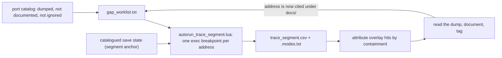

# Playthrough trace-driven coverage

This instrument turns *what the game executes during the opening* into a documentation worklist. A scripted segment of the start of the game is played under the PCSX-Redux emulator with a breakpoint on every function that has a disassembly dump but no explanation in `docs/`. The functions that fire are, by construction, reachable - and they are what to document next.

It complements static analysis. The dump corpus holds functions that are dead, functions loaded only by content nobody has exercised, and hot paths nobody has written up; a trace separates the live ones from the rest. Early segments (boot, first field frame, dialogue) mostly hit code that is already documented. The unexplained hits concentrate in battle internals, story scripting and NPC interaction, so success is measured as gap burndown per segment, not as raw coverage.



The probe harness this drives is described in [`pcsx-redux-automation.md`](pcsx-redux-automation.md); the gap-set is defined off the [port catalog](port-catalog.md). The live gap-set size is derived from the tree (`scripts/ci/port-catalog.py --dashboard`, or the count the worklist generator prints), so it is not recorded here.

## Contents

- [The gap-set](#the-gap-set)
- [The harness](#the-harness)
- [Attribution: SCUS vs overlay](#attribution-scus-vs-overlay)
- [The capture + triage loop](#the-capture--triage-loop)
- [Segment ledger](#segment-ledger)
- [Guarding an oracle that reads the library](#guarding-an-oracle-that-reads-the-library)
- [What the traces resolve](#what-the-traces-resolve)

## The gap-set

The set of function entries the tracer arms breakpoints on:

```
GAP-SET = dumped AND NOT documented AND NOT ignored
```

- **dumped** - a `ghidra/scripts/funcs/<addr>.txt` exists, so the address is a function entry that can be broken on.
- **NOT documented** - no file under `docs/` cites the address. Documented code is excluded so breakpoints (and the interpreter budget) go only to the unexplained residue.
- **NOT ignored** - not in [`port-catalog-ignore.toml`](../../scripts/ci/port-catalog-ignore.toml). The ignore list is host-replaced PsyQ / BIOS / libgte / libspu code; it is out of scope for the port and hot every frame, so it would flood the trace.

Regenerate the committed worklist after any new dump or doc lands:

```bash
scripts/pcsx-redux/build_gap_worklist.py            # -> gap_worklist.txt
scripts/pcsx-redux/build_gap_worklist.py --bucket scus   # SCUS-only subset
```

The worklist is `scripts/pcsx-redux/gap_worklist.txt`: one address per line with its dump-source stem and bucket. It shrinks as documentation lands.

> **The documented-classifier trap.** "Documented" means *the address hex is cited from any file under `docs/`*. Naming a still-open target in prose silently drops it from the gap-set. Refer to a *pending* target by cluster or mode, leave the bare address in the capture CSV and `gap_worklist.txt`, and cite the hex only once the function is characterized.

## The harness

[`autorun_trace_segment.lua`](../../scripts/pcsx-redux/autorun_trace_segment.lua) arms one non-pausing exec breakpoint per gap-set address, plays a segment, and writes `trace_segment.csv` (`addr, hits, first_frame, first_mode, first_ra, stem`) plus a `.modes.txt` game-mode timeline. It is **passive** - it records whatever runs - so an input timeline is optional.

| Env | Meaning |
|---|---|
| `LEGAIA_NO_SSTATE=1` | Cold boot from BIOS (segment S1); the save loader is no-op'd. |
| `LEGAIA_WORKLIST` | Gap-set file (default `gap_worklist.txt`). |
| `LEGAIA_ADDR_LO` / `LEGAIA_ADDR_HI` | Address window, e.g. SCUS-only with `HI=0x801C0000`. |
| `LEGAIA_MAX_BPS` | Cap breakpoints (0 = all) for a smoke run. |
| `LEGAIA_INPUTS` | Optional `<frame>:+BTN,<frame>:-BTN,...` timeline (vsync-since-capture). |
| `LEGAIA_MASH` | Optional `<BTN>:<period>` auto-advance pulse (headless title / dialogue / cutscene driver). |
| `LEGAIA_FRAMES` | Capture budget in vsyncs. |

### Running it headless

A save-state-anchored trace loads a catalogued checkpoint. The save jumps past the slow BIOS boot and fires `GPU::Vsync` immediately, so the probe arms at once with `boot_delay=2`:

```bash
LEGAIA_BOOT_DELAY=2 \
LEGAIA_LUA=scripts/pcsx-redux/autorun_trace_segment.lua \
LEGAIA_OUT=captures/trace/seg.csv LEGAIA_FRAMES=600 \
    xvfb-run -a timeout --kill-after=15s 220s \
    bash scripts/pcsx-redux/run_probe.sh --scenario <checkpoint_label>
```

For a scripted-input segment, add `LEGAIA_INPUTS` / `LEGAIA_MASH`; in-game vsyncs are dense, so the timeline times reliably. [`trace_scenario.sh`](../../scripts/pcsx-redux/trace_scenario.sh) runs one windowed pass per address window against a scenario label, mashes a button to advance dialogue, and unions the per-window CSVs into `captures/trace/<label>/union.csv`.

> **Anchor on catalogued, fingerprinted saves - never a live quicksave slot.** A PCSX-Redux quicksave slot (`~/Tools/pcsx-redux/SCUS94254.sstateN`) is overwritten the next time someone saves in it, so work against one is not reproducible. Every trace loads a save from the immutable library (`saves/library/pcsx-redux/<sha>`) by its `backup_fingerprint`, via `run_probe.sh --scenario <label>`. The library is built by the [boot-onward driver](#driving-from-boot-segment-s1), whose checkpoints are backed up and catalogued with `manage-states.py backup`.

Environment traps (properties of the emulator and display, not of the harness):

| Trap | What to do |
|---|---|
| On a real `DISPLAY`, PCSX-Redux v-syncs to the monitor, and an unfocused or occluded window is throttled to a crawl. | Use `xvfb-run -a`. Bare `Xvfb` can crash PCSX's GLX init during boot; `xvfb-run` sets up the Xauthority it needs. |
| The driver waits `boot_delay` `GPU::Vsync` events before loading the save. Those are sparse during BIOS boot, and the boot occasionally hangs on a CD read first. | Load early: `boot_delay=2`. |
| A run that never logs `gap-set exec probes armed` lost the boot race. | Relaunch. A retry loop (relaunch until the CSV has rows) makes capture reliable. |
| Arming the whole gap-set at once stalls the emulator before capture; about 150 breakpoints arm fine. | Capture the gap-set as a **union of windowed passes** (`LEGAIA_ADDR_HI=0x801C0000` for SCUS, then overlay windows via `LEGAIA_ADDR_LO/HI`). `trace_scenario.sh` tiles the windows. |
| This PCSX build can abort a few hundred vsyncs into some resumed saves. | The probe writes the CSV incrementally (about every 60 vsyncs) and keeps a `.hits.txt` snapshot, so a late abort still leaves the hits on disk. |
| A cold boot can sit in `waiting for boot`: `probe.run` waits on vsync events, which are sparse in the pre-render CD-boot phase. | Use a bespoke per-frame driver (next section). To trace boot/title code itself, arm on a memory watchpoint at a boot-transition register (`_DAT_801EF16C`, the title countdown) rather than a vsync count. |

### Driving from boot (segment S1)

[`autorun_play_from_boot.lua`](../../scripts/pcsx-redux/autorun_play_from_boot.lua) is the boot-onward driver that builds the checkpoint corpus. It polls `game_mode` every frame, mashes START+CROSS to skip logos, the "PRESS START" gate and the intro FMV, confirms NEW GAME (row 0), advances the opening dialogue, logs the `game_mode` timeline, and writes a checkpoint at a target mode. It also **resumes** from a save (`LEGAIA_SSTATE`) to drive the next segment forward, which is how the corpus grows.

**Launch** with `-interpreter -debugger -fastboot`. `-fastboot` is required: the default boot path stalls on an early CD read (`loc 30 52 28`) in headless `-run`, under both the interpreter and `--fast`.

**The driver ticks on exec breakpoints, not on `GPU::Vsync`.** From the title onward the title's XA-BGM streaming stops `VSync(0)` delivery to the autorun, and it does not resume through the field load. The game keeps running the whole time (un-driven it advances to the attract FMV, mode `0x1A`); only the listener goes blind. Two per-frame breakpoints replace it:

| Breakpoint | Fires | Drives |
|---|---|---|
| `FUN_801DD35C` (the per-frame title tick) | On the title, and through field init; stops once field run begins. | The START+CROSS mash (PRESS-START gate + NEW GAME confirm). |
| `FUN_8001698C` (the default mode handler's vsync-sync, `FUN_80025EEC`) | Every frame at field run, and in 12-13 of 14 modes. | The in-game advance (CROSS only), target detection and the checkpoint. |

- Pressing START+CROSS *together* navigates the title; single-button variants stall at the menu mode `0x17`.
- **Checkpoint at field run, not field init.** S1 is captured in scene `opdeene` after the scene load and a 20-tick settle. A checkpoint taken during field init is fragile on resume.
- **Segments chain by resume.** From S1, the field tick CROSS-mashes through the opening prologue scenes (`opdeene` -> `opstati` -> `opurud` -> `map01` -> `town01`, about 3500 frames), and `LEGAIA_CKPT_SCENE=town01` checkpoints at Rim Elm.

**Checkpoint mechanism.** `PCSX.createSaveState()` returns a `{_type="Slice", _wrapper=cdata}` wrapper. This PCSX-Redux build does not export the ffi slice accessors (`getSliceSize` / `getSliceData`), so the slice is written through the Support.File API: `Support.File.open(path,"CREATE"):writeMoveSlice(slice)`, which emits the raw uncompressed protobuf (about 19 MB). The host gzips it to the GUI `.sstate` format (`gzip -c x.rawsstate > x.sstate`, about 1.8 MB) and catalogues it (`manage-states.py backup pcsx-redux x.sstate --label sN_...`). The gzipped checkpoint reloads to the exact captured mode.

`gdb_probe.py` gives a host-side read of `game_mode` from outside the Lua VM, which is how "the game is running, the listener is blind" is told apart from a real hang. Its packet parser can mis-frame the `+` ack into the payload and raise a spurious checksum error; the read value is still in the error text.

## Attribution: SCUS vs overlay

A breakpoint is armed by virtual address (VA). SCUS addresses (`0x800xxxxx`) are always resident, so a SCUS hit means *that* function ran. Overlay addresses (`0x801c0000`+) are **VA-aliased**: different overlays occupy the same address window, so a hit there only means "the currently resident overlay executed that address".

**Attribute by containment, not by stem.** The hit's `stem` column is whichever overlay the dump of that VA happened to come from - usually *not* the overlay resident during the segment. The correct identity is the function of the **resident** overlay whose `[entry, entry+size)` range *contains* the hit address. The trace records what is needed to pick the resident overlay: `first_mode` (the game mode at first hit) and the `.modes.txt` timeline.

[`attribute_overlay_hits.py`](../../scripts/pcsx-redux/attribute_overlay_hits.py) automates this. Given a `union.csv` and a glob of the resident overlay's dumps (default: the battle overlay `0898`, `overlay_battle_action_*.txt`, correct for `game_mode 0x15`), it resolves each overlay hit to its enclosing resident function, aggregates to distinct functions with total hits, and flags each as already documented or `** NEW **`. Hits with no containing range lie above the dumped function set - a re-dump target, or a co-resident overlay.

Rules the segments below established:

| Rule | Example |
|---|---|
| Mode `0x03` + an `overlay_0897` stem is a clean match: the field overlay is PROT 0897. | `0x801D7B40` is field code - it branches on `_DAT_8007b450`, the tile-board-grid flag. |
| Mode `0x03` + any other stem is an alias mismatch. The hit is real; the dump is the wrong overlay's. Do not document from it. | `0x801F7000` carrying a `magic_level_up` stem. |
| Several hot addresses inside one range are interior PCs of one function, not several functions. | `0x801D7A5C` / `0x801D7B40` are interior to `FUN_801D79E8`. |
| An interior label is not a function. | `0x800212C4` is `sh v0,0x14(t1)` mid-`FUN_80021248`. |
| A co-resident overlay slot is identified by comparing live RAM against the static image, and **its occupant varies by context**. | Base `0x801F69D8` holds PROT 0967 in the tutorial fight and PROT 0900 in a normal one. |
| Matching bytes in live RAM prove the bytes are resident, never that they *executed* there. The same VA can be a data table in one overlay and code in another. | The `0x801CFxxx` cluster: a table in `0898`, code in the 0897 battle-intro image. |
| A function shared across entry modes of the *same* overlay correctly reads as documented. | The battle overlay's sprite animator `FUN_801D9BBC`, reused by the Muscle Dome minigame that runs on `0898`. |

## The capture + triage loop

The emulator runs headless and the artifacts are mined from disk. The one input that cannot be synthesized is a save state at a new location; capturing those interactively (a title screen, a post-name field spawn) is where a human operator helps. Each segment is one turn of the loop:

1. **Author** the segment: pick the start save, the gap-set window, and any `LEGAIA_INPUTS` / `LEGAIA_MASH` timeline.
2. **Run** the probe headless (retry past the boot race); produce `trace_segment.csv` + `.modes.txt`.
3. **Triage** the CSV in hit-count order: read the dump (`ghidra/scripts/funcs/<addr>.txt`; extend a dumper's `TARGETS` if it is missing), understand the function, and document it in the right subsystem or format page plus a [`functions.md`](../reference/functions.md) row - and a `// PORT` / `// REF` tag if a crate consumes it.
4. **Catalogue** the end state as the next segment's start: back it up, add a `scenarios.toml` row, and cite the `backup_fingerprint` in the ledger below.

## Segment ledger

The segments chain: each anchors on a start save state and produces an end state that becomes the next segment's start. Every anchor is catalogued in `scripts/scenarios.toml` + `saves/library` by `backup_fingerprint` and resolved with `run_probe.sh --scenario <label>`. Save states are gitignored Sony RAM - cite the fingerprint, never raw bytes.

| Seg | Span | Anchor label | What it settled |
|---|---|---|---|
| S1 | cold boot -> title -> NEW GAME -> opening prologue (`opdeene`) | `s1_newgame_field` (from cold boot, `-fastboot`) | [Driving from boot](#driving-from-boot-segment-s1) |
| S2 | opening prologue -> Rim Elm (`town01`) | `s2_rimelm_town01` (from the S1 checkpoint) | The town scene-load callees |
| S3 | first free walk (Rim Elm) | `s3_rimelm_freeroam` (from the S2 checkpoint) | [The town01 opening is the name-entry screen](#s3-captured-the-town01-opening-is-the-name-entry-screen) |
| S4 | first door warp (Vahn's house) - **intra-scene**, not a scene change | `s4_rimelm_door_transition` (from the S3 checkpoint) | [Grid-BFS door-nav out of Vahn's house](#s4-captured-the-grid-bfs-door-nav-walks-out-of-vahns-house) |
| S5 | first battle | `s5_tetsu_battle` (from the S4 end state) | [It is the scripted Tetsu spar, not a random encounter](#s5-the-first-battle-is-the-scripted-tetsu-spar-not-a-random-encounter) - reached by record-then-replay of a human playthrough. [Trace](#s5-battle-trace-the-on-screen-element-family--new-0898-draw-functions) |
| S6 | first non-tutorial boss (Queen Bee ambush, `town01`) | `rim_elm_queen_bee_battle` (field mode `0x3`; the fight auto-starts into the trace) | [Command-menu persistence + the field->battle transition](#s6-first-non-tutorial-battle-command-menu-persistence--the-context-multiplexed-effect-overlay-slot) |

**S1..S5 are retail captures.** Every anchor is shot on a staged, unpatched image, and the manifest labels point at those files. An anchor taken from a patched disc holds that build's SCUS (and overlay hook sites) in RAM, which is why this matters; the drivers and their traps are in [Re-shooting the S1..S5 anchors](pcsx-redux-automation.md#re-shooting-the-s1s5-anchors-on-an-unpatched-image). S2..S4 run on the recompiler (`autorun_chain_fast.lua`, `autorun_s3_fast.lua`); S1 and S5 keep the breakpoint drivers.

How each segment chains from the last:

- **S1 -> S2** chains by input mashing on the field tick ([above](#driving-from-boot-segment-s1)).
- **S2 -> S3** does **not** chain by mashing: the `town01` opening parks on the name-entry screen and needs a targeted driver.
- **S3 -> S4** chains by the grid-BFS door navigator (`autorun_s4_doornav.lua`).
- **S4 -> S5** chains by replaying a recorded human pad timeline.

### S3 captured: the town01 opening is the name-entry screen

The `s2_rimelm_town01` opening parks on the **"Select your name." name-entry screen** for Vahn. Driving it to completion reaches first free-roam in Rim Elm, catalogued as **`s3_rimelm_freeroam`** (resumes to `game_mode 0x03`, scene `town01`, player engaged flag `0x80000` clear).

What the runtime shows, layer by layer:

| Layer | Observation | Probe |
|---|---|---|
| Engaged, no dialogue | The player engaged flag `*0x8007C364 +0x10 & 0x80000` is set and never clears. The field-control dialog byte (`*0x801C6EA4 +0x62`), picker cursor (`+0xc`) and interact flag (`+0x60`) are all `0`. No button or mash advances it. | [`autorun_s3_recon.lua`](../../scripts/pcsx-redux/autorun_s3_recon.lua) |
| The parked instruction | The engaged field-VM context re-enters at one constant `pc=0x02C6` every frame (breakpoint on `FUN_801DE840`). Its byte signature locates it at **`town01` partition-2 record 3, `+0x02C6`, opcode `49 03`** - `STATE_RESUME` (op `0x49`) subtype 3. | [`autorun_s3_pc.lua`](../../scripts/pcsx-redux/autorun_s3_pc.lua) |
| The parked sub-state | The spawned actor sits in sub-state **`0x22`** (`actor+0x50`) with `scene+0x3E` stuck at `1` and `_DAT_8007B450` Armed. `PTR_FUN_801F33B4[0x22] = FUN_801F03F0`, the **name-entry state machine** (substate at `struct+0x54`). | [`autorun_s3_substate.lua`](../../scripts/pcsx-redux/autorun_s3_substate.lua) |

The hand-off mechanism: `STATE_RESUME` is a tristate on `_DAT_8007B450` (`FUN_801DE840` case `0x49`). Idle arms it and spawns the effect actor `FUN_80020DE0(0x8007065C,...)`; **Armed** halts at the same PC every frame; Done (`== 1`) advances. The spawned actor's handler is `FUN_801F159C` (PROT 0897): it runs the inner sub-state dispatch `PTR_FUN_801F33B4[actor+0x50]` and writes `_DAT_8007B450 = 1` **only when `*(_DAT_801C6EA4 +0x3E) == 0`**. Its worker `FUN_801F1278` sets `scene+0x3E = 1` and `actor+0x50` into the dispatch chain.

So op `49 03` suspends the opening script and hands off to name entry. Name entry holds the player engaged with no dialog box until a name is entered and confirmed; it then drives `scene+0x3E -> 0`, the effect actor sets `_DAT_8007B450 = 1`, and the field VM unparks. Mashing CROSS only appends grid glyphs and never selects the accept option.

**Reproduce the disassembly.** `town01`'s MAN is `PROT[4]`, partition counts `[36, 53, 39]`; the hand-off is in partition-2 record 3: `legaia-engine man-scripts --scene town01 --disc <bin> --disasm-partition 2 --disasm-record 3`. The 0897 handler chain (`FUN_801F159C`, `FUN_801F1278`, dispatch table `PTR_FUN_801F33B4`, sub-handler `FUN_801F03F0`) is dumped by `ghidra/scripts/dump_state_resume_overlay.py` against `overlay_0897.bin.0`.

**The pad timeline that captures S3** ([`autorun_s3_capture.lua`](../../scripts/pcsx-redux/autorun_s3_capture.lua)):

- The name grid (read live by [`autorun_s3_namegrid.lua`](../../scripts/pcsx-redux/autorun_s3_namegrid.lua)) is 17 columns by 7 rows. The cursor (`0x8007BB88`) already sits on `End` (index 116, bottom-right) and the name buffer holds the default "Vahn".
- The confirm button is **CROSS**: the interactive handler `0x801F0480` selects when `_DAT_8007B874 & *(0x800846D0)` is nonzero, and the configured select mask `*(0x800846D0) = 0x44` matches CROSS's `0x40` ([`autorun_s3_btnmask.lua`](../../scripts/pcsx-redux/autorun_s3_btnmask.lua)).
- CROSS on `End` moves the inner sub-state `actor+0x54` to the Yes/No confirm (`2` / `4`). Its selection is the toggle `_DAT_8007B458`. In the confirm sub-handler `0x801F097C`, toggle `!= 0` **loops** (`actor+0x50` stays `0x22`), and toggle `== 0` **advances** the outer state to `0x1A`, out of name entry.
- So the driver holds `_DAT_8007B458 = 0` (the accept option, equivalent to navigating to it) and pulses CROSS. The opening plays about 1300 more frames, the engaged flag clears, and the driver checkpoints first free-roam.

The port's mirror of this screen is `legaia_engine_core::name_entry`.

### S4 captured: the grid-BFS door-nav walks out of Vahn's house

`s4_rimelm_door_transition` is captured by **`autorun_s4_doornav.lua`**, a grid-BFS door-navigation controller. From `s3_rimelm_freeroam` the player spawns **inside a walled room** (Vahn's house interior). The controller walks to the front-door tile, where a walk-touch warp jumps the player `(4134,10588) -> (3264,3520)` - tile `(32,82) -> (25,27)`, an intra-`town01` warp out to the village exterior. It settles at mode `0x03` free-roam and checkpoints. It is a faithful playthrough: D-pad and the interact button only, real collision, **no position pokes**.

How it works:

1. Read the per-scene walkability grid at `*(_DAT_1f8003ec)+0x4000` (1 byte per 128-unit tile, `0x80`-byte rows; high nibble = 4 sub-cell wall bits) and the player tile from `player+0x14` / `+0x18`. BFS the reachable walkable tiles from the player tile (159 in the house interior), then collect the **boundary** tiles - a reachable tile touching a wall, where door triggers live - and visit them nearest first.
2. Follow each BFS path with **online-adaptive** pad input: keep a per-pad-button moving average of its observed world `(dX,dZ)` and each frame press the button whose direction best matches the vector to the next path tile. That handles a rotated camera. Pulse CROSS throughout (walk-touch doors + NPC story triggers), and at each boundary tile nudge toward the adjacent wall, where the warp fires.
3. A transition is the scene name leaving `town01` **or** the player position jumping more than 300 units in a single field tick (here: a `7938`-unit jump). Settle, then checkpoint a raw save state.

**Read struct fields at their real width.** `player+0x14` (X) and `player+0x18` (Z) are `s16` 1-unit world coordinates, and each is followed immediately by another 16-bit field: `+0x16` is the facing word. A `u32` read folds the facing into the high half of the coordinate - at the house spawn the clean read is `X=4160` and the `u32` read is `4286582848` (`= facing 0xFF80 << 16 | 4160`), per `autorun_s4_gridrecon.lua`. Two readings follow from that mistake and are both wrong:

- Positions are **not** 16.16 fixed point. The spawn tile is `(32,92)`; a "fraction" is the facing word.
- The camera remap is **not** dynamic within a room. With the 16-bit read the facing word holds constant through a direction hold and the pad maps to world consistently (`RIGHT -> +X`). The controller still estimates pad-to-world online, as insurance against real camera yaw between rooms.

### S5: the first battle is the scripted Tetsu spar, not a random encounter

**Rim Elm (`town01`) has no random encounters at this story point.** Wandering the exterior from the S4 anchor (`autorun_s5_encounter.lua`) keeps `game_mode` at `0x03`. The town's encounters are **story-gated**, not absent: the MAN declares formations, which switch on briefly after a later story-dialogue beat, go peaceful again, and return briefly near the endgame.

The first battle in the opening is the **scripted Tetsu sparring tutorial** (`formation_id` 4), started by **talking to the sparring partner** - the fight the `v0_1_*_tetsu` anchor chain also captures (`v0_1_pre_battle_tetsu` -> `v0_1_tetsu_dialogue_accept` -> `v0_1_battle_start_tetsu` -> ... -> `v0_1_post_battle_tetsu_town`). It is reachable directly from the S4 exterior.

- **Battle detector.** A battle is live when `game_mode` (`0x8007B83C`) is `0x15` **or** the battle-context pointer `0x8007BD24` is non-zero (`0` in the field; `0x800EB654` while a battle is resident).
- **Clock.** The capture runs from the **field-tick exec breakpoint** (`FUN_8001698C`), which keeps firing through this battle. A `GPU::Vsync`-only capture misses it.
- **Where Tetsu is.** `rimelm_npc_press_tetsu` pins the sparring partner at world `(2752,1856)` = tile `(21,14)`. The route from the S4 spot (tile `(25,27)`) passes through a door warp into Tetsu's sub-area.
- **His prompt is a list, not a Yes/No.** A few text boxes, then a **4-item list whose 3rd entry is the training fight**. `*(0x801C6EA4)+0x62` is a typewriter sawtooth, not a picker signal, so a mash-only driver (`autorun_s5_spar.lua`) reaches Tetsu and never starts the spar.
- **Captured by record-then-replay.** `autorun_record_inputs.lua` logs the per-frame button mask `0x8007B850` while a person walks S4 -> Tetsu -> his dialogue -> 3rd option -> start. `autorun_replay_inputs.lua` reproduces it deterministically through `pad.force`. RAM writes to `0x8007B850` don't stick: `FUN_8001822C` rebuilds it from the real pad after the field-tick breakpoint. The replay reaches `game_mode 0x15` with `0x8007BD24 = 0x800EB654` over `town01`; `s5_tetsu_battle` is the checkpoint.

The **record/replay pair** (mask layout pinned by `autorun_btnmap.lua`) is the reusable primitive for any segment that needs a human-played step turned into a reproducible anchor. `0x8007B850` is the byte-swapped PSX controller word (UP=`0x1000`, DOWN=`0x4000`, CROSS=`0x0040`, ...). Encounter and battle timing is RNG-sensitive, so keep such a segment short and standalone.

## Guarding an oracle that reads the library

A test that consumes these anchors has **three** gitignored inputs, not one: `LEGAIA_DISC_BIN`, `extracted/`, and `saves/library`. The repo's rule is that a disc-gated test skips and passes when its data is missing, and that means every input it reads. A guard that covers only the first two turns a missing capture library into a *failure*.

The defect only fires in one provisioning: disc set and `extracted/` populated, `saves/` absent - a machine that has run `legaia-extract` but never captured a save. With no data at all, the `LEGAIA_DISC_BIN` gate stops the test first; with everything present, it runs.

Its shape reads as guarded, because the anchor loop already skips each missing capture individually:

```rust
for a in ANCHORS {
    let Some(path) = library_save(a.fingerprint) else {
        eprintln!("[skip] {}: no library save", a.label);   // looks guarded
        continue;
    };
    ...
    checked += 1;
}
assert!(checked >= 1, "expected at least one anchor present");  // fails at 0
```

Every per-item skip fires, `checked` stays `0`, and the aggregate assertion - there to keep the oracle non-vacuous - fails. The fix is a **directory**-level gate before the loop:

```rust
if library_dir().is_none() {
    eprintln!("[skip] saves/library missing (capture-gated)");
    return;
}
```

Gating on the directory keeps `checked >= 1` meaningful: a library that is present but has lost an anchor still trips it, and only "no library at all" becomes a skip.

**Detect it by removing the root, not by reading the source.** Whether a guard covers an input is a control-flow property, and some tests absorb an absent library *without* a directory probe (a single-save `let ... else { return }`, or a loop that turns an empty result set into its own skip). So hide the root and run:

```bash
# with LEGAIA_DISC_BIN set and extracted/ present
mv saves saves.off
for f in $(grep -rl 'saves/' crates/*/tests/); do
  pkg=$(basename "$(dirname "$(dirname "$f")")")
  cargo test -p "legaia-$pkg" --test integration "$(basename "$f" .rs)::"
done
mv saves.off saves
```

Anything that fails rather than skips has a guard narrower than its inputs.

## What the traces resolve

A documented function leaves the gap-set on the next regenerate, so the burndown shows in the worklist. What follows is what the traces *settled* - the part a reader cannot regenerate.

### Always-resident SCUS code is mostly infrastructure

Most always-resident per-frame SCUS hits are host-replaced library code, not game logic: PsyQ libgte / libcd / libc, libgpu primitive composers, a dev-profiler HUD, no-op stubs, the SPU queue drain, the heap allocator. The game-logic residue concentrates in the **overlay** gap-set (battle / field / menu) and in higher SCUS functions. Several SCUS hits carry an overlay-range caller `ra` (`8003d0bc` called from `0x801D2D28`) - SCUS leaf helpers invoked by overlay code.

| Address | What it is | Where it went |
|---|---|---|
| `FUN_8005a4a0` | GPU upload-queue flusher: drains a 64-entry ring, spinning on the hardware-ready bit ([`functions.md`](../reference/functions.md)). The hit `8005A5FC` is interior to it. | infrastructure |
| `FUN_8002b468` | Best-fit heap allocator (free-list walk + block split) | infrastructure |
| `FUN_8005fde8` / `FUN_8006a7c8` | Function-pointer dispatch wrapper + a GPU/IO table bit-set helper | infrastructure |
| `FUN_8001d088` | 12-bit angle lerp with wraparound (shortest arc on a 4096-unit circle), writing interpolated facing into a per-slot table | game logic |
| `8003D190`, `8005B268`, `8005B4B8`, `8005B4E8`, `8005B648` | libgte: clear-translation, PushMatrix, set-translation, ScaleMatrix, SetLightMatrix | ignore list |
| `8005CA34`, `8005CF80`, `8005FEDC` | libcd: CdSync, CdControl, CD-status accessor | ignore list |
| `8002B688` | libc heap block-size summer | ignore list |
| `80059280`, `80059510`, `80059744`, `8005AA30` | libgpu primitive-word composers: sprite builder, tpage, texwindow, GPU-queue timeout-arm | ignore list |
| `800173BC`, `800178F0`, `8001A89C`, `8001ABC8` | Dev-profiler HUD, its two marks, its digit drawer | ignore list |
| `80019890` | No-op stub | ignore list |
| `80018DB0` | Field footstep / ambient audio cadence tick | [`functions.md`](../reference/functions.md) |
| `80018F94` | Positional-voice slot update | `functions.md` |
| `800267FC` | Timed audio-cue / event trigger | `functions.md` |
| `8001D058` | Guarded per-frame sub-dispatch to `FUN_80026CE4` | `functions.md` |

**The town scene-load callees** (S2, mostly `first_mode 0x02`) are all reached from the per-stage asset loader `FUN_8001E1B4`, the boot mode-init `FUN_8001DCF8` and the field init `FUN_801D6704`. The Legaia scene-init logic - overlay-slot teardown, tile visibility/adjacency rebuild, actor node-pool init/pop, field-camera reset, scene-script-ref binding, an overlay-sprite pair, GTE projection-scale - is the "Scene / stage init" section of `functions.md`. Two retail-stripped no-op tile-sprite emitters, the libc heap InitHeap/free pair and two libgte matrix-register loaders are on the ignore list. The top-of-range overlay window is flaky to arm from the S2 anchor and low-yield in the field (those VAs mostly host non-resident overlays), so S2's overlay union omits it.

### Field hits resolve to the per-actor tick path

Every overlay-range hit in the field segments (`first_mode 0x03`) attributes to the **field overlay 0897**. The two hottest (`0x801D7A5C` / `0x801D7B40`, both called from SCUS `0x8003BC3C`) are interior PCs of `FUN_801D79E8`, invoked by `FUN_8003BC08` - the per-actor tick for the `_DAT_8007C354` list. `FUN_8003BC08` is the unifying driver that runs, per actor, the inline-dialogue state machine (`FUN_80039B7C`), the motion VM (`FUN_8003774C`) and the move-table VM; its dispatch list is in [`functions.md`](../reference/functions.md). That the trace lands on the central per-frame actor loop is positive evidence the harness reaches the main path rather than a side one.

`FUN_801D79E8` is the **per-actor visibility cull**: it tests the actor's tile against the region box `0x1F800384..87` and the camera's visible tile window `0x1F8003E8..EB`, and sets or clears `+0x10` bit 1 ([motion-vm.md](../subsystems/motion-vm.md)). It draws neither a mesh nor dialog glyphs. Two dumps named after the address do not hold it: `funcs/801d79e8.txt` is `FUN_801D6E18`, and `overlay_0897_801d79e8.txt` starts mid-instruction. The real body is `overlay_cutscene_dialogue_801d79e8.txt`, matching the extracted PROT 0897 image at its base `0x801CE818`.

### Mode 24 is the Noa dance overlay

Mode `0x18` (24) hits belong to the **dance overlay PROT 0980** (resident slot-A help text, sub-id `0x06`). The `0x801D2xxx` / `0x801D3xxx` cluster is its dance-floor render group (`FUN_801d2a10` / `801d3f54` / `801d3ec0` / `801d3a2c` plus interior PCs), documented in [`minigame-dance.md`](../subsystems/minigame-dance.md).

### S5 battle trace: the on-screen-element family + new 0898 draw functions

The first battle segment (`trace_scenario.sh s5_tetsu_battle CROSS:30`, all hits at `game_mode 0x15`) is where new functions concentrate.

**SCUS: the always-resident on-screen-element family.** These HUD / 2D-element helpers serve the battle draw path, and the field and menu HUD too. Three groups, in [`functions.md` § Battle on-screen elements](../reference/functions/battle.md#battle-on-screen-elements-hud--2d-spriteeffect-list):

| Group | Functions |
|---|---|
| Party status HUD | `FUN_8002CDD0` (panel) -> `FUN_8002C2E4` (per-member row: HP bar + number, or a status icon chosen by a 9-way priority decode of the character-record status bitfield at `record+0x12E`) -> `FUN_8002C0B0` (gauge bar) / `FUN_8002C488` (icon / glyph) / `FUN_8002BDC4` (image blit). |
| 2D floating-element list (`gp+0x148`) | `FUN_80021248` spawns a node, `FUN_80031AE4` tweens the list per frame off `DAT_1F800393`, `FUN_800355F0` frees it. The rising-damage-number / transient-caption animator. |
| Per-actor overlay markers | `FUN_8004FE5C` (4-slot display ring `DAT_8007B6D8`), `FUN_800508DC` (voice / anim-cue select keyed to the `0x414` character records), `FUN_80050E00` (3-slot scan), `FUN_8005112C` (coloured element marker). |

**Overlay: resolved by containment.** The resident overlay at `game_mode 0x15` is the battle overlay `0898`. Most hits are interior label-calls of already-documented functions: the battle main dispatcher `FUN_801D0748`, the pose driver `FUN_801D5854`, the arts/AP gauge, the damage/power kernels. The functions the trace surfaced are in [`functions.md` § Battle per-frame draw](../reference/functions/battle.md#battle-per-frame-draw-overlay-0898-trace-surfaced):

| Function | Role |
|---|---|
| `FUN_801E2524` + `FUN_801E2650` | The Arts announcement banner (`ctx+0x28B` selector, `ctx+0x28C` slide clock). Not a full-screen flash: [falsified](../reference/re-do-not-re-walk.md#the-flash-ramp-is-the-arts-announcement-banner). |
| `FUN_801DF6B8` | Per-actor draw / position loop - the top consumer of the SCUS element helpers. |
| `FUN_801D829C` | Camera-state per-actor transform builder off `DAT_8007B790/2/4`. |
| `FUN_801D71B8` | Attack-phase actor sub-handler. |
| `FUN_801E805C` | Battle effect / summon-band orchestrator. |
| `FUN_801E0080` | Arena procedural scatter (below). |

**The render tail.** Hits that no dumped `0898` function contained split three ways. `resolve_render_tail.py` (in the Ghidra container) reports, per hit, whether the address is mapped and what `getFunctionContaining` returns.

| Hits | Identity | How it was settled |
|---|---|---|
| `0x801E0080`, `0x801E0598`, `0x801E0418`, `0x801E02A4` | Interior to one 606-instruction function, `FUN_801E0080` (`0x801E0080..09F8`, just below `FUN_801E09F8`), which Ghidra had not made a function. It is a per-frame RNG / frame-counter-driven **arena procedural scatter** over the battle-scene buffer `_DAT_8007BD30`. | `dump_battle_rendertail.py` disassembles, creates and dumps it. |
| `0x801F` band below `0x801F69D8` (`0x801F0740`, `0x801F0ADC`, ...) | `0898`'s own tail. `0x801F0740` / `0x801F0ADC` are one function, `FUN_801F0450` (the per-party-slot **Arts command-window builder**). Other hits fall in documented tail functions: `FUN_801EFE44` (camera bounds `+0x48C`), `FUN_801F17F8` (side-band streaming SM), `FUN_801F0348` (battle action). | A full-length re-import of the `0898` image at base `0x801CE818` (`dump_battle_rendertail_0x801f.py`). |
| `0x801F` band at or above `0x801F69D8` (`0x801F71E0`, `0x801F7624`, `0x801F6C70`, `0x801F6D48`) | A **co-resident overlay**: extraction **PROT 0967**, the battle sparring-tutorial overlay, loaded at base `0x801F69D8`. It is resident because S5 is the tutorial fight. The hot hit is its per-frame message-pacing driver `FUN_801F71E0`. | Live battle RAM differs from the static `0898` image there (`0898` holds menu-label rodata). A byte fingerprint pins the resident image: head at file offset 0, the `0x801F71E0` code at file offset `0x808`. Dumped by `dump_effect_overlay_0967.py`; see [`functions.md` § Battle sparring-tutorial overlay](../reference/functions/battle.md#battle-sparring-tutorial-overlay-prot-0967). |

Why the lower `0x801F` hits were unmapped: the battle overlay loads at base `0x801CE818` and its PROT entry is `0x28800` bytes (`content_bytes` in `crates/asset/data/static-overlays.toml`; `clean_copy_bytes` is a strength-of-evidence figure, not a length - see [`static-overlay-pipeline.md`](static-overlay-pipeline.md#content_bytes-is-not-clean_copy_bytes)). It therefore spans `0x801CE818..0x801F7018`. The windowed Ghidra program `overlay_battle_action.bin` covers `0x801C0000..0x801EFFFF` and stops `0x7018` bytes short of the overlay's end. The hits' `ra` values land in `0898`'s own `0x801E2xxx`, confirming same-overlay calls.

### S6 first non-tutorial battle: command-menu persistence + the context-multiplexed effect-overlay slot

S6 is the first real fight - the Queen Bee ambush in Rim Elm. The `rim_elm_queen_bee_battle` anchor is captured in **field mode (`game_mode == 0x3`)** and the fight auto-starts a few seconds into the trace, so this segment captures the whole **field->battle transition** as well as the fight. Run with `LEGAIA_FRAMES=900 trace_scenario.sh rim_elm_queen_bee_battle CROSS:30`.

**Three `0898` battle functions** - the command-menu layer the scripted spar never exercises - are in [`functions.md` § Battle command-block persistence + target menu](../reference/functions/battle.md#battle-command-block-persistence--target-menu-overlay-0898-trace-surfaced):

- **`FUN_801DA34C` / `FUN_801DA59C`** are the **Arts command-block persistence pair**. Each party actor carries a 16-byte command block at `+0x1DF` (the 16-arm Arts input buffer). `FUN_801DA34C` restores it from the saved character record (`record[char-1]+0x1B7`) at battle start, or zeroes it on a fresh enter (`DAT_8007BD04 == 0`). `FUN_801DA59C` writes it back to the record when the actor reaches phase `+0x1DE == 3`. Both gate on HP at `+0x154` / `+0x156`.
- **`FUN_801D9D3C`** is the **enemy target-selection-menu builder**: it walks the formation-id table `DAT_8007BD0C`, dedups consecutive identical monsters, and copies each enemy's name and stats into the menu context `_DAT_8007BD24`. A single scripted opponent (S5) never needs it.

**The `0x801F69D8` co-resident slot is context-multiplexed.** The hottest S6 hit, `0x801F76F4`, is not contained by any `0898` function. A byte fingerprint of the live RAM there matches `overlay_summon_render_0900.bin` at file offset `0xD1C` - base `0x801F69D8` = extraction **PROT 0900**, the summon / move-FX / screen-FX render overlay. The slot that holds the sparring-tutorial overlay (PROT 0967) in S5 holds the effect-render overlay in a normal fight. PROT 0900 is already resident in field mode (it drives field move-FX stagers too), which is why the per-frame GTE effect-render loop at `0x801F76F4` fires about once per frame across the whole trace. The address is interior GTE (COP2) code of that overlay, which the port covers as `engine-core::summon` / `screen_fx`.

**The `0x801CFxxx` cluster is the field->battle transition overlay, not `0898`.** Those VAs are present in the `0898` image as a **data table** (the region decodes to a `+0x10`-stride table), not code. Fingerprinting the live RAM at the cluster matches `overlay_field_0897.bin` at base `0x801CE818`: the field overlay is resident (the anchor is field mode), and the cluster is code in the partial-0897 **battle-intro** image (`overlay_field_battle_intro.bin`).

- `0x801CF5BC` is the **field->battle transition state machine** (`FUN_801CF5BC`). It sequences the battle-mesh assembly and the battle-BGM / scene load across a phase counter, runs the camera-spin timer against `DAT_801D2458`, and ends by writing the game-mode hand-off `_DAT_8007B83C = 0x14`.
- `0x801CFBB4` is the intro particle-effect builder (`FUN_801CFBB4`).

Both are in [`functions.md` § Field->battle transition overlay](../reference/functions/battle.md#field-battle-transition-overlay-intro-camera-spin).

The SCUS hits of this segment (`0x8001C604` / `0x8001C394`, `0x8001D184`) are general graphics-library GTE helpers, hit during the ambush's 3D transition: the matrix setup `FUN_8001d184` loads rot X/Y/Z via `FUN_8004638c` / `629c` / `461a4` plus GTE push/pop, and `FUN_8001c604` is a DMA-packet builder into `_DAT_8007B85C`.
