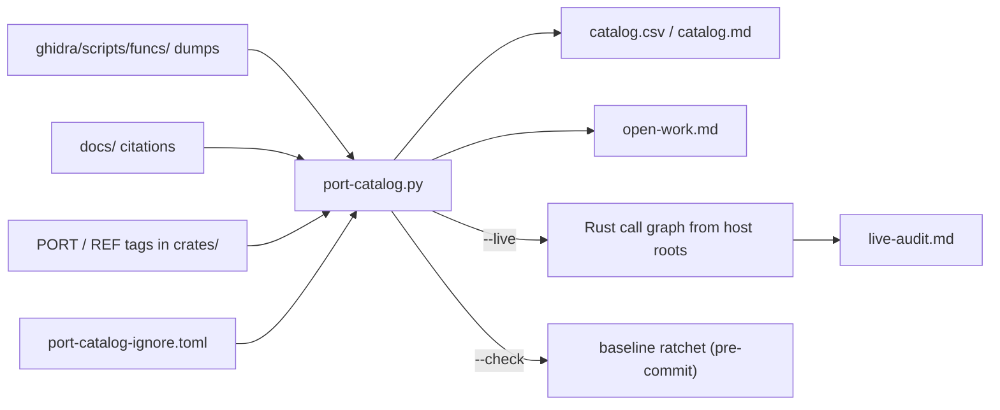

# Port catalog

`scripts/ci/port-catalog.py` answers "what is left to do?" for one function or for the whole project. It **derives** each function's status from the tree on every run - is there a disassembly dump, does a doc cite it, does Rust code claim to port it, can a host reach that Rust code - so it cannot go stale the way a hand-kept status table does. Port a function, tag it, and the next run knows.

Reach for it when you want a real worklist: which functions are understood but not ported, which are ported but undocumented, which ports nothing calls.

```bash
python3 scripts/ci/port-catalog.py --dashboard     # the open work, on one page
```



| Section | What it tells you |
|---|---|
| [The columns](#the-columns) | What each status means and where it is measured. |
| [The tags](#the--port-tag) | `PORT:`, `REF:`, `NOT WIRED:`, `WIRED:`, `REPLACED-BY:` - what to write in Rust source. |
| [Reachability](#reachability-the-live-axis) | The `live` axis: roots, anchors, precision, the audit. |
| [Usage](#usage) | Every invocation and output file. |
| [The ratchet](#the-ratchet) | Which figures the pre-commit gate holds. |
| [Features](#features-bfs-from-roots), [Ignore list](#ignore-list), [Dashboard](#open-work-dashboard) | Scoping the worklist. |
| [The runtime denominator](#the-runtime-denominator-replay-port-coveragepy) | Was a port actually *executed* by a replay. |

## The columns

One row per function address in the code ranges (SCUS `0x80010000-0x8006FFFF`, overlays `0x801C0000-0x8020FFFF` - the same filter [`scripts/ci/function-coverage.py`](../../scripts/ci/function-coverage.py) uses, whose helpers the catalog shares).

| Column | Source of truth |
|---|---|
| **dumped** | A Ghidra dump exists under `ghidra/scripts/funcs/` (gitignored - regenerable from the Ghidra project). |
| **documented** | The address is cited from at least one file under `docs/` (`FUN_<addr>` or `0x<addr>`, case-insensitive). |
| **ported** | A Rust source under `crates/` carries a `// PORT: FUN_<addr>` tag for that address. |
| **live** | The Rust symbol carrying that tag is reachable, through non-test code, from a host entry point. Opt-in (`--live`); see [Reachability](#reachability-the-live-axis). |
| **replaced** | Not live, and no host is owed: the port carries a `REPLACED-BY:` marker naming the Rust mechanism that does the routine's job. In `catalog.csv` and `--live-audit`; excluded from the wiring worklist and its denominator. See [`REPLACED-BY`](#replaced-by). |
| **ignored** | The address is listed in `scripts/ci/port-catalog-ignore.toml` as a non-port-site (BIOS thunk / libc shim / libgte / libgs / libgpu / libcd / libsnd / libspu / libapi / libetc). Excluded from `--missing-ports` by default. |

**`ported` and `live` are different axes.** A `// PORT:` tag is a provenance marker: it records that a Rust function implements a retail function. It says nothing about whether anything calls that Rust function. A port can be faithful, tested and documented - and never execute. The `live` axis is what lets "how much of the game is covered" be answered from the tree.

### What the columns surface

| Combination | Meaning | What to do |
|---|---|---|
| dumped + documented, not ported, not ignored | **Port worklist.** Understood, not implemented, not PsyQ infrastructure. | Port it; sort by citation count for high-leverage helpers. |
| cited but not dumped, not ignored | **Dump worklist.** A dump references the address; no dump of it exists. | Add it to a dumper's `TARGETS` ([`ghidra.md`](ghidra.md#adding-a-new-function-dump)) - unless no routine begins there (below). |
| ported but not documented | Provenance gap. | Backfill the doc, or remove the tag if the attribution is wrong. |
| ported but not dumped | Provenance gap, opposite axis. | Dump it. |

An ignore row retires a dump-worklist row exactly as it retires a port one. A `worklist_*` ignore section holds the claim "no routine begins at this VA", and such an address cannot be dumped without fabricating an entry point ([`dump-corpus-integrity.md`](dump-corpus-integrity.md)). The standing case is PROT 0896: its `jal`s name addresses in a *different* build's executable ([`static-overlay-pipeline.md`](static-overlay-pipeline.md)), every one of them mid-body in this disc's `SCUS_942.54`, so each is an address claim to file rather than a dump to take.

## The `// PORT:` tag

The "ported" column keys off a structured comment in Rust source:

```rust
// PORT: FUN_801dd35c                       // single address
// PORT: FUN_801dd35c, FUN_801cf244         // multiple on one line
// PORT: FUN_801dd35c (sub-mode jump table) // trailing context allowed
//! PORT: FUN_801dd35c                      // inside `//!` module doc
/// PORT: FUN_801dd35c                      // inside `///` outer doc
```

Rules:

- The tag is the only signal trusted for "ported". Plain mentions of `FUN_<addr>` in comments are ignored - they appear in many contexts that don't imply a port.
- The address is lowercase hex in the SCUS / overlay code range.
- The match starts on the marker's own line: put the tag on its own line or as a trailing comment. **A tag that starts mid-sentence gets no anchor** and reads as a phantom inert port.
- A file can carry many tags. One retail function can be ported into more than one crate; the catalog lists every crate that tags it.
- Tag the Rust function that *implements* the behaviour, once. Don't tag its callers.
- Prefer a `///` tag on the function to a `//!` tag on the module. A module tag anchors the address to the whole *file*, so one wired function elsewhere in the file reports the address wired. It is only safe while the whole file shares one wiring status. Likewise, tag the function that computes a value and give a plain data struct a `REF:`. [Anchors](#anchors) shows how each form resolves; [`stale-not-wired-triage.md`](stale-not-wired-triage.md#anchor-granularity) has the edit that splits a module tag safely.

### A wrapped address list

A tag naming several routines can outgrow its line. The reader (`scripts/ci/port_tag_reader.py`, shared by this tool, [`check-port-tags.py`](#tag-drift-checker) and [`check-port-provenance.py`](port-provenance.md)) takes the continuation, so both of these claim three addresses:

```rust
/// PORT: FUN_801d6704, FUN_801cf00c,
///       FUN_801cef54
/// PORT: FUN_801d6704, FUN_801cf00c, FUN_801cef54
```

A following comment line continues the list only when the text so far ends with a separator **and** the line starts with an address token. The rule is deliberately that narrow. Reading every comment line up to the first blank one would pull in `REF:` lines and prose such as "the Baka overlay links the same body at `FUN_801D6710`" as port claims. A port claim the author did not make is worse than a dropped one: the dropped one shows up as a worklist row, the invented one shows up as nothing.

### The `// REF:` tag

Sibling of `// PORT:`. It marks an address as a **cross-reference citation**: the file mentions `FUN_<addr>` but does not claim to port it. Same comment shapes and multi-address syntax.

```rust
//! PORT: FUN_801E30E4
//! REF: FUN_801E7320, FUN_801CF098  -- callees, not ported here
```

The catalog ignores `REF:` tags - they don't set "ported" - but the [drift checker](#tag-drift-checker) treats them as equivalent to `PORT:` for warning suppression.

### A module-scope tag inherits its neighbour's verdict

The scraper binds a tag's addresses to whatever item follows it. A tag written at **module** scope - above the `use` block, or between two items rather than on one - attaches to the next item the file happens to define, and the address then carries that item's reachability verdict instead of its own. Nothing flags this: the tag is well-formed, the address is real, and the row reports a live port. Keep the tag in the doc block of the item it describes. The general check is [`port-provenance.md`](port-provenance.md), which asks whether a tagged address names the routine the Rust item implements; a `grep` for the address will not find this shape.

## Reachability: the `live` axis

`--live` builds a call graph over `crates/**/src/**.rs` and asks, for each `// PORT:` tag, whether the symbol it attaches to can be reached from a declared host entry point.

```bash
python3 scripts/ci/port-catalog.py --live            # add the `live` column
python3 scripts/ci/port-catalog.py --not-live        # ported but unreachable
python3 scripts/ci/port-catalog.py --live-only       # ported and reachable
python3 scripts/ci/port-catalog.py --live-audit      # the audit page (below)
```

The pass parses every Rust file in the workspace, so it is markedly slower than the other modes and stays opt-in.

**How to read it:** `live` is an *upper bound* on what runs; `--not-live` is a *hard floor* on what does not. Every ambiguity in the graph resolves toward reachability, so an address `--not-live` reports is one no plausible edge - not even a wrong one - could reach.

### Roots

The search starts from these and nothing else. A `pub fn` that no host reaches is exactly the inert-port case the axis exists to find, so being public is not a root.

| Root family | What it covers |
|---|---|
| `fn main` in a `[[bin]]` target (`src/bin/**`, `src/main.rs`) | Every CLI subcommand of the tool binaries, plus each GUI binary's command dispatch and window-loop *setup*. |
| `#[wasm_bindgen]` exports in the WASM crates | The browser's entry points into the site's viewer, play and patcher pages. |
| Methods of an `impl ApplicationHandler for T` block | The whole per-frame native GUI surface - redraw, input, HUD build - and everything in the engine crates those reach. |

The third family exists because the call chain leaves the tree: `fn main` hands the app to winit's `event_loop.run_app`, and winit calls `window_event` / `about_to_wait` / `resumed` back in from outside. Without those methods as roots the search stops at `run_app` and every per-frame path reads as inert. The trait set is the literal `EXTERNAL_DISPATCH_TRAITS`; **add to it when another externally-dispatched callback trait appears**, or the audit cannot be believed about the code under it.

An `impl ApplicationHandler` block counts even if nothing constructs the app - deliberately over-permissive, the same direction every other ambiguity resolves in.

Test code is excluded: `crates/*/tests/`, `benches/`, `examples/`, `#[cfg(test)]` modules, `#[test]` functions, and files named `tests.rs`. "Called only by a unit test" is precisely what a `NOT WIRED:` tag reports.

### Anchors

A tag is resolved to the symbol it sits on, most precise form first:

| Tag form | Anchor | Live when |
|---|---|---|
| `///` / `//` above a `fn` | that function | the function is reachable |
| `///` / `//` above a `struct` / `enum` / `impl` | that type | any method in the type's `impl` blocks is reachable, or - when the file gives that type no `impl` block at all - any non-test `fn` in the file is |
| `///` / `//` above a `const` / `static` / `type` alias / `macro_rules!` | that item | a reachable non-test `fn` body references the item's name |
| `//` inside a function body | the enclosing function | that function is reachable |
| `//! PORT:` (module doc) | the file, widened to its submodule subtree when the file declares no functions of its own | any non-test function in scope is reachable |

A `///` doc block resolves to the item it documents: the first item after the block, however long the block is. Module scope belongs to `//!` blocks (and to a loose `//` tag that sits on no item); it is not a fall-through for doc blocks.

- **Module anchors are the coarse case** and the main source of over-reporting: a `//!` block on a crate root claims the whole crate, so one wired function reports every address on that block as live.
- **The type anchor's file fallback** covers a tag on a plain data struct whose behaviour lives in free functions or in another type's `impl` in the same file.
- **The item anchor's verdict is *use***, since a `const` has no body to reach. The permissive graph matches the bare name tree-wide (two same-named consts share a verdict), which keeps the not-live list a floor. The strict graph, read only by the stale-`NOT WIRED:` test, demands an attributable reference: the referencing `fn` sits in the item's own file, or spells the item qualified by its defining module's stem or `impl` type (`module::NAME`, `Type::NAME`). An unqualified use behind a `use` import is under-counted there, which errs toward "not live" - a missed stale tag, never a false accusation.

The attributable-reference rule (`item_reference_patterns` / `item_reference_hit`, defined once in the script) is shared with the [reach report](#the-runtime-denominator-replay-port-coveragepy), so "is it live" and "did a ladder run it" cannot disagree about what counts as a reference to a const.

`port-catalog.py --selftest` runs the anchor-kind and disclosure-precedence cases on a synthetic in-memory corpus and exits non-zero if the resolver stops distinguishing them.

#### Per-item `WIRED:` against a module blanket

Disclosure is resolved per anchor, in this order:

1. The tag's own comment block says `NOT WIRED` - that item is disclosed.
2. Otherwise a `//! NOT WIRED` opening the module doc discloses every anchor in the file (one blanket, many tagged addresses).
3. An anchor whose own doc block opens a line with `WIRED:` (caps, colon, same leading-`#`/`*` allowance as the blanket marker) opts that one item out of the module blanket - the shape for a mostly-inert module with one wired item.

An own-block `NOT WIRED` wins over an own-block `WIRED:`: same-granularity disclosure beats same-granularity claim.

**Read a `NOT WIRED:` note to its end before acting on it.** The lead sentence often states the symptom; the rest says what wiring would take.

#### `REPLACED-BY`

`live` and inert-with-`NOT WIRED:` are not the whole space. A third kind of port exists: one whose *job* the engine performs by construction through a different mechanism, so no host will ever call it and none is owed. Counting those as "implemented but not yet hosted" states a gap that will never close.

`REPLACED-BY: <mechanism>` opening a comment line in a tag's own block moves that anchor into the `replaced` column: neither live nor a wiring gap, listed by `--live-audit` in its own section, and excluded from the wiring denominator. A `//! REPLACED-BY:` opening the module doc is the blanket form, resolved like the `NOT WIRED` blanket. Precedence at one granularity is `REPLACED-BY:` > `NOT WIRED` > `WIRED:`.

Two strictnesses keep the class from becoming an escape hatch:

- the marker must **open** the comment line, so prose that mentions one thing being replaced by another is not a class change;
- the mechanism text must be **non-empty**, and `--live-audit` prints it beside the row. A bare `REPLACED-BY:` does not count, and the anchor stays in whatever class it was in.

##### What may carry it

The test is not "no caller exists" - that is what `NOT WIRED:` says. It is that the *behaviour* is either already produced by a named live Rust mechanism, or unobservable in the port's output because the port has no such layer. Wiring such a port would re-host retail plumbing without adding anything a player or a test could see. Four shapes qualify:

| Shape | Retail | The port instead |
|---|---|---|
| Device / BIOS layer the port does not model | libcd sector DMA, MDEC channel status, the PSX kernel `bu` memory-card device | reads the disc image synchronously, decodes MDEC in software, patches card blocks in place |
| Retail memory management the Rust types do by construction | fixed-arena node pools, free-stack allocators, `0x20`-block copiers | `Vec`, slices, ownership, borrow-in-place walks |
| Retail residency / representation the port replaced | mode-table overlay cache pairs, GPU packet queues, the `gp+0x148` drawable node list | on-demand PROT resolution, typed draw lists, per-screen window models |
| Routine retail itself never reaches | a real prologue entry point with **zero** references in all five forms across SCUS, every based overlay image and every raw PROT entry | nothing - retail runs no pass that asks the question either |

The fourth shape is the one exception to "not `no caller exists`", and it is narrow. It may only be claimed on the evidence of a [five-form reference scan](address-reference-scan.md) reported in the tag, and the mechanism text must say so. "I grepped for `jal`" is not that scan - it is blind to a table-driven caller. A branch retail ships behind a debug flag that is never set (`fishing::DEV_ENTRY_POINT_BONUS`) is the same shape reached from the other side.

##### What may *not*

Anything whose retail behaviour is still missing from the port stays `NOT WIRED:`, even when another engine mechanism covers most of it:

- **A second implementation of an observable behaviour is a gap.** A retail integer camera-ease kernel (`FUN_801DA390`) is not "replaced" by the engine's float ease against a typed zone record: the per-frame value is observable output and the two disagree frame by frame, so a retail-faithful mode wants the kernel.
- **A different order or gate is a gap.** The item-list builders of `FUN_80030628` are not "replaced" by a list that shows the same items in another order without retail's dim gates - what a player sees differs.
- **Verdicts are per item, not per file.** A file can hold replaced routines beside gap routines, and each says which it is.

Rule of thumb: read what the disclosure says wiring would *take*. "Adopting X as the representation, not adding a call" is a replacement. "Implementing hook H" or "porting routine R first" is a gap.

### Precision

The graph resolves calls by **name**, not by type. Qualified calls (`Type::f`, `module::f`) resolve against in-tree types and module stems; method calls (`.f(...)`) resolve against every in-tree method of that name; bare `f(...)` resolves against every function of that name. There is no type inference, no trait-impl selection and no monomorphisation. A **trait default method** counts as a method of its trait (and stays among the free functions too), since a host that does not override the default runs exactly that body.

- **False positives on `live` are expected.** Method-name collisions (`.tick()`, `.step()`, `.push()`) link callers to every same-named method in the workspace. Trait-object and closure dispatch resolve the same loose way.
- **False negatives on `live` are rare**, because every ambiguity resolves toward reachability. The one deliberate exception is an unresolved qualifier: `Vec::new` falls back to free functions only, never to methods, because letting external types reach every in-tree `Type::new` would wire up whole modules that nothing constructs.
- **A dispatch edge that leaves the tree and comes back is invisible until something names it.** Trait default methods and winit callbacks are both modelled; [`live-audit-triage.md`](live-audit-triage.md#analysis-defects-this-triage-found) keeps their positive controls.

Two things the axis structurally cannot see, both of which make a *live* verdict weaker than it looks:

- **Runtime gates.** A function called every frame behind a flag that is never set is statically reachable and behaviourally dead.
- **Partial ports.** Reachability is a property of the entry symbol, not of its body. A reachable function that implements two of its source's five branches still reports live.

### The audit

`--live-audit` writes `target/port-catalog/live-audit.md`, comparing the reachability verdict against the class markers written in the source. Four sections, in the order they want acting on:

| Section | Meaning |
|---|---|
| Tagged `NOT WIRED` / `REPLACED-BY` but analysed live | The tag and the analysis disagree. Needs a human - see the five causes below. |
| Undisclosed inert ports | Unreachable, no tag. Either a wiring gap or a missing disclosure - the reason this mode exists. |
| Disclosed inert ports | Unreachable, `NOT WIRED:` present. The declared wiring worklist, working as intended. |
| Infra-replaced ports | Unreachable, `REPLACED-BY:` present. Not a worklist - each row prints the mechanism it names, so the exemption can be argued with. |

The summary block splits the same way: under `ported, NOT live (inert)` sit `of which infra-replaced` and `wiring worklist (inert, a host is owed)`. The second is the number to steer by; `scripts/ci/update-progress-metrics.py` feeds it, not the raw inert count, into the site's wiring track.

A row in the first section has one of five causes, and only the first is a stale tag:

| # | Cause | Fix |
|---|---|---|
| 1 | The port got wired and nobody removed the tag. | Remove the tag. |
| 2 | A method-name collision: a `.tick()` call somewhere resolves to the inert type's `tick`, because receiver types are not inferred. | Rename the colliding symbol. |
| 3 | A runtime gate: the function *is* called every frame, behind a flag production never sets. | None - the tag claims more than the axis measures. |
| 4 | Anchor granularity: a `//! PORT:` block claims the file while the `NOT WIRED:` note disclaims one function. | Move the tag onto the item it claims. |
| 5 | The block *quotes* the marker instead of carrying one - a wiring note that recounts the disclosure it replaced discloses the item again. | Rewrite the prose; **never quote the marker text**. |

Read the section as a queue of questions, not a defect list. [`stale-not-wired-triage.md`](stale-not-wired-triage.md#the-fix-each-mechanism-takes) tabulates the fix each mechanism takes.

Cause 5 is a diagnostic, not a classification. When **every** `NOT WIRED` in an anchor's block sits inside backticks or quotes, the section's note says how many rows are that shape. The per-item search itself stays unanchored, because real per-item disclosures are spelled loosely (`//! ## NOT WIRED`, `// NOT WIRED, AND UNWIREABLE`, `/// NOT WIRED. "No caller" would be the wrong reason`), and anchoring it the way the module-blanket regex is anchored would silently un-disclose real inert ports. Backtick spans stop at the newline in that diagnostic; only quoted spans wrap.

Comparison is per **anchor**, not per address. A formula ported into two crates has two anchors and can legitimately be wired in one and not the other.

### Where the reachability pass over-reports

Resolving by name costs precision in the audit's first section, in three shapes:

- an ambiguous `.name(` or `name(` linking to every in-tree definition of that name, so any port whose entry point is called `new`, `tick`, `add`, `len` or `default` reads live regardless of wiring;
- the bare-identifier edge, which links a function *value* to a free function of that name and cannot tell it from a struct **field** of the same name;
- a `//! PORT:` module anchor, whose scope is the whole file.

**The first two are corrected in a second graph.** The live pass builds `build_rust_graph(strict=True)` alongside the permissive one and reads *only* the stale-`NOT WIRED` test off it; `live`, `--not-live` and `--live-only` come from the permissive graph. Sharpening the shared graph instead would trade the hard floor away for a fix to the opposite error - which is why there are two graphs, and why the shared one should be left alone. The receiver gate fires only on *ambiguous* names; it cannot see a name `std` also defines, a free function, or a crate-root re-export.

The second graph is built whenever the pass runs, not only under `--live-audit`, because the summary line `tagged NOT WIRED / REPLACED-BY but live` is the receiver-gated answer in every mode. The principle: **a number that moves with an output flag is not a measurement.** A report switch may choose what is shown, never what is computed.

The third shape - anchor granularity - is inherent: a module anchor cannot distinguish the tagged routine from a live `Default` impl in the same file. It is closed in source, by moving the tag onto the item.

**A `#[cfg(test)]` helper is still a caller node.** Test functions are excluded from a module anchor's *scope* but not from the graph's *callers*, so a test helper with a common name (`step`, `tables`, `new`) collects every same-named edge and marks its own module live. Give test helpers distinctive names; a stale-tag row whose only path runs through a test helper is this, not a wiring gap.

## Tag drift checker

`scripts/ci/check-port-tags.py` walks `crates/engine-*/src/**.rs` and warns when a `FUN_<addr>` citation lacks a matching `// PORT:` or `// REF:` tag *in the same file*. It catches "I ported X but forgot the tag".

```bash
python3 scripts/ci/check-port-tags.py                  # default = --staged
python3 scripts/ci/check-port-tags.py --scan-all       # full audit
python3 scripts/ci/check-port-tags.py --strict         # exit 1 on warning
python3 scripts/ci/check-port-tags.py --addr 80019b28  # drill-down
python3 scripts/ci/check-port-tags.py --backfill-refs  # insert missing REF blocks
```

- **Modes.** `--staged` checks only lines being added in the staging area; `--scan-all` audits every line of every engine-crate file; `--strict` turns warnings into a nonzero exit.
- **Scope rule.** Only files that already carry a `// PORT:` tag are checked. Files with no port tag are reference-only and skipped.
- **Backfill.** `--backfill-refs` rewrites in place: for each port-bearing file with untagged citations it inserts a `//! REF: ...` block after the last `//!` line of the leading module doc (or at the top of the file).
- **Pre-commit.** `scripts/git-hooks/pre-commit` runs `check-port-tags.py --staged --quiet` after `cargo clippy`. It is **warn-only** there - drift prints but never blocks the commit.

## Usage

```bash
python3 scripts/ci/port-catalog.py                       # global catalog -> target/port-catalog/
python3 scripts/ci/port-catalog.py --missing-ports       # dumped + documented, not ported (excludes ignore-list)
python3 scripts/ci/port-catalog.py --missing-ports --include-ignored   # include ignore-list entries
python3 scripts/ci/port-catalog.py --missing-dumps       # cited but not dumped
python3 scripts/ci/port-catalog.py --ported-only         # show only ported addresses
python3 scripts/ci/port-catalog.py --ignored-only        # show only ignore-list entries
python3 scripts/ci/port-catalog.py --addr 801dd35c       # drill-down on one address
python3 scripts/ci/port-catalog.py --md                  # markdown to stdout
python3 scripts/ci/port-catalog.py --list-features       # list features in features.toml
python3 scripts/ci/port-catalog.py --feature title-screen   # BFS from a feature's roots
python3 scripts/ci/port-catalog.py --dashboard           # open-work rollup -> open-work.md
python3 scripts/ci/port-catalog.py --live                # add the reachability column
python3 scripts/ci/port-catalog.py --not-live            # ported but unreachable from any host root
python3 scripts/ci/port-catalog.py --live-audit          # reachability vs the source's class markers
python3 scripts/ci/port-catalog.py --check --live        # ratchet every baselined figure
python3 scripts/ci/port-catalog.py --check --allow-uncompared   # fast pass, skips the disclosure gap
python3 scripts/ci/port-catalog.py --live --update-baseline
python3 scripts/ci/port-catalog.py --funcs /path/to/checkout/ghidra/scripts/funcs
```

**`--check` alone is not an invocation.** It leaves `live/disclosure_gap` uncompared and exits 1 saying so. The two supported forms are `--check --live` (when the commit could move the gap) and `--check --allow-uncompared` (otherwise).

**`--funcs` points the `dumped` column at another checkout's dump corpus.** The corpus is gitignored, so in any checkout but the one that dumped it - a git worktree, for instance - the catalog reports every row undumped and a `--check` there is meaningless. Reading the corpus by path is the supported fix; copying it in would stage Sony bytes.

Output goes to `target/port-catalog/` (gitignored):

| File | Contents |
|---|---|
| `catalog.csv` / `catalog.md` | Every tracked address. |
| `<feature>.csv` / `<feature>.md` | Per-feature subset, with `--feature`. |
| `open-work.md` | The [dashboard](#open-work-dashboard). |
| `live-audit.md` | The [audit](#the-audit), with `--live-audit`. |

## The ratchet

The catalog's figures reach the site's landing page through `scripts/ci/progress-metrics.json`, so they are gated. `--check` compares against `scripts/ci/port-catalog-baseline.json` and is a hard pre-commit gate. The same step runs in CI but reports `SKIPPED` there, because the `dumped` column reads the gitignored Ghidra corpus. **The pre-commit hook is therefore the only place these figures are compared.**

| Figure | Direction |
|---|---|
| `worklist/port` - dumped + documented, not ported, not ignored | may not grow |
| `worklist/dump` - cited but not dumped | may not grow |
| `worklist/ported_not_documented` | may not grow |
| `worklist/ported_not_dumped` | may not grow |
| `live/disclosure_gap` - inert anchors carrying no `NOT WIRED:` tag | may not grow |
| `totals/ported` | may not shrink |

Nothing read off the receiver-gated graph is baselined: its numbers move with graph resolution rather than with the work. Everything ratcheted is a property of the tags, the docs and the dump corpus. `live/disclosure_gap` is the one entry taken from the permissive graph, and it is sound in that direction because that graph *over*-reports reachability - a port it still calls inert really is inert.

### A figure the default path never computes is not ratcheted

`live/disclosure_gap` needs `--live`. A gate that prints "not compared this run" and exits 0 is not comparing it, so three rules hold:

- **`--check` fails on an uncompared figure.** A caller that cannot afford the slow pass says `--allow-uncompared` at the call site, which makes "the slow pass did not run" a visible decision rather than a default.
- **The hook spends the pass when it can matter.** `--live` costs about 20s against 3s for the default run. The disclosure gap is a property of the Rust call graph and the `NOT WIRED:` tags, both under `crates/`, so the hook runs the full compare when the commit stages `crates/` and passes `--allow-uncompared` otherwise. The CI step never passes it.
- **`--update-baseline` carries forward what it did not compute.** A run without `--live` keeps the existing `live` block and names the carried figures in its output, rather than writing a snapshot without them.

A regression report is a prompt to open the per-row pages - `--missing-ports`, `--live-audit`, and the triage pages [`live-audit-triage.md`](live-audit-triage.md) and [`stale-not-wired-triage.md`](stale-not-wired-triage.md). **Validate a surprise against rows, never against the count**: a count can move for a reason inside the measurement rather than inside the tree.

## Features (BFS from roots)

A *feature* is a named set of seed function addresses (`roots`) plus an optional list of `stop_at` boundaries. `--feature <name>` filters the catalog to the addresses reachable from those roots via the citation graph (one edge per "this dump cites that address").

Features live in `scripts/ci/features.toml`:

```toml
[title-screen]
description = "Title overlay tick + boot UI"
roots = ["801dd35c"]
# Optional boundaries kept in the result but not recursed past.
stop_at = ["801de840", "801e295c"]
# Optional BFS depth cap.
max_depth = 2
```

The citation graph only has edges between *dumped* functions - an undumped helper has no outgoing edges - so a feature's frontier widens as dumps land. Use feature views to find unported helpers in one feature's scope (`--feature X --missing-ports`), confirm a port is reachable from the feature root, and spot shared-infrastructure spillover that wants a `stop_at` entry.

## Ignore list

`scripts/ci/port-catalog-ignore.toml` lists addresses the catalog treats as out of scope for engine porting - statically-linked PsyQ kernel / runtime / SDK code. The port maps these clusters to native equivalents (Rust stdlib, wgpu, cpal) rather than reimplementing the PSX wrappers.

```toml
[bios]
"80056678" = "EnterCriticalSection (syscall(0), a0=1)"
"80056688" = "ExitCriticalSection (syscall(0), a0=2)"

[libgte]
"8005ba1c" = "GTE sqrt / normalise (mtc2 0xF000 / mfc2 0xF800)"

[libsnd]
"80062340" = "SsSeqOpen (slot-bitmap walk + load)"
```

Categories are organisational - one TOML table per cluster (`bios` / `libc` / `libgte` / `libgs` / `libcd` / `libapi` / `libsnd` / `libspu` / `libetc`) - and the tool treats every entry the same way.

- `--missing-ports` excludes ignored entries; its summary line breaks the count down (`of which ignored / remaining port worklist`).
- `--include-ignored` opts back in; `--ignored-only` lists the ignore list itself.
- **Adding an entry:** put the address in the matching table with a one-line factual reason naming the PsyQ function and, where known, the BIOS vector. The reason shows in drill-down output. Provenance citations belong in [`docs/reference/functions.md`](../reference/functions.md), not in the TOML.
- **The list is curated, not exhaustive.** Newly dumped PsyQ helpers surface in `--missing-ports` until added. Treat unfamiliar 16-byte thunks in `0x8005xxxx` / `0x8006xxxx` as likely ignore candidates rather than ports.
- **Only the ignore TOML closes a worklist row.** Reclassifying a row in a generated CSV changes nothing the catalog reads.

### The `unreferenced` sections

One family of sections is not PsyQ infrastructure and asserts something else. `unreferenced` holds **retail-unreachable entry points**: real routines nothing on the disc reaches, in any reference form, so a port of one could only be inert. What was scanned is on [`address-reference-scan.md`](address-reference-scan.md); how this differs from the other claim kinds a row can make is in [`worklist-classification.md`](worklist-classification.md#the-three-kinds-of-ignore-claim).

**Unreferenced is not by itself a reason to exclude.** Being unreachable says the port cannot be *wired*; it says nothing about whether the routine is worth reproducing. `unreferenced_transport_and_runtime` excludes routines on what they *are* - drive transport and PsyQ runtime-lib tiers the port replaces wholesale - while game-mode handlers and a camera preset that are equally unreferenced stay on the worklist. A row moves to the ignore list on its subject matter, never on its reference count.

### Why the port worklist is not held at zero

The port worklist is denominated in addresses this project cites, so it can only see code something already pointed at. [`disc-coverage.md`](disc-coverage.md)'s denominator is the game's own bytes, and it surfaces routines **no reference of any form reaches on the disc** - Ghidra built no function record for them and nothing cites them, so no citation-denominated worklist can list them.

Documenting one moves it into `dumped + documented, not ported` and the worklist rises. That is the two measurements composing correctly: the byte denominator finds the work, the citation denominator tracks it. Never hold the number down by declining to document a function, and never park one in the ignore list to hide it.

### Settling a row whose blocker is "no caller"

A worklist row often stalls on "what consumes this?". Two of the ways this game reaches code are invisible to a call-graph sweep - a function-pointer table or actor-template word, and a `lui`+`addiu` pair Ghidra's reference manager does not resolve - so "no `jal` targets it" is not yet a finding. Run the address through [`address-reference-scan.md`](address-reference-scan.md) before porting or shelving it:

| Scan result | Meaning | Action |
|---|---|---|
| A table or template word | The consumer is whatever spawns or dispatches through that record. | Real work; the doc gains a provenance citation. |
| Nothing, anywhere | The address is linked but unreached; a port can only be inert. | Document the negative ([worked example](../reference/functions/battle.md#unreferenced-scus-entry-points)) and file the address under the ignore list's `unreferenced` section. |
| Branch sites but no call sites | An intra-function label, not an entry. | A `classify-worklist.py` `INTERIOR` row ([`worklist-classification.md`](worklist-classification.md)). |

## Open-work dashboard

`--dashboard` emits `target/port-catalog/open-work.md`, one regenerable page answering "what's left to port, in what scope":

1. **Global counts** - dumped / documented / ported / ignored / remaining port worklist.
2. **Per-feature status table** - for each feature in [`scripts/ci/features.toml`](../../scripts/ci/features.toml): reachable, in scope, ported, port %, missing (the port worklist within the feature), ignored.
3. **Per-feature top-N missing ports** - the highest-citation-count helpers reachable from each feature's roots that carry no `// PORT:` tag. Cap is `--dashboard-top N` (default 10).
4. **Ignore-list summary** - count per category.
5. **Provenance gaps** - addresses with a `// PORT:` tag but no dump or doc citation (shown only when nonzero).

The question-level companion - open *hunts* rather than per-function status - is [`docs/reference/open-rev-eng-threads.md`](../reference/open-rev-eng-threads.md).

### Port % is over what will be ported, not over what was reached

The denominator is **in scope** = reachable minus ignored, and the numerator counts in-scope ported rows only. An ignore-list row is an address the project will never port, so dividing by a set that includes them would cap a finished feature far below 100% and make the headline *fall* when the ignore list grows. The `cd-io` feature is the extreme case: nearly all of its reachable addresses are ignored libcd / libapi. The numerator takes the same cut because a few ignore-list rows do carry a `// PORT:` tag, which would otherwise let the ratio pass 100%.

Two consequences that look like defects and are not:

- **A feature can read under 100% with `Missing` at 0.** `Missing` counts the port worklist (dumped *and* documented, not ported, not ignored). The remaining in-scope rows are documented-but-not-dumped or dumped-but-not-documented - the *dump* worklist, not port work.
- **The figure moves with the dump corpus.** Reachability is a BFS over the dump-local citation graph, so a new dump can widen `Reachable` and lower the percentage with nothing in `crates/` changing. It is not ratcheted, for that reason.

## Caveats

- **The citation graph is dump-local.** "Cited" comes from grepping dump files, so an undumped helper has no outgoing edges.
- **`documented` is broader than the curated directory.** Any doc page that mentions `FUN_<addr>` or `0x<addr>` counts. The catalog does not say which docs are authoritative.
- **A `// PORT:` tag does not guarantee semantic equivalence.** It is a provenance link, not a correctness proof. Tests and retail comparison do that job, and `--live` answers only whether code is *reached*.
- **No gate checks that a tag names the right routine.** [`port-provenance.md`](port-provenance.md) is the warn-only worklist for that.

## The runtime denominator (`replay-port-coverage.py`)

Everything above is a static graph answering *could this be reached*. It cannot answer *was it reached*, and because the graph is permissive, `live` includes ports reachable only through a path no player takes.

`scripts/ci/replay-port-coverage.py` supplies the runtime side. It joins `cargo llvm-cov` output for replay tests against the catalog's address -> `(file, line)` anchors, resolving each anchor the way [Anchors](#anchors) describes: a tag inside a body belongs to the enclosing function, a module tag to the whole file, a type anchor to the executed methods of the type's own `impl` blocks, and an item anchor (no lines to execute) to its attributable references. The join needs no source edits. It reports these sets:

| Set | Meaning |
|---|---|
| **inert-entered** | The static graph says no host root reaches it; the run executed it anyway. The graph is wrong or the tag is on the wrong symbol - each row is a finding. |
| **disclosed-entered** | An anchor carrying a `NOT WIRED:` disclosure that a **passing** oracle executed. Highest priority: an oracle traversing stub code can certify behaviour nothing implements. |
| **live-unentered** | Statically reachable, never reached. Not a defect - the wiring worklist ordered by what a playthrough needs. Triage: [`reach-triage.md`](reach-triage.md). |
| **not observable (const)** | Item anchors with no executed attributable reference. Neither entered nor never-entered: only executing a function that references the item can convert the row. |
| **not observable in any of these binaries** | No binary in the union carries the anchor's file. Neither entered nor never-entered - and easy to mistake for progress, because such an address is simply *absent* from the never-entered set. Named per address for that reason. |

### The denominator is a union of ladders, not one binary

`--json` is repeatable, and joining only one test binary is the trap. The repo drives a set of pad-only ladders, each its own test target: the world spine, the pause menu and save UI, the minigame doors, the cold-boot field anchor, the browser draw-composition ladder, and per-area ladders. The canonical membership is `CANONICAL_LADDERS` in the script, printed by `--list-ladders` as `<test> <package>` pairs; read it there, because a ladder absent from that constant is a ladder nobody exports.

Menus and minigames are among the largest clusters in `live-unentered`, so a join over the spine alone reports exactly the subsystems the other ladders walk as never-entered.

Produce one export per ladder, then join. **The union is the default** - a bare invocation globs `target/cov-*.json`:

```bash
cargo llvm-cov clean --workspace
scripts/ci/replay-port-coverage.py --list-ladders | while read -r t pkg; do
    cargo llvm-cov clean --profraw-only
    cargo llvm-cov -p "$pkg" --test "$t" --no-report
    cargo llvm-cov report --json --output-path "target/cov-$t.json"
done
scripts/ci/replay-port-coverage.py
```

Each step of that recipe is load-bearing:

| Step | Why |
|---|---|
| Opening `clean --workspace` | The reader collapses duplicate spans keyed on the exact `(line_start, line_end)`, so a stale sibling binary left in `target/` can shadow a fresh executed record with its own zero. |
| In-loop `clean --profraw-only` | Drops profile data between ladders so each export is that ladder alone, while keeping build artifacts so there is not one rebuild per ladder. |
| No `--release` | An optimised build inlines small functions and leaves their out-of-line coverage record at zero, indistinguishable from never-called ([`reach-triage.md`](reach-triage.md#a---release-export-cannot-tell-never-called-from-inlined)). |
| Build and report as two steps | `-p <pkg> --json` scopes the *report* to that package's own sources, silently dropping every other crate the ladder drives. |
| One export per ladder | The report's per-ladder table then says what each contributed and how much of it no other ladder reached. |

The script **names any canonical ladder whose export is absent**, on stdout and in a `Partial union` note in the report. A partial union is not a conservative version of the number; it is a number about fewer ladders.

### Two ladders are rendering hosts

The `engine-shell` ladders drive the headless `BootSession`, which constructs no renderer and no draw list, so they cannot execute the draw-list builders in `engine-ui` however far they walk. Two ladders cover that, from opposite sides:

- **`crates/web-viewer/tests/play_compose_ladder.rs`** drives `LegaiaRuntime` - the object `site/js/play-app.js` constructs - with pad words per tick and calls the browser play page's per-frame read surface (`play_overlay_draws_json`, the menu / battle / fishing / dev-menu / name-entry overlays, the screen-prim route, the battle 3D + FX exports) across a ratchet in `scripts/replays/play_compose_baseline.toml`. Still pad-only, but every frame is composed. It cannot carry a wgpu link, so `engine-render` stays outside it.
- **`crates/engine-shell/tests/w5_native_minigame_ladder.rs`** spawns `legaia-engine play-window` per rung. `cargo llvm-cov --test` links only the crate's *library*, which bounds what a test can **call** but not what it can **measure**: `LLVM_PROFILE_FILE` is inherited, so the spawned binary's profile merges into the export. The native window's composition layer - the `engine-shell` `bin/` tree and the `engine-render` link under it - executes here and nowhere else in the union. It needs a display as well as a disc, and it asserts on the captured frame rather than the child's exit status, because an empty draw list would pass "did it run". Almost all of its yield lands in crates other than the one `-p` names, which is what the build/report split above is for.

### Why this stays a manual step

Each export is an instrumented (not optimised) build plus a full disc-gated ladder run. Most ladders finish in minutes; the long story ladders take an hour or more each on an unoptimised build, so the complete union is hours of wall clock and needs the disc. It cannot be a pre-commit gate, and a gate that silently degraded to a partial union would understate the denominator.

`--fail-on-disclosed` is the gateable part: it asks whether a passing oracle executed disclosed-stub code, which is a defect at any coverage level and needs no complete union to mean something.

Three properties to keep in mind when reading the output:

- The union is over **separate sessions**: it measures "some pad-driven ladder entered this" against "none did", not one continuous playthrough.
- **`live-unentered` is scoped to how far the ladders get**, so it is a worklist and never a defect count. A rung a ladder cannot clear silently widens it.
- **Only `--fail-on-disclosed` is gateable.** The other sets move with replay coverage, so ratcheting them would punish extending the run.

Requires `cargo-llvm-cov` and the `llvm-tools-preview` component. The script skips (exit 0) when the JSON is absent, so a CI run without the coverage toolchain is a pass.

## See also

- [`disc-coverage.md`](disc-coverage.md#per-image-port-status) - the per-image port table on the site homepage: this catalog's tags and ignore list, counted per runtime code image.
- [`live-audit-triage.md`](live-audit-triage.md) - per-anchor verdicts for the audit's undisclosed-inert section, plus the analysis defects that triage found.
- [`stale-not-wired-triage.md`](stale-not-wired-triage.md) - per-row verdicts for the audit's *tagged `NOT WIRED` but analysed live* section.
- [`reach-triage.md`](reach-triage.md) - per-address verdicts for the live-but-never-entered set.
- [`ghidra.md`](ghidra.md) - produces the dumps behind the `dumped` column.
- [`docs/reference/functions.md`](../reference/functions.md) - the curated entry-point directory.
