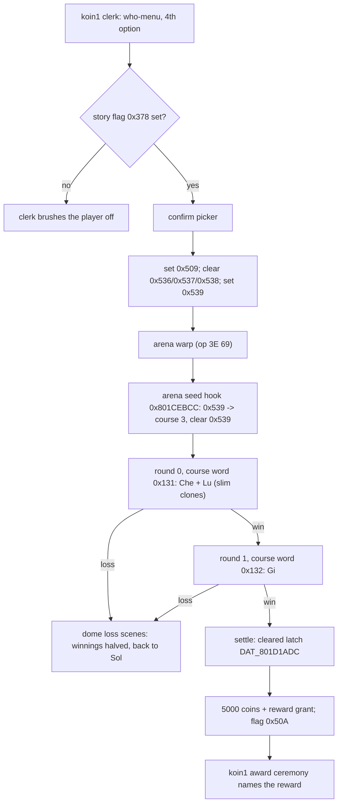
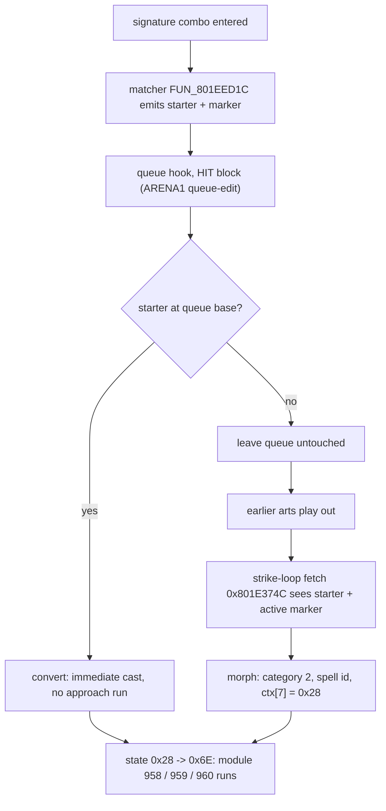

# Randomizer: Delilas Challenge, custom items and party swap

Three [`legaia-patcher`](randomizer.md) features built around the Delilas
siblings (Gi, Lu and Che), the three recurring boss duellists. They are the
largest features the patcher ships: unlike the table randomizers they combine
script edits, model and animation rebuilds, audio re-voicing and injected MIPS
code. This page is their design reference - what each pass edits, where, why,
and which test pins it.

| Feature | Flag | What the player gets |
|---|---|---|
| [Delilas Challenge](#delilas-challenge) | `--delilas-challenge` | a fourth Muscle Dome enrollment option: a new 2-round arena course (Che and Lu together, then Gi) paying 5000 coins and a reward item |
| [Custom items](#completion-reward---a-honey-or-three-custom-items) | `--custom-items` | three new items (Nature's Elixir, Ra-Seru Tear, Fury Bloom) in cut item slots; standalone, and the course's reward when both are set |
| [Delilas party swap](#delilas-party-swap) | `--delilas-party V,N,G` | play as the siblings: the party wears their battle models, names, voices and elements, and the story duels field Vahn, Noa and Gala instead |

```bash
legaia-patcher randomize --input DISC.bin --delilas-challenge --custom-items
legaia-patcher randomize --input DISC.bin --delilas-party gi,lu,che --delilas-moves delilas
```

Sub-options of the swap: `--delilas-moves hybrid|delilas` (default `hybrid`),
`--delilas-arts-voice original|adjusted|removed` (default `original`) and
`--delilas-che-hammer`. Read-only checkers: `legaia-patcher delilas-verify` and
`delilas-audit`. The flag summary is on
[`randomizer.md`](randomizer.md#added-mechanics); the shared write path and the
injected-code arenas are on [`randomizer-internals.md`](randomizer-internals.md).

Terms: **PROT** is the disc archive `PROT.DAT`, addressed by entry number;
**SCUS** is the executable `SCUS_942.54`; PROT 0898 is the battle overlay, 0977
the Muscle Dome arena overlay; a **cave** is injected code hosted in bytes
nothing references; `koin1` is the Sol casino scene that holds the dome clerk;
a **MAN** is a scene's script-and-placement file; **VA** is a runtime address.

## Delilas Challenge

`--delilas-challenge` adds a fourth option to the Muscle Dome enrollment
clerk's "who will be entering" menu: a new dome *course* of two rounds -
**Che and Lu together (1v2), then Gi (1v1)** - paying **5000 coins** into the
dome winnings counter on a full clear, plus a [reward item](#completion-reward---a-honey-or-three-custom-items).
Retail has no such fight: the Nivora Ravine duels are solo, and no retail
formation fields two distinct Delilas.

It is a dome course rather than a scripted battle because a normal battle
staged from `koin1` freezes on any spell: the scene never installs
battle-effect, summon or player-magic asset residency (the same reason the
Muscle Dome disables magic).

The feature is two halves that ship together (`apply_delilas_challenge`
installs both): a `koin1` script edit (`delilas_challenge` module) and an arena
code injection (`delilas_dome` module). Seedless; re-application is a no-op
(the arena injection is idempotent on its seed-hook detour). On by default in
the web patcher's Balanced and Full Chaos presets.



### The koin1 menu and warp

Script and data only (`delilas_challenge` module).

- **Picker.** The 3-option `0x28` who-enrolls picker grows to the 4-option
  `0x29` form (the picker arity ceiling), the new arm appended at the record's
  end.
- **Quick-path skip.** Retail permanently hides the who-menu once Noa or Gala
  has refused enrollment (flags `0x559` / `0x558`) and auto-registers Vahn,
  which would strand the new option on most saves. The skip tests are
  **retargeted at never-set flags, never NOPed**: `0x21` is the field VM's
  frame-yield/stop opcode
  ([script-vm.md](../subsystems/script-vm.md#per-frame-scheduling)), not a
  no-op, so a `0x21` fill breaks the clerk dialog mid-interaction. The tests
  keep their exact retail op shape with only the flag id swapped.
- **The new arm** shows a confirm picker, then mirrors a retail difficulty arm
  exactly: gate on `0x378`, set the dome-active flag `0x509`, clear the three
  course-unlock flags `0x536` / `0x537` / `0x538`, set the course-3 request
  flag `0x539`, then the verbatim BGM + wait ops and the verbatim `3E 69` arena
  warp.
- **Gate.** `0x378` is the flag the Koru death event latches and the world map
  reads to flip the ravine entrance from `nilboa` to `nilboa2`; until then the
  clerk brushes the player off.
- **Fit.** The `koin1` MAN is sector-aligned with zero compressed slack, so
  the grown script only fits through the optimal LZS packer; every MAN re-pack
  site in the patcher falls back to `compress_optimal` when greedy misses
  (`compress_within`). If another edit (a grown language pack, say) has consumed
  the headroom, the koin1 half skips with a note instead of failing the run.

Losing a round returns to the Sol venue by the dome's own design (no game
over). The dome fields whichever fighter the arena normally seats; routing a
chosen party member into the arena's fighter slot is an open RE thread.

### The arena course

The arena overlay (PROT 0977) has no course beyond Master, so course 3 is
added by same-size edits there plus caves in SCUS.

| Edit | Site | Effect |
|---|---|---|
| Seed detour | `FUN_801CEA6C` @ `0x801CEBCC` (course-select init) | decodes flag `0x539` into the packed course/round word as course 3, then clears `0x539` |
| Course descriptor | `0x801D1A08 + 3*8` | `{round_count=3, roster_ptr}` for course 3; all four descriptor readers compute `base + course*8`, so one write serves all |
| Hub actor template | relocated into a SCUS routine cave | it occupied the course-3 descriptor slot; its one `lui`/`addiu` reference is repointed |
| Roster | SCUS cave | Gi / Che / Lu, with the dome's own name strings |
| Payout detour | `FUN_801D0F60` @ `0x801D1118` (settlement payout-table load) | returns 5000 for course 3 |
| Display detour | `FUN_801D1184` @ `0x801D125C` (results screen) | shows the same 5000 in the winnings-display variable `DAT_801D1AAC` |
| Reward detour | `0x801D114C` (post-payout `s0` staging) | grants the reward item(s); routine at `0x800352EC` |

Design facts behind those rows:

- **Seed guard.** The seed fires only when the retail flag seed has left the
  course word at its no-course default `1` - which only the Delilas arm
  produces, since it clears all three course-unlock flags. `0x539` is cleared
  whether or not it seeded, so a stale request flag (a save state frozen during
  the warp flourish) is scrubbed instead of hijacking a Beginner / Expert /
  Master enrollment.
- **The seed word carries bit `0x100`** (`0x131`, not a bare course/round
  encoding). The battle-exit selector `FUN_80046A20` tests
  `_DAT_8007BAC0 & 0x100` to route a leg's end back to arena mode `0x18`;
  without it a lost leg falls into the ordinary game-over gate and a won leg
  exits to the field. Every retail seed (`0x101` / `0x111` / `0x321`) carries
  it.
- **Payout.** Courses 0-2 pay from `0x801D1860 + course*0x40 + (round-1)*4`;
  course 3 indexes past that table into bytes that read 0. The payout load sits
  behind the settlement's cleared latch (`DAT_801D1ADC`, raised only on
  *course exhausted and survived*), so a loss pays nothing and retail's
  halve-the-winnings-on-a-loss behaviour is untouched. The results screen reads
  the payout table a second time on its own, hence the display-only detour; its
  override lives over `FUN_800260DC`, the SCUS per-mode camera preset, a
  zero-reference function.
- **The quit residue.** The arena hub's round-end routing (`0x801CEE44`) reads
  the koin1 menu-selection residue at `0x80084448` and treats the value **4**
  as "the player chose quit", clearing the win latch and zeroing the winnings.
  The Delilas enrollment rides the who-menu's 4th slot, so its residue is
  exactly 4. The seat routine clears the cell at round-0 install; the
  intermission menu overwrites it with its own pick afterwards, so one clear
  suffices. Leaving the course mid-way settles as a loss (halve), not a quit
  (zero).

### The 1v2 round: slim clones

Two full Delilas blocks (163-166 KB of pre-texture bytes) overshoot the battle
heap's ~145 KB distinct-monster budget. The failing malloc returns NULL, which
the loader uses unchecked, so a naive 1v2 freezes at the round-1 load (byte
arithmetic:
[`battle.md`](../subsystems/battle.md#the-battle-heap-budget---why-a-formation-of-large-distinct-bosses-cannot-load)).
The fix streams **slim clones** without touching the originals.

- **What a clone drops.** `legaia_asset::monster_archive::slim_castables`
  rebuilds Che's and Lu's blocks minus most castable spell entries
  (policy: `delilas_dome::slim_policy`). Mesh, stats, name and reactions stay
  byte-identical. The entry count and index space are preserved: a kept entry
  keeps its retail index and a dropped slot aliases the basic-attack entry. The
  slim pair costs ~137 KB, leaving ~8 KB of combat headroom.
- **Constraint 1: exactly one rollable castable survives** (Che's entry 6, Lu's
  entry 7). The AI's cast pick is `rand % castable_count`, and an empty menu
  executes the div-guard `break 0x1C00` the BIOS parks on
  ([AI picker](../subsystems/battle.md#monster-ai-fun_801e9fd4-action-picker--fun_801e7320-target-resolver)).
- **Constraint 2: the signature special's staged entries survive verbatim.**
  Each sibling's streamed signature module stages block entries **by raw
  index** - Lu's Plasma Strike (action `0x7B`) stages `14 -> 12 -> 13`, Che's
  (action `0x7A`) stages `10 -> 11` - and an aliased stand-in never satisfies
  the module's completion wait, so the caster loops its approach run forever.
  Lu force-drops her unstaged `0x23` special at entry 11 to pay for them.
  Choreography entries are not standalone casts: promoting Lu's never-rolled
  entry 12 to the rollable menu wedges her first generic cast.
- **Where the clones live.** Archive slots 190 / 191, two ids no formation,
  encounter or dome roster on the disc references (full-disc sweep; also
  outside the `--unused-enemies` pool). The real slots 163 / 164 are never
  modified, so the ravine duels and the Master course keep every move.
- **How they are reached.** The formation seats the **real ids** 163 / 164, so
  the bespoke AI, the names and every id-keyed table stay genuine. Two 10-word
  cave routines hook the loader's two id-to-slot-offset sites - `0x8005451C` in
  the streamer, and one instruction *before* the first-enemy pre-streamer's
  conversion at `0x80054B70` (the conversion's own delay slot clobbers the id
  register, so the hook cannot sit on it). They add 27 to the id **for the
  archive fetch only**, and only while the course word reads `0x131`. Every
  other battle streams the untouched originals.

### Battle-rule edits the course needs

| Edit | Site | Why |
|---|---|---|
| Magic lockout | two mask words in PROT 0898 (`overlay_0898_801d0748`) | widen `_DAT_8007BAC0 & 0x200` to `& 0x300` |
| Special cadence | AI arm ctx reload `0x801EB7C4` -> cave over `FUN_80035274` | stagger the two siblings' specials |
| Gi's borrowed casts | second cave arm over `FUN_80050d40` | Divide and Spore Gas, one-shot each |
| `PRG ERR%d` paint | reporter `0x80016444` | hide a benign malloc-failure counter |

- **Magic lockout.** The battle round driver's two Magic-command input arms
  reject the selection when `_DAT_8007BAC0 & 0x200`, the Master course's
  lockout bit (Beginner / Expert seeds lack it and allow magic). Widening the
  mask to `0x300` makes the reject fire on the dome-contest marker `0x100` every
  contest seed carries, the course's own `0x131` included. It matters because
  the arena never installs the summon / player-magic sound and art residency: a
  Meta cast in the course corrupts audio state (the koin1 magic-freeze class).
  Retail Beginner / Expert legs lose their latent magic access too - the same
  corruption waits there.
- **Special cadence.** The bespoke Delilas AI arm (`case 0xa2..0xa4` in the
  monster picker `FUN_801E9FD4`) queues the signature special whenever the
  shared battle turn counter `ctx[0x28A]` hits `% 3 == 2`, which would
  synchronize both siblings in a 1v2. The arm's ctx reload jumps to a
  course-gated block that resumes the stock arm register-exactly for every
  non-course context. In the Che and Lu round (course word `0x131` exactly) it
  fires a sibling's special on `(counter + offset) % 4 == 3`, Lu offset 2 and
  Che offset 0: one special every four turns, two turns apart.
- **Where that block lives.** Over the SCUS passive-name draw `FUN_80035274`, a
  48-instruction function with zero references of any form in any image
  (five-form address scan; `port-catalog-ignore.toml` `[unreferenced]`). The
  shared rodata gap is full and the battle overlay's image is packed
  (`static-overlays.toml`: all `.text+.rodata` RAM-matched live), so an
  unreferenced SCUS body is the only always-resident home.
- **Gi's round** (course word `0x132` exactly, seat 0 only, so a Divide clone
  never re-casts). The second arm queues **Divide** (`0x50`, Green Slime's
  split) on Gi's first pick with HP strictly below half of max
  (`+0x14C < +0x14E >> 1`) and **Spore Gas** (`0x4F`, Berserker's status cloud)
  on his first pick with the shared counter at or past 3. It writes the actor's
  cast queue (`+0x1DE = 2`, `+0x1DF` = the spell id), the mechanism the
  signature specials ride: both are capture-class spells whose modules stream
  from PROT 0940 / 0939 at cast time
  ([`spell-table.md`](../formats/spell-table.md)). Each is one-shot through a
  two-bit flags word in the display cave's data tail, zeroed by the Che and Lu
  arm on every round-0 pick (a course always re-enters through round 0). Before
  Divide, non-cast picks resume the stock arm and Blazing Slash keeps its retail
  cadence; after Divide they jump to the arm join, so the generic attack picker
  runs and Blazing Slash is never queued again. Gi's monster block is
  byte-untouched.
- **`PRG ERR%d`.** The 1v2's tight heap fails transient effect-instance allocs
  in bursts (retail tolerates the skipped spawns), and every failure bumps the
  malloc accumulator `gp+0x510` the on-screen dev error reporter prints from.
  The `beqz` guarding that one print arm becomes an unconditional branch; the
  WORK / READ / CD error arms and the accumulator are untouched. The spawner's
  own `ori 0x4000` failure flag at `0x800211A0` is not the mechanism - nothing
  on the disc references the word it writes.

### Arena sharing

The course's seed routine and template cave live in the verified-dead SCUS
region at `0x8007AE00`, which [shiny Seru](randomizer-internals.md#shiny-seru)
and the arts AP override also use; the region is full and the surrounding zero
runs are live-table padding. See
[the arena budget](randomizer-internals.md#the-injected-code-arena-budget).

| Requested with the challenge | Outcome |
|---|---|
| `--shiny-seru` | the challenge installs, shiny Seru yields with a note (this is why the Balanced / Full Chaos presets, which enable both, ship the challenge) |
| `--arts-ap-grant` / `--arts-ap-cost`, `--show-super-arts`, `--super-arts-pack`, `--oscillating-ap` | refused up front |

### Verification

- **Disc oracles** `delilas_challenge_real` and `delilas_dome_real`: the retail
  image locates as unpatched and every hooked address matches the known US
  build. The patched koin1 MAN re-parses with the 4-option picker targeting the
  new branch (gate, confirm picker, dome-active and course-unlock flags,
  course-3 request and arena warp asserted at decode level, and no
  scripted-battle op). The seed hook becomes a `j` into the cave, the course-3
  descriptor and roster land, and the edit is byte-deterministic, idempotent,
  composes with the Earth Egg price edit in either order, and keeps every
  touched sector EDC/ECC-valid. `delilas_dome_compose_real` covers composition
  with the other gap features.
- **Played**: the clerk dialog reaches the option, the confirm shows, the warp
  lands in the arena, the course runs its roster one round at a time, a lost
  leg routes through the dome's own loss scenes back to the venue, and
  settlement is benign.
- **Static + disc-oracle only**: the 5000-coin payout hook and the custom-item
  prize.

### Completion reward - a Honey, or three custom items

A winning course settle grants a reward alongside the 5000 coins. The grant
rides the settle's own latch-gated winning arm (the path that pays the coins
and, on the Master course, the retail War God Icon): a two-word detour at
`0x801D114C` into a routine in the AI-block cave's tail (`0x800352EC`), which
runs one `FUN_800421D4(id, 1)` give per reward item when the settling course is
3 and then replays the displaced pair (`custom_items::assemble_grant_routine_for`).

| `--custom-items` | Reward | What is written |
|---|---|---|
| off (default) | one retail **Honey** (`0x65`, the permanent all-stats-+4 consumable) | only the grant cave and the arena settle hook (`custom_items::plan_grant` over `[HONEY_ITEM_ID]`) |
| on | **Nature's Elixir**, **Ra-Seru Tear** and **Fury Bloom** | the grant plus the item set below |

`--custom-items` is a standalone feature, not a Delilas sub-option (the web
patcher's "Custom items" toggle; on in the Balanced and Full Chaos presets).
The item set (`CustomItemsInjection::plan_item_set`, applier
`apply::inject_custom_item_set`) installs records, descriptors, jump-table
arms, item-machinery caves and battle-overlay hooks, and **no** arena writes.
A `random` drop / chest / steal mode then adds the three ids to its fill pool
(`custom_items::CUSTOM_ITEM_IDS`, the `--unused-items` `extend_pool` shape).
With neither a `random` mode nor the challenge, the items exist but nothing
hands them out; both CLIs print a note. `inject_custom_items` composes the item
set with the Delilas grant, and each half is idempotent on its own key (applier
jump-table word / arena hook word), so either order of arrival completes.

**The three items** claim the item table's only free slots: the executable's
three empty-name records, `0xB9` (the cut Ra-Seru-egg item) and `0x12` / `0x1A`
(the cut top-tier Ra-Seru weapon slots). A dual census - the curated gamedata
cross-reference and the patcher's own drop / chest / steal / shop / casino /
fishing / starting-item sweeps - shows every other named id is reachable in
retail.

| Item | Where usable | Effect | Mechanism |
|---|---|---|---|
| Nature's Elixir | field menu and battle | full HP *and* MP for one ally | new applier jump-table arm `0x48`: fills MP (with the retail `-amount` mirror write) and tail-jumps into the retail tier-2 HP-restore arm, so the popup and displayed-HP accounting are retail's |
| Ra-Seru Tear | battle | a free cast of the **user's own** Ra-Seru summon (Vahn Meta, Noa Terra, Gala Ozma) | hooks the action-seed category dispatch (`0x801E2D60`): spell id = `0x9D +` roster char id, with the 240-MP cost skipped: a one-shot flag makes the summon leg's unconditional MP deduct (`0x801E4584`, which underflows a `u16` when unchecked) write a zero-cost mirror |
| Fury Bloom | battle | Fury Boost on every living party member | a custom arm writes the action-gauge extension (`actor+0x1F9`, the retail class-5 arm's write) per member, with the retail Fury cue on the user; party-wide needs its own arm because group targeting lives inside each retail class arm, not the dispatcher |

- The Tear's item is already deducted at menu commit. Caster-matched is a
  mechanism constraint: the big summons stream the caster's own choreography,
  and a mismatched pair (Gala casting Meta) parks the battle forever in the
  summon driver's completion poll.
- All three play the heal-item chime (`FUN_8004FCC8` cue `0x20C`) from their
  own arms. The cast-audio dispatcher `FUN_801F3990` maps item classes to cues
  through a 9-entry table, so a custom class is silent unless its arm plays the
  cue itself.
- The menu validator's class table points both new classes at its existing
  always-usable arm.
- An item that casts a sibling signature attack is not shipped; see
  [Casting a sibling signature attack from a party slot](#casting-a-sibling-signature-attack-from-a-party-slot).

**Cave discipline.** New code goes where the course's does: the class-14 Point
Card arm (reachable code with no reachable data), three more zero-reference
SCUS functions, and the tails of the course's own two caves. One extra rule
applies: **a claimed cave must also survive a cold boot.** The zero-reference
libapi VBlank-tier slot `FUN_800605C8` passes every static scan and every
save-state probe, yet the kernel invokes it during boot init, and a disc that
overwrites it parks at the PS1 logo
([`re-do-not-re-walk.md`](../reference/re-do-not-re-walk.md)). The cold-boot
watcher `autorun_boot_watch.lua` is part of the cave verification standard.

**The award ceremony names the reward.** Retail's post-contest narration in
`koin1` reads "That was a good fight. / Well done. / We hope you enter again."
then "Contestant {name} is awarded / {n} tokens!". The Delilas course sits
outside the token payout table that counter substitutes from, so an unedited
script reads "0 tokens" and never mentions the items. The edit
(`delilas_challenge::reward_box_lines`, `CONTEST_WON_FLAG`):

- splices four SYSTEM-flag tests at the narration record's own branch point,
  right after its `76 CB` / `75 38` tests and *before* the message run. The
  actor-dialog state machine consumes a `[text][24][text][48]` flow as one
  contiguous run, and control ops spliced inside it cut the ceremony short.
- keeps the retail flow when any course-unlock flag is set (`0x536` / `0x537` /
  `0x538`; a retail arm always sets its own, the Delilas arm clears all three).
- otherwise routes on the settlement's contest-won flag (`0x50A`, set only on
  the cleared-course path and untouched anywhere in `koin1`) to a parallel flow
  appended past the record: the shared "good fight" box copied verbatim (LZS
  folds the repeat), then "You won 1 Ra-Seru Tear, / 1 Nature's Elixir and /
  1 Fury Bloom!" (or "You won 1 Honey!"), then the verbatim close-and-settle
  ops and a jump to the park loop both retail arms converge on.
- lets a Delilas loss fall through into the retail box.

Disc oracle: `custom_items_real`.

## Delilas party swap

`--delilas-party gi,lu,che` (any permutation of the three siblings, in Vahn,
Noa, Gala order) swaps the playable party's battle identity with the Delilas
siblings. Each character keeps their own stats, magic and story but wears the
mapped sibling's battle model, name, voice and element. In exchange each
sibling's monster block is rebuilt around the mapped character's battle model,
so the three Nivora Ravine duels and the Muscle Dome Master legs field Vahn,
Noa and Gala. Not part of any preset; unaffected by the seed.

The swap is possible because both pose systems use flat per-part rigid
transforms addressed by **part index**, and both texture systems are 4bpp
indices + 16-colour CLUTs (colour look-up tables). A same-part-count model
therefore inherits every clip - the same law `monster-model` replacement rides.

| Pass | What it rewrites | Code | Disc oracle |
|---|---|---|---|
| Battle models, both directions | every equipment-section record of `PLAYER1..3`; monster blocks 162-164 | `legaia_patcher::party_swap` (`playerize`, `weapon_fuse`) | `party_swap_real`, `party_swap_variant_object_real`, `delilas_party_real` |
| Field form | PROT 0874 field mesh + atlas window | `party_swap` | `delilas_party_real` |
| Victory poses and battle idle | `readef.DAT` base "ME" archives; inline `record0` idle | `party_swap::winpose` | `party_swap_idle_continuity_real` |
| Voices | battle bank programs 7/8/9, XA banks, `monster.snd` clip bands | `delilas_voice`, `delilas_xa_voice`, `delilas_voice_fx` | `delilas_party_real` |
| Signature art | one 50-AP Hyper per slot: name, combo, stream, hits, effects, camera | `delilas_party::reskin_signature_art`, `delilas_effects` | `delilas_party_real` |
| Element | per-character element table | `delilas_party::retarget_character_elements` | `delilas_party_real` |
| Move set (`--delilas-moves delilas`) | the whole art archive and bank | `delilas_party::apply_delilas_moveset`, `party_swap::moveset` | `delilas_party_real` |
| Retail cast route | cast modules 958 / 959 / 960, queue hook, staged rows | `delilas_cast`, `party_swap::cast_stage` | `delilas_cast_stage_real`, `delilas_cast_remap_real` |
| Enemy side | hero clips in the swapped blocks; signature becomes a physical attack | `enemy_anim_mirror`, `delilas_signature_attack` | `enemy_anim_mirror_real` |
| Story scenes | sibling NPC rigs and head TIMs in four scenes | `nivora_field`, `party_swap::event_field` | `nivora_field_real`, `delilas_event_field_real` |
| Saves and dialog | portrait tiles, new-game names, speaker lines | `delilas_party` | `delilas_party_real` |

**Ordering with `--delilas-challenge`.** The challenge applies first, so its
memory-tight dome 1v2 streams slim clones cut from the retail sibling blocks
while the 1v1 ravine duels (ample heap headroom) carry the swapped models. Both
features edit the AI picker's Delilas arm at `0x801EB7C0..`: the challenge
detours one word of it and the swap's enemy-side conversion rewrites the body
and refuses an arm that is neither retail nor its own encoding.

Still retail: menu portraits and battle HUD faces.

### Battle model: permutation, bake and relayout

Mechanics (`legaia_patcher::party_swap`):

- **Anatomy permutation.** Players order bones `torso, pelvis, head, arms,
  legs`; every Delilas mesh orders parts `head, torso, pelvis, arms, legs`.
  Noa's extra hair bone merges into the head part.
- **Pivot-anchored rest-pose bake** per part: `v' = R_t^T S(R_align (R_s v))`.
  Each part anchors at its rest **pivot**, the joint the engine rotates it
  about. The part scales axially onto the target's joint-to-joint span and
  radially by the uniform height ratio, so chains stay closed under every clip
  while the sibling's shapes survive.
- **Texel re-layout**, bit-exact. Islands shelf-pack between the monster page
  and the party band's five section tiles. Palettes carry over, union-merged on
  the player side into the CLUT columns `record[0]` does not claim.
- **Player file.** **Every equipment-section record** of the `PLAYERn` file is
  rewritten (the swap must survive any equipment), with the swing action
  records and the character's own `record[0]` animation source preserved. The
  descriptor chain repacks with sector-aligned slots inside the retail entry
  footprint.
- **Names.** New-game template names follow the mapping ("Gi" / "Lu" / "Che");
  existing saves keep their stored names.

**`R_align` reads the rig as a whole, not joint by joint.** It turns the whole
rig onto the host's facing (up = pelvis-to-head, lateral = the two shoulders,
landmarks all six rigs carry) and then swings each part minimally onto its own
host bone, pinning the twist. A per-joint bend-plane reference is wrong because
the alignment then depends on which *kind* of reference each side finds (child
bone, parent bone or a world axis), and the two sides do not always find the
same kind:

- Che is the only rig with a measurable pelvis-to-torso bone, so his torso took
  its bend plane from anatomy while every player torso (pelvis pivot on its
  torso pivot) fell through to world Z. Result: a **167.9-degree roll about his
  own spine**, with the shoulder tuck then flattening each upper arm to a
  quarter of its width.
- Gi and his host both pick real anatomy, but the rigs flex their elbows 122
  degrees apart, so his upper arm rolled 166 degrees about its own axis.

The whole-rig form leaves no excess roll on any non-terminal part of any
pairing. Terminals (head, hands, feet) deliberately keep their inherited frame,
because the feet normalisation pre-cancels that one. This is not a joint-gap
defect: no chain edge is ever flagged, so gap-based probes are structurally
blind to it. It shows only in a per-part affine fit against the sibling's own
mesh.

### Welded weapons and the host's weapon

Two sibling "fists" are really **welded weapons** - Che's armB hammer-fist and
Gi's armA blade-fist, each several times the radius of a real hand. A host clip
whose hand rotations assume a hand-sized part sweeps such a part across the
body (Gi's blade under Noa's Spirit charge).

- Each is replaced with the sibling's other fist, mirrored across the source
  body's sagittal plane (`playerize::WELDED_WEAPON_FISTS`).
- The **host's own equipped weapon** goes in the hand instead
  (`party_swap::weapon_fuse`). Per held-item section record, the curated
  item-alone cut the equipment viewer uses (`equip_isolate`) recovers that
  record's weapon geometry as the retail prims verbatim - shape, UVs, colour
  words and ABR bits untouched. It merges into the baked hand at record-rewrite
  time, after the hand's centroid seat + FK inset, so the blade never drags the
  fist's placement.
- The weapon keeps its **real texture**, on three measured invariants: every
  fusable weapon's UVs stay inside its own section's band tile; every weapon
  uses at most two CLUT columns; and a held-section record's pool upload is a
  fixed-size tile whatever it contains. So the band relayout keeps the
  sibling's islands out of the weapon section's tile, each weapon-section
  record keeps its **own retail tile pixels**, and the weapon's palettes ride
  the record's own CLUT run at two reserved band columns (the highest ones
  `record[0]` does not claim). Only the prims' CBA column is remapped.
- Ra-Seru records (item ids `0x01..=0x1A`) keep their bare arm.

`--delilas-che-hammer` is a visual comparison option: Che's welded hammer stays
on his mesh and the host's weapon fusion is skipped for his file, so he fights
with the hammer whatever is equipped. The kept hand also switches wrist law
(see [hands](#hands-follow-a-wrist-attitude-law)): slaving it to the host's rest
wrist measures 73 degrees of long-axis error on a 300-unit hammer, so the kept
welded hand plays the sibling's natural conjugated wrist instead
(`winpose::retarget_clip_wrist`, `party_swap::playerize::kept_welded_hand`),
which with the unmodified mesh bake reproduces Che's model-space attitude
exactly (0.0 degrees). `delilas-verify` detects the state from the disc (a hand
channel's textured radius far past any real fist) and waives only the
fusion-presence check; `delilas-audit` reports the welded radius as a FAIL
unless `--allow-kept-hammer` is passed.

### Two runtime readers the layout must respect

**The face animator is a writer.** The per-frame facial animator
(`FUN_8004C7B4`) MoveImages the character's eye and mouth frames onto fixed
rows of **section 1's** band tile every battle frame. The neutral face is
re-stamped even when no track record is active, and the frame strips ride
`RECORD0_TEXTURE_RECTS[0]`'s tile, which the swap keeps retail. Sibling texels
parked in that destination window are overwritten with the host's face the
moment a battle starts: on-disc renders look clean while the live game shows a
saturated palette-mismatched patch on whatever body part UV'd there. The
relayout therefore splits section 1's region around the per-character
eye + mouth destination union (`playerize::FACE_STAMP_WINDOWS`, mirrored from
the static SCUS face-geometry tables, disc-asserted by
`party_swap_face_window_real`), leaving the window zero and unreferenced. The
emitted pool still covers the section's full rect.

**The Spirit streamer samples vertex indices.** The Spirit charge's streamer
effect samples authored **vertex indices** of specific assembled objects (the
host's hair part and the `0xFE` weapon extra carry 49 / 56 vertices on Noa's
retail assembly). A swap slot whose geometry is deliberately dropped - the hair
channel a sibling has no part for, or the discarded weapon extra - answers
those reads with whatever bytes sit past its empty pool, and the effect's trail
fan stretches mesh-textured quads from the actor to a garbage point for the
first ~20 ticks after the trail spawns. It is a struct read past a pool, not a
pose defect: position, colour and UV are garbage together, and no anim-data
edit moves it. So:

- the rewrite never emits a truly empty object where retail carried geometry.
  Such slots get a **prim-less stub**: the retail slot's vertex count of
  origin-pinned vertices, so a sampled streamer anchors on the part's own
  socket and nothing is drawn.
- the first variant-carrying section re-emits one stub `0xFE` extra (tag `100`,
  ordinal 1, inside the two-pair variant snapshot) so tag-100 lookups resolve.
- the charge-loop record `0x11`'s window (`+0x85/+0x86`) is clamped to the
  frame count of the **main-archive** stream its `stream_source` aliases at
  commit. The side-band buffer routinely holds the main archive when the
  base-archive clip materializes (on retail too), and the scratch past the
  decoded stream is unwritten zeros.
- `delilas-verify`'s `0xFE` check passes exactly one prim-less tag-100 anchor
  and fails anything that draws.

One per-sibling shape aid: Che's round torso over a narrow loincloth opens sky
wedges at the waist under a low battle camera, so his pelvis top ring cones up
into the torso interior as a sight-line curtain (`playerize::WAIST_CURTAIN_IDS`).

### Field form

Each character's PROT 0874 field mesh + atlas window rebuilds from the
sibling's **own field NPC mesh** (the nilboa duel-scene pack, PROT 0639, with
rest poses + head TIMs from PROT 0638) - retail-authored chibi geometry that
fits the pack budget at full detail.

- Each NPC part bakes into the party field bone's local frame through the same
  pivot-anchored bake as the battle side. The locomotion clips rotate each bone
  about its pivot, so pivot anchoring + axial length matching keeps the walking
  chains and the neck closed.
- NPC meshes are authored for fixed-camera scenes and are not watertight from
  free angles (the renderer's winding cull opens them up). The rebuilt head and
  torso carry a winding-reversed twin per prim; a size ladder narrows the scope
  until the container fits. The head's genuine openings (the hair shell's
  underside) seal with flat fan fills in the part's fill colour before the
  relayout.
- The head re-lays into the character's atlas window; bodies stay flat vertex
  colours, the retail field style.
- The battle-model conversion is the fallback when the NPC source is
  unavailable.
- The rebuilt container keeps the entry's first four header words byte-exact
  (see
  [`character-mesh.md`](../formats/character-mesh.md#not-a-dual-consumer---the-battle-vdf-pack-is-a-different-entry)).

### Victory poses

`party_swap::winpose` rebuilds each character's eight win-pose streams (the
base "ME" archive, `readef.DAT` slot `3*char+2`; see
[`battle-data-pack.md`](../formats/battle-data-pack.md#me-stream-archives-readefdat))
from the mapped sibling's own victory clip (monster action tag `0x22`; Che
ships none, so his last `0x23` flourish stands in).

- **Retarget.** Per-part conjugation onto the player rig. It must be built from
  the **bake's own** frames via `playerize::bake_frames`: the played pose
  cancels the bake's `R_align`, so any change to mesh orientation is a change
  the win pose has to mirror.
- **Codec.** Re-encoded with the retail channel-delta codec
  (`winpose::encode_channel_delta`), round-trip self-checked through the retail
  decoder on every apply.
- **A win pose loops.** Every one of the 24 retail base records carries a loop
  window: entry `+0x84` seeds the hold counter `actor+0x176`, and `+0x85` /
  `+0x86` bound the frames the tick replays. In `FUN_80047430`, once the 12.4
  cursor reaches `+0x86 << 4` it subtracts `(+0x86 - +0x85) << 4` and
  decrements the counter, so the span cycles up to 255 times before the results
  sequencer moves on. Retail authors those frames as a seamless cycle: across
  all 24 records the wrap gap is 0.1-1.0 model units and 0.35-2.01 degrees per
  part. A one-shot flourish resampled uniformly into that shape replays its own
  tail (a 4.0-164.1 unit / 5.4-122.9 degree snap per wrap).
- **So the stream is composed, and the lead-in `[0, +0x85)` stays retail,
  verbatim.** The base streams are not victory-only: anim `0x11` (entry 0) is
  the Spirit / Super power-up flourish the battle plays right after every
  `0x10` charge (actor `+0x1D9` steps `0x10 -> 0x11`), so writing the sibling's
  flourish over the lead-in sweeps limbs across the battle closeup.
- **Only the loop window `[+0x85, +0x86]` carries the sibling's post-win
  cycle**, retargeted alone and phase-picked in host space against the retail
  lead-in's last frame. Lu contributes her `[16, 24]` sway, Gi his `[30, 30]`
  hold; Che declares no window, so his entries hold on the flourish's last
  frame. The window bytes are never written (`+0x84` is the byte
  `ArtAnimRecord::uses_base_archive` keys on).
- Entries 4/5, the weak-victory actions (`0x15` / `0x16`) the sequencer also
  loops, take the idle as a whole cycle
  ([`audio.md`](../subsystems/audio.md#hero-victory-voices---the-tail-clips-of-monstersnd)
  has the action / tier mechanism).

### Battle idle

Retail authors each character's combat stance in idle frame 0, and the
siblings' stances suit their own proportions, so a swapped character holding
the host's stance reads as the wrong body.

- **Same-size rewrite.** The player idle is raw packed
  (`2 + frames * parts * 9`) **inline in `record0`**, not channel-delta like
  the readef "ME" bodies. It is rewritten at its exact retail length, so every
  later offset stays valid.
- **Consequences of that budget.** The sibling's cycle is resampled from its
  own 13-35 frames to the host's 8-9, and the rate byte floors at `1` where all
  three hosts already sit, so the rebuilt idle cycles at 1.3x to 1.9x its
  authored speed.
- **Re-anchored to the host's rest.** The retarget rebuilds translations by
  forward kinematics, so its frame 0 does not land where the host's does, while
  every clip the swap does not rebuild (walk, flinch, block, get-up) still
  starts from the host's rest.
- **The re-anchor is one rigid whole-body translation** (`winpose::idle_anchor`),
  added to every part of every frame. Battle poses are flat - each part carries
  an absolute `R * v + T` about the object origin - so a translation written to
  the torso channel alone shears the torso off the body (a 21.6 to 89.8 unit
  gap at every torso and pelvis joint, against the 1.8 to 2.4 units retail's own
  idles carry). Oracle: `crates/patcher/tests/party_swap_idle_continuity_real.rs`.
- **x / z from the torso**, the FK root and the part the actor's world position
  and the attack camera frame. Anchoring the ankles' midpoint instead slides
  the visible body 16-101 units off its mark.
- **y from the floor**: the deepest ankle pivot over the whole cycle on both
  sides, so a lifted foot in either frame 0 cannot bias it. Taking y from the
  torso floats Lu 46-50 units clear of the floor on both her hosts and sinks
  Che 48 into it on Noa's.
- **One write.** The idle rides the same `record0` write as the signature-art
  edits: it is the only one that adds compressed bytes, and batching means one
  LZS re-fit. `patch_player_record0_full`'s `None` return means "nothing
  changed" and "did not fit" equally, so the write falls back to
  `legaia_lzs::compress_optimal` and the caller treats an unexplained `None` as
  a hard error. An overflow silently dropped would leave an art showing its new
  combo in the menu while answering to the old one in battle.

The **run-in** stays the host's: it is a separate queue action (constant
`0x19`, `Starter`) shared by every one of that character's arts.

### Hands follow a wrist-attitude law

The retarget maps each part's absolute orientation independently, so a played
pose preserves neither rig's hand-to-forearm relation - 85 degrees off retail
on the weapon hand in Gi's idle, which points the fused weapon across the
torso. `retarget_clip` therefore slaves each hand's rotation to its forearm at
the host's rest wrist attitude, the same terminal law the feet get from
`normalize_battle_rest_feet`. Hand rotations feed no FK translation term, so
the override changes orientation only, about the wrist pivot. The head is
different: its bob is carried across.

### Voices

| Voice path | Retail source | What the swap does | Code |
|---|---|---|---|
| Reaction grunts | SPU one-shots, battle bank programs 7/8/9 | the mapped siblings' samples (single-program VABs inside `monster.snd`) splice over them in place; cue tracks, routing and residency stay retail | `delilas_voice` |
| Arts shouts | `XA2` / `XA4` / `XA6` | per `--delilas-arts-voice` (below) | `delilas_xa_voice` |
| Swing vocalizations | `XA30.XA` channel groups 0-3 / 4-5 / 6-9 (anchored on the traced swing channels 0/4/6) | muted, then re-voiced | `delilas_xa_voice` |
| Victory barks | `XA21.XA` (whole), channel 7 of `XA20.XA` and `XA22.XA` | muted, then re-voiced | `delilas_xa_voice` |
| Staged-event lines | `XA1`+`XA27` (Vahn), `XA3`+`XA28` (Noa), `XA5`+`XA29` (Gala) | muted, then re-voiced; the fanfare beds per `--delilas-arts-voice` | `delilas_xa_voice` |
| Ordinary victory-pose voice | SPU clips in `monster.snd` | overwritten with the siblings' grunt bodies | `delilas_voice` |

Routing facts those rows rest on:

- **Bark ids.** `FUN_8004FCC8` decodes a bark id as `a1 = id - 0x100`, channel
  `a1 & 7`, file `a1 >> 3` (slots `1` / `3` / `5` remap to `0x1A` / `0x1B` /
  `0x1C`). So `0x1A0..=0x1A7` are `XA21` channels 0-7 one for one - all eight
  are victory-bark arms - with `0x19F` = `XA20` channel 7 and `0x1AF` = `XA22`
  channel 7. The `gp+0x9F4` switch at `0x8004FA24` reaches all ten. That
  jukebox is a special-sequence path ordinary victories never enter; the
  char-keyed victory ids are resolved by the sound-command dispatch in
  `FUN_8004E568`. The music channels beside the `XA20` / `XA22` reels stay
  byte-identical.
- **`XA12.XA` stays retail**: its only captured battle fire is the non-voice
  jingle path (results music).
- **Staged-event ids.** The voice-id space (`id >= 0x100` through
  `FUN_8004FCC8`, ids picked by the anim materialiser `FUN_8004AD80`'s inline
  char table: Vahn `0x101`, Noa `0x111`, Gala `0x121`) resolves 16 ids per hero
  - item use, Spirit, cut-ins, KO and victory lines. `XA3` / `XA5` carry those
  voice lines, not stereo Miracle fanfares only. See also
  [battle voice cues](../subsystems/battle-action.md).
- **Re-voicing** (`delilas_xa_voice`): each sibling's `monster.snd` SPU samples
  decode to PCM, peak-normalize, resample to the channel's CD-XA rate and
  re-encode through the crate's XA-ADPCM encoder (`legaia_xa::encode`, mono and
  dual-mono-stereo 4-bit; the staged-event banks and victory barks ship
  stereo), written at each channel head. Subheaders and routing survive, and
  other speakers' channels stay byte-identical.
- **Victory-pose voice.** It is none of the XA tiers: an SPU sample streamed
  from `monster.snd`'s own sector TOC (`FUN_8003E104`; pose action -> clip byte
  via SCUS `0x800788A0` / `0x80078867`, see
  [`audio.md`](../subsystems/audio.md#hero-victory-voices---the-tail-clips-of-monstersnd)).
  The heroes' clip bands (Vahn `0xB8..=0xBC`, Gala `0xBD..=0xC3`, Noa
  `0xC4..=0xCB`) take verbatim SPU-ADPCM copies of the siblings' grunts out of
  the same file, END-flagged when truncated to the clip span.

**`--delilas-arts-voice MODE`** (browser: the "Arts voices" sub-option) governs
two bank families: the per-art **shout** banks (`XA2` / `XA4` / `XA6`) and the
Hyper / Super / Miracle **fanfare** banks (`XA1` / `XA3` / `XA5` plus the
Seru-magic fanfare streams `XA27` / `XA28` / `XA29`). The fanfares are 3-7
second stereo cue beds carrying the hero's voice over a jingle, and a Hyper Art
fires **no** shout from the shout pool at all - the fanfare is its only audio.
A quarter-second grunt would leave such a cue silent for over 90% of its
window, so fanfares follow the same three-way contract as shouts.

| Mode | Shout and fanfare banks |
|---|---|
| `original` (default) | left retail, never muted: Vahn / Noa / Gala call their own arts out of the siblings' bodies |
| `adjusted` | the retail hero shouts are captured before the mute and re-voiced toward each mapped sibling |
| `removed` | silent; the spliced SPU grunts remain the audible attack voice |

`adjusted` runs the tuned pitch / formant map in `delilas_voice_fx`
(`DEFAULT_VOICE_MAP`, tuned by ear per hero-sibling cell). The DSP chain is
deterministic pure data: WSOLA time-stretch (duration preserved), resample, one
cepstral spectral pass doing the formant warp and the timbre transfer toward
the sibling's longest grunt, pitch-contour bend, and an RBJ biquad tone chain.
Each voiced clip is processed alone and laid back at its original start, so
arts cue timing holds. A fanfare channel takes a reduced cell (`fanfare_fx`:
pitch and formant only, since the timbre, carrier and attack-graft stages
assume a lone voice and smear a music bed) and keeps its full retail length.

Three properties of that chain a tuner needs:

- **`pitch` and `formant_st` are not independent.** `pitch` is a resample, so
  it drags the whole spectral envelope with F0: the audible formant shift is
  `pitch + formant_st`, and `formant_st: 0` means "formants dragged the full
  pitch" (a slowed-tape voice). A female-to-male recast wants F0 far down and
  the vocal tract only 10-15% longer, i.e. a **sum** near -2..-3. Measured on a
  synthetic vowel: `pitch` alone moves the envelope by its full amount
  (-12 -> -11.78 st); `formant_st` alone is accurate (+9 -> +9.00).
- **Envelope resolution limits deep downshifts.** A fixed cepstral lifter of
  `SPEC_L = 48` bins on a 1024-point FFT resolves about 790 Hz at 37.8 kHz. An
  octave down, formants sit 450-570 Hz apart, below that, and the warp goes
  inert (sweeping `formant_st` 0 to +12 at `pitch: -12` moves the envelope
  0.16 st). `formant_pre` (warp before the resample, in the clip's native
  scale) and `env_track` (scale the lifter order by `2^(-pitch/12)`) each
  restore it - measured -2.93 and -2.92 against a -3.00 target.
- **The two hosts must order the passes the same way.** The browser tuning
  dashboard applies its spectral pass *before* the `playbackRate` resample
  (i.e. `formant_pre = 1`); a bake that applies it after honours different
  values than the tab the map was tuned in. This is the shape
  [`host-drift.md`](host-drift.md) describes.

### The signature art

Each hero slot gives up one Hyper art to carry the mapped sibling's
**signature special** - Gi's *Blazing Slash*, Che's *Megaton Press*, Lu's
*Plasma Strike*, the names read off the disc's own spell table (actions `0x79`
/ `0x7A` / `0x7B`).

**The host is that character's 50-AP Hyper**: Vahn's Burning Flare, Noa's
Vulture Blade, Gala's Explosive Fist. They are the only three that clear every
gate. The replacement combo must be the same **length** as the one it replaces,
which rules out every 3- and 4-input Hyper. Noa's Hurricane Kick carries its
combo on three bank records and shares its stream with a Super Art. The
remaining candidates share a combo **string** across characters (`0x80014198`
is both Vahn's Tornado Flame and Gala's Thunder Punch, so rewriting one
rewrites the other's menu glyphs). The new combo `L R L R D` is free on all
three.

Coordinated edits per slot (`delilas_party::reskin_signature_art`):

| Edit | Where | Rule |
|---|---|---|
| Name | the arts-table record's own `+0xC` pointer, into its NUL-padded field (`arts_table::name_field`) | never by searching the image for the old text: names nest (`Hurricane` is inside `Hurricane Kick`) |
| Combo | both copies retail keeps in sync - the SCUS display glyphs and the player-file `record0` matcher | after a collision check against every one of that character's arts |
| Animation | the host art's "ME" stream | the sibling's choreography, addressed by monster-archive **entry index** (Gi's and Che's signature clips are both tagged `0x23`, so no tag band reaches them) |
| Hit timing | entry `+0x10..0x13` | re-scheduled on the measured connect frames |
| Effects | the entry's 8-record effect script and `+0x7A` | sibling's burst; host's element cues removed |
| Camera | one arm of the swing-camera dispatcher | thresholds re-timed to the longer clip |

The spell-table rows `0x79..=0x7B` keep their retail names: under the
[retail cast route](#the-retail-cast-route) the player-side cast banner reads
them, and the enemy side no longer casts those ids (see
[the enemy side](#the-enemy-side)).

**Animation: a chain of stages.** The enemy-side modules stage several entries
in sequence (Lu's action `0x7B` as `14 -> 12 -> 13`, Che's `0x7A` as
`10 -> 11`, Gi's as `10 -> 11 -> 12`), so the final stage alone shows the
payoff swing with no wind-up. Gi's chain is the one no static evidence pins; it
is inferred from clip shape and matches three distinct beats seen in play.

- Stages are retargeted individually and concatenated: Lu 90 frames, Gi 75,
  Che 100, against host streams of 21 / 58 / 20.
- Stages do not share a rate (Gi's first is authored at 1, the rest at 2) and a
  concatenated stream has one. Each stage is resampled to hold its authored
  duration at the chain's fastest rate - `frames_i * R / rate_i`, since a clip
  runs `frames * 8 / rate` ticks - so a slower stage stretches and none is
  decimated.
- **Fit ladder.** When the slot cannot hold the chain, the first rung is a
  coarser keyframe density: halving the rate and every stage's frame count
  together leaves `frames * 8 / rate` unchanged. Only exact divisors are tried,
  so no stage is re-timed relative to its neighbours. Lu's chain needs this
  rung whenever she lands in Noa's slot, whose rig has 16 parts to everyone
  else's 15. Next rung: drop stages from the **front** (a move that loses its
  wind-up still reads; one that loses its strike does not). Last rung: the
  retail frame count with `winpose::retimed_rate`.

**Hit timing: anchor on the connect.** The art's hit events are frame indices
into the stream that just changed under them.

- A proportional rescale is wrong: the host's hits were spaced against a single
  swing, so spread over wind-up plus payoff most land in the wind-up. Burning
  Flare's four hits at frames 11-14 of its own 21-frame clip become 42-53 of a
  75-frame chain whose strike begins at frame 52.
- Anchoring on the payoff stage's *start* is wrong too: the payoff stage opens
  with its own approach, so the first application lands 1.1-3.0 seconds after
  the body connects, in all nine pairings.
- `delilas_party::chain_contacts` derives the connect set per stage, in the
  rebuilt stream's coordinates. A stage in the damaging tag band
  (`0x0C..=0x1F`) carries its own contact beats on disc and those are authority
  (Lu's three strike stages). A stage retail gave no beats to - Gi's and Che's
  are tag `0x23`, damaged by their PROT 958 / 959 cast modules - has its
  connect **measured** as the frame the whole body arrests hardest (the largest
  single-frame fall in mean per-part translation delta). A measured stage under
  40% of the chain's hardest stop is a wind-up settling and is dropped.
  Measured connects are good to about a frame; authored ones are exact.
- The hits sample that set. More connects than hits: evenly, both endpoints
  included, so the first application lands on the first connect and the last
  (biggest) power byte on the finisher. Fewer: the extras ride the same impact
  on consecutive frames, retail's own multi-hit idiom (Burning Flare is
  `11 12 13 14` on one swing).
- **The slot count is always the host's.** `entry[+0x00 + i]` (power) and
  `entry[+0x10 + i]` (frame) are parallel arrays walked by one cursor
  (`actor[+0x1F4]`), so moving the count re-pairs the power bytes, and a zero
  slot ends the walk outright (`0x801EC47C`) - nothing here may write `0`.
- **Why editing them is safe.** The damage gate tests
  `0x0C <= entry[+0x00] <= 0x1F` on the host art's power byte 0 (`0x1D` /
  `0x17` / `0x18`, untouched). The mid-clip early-commit at `0x80047918` needs
  `entry[+0x76] == 0` while all three host arts read `1`, so an earlier hit
  cannot truncate the clip.
- **The firing rule** (`FUN_801EC3E4`, `0x801ec440`-`0x801ec480`): a hit fires
  on the first tick where `frame >= hit_frame - 1`, `frame` being
  `node[+0x68] >> 4`, the integer keyframe index. Landing damage on visual
  contact `C` means writing `C + 1`. `rate` only sets wall-clock (one keyframe
  is `8 / rate` ticks).

**Effects.** The host's script is eight `[frame_gate, effect_id, x, y, z]`
records; for Burning Flare all eight spawn flame `0x96`.

- The staged special clips carry no script of their own. As an **enemy**, a
  sibling's signature move draws its visuals from a per-spell code module (PROT
  960 for Lu's) that spawns from module-resident parameter blocks a one-byte
  art id cannot name.
- The spawn therefore comes from the sibling's ordinary casts, whose entries
  carry real scripts in this format (direct-form `0x84`), unless the slot
  claimed the [transplant cave](#effect-transplant).
- With nothing to borrow, the host's script is suppressed by deferring every
  gate to `0xFF`: the walker never advances past a gate it has not reached.
- **The gates take the connect set**, so one clock drives burst, damage and
  body. The walker's gate rule is the hit rule (`frame + 1 >= gate`,
  `0x801decb4`), so a gate equal to a hit value fires on the same frame.
- **`+0x7A` is zeroed per slot.** Entry `+0x7A` carries an impact-effect class
  two further renderers read straight off the actor: `FUN_8004998c` streams an
  element spark along the swing path, and `FUN_80049348` draws afterimage
  copies tinted from a per-*character* table. Of the three hosts only Burning
  Flare sets it. Re-pointing it at the sibling's element (class `2` is the
  lightning spark) would trade the host's sparks for the host's ghosts, since
  the afterimages take their colour from the character
  ([art-data.md](../formats/art-data.md#impact-effect-class-entry-0x7a)).

### The swing camera

The camera needs re-timing, not replacing.

- **Dispatch.** `FUN_801D71B8` dispatches per (character, art constant) through
  three per-character jump tables (`0x801CEA88` / `0x801CEAD0` / `0x801CEB20`,
  file `0x0270` / `0x02B8` / `0x0308` of the raw battle overlay), slot =
  `(constant - 0x1A) * 4`. Thirteen distinct arms exist, **no live arm is
  shared across characters**, and 37 dead slots point at a bare return.
- **Who reaches it.** The prologue admits only party seats `0..2` and action
  category 3 (Attack). No enemy cast and no Super-Art expansion reaches a slot:
  every Super finisher constant falls outside its table's bound, so Super Arts
  get no attack camera in retail.
- **Shape of an arm.** A cascade of `slti` tests on the animation cursor
  `actor[+0x22C][+0x68]` (sixteenths of a keyframe). Gala's Explosive Fist arm
  changes shot at keyframes 4, 7 and 10; Noa's Vulture Blade arm and Vahn's
  Tornado Flame arm at 14. The highest threshold anywhere is keyframe 17, and a
  signature chain runs 46 to 100 frames, so an unedited camera finishes its
  choreography inside the wind-up and holds one shot for the rest.
- **The re-time.** `delilas_party::retime_camera_arm` scales each threshold so
  the **last** shot change lands on the frame the payoff stage begins, earlier
  ones scaled by the same factor. Anchoring on the payoff beats the raw length
  ratio: Lu's stream is 58 frames either way, so a ratio of 1 would leave her
  final shot in the wind-up.
- **Finding the immediates.** By shape: a `slti` (the dispatcher's own bounds
  checks are `sltiu`) against a register some `lh` / `lhu` loaded from `+0x68`,
  with a threshold in the keyframe range. Linear liveness analysis is wrong
  here - the arms are branch cascades, and the path reaching a later test jumps
  over the block that reuses the register.
- **Exclusivity is checked.** Editing an arm is only safe while exactly one art
  dispatches to it. Burning Flare's own arm `0x801D7650` reads **no cursor** at
  all (four of the thirteen arms are flat; it is the only flat one a host art
  uses). Its slot **swaps** with Tornado Flame's `0x801D74A8` (two cursor
  bands, three ramp folds, no side effects). A swap rather than a retarget:
  every arm is already live somewhere, so a plain retarget would alias an arm a
  second art still uses. Noa's and Gala's arms are already theirs alone.
- **Cross-character borrowing is dominated.** Both per-character adjustments
  are applied in the dispatch preamble, before the arm runs. Character 3 seeds
  camera `TR.y = 0x600` against `0x400` for characters 1-2, and `ctx+0x26D`
  (the table column) is forced to 0 for character 3 while everyone else gets
  `rand() % 2`. Gala's Lightning Storm arm on Vahn therefore flips columns per
  turn, and Gala's Explosive Fist arm on Vahn sits 512 units low in the two
  bands that do not write `TR.y`.
- **Slow motion needs no change**: retail halves `actor+0x21D` on every party
  Tactical Art strike, and a SpecialStarter adds a freeze-frame plus quarter
  speed, both from `FUN_8004AD80` and both party-only.

### Each slot fights in its sibling's element

`delilas_party::retarget_character_elements` moves the slot's **element**.

- **The table.** The battle overlay's per-character element table
  (`0x801F5480`, PROT 0898 file `0x26C68`, one byte per 1-based character id)
  is the only per-character element on the disc. Retail seeds Vahn = fire,
  Noa = wind, Gala = thunder.
- **Its readers.** Both affinity readers index it with
  `DAT_8007BD10[actor] - 1` and use the result as a row / column of the matrix
  at `0x801F53E8`: `FUN_801DD864` (`0x801dd8ac`, `0x801dd900`) and the hit
  kernel `FUN_801EC3E4` (`0x801ecf38` attacker, `0x801ecf94` defender). The
  byte decides what element every attack from that slot deals and what it
  takes. Retail has no per-art element: a Ra-Seru cast and a basic swing scale
  through the same byte.
- **The source.** Each sibling's element is on the disc at monster record
  `+0x1D` (the byte `FUN_801EC3E4` reads at `0x801ecf68` for an enemy
  attacker): **Gi = fire, Che = earth, Lu = thunder**. The pass copies it into
  the slot's row, from the archive image captured before the model loop so a
  re-skinned block cannot feed itself back. The affinity matrix and the five
  characters outside the party keep retail values.
- **Not the element:** the art record's effect script (`+0x14`) is cosmetic,
  and `+0x7A` writes the **target's** hit-flash (`FUN_801EC3E4` `0x801ee3d4`
  stores it at `actor[+0x21F]` of `attacker[+0x1DD]`), not the attacker's move
  colour.

### The bank the runtime walks

The art-record edits reach the runtime through one chain:

```text
DAT_801C9360[char]  ->  the decoded record[0] image
record0[+0x58]      ->  art bank (u32 count, then 0xD0-stride records)
bank + 4 + row*0xD0 ->  the bank record
record + 0x24       ->  the action entry
```

`FUN_8004AD80` materialises a staged anim id `q >= 0x10` by writing
`bank + 4 + (q-0x10)*0xD0 + 0x24` into `record0[q*4]` (`0x8004b708` loads
`record0[+0x58]`, `0x8004bc84` stores the entry pointer), and `FUN_80047430`
hands that pointer to `FUN_801DEA50` as `node[+0x4C]` (`0x800478b8`).

Measured against the mednafen `party_battle_gobu_gobu` capture: Vahn's 33-row
and Gala's 32-row live banks are **byte-identical** to this crate's decode of
the disc `record[0]`, and Noa's differs in 4 bytes of 7284, all inside row 0's
entry `+0x04..+0x07`, a field the tick writes and the patcher never touches. A
same-size edit inside a bank record is an edit the runtime sees.

### Casting a sibling signature attack from a party slot

Pointing a party actor at the unmodified enemy-side module (Lu's Plasma Strike
as PROT 960 drives it) is **reachable but unsafe**. The
[retail cast route](#the-retail-cast-route) is what makes it shippable, by
editing the modules per defect class; this section records why the unedited
module cannot be used.

"A party actor has no monster block" is not the blocker. A party actor has a
first-class equivalent anim table (`DAT_801C9360[slot]` against a monster
seat's `DAT_801C9348[slot-3]+0x4C`, the two arms of `FUN_8004AD80`), the raw
indices the module stages resolve on it, and the module's single monster-block
access is a hardcoded **seat-0** write to one field of one clip.

What blocks it, in order of severity:

- **Kernel-RAM corruption on every cast.** That seat-0 access reads word 32 of
  monster seat 0's block. The loader fixes up only `magic_count` words at
  `+0x4C`; past that the words are unfixed block-relative offsets. A seat-0
  monster with `magic_count <= 13` (Che Delilas has 12) turns the pointer into
  a bare offset and the following store lands a halfword in PSX kernel RAM.
  Retail never trips it because the module is only reached with Lu (16 entries)
  in seat 0.
- **A softlock with no escape.** Battle state `0x70` re-enters the module every
  frame and advances only when it returns 0; there is no timer. Four phase
  gates can stall it, and the last needs a clip of at least 23 keyframes, which
  Gala's party index `0x0D` fails at 17 of 19 equippable section-2 ids.
- **Friendly fire.** The damage call and both HP writes are hardcoded to actor
  slot 0, not the chosen target.
- **The choreography is not free.** The staged raw indices mean "the four basic
  swings" on a party actor, so getting the sibling's clip there needs a detour
  in the hottest per-actor path in the battle loop.

The cheap parts of what the module provides are separable and ship on the
art-side reskin: the [camera](#the-swing-camera) and the effect script.

<a id="effect-transplant"></a>
**Effect transplant** (`delilas_effects`). A cast module's part prototypes are
ordinary move-VM records in the same format the `0x801F6324` prototype table
holds, and they contain **no absolute pointers** (measured over each module's
whole data region). Retail ids 50-60, the Super Arts' own bursts, are the
identical shape (`model_sel = -1`, submode 2, the same opcode set) and are
already reached from a player art's effect script. So copying the record into a
spare prototype slot lets the art's one-byte effect id name it.

- **Which ids are free.** `0x801F6324` is materialised at six `lui` sites, all
  in PROT 0898, and every index is a byte lifted straight out of data with no
  computed index anywhere. Censusing the carriers therefore closes the set:
  1811 monster action entries over 186 blocks, 286 player action entries, all
  44 move-power records, all 13 cue groups. Six ids are unreferenced; only
  `37`, `38` and `47` own their record outright (the rest have a free table
  slot aliasing a live record).
- **The cave is 88 bytes, and that is the whole budget.** Records 37+38 are
  contiguous and bounded by live id 39. Every other inter-record slack in the
  prototype region is 2 bytes, and the 530 bytes that look free after id 44 are
  two burst-arm triggers, their 130-byte stager records and three further live
  records. So exactly one sibling gets the transplant (the first hero slot
  claims it) and the other two keep the borrowed cast projectile.
- **Rejected records.** Those using op `0x20` (an unidentified `gp[0x714]`
  hook) or naming a `DAT_8007C018` mesh, so the worst case is a
  differently-coloured burst, never a missing resource.
- **Safety.** The id can only draw a different retail effect: nothing else
  reads 37 / 38, and 38 is parked on id 0's record so the cave's middle is
  never decoded as a header. A clobbered cave ends at the move VM's own
  `>= 0x47` bound check, and the stager takes no pointer out of record data.
- **Sound.** `0x801F6418[37]` is sound cue 208, so the transplant fires that
  cue - a one-byte edit if a different one suits the move.

### The Delilas move set

`--delilas-moves` (browser: the "Move set" dropdown under the party picker)
picks how much of the hero's Tactical Arts kit becomes the sibling's.

| Mode | Behaviour |
|---|---|
| `hybrid` (default) | every art keeps the animation retail authored for it; only the reskinned Hyper plays a Delilas motion |
| `delilas` | the rest of the kit is re-authored (`delilas_party::apply_delilas_moveset` + `legaia_patcher::party_swap::moveset`) |

**The archive is rebuilt, not extended.** A character's art streams live in one
`0x10800`-byte `readef.DAT` slot and retail fills most of it: the three main
slots have 20374 / 2446 / 17361 bytes free, so Noa's cannot take one more
full-length clip. Retail already points several art records at one stream
(Vahn's 25 records resolve to at most 17), so the record's `+0x0A` stream index
is a free-standing pointer and the archive can be re-emitted as long as every
record that reads it is repointed in the same pass.

- **Contents.** The signature stream carried over byte-identical, the sibling's
  locomotion clip, and one entry per distinct sibling swing, against 17 / 18 /
  19 retail streams. On the default `gi,lu,che` mapping: 5 / 6 / 6 streams in
  16511 / 16133 / 26565 bytes. The counts follow the sibling, not the slot.
- **What a swing is.** An archive entry whose action tag falls in
  `0x0C..=0x1F` and that no stage of the signature chain claims: 3 (Gi) / 4
  (Che) / 4 (Lu), without a per-sibling table. The chain is subtracted rather
  than specials being inferred from tags because Lu carries an unstaged `0x23`.
- **Repointing.** Every record that reads the archive is repointed round-robin
  over the swings and re-timed to the clip's own rate; the two combo-starter
  records take the locomotion clip. Each record's frame-indexed fields (the hit
  list at entry `+0x10..0x13` and the eight effect-script gates) are rescaled
  onto the stream it now reads. The host's impact-effect class (`+0x7A`) and
  mid-clip loop hold (`+0x84..0x86`) are cleared, both being keyed to
  choreography that no longer exists.
- **The renames are load-bearing.** Every record's inline name becomes the
  label of the clip it now plays, and a handful of repeated strings compresses
  far better than 22 distinct ones, which keeps the rewritten `record[0]`
  inside its LZS footprint. Spare bytes with the whole pass applied, default
  mapping: Vahn 143, Noa 272, Gala 56.
- **Menu names** follow through each arts-table record's own `+0xC` pointer,
  over the retail string plus its measured NUL padding. Labels are capped at
  seven bytes for **every** sibling: the tightest field any retained art
  carries is Vahn's `Cyclone`, the mapping is a free permutation, and a label
  that does not fit is skipped (the apply reports it).

#### What survives, and why hiding the rest is free

An art is only listed once `FUN_801EFBFC` has inserted it at char record
`+0x185` on a successful performance, so an art that can never be performed
never appears. A blanked combo is unperformable through the `combo_len == 1`
guard at `0x801EF424`: it is zero-terminated at byte 0, so a match can only
complete at length 1, and that length is abandoned. This is retail's own
mechanism - the Super and Miracle **finisher** rows all carry a single-`D`
combo for this reason. The `token - 0x0B` compare at `0x801EF3EC` is a second
line of defence (`0x0B` is `BlockAnim`, not an input) but is not proved over
every queue writer, and the conclusion does not rest on it.

Four groups keep a working combo:

- **The signature host**, which carries the sibling's special.
- **Bank row 11, the Miracle Art.** Its combo is the only route to the
  wholesale queue overwrite: `FUN_801EED1C` branches to the replacement table
  at `0x801F64F4` only while its rows-visited counter is still zero
  (`0x801EF4D8`-`0x801EF4E0`), i.e. only on that first row. Row 11 carries
  `RDLULURDL` / `LURDULUDR` / `RRDUDUDLL`, the three combos the SCUS arts table
  flags as Miracle.
- **Every art a Super Art trigger names.** A Super is not entered as a combo.
  `FUN_801EF9E4` walks the *finished* action queue at `actor[+0x1DF]` and
  tail-matches it against the resident trigger table (`find`
  `0x801F6524 + char*0x41 + row*13`, `replace`
  `0x801F65E8 + char*0x50 + row*0x10`), and the only writer of an art constant
  into that queue is the combo matcher. Bank row and queue constant differ by
  `0x10` (`0x801EF63C` writes `row + 0x10`), which turns each trigger's art
  sequence into a row set: 8 rows for Vahn, 10 for Noa, 8 for Gala.
- **Every art at or below the innate cap** at `0x801F686C` (`[3, 5, 3]` on the
  USA disc, each character's Hyper block). `FUN_801EFBFC` only self-teaches ids
  *above* that cap, so those arts arrive through the script grant (the `+0x74E`
  insert at `0x80041FB4` in SCUS `FUN_800402F4`). Blanking one would leave a
  listed art that can never fire, so they are kept and re-animated.

That leaves 12 / 16 / 12 performable arts per character and 3 / 1 / 3 hidden.
The Miracle Art needs no component art kept: its replacement string is written
into the queue verbatim, so the arts it names only have to exist as records.

Residual: the script grant is data-driven and its operand set is not
enumerated, so a scene that grants an id *above* the cap would list a blanked
art. No retail grant of that shape is known.

### The enemy side

The swapped monster blocks already wear the mapped hero's model and name. Three
passes complete the mirror.

**Enemy-side clips** (`party_swap::enemy_anim` via
`legaia_patcher::enemy_anim_mirror`). Each swapped block's archive entries are
rewritten with the hero's own clips: idle, walk, reactions and swings, the
hero's 50-AP Hyper split wind-up-to-strike across the entries the signature
stages by raw index, and the hero's victory flourish in the tag-`0x22` close.

- Streams are the raw 9-byte packed family and re-encode byte-exactly.
  Frame-indexed head fields rescale; sound cues, AGL, tags and root motion stay
  retail.
- Per-entry frame floors respect the one measured module gate: PROT 0960's
  damage tick waits for the caster's clip cursor to reach keyframe 22, so Lu's
  payoff entry holds >= 23 frames. Everything else floors at retail's smallest
  staged entry, 11.
- A budget ladder (exact keyframe-density halving, a compact close, then family
  drops) covers tight blocks. All six mapping permutations fit with no ladder
  action; a block that missed every rung would keep the sibling's clips with a
  note.
- The model bake runs the same whole-rig alignment as the player side.
- Verified by `enemy_anim_mirror_real`, bake-parity affine-fit bounds included.

**The signature becomes a physical attack** (`delilas_signature_attack`). The
mirrored hero does not perform the boss cast.

- **Where retail decides.** Not in the monster blocks: the AI picker
  `FUN_801E9FD4`'s `0xA2` / `0xA3` / `0xA4` arms fire on the round counter
  (`% 3 == 2`) and write `actor[+0x1DF] = monster_id - 0x29` (the subtraction
  is the literal `0x2442FFD7` at file `0x1CFFC` of the raw battle overlay), so
  Gi's `162` resolves to spell `0x79`, Che's to `0x7A`, Lu's to `0x7B`. Those
  are capture-class ids, which is what pages PROT 958 / 959 / 960.
- **The edit.** The 24-word case body is rewritten in place - no injection
  arena - with an arm that queues an Attack whose strike bytes are the staged
  chain entry indices (Gi `10,11,12`, Che `10,11`, Lu `14,12,13`), the entries
  the anim mirror filled with the hero's Hyper clips. Cadence becomes
  `round & 3 == 2` (the exact `% 3` form does not fit the 24 words).
- **Strike graft.** The staged entries carry empty hit lists and effect scripts
  on the retail disc (the module did its own damage ticks), so each takes the
  head shape of the block's own strongest ordinary attack: hit list, effect
  script and `+0x76` commit flag, frames rescaled to the stage's length.
- The cast modules' own hardcoded `jal` sites (15 in PROT `0958`, 41 in `0959`,
  24 in `0960`) are untouched by this pass; they serve the player-side
  [cast route](#the-retail-cast-route).

**Field forms in `nilboa`.** The Delilas field forms are scene-resident: MAN
placements carry `model = 106/107/108`, pack-member indices into PROT entry
`0639`. The scene mirror (`legaia_patcher::party_swap::nivora_field::heroize_nilboa`
via `legaia_patcher::nivora_field`) rebuilds those three members as the mapped
heroes' field rigs, pivot-baked onto the siblings' scene-idle rest frames so
the scene's own ANM records pose them, and repaints the three sibling head TIMs
in PROT `0638` with the heroes' faces.

- It fits at full geometric detail: dropping the two unposed equipment-template
  groups per rig and flattening non-head textured prims to the retail field
  flat-shade style brings the three rigs to 29200 bytes against the members'
  30276. Non-face head-texture islands pack at half resolution; face fronts
  stay full.
- The retail hero source is the **pre-fieldize** PROT 0874 capture: by the time
  this pass runs, 0874 itself carries the siblings.
- Verified by `nivora_field_real`.

**The other three story appearances** mirror through the same bake, driven by a
per-scene coordinate table (`party_swap::event_field::EVENT_SCENES` via
`legaia_patcher::nivora_field::apply_event_field`):

| Scene | Bundle | Members | Anchor ANM records |
|---|---|---|---|
| `stone` (map-stone confrontation) | `0175` | 33 / 34 / 35 | 37 / 52 / 62 |
| `taiku2` (Zora's floating castle) | `0426` | 116..127 (four per-beat shading copies per sibling, one bake) | placement records 14 / 20 / 26 |
| `conc2` (past Conkram) | `0624` | court-outfit meshes 165 / 166 / 167 | 64 / 66 / 68; head TIMs in the sibling `tim_pack` entry `0625` |

Every coordinate is the scene's own MAN actor placement (`model_index` =
TMD-section member, `anim_id - 1` = anchor record). These scenes keep their NPC
meshes inside the bundle's LZS TMD section, so the rebuild reflows the member
pack in the decoded section and recompresses - in place when the stream fits
its retail span, else a whole-bundle section re-lay inside the entry footprint.
`taiku2`'s kneeling anchor stances fool the geometric limb splitter into a
clean-looking but wrong role pairing (the torso lands on a leg bone), so its
slots carry the assignment measured off the byte-identical rigs' neutral stance
in `stone`. Verified per scene by `delilas_event_field_real`.

### Saves, dialog and the audit tools

**Save metadata follows the mapping.** The save-select face and the PSX
memory-card block icon for the three hero slots come off the save-slot portrait
sheet ([`save-icon.md`](../formats/save-icon.md), tiles 0..2 by party id / card
slot), and the boot load screen keeps standalone copies of those three tiles.
The swap exchanges each hero tile with the mapped sibling's portrait tile (Che
11, Gi 12, Lu 13 in the same sheet), byte-exact, on all surfaces. Existing card
saves keep the icon they were written with; `save-tool rename` covers the names
on an existing card.

**Dialog follows the swap.** Every line that names a sibling (speaker prefixes
and self-introductions in the ravine, map-stone, Floating Castle and
past-Conkram events) is rewritten through the translation machinery to name the
hero who took that sibling's place. "Delilas" stays, so "Gi Delilas:" reads
e.g. "Noa Delilas:". Word-boundary matches only. Hero names run longer, so a
line that overflows its fixed segment budget goes through a least-destructive
fit ladder: drop the " Delilas" surname one occurrence at a time (speaker
prefix first), then contract "I am " to "I'm ". Nothing needs the whole-sector
MAN relayout in either direction of the default mapping.

**`delilas-audit`** classifies any produced rom after the fact:
`legaia-patcher delilas-audit --input patched.bin --baseline retail.bin`, a
static battery (no emulator) over the three rebuilt player files.

| Check | Passes when |
|---|---|
| Stream census | every base-archive lead-in frame the battle can reach mid-fight is byte-retail (the loop window and ME streams may differ) |
| Pose battery | FK arm-closure and extent metrics over every battle and art clip sit inside bands taken from the baseline's own numbers |
| Hand radius | no textured hand's radius exceeds twice the baseline (the welded-weapon class) |
| Equip invariance | every record of an equipment section carries the same texture pool as the section default, so equipping any item is a VRAM no-op |

The equip-invariance check also flags a half-applied or version-mixed swap: a
record still holding its retail pool would stomp the sibling's body texels at
equip time. The e2e harness runs the audit as its static stage.
`delilas-verify --input patched.bin` is the faster single-disc check for a
stale patcher build.

> Verified by the `delilas_party_real` disc oracles (apply / re-decode /
> idempotence / determinism / mapping rearrangement, plus a hybrid-mode
> contrast against retail that pins every coordinate the Delilas pass owns) and
> the `party_swap_real` conversion oracles over all nine pairings.

### The retail cast route

In retail a Delilas signature is a capture-class spell whose cast pages a
per-spell module (PROT 958 / 959 / 960) into the battle's side overlay window
and runs the whole boss choreography - camera track, summoning pillar, blackout
lift, multi-hit damage build-up - from data, keyed only off the spell id. For a
slot whose module has passed the player-caster audit, performing the signature
art routes the finished arts queue into that real cast (`delilas_cast` module)
instead of playing the art-side reskin. All three modules are audited and
probe-verified: Blazing Slash (958), Megaton Press (959), Plasma Strike (960).
Module anatomy (image shapes, phase machine, staging ABI, the seat-0 damage
hardcode) is on [cast-module.md](../subsystems/cast-module.md).



**Conflicts.** The hook stub and caves use the SCUS injection gap and the
arena pockets, so the route is not installed alongside `--shiny-seru`,
`--show-super-arts`, `--super-arts-pack`, `--arts-ap-grant` / `--arts-ap-cost`
or `--oscillating-ap`. On a conflict the patch keeps the art-side signature and
says so in the summary.

#### Module edits by defect class

Each is an expect-verified word edit inside the module.

| Class | Modules | Defect on a player cast | Fix |
|---|---|---|---|
| Seat-0 damage / HP sites | all | damage and HP writes hardcoded to party seat 0 | retargeted to the derived victim |
| Dead-victim wipe arm | all | a boss cast's victim is a hero, so a dead victim meant game over | taken out of the player path; the dead wipe body hosts caves |
| Finale teardown | per module (959 and 960 share one pattern) | a model-less effect entity stays in a carrier's draw table; the kill-marked corpse routes the TMD walk's colour read to unmapped memory and hard-freezes on the frame the choreography ends | its stream words are neutralised at the settle tail (same `ctx+0x102C` halt-quad pattern in both) |
| Finale reaction wait | 958 | a monster corpse never leaves the reaction row, so a kill at the finale deadlocks | wait gated on the victim being alive |
| Cast-bed audio | 960 | the cue is dropped when XA is busy; the walk reaches damage early | preempt cave + deterministic tick counter |
| Seat-3 record toggles | 960 | two stores through an arbitrary victim's record `+0x80` word | nop'd |

- **958's finale wait.** The finale arm opens with a reaction-row wait
  (`beq playing(+0x1D9), reaction(+0x1F1)`) before the HP fork, where 959 forks
  on HP immediately and 960 waits on a countdown. A hero victim leaves the
  reaction row when the battle state machine stages its KO; a monster corpse is
  re-staged by nothing until the action ends, which that wait gates (pinned
  state: `mph 0x18`, victim parked in row `== +0x1F1`, caster holding a full
  `0xFF` park). The arm's free `nop` loads HP into a dead register, the wait
  branch retargets a 4-word cave in the wipe body (alive -> the retail wait,
  dead -> the phase-advance convergence), and the end-of-action liveness sweep
  (state `0x5A`) runs the real death.
- **Victim register.** 958 keeps the victim in `$s1` only per-arm (its finale
  arms burn `$s1`-`$s4` as GPU-packet constants), so the first damage arm banks
  the victim pointer in a wipe-body cell and the finale pairs reload it. 960's
  `$s3` holds tick-wide and takes plain `move`s.
- **960's cast bed, the fire.** The phase-0 opener fires the 16.9 s cast bed
  through the jingle wrapper `FUN_8004FCC8`, which **drops** a cue outright
  whenever the XA system is busy (`jal FUN_8003DE7C(1)`; no deferral queue
  exists). The opener's `jal` is rerouted through a 5-word preempt cave split
  across the SCUS pools that calls the guard-free player `FUN_8003D53C` (slot
  `0x13`, channel `2`, dur `0x3F6`) directly; its own head stops any active
  stream, so the bed fires at module open unconditionally.
- **960's cast bed, the schedule.** The bed's blast bump sits at stream
  `+14.8 s`, which lands on the retail walk's damage stage (`mph0+909` ticks,
  walk end `+1264`) once real CD stream-start latency is added. Retail's mp5 arm
  waits for the previous stage's clip to end (`lbu +0x1D9 == 0xD`, a ~320-tick
  clip boundary) plus a playhead-cursor threshold. With every stage folded onto
  row `0x0A` the played-id half is true the tick mp5 opens and the cursor half
  is nearly met, so the walk reaches damage at `mph0+829`. The cursor half is
  replaced with a deterministic tick counter kept in a dead wipe-body word of
  the module image itself (`0x801F85B0`; re-streamed from disc each cast, so it
  self-resets), the count-store riding the wait branch's delay slot. The
  caster's `+0x176` hold cell cannot be borrowed: it is the clip player's live
  budget. Threshold, probe-calibrated: damage stage `mph0+938`, walk end
  `+1324`.

#### The cast bed's opening and the fanfare channels

With the blast pinned to the damage whiteout, the bed's audible onset is a pure
function of the stream's internal music-to-blast spacing. The retail bed opens
with ~0.82 s of digital silence and a faint (-30 dB) pre-swell before the first
full-level hit at stream +1.31 s, which on a real-latency drive reads as the
music starting late. The fix is a front shift in place
(`delilas_xa_voice::boost_cast_bed_intro`):

- the first 70 sectors of `XA20.XA` channel 2 are decoded and the stream is
  advanced 1.24 s, so the opening hit lands at +0.07 s (50 ms fade-in);
- the advance is paid back with a 1 s **linear** dissolve into the unshifted
  stream ending at +3.05 s (equal-power on correlated material bumps the middle
  +3 dB);
- the advance and bridge point are the argmax of **local waveform correlation**
  between the shifted and unshifted branches over the blend window (0.883; the
  bed is a ~0.565 s ostinato, so an in-phase lag exists). A spectral-similarity
  pick is not sufficient: a spectrally matched point can have waveform
  correlation of -0.15, and the out-of-phase blend is audible as the music
  restarting;
- every frame past the bridge is bit-identical input, so the true-stereo
  re-encode (`legaia_xa::encode::encode_stereo_4bit`) converges back onto the
  retail bytes within the written span (the disc oracle asserts the span's tail
  equals retail) and the blast keeps its authored +14.8 s offset;
- an RMS guard skips an already-shifted stream (retail is silent at
  +0.15..0.6 s).

The signature special's **fanfare** channels - the host art's channel pair plus
the generic Super-chain channel 1 (a chained special fires the generic id
`0x101` / `0x111` / `0x121`, not the pair) - are written to digital silence in
every arts-voice mode, their duration-table rows shrunk to a token 0.1 s. A
fanfare carrying the bed's head would pre-play the opening at commit and the
module-open preempt would replay it from zero. Enemy-side retail has no
pre-cast fanfare either.

#### Staged caster rows

The module stages the **caster's** clips by raw index (`actor+0x1DA` = `0x0A`,
then `0x0B` at the lift boundary). On a monster caster those are its archive's
wind-up / smash entries; on a party caster they resolve through the `record[0]`
action table, where retail row `0x0A` is an empty placeholder and row `0x0B` is
the character's Block clip (whose record the stage boundary chokes on).

The swap authors real rows (`party_swap::cast_stage`): the sibling's wind-up
and smash, retargeted onto the host rig with the art-side conjugation and
re-encoded raw-packed.

- **Placement: inserted below `clut_a_off`.** The decoded `record[0]` grows by
  the rows' length; the two image payloads and the `clut_a_off` / `clut_b_off`
  / `budget` header words (plus the paired `+0x5C` sibling word) shift up; the
  table words `0x0A` / `0x0B` point at the inserted entries. Everything from
  `clut_a_off` on is battle-load scratch (the member init uploads the CLUT-A/B
  blocks, then LZS-decodes the five equip-section sub-records into the same
  region; see [`battle-data-pack.md`](../formats/battle-data-pack.md)). Rows
  parked higher survive every post-load RAM probe yet are destroyed before the
  first turn: a cast that freezes the screen while its effect / SFX ticks loop.
- **Block is re-homed.** Its entry moves byte-unchanged onto placeholder row
  `0x06` in all four player files, and the one party-init literal that seeds
  every actor's Block reaction id (`li 0xB` before the `+0x1F3` store in
  `FUN_80053cb8`, SCUS `0x80054008`) becomes `li 6`. Every consumer reads the
  seeded value back; none hardcodes `0x0B`.
- **Fallback.** When the rewrite cannot land, the module pins both stages onto
  the empty row (`addiu v0,v0,1 -> nop` at the staged-index step): the caster
  holds a pose, and the enemy-side cast also loses its smash stage, since the
  module writes the same index for both caster kinds.

**Cue tracks are the punch sounds.** Every clip-synchronised battle sound that
is not an effect-script cue rides the action entry's `+0x54` table (8 x
`[u16 frame][u16 cue]`, truncated at the first zero cue). The per-frame player
`FUN_800508DC` walks it against the clip cursor and hands each fired cue to the
ring producer `FUN_8004FE5C`, which maps ids per arm:

| Caster | Cue id | Lands as |
|---|---|---|
| party | small (`< 0x48`) | SFX ring `id - 1` (static bank) |
| party | `0xA7..0xC7` | `id + 0x19C` (runtime bank) |
| party | big (`>= 0xC8`, after the track player's own `+0x38` skew) | misroutes into the XA-direct path |
| monster | big | `id + 0x19C` |

Probe-pinned on the retail duel (`nivora_duel_pre_plasma_strike`, FE5C-arg
capture): each enemy Plasma Strike punch volley is three fires. The victim's
reaction track fires `0xAD` (ring `0x249`, runtime bank) and `0xD` (ring `0xC`,
the static thud), and the caster fires `0x172` (a runtime-bank voice line only
the Delilas battle VAB carries). The authored player rows translate accordingly
(`cast_stage::author_player_cue_track`): the flurry's punch cue `0x4A` becomes
the `(0xAD, 0xD)` pair - byte-identical ring traffic to a retail volley,
resolvable in any battle - small ids (footsteps `0x11`, impacts `0x16`) pass
verbatim, and runtime-bank voice ids drop. Each authored row carries its source
clip's `+0x54` track with frames rescaled through the loop-window map; a row
without one punches in silence.

#### Full stage chains

The player-side stage walks are un-folded to the full retail chains when the
host file's LZS budget takes them (the `lu,gi,che` mapping does; the folded
two-row shape is the per-module budget fallback).

- **Hosting.** The player file hosts every chain clip below `clut_a_off` (Gi's
  crouch / leap / slash / finale; Lu's raise / charge / channel / strike /
  flourish).
- **Staged ids keep the folded `0x0A` / `0x0B` values**, so 960's paired
  stage / confirm gate (its phase-5 arm re-reads the playing id `lbu +0x1D9`
  against the same literal it stages) stays valid and the enemy-side caster
  still resolves its own archive entries.
- **Stage caves.** Each staging store (`sb id,0x1DA`) becomes a `jal` into a
  small SCUS-resident cave that repoints the head-table word (`0x28` / `0x2C`)
  at the stage's clip, writes the entry's `+0x88` stream pointer
  (`entry+0xAC`), redoes the staging store and returns. The loader writes that
  pointer only for table-bound entries, and a mid-chain entry without it
  commits a NULL stream. `$ra` is dead between calls at every hooked site and
  no hooked word is a branch target.
- **Duration-true clips.** The pose ladder never sheds frames: with the rate
  byte already at its floor of 1, halving frames halves wall time, the clip
  hits the shared tick's natural-end re-commit and replays from frame 0. A
  deeper rung instead holds each pose 2 or 4 output frames (duplicated 9-byte
  rows LZS-compress to repeat tokens).
- **Loop windows carry over.** Each entry carries its source clip's loop window
  (`+0x84..+0x86`, rescaled; reader
  `legaia_asset::monster_archive::animation_loop_windows`). The retail cast
  clips park or cycle inside their windows through each stage's dwell (Gi's
  crouch holds `[9,10]`, his finale parks on its last frame; Lu's charge parks,
  her flourish loops its tail sway). A zeroed window replays whole clips.
- **Lu's strike is hosted identity**: the source's own 39 frames at rate 2 with
  its authored `[15, 15]` park intact. Module 0960 tests the strike clip's
  cursor against two absolute thresholds - the phase-5 confirm waits for cursor
  `0x90` (frame 9), and the damage tick waits for cursor `0x160` (frame 22) a
  fixed 28 ticks after the module itself releases the park (file `+0x1638`
  clears the caster's `+0x176` / `+0x21B` hold budget). The cursor climbs
  `2 * rate` sixteenths a tick, so a rate-1 re-timing halves the climb: the
  confirm lands 36 ticks late, the un-parked clip replays, and the burst
  decouples from the release.
- **Under the fold**, where the keyframe-22 gate rides a different clip's
  restages, the bound clip is stretch-floored at 23 keyframes and ships
  windowless, player and mirrored block alike.
- **Where the caves live** - three pools free exactly when the route runs: the
  SCUS injection-gap tail behind the queue hook; shiny Seru's
  read-watch-verified `ARENA2` + `SLOT6` pockets; and PROT 958's own dead
  party-wipe body (three 2-word stubs, the `ori` riding each `j`'s delay slot,
  then the 4-word dead-victim HP gate; the body's last word stays the finale
  victim cell). 960's finale neutralise is hosted in its own dead wipe body.

Oracles: `delilas_cast_stage_real` (rows `0x0A` / `0x0B` decode as real
whole-skeleton streams below `clut_a_off`, Block re-homed on row `0x06`, the
`+0x5C` word tracks, the palette walk still parses) and
`delilas_cast_remap_real` (the 958 / 960 staged-id remaps incl. 960's
stage / confirm gate pair).

#### The queue hook

The conversion is split in two so arts entered **before** the signature combo
still play (see the diagram above). Both routines sit in `ARENA1`
(`0x8007AE00`), claimed free-or-identical like the gap.

- **At assemble time** the hook's HIT block hands the matched
  `[0x19|0x1A starter][marker]` pair to the ARENA1 queue-edit. A starter **at
  the queue base** converts to the cast immediately and the approach run never
  fires; a starter **anywhere else** defers with the queue untouched.
- **Why base-or-defer is exhaustive.** It follows the retail matcher's own
  emission shapes (`FUN_801EED1C`): the Hyper arm (`0x801EF4E8`) consumes the
  matched arrow span, so a bare signature input tokenizes to `[1A marker]` at
  the base and a chained one to `[.. 19 art 1A marker]`. The only queues with
  raw directions before the starter are chains whose leading art the matcher's
  AP admission gate dropped (`0x801EF424`: tiers are charged per completed
  match, later-starting matches first, and an unaffordable match emits
  nothing). Those directions are basic strikes the player entered, and
  deferring plays them out.
- **Admission tier.** The route halves the Hyper admission tier
  (`install_chain_admission_tier`, `li t4,0xA -> 0x5` at `0x801EF32C`) so an
  art-then-special chain clears admission at realistic mid-battle AP: the
  five-arrow signature admits at 25 instead of 50. The walk's deductions are
  refunded at the applier's end (`+0x170 += +0x224`), so this is the
  per-command charge, not a second pool.
- **The deferred half** is a two-word detour at the attack band's strike-loop
  fetch (`FUN_801E295C` state `0x1E`, `lbu v1,0x1df(v0)` at `0x801E374C` ->
  `jal` with the fetch riding the delay slot; no branch targets either word,
  and the displaced `+0x1DC` busy-latch load returns in the morph's exit delay
  slot). When the fetched byte is a starter whose next byte is the **active**
  slot's route marker, the action morphs mid-chain - category 2, spell over the
  consumed queue head, `ctx[7] = 0x28` - and the capture-class spell routes
  `0x28 -> 0x6E` into the module without re-reading the mid-queue cursor.
- **A missed morph fails soft**: the marker plays as an ordinary art row and
  the chain ends normally (probe-measured on a routes-zeroed image).
- **Markers.** The per-slot markers double as the replaced host art's own
  constant (Vahn / Che `0x1C`, Noa `0x1F` = Vulture Blade), so performing that
  host art alone still casts.

**The banner.** Retail's state-`0x28` body raises the `0x4C` spell-name banner
for **monster** casters only (`lbu v0,0x2(s5); sltiu v0,v0,3` at `0x801E43D0`;
the party side has no banner writer), so a converted signature would keep
whatever the arts chain last wrote. The un-gate
(`delilas_cast::install_cast_label_gate`) is two in-place words,
`lbu v0,0x1DE(s3); sltiu v0,v0,2`, retesting on the action category: the Item
band (the summon items, retail's own skip) still skips, and every Magic cast
runs the retail label block, monster casts bit-identically. Player Seru casts
gain the banner enemy casts always had; an id-scoped gate has nowhere to live,
since gap 1, `ARENA1` / `ARENA2` and slot 6 are all carved on a Delilas image.
The name it reads is the sibling special's own spell row (`0x79..=0x7B`).

## See also

- [`randomizer.md`](randomizer.md) - the feature and flag reference.
- [`randomizer-internals.md`](randomizer-internals.md) - write path, injection arenas, hook pattern, tests.
- [`crates/party-swap`](../../crates/party-swap/README.md) - the swap kernels (rig permutation, rest-pose bake, movesets).
- [Cast modules](../subsystems/cast-module.md) - the capture-class cast modules the retail cast route drives.
- [Muscle Dome](../subsystems/minigame-muscle-dome.md) - the arena ladder the challenge course joins.
- [Battle data pack](../formats/battle-data-pack.md) and [monster animation](../formats/monster-animation.md) - the model and pose formats the swap rebuilds.
