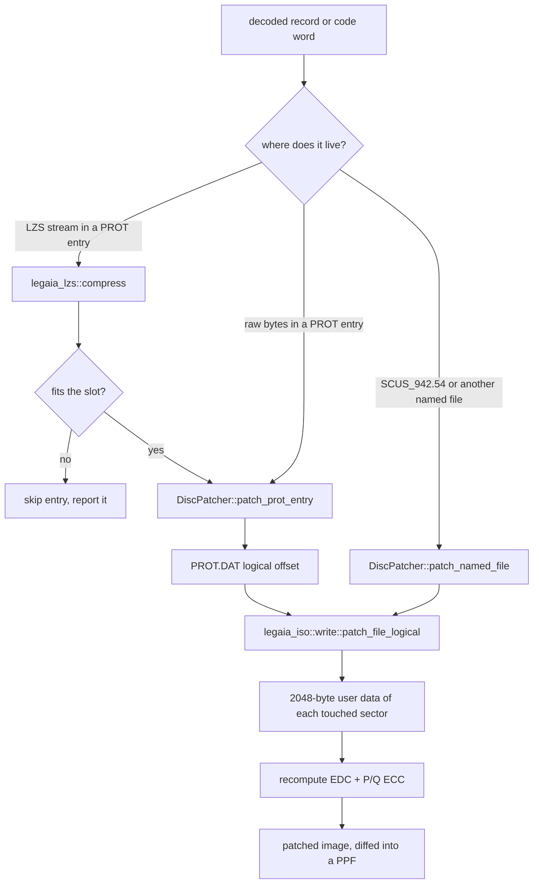

# Randomizer internals: write path and code hooks

How [`legaia-patcher`](randomizer.md) changes a disc. This page is for
contributors and for modders who want to add a feature: it covers the path an
edit takes from a decoded record back to valid CD sectors, the dead regions of
the executable that injected machine code may occupy, the design of each hook,
and the tests that pin all of it. What each feature does for a player, and its
flags, is on [`randomizer.md`](randomizer.md).

Terms used throughout: **PROT** is `PROT.DAT`, the disc's main archive, addressed
by entry number; **SCUS** is the main executable `SCUS_942.54`; an **overlay** is
a code image the game loads over `0x801C0000+` for one mode (PROT 0898 is the
battle overlay, 0899 the menu overlay); a **VA** is a runtime virtual address;
**LZS** is the game's compression format; **EDC/ECC** are the error-detection
and error-correction bytes every CD sector carries.



| Layer | Code | Role |
|---|---|---|
| LZS encoder | `legaia_lzs::compress` | produces a stream the retail decoder `FUN_8001A55C` accepts |
| Sector write-back | `legaia_iso::write` | overwrites user data, recomputes EDC and P/Q ECC |
| Disc bridge | `legaia_patcher::disc::DiscPatcher` ([`crates/disc-patch`](../../crates/disc-patch/README.md)) | maps a PROT-entry-relative edit to sectors; PPF writer; space ledger |
| MIPS layer | [`crates/code-hooks`](../../crates/code-hooks/README.md) | instruction encoders, R3000 test simulator, injection arenas, hook mods |
| Feature modules | `crates/patcher/src/*.rs` | one module per randomizer / hook, named in each section below |

## The write path

<a id="why-this-needs-three-new-capabilities"></a>
### The three capabilities an edit needs

Most editable values live *inside* a Legaia LZS stream that the asset
dispatcher decompresses at load. Changing one is therefore
decompress → mutate → recompress → write back, which takes three pieces the
extraction side (which only reads the disc) does not need:

1. **An LZS encoder** - `legaia_lzs::compress`. The retail game ships only a
   decoder (`FUN_8001A55C`); the encoder produces streams that decoder accepts.
   See [LZS compression](../formats/lzs.md).
2. **Mode 2/2352 sector write-back** - `legaia_iso::write`. Overwriting the
   2048-byte user payload of a CD sector also requires recomputing its 4-byte
   EDC and 276-byte P/Q ECC, or the sector reads as corrupt. See
   [PSX disc geometry](../formats/disc.md).
3. **A disc bridge** - `legaia_patcher::disc::DiscPatcher`, which ties the editing
   primitives to the sector write-back through the PROT.DAT TOC.

### Editing model: same-size in place, except doors

Every same-size edit overwrites bytes **in place** and never changes a byte
count, so no LBA, PROT TOC row or ISO 9660 directory record moves. The patch is
a pure byte overwrite plus EDC/ECC recompute, with no cascading offset shifts.
Drops, encounters, chests, steals, **house doors** (the player door-warp tile
shuffle) and **map doors** (the `.MAP` kind-0 teleport-destination shuffle - raw
sector bytes, not even LZS-wrapped) are all of this kind.

It works because the edit targets fit a fixed slot with slack. The monster
`battle_data` archive (PROT entry 867) gives each monster a fixed `0x14000`-byte
slot laid out `[u32 decompressed_size][LZS stream]`. A drop edit leaves the
decoded record length unchanged. The project's greedy packer is weaker than the
packer that mastered the disc but still fits the slot comfortably (`repack_slot`
rejects the rare case where it would not), and the slot is re-emitted zero-padded
back to `0x14000`.

**Scene-transition doors are the one exception.** A scene-transition
destination carries its target scene's name inline, so re-pointing a door at a
differently-named scene changes the record's byte length. The
[MAN relocation engine](../formats/man-relocation.md) makes that safe: it
rebuilds the decompressed MAN, fixes every internal offset the resize disturbs,
and keeps the *recompressed* stream within the asset's on-disc footprint, or
skips the scene. The disc image's total size never changes either way.

### The patch chain

A PROT-entry-relative edit maps to a disc byte range like this:

```text
disc image (2352-byte sectors)
  -> ISO 9660: PROT.DAT lives at disc sector prot_lba
    -> PROT TOC: entry N starts at start_lba[N] * 2048 bytes into PROT.DAT
      -> asset: an edit at offset_in_entry bytes into the entry
```

so a PROT-entry-relative offset becomes the PROT.DAT-logical offset
`start_lba[N] * 2048 + offset_in_entry`, which
`legaia_iso::write::patch_file_logical` turns into physical-sector writes plus
EDC/ECC re-encode. `DiscPatcher::patch_prot_entry` is the generic entry point;
`patch_monster_slot` / `monster_slot` are the `battle_data` helpers.

### EDC/ECC: not game-specific

The error-correction math is the generic CD-ROM scheme from ECMA-130 / the
Yellow Book - the same EDC (CRC, reversed polynomial `0xD8018001`) and
Reed-Solomon P/Q ECC (over GF(2⁸), generator `0x11D`) every PSX disc and every
mastering tool uses. The header (`0x00C..0x010`) is treated as zero per the
Form 1 convention, so parity is independent of the sector's MSF address. It
embeds no game bytes. The decisive correctness check is the disc-gated test that
re-encodes real PROT.DAT sectors and reproduces their stored EDC/ECC
bit-for-bit.

### Re-pack slack

A scene MAN is packed with **no compressed slack** (the next asset starts right
after it), so the re-packed stream must be no larger than the original. The
[LZS re-packer's lazy matching](../formats/lzs.md#encoding-re-packing) makes that
hold for every scene MAN but one (and for every monster-archive slot). The rare
stream that still overflows is **skipped** (its scene / slot left unchanged) and
recorded in the apply report rather than aborting the run; the CLI prints the
skipped entries.

The "no larger than the original" budget is measured from the scene asset-table
**boundary** (the MAN's allotted span up to the next descriptor's offset), *not*
from the current compressed length. That matters when several passes (encounter,
chest, shop) edit the same scene MAN in one run: our re-packer is often a touch
tighter than Sony's, so reading the budget back from the just-written shorter
stream would shrink it on every pass and make a later pass needlessly overflow
and skip a scene - which is what left some shops (e.g. Biron Monastery's) vanilla
when run alongside encounters/chests. The boundary is fixed (all edits are
same-size in place), so every pass gets the same full budget.

## Code-injection features

A feature the game has no table for is added as machine code. The pattern is the
same every time:

1. Pick a **site**: one or two instructions in SCUS or an overlay, at a point
   where the registers hold what the feature needs.
2. Overwrite them with a same-size **detour** (`j <routine>` + `nop`).
3. Write the **routine** into a region nothing reads or writes at runtime. It
   does its work, replays the displaced instructions and jumps back.
4. **Expect-verify**: before writing, the plan checks the site still holds the
   retail words, so a hook never lands on a disc it was not derived from.

The instruction encoders and an R3000 simulator the tests run hooks under live
in [`crates/code-hooks`](../../crates/code-hooks/README.md). Every region a hook
may occupy is listed once, with its owner, in `legaia_patcher::space_ledger`.

**"Zero is not dead."** A run of zero bytes in the image is not automatically
free: the game may clear it at boot or fill it at runtime. A region is usable
only when no reference to it exists in any form and a live read/write watch
agrees. The two sections below are the standing inventory.

### The injected-code arena budget

Every hand-assembled feature lands in the same four verified-dead SCUS regions,
and they add up to **652 bytes**:

| Region | Span | Size | Used by `--shiny-seru` |
|---|---|---|---|
| `SCUS_GAP` | `0x80077728..0x80077828` | 256 B | 246 B |
| `ARENA1` | `0x8007AE00..0x8007AF00` | 256 B | 252 B |
| `ARENA2` | `0x8007AFF8..0x8007B040` | 72 B | 64 B |
| `SLOT6` | `0x80078A88..0x80078ACC` | 68 B | 56 B |

Shiny Seru alone occupies **618 of the 652 bytes**, leaving 34 bytes split into
fragments of 4, 5, 8 and 12. `--show-super-arts` needs 613 (~450 B of code, the
rest tables), so no allocator and no packing makes that pair fit; the exclusion
is not a hard-coded region clash that a smarter allocator would dissolve. A
sweep of every zero run in the whole `SCUS_942.54` image outside the known live
tables finds **53 further candidate bytes** in total, so there is no fifth region
to grow into either. (The 4208-byte run at `0x800797D0` is the PsyQ
interrupt-callback block. `ResetCallback` zero-fills `0x800797D8..0x8007A83F`
at boot, and its callback stack uses only the top ~640 bytes. So the floor of
that run is unused, but anything written there in the disc image is erased
before it could run - see ["zero is not dead"](../../crates/patcher/README.md)
and the [memory map](../reference/memory-map.md#scus_94254-data-segment-0x8006f180-0x8007b7ff).)

The zero-run sweep counts only bytes that are already zero. Larger pools exist,
and each has a cost. Unreferenced SCUS function bodies come to about 15 KB:
159 functions in 94 ranges with no reference of any form anywhere on the disc.
The Delilas course and `--enemy-hp-bar` already live in some of them, and the
"zero is not dead" rule still asks for a live read-watch before one is reused.
The ~1.8 KB of format strings read only by BIOS `printf` (`FUN_800567A8`)
become free if every call to it is stubbed out, along with the libgpu hook word
at `0x80078D50`. The RAM above slot B, from `0x801FA9D8`, can be loaded by
growing PROT 0900 / 0901, but that needs a PROT relayout rather than a
same-size patch ([memory map](../reference/memory-map.md#free-ram-and-stack-0x801fa9d8-0x801fffff)).

What paid for the arrows, the sort and the performed gate inside that budget:
folding the shared unlock leaf into hook (A) (which can read the performed byte
before the stock load clobbers `v0`), letting (B) read the byte itself, dropping
the record-cursor hook (E) - (B) can enter the hit arm directly with `s5` set -
packing the arrows two bits each, and carrying a `u16` name offset instead of a
finisher constant to chase from. Every table entry is derived from the user's own
disc (AP costs, thresholds, inputs out of `SCUS_942.54`'s arts-name table) or
from `legaia_art::SUPER_ARTS`, and the plan re-proves on the user's disc that
all fifteen Super Art records carry their own names at `+0x10` before it writes
anything.

**Moving the payload into the battle overlay does not work either**, and the
reason is a measured reference fact rather than a judgement call. The list
renderer `FUN_80034358` has exactly one reference of any form anywhere on the
disc - a `jal` at `0x8003238C`, inside the SCUS window-content dispatcher
`FUN_80031D00` - and that dispatcher has **64** `jal` references, from SCUS, the
**field** overlay (0897) and the **menu** overlay (0899). The arts list is a
window widget, so the renderer runs with PROT 0898 *not* resident, and a hook
inside it that jumped into 0898's address space would execute whatever the field
or menu overlay has paged there. Scan:
`scripts/ghidra-analysis/find-address-word-refs.py 80034358 --prot` and the same
for `80031d00` (see [address-reference-scan.md](address-reference-scan.md)). The
one piece that *does* live in 0898 - the performed-byte writer - is reached only
from the applier, which is 0898 code itself.

A Super Art's **damage** row carries no AP override and never claims the arena,
so `--super-art-power` composes with everything.

Every region above, and the menu overlay's, is listed once with its owner in
`legaia_patcher::space_ledger`, the table language packs consult too: a
translation never writes a mod's region, and the one region reserved for
relocated translation strings is never a mod's
([`space-and-budgets.md`](translation/space-and-budgets.md#sharing-room-with-mods-the-space-ledger)).
The ledger also lists the **runtime buffers** no region may overlap
(`space_ledger::BUFFERS`), and a test enforces it.

### Where menu-overlay hooks may live

A zero run in PROT 0899 is not automatically room. The save screen's two card
buffers - the card-read buffer `0x801E5120..0x801E7120` and the save compose
buffer `0x801E7120..0x801E9120` - are all-zero in the file. At runtime they are
full of save data, and they are not confined to the title's Continue screen. On
the overworld, the pause menu's Save row runs the save driver `FUN_801DAEF4`.
The compose step `FUN_801E1934` memsets the compose buffer and copies the live
game state over it. The driver then writes `1` to the sub-screen selector and
returns to the root picker, with the overlay still resident. The Load row does
the same with the read buffer. Code placed in either buffer is therefore
overwritten, and the next menu screen that reaches it runs save-block bytes.

So neither buffer hosts code - runs at `0x801E74E0..` and `0x801E65F4..` are
inside them and unusable. A shop is its own overlay residency and never reaches
a card driver, but the pause menu does: Save, then Status → Moves, jumps into
save-block bytes. The `--seru-trade` and `--show-super-arts` runs sit in the
save-menu atlas's blank lower band, `0x801EA440..0x801EB94F`. That band is atlas rows 162..203, zero in the file
and never sampled by the card screen. It lies above both buffers, no image
forms an address inside it, and it is zero in every library capture with the
overlay resident. The full list of 0899's runtime spans is in
[`space-and-budgets.md`](translation/space-and-budgets.md#zero-is-not-room-runtime-buffers).

### Equipment drops

`--equipment-drops` is genuinely **additive**: it grants one *extra* piece of
equipment on a low per-battle chance, **on top of** the normal drop, which it
never touches. A monster record has a single drop slot (`+0x48` item id /
`+0x49` chance), so no data edit can make a monster drop two things - turning the
slot into equipment would destroy the normal drop. So instead of editing data,
this feature **patches the executable's reward routine** the same way the
starting-bag feature splices a grant into the opening scene: a small routine is
injected that rolls the game's own RNG and, on success, calls the inventory-add
helper for a random equipment id. This is why every gameplay preset of the
in-browser patcher enables it; only "Vanilla" leaves it off.

**The hook (`bonus_drop` module).** The battle-end reward routine `FUN_8004E568`
tallies a battle's spoils exactly once (gated on the per-battle state byte
`actor+0x6ce == 0`, which it then sets to `1`). Right after it grants the
formation's normal drop via `FUN_800421d4(item, 1)` at `0x8004f608`, control
joins at `0x8004f610` (`lui v0,0x8008` / `lw v0,-0x4540(v0)`). The randomizer
overwrites those two instructions with `j <routine>` + `nop` (a detour), and the
injected routine:

1. rolls `rand() % 100 < chance` (the low-chance gate, default 5 %, reusing the
   battle RNG `FUN_80056798`);
2. rolls `rand() % table_len` to index an embedded equipment-id table;
3. calls `FUN_800421d4(id, 1)` to add the gear - the same helper the normal
   drop, shops, and minigame rewards use (an unguarded add, like the minigame
   completion reward `FUN_801D0F60`);
4. replays the two displaced instructions and `j`s back to `0x8004f618`.

The join is reached once per battle, so the roll fires once per battle. The
routine + id table are written into the 1028-byte preserved rodata gap at
`0x8007AB38` (the same loaded-and-preserved padding the [name injection](randomizer.md#unused-content)
uses, at a non-overlapping offset clear of the Seru-Bell string) - on PSX all
resident RAM is executable, so a routine placed there runs when jumped to.
Everything is a same-size, in-place `SCUS_942.54` edit; the planner guards on the
two detour-site words matching the known US build and on the routine region being
all-zero dead space, refusing a differently-laid-out image rather than corrupting
it.

The grant is silent (no victory-screen "received" line); the gear simply appears
in the bag after the battle. The chance is `--equipment-drop-chance N` (percent,
default 5).

**The id table** is the equipment pool: the retail item id space is one flat
table shared by consumables, key items, and equipment, with nothing that flags
"this id is a weapon" in a single byte, so the equipment ids are recovered by
**name** - every weapon / armor / accessory in the curated public
[gamedata tables](../reference/gamedata.md) is matched case-insensitively against
the disc's own item-name table to find its id (`legaia_patcher::equipment::equipment_pool`).
The names ship in the repo; the ids come from the user's disc - no Sony bytes are
embedded (the injected routine is the randomizer's own code), and the join
doubles as a cross-check of the curated tables against the real executable. About
150 of the ~155 curated equipment names resolve; the stray in-range consumable
*Honey* is correctly excluded.

> The from-scratch engine can't execute injected MIPS, so - unlike the data-edit
> randomizers - this feature has no engine runtime oracle. It is verified by the
> byte/disassembly checks in `equipment_drops_real` (the detour + routine + table
> decode as the hand-assembled code, the edit is surgical, the build guard
> refuses an unknown layout) plus an emulator playtest.

### Run-away EXP

`--flee-exp` banks a slice of a fight's experience into the party whenever they
**successfully run away** - vanilla awards nothing for fleeing. Like the
[equipment drop](#equipment-drops), this is a runtime behaviour with no value to
edit (the flee path never reaches an EXP grant), so it **patches the executable**
rather than a table.

**The hook (`flee_exp` module).** The per-actor battle state machine
`FUN_801E295C` (battle-action overlay, base VA `0x801CE818` = **PROT entry 898**)
handles "Run" across states `0x64..0x66`. State `0x66` is the
**successful-escape teardown**, reached only when the run roll succeeds (a failed
run goes `0x65 -> 0x50` and the battle continues; see
[`battle-action.md`](../subsystems/battle-action.md)). Its handler begins at VA
`0x801E5A10` (`lui v1,0x801d` / `addiu a0,v1,-0x6f90`, the fade-template setup).
The randomizer overwrites those two instructions with `j <routine>` + `nop` (a
detour) - a same-size **raw** edit of the overlay PROT entry, which maps linearly
from its base (`file_off = va - 0x801CE818`). State `0x66` advances itself to the
terminal `0x67`, so it runs once per escape; the party HP was already floored to
`>= 1` in state `0x64` (the "escape restores a downed member" mechanism), so every
member is alive at the grant. The injected routine:

1. sums the formation's experience: it walks the live enemy record-pointer table
   at `0x801C9348` for `actor[+1]` (`*0x8007BD24`) entries and accumulates each
   record's EXP halfword (`+0x46` - the same field the victory-spoils routine
   `FUN_8004E568` reads);
2. scales the total to `--flee-exp-pct`% (default **5**);
3. adds the scaled amount to **every** party member's cumulative-XP cell - the
   slot→record-id map is at `0x8007BD10`, the record array is based at
   `0x80084140` (stride `0x414`), and cumulative XP lives at `+0x5C8` (where
   `FUN_8004E568` accumulates a win's EXP and `FUN_801E9504` reads it to apply
   levels), each clamped to the `9,999,999` cap;
4. replays the two displaced instructions and `j`s back to `0x801E5A18`.

The grant is **banked**, not applied as an immediate level-up: it only writes the
cumulative-XP cell (it never calls the level processor), so the experience shows
in the status screen at once and the character levels up the next time a won
battle tallies the accumulated total - small and side-effect-free during the
escape fade (no stray level-up screen). The routine lives in the same preserved
rodata gap as the [equipment-drop](#equipment-drops) and [name](randomizer.md#unused-content)
injections (`0x8007AB38`), at `0x8007AD00` - clear of the equipment routine + its
id table, so both battle hooks coexist. The planner guards on the detour-site
words matching the known US build and on the routine region being all-zero dead
space, refusing a differently-laid-out image rather than corrupting it. On by
default in the web Balanced / Full Chaos presets.

> The from-scratch engine can't execute injected MIPS, so - like the equipment drop
> - this has no engine runtime oracle. It is verified by the byte/disassembly
> checks in `flee_exp_real` (the real disc's hook site **is** the expected
> displaced pair; the detour + routine decode as the hand-assembled code; each
> edit is surgical and EDC/ECC-valid; the build guard refuses an unknown layout)
> plus an emulator playtest.

### Enemy HP bars

`--enemy-hp-bar` draws a red HP gauge over every living monster in battle
(`enemy_hp_bar` module). Retail never shows a monster's HP - the party HUD
counts its own HP down after a hit, a monster's `+0x172` display cursor is
maintained but never drawn ([`battle-action.md`](../subsystems/battle-action.md)),
and the one readout on the disc is the Koru fight's `HP Left` percentage
strip. This adds a per-monster plate without adding art.

**What is drawn.** The AP plate's content without its blue chrome. The
`HP` label chip (system-UI icon table `0x800732A4` record `0x07`, the roster
panel's own - [`field-menu.md`](../subsystems/field-menu.md#status-page-submenu-0-or-5))
through the icon sprite emitter `FUN_8002C488`; then the meter and the
numeral from retail's gauge-content primitive `FUN_8002C0B0(x, y, value)`,
called with the monster's HP percentage (`shown * 100 / max`, capped at 100,
floored at 1 so a living monster always shows a sliver): it emits two 3-px
gouraud strips of `value/2` px and the value digits. The trough, value box
and end cap tiles the AP plate frames these with are left out.

**What the value is.** The displayed-HP mirror `actor[+0x172]`, not live HP
`+0x14C`. A player art commits live HP once at the end of the action out of
its per-action total `actor[+0x00]` (`FUN_801EC3E4`), but every hit credits
the pending delta `+0x10`, and on a monster slot the drain `FUN_80047430`
applies that delta to the mirror in the same frame - retail never drew it,
so it never ramped ([`battle-action.md`](../subsystems/battle-action.md)).
Reading the mirror is what makes the bar step down hit by hit inside a
combo; live HP stays the liveness test (a dead monster draws nothing). Its strips run dark-red `(0x80,0x20,0x10)` to gold
`(0xC0,0xA0,0x40)` and back; the routine reads the primitive cursor
`0x1F8003A0` before the call and afterwards rewrites the four gold colour
words of the two packets it emitted to red, keeping the GP0 code byte the
first colour word of the second packet carries. The fill is linked first, so
it draws over the trough (earlier-linked = on top in an ordering-table
bucket).

**Where.** One 16-px row per monster slot along the top of the screen
(slot 3 on the first row, at `y = 28`), under the acting-actor plaque and
above the Begin / Reselect prompt, each plate centred on its monster's
projected screen X. The X comes from the billboard projector `FUN_800195A8`
over the actor's stage anchor `+0x3C/+0x3E/+0x40` - the same call, with the
same GTE state, the damage-number popup makes - so a plate follows its
monster under any attack camera; a monster behind the camera (the projector's
depth saturates to zero) or off-screen simply lands off-screen. A
head-anchored plate was tried first and collides with a retail widget for
some monster size in every phase, and a single shared row piles up when a
zoomed attack camera brings the monsters' X together; the row-per-slot band
is clear of both. Slots are read from the actor pointer table
`DAT_801C9370[3..=6]` (slot 7 is the "none" sentinel); a seat is skipped when
its pointer is null, its live HP `+0x14C` is zero, or its `+0x21C` byte is
`0xFF` (hidden by a summon fade).

**Hook.** A two-word detour at the head of the damage-popup renderer
`FUN_801DF6B8` (PROT 0898, `0x801DF6B8`), which the actor-render callback
`FUN_800480D8` calls once per frame (`0x80048138`) while the battle phase
byte `DAT_8007BD71` is `0xFF` - not during the intro ramp, not in the results
sequence - after the frame's camera matrix is in the GTE. The routine also
early-outs on the HUD-parked halfword `ctx[+0x6CE]` every retail HUD emitter
tests, replays the two displaced words and resumes at `0x801DF6C0`. The
detour is a PROT 0898 edit only, so the sibling slot-A images (dome, capture,
magic level-up) never carry it.

**Where the code lives.** The SCUS injected-code arena is full (34 bytes in
fragments - [the arena budget](#the-injected-code-arena-budget)) and the
battle overlay's image is packed, so the routine is laid over **four
routines nothing on the disc references** - the five-form scan (word, `jal`,
`j`, PC-relative branch, `lui`+`addiu` pair) over `SCUS_942.54`, every based
overlay image and every PROT entry finds no reference of any kind
([`address-reference-scan.md`](address-reference-scan.md); the verdicts are
recorded per body in `scripts/ci/port-catalog-ignore.toml` `[unreferenced]`):

| Fragment | Host body | Capacity |
|---|---|---|
| A - gates, monster loop, percentage | `FUN_801F2D54`, cast colour-wash pulse (PROT 0898) | 47 words |
| B - clamp, project the anchor, seat the plate | `FUN_801F463C`, learned-art predicate (PROT 0898) | 35 words |
| C - loop tail, epilogue, return | `FUN_801DBB2C`, card-slot highlight reset (PROT 0898) | 24 words |
| S - draw one plate (leaf, `jal` from C) | `FUN_8005126C`, battle sprite on-screen test (SCUS) | 52 words |

The three overlay bodies are within PC-relative branch range of one another,
so A, B and C are one program spliced with branches; the far transfers (the
loop back-edge, the `jal` into SCUS, the return to the popup) are `j` /
`jal`. Every body is fingerprinted at plan time - its prologue words and its
own `jr ra` - and a fragment that would overrun its body refuses, so a build
that differs, a body some later mod has claimed, or a second application all
fail closed with nothing written. The hosts are code, not zero padding: the
["zero is not dead"](../../crates/patcher/README.md#region-placement---zero-is-not-dead-three-times)
trap does not apply, and the evidence is the reference scan, not the bytes.
No arena byte is claimed, so `--enemy-hp-bar` composes with every other code
hook, including the ones that exclude each other.

**Traps honoured.** The R3000 load-delay slot (a static scan over each
fragment and across the splices is in the module's tests); `mflo` followed
within two instructions by a multiply or divide leaves `lo` undefined, so the
percentage math keeps four instructions between them; branch reach is
checked against the 16-bit word offset at assembly; and the routine opens its
own `0x50`-byte frame under the popup's caller - this render pass runs with
the stack **in the scratchpad**, which is also why the plate geometry probe
reads the routine's frame through the scratchpad reader.

Off by default, seedless, no Sony bytes (the plate is the disc's own icon
records, drawn by the disc's own emitters). Module
[`legaia_patcher::enemy_hp_bar`](../../crates/code-hooks/src/enemy_hp_bar.rs);
the module's tests execute the assembled words in the crate's R3000
interpreter against stubbed retail helpers; disc oracle
`crates/patcher/tests/enemy_hp_bar_real.rs`; runtime probe
[`autorun_enemy_hp_bar_inject.lua`](../../scripts/pcsx-redux/autorun_enemy_hp_bar_inject.lua)
(RAM-injects the planned edits into a mid-battle save state and captures the
frame plus every gauge / icon emission).

### Enemy ally (charm)

`--enemy-ally` gives a per-battle chance (`--enemy-ally-pct`%, default **20**)
that a random enemy fights on the **player's** side as an uncontrolled ally - a
guest-character-style helper that appears in **multi-enemy** fights
(`enemy_ally` module). The routine reads `DAT_8007BD0C[1]` (the 2nd formation
slot) and skips charm when it is zero, so single-enemy fights are left alone:
charming the lone enemy of an *input-gated* tutorial (the Tetsu sparring match,
monster id `0x4F`) softlocks the scripted fight - it waits for the enemy that is
now an ally - and solo story bosses are likewise scripted set-pieces. (Pinned
from a live softlock: PCSX-Redux slot on the Tetsu tutorial showed the lone enemy
actor with `+0x16E = 0x380` and the battle SM stalled.) Multi-enemy fights are
the random encounters where an uncontrolled ally is the intended, safe effect.

A genuine 4th player-side combatant is infeasible: retail battles are hard-wired
to 3 party slots + up to 4 monster slots (`FUN_800513F0`; party meshes/CLUTs/HUD
exist only for slots 0..2). So instead this rides a mechanic the game already
implements - the **"AI-delegated" flag**. Setting an actor's `+0x16E |= 0x380`
makes the action SM `FUN_801E295C` call the retarget helper `FUN_801E7320` at
ActionSeed, which **flips that actor's target to the opposite side**; for a
*monster*, the flip means it attacks the *other monsters*. The monster AI picker
`FUN_801E9FD4` already honours `0x380` (plain attacks, no scripted specials), so
"an enemy assists you" is just "set `0x380` on one monster at battle setup".

Two same-size SCUS edits plus a one-word overlay edit (`apply::inject_enemy_ally`):

1. a **setup detour** at `FUN_800513F0` `0x80051990` (right after the monster
   loop, so the actor table + enemy count are populated) into a routine in the
   preserved rodata gap at `0x8007ACA0` - the free window between the
   equipment-drop routine+table (`0x8007AB80`..`0x8007ACA0`) and the flee-EXP
   routine (`0x8007AD00`), so every gap feature coexists. The routine rolls the
   chance and OR's `0x380` into the frontmost enemy (actor slot 3, `0x801C937C`,
   always present), then replays the displaced pair and returns;
2. a **victory-mask widen** in battle-action overlay 0898 at `0x801E6638`
   (`andi v0,v0,0x4` -> `andi v0,v0,0x384`), so a `0x380`-charmed monster counts
   as "down" in the monster-wipe gate (state `0x5A`) and the player doesn't have
   to defeat their own ally to win.

The planner guards on the SCUS hook words, the routine landing zone being all-zero
dead space, and the overlay victory word matching the known `andi v0,v0,0x4` -
refusing a differently-laid-out image rather than corrupting it. On a solo-enemy
boss the lone enemy turns on itself. (Side effect: while on, a vanilla
*confuse*-on-an-enemy - which also sets `0x380` - likewise stops counting toward
"enemies remaining".) On by default in the web Balanced / Full Chaos presets.

> Like the other code hooks, the from-scratch engine can't execute injected MIPS, so
> this has no engine runtime oracle. It is verified by the byte/disassembly checks
> in `enemy_ally_real` (the real disc's hook site **is** `lui v1,0x8008` /
> `lbu v1,-0x42f4(v1)` and the victory site **is** `andi v0,v0,0x4`; the detour +
> routine decode as the hand-assembled code; it composes with flee-EXP in the same
> gap; each edit is surgical and EDC/ECC-valid) plus an emulator playtest.

### Shiny Seru

`--shiny-seru` gives a per-battle chance (`--shiny-pct`%, default **2**) that the
frontmost **capturable** enemy spawns as a rare *shiny* variant: +35% combat
stats at battle load (and a translucent render), and the Seru you capture from it
deals **+35% damage** on every future cast (on top of its normal abilities),
permanently (`shiny_seru` module). Two cosmetics ride along: on a shiny cast the
summoned creature renders semi-transparent and a "+35% DMG!" caption is shown one
glyph line **below** the native "Magic effect:" announcement box (so they stack
instead of overlapping). This mirrors the from-scratch engine implementation
(`legaia_engine_core::seru_learning`'s shiny set + `SHINY_DAMAGE_BONUS_PCT`).

"Capturable" is decided by indexing the **first-monster id global**
(`DAT_8007BD0C`, reliably set before the setup hook - the game's own `0xB5` check
reads it) into a 256-bit **allowlist bitmap** built *at patch time* from the
disc's monster names that match a player Seru-magic name (`capturable_monster_ids`
/ `SERU_NAMES`: Gimard / Theeder / Vera / Gizam / Nighto / Zenoir / Viguro /
Swordie / Orb / Freed / Nova + variants = 33 ids). (Not `actor+0x3e`: that byte is volatile - it reads `0x55` for gobu - and is not a Seru flag.)
The persistent +35% is stored in a **parallel per-spell-slot shiny-byte array** at
`record+0x1C0` (`0x788` from the runtime `+0x729` base; a 32-byte run verified
all-zero/unused across 228 record samples and inside the saved record footprint).
The flag lives there, **not** in the spell-level byte's free `0x80` bit. That
earlier design (OR `0x80` into the level byte) worked for the gameplay readers but
leaked into the shared spell-level-up + display function `FUN_800402f4`, which
reads the level *unmasked* and does a `level < 9` cap + `(level-1)` table index:
with the bit set the level reads 129/130, so the "grew to level" message rendered
blank and the out-of-bounds index corrupted a victory-pose texture. Masking that
function too didn't fit the gaps, so the flag was moved out entirely - now the
level byte is always clean and no display masking is needed. Because the array is
slot-indexed, a **grant-shift hook** mirrors the spell-list insert-at-front shift
onto it so each Seru keeps its flag; the byte is inside the saved record so it
survives a memory-card save. (Every injected routine honours the R3000 load-delay
slot - a just-loaded register is never used by the next instruction, else the
value isn't ready yet; the boost loop in particular cascades into garbage without
this.)

**Where the routines live - and the "zero is not dead" trap (three times).** Every
routine is reached by a two-word `j routine` + `nop` detour and lives in
`SCUS_942.54`-resident dead space. "Dead" is a runtime property, not a file-byte
one: a zero run is usable **only if no code reads it**. This bit the feature three
times, each time `assert_zero` passing because the bytes *are* zero:

1. The victory mouth-override table (`ART_MOUTH_VA = 0x80077E80`, `FUN_8004C7B4`;
   rows `0x800781B0..`) - the victory face animator read routine bytes as facial
   keyframes (**corrupted mouth**).
2. The move-power table (`0x801F4F5C`, records 4..8 zero) - six move ids
   (`0x07/0x12..0x15/0x19`) read them as move-power records (**garbage damage**).
3. The **`0x80079xxx` SsAPI sound/effect tables** - the item-use sound engine
   indexes a table at `0x800794F0` (read by `FUN_8005d0b8`) straight into the old
   arena5 bitmap, so using a Healing Leaf read our bytes as garbage and the
   sound-synced item banner never dismissed (**the Tetsu-tutorial Healing-Leaf
   freeze**). The old arena3 `0x8007075C` and arena4 `0x80079340` were in the same
   live cluster.

The fix relocates everything to regions verified (a) all-zero in the clean image,
(b) constant-zero across battle states, (c) **outside every known table** (the
structural `assert_not_in_tables` guard over `SCUS_TABLE_RANGES` /
`OVERLAY_TABLE_RANGES`, now extended with the SsAPI sound-table ranges), and -
the part a static check can't prove - (d) **read-watch-verified unreferenced on a
live PCSX-Redux battle** (item use, victory pose, AND a summon cast). Same
"looks-dead-but-isn't" lesson as the level byte and `+0x1C0`; see also
[Dead-code claims overstated]. The final regions: gap 1 `0x80077728` (scratch +
setup B + capture C1 + the capturable bitmap + `SHINY_CAST_FLAG` byte + "+35%
DMG!" string), arena 1 `0x8007AE00` (damage D / grant C2 / grant-shift K2 /
battle-menu stamper H / field-menu colour F; the SsAPI I/O table begins exactly at
`0x8007AF00`, read-watch-confirmed, so all 256 bytes below are usable), arena 2
`0x8007AFF8` (+35% caption routine J, a dead pocket between two SsAPI tables), and
slot 6 `0x80078A88` (summon-fade K, a read-watch-verified padding gap between the
`0x80078xxx` tables).

**Routine VAs must be 4-byte aligned.** A routine is reached by a `j routine`
detour, and the `j` encoding drops the target's low 2 bits - so an unaligned entry
jumps 2-3 bytes into garbage and crashes. The zero-run scan returns run *starts*
that are frequently unaligned (a run begins right after the prior non-zero byte),
so each routine VA is rounded up to a word boundary; only byte-addressed data
(arena 5) may sit unaligned. (Pinned from a Tetsu-tutorial freeze: an earlier
relocation left J/F/H at unaligned arena starts and the banner detour `j 0x8007AFF6`
jumped to `0x8007AFF4`. `place` now refuses an unaligned routine VA.)

`apply::inject_shiny_seru` performs **nine** same-size detours:

1. **setup** (`FUN_800513F0` `0x80051A20`) - roll the chance; if the frontmost
   enemy's monster id is set in the capturable bitmap, boost its stat block
   `×135/100` and stamp the free per-actor byte `+0x226` as a shiny marker
   (it renders the enemy translucent);
2. **capture-success** (`0x801EE2E8`) - stash the captured enemy's `+0x226`
   marker into a scratch word (the captured-enemy actor isn't reachable at the
   grant site, so the link is carried here);
3. **grant** (`FUN_801E92DC` `0x801E93B4`) - write a **clean** level byte plus
   the slot-0 **shiny byte** (`+0x788`, `0x80` when the scratch says shiny);
4. **grant-shift** (`FUN_801E92DC` `0x801E9320`) - mirror the insert-at-front
   spell-list shift onto the shiny-byte array so it stays slot-aligned;
5. **damage** (`FUN_801dd864` `0x801DDB08`) - read the matched slot's shiny byte
   (`+0x788`); when set, multiply the summon-damage roll `×135/100` (the clean
   level still feeds the normal `(level-1)/8` math);
6. **menu** (`FUN_801d2e74` `0x801D2FA0`, overlay 0899) - read the shiny byte to
   tint the spell-list level digit (no masking - the digit is already correct);
7. **battle-menu** (`FUN_801d0748` `0x801D1B00`) - read the shiny byte to stamp a
   `SHINY_CAST_FLAG` the cosmetics consume;
8. **summon-fade** (`FUN_8004a908` `0x8004AD0C`) - override the summon actor's
   draw-time fade so the creature renders semi-transparent on a shiny cast;
9. **+35% text** (`FUN_80031d00` `0x800321D4`) - on a shiny cast, point the cast
   caption at a "+35% DMG!" string and drop its Y to `0x1E` so it lands one line
   below the native effect box instead of overlapping it.

The planner guards every hook's fingerprint word, requires all routine regions to
be all-zero dead space, **and** refuses any region that overlaps a known live
table - so a differently-laid-out image (or a region that looks dead but is an
indexed table) is rejected rather than corrupting the disc. On by default in the web Full Chaos / Balanced presets. **Applies to Seru
captured *after* patching** - the shiny byte is set at the (post-patch) capture,
so a Seru already captured on an unpatched save isn't retroactively shiny.

> Like the other code hooks, the from-scratch engine can't execute injected MIPS,
> so the disc path has no engine runtime oracle - it's verified by the
> byte/disassembly checks in `shiny_seru_real` (all nine hooks match the known
> US build, every detour becomes `j routine` + nop, the injection is surgical and
> EDC/ECC-valid, it composes with enemy-ally, byte-deterministic, and the build
> guards refuse a corrupted hook / non-dead region) plus an emulator playtest
> (fresh capture: translucent summon, +35% text, correct level, working level-up
> message). The *behaviour* is covered on the engine side by
> `legaia-engine-core`'s `shiny_*` tests (roll/boost, capture marking, +35%
> damage, LGSF v4 persistence).

### Seru trading

`--seru-trade` adds an **in-shop Seru-trading vendor** that runs **on real
hardware**: every merchant grows a fourth **Buy / Sell / Trade / Quit** row, and
picking Trade opens a screen where the player swaps a party member's learned
Seru-magic for a different one. The offer is **time-bucketed** - it rotates as
play continues - and fully **deterministic from the run's seed**, so a preview
and the game always agree.

**What an offer is (`legaia_asset::seru_trade`, the shared kernel).** Each time
bucket has one `(want, give, give_level)` preference: the vendor wants a seru
*type* and hands back a different one at a fixed level, part of the trade's
value and shown before you trade. The level roll is **curved toward low levels**
(`roll_give_level`): a weighted ticket picks a 3-level band - `1..=3` common
(70%), `4..=6` rare (25%), `7..=9` very rare (5%) - so a high-level seru is a
jackpot, not a coin flip. The randomizer precomputes the whole 64-bucket
schedule from the seed (`bucket_offers` → `bucket_table_to_bytes`, 3
bytes/entry) and embeds it. At runtime the handler indexes it by
`(play_time / period + vendor_offset) & 63`, where `vendor_offset`
(`vendor_bucket_offset`) is a per-vendor phase: the sum of the armed shop
record's stock count + item ids + name bytes (the op-0x49 operand at
`_DAT_8007B450`, the same record retail's own vendor-name reader walks), folded
mod 64. Every trader therefore shows **its own** offer at any given play time
while sharing the one on-disc schedule; the engine mirrors the identical sum
from its decoded shop record. Against the live party the bucket expands
(`expand_offers`) to **one selectable line per member who owns the wanted seru** -
so the same type held by two members lists once each - **excluding** any member
who already owns the give-back (a pointless trade). The seru id space is the
player Seru-magic block `0x81..=0x95`. The trade screen always names **both
sides** of the offer - a `Wants <seru>` / `Offers <seru> <lvl>` header - and
when no party member qualifies it says `No <want> available / to trade for
<give>` instead of showing an empty list.

**The retail build (`seru_overlay` + `apply::inject_trade_full`).** This is a
hand-assembled MIPS feature, not a value edit. Two byte-verified edits to the
menu overlay (PROT **0899**) turn the picker into Buy / Sell / Trade / Quit and
route a confirmed Trade into an unused picker sub-mode; the trade screen itself -
the per-owner render, the native window-slide in/out, the cursor, the explicit
"Trade?" confirm, and the swap - is a routine hosted **entirely in 0899's own
reference-free dead region** (a ~3.8 KB all-zero run inside the resident overlay
image, `0x801EA440..0x801EB340` - the blank lower band of the save-menu atlas,
clear of the save screen's card buffers; see
[where menu-overlay hooks may live](#where-menu-overlay-hooks-may-live)), reached
by `j` from the in-overlay detours. Because nothing lands in the
SCUS rodata gap, seru trading **composes with every gap-based feature**
([equipment drops](#equipment-drops), [flee-EXP](#run-away-exp), the Seru-Bell
[name](randomizer.md#unused-content)). The injector writes the handler + stubs + strings + the
seed-derived bucket table via `patch_prot_entry(899, …)`, each guarded as
all-zero dead space. The swap rewrites the chosen owner's spell list in place
(id at `+0x13D`, level at `+0x161`), mirroring `engine_core::seru_trade::apply_trade`.

> Cadence note: the play counter at `0x80084570` advances ~per-frame (≈60/s), not
> per-second, so the retail handler divides by `RESEED_PERIOD_FRAMES` (≈9 minutes)
> and the full schedule cycles in ~9.6 h. The kernel's seconds-based
> `SECONDS_PER_RESEED` is the engine-facing constant.

**Engine mirror (from-scratch track).** The same kernel feeds the engine's own
trade UI: `World::install_seru_trade_config` reads a 24-byte
[`SeruTradeConfig`] blob (enabled + seed) that `apply::enable_seru_trades` can
write, and `World::open_seru_trade` / `apply_seru_trade` render + apply the swap
through `MenuState::ShopMenu`/`ShopTrade`/`ShopTradeConfirm`. Both hosts run the
same bucket model as retail (`bucket_offer` + `expand_offers`, received seru at
the bucket's `give_level`), name both sides of the standing offer in the screen
title, and render the same no-trade message when nobody qualifies.

> Verified by the patcher `seru_trade_real` disc oracle (every piece lands in 0899,
> the schedule round-trips to the kernel offers, the SCUS gap is left untouched,
> byte-deterministic) plus the kernel unit tests; the retail screen is
> hardware-confirmed (render → slide → cursor → confirm → swap).

### Jewel fix

`--jewel-fix` makes the boss cinematic casts respect elemental guards
(`jewel_fix` module). Those are capture-class spells - per-spell streamed code
modules (see
[spell-table.md § cast classes](../formats/spell-table.md#cast-classes-record-byte-0)) -
and exactly six modules route their damage through the wrapper `FUN_801DD6B4`,
which passes the finisher `param_5 = 1` and thereby **skips the entire
party-defender resist block**: Jewels, elemental guards, and All Guard never
apply, even though the caster's element is read by the affinity scale (the
full census: [battle-formulas.md](../subsystems/battle-formulas.md)). The
bypassing set is the boss signature-move roster: Xain's **Bloody Horns** /
**Terio Punch** (+ module-sharing **Bull Charge**), Cort's **Guilty Cross**,
and the Delilas trio's
**Blazing Slash** / **Megaton Press** / **Plasma Strike**. The fix retargets
all thirteen `jal` words across PROT 944 / 952 / 953 / 958 / 959 / 960 to the
guard-respecting wrapper `FUN_801DD4B0`, so those hits run the same resist
ladder as every ordinary monster special. Spells that already respect guards -
including **Neo Star Slash**, which shares Plasma Strike's module but
dispatches to its own tick - are untouched. Seedless; each stock word is
verified before writing and an unrecognized (or already-patched) image is
refused.

> Verified by the `jewel_fix_real` disc oracle: every baseline site holds the
> stock `jal FUN_801DD6B4` word, exactly the planned words change (the 09xx
> extents tile exactly, so each window is asserted to contain no other
> module's bytes and every site to lie inside its own extent), the patched
> image still parses, the edit is byte-deterministic, and re-application is
> refused.
> The engine-side equivalent is `damage_finish::bypass_party_resist = false`.

### Approach-softlock fix

`--approach-softlock-fix` closes the retail "endless camera orbit" softlock
(`approach_fix` module). A monster approaching an out-of-reach target waits
in battle-action state `0x19` - a range poll with **no movement code and no
timeout** - while its staged tag-`1` "Move" animation drives the actual
movement (180 of the 186 monsters lack the tag-`0x20` walk chain and use
this path for every melee). When that animation dies mid-approach - the
reproduced trigger is a summon's staging round-trip immediately before the
melee - nothing re-stages it, and the fight waits forever while the idle
camera orbits. Reproducible on demand; full anatomy in
[battle-action.md](../subsystems/battle-action.md#root-cause-the-walk-tag-fallback-in-state-0x14).

The fix rewrites the poll's **redundant facing recompute** (nine words at
`0x801E3568` - the target never moves during an approach, and both the
staging state and the strike arm re-derive facing themselves) into a guard:
when the staged clip reads dead while the poll is still failing, bounce the
state byte back to `0x14`, whose retail arm re-runs the whole approach
staging - facing, range check, animation re-stage - so the monster simply
**resumes walking**. No behaviour is invented: healthy approaches and
in-range attacks are byte-identical, and a party attacker whose run clip
dies is rescued by the same bounce. Seedless; the stock window and its
context words are verified before writing, an unrecognized build is refused,
and an already-fixed image is a no-op.

> Verified by the `approach_fix_real` disc oracle (stock window baseline,
> nine-word surgical diff, byte-determinism, idempotence) and **runtime**
> by `autorun_gaza2_approach_fix_verify.lua` on both live-caught park
> savestates: the guard bounces once, retail re-stages, the boss walks in
> (~19 units/vsync), the strike lands and the round completes. The
> no-Move-clip edge case is vacuous - a roster sweep
> (`monster_move_tags` example) finds all 186 monsters carry tag `1`.

### Show Super Arts on the in-battle move list

`--show-super-arts` lists a character's Super Arts on the Tactical-Arts list the
Triangle button opens in battle. Retail lists them nowhere: they behave like
hidden arts and stay invisible even after you have performed one. A row appears
once you have **performed** that Super Art, sits **in AP order** among the
regular arts, and carries the Super Art's **name**, the chain's **AP cost** and
the **arrows you type**.

#### What "performed" means, and where it lives

Retail has nowhere to record that a Super Art was performed: the learned list at
record `+0x74E..` holds regular-art ids only, and the Super applier
`FUN_801EF9E4` is a find/replace over the finished action queue that marks
nothing. But its match arm at `0x801EFBCC` - the `sw 1 -> 0x801F696C` "a Super
fired" flag - runs with `t5` = the character (0-based) and `t2` = sixteen times
the matched trigger-table row (the replace-row offset from `0x801EFB04`, which
the copy loop never writes; `a1`, the loop index, is reused by that loop for the
bytes it copies and reads as the finisher constant there - the runtime probe
caught exactly that). And the character record has one free, save-persistent
byte: `+0x75D` (save-record `+0x195`), the **sixteenth learned-id slot**, which a
fifteen-art character can never reach and which nothing in the corpus
references. A two-word detour from that arm sets bit `row` there and keeps a
population count in the top three bits:

```text
record + 0x75D  =  count << 5  |  performed mask   (bit i = trigger-table row i)
```

The byte rides in the SC block like the rest of the record: the rows survive a
save/load, an older save starts with none, and a Super Art appears from the next
time the list opens after the battle it was first performed in. Terra has no
Super Arts and no writer ever sets her byte, so her list stays retail's.

#### What a row shows

- **AP** is the chain's - the sum of the chain arts' `rec[+2]` AP bytes, read
  off the disc's arts-name table at patch time. A Super Art has no AP of its own
  (the chain arts pay it), so the chain's total is the truthful number, and it is
  also what the row sorts by. Retail's `+0x6C0 & 0x800` halving still applies,
  because the value is drawn by retail's own digit loop.
- **Name** is chased in RAM through the same
  `DAT_801C9360[char] -> +0x58 -> +4 -> (constant - 0x10) * 0xD0 -> +0x10` chain
  retail indexes with in `FUN_8004AD80`; only the per-Super byte offset from the
  record array is carried (one `u16`).
- **Arrows** are the Super Art's **physical input**. A Super's `find` pattern
  (`19 27 0F 19 1F 0E 19 27` for Tri-Somersault) is what the input *tokenizes*
  to, not what the player types: retail's builder writes `0x19` over the last
  arrow of a matched art, inserts the constant after it, keeps the leading
  arrows, and walks tail-first with restarts, so arts **overlap** - the seven
  arrows `↑↓↑↑↑↓↑` are Somersault, Cyclone and Somersault sharing arrows, and the
  "connectors" in the pattern are their leftovers ([`legaia_art::tokenize`],
  which reproduces the in-the-wild capture byte-exact; see
  [art-data.md](../formats/art-data.md#super-arts)). Every retail Super derives to
  a unique 7..=9-arrow string, and fourteen of the fifteen agree with the
  independent walkthrough table (Dragon Fangs' printed input had dropped an
  arrow). The strings ride two bits per arrow and are expanded per row into the
  `[count][0x81 0xA8+dir]*` glyph layout retail's own strings use. The style
  markers (`0xFF style`, zero width; the style is the arrow sprite's CLUT,
  `gp+0x13c` -> CLUT id `0x7F86 + style` on VRAM row 510) colour the arrows the
  way a chain reads: blue by default, the regular art-end yellow (style 6) on
  every arrow a sub-art ends on (`legaia_art::art_ends`, three bits per packed
  arrow), and the Miracle-Art orange (style 9) on the Super's final arrow -
  Tri-Somersault reads blue blue yellow blue yellow blue orange: the ends of
  Somersault and Cyclone, then the Super's own trigger. (Regular rows carry one
  marker before their last arrow; Hyper Arts carry it first and draw all-yellow;
  Miracle Arts are all-orange. Style 2 on the same CLUT row is a red retail
  never uses in this list.)

#### Where a row sits

Retail keeps the learned list **sorted by id** (`FUN_801EFBFC` inserts with an
ascending shift, `0x801EFD64..0x801EFDB0`), and the arts-name table's ids run in
**descending AP** (Miracle 99, then the Hyper Arts, then the normal arts) - so
the list the player sees is AP-descending, and "sorted by AP" means interleaving.
The five Super Arts are carried per character in AP-descending order, each with
a **threshold id** `thr` = the lowest id of that character whose AP is at or
below the Super's; the id hook merges the two sequences on the fly, skipping
Super Arts not yet performed, so e.g. Vahn with everything performed reads
Miracle 99, Rolling Combo 66, Tri-Somersault 60, Maximum Blow / Fire Tackle /
Power Slash 54, Burning Flare 50, ... Ties keep trigger-table order and put the
Super first.

#### What it patches

The list renderer `FUN_80034358` (SCUS, one caller at `0x8003238C`) walks
`0..count` over the acting character's learned ids and draws each row out of a
20-byte record of the static arts-name table `DAT_80075EC4`, found by a linear
scan on `(character, id)`. Rather than re-implement that draw, the feature
**synthesises a record** in dead space - `+2` AP, `+0x8` glyph pointer, `+0xC`
name pointer filled per row - and jumps past the scan straight into its hit arm
with `s5` already pointing at it, so name, AP, arrows and the row's whole layout
are drawn by retail's own code.

| Site | VA | Stock words | Role |
|---|---|---|---|
| A count | `0x800343C4` | `lbu v0,0x74d(v0)` + `sra a2,a2,0x1f` | reads the performed byte off `v0` (still the record there) before the stock load replaces it; returns `count + performed` |
| B id | `0x80034450` | `lbu s2,0x74e(v0)` + `sltiu v1,v1,0x63` | merges; a learned row replays the stock load at the merged index, a Super row branches into (F) |
| F fill | dead space | - | fills the scratch record, chases the name, expands the arrows, enters the hit arm |
| W performed | `0x801EFBCC` (PROT 0898) | `lui v1,0x801f` + `addiu v0,zero,1` | records the Super Art the applier just matched |
| D pager | `0x801D3748` (PROT 0898) | `addiu sp,sp,-0x18` | page while another page exists |

(A) and (B) gate on the master game-mode selector `_DAT_8007B83C == 0x15`, so
nothing fires while the battle overlay is unloaded (the renderer also serves the
field and menu overlays' windows). (D) replaces the whole 81-instruction pager
in place - it has one caller and no external reference to its interior - so the
page offset steps while `scroll + 5 < learned + performed`, reading the same
record byte; its spare tail hosts (W), battle-only code in battle-only space.

**Byte-inert when off:** the toggle writes nothing unless asked for, and the
oracle patches an unrelated feature and requires every hook word, all four
regions, the pager body and the applier back byte-identical.

**Verified live, not only on disc.** A PCSX-Redux probe injected the planned
edits into a real arts-input battle state, marked Super Arts performed, and
pressed Triangle: the list opened with Tri-Somersault first (`60`,
`↑↓↑↑↑↓↑`, name chased out of RAM), the fourteen learned arts shifted below it,
paged four times with all five performed in AP order, and closed. A second probe
drove the retail applier itself over Tri-Somersault (row 0) and Rolling Combo
(row 4) and read the record byte back as `0x21` and `0x30`.

#### The status screen's Moves page

The pause menu's Status page (Left from the condition page) lists a
character's arts too - up to seven rows with name and AP, the selected row's
command arrows and a two-line description - drawn by the menu overlay's own
panel renderer `FUN_801D33D8` (submenu 3), not by the battle widget. The same
toggle lists the performed Super Arts there, in the same AP order: four detours
into PROT 0899 - the two learned-count reads (`0x801D4454`, `0x801D4440`) gain
the performed count, the per-row scan entry `0x801D4480` becomes the same merge
hook (B) runs in battle (a learned row re-enters the scan at its merged index, a
Super row fills a menu scratch record - character, AP, glyph buffer, name,
description - and enters the found arm at `0x801D44C8`), and the cursor bound
`0x801DA64C` gains the performed count. Routines, names, the scratch record and
the glyph buffer sit in the dead run `--seru-trade` shares (`0x801EAF10..`,
past its highest blob); the descriptions (`Super Arts. Somersault,|Cyclone,
Somersault.`) in a second run (`0x801EB400..`). Both are all-zero in the file,
referenced by nothing in any image, above both save-screen card buffers, and
zero in every library capture with the overlay resident
([where menu-overlay hooks may live](#where-menu-overlay-hooks-may-live)).
No SCUS bytes, so this half composes with everything. Verified live: Carl's
Moves page opens with Tri-Somersault first, its coloured arrows and description
on the selected row, the cursor and scroll walk all fifteen rows, and Noa's page
slots Triple Lizard between Hurricane Kick and Vulture Blade. Module
[`legaia_patcher::super_art_menu`](../../crates/arts-patch/src/super_art_menu.rs).

#### Placement + exclusivity

| Region | Holds | Used |
|---|---|---|
| `SCUS_GAP` `0x80077728` | routine (B), the scratch record and the glyph buffer | 253 of 256 B |
| `ARENA1` `0x8007AE00` | routine (F) and the packed arrows | 256 of 256 B |
| `ARENA2` `0x8007AFF8` | routine (A) | 44 of 72 B |
| `SLOT6` `0x80078A88` | the fifteen 4-byte Super Art records | 60 of 68 B |

Those are exactly the four regions `--shiny-seru`, `--arts-ap-grant` /
`--arts-ap-cost`, `--oscillating-ap` and the Delilas Challenge contend over, so
`--show-super-arts` is **mutually exclusive** with them - enforced in the CLI
and the web patcher.

**Known cosmetic gap.** The Triangle caption's own page thresholds (`< 6`,
`< 11`, in `FUN_801D3444`) stay retail, so on a later page the prompt can still
read "View Hyper Arts list" where it should read "View Next page". The list
contents are correct; only that one caption string is stale.

Seedless toggle, off by default; no Sony bytes (chain membership, AP costs,
thresholds and inputs come out of the user's own `SCUS_942.54`, the trigger
table from `legaia_art::SUPER_ARTS`). Module
[`legaia_patcher::super_art_list`](../../crates/arts-patch/src/super_art_list.rs);
disc oracle `crates/patcher/tests/super_art_list_real.rs`, which also checks
every derived input against the curated walkthrough table.

### Super Arts Pack (by ZetaPhoenix)

`--super-arts-pack` installs the **Super Arts Pack**, a community mod by
**ZetaPhoenix**. Each character gains **five Super Arts** on top of the
retail five, each with its own name banner, hit count and animation, triggered
by its own arts chain exactly the way a retail Super Art is:

| | Added Super Arts |
|---|---|
| Vahn | Ultra Elbow, Somersault Duo, Searing Rush, Criss-Cross, Blazing Typhoon |
| Noa | Double Lizard, Falcon Talons, Chilling Smash, Zephyr Swipes, Grand Maelstrom |
| Gala | Ground Pound, Storm Kick, System Shock, Skyvolt Knee, Raging Bull |

The retail five per character keep their triggers and their queue results: the
pack carries them verbatim as the first five rows of its own trigger table, and
the patcher checks those rows against the disc's own table before it writes
anything. Their **animations** do pass through the pack - the animation hook
fires for any action in the pack's seventeen listed constants, and three of
Noa's and Gala's retail finishers are among them. Each clip is a pair of
`(offset, values)` edit-lists over the art record: "A" adds the added Super's
extra element and bumps the record's `+0x14` / `+0x8C` / `+0x9A` fields, "B"
writes the plain values back, so a shared constant plays with B - ZetaPhoenix's
own restore path.

**ZetaPhoenix authored the payload; this is its disc-patch carrier.** He wrote
it as a GameShark-style RAM patch - a 3764-byte block forced into main RAM at
`0x801FD000` during battle, plus a handful of word edits pointing retail code at
it. The block ships in
[`crates/patcher/data/zetaphoenix-super-arts-pack.bin`](../../crates/patcher/data/zetaphoenix-super-arts-pack.bin)
and is installed **unmodified**: nothing is re-assembled, relocated or rewritten.
Its licence still needs confirming with him before a tagged release ships it -
see that directory's `README.md`.

#### What the block holds

The whole mod is one contiguous image, and every address in it is confirmed by
the block's own code referencing it:

| VA | What |
|---|---|
| `0x801FD000` | find table, 13-byte rows, **10 rows per character** (rows 0..4 retail, 5..9 ZetaPhoenix's) |
| `0x801FD186` | replace table, 16-byte rows, same order |
| `0x801FD366` | fifteen hit-count seeds, one per added Super Art |
| `0x801FD376` / `0x801FD378` | two runtime cells: the per-queue hit bit-train, and which added Super is playing |
| `0x801FD380` / `0x801FD3DC` | routines A and B - the applier's post-match arm, and the per-queue reset |
| `0x801FD400` | the fifteen 16-byte names |
| `0x801FD4F0` | three per-character action-constant groups (6 / 5 / 6 = 17) |
| `0x801FD510` / `0x801FD538` | routines C and D - keep an installed banner name, and install one + apply the art's animation edits |
| `0x801FD71C` / `0x801FD760` | two 17-entry pointer tables into 34 animation edit-lists at `0x801FD7A4` |

#### Getting the bytes there

`0x801FD000..0x801FE000` is free RAM: all-zero in every state of this project's
save library, battles included, with the deepest observed stack use at
`0x801FE420` - 1388 bytes above the block's end. No overlay covers it either;
slot A ends at `0x801F7018` (PROT 0898's `0x28800` bytes from `0x801CE818`).

So the block is parked in the [`DMY.DAT` annex](#re-pack-slack) and streamed to
`0x801FD000` at battle load by a 12-instruction stub in the verified-dead SCUS
arena. The stub is entered from battle init `FUN_80055B6C` at `0x80055DBC` -
one instruction **after** the `FUN_8003DE7C(0)` that waits for the battle
overlay's own CD read, so the drive is idle and the read happens in the same
between-frames context every other load runs in. It calls the game's own
synchronous reader `FUN_8005E4D4(sectors, lba, dest)`, then the BIOS
`FlushCache` (the block is code, and the PSX I-cache is not DMA-coherent).

Growing PROT 0898 to cover `0x801FD000` was the alternative and is worse: it
needs 14 sectors taken from a neighbouring entry, and it would zero
`0x801F7018..0x801FD000` at every battle load - the persistent `0x801F****`
effect and world state the field overlay leaves there.

#### The word edits

Fourteen edited words across ten sites, every one same-size and PPF-safe -
**ZetaPhoenix's own hook set, supplied by him and installed verbatim**, plus
the battle-load hook, which is this project's addition (his RAM patch had
nothing to load):

| Site | Retail word | Becomes |
|---|---|---|
| `0x801EFA0C` | `nop` (a load-delay slot) | `sll t5,t5,1` - `t5` (the character, from the intact `move t5,a1`) doubles, so the applier's stride math lands on ten rows |
| `0x801EFA38` / `0x801EFA3C` | `lui v0,0x801f` / `addiu t6,v0,0x6524` | `lui t6,0x8020` / `addiu t6,t6,0xd000` - the find table becomes `0x801FD000` |
| `0x801EFA58` / `0x801EFA5C` | `lui v0,0x801f` / `addiu t8,v0,0x65e8` | `lui t8,0x8020` / `addiu t8,t8,0xd186` - the replace table becomes `0x801FD186` |
| `0x801EFBE0` | `slti v0,a1,5` | `slti v0,a1,10` - all ten rows are tried |
| `0x801EFBD8` | `li a1,5` | `li a1,10` - the match arm's exit seed keeps pace with the bound, so a match still ends the scan |
| `0x801EFB94` | `nop` (a load-delay slot) | `j 0x801FD380` (routine A) |
| `0x801EED20` / `0x801EED24` | `move t9,a0` / `sw s3,0x54(sp)` | `j 0x801FD3DC` / `move t9,a0` - routine B, with the displaced `move` relocated into the jump's delay slot; routine B itself replays the displaced `sw` |
| `0x8004BC10` | `sw v0,0x74c(a0)` | `j 0x801FD538` (routine D) |
| `0x8004C718` / `0x8004C71C` | `sw v0,0x74c(s0)` / `sw v0,0x734(s0)` | `j 0x801FD510` + `nop` - routine C re-stores both words on its non-skip path and neither on its skip path |
| `0x80055DBC` | `lui a2,0x1f80` | `j` the battle-load stub |

The `t5` edit is the whole retarget. The applier computes a character's find
base as `t5*65` and its replace base as `t5*80`, so a doubled `t5` gives
`130 = 10*13` and `160 = 10*16` exactly - the pack's strides. It is also what
makes routine A's own `(t5>>1) + t5 + t5` read as `5*character`, the flat 0..14
index it stores at `0x801FD378` and uses against the hit-seed and name tables.
Nothing reads `t5` between its `move t5,a1` source (which stays intact and is
fingerprinted at patch time) and the doubling. Routine A returns immediately
for a row below 5 (`slti t0,0x50`), so a retail Super Art never picks up a pack
name or hit count.

The exit seed and the bound move together. The applier's match arm runs
`li a1,5` so the following `addiu a1,a1,1` / `slti v0,a1,5` pair falls out of
the row loop - widening the bound without widening the seed leaves a match
resuming the scan at row 6 against the already-rewritten queue. On the pack's
own chains the rescan finds no second match (verified end-state-identical in
the interpreter, at roughly a third more instructions per match), but the exit
is the retail semantics and part of ZetaPhoenix's hook set.

#### What is ZetaPhoenix's and what is this project's

The block and every hook in the table above except the battle-load detour are
his; the hook words are installed exactly as he supplied them. The loader stub
and its `0x80055DBC` hook are this project's by construction, because a RAM
cheat had nothing to load.

His hook set is also independently confirmed by the block: each of his routines
replays the exact retail instruction it displaces and returns to the
instruction after it, which pins its own hook site, and the doubled `t5` is
forced by his tables' strides and his index arithmetic. A reconstruction from
the block alone reproduces every jump and lands byte-different only where the
block is silent: the two loop-control immediates (bound and exit seed) it
cannot pin, which retarget register carries the table `lui`, and whether the
displaced `move t9,a0` rides a trampoline or the jump's own delay slot.

**Banner centring:** retail centres the art-name banner for the wrong name on
every Super / Miracle finisher (see
[the author's name-length fix](#the-authors-name-length-fix) below), which the
pack's longer names ("Blazing Typhoon", "Grand Maelstrom") make slightly more
visible. The pack ships with the author's own fix, its routine parked directly
behind the battle-load stub.

#### The author's name-length fix

The pack ships with a second piece of ZetaPhoenix's work, installed verbatim: a
fix for a **retail bug** his added names made more visible.

**The retail bug.** An art's display name lives in two places: the SCUS
arts-name table (the real names of regular and Hyper Arts) and the arts
animation data (placeholder names for regular/Hyper Arts, the *real* names of
Super Arts and the Miracle finisher). The banner routine `FUN_8004AD80` first
measures the name behind the fixed pointer at `0x80076024` - always
"Vulture Blade" (the measure at `0x8004BBB4`) - and a later check re-measures
with the correct table name **only for regular/Hyper Arts**. A Super or Miracle
finisher keeps Vulture Blade's width no matter which one fired, so its banner
is centred for the wrong name. Root cause traced by ZetaPhoenix, reproduced on
vanilla by renaming a finisher and firing it back-to-back with a Hyper Art.

**The fix.** A 3-word detour at `0x8004BC3C` - the banner path's
`li a0,0x4C; jal FUN_801D8DE8; move a1,zero` tail - into a 17-instruction
routine that re-measures the **installed** name pointer (`+0x74C` of the banner
block at `0x80076C10`), recomputes `x = 160 - width/2`, stores it into the four
banner X halfwords (`+0x742`/`+0x73A`/`+0x72A`/`+0x722`), replays the three
displaced words and returns. It corrects every banner, vanilla's five Super
Arts and the Miracle finishers included - the author's own update to his mod,
installed as part of the pack.

**One relocation, and why.** The author's patch parks the routine at
`0x80079100` - a 128-byte all-zero run the
[address-reference scan](address-reference-scan.md) also finds unreferenced in
every image. But that address sits inside the `0x80078D00..0x80079800` SsAPI
sound-table window, where zero *padding between live tables* is reachable by
indexed reads a static scan cannot see (code placed there freezes the game on a
Healing Leaf). This carrier
holds injection sites to the read-watch standard, so it installs his
instruction stream unchanged (the routine is position-independent - every jump
in it is absolute) but parks it directly behind the pack's battle-load stub in
**verified-dead arena 1**. Only the hook's `j` word differs from the author's
patch. Module
[`legaia_patcher::arts_name_fix`](../../crates/patcher/src/arts_name_fix.rs);
disc oracle `crates/patcher/tests/arts_name_fix_real.rs`, plus an in-crate
interpreter test that runs the hook + routine over a fake banner block and
checks the four X halfwords come out `160 - width/2` for the installed name.

#### Where it lives, and what it excludes

The battle-load stub is 48 bytes at `0x8007AE00`, the head of the
verified-dead SCUS arena 1 - so the pack is **mutually exclusive with
`--shiny-seru`, `--show-super-arts`, `--arts-ap-grant` / `--arts-ap-cost`,
`--oscillating-ap` and `--delilas-challenge`**, the other claimants of the same
652 bytes (see
[Show Super Arts](#show-super-arts-on-the-in-battle-move-list) for the arena
budget). `--show-super-arts` would conflict anyway: it detours the same applier.

Seedless toggle, off by default, in no preset. Module
[`legaia_patcher::super_arts_pack`](../../crates/patcher/src/super_arts_pack.rs);
disc oracle `crates/patcher/tests/super_arts_pack_real.rs`, plus a runtime oracle
that executes the **patched retail applier** - real `FUN_801EF9E4` instructions
off the patched disc, with the block read back out of the annex - over a live
action queue and checks all fifteen added chains fire with the right replace
string and the right name index, and that the retail fifteen still fire
untouched. The one link neither reaches - the CD read itself - is covered by an
emulator probe, `scripts/pcsx-redux/autorun_super_arts_pack_load.lua`: on the
patched disc it walks a save state into a random encounter and reads
`0x801FD000` at the stub's return, having first checked that address was clear
(catalogued in [pcsx-redux-automation.md](pcsx-redux-automation.md#runtime-probes-lua-autorun)).

### Arts AP override

`--arts-ap-grant [CHARACTER:]COMBO=AMOUNT` makes a targeted Tactical Art
**grant** `AMOUNT` AP (Spirit, `actor[+0x170]`, clamped at the native 100 cap)
instead of costing it, and admits it at any AP level.
`--arts-ap-cost [CHARACTER:]COMBO=AMOUNT` instead sets what the art **costs**,
replacing the value retail computes. Both ride one MIPS code hook into the
**party** arts queue-builder `FUN_801EED1C` (PROT 0898, base `0x801CE818`;
slot < 3, so enemies are unaffected) - three same-size detours plus the routines
and a `4 x 32` `i8` config table injected into verified-dead SCUS regions. The
pinned sites, the AP math, and the placement are documented in
[arts-command-gauge.md](../subsystems/arts-command-gauge.md#arts-ap-override-hook).

**Retail has no per-art AP cost to edit.** The builder computes it as
`multiplier x command_count`, the multiplier coming from three code immediates
keyed on the art's position in its character's list. A per-art cost therefore
exists only because the hook introduces one, which is also why the cost side
cannot be a plain table patch.

`AMOUNT` is `1..=100` in both directions. `0` is unavailable: it is the config
table's "leave at retail" value, so the cheapest configurable art is 1 AP rather
than free.

An art is targeted by its **input combo** (like `--arts-power`), optionally
prefixed with `Vahn:` / `Noa:` / `Gala:`. The config is keyed by
**(character, arts row)**, so an override never moves another character's art;
without a prefix, every character holding that combo is targeted, each in its own
cell. (`--arts-power` is different - it rewrites the shared art record, so a
combo two characters share changes for both.) Because the injected bytes are the
same verified-dead regions the [Shiny Seru](#shiny-seru) feature reuses, **the
arts AP override is mutually exclusive with `--shiny-seru`** - enforced in the
CLI and the web patcher.

Each targeted art's **menu AP number** is rewritten alongside the hook. That
number is a separate byte (`+2` of the SCUS arts-name table record) with its own
single reader in the menu overlay, so patching only the hook would leave the
pause-menu arts list showing the retail figure. A cost writes the cost; a grant
writes `0`, which no retail art carries and no configurable cost can produce -
the in-game marker for "this art pays you". The number renderer draws digits
only, so a literal `+`/`-` is not available without a further code injection.

Seedless targeted edit; no Sony bytes. Module
[`legaia_patcher::arts_ap_grant`](../../crates/arts-patch/src/arts_ap_grant.rs); disc
oracle `crates/patcher/tests/arts_ap_grant_real.rs`. **A disc oracle proves only
where the bytes land, not in-game behaviour** - a live battle playtest (a
configured art grants or costs what it says, admits at the right AP level, clamps
at 100, the refund is not double-counted, and the pause-menu list shows the new
number) is required before treating it as runtime-verified.

### Spirit AP

`--spirit-ap AP` sets how much AP the **Spirit** command charges into the
battle AP gauge (`actor[+0x170]`, the 0..100 gauge Super and Miracle Arts
spend). Retail charges 32; `0` turns Spirit into a pure defensive stance (the
guard boost is untouched - only the AP gain goes), and `100` fills the whole
gauge in one press.

The retail value is the per-action AP accrual the battle-action state machine
`FUN_801E295C` (PROT 0898, base `0x801CE818`) applies in its state-`0x50`
cleanup arm: `actor[+0x224]` is set to `8` for every action, overwritten with
`0x20` when the action category (`actor[+0x1DE]`) is `4` = Spirit, then added
into the gauge and clamped at 100. The patch rewrites that immediate
(`addiu v0,zero,0x20` at `0x801E5D84`) **plus the three state-`0x46`
gauge-widget ramp targets that mirror it** (`+0x20`/`+0x28`/`+0x23` at
`0x801E5320`/`0x801E536C`/`0x801E5378` - the boosted values are the accrual
plus the AP Boost equipment bonuses, `n + n/4` and `n + n/10`), so the
on-screen gauge animation always agrees with the real grant. Four same-size
immediate edits in the raw overlay entry; opcodes and registers untouched.

**Negative values** make Spirit *cost* AP. Retail reads the staged accrual
back with `lbu` and adds it under a ceiling clamp only, so a two's-complement
byte alone would read as +200-odd and pin the gauge at 100 - the sign has to
be honoured by the consumer as well. A negative setting therefore also
rewrites the add/clamp tail into a signed add with a **floor at zero**; see
[the signed accrual tail](#the-signed-accrual-tail) below for how it fits in
place.

Seedless single-value edit; re-applying a different value re-targets cleanly
(including across the sign) and `32` restores the stock bytes. The build is
fingerprint-verified (the adjacent category-test / store / boost-branch
words) before writing; an unrecognized image is refused. Module
[`legaia_patcher::spirit_ap`](../../crates/patcher/src/spirit_ap.rs); disc
oracle `crates/patcher/tests/spirit_ap_real.rs` (stock-immediate baseline,
four-word surgical diff, determinism, idempotence, retarget + restore round
trip, and a stock-word check for every word the negative form rewrites). In
the browser patcher the same edit is the **Spirit AP slider** in the Gameplay
group.

### Enemy-damage AP

`--damage-ap AP` sets how much AP an actor's battle gauge gains when it is
**damaged**, expressed as AP per **100% of max HP lost**. Retail is 100: a
hit that would empty the HP bar fills the whole 100-point gauge, a hit for a
quarter of max HP grants 25, and every damaging hit grants at least 1. `0`
stops damage feeding the gauge entirely (the min-1 floor goes with it), `200`
fills twice as fast, and a **negative** value makes being hit *drain* the
gauge instead, floored at zero.

The retail scale lives in the spirit-gauge fill: `pct = max(1, damage * 100 /
max_hp)` added into `actor[+0x170]` and clamped at 100 (kernel mirror:
`legaia_engine_vm::battle_formulas::spirit_gauge_fill`). Overlay 0898 carries
**two inlined copies** of that kernel and a hit reaches one or the other -
`FUN_801DDB30`, the closed-form finisher, for magic / summon / special-attack
hits, and `FUN_801EC3E4`, the arms execution resolver, for ordinary physical
hits. The patch always writes **both**; editing only the finisher leaves the
common case (a regular enemy swing) running stock, which reads as a slider
that does nothing, and an image whose two copies disagree is refused as
partially patched. See
[battle-formulas.md](../subsystems/battle-formulas.md#the-spirit-gauge-fill-is-duplicated)
for the structural sweep that pins the count at two.

In each copy the `100` is synthesized as a shift/add chain rather than an
immediate:

```text
801de1c8  sll  v0,v1,0x1     ; d*2
801de1cc  addu v0,v0,v1      ; d*3
801de1d0  sll  v0,v0,0x3     ; d*24
801de1d4  addu v0,v0,v1      ; d*25
801de1d8  lhu  v1,0x14e(s1)  ; max HP
801de1dc  sll  v0,v0,0x2     ; d*100
801de1e0  divu v0,v1
```

so a general factor needs the chain restated as an explicit multiply
(`ori v0,zero,N` / `multu` / `mflo v0`, the two spare words nopped; copy B's
chain begins in a branch delay slot, so its scale factor loads there and the
multiply lands on the join). The retail factor keeps retail's own chain,
which is what makes `--damage-ap 100` a genuine no-op. `--damage-ap 0`
additionally rewrites each copy's min-1 floor (`sltiu rX,v0,0x1`) to a
`move`, without which "no AP from damage" would still grant 1 per hit.

A negative value reuses that scale for the magnitude and turns the accrual
into a subtract with a floor at zero, in place:

```text
801de2c0  subu v0,v0,a1        ; gauge -= pct (may go negative)
801de2c4  bgez v0,0x801de2d0
801de2c8  nop
801de2cc  move v0,zero         ; floor at 0
801de2d0  sh   v0,0x170(s1)
```

Retail's clamp-at-100 occupied those words and is not needed on a draining
site - the gauge cannot grow here, and its other growth sites (the per-action
accrual in `FUN_801E295C`, [above](#spirit-ap)) keep their own clamps.

Seedless single-value edit; re-applying a different value re-targets cleanly
(including across the sign) and `100` restores the stock bytes. The build is
fingerprint-verified (the damage subtract, the max-HP load, the `divu`, the
party-only gate and both ability-bit tests) before writing; an unrecognized
image is refused. Module
[`legaia_patcher::damage_ap`](../../crates/patcher/src/damage_ap.rs); disc
oracle `crates/patcher/tests/damage_ap_real.rs` (stock-word baseline over all
31 sites across both copies, surgical diff, the `0` floor removal, the
negative tail, determinism, idempotence, retarget across the sign + restore
round trip). In the browser patcher the same edit is the **AP from taking
damage** slider in the Gameplay group.

### The signed accrual tail

Both AP sliders share one constraint at negative settings: the gauge is a
`u16` at `actor[+0x170]` and every retail site that grows it clamps only
against the 100 ceiling, never against zero. A drain therefore needs a floor
inserted where retail has none.

On the [enemy-damage](#enemy-damage-ap) site that is free - retail's ceiling
words are dead once the site only subtracts, so the floor fits in them. The
[Spirit](#spirit-ap) site is tighter: its add/clamp tail is **shared** with
the `+8` every non-Spirit action grants, so the ceiling must survive
alongside the new floor, and the two together do not fit in the tail's own
words. They fit because a negative setting makes the **AP-Boost-1 arm dead**:
both boost arms read `+0x224` with `lbu` and would misread a negative byte as
a large positive, so a drain makes their guard branches unconditional. The
head of the dead arm then hosts the relocated over-100 clamp:

```text
801e5e78  bgez v1,0x801e5e84
801e5e7c  _slti v0,v1,0x65         ; delay slot: ceiling test
801e5e80  move v1,zero             ; floor at 0
801e5e84  beq  v0,zero,0x801e5e40  ; over 100 -> the relocated clamp
801e5e88  _sh  v1,0x170(s3)        ; delay slot: the store
; in the dead AP-Boost-1 arm:
801e5e40  li   v1,0x64
801e5e44  sh   v1,0x170(s3)
801e5e48  j    0x801e5e90
```

The consequence to know about: **while either slider is negative, its
AP-Boost ("spirit gain up") accessory arm is inert** - the accessory neither
deepens nor softens the drain. The state-`0x46` gauge-widget ramp targets
follow the same rule (all three collapse to `-N`) and their ceiling clamp is
swapped for a floor, so the on-screen animation still agrees with the real
value. No injected code and no dead-space arena is involved: every word is a
same-size rewrite inside PROT 0898, and restoring the retail value restores
the stock bytes exactly.

Both negative modes are **statically verified only** - the disc oracles prove
which words land where and that the hand-assembled branches resolve to the
instructions claimed above. A live battle playtest (gauge drains by the
configured amount, stops at empty, non-Spirit actions still grant their `+8`
and still cap at 100) has not been run.

### Oscillating AP costs

`--oscillating-ap [DAMAGE_PCT]` deals every Tactical Art, at the start of
every battle, onto one of two sides at random:

| Side | AP | Damage |
|---|---|---|
| **cost** | retail: gated on and charged its computed cost | 100% |
| **grant** | admitted at any AP level; *adds* the AP it would have cost (clamped at 100) | `DAMAGE_PCT`% (default 20) |

The deal is per art and per battle, so a fight is a mix of both sides and the
next fight a different mix. Enemies are untouched. The in-battle Tactical-Arts
list (Triangle) shows a grant-side art as **`0` AP** for that battle - the same
marker the arts AP override uses - so the deal is readable before committing a
combo. The field pause menu keeps retail's numbers: outside a battle no deal is
in force.

**How it is built.** The AP half is the [arts AP override](#arts-ap-override)'s
machinery with the per-art config byte replaced by a **per-battle side bit**:
the same three detours into the party arts queue-builder `FUN_801EED1C` (PROT
0898) at `0x801EF410` (guard), `0x801EF490` (debit) and `0x801EF988` (refund),
keyed the same way - `(DAT_8007BD10[slot] - 1) * 32 + (s3 - 0x0B)` - into a
16-byte side table. A set bit reads as affordable at the guard and, at the
debit, adds retail's own computed charge (the `mflo a2` the stock `subu` was
about to spend) instead of subtracting it, skipping the spent accrual so the
end-of-turn refund has nothing to double-count. Two pieces are new:

- **The roll.** A detour at the battle loader's setup site `0x80051A20`
  (`FUN_800513F0`, after the monster-setup loop - the site `--shiny-seru` also
  hooks; `ra` is dead there and every caller-saved register free) calls retail's
  `rand` veneer `FUN_80056798` sixteen times and stores the low byte of each
  draw into the side table, the loop counter kept in a scratch word because the
  BIOS clobbers the temporaries. Sixteen extra draws per battle shift the RNG
  stream and nothing else. The routine is exactly 17 words - it fills `SLOT6`.
- **The damage scale.** A detour in the arms execution resolver `FUN_801EC3E4`
  at `0x801EDA10`, the word after the 9999 cap, where `s0 - s1` is the strike's
  final damage. The kernel does not know which art it is executing - it is
  handed one **action entry** (`a1`, spilled at `[sp+0x54]` by its own
  `sw a1,0x54(sp)`) and walks its per-strike bytes - but that entry is a
  pointer into the character's art bank: the SCUS anim commit `FUN_8004AD80`
  materialises a staged art id `id >= 0x10` as `bank + 4 + (id - 0x10) * 0xD0 +
  0x24` (`0x8004BC80`; `bank = record0[+0x58]` at `0x8004B710`, `bank + 4` the
  very base the builder walks `s3 * 0xD0` from), so the row is
  `(entry - bank - 0x28) / 0xD0 - 0x0B`, taken only when the division is
  exact. What the routine must **not** key on is the playing anim id
  `actor[+0x1D9]`: the commit stores the entry at `record0[q*4]` and snaps
  `+0x1D9 = q` where `q` is a *staging slot* handed out in queue order
  (`0x10`, `0x11`, ...; a live probe on a Tri-Somersault chain read `0x0F`,
  `0x10`, `0x11` for a swing, a connector and Cyclone), not the art id - a
  routine keyed on `q - 0x1B` never scales anything. A plain direction swing
  (its entries live outside the bank, copied by `FUN_800557B8`), a Super /
  Miracle chain connector (record index below the first row), a Super Art row
  past the 26, a monster attacker or an entry below the bank falls through to
  retail damage. On a set bit it rewrites `s0 = s1 + (s0 - s1) * pct / 100`
  in exact integer arithmetic (`mflo` three words clear of the `divu`), then
  replays the two displaced words; `t0..t6` are free there and `HI`/`LO` hold
  nothing the kernel still reads. Emulator-verified on the Tri-Somersault
  chain with the side table forced to grant: the swing's 101 stays 101, and
  Cyclone's strikes of 218 and 239 land as 43 and 47 at 20%.
- **The list read-out.** A detour at `0x800344D8` in the SCUS arts-list widget
  `FUN_80034358` - the `lbu s0,-0x6(s5)` that loads the AP number a row draws
  from the static arts-name table (`s5 = record + 8`; `+0` character, `+1`
  row, `+2` AP). While the game mode is battle (`0x8007B83C == 0x15`) a
  grant-side row draws `0`; any other case, and every draw outside battle
  (the same widget serves the field pause menu), replays the stock load.

The four consumers share one **side leaf** (`(row, character) -> grant?`) they
reach with `jal`: `ra` is dead at every site, each host having saved it in its
prologue and issuing `jal`s of its own before its epilogue.

**Placement.** The leaf, guard, debit and list routines in `ARENA1`, the
refund in `ARENA2`, the roll in `SLOT6`, the damage routine + side table +
counter in `SCUS_GAP` - all four of
[the injected-code arena](#the-injected-code-arena-budget)'s regions, so the
knob is **mutually exclusive with `--shiny-seru`, `--arts-ap-grant` /
`--arts-ap-cost`, `--show-super-arts`, `--super-arts-pack` and
`--delilas-challenge`**: enforced up front in the CLI and the web patcher, and
structurally by the all-zero check on every region (whichever runs second is
refused). The side table and its counter stay zero on disc; the roll fills them
per battle.

Seedless toggle, off by default, in no preset. Module
[`legaia_patcher::oscillating_ap`](../../crates/arts-patch/src/oscillating_ap.rs)
(unit tests execute every routine on the crate's R3000 model - guard, debit,
list, roll against a fake `rand`, damage across every fall-through shape); disc
oracle `crates/patcher/tests/oscillating_ap_real.rs` (independently transcribed
retail words at every fingerprinted site, byte-exact landing, surgical diff,
determinism, idempotence, the exclusions both ways, refusal of a corrupted
site or a dirty region). In the browser patcher it is the **Oscillating AP
costs** toggle + slider in the Gameplay group.

> **Verification state**: the roll is emulator-verified - the probe
> `scripts/pcsx-redux/autorun_oscillating_ap_roll.lua` walks a pre-encounter
> state on the patched disc into a battle and reads the side table filled and
> the counter at 16 at the setup site's resume - and so is the damage scale:
> `autorun_oscillating_ap_damage.lua` resumes an art-executing battle state
> with the side table forced to grant and reads every strike before and after
> the routine (a swing kept, an art's strikes at the fraction). The AP side
> and the list read-out have been played (grant-side arts give AP back and
> show `0` across battles).

## Tests

| Test | Gate | What it proves |
|---|---|---|
| `crates/lzs` unit tests | CI | `decompress(compress(x)) == x` across literals, RLE, repeats, pseudorandom, >4 KB-window input; structured data actually compresses |
| `crates/asset` `lzs_compress_roundtrip_real` | disc-gated | the encoder round-trips real monster records + LZS-container sections, and compresses them |
| `crates/iso` `write` unit tests | CI | encode is idempotent / self-consistent; corrupting user data invalidates until re-encoded; ECC is address-independent; a seam-straddling patch keeps both sectors valid |
| `crates/iso` `ecc_real` | disc-gated | the encoder reproduces real PROT.DAT sectors' EDC/ECC bit-for-bit; a one-byte patch + restore round-trips a real sector exactly |
| `crates/patcher` unit tests | CI | seeded planner determinism; shuffle preserves the drop multiset; surgical `set_drop`; PPF diff/write/apply round-trip; a synthetic-disc patch round-trips through the disc → ISO → PROT chain |
| `crates/patcher` `disc_patch_real` | disc-gated | patch a real monster's drop onto a scratch copy of the disc; it re-decodes off the patched image with neighbours untouched and sectors valid |
| `crates/patcher` `rando_cli_real` | disc-gated | full-archive shuffle: plan from a seed → apply → each monster reads its planned drop (skipped slots unchanged) → diff into a PPF that reproduces the patched image; deterministic for a fixed seed |
| `crates/patcher` `encounter_patch_real` | disc-gated | whole-disc encounter shuffle: re-decode every patched scene MAN off the disc and assert counts + id multiset preserved, ids in-pool, sectors EDC/ECC-valid, deterministic; **plus** every scripted/boss formation (Tetsu id `0x4F` among them) is byte-identical after the shuffle |
| `crates/patcher` `chest_patch_real` | disc-gated | whole-disc chest shuffle: re-decode every patched scene MAN, assert give-item site offsets unchanged + chest-item multiset preserved + sectors valid + deterministic |
| `crates/patcher` `steal_patch_real` | disc-gated | whole-disc steal shuffle: re-read the patched `SCUS_942.54` steal table, assert the steal-item multiset preserved + every steal chance byte untouched + the table sector EDC/ECC-valid + deterministic |
| `crates/patcher` `arts_patch_real` | disc-gated | arts-combo shuffle + random: re-decode the patched combos, assert every art keeps its input count + each character's combos stay unique + the Miracle Arts untouched + (shuffle) the global per-length set of distinct combos preserved + sector EDC/ECC-valid + deterministic; **plus the MATCHER GUARD** - decompress each character's player-file `record0` and assert every art's display combo is present as a matcher record and the records actually changed (the desync the feature tripped over) |
| `crates/asset` `man_edit` unit tests | CI | the MAN relocation engine: grow / shrink a destination name relocates the section + later-record offsets, a spanning relative jump's delta is fixed (a non-spanning one isn't), the rebuilt MAN re-parses |
| `crates/patcher` `door_enumerate_real` | disc-gated | whole-disc door census: 160 doors across 48 scenes, every destination a clean CDNAME label, the pinned town01 → map01 exit present, the overworld hubs fan out |
| `crates/patcher` `door_patch_real` | disc-gated | whole-disc door shuffle (one-way + coupled): re-decode every patched scene MAN, assert the destination multiset preserved (clean shuffle) / names valid (with skips), sectors EDC/ECC-valid, image size unchanged, deterministic |
| `crates/patcher` `house_door_classifier_real` | disc-gated | house-door warp census: every classified site carries the `0xA3 0xF8` cross-context player-MOVE_TO signature, the per-scene ＩＮ/ＯＵＴ class counts match the audited population (12 scenes, 27 + 29 sites), targets non-sentinel, and the runtime-captured Mei's-house interior `(97, 54)` is among town01's ＩＮ targets |
| `crates/patcher` `house_door_patch_real` | disc-gated | whole-disc intra-town (house) door shuffle: re-decode every patched scene MAN, assert the per-scene ＩＮ-class and ＯＵＴ-class door-warp target multisets each preserved, sectors EDC/ECC-valid, image size unchanged, deterministic |
| `crates/patcher` `starting_items_patch_real` | disc-gated | starting-item randomize: re-decode the rewritten `FUN_80034A6C` seed off the patched `SCUS_942.54`, assert the seeded items match the plan + are in-pool consumables + the surrounding function bytes are untouched + image size unchanged + sector EDC/ECC-valid + deterministic |
| `crates/patcher` `equipment_drops_real` | disc-gated | inject the bonus equipment drop into a scratch `SCUS_942.54`; assert off the patched image that the hook site holds `j routine` + nop, the routine + id table decode as the hand-assembled bytes (replaying the two displaced instructions and returning), the table holds pool equipment ids, the edit is surgical (only the hook + routine regions change) and the disc still parses; byte-deterministic; the build guard refuses a corrupted hook site / non-dead routine region |
| `crates/patcher` `flee_exp_real` | disc-gated | inject the run-away EXP hook: assert the real disc's escape-teardown site (PROT 898, VA `0x801E5A10`) **is** the expected displaced pair, then off the patched image that the overlay detour is `j routine` + nop, the SCUS routine decodes as the hand-assembled bytes (replaying the displaced pair + returning), each edit is surgical (only the 8-byte hook / the routine region change), the patched overlay + image still parse and stay EDC/ECC-valid; byte-deterministic; the build guard refuses a corrupted hook site / non-dead routine region |
| `crates/patcher` `enemy_hp_bar_real` | disc-gated | inject the enemy HP bars: assert every host body on the real disc **is** the fingerprinted retail routine (prologue words + its own `jr ra`), then off the patched image that the popup detour is `j fragment-A` + nop, all four fragments decode as the assembled words, nothing outside the five spans changed, every touched sector stays EDC/ECC-valid, the patch is byte-deterministic, and a second application refuses |
| `crates/patcher` `enemy_ally_real` | disc-gated | inject the enemy-ally charm: assert the real disc's setup hook (SCUS, VA `0x80051990`) **is** `lui v1,0x8008` / `lbu v1,-0x42f4(v1)` and the victory site (PROT 898, VA `0x801E6638`) **is** `andi v0,v0,0x4`, then off the patched image that the SCUS detour is `j routine` + nop, the routine decodes as the hand-assembled bytes (sets `0x380`, replays the displaced pair, returns), the victory word is widened to `andi v0,v0,0x384`, each edit is surgical, it composes with flee-EXP in the same gap, the image stays EDC/ECC-valid; byte-deterministic; the build guard refuses a corrupted hook / non-dead routine region / unexpected victory word |
| `crates/patcher` `shiny_seru_real` | disc-gated | inject shiny Seru: assert all nine hook sites match the known US build and the SCUS regions (`0x80077728` gap 1 / `0x8007AE00` arena 1 / `0x8007AFF8` arena 2 / `0x80078A88` slot 6) are all-zero dead space outside every live table - incl. the `0x80079xxx` SsAPI sound tables the old arena3/4/5 squatted in (routine VAs 4-byte aligned), and the victory mouth-override row at `0x800781B0` keeps the clean keyframes; then off the patched image: every detour became `j routine` + nop, the bitmap has Gimard set / gobu clear, bytes outside the planned edits are untouched, the disc stays EDC/ECC-valid, it composes with enemy-ally, is byte-deterministic, and the guards refuse a corrupted / non-dead / in-table region |
| `crates/patcher` `approach_fix_real` | disc-gated | apply the approach-softlock fix: assert the baseline window at PROT 898 `+0x14D50` holds the stock nine facing-recompute words (and the pose/range-check context around it matches the documented disassembly), then off the patched image that exactly the nine window words changed, the image still parses, the edit is byte-deterministic, and a second application is a clean no-op |
| `crates/patcher` `jewel_fix_real` | disc-gated | apply the jewel fix: assert all thirteen cast-module call sites across PROT 944 / 952 / 953 / 958 / 959 / 960 hold the stock `jal FUN_801DD6B4` word, then off the patched image that every site reads `jal FUN_801DD4B0` and that per touched window exactly the planned words changed - the 09xx extents tile exactly, so each window is asserted to hold no other module's head and each site to lie inside its own extent - plus the image still parses, the edit is byte-deterministic, and re-application / an unrecognized build is refused |
| `crates/patcher` `fishing_price_real` | disc-gated | apply a fishing-exchange price edit: assert the Buma Water Egg row is at PROT 972 offset 0x9874 (20000 points), then off the patched image that the price becomes the target as a same-size u32, exactly the targeted price words changed, the overlay re-parses, re-applying is a no-op, and an absent item is refused |
| `crates/patcher` `location_name_real` | disc-gated | rename world-map locations: assert the pinned landmark names decode at their SCUS coordinates (idx 3/4 = element caves at 0x64378/0x64398), then off the patched image that a rename is a same-size 32-byte slot overwrite re-parsing to the NUL-terminated new name, only the targeted slots change, re-applying is a no-op, and an oversized / non-ASCII / OOB name is refused |
| `crates/patcher` `earth_egg_real` | disc-gated | locate the Earth Egg scripted exchange in the koin1 MAN (PROT 543) at the retail shape (coins 100000 / gate 99999 / debit 100000, item 0x6E, give present); off the patched image a price edit re-decodes to gate = value-1 / debit = value, changes only the threshold-half + debit bytes in the decompressed MAN, keeps neighbouring descriptors + the touched sector EDC/ECC-valid, refuses 0 / over-range, and is a no-op on re-apply; byte-deterministic |
| `crates/patcher` `shop_patch_real` | disc-gated | enumerate every town shop (assert the Rim Elm Variety Store + its 10 ids, names printable, ids named); a town-shop shuffle preserves the global multiset + per-shop counts/names + is deterministic; a casino shuffle preserves the (item, coin-price) prize multiset + block counts + is deterministic |
| `crates/patcher` `item_price_real` | disc-gated | the 13 chest-found equipment items ship at price 0 and get the reviewed shop values (idempotent), the sellable pool (item price > 0) includes them + excludes known quest/key ids, and a shop `Random` pass only stocks priced (non-quest) items |
| `crates/patcher` `unused_content_real` | disc-gated | the unused-content facts: Evil Bat ids 176/177/178 are byte-identical clones of id 140, "Comm" (id 78) is a populated standalone record (not a clone); item `0x6B` is named vs `0xFD` unnamed (so the pool widens by exactly one); the `--unused-enemies` toggle injects an unused id only when enabled (deterministic); and the "Seru Bell" injection names only `0xFD` (others stay blank), same-size, sector EDC/ECC-valid, idempotent |
| `crates/patcher` `monster_stats_real` | disc-gated | whole-archive monster-stat shuffle: re-decode every patched `battle_data` record off the disc, assert each stat column's multiset is preserved, every non-randomized field (the AGL gauge, drop, exp, gold, name, element) byte-identical, every protected monster's (tutorial enemies + story bosses) combat stats unchanged, slot footprints fixed, deterministic. A second test covers the difficulty scale: patched stats equal each monster's own disc values times the multiplier (both directions), bosses among them, the pinned tutorial fight untouched, rewards unmoved, `1x` a true no-op, and the scale multiplying a prior shuffle. Per-stat scales get the same assertions plus an independent check that a stat left at `1x` stays byte-identical |
| `crates/patcher` `attack_count_real` | disc-gated | enemy attack-count scale: re-decode every patched `battle_data` record, assert each command-band attack entry's AGL cost equals the exact per-entry expectation (round-half-up, floor 1, AGL affordability cap), every retail attacker still affords at least one attack at the slowest setting, sentinel / overpriced entries and every non-cost field byte-identical, the pinned tutorial fight untouched, slot footprints fixed, `1x` a true no-op, deterministic, and composed with the difficulty scale on one image |
| `crates/patcher` `move_power_real` | disc-gated | special-attack power shuffle: re-parse the patched PROT 0898 move-power table, assert the power multiset preserved + every non-power record byte byte-identical (only `+0x00` moves) + deterministic |
| `crates/patcher` `element_affinity_real` | disc-gated | element-affinity shuffle: re-parse the patched PROT 0898 matrix, assert the scale-percent multiset preserved + the per-character element + summon-power sibling tables untouched + deterministic |
| `crates/patcher` `spell_cost_real` | disc-gated | spell MP-cost shuffle: re-read the patched `SCUS_942.54` spell table, assert the MP-cost multiset + the named/costed-spell id set preserved + the table sector EDC/ECC-valid + deterministic |
| `crates/patcher` `equip_bonuses_real` | disc-gated | equipment stat-bonus shuffle: re-read the patched `SCUS_942.54` bonus table, assert each slot category's `+0..+4` stat-tuple multiset preserved (no tuple crosses categories) + every row's `+5/+6/+7` tail (passive/mask/slot) byte-identical + the table sectors EDC/ECC-valid + deterministic |
| `crates/patcher` `equip_masks_real` | disc-gated | equip-mask shuffle: re-read the patched bonus table, assert each slot category's `+6` equip-mask multiset preserved (no mask crosses categories) + every non-`+6` byte untouched + no referenced row left unequippable + sectors EDC/ECC-valid + deterministic + composes with the stat pass |
| `crates/patcher` `seru_trade_real` | disc-gated | seru-trade config write: assert an unpatched disc reports no config, then off the patched image the embedded blob decodes back to the written `(enabled, seed, offer cap)`, the write is same-size + a tiny localized edit, re-running with a new seed overwrites the prior blob, and a fixed seed is byte-deterministic |
| `crates/engine-core` `seru_trade_randomizer_runtime_e2e` | disc-gated | runtime oracle: patch the seru-trade config onto the disc, re-decode it from the patched SCUS, install it into a `World` holding a known party, open a vendor session, confirm the first offer, assert the owner's spell list swaps give→receive, and that advancing past a two-in-game-hour boundary reseeds the offers (baseline: an unpatched disc reports trading disabled) |
| `crates/engine-core` `chest_randomizer_runtime_e2e` | disc-gated | runtime oracle: patch one chest, re-decode the MAN off the patched image, drive its inline interaction script through the real field VM, assert the runtime grants the patched id (not the original) |
| `crates/engine-core` `monster_drop_randomizer_runtime_e2e` | disc-gated | runtime oracle: patch one monster's drop item, re-decode the record off the patched archive, build the engine catalog, drive a one-monster formation through the victory-spoils path (`apply_battle_loot`), assert the runtime grants the patched drop (not the original) |
| `crates/engine-core` `encounter_randomizer_runtime_e2e` | disc-gated | runtime oracle: patch one scene formation's slot-0 monster id, re-decode the MAN off the patched image, build the encounter table + per-row formation defs from those bytes, force that row into a battle through the live-loop encounter path, assert the spawned enemy actor carries the patched id (not the original) |
| `crates/engine-core` `steal_randomizer_runtime_e2e` | disc-gated | runtime oracle: patch one monster's steal item byte in `SCUS_942.54`, re-decode the steal table off the patched image, drive the engine steal-grant kernel (`World::apply_steal`), assert the runtime steals the patched id (not the original); chance preserved |
| `crates/engine-core` `arts_randomizer_runtime_e2e` | disc-gated | runtime oracle: shuffle the arts combos (in-place glyph-byte edits), re-decode them off the patched image, and drive the real combo-recognition kernel (`battle_arts::chain_matches_record`) - assert every changed art fires on the new combo bytes and no longer on the old one (baseline: each art fires on its original combo) |
| `crates/engine-core` `door_randomizer_runtime_e2e` | disc-gated | runtime oracle: patch Rim Elm's exit (the `0x3F` op → map01) to a differently-named scene, re-decode the patched MAN off the patched image, drive the patched op through the real field VM (`World::load_field_script` + `tick`), assert the runtime warps to the patched destination (not the original) |
| `crates/engine-core` `house_door_randomizer_runtime_e2e` | disc-gated | runtime oracle: baseline town01's Mei's-house entry warp (`0xA3 0xF8`) through the real field VM at the live-captured world coords `(0x30C0, 0x1B40)`, shuffle the house doors on a scratch copy, re-decode the patched MAN, drive the same op offset and assert the runtime warps to the patched interior tile (not Mei's) |
| `crates/engine-core` `starting_items_randomizer_runtime_e2e` | disc-gated | runtime oracle: confirm a New Game off the unpatched disc seeds Healing Leaf ×5 (baseline), randomize the seed on a scratch copy, re-decode it off the patched image, seed a fresh world via `World::seed_starting_inventory`, assert the bag holds exactly the patched items (not the vanilla Healing Leaf ×5) |
| `crates/engine-core` `unused_enemy_randomizer_runtime_e2e` | disc-gated | runtime oracle: run the `--unused-enemies` toggle path until it places an unused Evil Bat id at a formation slot, re-decode off the patched image, force that row into a battle, assert the spawned enemy actor carries an unused-enemy id (baseline spawns the vanilla monster) |
| `crates/engine-core` `unused_item_randomizer_runtime_e2e` | disc-gated | runtime oracle: apply the "Seru Bell" name injection and assert the item table resolves `0xFD` to it (others stay blank), then patch a monster's drop to `0xFD` and drive `apply_battle_loot`, asserting the bag receives the unused accessory (baseline grants the original) |
| `crates/engine-core` `shop_randomizer_runtime_e2e` | disc-gated | runtime oracle: patch a town-shop slot (scene MAN op `0x49`) and a casino prize (PROT 899 table), re-decode the patched stock, drive `World::buy_from_shop` (shared with the menu `ShopConfirm` commit), assert the runtime sells/grants the patched id (not the original) |
| `crates/patcher` `delilas_party_real` | disc-gated | Delilas party swap: apply / re-decode both battle directions / idempotence / determinism / mapping rearrangement, plus a hybrid-mode contrast against retail pinning every coordinate the pass owns |
| `crates/asset` `party_swap_real` | disc-gated | the nine sibling-to-host conversions round-trip: part permutation, rest-pose bake, texel re-layout, on every equipment variant |
| `crates/patcher` `delilas_cast_stage_real` | disc-gated | staged caster rows: the Che-mapped file's rows `0x0A`/`0x0B` decode as real whole-skeleton streams below `clut_a_off`, Block re-homed on row `0x06` in all four files, the `+0x5C` sibling word tracks, and the palette walk still parses |
| `crates/patcher` `delilas_cast_remap_real` | disc-gated | the 958/960 staged-id remaps (incl. 960's stage/confirm gate pair): retail expect words match, only the edit words change, second apply is a clean skip, a partial patch refuses, sectors stay EDC/ECC-valid |
| `crates/patcher` `enemy_anim_mirror_real` | disc-gated | the enemy-side hero animations land in the swapped monster blocks and re-decode |
| `crates/patcher` `nivora_field_real` | disc-gated | the duel field scene's rebuilt NPC pack re-parses with the hero rigs on members 106-108 and every other member byte-identical |
| `crates/patcher` `monster_model_real` / `monster_texture_real` | disc-gated | custom model / skin replacement: re-encoded block re-parses, part count preserved, texel pages land in their own footprint |
| `crates/patcher` `super_art_list_real` / `super_art_power_real` | disc-gated | the Super-Arts move-list injection and the Super power-run edits re-decode off the patched image with the arena accounting intact |

Disc-gated tests read `LEGAIA_DISC_BIN`; with it unset they skip and pass.

The `engine-core` runtime oracles answer a question the `crates/patcher`
patch tests don't: not just that the patched byte is *written* faithfully, but
that a runtime actually *reads it and acts on it* - grants the new item, spawns
the new monster, or warps to the new scene. A savestate can't prove this - the
scene MAN / `battle_data` archive / steal table is resident in RAM the moment
you're in the room / battle (or as soon as the executable loads), so a state
captured on a patched disc still serves the original from the cached RAM copy;
the patched value is only seen after a fresh scene / battle / executable load
re-streams it off disc. The from-scratch engine sidesteps that cache by decoding
straight from disc bytes and running the actual grant / spawn / warp path, so it
observes the patch a savestate would mask.

## No-Sony-bytes hygiene

The crate never embeds, commits, or redistributes game bytes. A patched `.bin`
contains Sony data and is never committed; the intended distribution form is a
patcher tool + seed, and/or the **PPF patch** the CLI emits. A PPF carries only
the deltas between the user's original disc and the patched one - it is
meaningless without the original image the user already owns, so it is safe to
share where a patched `.bin` is not.

## See also

- [`randomizer.md`](randomizer.md) - the feature and flag reference.
- [`randomizer-delilas.md`](randomizer-delilas.md) - Delilas Challenge, custom items, party swap.
- [`crates/patcher`](../../crates/patcher/README.md),
  [`crates/disc-patch`](../../crates/disc-patch/README.md),
  [`crates/code-hooks`](../../crates/code-hooks/README.md),
  [`crates/party-swap`](../../crates/party-swap/README.md),
  [`crates/texture-replace`](../../crates/texture-replace/README.md) - the code.
- [`translation/space-and-budgets.md`](translation/space-and-budgets.md) - the space ledger and runtime buffers, from the translation side.
- [MAN relocation](../formats/man-relocation.md) - variable-length scene edits.
- [LZS compression](../formats/lzs.md), [PSX disc geometry](../formats/disc.md), [PROT.DAT TOC](../formats/prot.md).
- [Address reference scan](address-reference-scan.md) - proving a region or routine has no reference.
