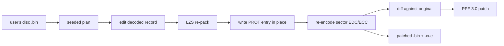

# Randomizer / disc patcher

`legaia-patcher` turns a **user-supplied** retail disc image into a modified
one. Give it a `.bin` and a seed and it rewrites gameplay data - what monsters
drop, what the chests hold, which door goes where, how hard enemies hit - and
hands back a small **PPF patch** that is safe to share. The retail game runs the
result on an emulator or a console; so does the project's own engine, which reads
the same disc.

It is a shipped part of the project, used by real players, and it is also the
strictest test of the format documentation: the retail game only boots a
re-packed record when the format is understood down to the byte.

```bash
# Shuffle drops, chests and encounters; write run.ppf plus a playable image.
legaia-patcher randomize --input "Legend of Legaia (USA).bin" --seed myrun \
    --drops shuffle --chests shuffle --encounters shuffle \
    --patch run.ppf --output patched.bin

# The recipient checks the patch against their own disc.
legaia-patcher verify --input "Legend of Legaia (USA).bin" --patch run.ppf
```

There is also a [browser build](#in-the-browser) that never uploads the disc.

## At a glance

| | |
|---|---|
| Binary | `legaia-patcher` ([`crates/patcher`](../../crates/patcher/README.md)) |
| Input | a raw Mode 2/2352 `.bin` (or the `.cue` that names it) of the USA disc, `SCUS-94254` |
| Output | a PPF 3.0 patch (default `<input>.ppf`), optionally a patched `.bin` + `.cue` and a TOML manifest |
| Reproducible | the same seed and options give a byte-identical patch |
| Game bytes shipped | none - the crate is code only, and a PPF holds only deltas against the user's own disc |
| Other discs | `randomize` and `verify` refuse a non-USA disc unless `--allow-region-mismatch` is passed |

Every edit follows one write path. Most values live inside a compressed
(Legaia LZS) stream inside a `PROT.DAT` entry, so an edit is
decompress, change, recompress, write back in place, then repair the CD sector's
error-correction bytes:



Almost every edit is **same-size in place**: it never changes a byte count, so
no sector address, PROT table-of-contents row or ISO 9660 directory record
shifts. Scene-transition doors are the one resize inside an entry, handled by
the [MAN relocation engine](../formats/man-relocation.md) within the entry's
existing footprint. The few features that need more room than their slot has
park data in the unused `DMY.DAT` annex. The image's total size never changes.

This page is the **feature and flag reference**. Two companion pages hold the
implementation detail:

- [`randomizer-internals.md`](randomizer-internals.md) - the write path
  (LZS encoder, sector write-back, PROT addressing), the code-injection arenas,
  the design of every machine-code hook, and the test catalogue.
- [`randomizer-delilas.md`](randomizer-delilas.md) - the Delilas Challenge
  dome course, the custom items, and the Delilas party swap.

The same crate also carries the [translation packs](translation/index.md) and
the manual per-record edits of the
[modding guide](../guides/modding-and-translation.md).

**Sections:** [CLI](#cli-legaia-patcher) -
[options table](#randomize-options) -
[loot and economy](#loot-and-economy) - [battles](#battles) -
[equipment](#equipment) - [arts and AP](#arts-and-ap) -
[added mechanics](#added-mechanics) - [navigation](#navigation) -
[the new game](#the-new-game) - [content and art](#content-and-art) -
[how a patch is written](#how-a-patch-is-written)

## What it can change

- **Loot** - monster item drops, treasure-chest contents, per-monster steal
  items, and an optional low-chance bonus equipment drop.
- **Fights** - random-encounter formations, monster combat stats, a global enemy
  difficulty multiplier, an experience multiplier, the Seru catch rate, enemy
  attack count, special-attack power, the element-affinity matrix and spell MP
  costs.
- **Economy** - what town stores sell, the casino prize exchange, fishing prize
  prices and the Earth Egg coin threshold.
- **Navigation** - scene-transition doors, intra-town (house / interior) doors,
  `.MAP` intra-scene teleports, and the world-map location names.
- **The party** - Tactical-Arts button combos and damage, AP costs and gains,
  equipment stat bonuses and equip masks, each character's favored weapon class,
  and the new game's starting items and level.
- **Mechanics retail has no table for**, added as machine-code hooks: experience
  for running away, enemy HP bars, charming an enemy onto your side, shiny Seru,
  Seru trading, Super Arts on the move list, and two retail-defect fixes.
- **New content** - the [Delilas Challenge](#delilas-challenge) dome course,
  three custom items, the [Delilas party swap](#delilas-party-swap), ZetaPhoenix's
  [Super Arts Pack](#super-arts-pack-by-zetaphoenix), and the unused enemies and
  items the disc ships but never surfaces.
- **Art** - replace any TIM texture with a user-authored PNG
  ([texture replacement](#texture-replacement)) or a monster's model
  ([custom monster models](#custom-monster-models)).

## In the browser

The same patcher runs client-side. `legaia_web_viewer::rom_patcher` (`patch_rom`)
compiles the crate to WebAssembly, and the site's `tooling/rom-patcher.html`
page takes a disc image, offers the randomizer passes, the tuning sliders, the
code-hook features, the Delilas features, texture replacement and translation
packs, and downloads a patched image or a PPF. The disc bytes never leave the
browser. The page's change report is spoiler-safe: a random starting-item fill
prints only the item *count*, where the CLI listing stays verbose as the offline
spoiler log. The CLI below is the scriptable path.

## CLI: `legaia-patcher`

The top-level binary turns a disc + seed into a portable patch. Every disc
argument takes a raw Mode 2/2352 `.bin` or a `.cue` sheet (resolved to the
`.bin` it references), and writing over an existing output file prints a
one-line `overwriting PATH` notice:

```bash
legaia-patcher drops     --input DISC.bin                       # read-only: monster drops
legaia-patcher chests    --input DISC.bin                       # read-only: chest contents
legaia-patcher steals    --input DISC.bin                       # read-only: steal items
legaia-patcher doors     --input DISC.bin                       # read-only: scene transitions
legaia-patcher house-doors --input DISC.bin                     # read-only: intra-town door warps
legaia-patcher map-doors --input DISC.bin                       # read-only: .MAP kind-0 teleports
legaia-patcher starting-items --input DISC.bin                  # read-only: new-game starting bag
legaia-patcher shops     --input DISC.bin                       # read-only: what town stores sell
legaia-patcher casino    --input DISC.bin                       # read-only: casino prize exchange
legaia-patcher monster-stats --input DISC.bin                   # read-only: monster HP/MP/ATK/DEF/INT/SPD
legaia-patcher move-powers   --input DISC.bin                   # read-only: special-attack power table
legaia-patcher affinity      --input DISC.bin                   # read-only: element-affinity matrix
legaia-patcher spell-costs   --input DISC.bin                   # read-only: spell MP costs
legaia-patcher equip-bonuses --input DISC.bin                   # read-only: equipment stat-bonus table
legaia-patcher monster-block --input DISC.bin --id 10 --dump m10.bin      # dump one monster's decoded block
legaia-patcher monster-block --input DISC.bin --id 10 --write m10.bin \
    --output edited.bin --patch m10.ppf                       # re-pack an edited block onto a copy
legaia-patcher tim-list    --input DISC.bin                   # read-only: catalog every texture + its coordinates
legaia-patcher tim-export  --input DISC.bin --entry 890 --offset 0x14228 -o title.png   # decode one to a PNG
legaia-patcher tim-replace --input DISC.bin --entry 890 --offset 0x14228 \
    --png edited.png --patch title.ppf                        # patch an edited PNG back (same-size in place)
legaia-patcher randomize --input DISC.bin --seed myrun --drops shuffle
legaia-patcher randomize --input DISC.bin --seed brutal --monster-stats shuffle \
    --move-power shuffle --element-affinity shuffle --spell-cost shuffle    # battle-tuning shuffle
legaia-patcher randomize --input DISC.bin --enemy-stat-scale 2                            # every enemy hits twice as hard and lasts twice as long
legaia-patcher randomize --input DISC.bin --enemy-stat-scale 0.5                          # a relaxed run: half-strength enemies
legaia-patcher randomize --input DISC.bin --enemy-stat-scale hp=3                         # spongy, not lethal: only enemy HP is scaled
legaia-patcher randomize --input DISC.bin --enemy-stat-scale attack=2,defense=0.5         # glass cannons: hit hard, fold fast
legaia-patcher randomize --input DISC.bin --enemy-attack-count 2                          # enemies land ~twice as many standard-attack hits per turn
legaia-patcher randomize --input DISC.bin --seed gear --drops shuffle --equipment-drops   # +low-chance bonus gear drop
legaia-patcher randomize --input DISC.bin --seed flee --encounters shuffle --flee-exp     # +5% experience on a successful escape
legaia-patcher randomize --input DISC.bin --seed pal --enemy-ally                         # 20% chance an enemy fights on your side
legaia-patcher randomize --input DISC.bin --seed pal --shiny-seru                         # 2% chance a capturable enemy is shiny (+35% stats / captured-Seru damage)
legaia-patcher randomize --input DISC.bin --seed swap --seru-trade                        # every merchant grows a Trade row: swap one Seru for another
legaia-patcher randomize --input DISC.bin --seed fair --jewel-fix                         # boss cinematic casts respect elemental guards
legaia-patcher randomize --input DISC.bin --seed fair --approach-softlock-fix              # dead approach animations re-stage instead of wedging
legaia-patcher randomize --input DISC.bin --seed fair --delilas-challenge                  # Muscle Dome option: a new 2-round Delilas course
legaia-patcher fishing   --input DISC.bin                                                 # read-only: list fishing-exchange prizes + prices
legaia-patcher randomize --input DISC.bin --seed fish --fishing-price 0x6F=500            # Buma Water Egg costs 500 fishing points
legaia-patcher locations --input DISC.bin                                                 # read-only: list the 16 world-map location names
legaia-patcher randomize --input DISC.bin --seed loc --rename-location "3=Ancient Fire Cave"  # rename the Ancient Wind Cave
legaia-patcher earth-egg --input DISC.bin                                                 # read-only: show the Earth Egg coin threshold
legaia-patcher randomize --input DISC.bin --earth-egg-price 25000                         # Earth Egg costs 25000 casino coins
legaia-patcher arts      --input DISC.bin                                                 # read-only: list every art's combo + damage-power tiers
legaia-patcher randomize --input DISC.bin --seed pow --arts-power RDLDL=0x0C              # power Vahn's Burning Flare down to tier 0x0C
legaia-patcher randomize --input DISC.bin --super-art-power "Tri-Somersault"=0x1A       # power Vahn's Tri-Somersault Super Art up to tier 0x1A
legaia-patcher randomize --input DISC.bin --show-super-arts                             # list a character's performed Super Arts on the in-battle Triangle menu, in AP order
legaia-patcher randomize --input DISC.bin --super-arts-pack                             # install ZetaPhoenix's Super Arts Pack: five Super Arts per character
legaia-patcher randomize --input DISC.bin --arts-ap-grant Vahn:RDLDL=10                   # Vahn's Burning Flare GRANTS 10 AP instead of costing it
legaia-patcher randomize --input DISC.bin --arts-ap-cost Vahn:RDLDL=5                     # ... or costs a flat 5 AP instead of the computed 50
legaia-patcher randomize --input DISC.bin --seed mart --shops shuffle --casino shuffle
legaia-patcher randomize --input DISC.bin --seed 0xC0FFEE --drops random \
    --encounters shuffle --steals shuffle --arts shuffle --doors shuffle --door-coupling coupled \
    --starting-items 3 --patch run.ppf --output patched.bin --manifest run.toml
legaia-patcher randomize --input DISC.bin --seed wild --encounters random \
    --unused-enemies --chests random --unused-items                  # bring back unused content
legaia-patcher randomize --input DISC.bin --seed chaos --encounters random \
    --encounter-scope world                                          # late-game monsters anywhere; over-strong fights go solo by default
legaia-patcher verify    --input DISC.bin --patch run.ppf       # apply + sanity-check
```

### What `randomize` does

`randomize` plans the run, applies it to an in-memory copy of the disc, diffs the
result against the original, and writes the changes as a **PPF 3.0** patch
(default `<input>.ppf`).

`--output` also writes a full patched `.bin` for local play, plus a matching
single-track Mode 2/2352 `.cue` beside it - some emulators reject a bare BIN
(mednafen does, on a >64 MiB image) and need the cue sheet to open it.

The seed is resolved from a number or a hashed string, and is always printed so a
run reproduces exactly. The same seed yields a byte-identical patched image and
PPF.

`--dry-run` reports the plan without writing. `--manifest` writes a small TOML
record of the seed, options, and change counts - it embeds no game bytes, so it
is safe to share.

`randomize` and `verify` **refuse a non-USA disc**: every offset and code hook
targets the USA build (SCUS-94254), and a USA-built patch "applies" to a PAL
disc (SCES_019.44/.45/.46) but produces a corrupt hybrid. `verify` prints the
detected `disc:` label; `--allow-region-mismatch` overrides the guard when you
know the patch was built for that exact disc.

### `randomize` options

These passes take a **mode**: `shuffle` (permute the existing population -
the multiset is preserved), `random` (draw each slot from the valid pool), or
`none`.

| Mode option | Reassigns | Detail |
|---|---|---|
| `--drops` | monster item drops | [Equipment drops](#equipment-drops) |
| `--encounters` | random-encounter formations | [Random encounters](#random-encounters) |
| `--chests` | treasure-chest contents | [Treasure chests](#treasure-chests) |
| `--shops` | what town stores sell | [Town shops](#town-shops-what-stores-sell) |
| `--casino` | the casino prize exchange | [Casino prize exchange](#casino-prize-exchange) |
| `--steals` | per-monster steal items | [Steal items](#steal-items-evil-god-icon) |
| `--arts` | Tactical-Arts button combos | [Arts button combos](#arts-button-combos) |
| `--doors` | scene-transition exits | [Doors](#doors-scene-transitions) |
| `--monster-stats` | enemy combat stats | [Monster combat stats](#monster-combat-stats) |
| `--move-power` | special-attack power | [Special-attack power](#special-attack-power) |
| `--element-affinity` | the element-affinity matrix | [Element-affinity matrix](#element-affinity-matrix) |
| `--spell-cost` | spell MP costs | [Spell MP costs](#spell-mp-costs) |
| `--equip-bonus` | equipment stat bonuses | [Equipment stat bonuses](#equipment-stat-bonuses) |
| `--equip-mask` | who can equip each item | [Equip mask](#equip-mask-who-can-equip-what) |

The monster-stats / move-power / element-affinity / spell-cost passes are the
**battle-tuning** group; `--equip-bonus` and `--equip-mask` edit the equipment
table's stat tuple and equip mask respectively (disjoint bytes, so they compose).

**Code-hook features.** Each of these injects a same-size machine-code hook into
the retail executable to add behaviour the game has no table for. They are off
unless asked for:

| Option | Effect | Chance option | Detail |
|---|---|---|---|
| `--equipment-drops` | one extra random equipment piece per battle, on top of `--drops` and never disturbing it | `--equipment-drop-chance N` (default 5) | [Equipment drops](#equipment-drops) |
| `--enemy-hp-bar` | a red HP gauge and numeral over every living monster in battle | - | [Enemy HP bars](#enemy-hp-bars) |
| `--flee-exp` | a successful escape banks a slice of the fled fight's experience | `--flee-exp-pct N` (default 5) | [Run-away EXP](#run-away-exp) |
| `--enemy-ally` | a random enemy is charmed onto the party's side as an uncontrolled ally (multi-enemy fights only) | `--enemy-ally-pct N` (default 20) | [Enemy ally (charm)](#enemy-ally-charm) |
| `--shiny-seru` | a capturable enemy spawns shiny: +35% stats, and its captured Seru deals +35% damage forever | `--shiny-pct N` (default 2) | [Shiny Seru](#shiny-seru) |
| `--seru-trade` | vendors swap one of a character's seru for another, reseeding every two in-game hours | `--seru-trade-offers N` caps offers per vendor | [Seru trading](#seru-trading) |
| `--jewel-fix` | the boss cinematic casts (Xain, Cort, the Delilas trio) respect elemental guards like every other special | - | [Jewel fix](#jewel-fix) |
| `--approach-softlock-fix` | a monster whose approach animation dies mid-walk is re-staged and resumes walking instead of parking the battle forever (the "endless camera orbit") | - | [Approach-softlock fix](#approach-softlock-fix) |
| `--delilas-challenge` | a fourth Muscle Dome enrollment option: a new 2-round arena course (Che & Lu double-team, then Gi; a clear pays 5000 coins + a Honey); unlocks after the Koru event | - | [Delilas Challenge](#delilas-challenge) |
| `--delilas-party V,N,G` | play as the Delilas siblings: the party wears Gi / Lu / Che battle models (any permutation over Vahn, Noa, Gala) while the ravine duels + dome Master legs field Vahn / Noa / Gala models | - | [Delilas party swap](#delilas-party-swap) |
| `--delilas-arts-voice MODE` | with the swap: what the arts shout AND Super/Hyper fanfare banks carry - `original` (default; the retail hero shouts stay), `adjusted` (re-voiced toward the siblings), `removed` | `original` | [Delilas party swap](#delilas-party-swap) |
| `--delilas-moves MODE` | with the swap: whose animations the hero's Tactical Arts play - `hybrid` (default; only the signature Hyper is the sibling's), `delilas` (whole art archive rebuilt from the sibling's clips, arts renamed, non-essential arts hidden) | `hybrid` | [The Delilas move set](randomizer-delilas.md#the-delilas-move-set) |
| `--custom-items` | inject three brand-new items (Nature's Elixir / Ra-Seru Tear / Fury Bloom) into cut item slots; `random` drop/chest/steal modes add them to the fill pool, and with `--delilas-challenge` they replace the Honey clear reward | - | [Custom items](randomizer-delilas.md#completion-reward---a-honey-or-three-custom-items) |
| `--fishing-price ITEM=POINTS` | set the fishing-exchange point cost of a prize (e.g. the Buma Water Egg); the price also gates when the prize appears | repeatable / comma-separated | [Fishing prize prices](#fishing-prize-prices) |
| `--rename-location INDEX=NAME` | rename a world-map location (save / load / pause + quick-travel menu), e.g. an element cave to match a re-elemented party | repeatable | [Location names](#location-names) |
| `--earth-egg-price VALUE` | set the casino-coin threshold to obtain the Earth Egg (Sol Tower Prize Counter; retail 100000), gate + debit together | single value | [Earth Egg coin threshold](#earth-egg-coin-threshold) |
| `--arts-power COMBO=VALUE` | rebalance a Tactical Art's per-strike damage-power bytes, targeted by input combo (`RDLDL=0x16`); `VALUE` is a power tier `0x0C..=0x1F` or `0` to disable | repeatable / comma-separated | [Arts damage power](#arts-damage-power) |
| `--super-art-power NAME=VALUE` | the same rebalance for a **Super Art**, targeted by name (`"Tri-Somersault"=0x1A`); Super Arts carry no combo, no arts-table row and no AP cost of their own, so name is their only key | repeatable / comma-separated | [Super Art damage power](#super-art-damage-power) |
| `--show-super-arts` | list a character's Super Arts on the in-battle Tactical-Arts list, which retail never draws: once performed, sorted in by AP, with name, chain AP and the arrows you type; mutually exclusive with `--shiny-seru`, the arts AP overrides and `--delilas-challenge` | flag | [Show Super Arts](#show-super-arts-on-the-in-battle-move-list) |
| `--super-arts-pack` | install the **Super Arts Pack by ZetaPhoenix**: fifteen extra Super Arts, five per character, each with its own name, hit count and animation; his block and hook words are installed byte-for-byte, parked in the `DMY.DAT` annex and streamed to `0x801FD000` at battle load. Ships with the author's name-banner fix. Mutually exclusive with `--shiny-seru`, `--show-super-arts`, the arts AP overrides and `--delilas-challenge` | flag | [Super Arts Pack](#super-arts-pack-by-zetaphoenix) |
| `--arts-ap-grant [CHAR:]COMBO=AMOUNT` | make a Tactical Art **grant** `AMOUNT` AP (Spirit, clamped at 100) instead of costing it, admitting it at any AP level; a code hook into the party arts queue-builder. Keyed per (character, arts row). Mutually exclusive with `--shiny-seru` | repeatable / comma-separated | [Arts AP override](#arts-ap-override) |
| `--arts-ap-cost [CHAR:]COMBO=AMOUNT` | set what a Tactical Art **costs** in AP (`1..=100`), replacing retail's computed cost. Same hook, same keying, same exclusivity; the art's menu AP number is rewritten to match | repeatable / comma-separated | [Arts AP override](#arts-ap-override) |
| `--spirit-ap AP` | set how much AP the Spirit command charges into the battle gauge (retail 32): `0` = defence boost only, `100` = one press fills the gauge, negative = Spirit drains the gauge | single value -100..=100 | [Spirit AP](#spirit-ap) |
| `--damage-ap AP` | set how much AP taking damage charges into the battle gauge, per 100% of max HP lost (retail 100): `0` = damage never feeds the gauge, negative = being hit drains it | single value -200..=200 | [Enemy-damage AP](#enemy-damage-ap) |
| `--oscillating-ap [DAMAGE_PCT]` | every battle, deal each Tactical Art at random onto the **cost** side (retail) or the **grant** side (castable at any AP, gives its AP back, deals `DAMAGE_PCT` percent of its damage); re-rolled per art per battle, and the in-battle arts list shows a grant-side art as `0` AP. Mutually exclusive with every other arena feature | single value 0..=100, default 20 | [Oscillating AP costs](#oscillating-ap-costs) |
| `--enemy-stat-scale MULT`, `STAT=MULT,...` or `GROUP:SCALE\|...` | scale enemy combat stats (HP / MP / ATK / UDF / LDF / INT / SPD), story bosses included; one number scales all seven, a `stat=mult` list scales only what it names, and a `regular:`/`boss:` split gives random encounters and set-pieces their own scale. Nothing moves between monsters, and EXP / gold / drops are untouched | each value 0.1..=5 | [Enemy difficulty scale](#enemy-difficulty-scale) |
| `--exp-scale MULT` | scale every monster's base EXP reward - the victory payout, its party split and the `--flee-exp` grant all read the scaled field; gold and drops stay retail | 0.1..=5 | [Experience multiplier](#experience-multiplier) |
| `--seru-catch-rate PCT` | override every capturable Seru's catch chance with one flat percent (the odds a killing blow absorbs its magic; retail 1..=80% per monster); only the 63 capturable records are touched | 0..=100 | [Seru catch rate](#seru-catch-rate) |
| `--enemy-attack-count MULT` | scale how many hits enemies land with their standard attacks - divides each attack entry's AGL price so the per-round AGL gauge affords proportionally more (or fewer) strikes; a retail attacker always keeps at least one hit per turn | 0.1..=5 | [Enemy attack count](#enemy-attack-count) |

**Tuning the encounter and door passes:**

| Option | Meaning |
|---|---|
| `--encounter-scope` | Pool an encounter roll draws from: `scene` (default), `kingdom`, or `world`. |
| `--no-solo-strong-encounters` | Opt out of the solo-strong pass, which is **on by default whenever `--encounters` is set**: it forces an over-strong randomized fight down to a lone enemy. See [Random encounters](#random-encounters). |
| `--solo-strong-threshold N` | Cut-off for "over-strong", as a percent of the area's native average (default 200). |
| `--door-coupling` | `coupled` (default, bidirectional) or `decoupled` (one-way). |

**Seeding the new game.** `--starting-items N` seeds `N` random consumables
(0 = vanilla). The random fill shares a **seven-slot capacity** with the
convenience toggles below, additively - five slots with `--all-warps`. See
[Starting-bag convenience toggles](#starting-bag-convenience-toggles).

| Option | Meaning |
|---|---|
| `--door-of-wind [N]` | Add `N` Door of Wind, the warp consumable (default 10). |
| `--incense [N]` | Add `N` Incense, the encounter-rate consumable (default 10). |
| `--speed-chain [N]` / `--chicken-heart [N]` / `--good-luck-bell [N]` | Add those accessories (default 1 each). |
| `--start-with id[:count],…` | Seed explicit item(s) on top - any id, consumable / equipment / accessory. |
| `--all-warps` | Unlock every Door-of-Wind destination from the start. |
| `--starting-level N` | Begin at level `N` instead of 1 (0/1 = vanilla; range 2..=14). See [Starting level](#starting-level). |

**Toggles:**

| Option | Meaning |
|---|---|
| `--unused-enemies` / `--unused-items` | Re-introduce content the game ships but never surfaces. See [Unused content](#unused-content). |
| `--weapon-specialty` | Reassign which weapon class each character favors. See [Weapon specialty](#weapon-specialty). |
| `--swing-cost CHAR:ITEM[:up]=COST` / `--equip-owner ITEM=OWNERS` | Manual edits: price one Arts-bar command (a weapon, Ra-Seru arm or footwear record) for one character, or set who can equip an item. See [Equipment editor](#equipment-editor-command-costs-and-equip-owners). |

### Reading the disc without patching it

`verify` applies a PPF to a copy of the user's disc and confirms the result still
parses end to end. It is the recipient's check that a shared patch + seed match
their own disc - including the region: it prints the detected `disc:` label and
refuses a non-USA disc unless `--allow-region-mismatch` is passed (see above).

The `drops`, `chests`, `shops`, `casino`, `steals`, `arts`, `doors`,
`starting-items`, `monster-stats`, `move-powers`, `affinity`, `spell-costs`,
`equip-bonuses`, `weapon-specialty`, and `equipment` subcommands **write nothing**. They
decode the randomizable populations off the user's disc and print them, with item
ids and names resolved from the disc's own SCUS table, and chests and doors
grouped by scene via CDNAME.

`monster-block`, `monster-model` ([custom monster
models](#custom-monster-models)) and the `tim-*` family ([texture
replacement](#texture-replacement)) are the manual-edit subcommands.
`monster-block`: `--dump` LZS-decodes a
single monster's `battle_data` block (PROT 867) to a file for hex editing, and
`--write` re-packs the edited block into its fixed `0x14000`-byte slot on a
copy of the disc (`--output` / `--patch`), through the same
`DiscPatcher::patch_monster_slot` path the stat randomizer uses. The
walkthrough lives in the
[modding guide](../guides/modding-and-translation.md).

Two are worth knowing about specifically. `chests` lists the exact 275-site
treasure population the chest randomizer reassigns - the natural place to audit
for quest / key items a run might want to keep static. `doors` lists every
scene-transition exit (home scene → destination + entry tile) with its shuffle
class: walk-door (the pool) versus excluded script/cutscene-invoked or world-map
transition (see [Doors](#doors-scene-transitions)).

## Loot and economy

### Keep-static items

Progression / quest / key items are things the player needs in a predictable
place - door keys, garden-quest tools, letters, story books, one-off plot items.
The chest randomizer keeps the **full quest-item set** static by default, derived
from the disc rather than a short hand-list (`items::default_static_chest_items`
→ `item_price::quest_item_ids`): every **named, unsellable** item - the item
table prices quest/key/story items at `0`, the game's own "a shop never trades
this" marker - **minus** the handful of chest-found *equipment* pieces (the
Ra-Seru gear + Astral Sword) that ship price-0 only because they're never sold
but are real, randomizable gear.

This automatically covers every door/dungeon key, the egg/talisman/book
collectibles, the fishing rods, the casino cards, and the internal Ra-Seru
weapon-state template entries - no manual list to keep in sync with the game.
Buyable items (priced > 0, e.g. the Silver Compass accessory) are intentionally
left randomizable. A chest whose original item is in the set keeps that item, the id
is excluded from the shuffle multiset (so it can never move to another chest),
and it is dropped from the `random` fill pool (so it can't be placed into an
unrelated chest). If the item table can't be read, the randomizer falls back to
the curated `items::DEFAULT_STATIC_CHEST_ITEMS` subset. Override with
`--keep-static-items 0x9a,0x71,…` (decimal or `0xHH`), or pass an empty value
(`--keep-static-items ""`) to randomize every chest. The resolved set is recorded
in the run manifest.

Because an edit changes bytes *inside* an LZS stream, the whole touched stream
is re-packed, so the changed-byte count (and the PPF) is dominated by
re-compression churn, not by the gameplay delta - this is inherent to editing
compressed data, and every edit stays same-size. `--drops random` reads the SCUS
item table off the disc for the valid item pool; the other modes need no
external table.

### Equipment drops

`--equipment-drops` is **additive**: it grants one *extra* random piece of
equipment on a low per-battle chance (`--equipment-drop-chance N`, default 5%),
on top of the normal drop, which it never touches. A monster record has a single
drop slot, so no data edit can make a monster drop two things; the feature
patches the executable's reward routine instead. Every gameplay preset of the
in-browser patcher enables it; only "Vanilla" leaves it off.

Hook design: [internals](randomizer-internals.md#equipment-drops).

### Treasure chests

A chest gives its item via the field-VM **`GIVE_ITEM` opcode `0x39`**, encoded
`[0x39, item_id]` - the item id is a **single inline operand byte** in the
per-scene field-VM script bytecode, not a per-scene table. (Pinned in the
dispatcher `FUN_801DE840` case `0x39` at `0x801E0448`: inventory-window setup
`FUN_8004313C` then add-by-id `FUN_800421D4(item_id, 1)`, PC += 2. The routine
printed `FUN_801D71F0` is not an add-item copy - it is the field overlay's
unreferenced per-slot equip applier `FUN_801E5A08` under a mis-based VA, and
its `FUN_800421D4` call is a refund. See
[script-vm.md](../subsystems/script-vm.md).) The give sites live in the MAN
partition-1 per-actor interaction scripts (a chest is an interactable actor).

`chest::give_item_sites` finds them with a **dialogue-skipping opcode-aware
walk** - it walks each partition-1 record's interaction script from its true
entry PC with the field-VM disassembler ([`legaia_asset::field_disasm`], moved
into Track 1 for exactly this reuse). A chest's give op almost always sits
**after** the inline dialogue that announces it ("There is a {item} in the
treasure chest!" → give → "{name} now has the {item}!"). That dialogue is a
stream of `0x1F`-lead glyph segments, not bytecode, so a decode error **at a
`0x1F` byte** is treated as a segment to skip (advance past `0x1F`, consume
glyphs to the terminating `0x00`, with `0xC?` top-nibble bytes as 2-byte
escapes per the dialog box-pack format), and decoding resumes - the
inter-segment control bytes (`0x24`/`0x25`/`0x48` Nop, `0x26` `JMP_REL`, `0x36`
`SCENE_FADE`, …) are genuine ops that stay in sync, so the walk reaches the
post-dialogue `0x39`. Any **other** decode error stops the walk, and each
record's walk is bounded to the next record's start offset, so it can never run
off into unrelated data and mis-read a `0x39` data byte as an op - never a naive
`0x39` byte scan. (An earlier walk stopped at the *first* `0x1F` instead of
skipping it, which silently missed the post-announcement give in roughly 85% of
sites - including every chest in a scene whose first interactable record opens
with dialogue, such as `keikoku`.) Multi-`0x39` runs are genuine multi-item
gifts (a 10× consumable chest, the fishing starter kit of a rod + several lures,
the Genesis-Tree Ra-Seru equipment sets), each `0x39 <id>` its own op.

**Display vs grant - the announcement names the item from a different byte.** A
chest's flavor text ("There is a {item} in the treasure chest!" / "{name} now has
the {item}!") renders the item *name* from a dialogue **item-name token** `0xC2
<id>`, which is a **separate byte** from the `0x39` give operand that actually
adds the item to the bag. Patching only the give operand grants the new item but
leaves the message reading the old one - verified in-game: the inventory receives
the new item while the chest still *says* the original (an `0xC2 <old_id>` token
sits resident in the loaded MAN right beside the patched `0x39 <new_id>`). Pinned
across the corpus: of every `0xC?` 2-byte dialogue escape in chest records, only
`0xC2`'s argument matches the give operand (the other escapes are character-name /
glyph controls), and 241 of 275 sites carry one (announcement + "now has"). So
`give_sites_and_display_tokens` recovers, per give site, the `0xC2` token offsets
in the same record whose id equals that site's give operand (routed to the
*nearest* give so multi-item-gift records map each token correctly), and
`SceneChests::set_site` rewrites the operand **and** those tokens together - flavor
text stays in sync with the grant. Sites whose dialogue doesn't name the item
(~34) simply have no token to sync.

Chest item ids are global inventory ids, so `apply::randomize_chests` reassigns
them **globally** across every site (`Shuffle` redistributes the existing
multiset, `Random` draws from the valid item pool), then recompresses each
touched MAN like the encounter path. A scene whose recompressed MAN overflows is
excluded from the shuffle pool entirely (determined iteratively), so its items
neither leave nor enter circulation and `Shuffle` preserves the global multiset
exactly. On the retail disc this is 275 give sites across 50 scenes (one scene,
too tight to re-pack, is skipped).

### Town shops (what stores sell)

A gold merchant's stock is **inline in the scene's field-VM script** (the MAN),
the same place chests and doors live - *not* a global table. Opening a shop is
field-VM **op `0x49` (`STATE_RESUME`)**, the multi-frame state machine that
drives the menu-request register `_DAT_8007B450`. Its sub-op-`0` inline payload,
for a shop, is `[u8 count][count× u8 item_id][ASCII name\0]` followed by the
shop's `0x1F` dialogue ("Welcome!", "Thank you!"). This was pinned from a live
PCSX-Redux capture standing in the Rim Elm Variety Store - its 10 item ids match
the curated [shop table](../reference/gamedata.md).

`shop::SceneShops` finds sites by **scanning** the decompressed MAN for the
op-`0x49` sub-op-`0` shop signature - *not* by an opcode walk. A shop's `0x49` is
often gated behind a dialogue confirm-picker ("Buy them?") whose option-jump
table desyncs a linear disassembler before it reaches the op (Biron Monastery's
Corey vendor is the case that exposed this), so a walk silently misses those
shops. The scan doesn't care how the script reaches the op; false positives are
ruled out by strict record validation: the byte after the opcode must be `0x00`
(sub-op 0 - this alone rejects almost every stray `0x49`), the count is small and
non-zero, every id is non-zero, and the trailing shop name is a printable,
letter-initial, `0x00`-terminated string. The apply layer additionally passes a
SCUS "id names a real item" mask (`locate_with_items`), so an id that names
nothing can't anchor a false shop. `apply::randomize_shops` then reassigns the
item-id bytes **globally** across every town shop (`Shuffle` redistributes the
existing shop-item multiset, `Random` draws from the **sellable pool**),
same-size, and recompresses each touched MAN like the chest path.

**No quest items; chest gear gets a price.** The sellable pool is "items the game
prices `> 0`" (`item_price::sellable_pool`, read from the item table's per-record
price - `u16` at record `+2`, base `0x80074368`; see
[item-table.md](../formats/item-table.md)). Quest / key / story items all ship at
price `0`, so this automatically keeps them out of shops - no hand-maintained
exclusion list. The flip side is that a handful of genuinely-equippable items are
normally *only found in chests* and so also ship at price `0` (the Ra-Seru
weapon/armor/shoe set + Astral Sword); `randomize_shops` first prices those
(`item_price::CHEST_EQUIPMENT_PRICES`, ~28800–55000 gold, approximated from the
nearest priced gear of the same type) with a same-size SCUS edit, so they're
non-free and part of the sellable pool. On the retail disc this is
34 shops (picker-gated vendors, duplicate scene clusters and per-story-phase
shop records included). `--shops shuffle|random`; read-only
`legaia-patcher shops` lists every shop's stock.

### Casino prize exchange

The **casino** prize list (redeem coins for prizes) is a different mechanism from
the gold town shops: it is a **static table** in the menu overlay's data segment
(`DAT_801e4518`), and it debits the casino **coin** bank (`_DAT_800845A4`), not
gold - which is how it's told apart from a gold merchant. It lives in **PROT
entry 899** (`0899_xxx_dat`, stored raw), file offset `0x15D00` (VA `0x801E4518`
under the overlay data-segment load base `0x801CE818`), as four `0x60`-byte
blocks of 8-byte `[u16 item_id][u16 story-gate][u32 coin-price]` records (the
high-value prizes carry a non-zero gate that locks them behind casino
progression). `casino::CasinoExchange` shuffles / randoms the whole records (so a
prize keeps its coin price and progression gate wherever it lands), a same-size
raw edit with no LZS. `--casino shuffle|random`; read-only `legaia-patcher casino`.
At runtime the prize-exchange UI is a menu-overlay session: it runs at
`game_mode 0x17` (the CARD/menu pair) with PROT 0899 resident in slot A, the
same hosting as the pause menu and the gold shop (see
[`subsystems/shop.md`](../subsystems/shop.md)).

### Steal items (Evil God Icon)

What the player steals from a monster (Evil God Icon equipped) is a per-monster
entry in a **static `SCUS_942.54` table** at `DAT_80077828` - `[steal_chance_pct,
steal_item_id]` per 1-based monster id, item at `+id*2+1` (see
[steal-table.md](../formats/steal-table.md)). It is **not** in the PROT 867
record. Because it's a plain executable table, an edit is the simplest of the
four: a single same-size byte overwrite of the item, applied straight to the
SCUS file via `DiscPatcher::patch_named_file` (the non-PROT sibling of
`patch_prot_entry`, built on `legaia_iso::write::patch_file_logical`). No LZS
re-pack, no overflow, so nothing is ever skipped. `apply::randomize_steals`
reassigns the item for every stealable monster (`Shuffle` redistributes the
existing steal-item multiset, `Random` draws from the valid item pool) and
**preserves each monster's steal chance** - the item changes, the rate doesn't.
On the retail disc 189 monsters are stealable. `legaia-patcher steals` lists the
current table (the audit surface).

### Fishing prize prices

The fishing minigame's prize counters (the **Buma** and **Vidna** ponds) sell
accessories and consumables for **fishing points** rather than gold. Each prize
is a 12-byte row `[u32 limit][u32 price][u32 item_id]` in the raw fishing
overlay (PROT entry **972**, `legaia_asset::fishing_exchange`). `--fishing-price
ITEM=POINTS` sets the `price` of every row granting `ITEM` (id in decimal or
`0xHH`) - e.g. `--fishing-price 0x6F=500` drops the Buma Water Egg from 20,000
to 500 points. The price is **both** the point cost and the "only appears once
you can afford it" gate (the top prize row is hidden until `price < points`), so
lowering it also makes the prize show up sooner. PROT 972 is a raw overlay, so
each edit is a same-size in-place `u32` write - no recompression. Multiple
prizes can be set at once (comma-separated or by repeating the flag), and
`legaia-patcher fishing` lists the current prizes and prices (with names). In
the browser patcher, the same edits live in the **Manual value edits** group as
`item=points` pairs.

> Verified by the `fishing_price_real` disc oracle: the Buma Water Egg row is at
> the parser's coordinate (PROT 972, offset `0x9874`, 20,000 points), a price
> edit lands as a same-size `u32` at exactly the targeted `price` fields, the
> patched overlay re-parses with the new price, re-applying the same value is a
> no-op, and an item no prize grants is refused.

### Earth Egg coin threshold

The **Earth Ra-Seru Egg** is *not* a row in the four-block casino prize table
([casino prize exchange](#casino-prize-exchange)); it is a **bespoke scripted exchange** in the
`koin1` scene's field-VM script (the MAN, retail PROT entry **543**). The Sol
Tower "Prize Counter" offers it only once the casino-coin bank clears a
threshold, then gives item `0x6E` and debits the coins. Two verified literals
drive it: the **gate** is a field-VM op-`0x4E` INVENTORY_CMP sub-op 11 (coin u32
compare) whose value is retail **99999** (`coins > 99999`, i.e. `>= 100000`),
and the **debit** is an op-`0x4C` nibble-E sub-5 add-coins of `-100000`. Retail
keeps `gate = price - 1`, `debit = price`.

`--earth-egg-price VALUE` sets both together so the repriced egg stays coherent
(require `VALUE` coins, remove exactly `VALUE`); `VALUE` is the coins required,
range `1..=8388608` (the debit is a signed 24-bit field). The threshold and
debit are same-size value swaps in the decompressed MAN, which is LZS-recompressed
and written back in place (the `koin1` MAN is zero-slack, but the re-packer fits
it). `legaia-patcher earth-egg` prints the current value. In the browser patcher
the field lives in the **Manual value edits** group.

> Verified by the `earth_egg_real` disc oracle: the gate is located in PROT 543
> at the retail shape (coins 100000 / gate 99999 / debit 100000, item `0x6E`,
> `GIVE_ITEM 0x39 0x6E` present); a price edit re-decodes to `gate = value - 1`
> and `debit = value`, changes only the threshold-half and debit bytes in the
> decompressed MAN, keeps every neighbouring descriptor + the touched sector
> EDC/ECC-valid, refuses `0` / over-range, and is a no-op on re-apply.

## Battles

### Random encounters

Formations live in the per-scene MAN asset (type `0x03`, descriptor index 2 of a
scene bundle), inside an LZS stream; each formation record is
`[3 reserved][u8 count 0..4][u8 ids...]` (see
[encounter records](../formats/encounter.md)). `apply::randomize_encounters`
walks every PROT entry, and for each scene bundle it locates the MAN
(`SceneEncounters::locate`, straight from the entry bytes - no engine
dependency), decompresses it, rewrites the formation monster ids
(`Shuffle` redistributes the existing ids, `Random` draws from the pool),
recompresses, and writes the stream back over the original (the LZS decoder
stops at the descriptor's decompressed size, so a same-or-shorter re-pack is
safe). The id pool is **per scene** - only ids the scene already uses - so every
swapped-in monster is one the scene loads; no missing model, no crash.

**A scene's MAN arrives two ways, and the sweep walks both.** The common carrier
is the bundle descriptor above. The other is a raw type-3 chunk of a
`DATA_FIELD` streaming entry, which is how the v12-family dungeons ship theirs -
`rikuroa`, `rikuroa2`, `dolk2`, `rayman`, `station`, `balden2`, `ropeway2`,
`taiku`, `taiku2`, `doman`, `nilboa2`, `edbalden`, `eddoman`. Mt. Rikuroa has no
bundle MAN anywhere in its CDNAME block, so a bundle-only sweep leaves that
dungeon's enemies exactly as authored however wide the pool is set.
`SceneEncounters::locate_streaming_mans` is the second locator; a block that
carries both gets both, because the streaming one is a story-state variant of
the same scene and leaving it vanilla makes a randomized dungeon revert to
retail enemies once the flag selecting that variant is set. A chunk payload is
stored uncompressed, so its rewrite is same-size by construction and needs no
re-pack; a chunk whose declared size runs past the entry end (the
`DataFieldTruncated` tail the runtime extends by streaming DMA continuation) is
skipped rather than clamped.

**Chests use the same two carriers.** `apply::current_chests` and the chest
shuffle walk the bundle MAN and every streaming-chunk MAN, so the v12-family
dungeons' loot joins the pool - Mt. Rikuroa's seven chests, Mt. Balden 2's
twenty-four, and the rest of the set listed above. `set_site` swaps the
`GIVE_ITEM` operand and its `0xC2 <item_id>` name escapes, all single bytes, so
a raw-carrier rewrite is same-size like the formation one.

A site whose granted id **names no item** is dropped from the population rather
than shuffled. The give-site walk is structural - it recognises the op and takes
its operand - so on a carrier the bundle sweep never reached it can surface an
id outside the item table. Randomizing one is wrong under either reading: a
false positive would corrupt script bytes, and a genuine grant of an unused slot
would donate a nameless item into a real chest. The mask is the SCUS item table's
"has a name" column, not the shop pass's "has a price" - a chest legitimately
grants unsellable quest items.

**Bosses are protected.** A scene's formation array mixes random encounters with
*scripted* fights the field VM engages by explicit index - boss battles (the Rim
Elm Tetsu tutorial, Cort, Songi, …) and story encounters. Only the genuinely
random formations are touched: the encounter section's region records each name
a `[formation_range_base, +count)` slice **and** a `rate_increment` (the per-step
amount added to the encounter counter inside that region's AABB), and a region
with `rate_increment == 0` never triggers an encounter, so it can reference a
formation without ever rolling it. `SceneEncounters` marks a formation random iff
some **`rate_increment > 0`** region reaches it (the retail position-aware roll
`FUN_801D9E1C`); formations reached only by rate-0 regions (or no region) are
left byte-identical. town01 is the canonical case - its rate-0 regions cover
formations 2..=4, but the only rate>0 regions reach 0..=2, so Tetsu at index 4 is
correctly left alone. The candidate pool for `Random` is likewise the random
formations' ids only, so a roll never drops a boss into an ordinary encounter.

**An explicit id guard backs the heuristic.** The region-rate test classifies
every story boss's formation as scripted with one exception: the early **Gimard**
Seru-boss fight sits at a formation index a rate>0 region's range happens to span,
so the heuristic alone would treat it as random - and a roll could then replace
that mandatory tutorial fight (stranding a fresh save) or donate Gimard, a
boss-tier enemy, into an ordinary early encounter. `encounter::PROTECTED_FORMATION_IDS`
lists the ids that must never be a random encounter (Gimard, id 10); `locate`
forces any formation holding one back to scripted, and such ids never enter a
donor pool, so the fight ships exactly as authored regardless of the region
layout. (The first wild Piura are deliberately not listed - they are genuine
random encounters.) This mirrors the stat-side guard
(`monster_stats::PROTECTED_MONSTER_IDS`, which also pins Gimard) and is validated
on a real disc by `tests/encounter_patch_real.rs`
(`protected_formations_survive_every_encounter_mode`).

**Pool scope (`--encounter-scope`).** By default the pool is per scene, but
`apply::randomize_encounters_scoped` widens it to one of three
[`EncounterScope`] settings:

| Scope | Pool a scene draws from | Effect |
|---|---|---|
| `scene` (default) | the scene's own monsters | classic; difficulty stays local. |
| `kingdom` | every monster in the scene's **kingdom** (Drake / Sebucus / Karisto) | "within a region": late Drake monsters can appear in early Drake, but nothing crosses a kingdom boundary. |
| `world` | every monster on the disc | "across regions": a late-game Karisto monster can appear in the opening Drake caves. |

The kingdom partition is derived from the disc's own `CDNAME.TXT`, never a
hardcoded scene list: the three overworlds (`map01` / `map02` / `map03`) are
pinned world-map bundles, so **Sebucus begins at the first CDNAME block after
`map01`, Karisto at the first after `map02`** (Karisto absorbs the dungeons
listed after `map03`). See [`kingdom`](../../crates/patcher/src/kingdom.rs).
`kingdom` scope needs `CDNAME.TXT`; `world` does not. The wider pools rely on the
battle loader streaming a monster's archive slot on demand by id, so an
out-of-area enemy still loads and renders.

`Random` fills each scene's slots independently from its scope pool. `Shuffle`
conserves the scope-wide id **multiset** - it pools every random-encounter id in
the scope, permutes it once, and redistributes it across the scope's scenes, so
monsters move between scenes (and, for `world`, between kingdoms) while the
overall monster census is unchanged. Because a cross-scene shuffle is only
multiset-preserving if every shuffled scene is actually written back, any scene
whose recompressed MAN overflows its footprint is *locked to its original* and
the rest are reshuffled (a fixpoint), so a re-pack skip never duplicates or drops
a monster. Every scope×mode combination is byte-deterministic for a fixed seed
and validated on a real disc by `tests/encounter_scope_real.rs` (kingdom
confinement, cross-kingdom mixing under `world`, per-scope multiset conservation,
boss survival, EDC/ECC validity).

**Solo strong fights (on by default; `--no-solo-strong-encounters` opts out).**
The wider scopes can drop a late-game heavy hitter into an early area; left as a
pack of 2+ that is a soft-lock. `apply::randomize_encounters_full` adds a
`SoloStrongConfig` pass - applied to **every** CLI encounter run unless opted out
- that forces any such fight to a **single** enemy. It runs as a post-step over
the already-randomized scenes, so it composes with every scope×mode without
touching their multiset bookkeeping (and `solo == None` reproduces the prior
output byte-for-byte - the archive isn't even read):

- Each monster is scored by its **combat-stat budget**
  (`monster_stats::combat_power` - the sum of every combat stat except MP, which
  gates the AI spell economy rather than raw danger), built once into a
  `MonsterPowerTable` keyed by the formation byte (the 1-based `battle_data` id).
- Each scene's **native baseline** is the mean power of its *original* random
  monsters (`SceneEncounters::baseline_power`, captured before randomizing) - the
  area's authored difficulty, the stand-in for "how strong the party is here".
- `SceneEncounters::enforce_solo_strong` collapses every multi-monster random
  formation whose strongest member clears `threshold_pct`% of that baseline
  (default `200` = twice the area's norm): keep the strongest monster in slot 0,
  zero the rest, set `count := 1`. The count byte and dropped id bytes all live
  inside the formation record's fixed stride, so it stays a same-size in-place
  edit; a scene whose collapsed MAN no longer re-packs is skipped, like the rest.

Scripted/boss formations are never eligible (same `is_random_formation` gate), so
this only ever thins a *random* pack. Validated on a real disc by
`tests/solo_strong_encounter_real.rs`: a World-scope random pass produces strong
packs without the option and **zero** with it, non-vacuously, deterministically,
and EDC/ECC-valid. On by default in the web Balanced / Full Chaos presets.

**Battle-load safety cap (unconditional).** Two retail engine limits bound what
a formation may hold, and retail authoring satisfies both everywhere - a
kingdom/world-scope pass can violate both (see the
[heap-budget + species-rebuild sections of `battle.md`](../subsystems/battle.md#the-battle-heap-budget---why-a-formation-of-large-distinct-bosses-cannot-load)):

- **At most 2 distinct species per formation.** The battle setup
  `FUN_80055B6C` species-order rebuild holds "the other species" in a single
  register; a third distinct species is silently dropped-and-duplicated
  (`[a,b,c]` loads as `[c,c,a]`) on half of all rolls, and on the other half
  all three decoded blocks stream.
- **A bounded distinct-species heap cost.** The battle heap's malloc is
  unchecked; a formation whose distinct blocks (each costing its decoded
  `block[+0x08]` bytes) exceed the workable budget writes the decoded block
  over kernel RAM - a silent hang at battle load. Reproduced live on a
  balanced-preset disc: three kingdom-shuffled trios at 169-180 KB each froze
  or heap-exhausted, where the disc's authored maximum (~124 KB) always loads.

`randomize_encounters_full` therefore always runs
`SceneEncounters::enforce_species_limits` as its last post-pass, over **both**
MAN carriers: any random formation with more than 2 distinct species or a
distinct-species cost above the disc's own authored maximum
(`apply::battle_load_budget` - self-calibrating, read before any edit) has its
costliest species merged into its cheapest until both limits pass. Monster
count is preserved, no new id enters a scene, scripted/boss formations are
never touched, and the pass is a no-op unless the randomization itself
manufactured a violating formation. Reported as `battle_load_capped`;
validated on a real disc by `tests/encounter_battle_load_cap_real.rs`
(authored tables satisfy both limits; a guard-free kingdom shuffle violates
them; the full pipeline leaves zero violations, EDC/ECC-valid and
seed-deterministic).

### Monster combat stats

`--monster-stats` redistributes every enemy's combat stats across the
`battle_data` archive (PROT 867). Each monster's record carries its stats as
`u16` halfwords at fixed offsets in the decoded block (HP `+0x0C`, MP `+0x10`,
then ATK / UDF / LDF / INT / SPD; see
[battle-data-pack.md](../formats/battle-data-pack.md) and the
[monster stat-record archive](../formats/battle-data-pack.md) docs). The
randomizer works **column-wise**: it collects each stat field across the whole
populated roster, then `Shuffle` permutes that column (a 1:1 reassignment, so
the multiset of, say, every monster's HP is exactly preserved - the overall
difficulty budget stays put, only *which* monster is tanky changes) while
`Random` draws each cell from the column pool. The AGL action gauge (`+0x0E`) is left
alone, since it gates the AI's action economy rather than player-facing
difficulty. Each edit re-packs the monster's slot through the same
decompress → edit → recompress path as the drop randomizer
(`monster::repack_slot`); the decoded length is unchanged, so every slot keeps
its `0x14000`-byte footprint (a slot too tight to re-pack is skipped, as with
drops). `legaia-patcher monster-stats` lists the current stats.

A set of scripted enemies (`monster_stats::PROTECTED_MONSTER_IDS`) is excluded
from the pass entirely - both as a source and a target - so each keeps its
original stats and never donates them to another monster. Two kinds qualify. The
**early tutorial enemies** (the Rim Elm sparring partner and the first wild
Piura): the sparring fight is unwinnable by design and has no game-over branch,
so a hard-hitting attack could one-shot the party and soft-lock a fresh game, and
the early wild enemies are fragile by design. The **story bosses** (Gimard,
Caruban, Zeto, Songi, Berserker, Tetsu, Dohati, Xain, the three Delilas, Gaza,
Zora, Jette, Cort - every version of each): their set-piece fights are tuned around
scripted HP/phase triggers, so scrambling their stats can make a mandatory fight
unwinnable, and leaking a boss's extreme stats onto a trash mob would wreck
balance. This is the stat-side companion to the encounter randomizer already
leaving those formations scripted. Under `Shuffle` the column multisets are still
exactly preserved (the pinned values are conserved in place).

### Enemy difficulty scale

`--enemy-stat-scale` is the same seven halfwords as
[monster combat stats](#monster-combat-stats) above, edited a different way:
instead of moving values between monsters it multiplies every monster's stats by
a factor, `0.1x`..`5x` (retail `1`). Nothing is redistributed, so each monster
keeps its own profile and its rank against the rest - the whole difficulty curve
moves up or down together. It is **seedless**: a given setting always produces
the same bytes.

The flag takes three spellings, and they are one feature rather than three -
each is the previous one widened:

- **Uniform** - a bare multiplier. `--enemy-stat-scale 2` doubles the roster's
  HP, MP, ATK, both defenses, INT and SPD; `0.5` halves them. This is the whole
  difficulty dial in one number.
- **Per-stat** - a `stat=mult` list, comma- and/or space-separated. Only the
  named stats move; everything else stays at its disc value.
  `--enemy-stat-scale hp=3` makes enemies spongy without making them lethal;
  `--enemy-stat-scale attack=2,defense=0.5` makes them glass cannons.
- **Per-group** - a `|`-separated `group:scale` split, where each group's body is
  either of the two spellings above. `--enemy-stat-scale 'regular:0.75|boss:2'`
  takes the grind down and the set-pieces up in the same run;
  `--enemy-stat-scale 'boss:hp=2'` makes only the bosses spongy. Groups are
  `regular` (aliases `normal` / `random` / `common`), `boss` (`bosses`) and `all`
  (`both` / `every`); an unscoped segment among scoped ones is read as `all`, so
  `'2|boss:4'` is "everything 2x, bosses 4x". A group left unnamed falls back to
  the `all` segment, or to retail. See
  [Which enemies count as bosses](#which-enemies-count-as-bosses).

Accepted stat keys: `hp`, `mp`, `attack`, `defense` (both halves at once),
`defense_high` / `defense_low` individually, `intelligence`, `speed`. The
runtime's own `udf` / `ldf` names and a few obvious synonyms (`atk`, `int`,
`spd`, `magic`) work too - `monster_stats::fields_for_key` holds the table.
`defense` deliberately resolves to **both** defense halfwords, because a player
asking to halve defense means the stat, not one of its two internal fields.

A list is validated rather than best-guessed: an unknown stat name or group, a
field or group set twice (including `defense` overlapping `defense_high`), or an
out-of-range multiplier is an error. Silently applying a *different* difficulty
than the one asked for is the failure worth being loud about.

All three spellings are one type. `monster_stats::StatScale` holds a
`ScalePermille` per stat field, so a uniform scale is just every field holding
the same multiplier; `monster_stats::ScaleProfile` holds a `StatScale` per enemy
group, so a whole-roster dial is just both groups holding the same scale. There
is one parser, one planner and one clamp rule behind all of them, which is why
the CLI flag, the browser's simple sliders and its advanced per-stat sliders
cannot drift apart. `Display` collapses each level back down - a whole-roster
uniform scale prints `2x`, a per-stat one `hp=3x attack=1.5x`, a split
`regular:0.5x|boss:3x` - and every printed form parses back, so a run manifest
line is a usable setting rather than a lossy summary.

`|` is the group separator precisely because `StatScale::parse` never uses it: a
group's body keeps the full `key=value` grammar, separators and all, so the two
parsers compose without escaping. That is also what let the split reach the
browser with **no new argument** on the wasm boundary - `patch_rom`'s
`enemy_stat_scale` was already a string, and widening a string beats adding a
positional parameter (which is a four-file edit plus two builds).

The two passes compose, and the CLI sequences the scale *after* the randomizer,
so `--monster-stats shuffle --enemy-stat-scale 2` scales the shuffled values.
Both read the roster back off the disc, so the order is a real dependency, not a
formality.

Three scoping decisions are worth stating, because they differ from the
randomizer's:

- **Story bosses are scaled.** A difficulty knob that skipped the set-piece
  fights would leave the hardest fights in the game untouched. The randomizer's
  `PROTECTED_MONSTER_IDS` guard exists because *reassigning* a boss's stats
  breaks a fight scripted around them; a multiplier keeps every fight's shape and
  moves only its difficulty - which is also why the per-group split can hand
  bosses their own multiplier instead of skipping them. The one carve-out is
  `monster_stats::SCALE_PINNED_MONSTER_IDS`: the Rim Elm sparring partner, whose
  fight is unwinnable by design and has no branch for the player winning, so a
  weakened one soft-locks the tutorial. It is pinned in **both** directions and
  in **either** group, so that fight is byte-identical at every setting.
- **AGL is still left alone.** `+0x0E` is the action gauge, not a difficulty
  stat: scaling it multiplies how many actions an enemy gets per round, which
  makes a `5x` run a slideshow of enemy turns rather than a harder fight.
- **Rewards never move.** EXP (`+0x46`), gold (`+0x44`) and the drop slot are
  outside the scaled set, so a hard run is harder, not richer.

Arithmetic is integer permille (`monster_stats::ScalePermille`), so no float
reaches the disc and a setting reproduces byte-identically. Each halfword is
`(value * permille + 500) / 1000` - round half up - then clamped twice: a `0`
stays `0` (a monster with no MP has none at any multiplier) and a non-zero value
floors at `1` rather than becoming a zero-HP actor the battle code never
expects. The top saturates at the record's own `u16` ceiling.

A field left at `1x` is the exact identity, not a rounding of it:
`(v * 1000 + 500) / 1000 == v` for every `u16`. That is what makes a per-stat
scale surgical - the fields it does not name come back off the disc
byte-identical, which the disc-gated test asserts against the *original* record
rather than against the same kernel that wrote it.

The multiplier lands on the **record**, and the battle loader applies its own
fixed boost on top when it copies a record into a live actor (`FUN_80054cb0`
scales ATK / DEF / INT - see the *Battle-load stat boost* note in
[battle-data-pack.md](../formats/battle-data-pack.md)). The two compose
multiplicatively, so an `Nx` record really is an `Nx` fight, up to the loader's
own integer rounding.

Slot handling is the randomizer's: decompress → edit → recompress into the same
`0x14000` footprint, skipping any slot too tight to re-pack.

In the browser patcher this is **Enemy difficulty scale** in the Gameplay group,
with a **Simple / Advanced** switch mirroring the spellings, and both panes split
by enemy group: Simple is two sliders (random encounters, bosses) each sending a
bare multiplier, Advanced is two grids of seven and sends each group's
`stat=mult` list, naming only the stats that moved. Simple is the default. The
page emits exactly the strings the CLI accepts - there is no separate browser
vocabulary - and it collapses on the way out: two equal groups send one unscoped
scale (byte-identical to what the page sent before the split existed), and every
slider at `1.0x` collapses to retail rather than rewriting every slot with its
own values.

#### Which enemies count as bosses

Nothing in a monster's `battle_data` record says whether it is a boss - the
record is stats, rewards and AI, with no encounter context. So the split reads
the classification off the thing that does know: each scene's formation table,
and which of its formations a random-encounter roll can actually produce.

`crate::encounter` already draws that line for the encounter randomizer - a
formation is a random encounter iff some region with `rate_increment > 0` reaches
it, and everything else is a scripted fight the field VM engages by explicit
index (see [Random encounters](#random-encounters)). `monster_class` reuses that
mask verbatim rather than re-deriving it, so the two features cannot disagree
about what a boss is. Walking every scene bundle gives, per monster id, whether
it was ever seen in a random formation, a scripted one, or both:

| seen random | seen scripted | class |
|---|---|---|
| yes | no | regular |
| yes | yes | regular |
| no | yes | **boss** |
| no | no | regular |

*Seen in both is regular*, because a monster the player can meet on a step is a
random encounter whatever else it also does; grouping every story-gated ambush
with Songi would let the boss slider silently retune half the trash roster.
*Seen nowhere is regular*, because those are the cut enemies
[Unused content](#unused-content) can place into ordinary encounters.

Two curated lists then bracket the scan, each covering something it structurally
cannot reach:

- **A floor.** `monster_stats::STORY_BOSS_MONSTER_IDS` - the hand-curated boss
  set the stat *shuffle* already guards - is unioned in, because a boss **form**
  the game swaps in mid-battle is named by no formation record at all. On the
  retail disc the scan finds most of that list on its own and adds several
  scripted-only fights it never named; the list contributes Caruban and Cort's
  later forms, which the scan cannot see.
- **A ceiling.** `monster_stats::TUTORIAL_MONSTER_IDS` is then forced back to
  regular. The disc classifies two of the first three Piura as scripted-only -
  only Blue rolls on a random step - so the rule above would put a fresh save's
  opening fights in the boss group. That is technically what they are and
  emphatically not what the knob means.

The two provenances stay checkable against each other rather than collapsing
into one claim: the disc-gated `monster_class_agrees_with_curated_bosses`
asserts the **scan alone** never sees a curated boss in a random formation - the
property the union cannot fake, and the signal that the region-rate heuristic has
started misreading a boss fight.

The scan costs a walk of every PROT entry, so it is only run when the two halves
of the profile actually differ. A whole-roster dial classifies nothing and writes
byte-identical output to the pre-split pass.

The classification is read **after** `--encounters` has already rewritten the
formations, which is deliberate rather than incidental: it means the split
describes the disc the player will actually receive. The boss set survives that
rewrite by construction - the encounter randomizer never touches a scripted
formation and never donates a scripted-only id into a random one - so a
randomized run classifies bosses exactly as a vanilla one does.

### Experience multiplier

`--exp-scale` multiplies every populated monster's **base EXP reward** - the
`u16` at decoded-record `+0x46` in the `battle_data` archive (PROT entry 867) -
by a factor `0.1x`..`5x` (retail `1`). One field is the whole feature, because
every EXP grant in the game reads it: the victory-spoils routine
`FUN_8004E568` sums it `* 3/4` across dead enemies and splits the total among
living party members, and the [Run-away EXP](#run-away-exp) hook sums the same
halfword - so a scaled disc pays scaled EXP on wins and on flees alike. Gold
(`+0x44`), drops and stats are untouched: the knob moves the pacing, not the
economy.

The multiplier shares `monster_stats::ScalePermille` with the
[difficulty scale](#enemy-difficulty-scale) - same parser, same range, same
rounding - so the CLI flag and the browser slider accept the same spellings and
emit the same bytes. Clamps mirror the stat scale's: a zero reward stays zero,
a non-zero one floors at `1` (a `0.1x` run still pays *something* per kill)
and saturates at `65535` (a `5x` run cannot wrap Gaza's 42000 into garbage).
Seedless and idempotent; each edit re-packs the monster's slot through the
same-size machinery ([Re-pack slack](randomizer-internals.md#re-pack-slack)), so it composes with the
drop / stat passes on the same archive. Module `rewards`; apply
`apply::scale_monster_exp`; disc oracle `tests/rewards_real.rs`.

### Seru catch rate

`--seru-catch-rate` overrides the **catch chance** of every capturable Seru
monster with one flat percent, `0..=100`. Retail decides an absorb at the
moment a killing physical blow lands: the battle kernel `FUN_801EC3E4` reads
the dying monster's record direct (pointer table `0x801C9348`), and when its
Seru id (`+0x3E`) is nonzero rolls `rand % 100` against the record's catch
byte (`+0x3F`) - full trace in
[battle.md](../subsystems/battle.md#the-retail-capture-roll-fun_801ec3e4).
Retail rates span 80% (an early Gimard) down to 1% (the rarest late-game
Seru); the override replaces that whole gradient with one dial. `100` makes
every eligible kill absorb (the d100 cannot miss it), `0` disables absorption
outright - a challenge run without Seru magic.

Only records whose `+0x3E` is already nonzero (63 on the retail disc) are
written, so the override can never make a non-Seru monster capturable, and
the Magic Boost passive (Ivory Book) still adds its flat `+30` points on top
of whatever the dial set. Seedless, idempotent, same-size slot re-pack; the
un-touched sibling byte means it composes with `--drops` / `--monster-stats` /
`--exp-scale` on the same records. Module `rewards`; apply
`apply::set_seru_catch_rate`; disc oracle `tests/rewards_real.rs`.

### Enemy attack count

`--enemy-attack-count` scales how many hits an enemy's **standard (physical)
attack turn** lands, `0.1x`..`5x` (retail `1`). A hit count is not a stored
number: the monster AI picker `FUN_801E9FD4` (overlay 0898) fills the actor's
action stream `+0x1DF..` by rolling candidates out of the monster record's
`+0x4C` action entries (tag byte in the `0x0C..=0x1F` command band, AGL cost
at entry `+0x74`) and appending each pick while the per-round **AGL gauge**
(`actor[+0x154]`, reset each round to the record's AGL `+0x0E` by
`FUN_801D88CC`) covers its cost - bounded at 15 queued actions - and the
attack-chain strike loop then resolves one hit per queued entry. Retail tunes
hit counts exactly this way: a one-hit-per-turn enemy prices its attack at its
whole AGL, a three-hit boss at a third of it. Full mechanism:
[battle-action.md § Enemy AGL action-budget](../subsystems/battle-action.md#enemy-agl-action-budget-fun_801e9fd4).

The knob divides each **retail-affordable** attack entry's cost byte by the
multiplier (round half up), so the unchanged AGL budget affords proportionally
more (or fewer) strikes; AGL itself never moves, so it composes with
`--enemy-stat-scale` (which deliberately excludes AGL). The scaled cost clamps
to `1..=min(AGL, 0xFE)`: the AGL ceiling guarantees an enemy that attacks in
retail still lands **at least one** hit per attack turn - a slow setting can
never zero an attacker out - and the engine's own 15-action fill bound caps
the fast end. Three entry kinds are left byte-identical so movesets never
change, only counts: the `0xFF` "AI never picks this" sentinel, entries retail
already prices above the AGL budget (deliberate lockouts), and zero-cost
entries. Spell casts (the `+0x21..=+0x23` global ids) are untouched. Only the
unwinnable-by-design Rim Elm sparring partner is pinned, as in the difficulty
scale. Seedless, same-size slot re-pack. Module `attack_count`; apply
`apply::scale_enemy_attack_count`; disc oracle `tests/attack_count_real.rs`.

### Special-attack power

`--move-power` redistributes the per-move power values in the battle-action
overlay's move-power table (`0x801F4F5C`, PROT 0898; see
[move-power.md](../formats/move-power.md)). The damage kernel reads each 26-byte
record's `+0x00` halfword as the move's power roll modulus - this is the
**special-attack** power space (enemy specials + Seru-magic), not party Tactical
Arts, which take power from the per-strike art-record byte. Only the `+0x00`
halfword moves, and only among **populated** records - empty records, including
the index-0 sentinel the table self-identifies by, stay all-zero, so a power is
never handed to an unused slot. The other 24 bytes of each record (strike
geometry, phase timing, impact-effect / trail / sound cue, contact + launch
effect lists) are untouched, so every move keeps its own animation and effects;
only how hard it hits changes. PROT 0898 is stored raw, so the write is a
same-size raw-entry edit. `legaia-patcher move-powers` lists the table, each entry
tagged with the spell-table name of a move that resolves to it.

### Element-affinity matrix

`--element-affinity` scrambles which element beats which. The battle-action
overlay carries an 8×8 affinity matrix (`matrix[attacker][defender]`, PROT 0898;
see [battle-formulas.md](../subsystems/battle-formulas.md) and
[move-power.md](../formats/move-power.md)) whose cells are
damage-scale percentages (`100` neutral, `> 100` weak, `< 100` resist, `0`
immune). `Shuffle` permutes the 64 cells (the multiset of scale percentages is
preserved - the same number of weaknesses / resistances exists, just between
different element pairs); `Random` draws each cell from that pool. Only the
matrix moves; the per-character element assignment and the summon-power rows are
left untouched, so the change is purely *which element pairs interact*. PROT
0898 is raw, so the write is same-size in place. `legaia-patcher affinity` prints
the labeled grid.

### Spell MP costs

`--spell-cost` redistributes MP costs across the named, costed spells in the
static `SCUS_942.54` spell table (`DAT_800754C8`, cost at record `+3`; see
[spell-table.md](../formats/spell-table.md)). `Shuffle` permutes the cost column
(the MP multiset is preserved - every cost still exists, on a different spell);
`Random` draws each from that pool. Only the `+3` byte moves, and only **named,
non-zero-cost** spells participate, so free / internal enemy-tier entries never
gain a cost and names / target shapes are untouched. The table is in
`SCUS_942.54`, so the edit is a same-size in-place SCUS patch via
`patch_named_file` (like steals). `legaia-patcher spell-costs` lists the table.

## Equipment

### Equipment stat bonuses

`--equip-bonus` redistributes the passive stat tuples on the static
`SCUS_942.54` equipment bonus table (`DAT_80074F68`, 8-byte rows; see
[equipment-table.md](../formats/equipment-table.md)). Each row's `+0..+4` is the
five-stat bonus `[INT, ATK, UDF, LDF, SPD]`; `+5` the accessory passive, `+6` the
equip-character mask, `+7` the slot type (body / head / weapon / footwear, plus a
Ra-Seru bit). The pass moves only the `+0..+4` tuple, and only **within a slot
category** - a weapon's stats only ever land on another weapon, armor on armor -
so the mask, passive, and slot type stay welded to their row and the per-category
power budget is kept. `Shuffle` permutes each category's tuples (the per-category
multiset is preserved); `Random` draws each row's tuple from its category pool.

It edits bonus **rows**, not item ids: several items can share one record, so a
per-id rewrite would double-edit a shared row and corrupt its bonuses
(`equip_stats::items_for_rows` maps rows → the ids that reach them). Rows no
equippable item references are left untouched, so an unused/garbage row can never
hand a real item a junk tuple. The table is in `SCUS_942.54`, so the edit is a
same-size in-place SCUS patch. `legaia-patcher equip-bonuses` lists the table,
grouped by slot category, with the items that reference each row.

### Equip mask (who can equip what)

`--equip-mask` randomizes the `+6` equip-character mask of that same bonus table
(`1` Vahn, `2` Noa, `4` Gala, `7` = any) - **who** can wear each piece of gear.
It moves only the `+6` byte, disjoint from the stat pass, so the two compose: run
both and a shuffled-stat sword also lands on a shuffled owner. The reassignment is
**within a slot category** (`+7 & 0x60`), so `Shuffle` preserves each category's
mask multiset - a character keeps exactly the same *count* of equippable weapons /
body / head / footwear it had in retail (it can never be left with zero equippable
gear in a slot); `Random` draws each row's mask from its category pool. Like the
stat pass it edits bonus **rows** (not item ids) and skips rows no equippable item
references, so a garbage row can't hand a real item an unequippable (zero) mask.
The engine reads the same `+6` byte
(`legaia_engine_core::equipment::DiscEquipInfo::can_equip`), so a patched disc
re-gates each character's equip picker. `legaia-patcher equip-bonuses` lists the
current mask (`V/N/G` / `any`) beside each row.

### Weapon specialty

`--weapon-specialty` (a toggle, not a mode) reassigns which weapon **class** each
character favors. In retail, equipping a weapon outside a character's favored class
(Vahn blades, Noa claws, Gala clubs/axes) makes that character's **arm** command
cost more AP in an arts combo, so fewer commands fit. As the
[arts command gauge](../subsystems/arts-command-gauge.md) doc traces, the cost is
not a runtime class comparison - it is a per-(character, weapon) byte baked into
the player battle file, at the weapon section's `decoded_section[+0x04]` (swing
record) `+0x74` (favored `0x1E` / off-class `0x2A`).

The pass permutes the three favored families (`{blade, claw, club}`) among the
three characters - a seeded bijection, so each class keeps exactly one specialist -
then walks each player file (`0863` Vahn / `0864` Noa / `0865` Gala) and, for every
weapon section, decompresses it, rewrites the arm-cost byte for the character's new
favored relationship, and re-compresses in place. The byte lives inside an LZS
stream, so this is the one feature that decompresses + re-compresses a section per
edit (a section too tight to re-pack is skipped and reported; in practice every one
re-packs). The Astral Sword and non-class gear carry no family and are never
touched, so the Astral Sword stays always-wide. `legaia-patcher weapon-specialty`
shows each character's current favored class.

### Equipment editor (command costs and equip owners)

Two manual, seedless edits over the same tables the specialty shuffle and
the equip-mask shuffle randomize, for modders who want a specific outcome -
"the Astral Sword should not be so costly to use", "let Noa use axes at the
favored price", "make the kicks wider", "let everyone equip the Ra-Seru
Blade and Gala's boots".

**Command cost** - `--swing-cost CHAR:ITEM[:up]=COST` (repeatable,
comma-separated). `CHAR` is `Vahn` / `Noa` / `Gala` (or `V` / `N` / `G`, or
`0..2`), `ITEM` an item id (decimal or `0xHH`), `COST` the byte the Arts gauge
reads for one press of the command that item prices: the AP the press charges
**and** the pennant width plus 6. Each of the four commands is priced by the
equipment section that fills it in that character's player battle file
(`section[+0x04]` swing record `+0x74`): section 2 prices Left and section 3
Right - the weapon and the Ra-Seru arm, in that order for Vahn and Gala and
the reverse for Noa, whose weapon is her Right - and the footwear section
prices Down from its `+0x04` record and Up from a second record at `+0x08`,
addressed with the `:up` suffix (`Gala:0x5E:up=42`). Body and head gear price
nothing. Retail weapon tiers are 30 favored / 42 off-class / 54 far off-class;
every Ra-Seru and footwear record ships at 30. The minimum is **24**: the
pennant is a text window `cost - 6` pixels wide and the command label
(`High` / `Arms` / `RaSeru` / `Low`) is condensed to fit it - legible down to
24, clean only from retail's 30 up, a smear of glyph fragments below that and
a 1-pixel sliver at 7 (measured on an emulator sweep; see
[arts-command-gauge.md](../subsystems/arts-command-gauge.md#how-the-gauge-consumes-it)).
The same item is priced per character, so each edit names one. An
item the character's file has no section for (or `:up` on anything but
footwear) is reported (`no section`) and skipped - there is no byte to set;
what that character pays instead is the **section's default record**,
addressable in place of an item id: `default` (or `fist` / `unarmed`) for the
weapon section, `raseru` for the Ra-Seru section, `feet` (or `barefoot`) for
the footwear section with `feet:up` for its Up kick - e.g. `Noa:default=42`,
`Gala:feet:up=36`. One value per character per record, shared by every
unlisted item of that slot they equip and by the empty-slot swing. The
section is decompressed, rewritten and recompressed in place; a section that
does not fit is reported and left alone. Applied after `--weapon-specialty`,
so a named cost wins over the permutation.

**Equip owner** - `--equip-owner ITEM=OWNERS` (repeatable). `OWNERS` is any
set of the letters `V` `N` `G`, `any`, or `none`. Rewrites the low three bits
of the item's `+6` equip-character mask in the SCUS equipment stat-bonus
table, the byte the equip screen gates on - for every slot: weapon, body,
head, footwear. Several items can share one bonus row, in which case they
move together and the report says which.

A character's battle look for an item comes from a per-item record in their
own player file, and the retail files only carry records for the items their
character can equip, so an owner edit alone would leave the new owner on the
section's **default record** at battle load (the bare hand, and for a weapon
or footwear the default record's cost - see
[arts-command-gauge.md](../subsystems/arts-command-gauge.md#if-the-astral-sword-is-forced-onto-another-character)).
For a **weapon**, the patcher instead **carries the model over**: the weapon's
primitives are cut out of the donor file's record with the same item-alone
cut the equipment viewer uses, re-seated into the new owner's own grip (the
three skeletons' hand frames differ by up to a right angle; the transform
is calibrated from the weapons both files carry, per weapon class - see
[battle-data-pack.md](../formats/battle-data-pack.md#carrying-a-weapon-into-another-characters-file)),
seated on the new owner's own bare arm and
swing records, the donor's texture tile and palettes ride along on the
owner's section columns, and the record keeps the donor weapon's arm cost
(so the Astral Sword swings at 54 for Noa too until `--swing-cost Noa:0xBA=…`
says otherwise) - format detail in
[battle-data-pack.md](../formats/battle-data-pack.md#carrying-a-weapon-into-another-characters-file).
The rebuilt record is appended to the owner's weapon section and the file
re-packed. Room is the constraint: the retail player files tile their
footprints exactly, so the patcher re-packs the three files with the optimal
LZS parse (a few sectors each) and **moves the boundaries between PROT
entries 863..865** - same total footprint, index space preserved, still a
PPF - which pays for one or two carried-over weapons. Past that the records
go to the **`DMY.DAT` annex**: the rebuilt file's header (with the
descriptor table) stays in its PROT entry and its whole slot region is
written into `DMY.DAT`, the 18,000-sector developer-fixture file at the end
of the disc that no retail code path loads, with the table's offsets
displaced to reach it. The loader streams a player file by those offsets
alone - a fixed 16-sector prologue from the entry's TOC start, then each
selected slot by a forward seek of its offset - and discards the entry's
TOC span, so nothing in retail notices where the records sit (detail in
[battle-data-pack.md](../formats/battle-data-pack.md#parking-the-records-in-dmydat)).
Same-size image, still a PPF, room for every weapon on every character; a
bump marker in `DMY.DAT`'s last sector lets a second patch of the same disc
allocate past the first. Only when the annex is missing or full does the
CLI's `--allow-relayout` grow the target entries with a whole-disc relayout
(`--output` only, no PPF; the web patcher never relays out); without it the
model stays out and the report says so (`no room in the player files or
the DMY.DAT annex`), the owner falling through to the default record.
`--no-model-transplant` keeps the default-look behaviour on purpose. Ra-Seru level forms, body, head and
footwear are never carried over (a Ra-Seru arm or an armour section is the
donor's whole re-sculpted limb, not an item to seat); they fall through, and
the report names every such (character, item) pair with the cost it pays.

`legaia-patcher equipment --input disc.bin` lists every equippable item with
its owners, attack bonus, and the command cost each character's file carries
(`L30` / `R42` / `D30/U30` - the command letter and its cost; `-` where the
file has no section) plus the three default records per character. The
ROM-patcher page's **Equipment** group shows the same table read from the
user's disc - the default records on top, a number box per command per
character (two for footwear), an owner checkbox per character, a dash where
a character cannot equip the item, and once a box is ticked either a
highlighted cost box at the donor's price (the model will be carried over)
or `-> N` for the default cost that applies - and sends the identical token
lists.

```bash
legaia-patcher randomize --input disc.bin --output out.bin \
  --swing-cost Vahn:0xBA=30 \
  --swing-cost Noa:0x2E=30,Noa:0x31=42 \
  --swing-cost Vahn:0x09=36,Gala:0x5E:up=42,Gala:feet:up=42 \
  --equip-owner 0xBA=any,0x63=any
```

Disc-gated oracle: `crates/patcher/tests/equipment_edit_real.rs` (round trip
off the patched image for weapon, Ra-Seru, footwear Up and default records,
Noa's section-3 keying, the fall-through report, EDC/ECC validity,
idempotence).

## Arts and AP

### Arts button combos

Each art's combo lives in **two** files, and both must change together
(emulator playtests proved editing only the menu copy leaves the trigger on the
old combo - see [art-data.md](../formats/art-data.md)):

- **The matcher** (what fires the art) reads the per-character art records at RAM
  `0x80160EFC`/`0x80176998`/`0x8018BA54`, where the combo is the `1=L,2=R,3=D,4=U`
  byte run at record `+0`, on a fixed `0xD0` stride. They load from each
  character's player-data file `record0` - Vahn `PROT 0863`, Noa `0864`, Gala
  `0865`. `randomize_arts` decompresses `record0`, rewrites each art's combo
  bytes in place (located by clean-start search filtered to the `0xD0` grid;
  multi-record arts like Noa's 3-level Hurricane Kick get all their records),
  and recompresses to fit the original footprint.
- **The display** is the SCUS `DAT_80075EC4` arts-name table `+8` glyph string
  (the menu arrows), rewritten in place to the same combo.

`apply::randomize_arts` (`--arts shuffle|random`) assigns each art a new combo
and writes it to both copies. Because the display glyph strings are
**deduplicated across characters** (Vahn's Cyclone and Noa's Swan Driver share
one `D U U U` string), the assignment is a permutation of the *distinct combo
strings'* contents within each length class - so each art keeps its **input
count** (a 4-input art stays 4 inputs) and each character's combos stay unique
(every character's arts map to distinct strings; a bijection keeps them
distinct). `Shuffle` reassigns existing same-length combos (no new input
ambiguity); `Random` writes fresh same-length combos. The per-character
**Miracle Art** (`0xFF09` marker) is left untouched. `legaia-patcher arts` lists
the current combos.

### Arts damage power

A party member's Tactical Art does **not** draw its damage from the move-power
table (that is special-attack-only). Each art's 1-4 per-strike **power bytes**
live at a fixed offset `+0x24` inside the same `0xD0`-stride `record0` art record
whose combo the [button-combo](#arts-button-combos) editor rewrites - pinned by
back-tracing the arts damage kernel `FUN_801EC3E4` and byte-validating every
art's tier across the three player files (see
[art-data.md § Damage power byte](../formats/art-data.md#damage-power-byte---pinned-to-record0-0x24)).
A power byte is a tier: `mult = [12,18,20,22,28][(v-0xC)%5]`, defence facet
`(v-0xC)%10 < 5 ? UDF : LDF`; valid values are `0x0C..=0x1F`.

`apply::set_arts_power` (`--arts-power COMBO=VALUE`) targets an art by its input
combo (`RDLDL` = Vahn's Burning Flare), decompresses that character's `record0`,
and sets **every active** power byte of the matched record to `VALUE` (the hit
count is preserved - a non-hit slot is never promoted, and an art with no damage
byte, e.g. Gala's spirit-only Biron Rage, is skipped), then recompresses to fit.
`VALUE` is a power tier `0x0C..=0x1F` (lower = weaker, an "arts power-down") or
`0` to disable the art's hits. There is **no** second copy to sync (the power has
no menu display). A combo shared across characters (e.g. `UDU`) edits the
matching art in each file. `legaia-patcher arts` lists every art's combo, AP, and
current power tiers. Seedless targeted edit; no Sony bytes. Module
[`legaia_patcher::arts_power`](../../crates/arts-patch/src/arts_power.rs); disc oracle
`crates/patcher/tests/arts_power_real.rs`. The web patcher exposes this (and the
AP override below) as a per-art picker - "Tactical-Art overrides": choose the art
by name, pick a per-hit damage tier or "no damage", and a note under the row
spells out any combo-sharing art the edit also reaches; the raw
`combo=value` syntax stays available on the same page as an advanced input.

### Super Art damage power

`--super-art-power NAME=VALUE` is the Super Art sibling of the knob above -
`--super-art-power "Tri-Somersault"=0x1A`. It takes the same power tier
(`0x0C..=0x1F`, or `0` to disable the hits), sets every active per-strike byte of
the named Super Art (hit count preserved), and is a same-size `record0` edit with
no display copy to sync. Module
[`legaia_patcher::super_art_power`](../../crates/arts-patch/src/super_art_power.rs);
disc oracle `crates/patcher/tests/super_art_power_real.rs`. Browser: the fifteen
Super Arts are options in the "Tactical-Art overrides" **picker**, in a per-
character `... - Super Arts` group beside that character's regular arts. A Super
Art row's damage control behaves exactly like a regular row's; its AP control is
**disabled** and reads "Paid by the chain arts", and the row names that Super
Art's own chain arts with a button that adds a picker row for each - see
[Where a Super Art's AP actually lives](#where-a-super-arts-ap-actually-lives).
The advanced `name=value` text field remains as the CLI-syntax route and merges
with the picker rows.

**Why a Super Art needs its own knob.** Every other arts knob keys on something a
Super Art does not have. `--arts-power` and `--arts` address an art by its
**input combo**, and a Super Art is not entered as a combo at all - it is a
find/replace over the finished action queue (`FUN_801EF9E4`), so its record
carries no combo run at `+0`. `--arts-ap-grant` / `--arts-ap-cost` address an art
by its **row in the SCUS arts-name table** `DAT_80075EC4`, and that table holds
exactly 45 records - 15 per character - none of them a Super Art. And there is no
AP cost to override: retail charges the chain arts and the Super itself is free
(see [arts-command-gauge.md](../subsystems/arts-command-gauge.md#what-an-art-costs-in-ap)).
Damage is the knob a Super Art has.

#### Where a Super Art's AP actually lives

"A Super Art has no AP cost" is true of the *record* and false of the
*experience*, and the tooling says both. Firing a Super does spend AP - all of
it charged to the **chain arts** that trigger it, which is exactly trigger
condition 2 in [art-data.md](../formats/art-data.md): every art in the Find
string must already be known and paid for. Condition 3 is the other half - the
Super itself consumes nothing.

That split is structural, not an oversight. Retail computes an art's cost as
`multiplier x command_count` with the multiplier keyed on the art's position in
its character's arts list, and a Super Art has no position in that list. The
`+2` AP byte in the 45-record arts-name table is a display mirror with a single
reader (the status-panel renderer `FUN_801D33D8`), and no Super Art has a row
there either. So there is no per-Super number on the disc for `--arts-ap-grant`
/ `--arts-ap-cost` to key on - but the lever the player feels is real and is
already reachable: it is the chain arts, each of which *is* an arts-table row.

To make a Super Art cheaper or dearer to set up, target its chain arts by
combo. Tri-Somersault fires on Somersault > Cyclone > Somersault - `UDU` at 18
AP and `DUUU` at 24 AP on the retail disc - so:

```bash
legaia-patcher randomize --input DISC.bin \
  --arts-ap-cost Vahn:UDU=6 --arts-ap-cost Vahn:DUUU=6   # cheaper Tri-Somersault setup
```

(`legaia-patcher arts` prints each Super Art's trigger chain and each regular
art's combo.) The browser picker does this for you: a Super Art row names its
chain arts and its **+ Add rows for those arts** button drops a row for each,
pre-set to "Costs AP". No per-Super AP field is injected - making a Super Art
charge AP of its own would be a new mechanic, not a fix.

**How its record is addressed.** The `0xD0`-stride art array in a decoded
`record0` is indexed by **action constant**: the record for constant `c` is at
`base + (c - 0x10) * 0xD0`. Each Super Art's finisher constant is the `finisher`
field of `legaia_art::SuperArt`, so the address is derived rather than searched -
and it is self-checking, because the landed record's `+0x10` name field is the
Super Art's own English name for all fifteen. The editor returns a row only on a
name match, so an unrecognized build yields nothing instead of a wild write. The
constant-to-row mapping is documented at
[art-data.md § Art records are indexed by action constant](../formats/art-data.md#art-records-are-indexed-by-action-constant).

`legaia-patcher arts` now lists each character's Super Arts under its regular
arts, with the finisher constant, the current power tiers, and the chain of named
arts that triggers it.

### Show Super Arts on the in-battle move list

`--show-super-arts` lists a character's Super Arts on the Tactical-Arts list the
Triangle button opens in battle, and on the pause menu's Status Moves page.
Retail lists them nowhere. A row appears once that Super Art has been
**performed**, sits in AP order among the regular arts, and carries the name, the
chain's AP cost and the arrows to type.

It is mutually exclusive with `--shiny-seru`, the arts AP overrides,
`--oscillating-ap`, `--super-arts-pack` and `--delilas-challenge`: they contend
for the same injected-code regions.
<a id="the-injected-code-arena-budget"></a>
Why the pair cannot fit is the
[arena budget](randomizer-internals.md#the-injected-code-arena-budget); the hook
itself is described under
[internals](randomizer-internals.md#show-super-arts-on-the-in-battle-move-list).

### Super Arts Pack (by ZetaPhoenix)

`--super-arts-pack` installs the **Super Arts Pack**, a community mod by
**ZetaPhoenix**. Each character gains **five Super Arts** on top of the retail
five, each with its own name banner, hit count and animation, triggered by its
own arts chain exactly the way a retail Super Art is:

| | Added Super Arts |
|---|---|
| Vahn | Ultra Elbow, Somersault Duo, Searing Rush, Criss-Cross, Blazing Typhoon |
| Noa | Double Lizard, Falcon Talons, Chilling Smash, Zephyr Swipes, Grand Maelstrom |
| Gala | Ground Pound, Storm Kick, System Shock, Skyvolt Knee, Raging Bull |

The author's block and hook words are installed byte-for-byte, with his
name-banner fix. Mutually exclusive with `--shiny-seru`, `--show-super-arts`,
the arts AP overrides and `--delilas-challenge`. What the block holds, how it
reaches RAM and which words are edited:
[internals](randomizer-internals.md#super-arts-pack-by-zetaphoenix).

### Arts AP override

`--arts-ap-grant [CHARACTER:]COMBO=AMOUNT` makes a targeted Tactical Art
**grant** `AMOUNT` AP (clamped at the native 100 cap) instead of costing it, and
admits it at any AP level. `--arts-ap-cost [CHARACTER:]COMBO=AMOUNT` instead sets
what the art **costs** (`1..=100`), replacing the value retail computes; the
art's menu AP number is rewritten to match. Both are keyed per (character, arts
row), are repeatable or comma-separated, leave enemies untouched, and are
mutually exclusive with `--shiny-seru`.

```bash
legaia-patcher randomize --input DISC.bin --arts-ap-grant Vahn:RDLDL=10   # Burning Flare grants 10 AP
legaia-patcher randomize --input DISC.bin --arts-ap-cost  Vahn:RDLDL=5    # ... or costs a flat 5
```

Hook design: [internals](randomizer-internals.md#arts-ap-override) and
[arts-command-gauge.md](../subsystems/arts-command-gauge.md#arts-ap-override-hook).

### Spirit AP

`--spirit-ap AP` sets how much AP the **Spirit** command charges into the battle
AP gauge (the 0..100 gauge Super and Miracle Arts spend). Retail charges 32. `0`
turns Spirit into a pure defensive stance (the guard boost is untouched), `100`
fills the gauge in one press, and a negative value makes Spirit drain the gauge.
Range `-100..=100`. Patched site:
[internals](randomizer-internals.md#spirit-ap).

### Enemy-damage AP

`--damage-ap AP` sets how much AP an actor's gauge gains when it is **damaged**,
as AP per **100% of max HP lost**. Retail is 100: a hit for a quarter of max HP
grants 25, and every damaging hit grants at least 1. `0` stops damage feeding
the gauge, `200` fills twice as fast, and a negative value makes being hit drain
the gauge, floored at zero. Range `-200..=200`. Patched sites:
[internals](randomizer-internals.md#enemy-damage-ap).

<a id="the-signed-accrual-tail"></a>
Negative settings of both sliders need a zero floor retail does not have; see
[the signed accrual tail](randomizer-internals.md#the-signed-accrual-tail).

### Oscillating AP costs

`--oscillating-ap [DAMAGE_PCT]` deals every Tactical Art, at the start of every
battle, onto one of two sides at random:

| Side | AP | Damage |
|---|---|---|
| **cost** | retail: gated on and charged its computed cost | 100% |
| **grant** | admitted at any AP level; *adds* the AP it would have cost (clamped at 100) | `DAMAGE_PCT`% (default 20) |

The deal is per art and per battle, so a fight is a mix of both sides and the
next fight a different mix. Enemies are untouched, and the in-battle arts list
shows a grant-side art as `0` AP. Mutually exclusive with every other feature
that uses the injected-code regions. Hook design:
[internals](randomizer-internals.md#oscillating-ap-costs).

## Added mechanics

These features add behaviour the game has no table for, so each one writes a
small machine-code hook into the executable or an overlay instead of editing
data. All are off unless asked for. The user-visible behaviour is below; the
hook sites, register contracts and placement are on
[`randomizer-internals.md`](randomizer-internals.md#code-injection-features).

### Run-away EXP

`--flee-exp` banks a slice of a fight's experience into the party whenever they
**successfully run away** (`--flee-exp-pct N`, default 5%). Retail awards nothing
for fleeing. [Internals](randomizer-internals.md#run-away-exp).

### Enemy HP bars

`--enemy-hp-bar` draws a red HP gauge with a numeral over every living monster
in battle. Retail never shows a monster's HP. The plate reuses the game's own
gauge and icon primitives, so it adds no art.
[Internals](randomizer-internals.md#enemy-hp-bars).

### Enemy ally (charm)

`--enemy-ally` gives a per-battle chance (`--enemy-ally-pct N`, default 20%)
that a random enemy fights on the **player's** side as an uncontrolled ally. It
applies to multi-enemy fights only: charming the lone enemy of a scripted or
tutorial fight would stall it. [Internals](randomizer-internals.md#enemy-ally-charm).

### Shiny Seru

`--shiny-seru` gives a per-battle chance (`--shiny-pct N`, default 2%) that the
frontmost **capturable** enemy spawns as a rare *shiny* variant: +35% combat
stats and a translucent render, and the Seru captured from it deals **+35%
damage** on every future cast, permanently. A shiny cast draws the summoned
creature semi-transparent with a "+35% DMG!" caption. The project's engine
implements the same rule (`legaia_engine_core::seru_learning`).
[Internals](randomizer-internals.md#shiny-seru).

### Seru trading

`--seru-trade` adds a Seru-trading vendor that runs on the retail game: every
merchant grows a fourth **Buy / Sell / Trade / Quit** row, and Trade opens a
screen where a party member swaps a learned Seru-magic for a different one at a
stated level. Offers rotate every two in-game hours and are deterministic from
the run's seed; `--seru-trade-offers N` caps offers per vendor. The project's
engine reads the same embedded config and runs the same offer kernel
(`legaia_asset::seru_trade`). [Internals](randomizer-internals.md#seru-trading).

### Jewel fix

`--jewel-fix` makes the boss cinematic casts - Xain's Bloody Horns / Terio Punch
/ Bull Charge, Cort's Guilty Cross and the Delilas trio's signatures - respect
Jewels, elemental guards and All Guard like every other special. In retail those
six cast modules skip the party-defender resist block.
[Internals](randomizer-internals.md#jewel-fix).

### Approach-softlock fix

`--approach-softlock-fix` closes the retail "endless camera orbit" softlock: a
monster whose approach animation dies mid-walk is re-staged and resumes walking
instead of parking the battle forever. The anatomy of the defect is in
[battle-action.md](../subsystems/battle-action.md#root-cause-the-walk-tag-fallback-in-state-0x14);
the patch is under [internals](randomizer-internals.md#approach-softlock-fix).

### Delilas Challenge

`--delilas-challenge` adds a fourth option to the Muscle Dome enrollment clerk:
a new 2-round arena course retail never ships - **Che and Lu Delilas together,
then Gi** - unlocked after the Koru event. A clear pays **5000 coins** plus a
Honey, or the three custom items when `--custom-items` is also set.
`--custom-items` is a standalone feature: it injects Nature's Elixir, Ra-Seru
Tear and Fury Bloom into cut item slots and adds them to the `random` drop /
chest / steal fill pools. Full reference:
[`randomizer-delilas.md`](randomizer-delilas.md#delilas-challenge).

### Delilas party swap

`--delilas-party gi,lu,che` (any permutation, in Vahn, Noa, Gala order) lets the
party play **as the Delilas siblings**: each character keeps their own stats,
magic and story but wears the mapped sibling's battle model, name and element,
while the Nivora Ravine duels and the Muscle Dome Master legs field Vahn, Noa
and Gala performing the Delilas move sets. It cannot be combined with
`--delilas-challenge`; the patcher refuses the pair.

| Option | Values | Meaning |
|---|---|---|
| `--delilas-arts-voice` | `original` (default), `adjusted`, `removed` | what the arts shouts and Super / Hyper fanfare banks carry |
| `--delilas-moves` | `hybrid` (default), `delilas` | whose animations the Tactical Arts play: only the signature Hyper is the sibling's, or the whole art archive is rebuilt from the sibling's clips |

<a id="casting-a-sibling-signature-attack-from-a-party-slot"></a>
<a id="the-retail-cast-route"></a>
Full reference, including
[the retail cast route](randomizer-delilas.md#the-retail-cast-route) and
[casting a sibling signature attack from a party slot](randomizer-delilas.md#casting-a-sibling-signature-attack-from-a-party-slot):
[`randomizer-delilas.md`](randomizer-delilas.md#delilas-party-swap).

## Navigation

### Doors (scene transitions)

A field scene reaches another scene through the field-VM **`0x3F`
named-scene-change op**, which carries its destination inline: `[i16 index]
[u8 name_len][name][entry_x][entry_z][dir]`. These ops are **partition-2 MAN
records**, addressed at runtime through the partition-2 record-offset table (the
controller sets the VM bytecode base to `man_base + data_region +
partition2[slot]` and runs the record - pinned by a PCSX-Redux dispatch trace;
see [MAN relocation](../formats/man-relocation.md)). On the retail disc there are
160 doors across 48 scenes; the overworld scenes (`map01`/`map02`/`map03`) are
the hubs.

**Not every `0x3F` site is a walk-through door**, so the shuffle pool is gated
(`door::DoorSiteClass`; `legaia-patcher doors` prints each site's class):

- **Walk-trigger evidence.** A genuine door's partition-2 record is spawned by
  a `.MAP` **kind-1 gate-1** tile trigger (`[tile_x, tile_z, record, gate]`,
  retail `FUN_801D1EC4` → `FUN_8003BDE0`), looked up in the primary trigger
  block (`+0x10000`) and the `+0x12000` fallback window (the sibling PROT
  entry's first sectors - retail scans both). A site whose carrying record no
  gate-1 trigger references is **script/cutscene-invoked** (event warps, the
  Retock wall gates' scripted passages) and stays vanilla: shuffling one hands
  a cutscene a random destination *and* gives a random door the cutscene's
  descriptor - walking through that door re-enters the cutscene.
- **World-map endpoints.** Any site whose home scene *or* destination is a
  kingdom-overworld hub stays vanilla, in both directions of every
  town↔overworld connection. The hubs' own records are dominated by
  story/arrival scripts - e.g. the Drake hub's Genesis-Tree-revival return to
  Rim Elm (`dest town0b`, entry `(0x7f,0x7f)` "keep position"), which runs at
  world-map arrival under story state; shuffled, it replays on every overworld
  arrival and warps the player to one arbitrary town.
- Non-partition-2 sites (the handful of P0/P1 `0x3F` ops) are script
  choreography by construction and stay vanilla.

Excluded records come through byte-identical (asserted per seed and per
coupling by `door_exclusions_real`); the report + manifest carry the
`excluded_script` / `excluded_world_map` counts.

Because the destination name is variable length, `apply::randomize_doors` is the
only randomizer that **resizes** an asset: it rewrites the `0x3F` op through the
relocation engine, recompresses the MAN, and rewrites the descriptor's
decompressed-size word. The whole destination descriptor (scene + entry tile +
facing) moves as one unit, so a re-pointed door always lands you somewhere valid.

`--door-coupling` picks the connectivity:

- **`coupled` (bidirectional, default)** re-pairs doors into two-way connections
  via a random involution over the sites - for matched doors `A` and `B`, `A` is
  sent to where `B` is reached from and vice versa, so walking through a door and
  turning around returns you the way you came. To guarantee that this never
  half-applies, coupled mode restricts itself to **length-preserving** swaps: it
  re-pairs only *balanced* connections (equal door counts in each direction)
  whose destination names match in length, so the decompressed MAN size is
  unchanged and **no scene - including the un-growable overworld hubs - can
  overflow**. The result introduces zero new one-way edges (a whole-graph
  symmetry invariant, asserted by `door_patch_real`). Doors with no
  length-compatible reverse partner (dead-end / one-way story warps, or doors
  orphaned by an unequal-direction connection) are left at their original
  destination - never given a one-way reassignment - and reported as `unpaired`.
- **`decoupled` (one-way)** reassigns every door's destination independently
  (`shuffle` permutes the existing destinations, `random` draws from the global
  pool), so going back through the destination's own doors is not guaranteed to
  return you. This is the variable-length path: a destination of any name length
  can land in any door.

In **decoupled** mode a scene whose rebuilt MAN can't grow within its on-disc
footprint (the big overworld hubs, whose next asset sits flush after the MAN) is
**skipped** - it keeps its original doors - and reported, rather than relocating
the whole bundle. (Coupled mode is same-size, so this doesn't arise; should a
recompress ever overflow anyway, the revert is a transitive closure over both
the new and original pairings, so a whole connection cycle reverts together
rather than half-applying.)

### House doors (intra-town)

Entering a house/interior within a town is **not** a scene change - it's an
**intra-scene reposition**: the field VM runs a `MOVE_TO` that teleports the
player to an interior sub-area tile in the *same* scene (pinned at the
instruction level by `probe.step.find_writer`; the writer is `FUN_801de840`
`case 0x23` - see [pcsx-redux-automation.md](pcsx-redux-automation.md)).

**The door warp has a clean structural signature.** A house-door reposition is
not a plain `0x23 xb zb` (that form moves the *executing actor* - it's how NPC
/ prop / cutscene scripts position things). It is the **cross-context form
`0xA3 0xF8 xb zb`**: opcode `0x23 | 0x80` dispatched into the system/player
script channel `0xF8`, i.e. "make the *player* MOVE_TO this tile"
(`tile = byte & 0x7F`). These ops live in the scene MAN's **partition-0
interaction records** - whose header is `[u8 n][n*2 SJIS name][u8 attr]`, *not*
partition 1's `[n][n*2][4-byte header]` shape - and the records carry an
explicit door-pairing convention in their SJIS names: fullwidth `ＩＮ`/`ＯＵＴ`
(optionally digit-suffixed - the Ratayu inn is one `ＩＮ` with three numbered
`ＯＵＴ`s), the 入口/出口 entrance/exit kanji (the Sol city gates), or trailing
`Ａ`/`Ｂ` endpoint letters (the tower elevators). The runtime-pinned Mei's-house
entry (`town01`) is exactly the `0xA3 0xF8 0x61 0x36` (interior tile `(97, 54)`)
in the record named `…ＩＮ`.

`legaia_patcher::house_door::SceneHouseDoors` enumerates these classified door
warps (the record walk skips inline-dialogue `0x1F` segments, the same
ground-truthed rule as the chest walk) and `--house-doors shuffle` does a
**per-scene, class-preserving shuffle**: `ＩＮ`-class targets (interior landing
tiles) permute among the scene's entry warps, `ＯＵＴ`-class targets (exterior
doorsteps) among its exit warps. Every target stays a tile the scene's door
system already uses, NPC / prop / cutscene positions never move (plain
actor-context `MOVE_TO`s are untouched), and every exit still lands outside -
no interior-to-interior cycle (no softlock) is constructible. Each edit is a
same-size 2-byte operand swap recompressed in place (no relocation). On retail:
56 classified door warps (27 entries + 29 exits) across 12 scenes; a handful of
class-less partition-0 story warps (e.g. the town01 intro "inside the house"
reposition) are detected but deliberately left vanilla.

**Shuffle eligibility = exactly one player warp per door record, with a real
target.** A door-named record carrying *several* player warps is riding
choreography, not a door endpoint: the tower's elevator-2 pair (`エレ２Ａ`/
`エレ２Ｂ`) is a multi-stop elevator whose records branch between floor tiles
and interleave `(0, 0)` sync repositions between `WaitFrames` ops - permuting
those mid-sequence targets would corrupt the ride (and could land the player at
the map corner). Those warps are counted in the audit (`unclassified`) and left
vanilla; the scene's seven single-warp elevator endpoint pairs stay in the
shuffle pool.

The feature is opt-in and `shuffle`-only (a `random` draw would place the
player off-map), and the same `--house-doors` option also runs the
[map-door pass](#map-doors-map-kind-0-intra-scene-teleports) - the `.MAP`
kind-0 teleports most house *exits* belong to. The read-only `house-doors`
listing shows the population per scene. The disc-gated `house_door_classifier_real` test pins the per-scene
ＩＮ/ＯＵＴ census, the `0xA3 0xF8` signature of every site, and the captured
Mei's-house anchor; `house_door_patch_real` round-trips the shuffle off a
patched image and asserts the per-scene, per-class target multisets, EDC/ECC
validity, and seed determinism; and the engine-side
`house_door_randomizer_runtime_e2e` drives the patched warp op through the real
field VM, asserting the runtime lands on the patched interior tile (baseline =
the live-captured Mei's-house world coords).

Towns whose interiors are separate scenes (e.g. `retock` → `retockin`) reach
them through `0x3F` scene-change doors - those are the [door
randomizer](#doors-scene-transitions)'s population, not this one's.

### Map doors (`.MAP` kind-0 intra-scene teleports)

The third door class lives entirely in **map data**, not in any script: the
per-scene `.MAP` file's trigger block (`+0x10000`) carries a **kind-0
sub-table** of `[tile_x][tile_z][dest_x][dest_z]` records - crossing onto the
trigger tile repositions the player outright, with no object, no MAN record
and no name (retail arm `FUN_801D1EC4` at `0x801d21c0` → `FUN_801D5630`; the
engine dispatch is `SceneHost::dispatch_intra_scene_teleport` over
`legaia_engine_core::field_regions::IntraSceneTeleport`). **Most house exits
are this class** - Vahn's house in Rim Elm is entered through a script door
and left through the kind-0 record at the tile just inside the doorway - and
it is by far the largest door population on the disc: 2319 records inside the
`.MAP` files' own `0x12000` footprints, across 72 scenes (`nilboa2` alone
carries 128). Destinations are in half-tiles: the landing is
`world = (dest_x*64 + 64, (dest_z+1)*64)`.

`--house-doors shuffle` drives this pass too (`legaia_patcher::map_door`,
applied by `apply::randomize_map_doors` inside `randomize_house_doors` -
which is also how the browser patcher exposes it). Each edit is a **same-size
2-byte in-place write** into the raw `.MAP` sectors - the `.MAP` is not
compressed, so there is no repack and no relocation, and the trigger tiles
never move.

Kind-0 records carry no ＩＮ/ＯＵＴ name to classify by, so the softlock
policy is **reachability verification** over the scene's own walk geometry.
The walkable surface (the object grid's authored walk-visible floor at
`+0x8000` minus the collision grid's wall bits at `+0x4000` - the same two
samplers the engine's spawn resolver flood-fills) partitions into 4-connected
components; every record is a directed edge from the component(s) its trigger
tile touches to the component its destination lands in. The shuffle permutes
the destinations of the scene's attributable records, then accepts the
permutation only if the resulting component graph (walking free within a
component, teleports as edges) **preserves every retail reachability pair**
and **creates no new one-way trap** from the scene's main (largest)
component; it retries deterministically up to a bounded attempt budget and
keeps the scene vanilla when nothing verifies. Records whose endpoint can't
be attributed on the base grid (story-gated collision paints open some areas
only at runtime) stay vanilla, as does anything parked past the `.MAP`'s own
footprint (the `+0x12000` fallback window is the next PROT entry's sectors).
Because the permutation preserves the destination multiset outright, every
landing stays a retail landing spot and every component that received a
landing still receives one.

The run manifest gets one `map_door = "scene#entry tile (x,z): dest (a,b) ->
(c,d)"` spoiler line per rewired teleport. The read-only `map-doors`
subcommand lists the population with each record's walk-component class. The
disc-gated `map_door_patch_real` test round-trips the shuffle off a patched
image (destination multisets, the reachability oracle re-derived from the
patched bytes, EDC/ECC validity, seed determinism), and the engine-side
`map_door_randomizer_runtime_e2e` drives the patched bytes through the
engine's kind-0 dispatch kernels, asserting the player is seated at the
rewired destination (baseline = the runtime-pinned Vahn's-house doorstep
seat).

### Location names

A place name is shown in **three** places and each reads its own copy off the
disc, so renaming a town means editing three carriers - the well-known
`SCUS_942.54` table alone leaves the world map and the entry banner saying the
old name. The three, their byte layouts and their consumers are on
[`place-names.md`](../formats/place-names.md):

| Site | Display | Carrier |
|---|---|---|
| 1 | quick-travel / Door-of-Wind destination list | `SCUS_942.54` `0x80073B18`, 16 fixed `0x20`-byte cells |
| 2 | the label drawn over the world map at the place's map position | the 29-record location table trailing every kingdom MAN |
| 3 | the banner on entering the scene (and the save-screen location row) | that scene MAN's section-2 display name |

`--rename-location TARGET=NAME` rewrites all three. `TARGET` is either a
landmark cell index or the place's **current name** - the latter is how the 13
places with a world-map label but no quick-travel cell (Hunter's Spring,
Snowdrift Cave, Sol Tower, Mt. Letona, ...) are addressable. Matching is exact,
so renaming `Conkram` leaves `Conkram (Past)` alone and renaming the `Sol` cell
does not touch the `Sol Tower` scenes. `legaia-patcher locations` lists all
three sites. In the browser patcher the same editor lists every target with its
current name, and the raw list under **Manual value edits** takes one
`target=name` per line.

Names are ASCII, up to **23** characters - the tightest of the three carriers
(site 2's 24-byte name field minus its NUL). Sites 1 and 2 are same-size
overwrites; site 3 is not padded (`strlen + 1`), so a longer name resizes the
section, which re-packs that scene MAN and rewrites its descriptor size word.
Since that moves MAN bytes, run this in the same slot as the door randomizer -
**after** a language pack, whose dialog edits are keyed by byte offsets into the
same buffers.

> Verified by the `location_name_real` + `place_names_real` disc oracles: the
> pinned SCUS names decode at their coordinates (idx 3/4 = the element caves at
> `0x64378`/`0x64398`), the three kingdom MANs carry one identical 29-record
> table, `town01`'s section 2 is `"Rim Elm"` at exactly `strlen + 1` bytes, a
> two-place rename lands 1 landmark cell + 6 world-map records + 20 banners
> across 23 bundles, near-miss names and every unrelated banner are untouched,
> every sector stays EDC/ECC-valid, re-applying is a no-op, and an
> oversized / non-ASCII / out-of-range name is refused without a write. The
> banner and world-map halves are additionally runtime-verified on a patched
> disc under PCSX-Redux (`autorun_location_banner_source.lua`): the on-entry
> draw arrives with the new name, and the live table the label pass walks
> carries it too.

## The new game

### Starting items

A vanilla New Game begins with one inventory slot - Healing Leaf (item `0x77`)
×5 - and there is **no static starting-inventory table** to edit: the new-game
data-init `FUN_80034A6C` builds it in code, writing `inventory[0] = (0x77, 5)`
into the live consumable bag at `0x80085958` (`SC + 0x1818`) with an
`addiu`/`sb` pair (see [new-game-table.md](../formats/new-game-table.md)). So
this randomizer rewrites the **seed code** itself. The 40-byte region at
`0x80034b04` is reclaimable: it holds that seed plus a 6-instruction loop that
zeroes the 512 bytes *below* the inventory - redundant, because **both** callers
of `FUN_80034A6C` `memset` the whole `SC[0..0x1a18)` block (which contains the
inventory) right before the call.

`apply::randomize_starting_items` plans `n` distinct random consumables (each a
small random count) and writes one **packed halfword store** per item into that
region - an inventory slot is two contiguous bytes `[id][count]`, so
`addiu $v0, (count<<8)|id; sh $v0, (0x1818 + 2k)($s0)` seeds a slot in two
instructions. Ten instructions / two per item gives the inventory region **five**
slots. The adjacent warp-preset region (below) carries **two more** slots when
the all-warps preset is not using it, for a combined cap of **seven** starting
items (five with `--all-warps`); the slots the two regions write are contiguous
in the inventory array, so a decode replays both regions as one run. The patch is
the same size as the original code (no executable growth or relocation), applied
like the steal table via `patch_named_file`. Because the write lands directly in
the consumable page (bypassing the engine's id-routing add primitive), the pool
is the contiguous consumable block `0x77..=0x8e` (Healing Leaf … Wonder Elixir).
`--starting-items N` (0 = leave vanilla); the read-only `starting-items` listing
shows the current bag.

#### Beyond the seven-slot cap - opening-scene `GIVE_ITEM` injection

The direct seed is hard-capped at seven slots (five with `--all-warps`): the
reclaimable executable region is that small, there is no safe code cave, and the
file can't grow within the same-size-sector / PPF patch model. So when the bag
(convenience items **plus** the requested random fill) exceeds the cap, the
overflow is granted a different way - the way a treasure chest grants an item: a
run of **silent `GIVE_ITEM` field-VM ops** (`0x39`, `[0x39, id]`; the "found X!"
text is a separate `0xC2` token, so a bare `0x39` is a silent add) spliced into the
**opening scene `town01`'s entry script**. That script runs on every scene load, so
the block is wrapped in a once-only guard on a persistent SC story flag (the
`0x50` SET / `0x70` TEST bank at `0x80085758`, where `--all-warps` writes): test the
flag, skip the block if set, else grant the bag and set it. `apply::apply_starting_bag`
emits the guarded block (`starting_bag::guarded_grant_block`), inserts it at the
entry script's first opcode via `man_edit::apply_insertions` (the same partition /
jump-delta relocation the door randomizer uses), recompresses the MAN in place, and
bumps the descriptor size word. `starting_items::overflow_bag` computes the items
past the direct cap; the direct seed still writes the prefix, so `direct + overflow`
is exactly the full bag (unit-tested - no duplicate, no gap). The disc-gated
`starting_bag_real` oracle round-trips the injected bytecode; the runtime grant
needs a boot test (the guard bit `0xD70` is chosen from the high, retail-unused end
of the saved bitfield but isn't proven free at runtime - it's a tunable constant).

### Starting-bag convenience toggles

Opt-in flags that ride the same reclaimable seed region as the starting items,
built for fast-travel and pacing testing. Door of Wind (item `0x89`) is the warp
consumable: using one opens a menu to teleport to any town you have already
visited. Incense (item `0x8A`) lowers the random-encounter rate for a while.

**`--door-of-wind [N]`** seeds Door of Wind into the new game's starting bag -
`N` of them (1..=99; the default when the flag is given bare is 10). It is
*additive*: with no `--starting-items` reroll the vanilla Healing Leaf ×5 is kept
alongside it; with a reroll the random consumables replace the Healing Leaf and
Door of Wind is forced on top.

**`--incense [N]`** seeds Incense into the starting bag the same way (`N` of them,
1..=99, default 10 when given bare). It is additive on the same terms as Door of
Wind, and the two stack.

**`--speed-chain [N]`**, **`--chicken-heart [N]`**, and **`--good-luck-bell [N]`**
seed those *accessories* ("Goods") into the starting bag (`N` 1..=99, default **1**
when given bare). Although accessories are a different in-game category, the owned-
item list is a single ordered `(id, count)` array the menu only *filters* into its
Items / Goods / Key tabs - verified against a real end-game save, where Speed Chain
(`0xD1`), Chicken Heart (`0xF4`), and Good Luck Bell (`0xFC`) all sit in that one
list as plain `(id, count)` pairs - so an accessory seeds exactly like a consumable.

All five item toggles are *additive* (the vanilla Healing Leaf ×5 is kept unless a
`--starting-items` reroll replaces it) and stack. Forced items are seeded first so
they survive the capacity clamp, and a `--starting-items` reroll takes whatever
capacity they leave (excluding every forced id so it never deals a duplicate) -
so a random fill adds *on top of* the convenience items instead of being crowded
out by them, up to the seven-slot cap (five with `--all-warps`).

**`--start-with ID[:COUNT],…`** seeds *explicit* items into the starting bag -
comma-separated `id[:count]` entries (id decimal or `0xHH`, count defaulting to 1,
clamped to 99), e.g. `--start-with 0x89:10,0xd1,154:3`. Unlike `--starting-items`
(whose random fill is restricted to the consumable block so a *random* start stays
sensible), the explicit list takes **any** item id - consumable, weapon, armor, or
accessory - because they all share the one owned-item array. The picks are treated
like the convenience toggles: seeded into the forced prefix (after the toggles, in
the order given), excluded from the random reroll, and de-duplicated (an id already
seeded by a toggle or an earlier pick is skipped, an id-`0` or count-`0` entry is
dropped). Picks past the direct cap overflow into the opening-scene `GIVE_ITEM`
grant just like the random fill, so an arbitrarily long explicit bag still lands.
The options carrier is `StartingSeedOptions::extra_items`.

**`--all-warps`** presets the "visited towns" bitmask so Door of Wind can warp
*anywhere* from the start. That bitmask is a 32-bit story flag at `0x8008575C`
(`SC + 0x161C`), split into the two halfwords the well-known "Access All Towns"
GameShark code writes (`0x8008575C = 0xF77F`, `0x8008575E = 0xF8FF`). It lives in
the story-flag block (`SC + 0x14C0..0x16C0`), which the New-Game seed `memset`
covers, so the seed code can preset it the same way it presets the inventory. The
preset lives in a **second** reclaimable region in `FUN_80034A6C` -
`0x80034adc..0x80034aeb`, four redundant `sw $zero` stores into `SC` words the
caller already zeroed. This region does double duty: it holds **either** the
all-warps bitmask **or** the two item slots that overflow the inventory region
(slots 6–7), so `--all-warps` and a full seven-item bag are mutually exclusive -
turning all-warps on lowers the item cap to the inventory region's five. Both
forms use `$v1` (not `$v0`, which carries a live `0x2dc0` constant into
`DAT_80073ef8` just below). The bitmask form survives because the inventory
seed's zero-loop, which would otherwise re-clear `SC+0x161C`, is always
overwritten when the seed is rewritten; the overflow-item form writes inventory
offsets above that loop's range, so it survives regardless.
`region_unlocks_all_warps` / `scus_unlocks_all_warps` read the bitmask back, and
`StartingInventory::from_scus` replays both regions to recover the full bag.

The from-scratch engine seeds every forced item (Door of Wind, Incense, and the
accessories) through the same `World::seed_starting_inventory` path as any other
starting item (covered by the runtime oracle); the Incense and accessory paths
have their own disc round-trip oracles (`incense_round_trips_on_disc`,
`accessories_round_trip_on_disc`). The all-warps preset has no engine consumer yet
- there is no Door-of-Wind warp menu in the port - so it is validated at the
disc-round-trip level (`door_of_wind_and_all_warps_round_trip_on_disc`) and
matches the user-verified GameShark write byte-for-byte.

### Starting level

**`--starting-level N`** (web: a dropdown) begins a New Game with the starting
party already at level `N` instead of 1 (`0`/`1` = vanilla; range `2..=14`). A New
Game seeds these live-record cells (see
[save-record.md](../formats/save-record.md) / [new-game-table.md](../formats/new-game-table.md)):
the **displayed level** at `+0x130` (what "LV" shows - boot-confirmed; *not* derived
from experience at a New Game), the **cumulative experience** at `+0x0`, the
**next-level threshold** at `+0x4`, and the stats from the party template. Crucially
the seed routine's **record-init loop stamps `+0x130` on every roster slot**, so the
displayed level applies to the whole starting party, not just the lead. Vanilla seeds
level 1 / experience 0; a coherent level-`N` start takes same-size in-place edits to
`SCUS_942.54`, applied by `apply::apply_starting_level`:

1. **Level** - the seed loop's level literal + stores set `+0x130 = N` (packed
   `addiu $v0, (1<<8)|N; sh $v0, 0x6f8($s0); nop`, keeping the magic-rank byte
   `+0x131` at 1) for **every** party record. This is what makes the status screen
   read **LV N**. (Stamping the level without seeding stats would leave Noa / Gala
   reading **LV N** with level-1 stats; step 4 seeds them.)
2. **Experience** - seed **each growth-capable slot's** `+0x0` to the **midpoint of
   level `N`'s XP band** (between the disc's own thresholds to reach `N` and `N+1`,
   `legaia_asset::level_up_tables::xp_thresholds_from_scus`), so every character's
   "Experience" readout and the level-up applier's progression are coherent - not just
   the lead's. The seed routine does not write `+0x0` natively, so the randomizer feeds
   one `addiu $t0, midpoint` preload (at `0x800560FC`, the old Terra threshold store)
   into three `sw $t0, <+0x0>($s0)` stores at `0x80056100` / `0x80056108` / `0x80056118`
   (the old Noa + Gala threshold literals and a redundant `lui $at`), targeting Vahn
   `0x5c8` / Noa `0x9dc` / Gala `0xdf0`. The preload is a single 16-bit immediate, so
   the value must fit a positive `imm16` (`<= 0x7FFF`), which caps the level at **14**.
   (Seeding only the lead would leave Noa with experience `0` and Gala with the
   level-1 threshold of `140`, which levels her almost immediately.)
3. **Next threshold** - set **each growth slot's** `+0x4` cell (the "next" readout) to
   `reach(N+1)`. The literal at `STARTING_XP_SEED_VA` (`0x800560F0`, vanilla
   `addiu $v0, $zero, 0x79` = 121) loads it into `$v0`; dropping the per-character
   reloads in step 2 leaves `$v0` intact through the routine's three existing
   `sw $v0, <+0x4>($s0)` stores, so all three slots take the same `reach(N+1)`. The
   per-slot `FUN_801E9504` correction (Noa −, Gala +; the reason the vanilla
   thresholds are `121`/`102`/`140`, ≤2 % near these levels) is re-applied by the
   applier on each character's first post-seed level-up.
4. **Stats** - the level-1 starting-party template (`PARTY_TEMPLATE_VA`) feeds each
   live record, so the randomizer overwrites **every growth-capable slot's** eight
   `u16` stats with that character's level-`N` values, computed by accumulating the
   deterministic (jitter-free) per-level growth gains (`GrowthTables::level_gain_core`,
   the `FUN_801E9504` curve arithmetic) on top of the level-1 template - so a level-10
   start gives Vahn level-10 HP/ATK/… (e.g. HP 584 vs the vanilla 180) *and* the same
   for Noa and Gala, matching the level the loop stamps. The growth table covers the
   three main characters (`GROWTH_CHAR_COUNT`); the 4th template slot (Terra) has no
   growth curve, so it keeps its base stats (she is a scripted guest who re-scales on
   her late join). Each 10-byte name is left untouched.

The disc-gated `starting_level_real` test round-trips the edit off the patched
image - the seeded experience decodes back to the requested level, the
level/experience/threshold instructions carry the planned values, **each** leveled
slot's template stats are the growth-curve values and strictly above that
character's vanilla stats (with its name preserved), and the surrounding
seed-routine code stays byte-identical and EDC/ECC-valid. A companion test runs a
tiny MIPS-subset interpreter over the *patched* seed routine and asserts every
growth slot's live record lands with the right `+0x0` / `+0x4` / `+0x130` - proving
the whole party, not just the lead, ends up coherent. The randomizer is enabled
at level 5 in the web "Balanced" preset and level 10 in "Full Chaos" - Chaos
randomizes monster stats and rolls encounters at world scope, so it can seat an
over-levelled fight in the first region and wants the higher floor. Off in
"Vanilla" / "Item Shuffle".

## Content and art

### Unused content

The game ships fully-formed content it never surfaces in normal play; two opt-in
toggles bring it back. They are *additive* - a normal run never places them, so
the disc stays vanilla unless you ask. Both are pinned by the disc-gated
`unused_content_real` test.

**`--unused-enemies`** re-introduces two cut enemies that no scene's encounter
formation references: **"Comm"** (id 78, a complete standalone record - HP 2520,
casts magic, exp 945) and the **Evil Bat** (monster ids 176/177/178, byte-identical
clones of each other and of the in-use Evil Bat at id 140). The battle loader
streams a monster's
`0x14000` archive slot on demand keyed by its id - there is **no per-scene
monster preload list** - so injecting one of these ids into a formation byte is
sufficient to make it spawn and render; nothing else needs patching. The toggle
adds the curated ids ([`unused::UNUSED_ENEMY_IDS`]) to each scene's encounter
candidate pool. It only takes effect with `--encounters random`: a
multiset-preserving `shuffle` can't introduce a new monster, by construction.

**`--unused-items`** adds two items to the random-fill pool used by the `random`
drop / chest / steal modes:

- **"Something Good" (`0x6B`)** - a 50,000 G sell item the shipped game never
  hands out. It is *named* in the item table, so the valid pool already accepts
  it; the toggle includes it explicitly for clarity.
- **the unnamed accessory (`0xFD`)** - an accessory-class slot whose name string
  is *empty*, so the valid pool excludes it. The toggle is what makes it
  obtainable. Because a blank name would read as an empty line in chests / menus,
  the toggle also **names it "Seru Bell"**: it writes the string into a reserved,
  runtime-**constant** region of `SCUS_942.54` and repoints *only* `0xFD`'s name
  pointer at it (a same-size patch, like the starting-item seed; the other ids
  that share the empty-string slot - `0x12`/`0x1A`/`0x52`/`0xB9` - are left
  blank). Picking the target is the subtle part: the data segment's *trailing*
  zero-fill is **not** usable - it is zero in the file but is `.sbss`/`.bss`-class
  scratch the game overwrites with variables at runtime (a string there renders
  as a glyph that changes every frame). Worse, a region that is zero in the file
  *and* zero at runtime is still not automatically safe - it can be boot-cleared
  scratch, which wipes the written string to zero (the name then renders empty).
  The reliable test is the *flanking* bytes: the string goes to
  `item_name::SERU_BELL_STRING_VA` (`0x8007AB40`), inside a 1028-byte zero gap at
  `0x8007AB38` whose adjacent rodata constants are preserved byte-for-byte across
  the file + diverse runtime states - proving it is read-only padding the loader
  keeps, not scratch. The injection guards on the target bytes being zero, so a
  differently-laid-out image is skipped rather than corrupted.

  The accessory's documented effect is to make only Seru-class enemies appear in
  random encounters. Because it is unobtainable in retail that effect is never
  exercised by the shipped game, so treat it as experimental.

### Texture replacement

Swap any texture (TIM) on the disc for a user-authored image. Three
subcommands (`crates/patcher` `texture` module + the `legaia_tim::encode`
encoder; format rules in [`formats/tim.md`](../formats/tim.md#encoding-png---tim-texture-replacement)):

```bash
legaia-patcher tim-list    --input DISC.bin [--entry N] [--tier raw|lzs|battle|all]
legaia-patcher tim-export  --input DISC.bin --entry N --offset 0xHEX [--lzs-section S] \
    [--clut K | --in-game] [--format image|composite|strip|indexed] -o out.png
legaia-patcher tim-palette-map --input DISC.bin --entry N --offset 0xHEX [--lzs-section S]
legaia-patcher tim-replace --input DISC.bin --entry N --offset 0xHEX [--lzs-section S] \
    --png edited.png [--quantize] [--dry-run] [--output patched.bin] [--patch out.ppf]
```

`tim-list` prints both TIM catalogs with the coordinates the other two take:
the **raw** tier (the flat-scan `tim_catalog` population - standalone
entries, `timpack` members, and the unindexed system-UI gap before entry 0,
addressed by omitting `--entry` and passing the flat `PROT.DAT` offset) and
the **lzs** tier (`tim_deep_catalog` - TIMs inside LZS-compressed sections,
addressed as `(entry, section, offset in the decoded section)`). Curated
labels from `tim_labels` ride along, so `tim-list --input DISC.bin | grep
title` finds the main-title sheet.

The loop is export -> edit -> replace. The replacement must keep the
original's exact pixel dimensions, and its colors must fit the texture's
palette (a hard error listing the offending pixel coordinates, or `--quantize`
to fold the least-frequent extras to their nearest palette color). The
encoder copies the original's pixel mode, CLUT layout, and every VRAM
placement field, so the write is same-size in place through
`DiscPatcher::patch_prot_entry` (or `patch_named_file` for gap TIMs) with
each touched sector's EDC/ECC re-encoded - the standard
[patch chain](randomizer-internals.md#the-patch-chain). Alpha maps to the PSX STP bit
([the exact rule](../formats/tim.md#alpha---stp-mapping)).

**Multi-palette textures.** A 4bpp TIM with several palettes is several
colourings of one set of indices - the game picks a palette per sprite. A
replacement rewrites only the palettes it changes. `tim-export --format
composite|strip|indexed` (and `--clut K` / `--in-game` for the view) adds
downloads that carry every palette; `tim-replace` recognises each shape, and
`tim-palette-map` prints which palette the game draws each region of the
menu / battle UI sheet through (from the SCUS widget table). Workflow and the
map's rules: [`textures-and-fonts.md`](translation/textures-and-fonts.md#multi-palette-textures).

**LZS-tier fits.** A compressed texture is replaced by splicing the encoded
TIM into the decoded section and recompressing the whole section with
`legaia_lzs::compress_optimal`. The write happens only when the new stream
fits the retail stream's byte footprint; otherwise the command fails with the
exact byte counts and writes nothing. In practice there is headroom - the
optimal re-packer beats the retail compressor on every section measured - but
a low-redundancy replacement image can still exceed it.

**The battle tier is not TIMs.** The party's in-battle character art lives
in the player battle files (PROT 863..866) as headerless 4bpp blocks - no
magic word, geometry supplied by the loader - so no offset addresses it and
neither TIM catalog finds it. It shares the three subcommands under
`--tier battle` / `--battle-slot <record | header0 | header1>`, with two
rules of its own: the recompression budget is the record's **slot
allocation** (the descriptor chain pins every later record, so nothing may
grow), and a block carries several 16-colour palettes, of which a
replacement rewrites only the one it was exported through. Details:
[`formats/battle-data-pack.md`](../formats/battle-data-pack.md#the-upload-block-is-not-a-tim).

```bash
legaia-patcher tim-list    --input DISC.bin --entry 864 --tier battle
legaia-patcher tim-export  --input DISC.bin --entry 864 --battle-slot 14 -o armband.png
legaia-patcher tim-replace --input DISC.bin --entry 864 --battle-slot 14 --png armband.png --patch out.ppf
```

After a non-dry-run replacement the command re-reads the patched texture and
verifies it decodes pixel-exactly to the input (skipped when `--quantize`
folded pixels). The same pipeline runs client-side on the site's
[ROM-patcher page](#in-the-browser): scan the disc for every texture (with
thumbnails), preview original vs replacement as the game will display it, and
queue swaps alongside the randomizer options - nothing is uploaded.

The browser grid lists this tier under the family id `battle-equip`, with the
same slot addressing folded into its `(entry, section, offset)` coordinate: a
descriptor index in `section`, and `record[0]` block `n` as `-1 - n`. Its rows
are labelled from the disc's own item-name table, so the search box reaches
them by the equipment's name rather than by coordinate - typing `terra` finds
Noa's Ra-Seru armband.

**The monster tier is not TIMs either.** Every enemy and boss wears one 4bpp
page inside its own LZS-compressed slot of the monster archive (PROT 867), as a
bare `[15 x 16 BGR555][w*h/2 bytes]` pool - no magic word, and the page rect
comes from the loader's `StoreImage` call. The TIM catalogs report a handful of
rows in that entry and every one of them sits in the unused tail slots past the
last monster, so before this family the whole bestiary was unreachable from any
texture tool. 186 pages enumerate: 149 are 128x256 and 37 are 256x256. The
browser grid lists them under the family id `monster`, addressed
`(entry 867, section = 1-based monster id, offset = pool offset)`, and labels
each row `"<name> #<id>"` - the id belongs in the label because retail reuses
names freely (three monsters are called Songi, six are called Cort), so
`songi` reaches all three fights and `songi #179` reaches the transformed form.

Two rules of its own, both consequences of the format:

- **No page has one colouring.** A primitive picks a palette with its CBA
  column, so a texel's colour is a property of the polygon that samples it.
  The grid decodes through a per-texel ownership map built by walking the
  embedded TMD: a texel goes to the polygon whose UV *polygon* contains it
  (lowest palette id wins a contested texel, one texel of dilation covers
  nearest-texel sampling at an island's edge), and a texel no polygon claims
  decodes transparent. Containment rather than the UV bounding box, because a
  page is art islands with filler between them and a box around a diagonal
  face swallows the filler beside it. Decoding a whole page through palette 0
  instead - the obvious convention - paints the 44% of Songi #179's page that
  lives on indices 14 and 15 pure red and pure green: that green/red
  checkerboard is retail's own filler seen through a palette nothing reads it
  with, not a decode fault and not a marker the exporter adds. (Songi #76's
  filler is neutral, which is why it never showed one.) The composite leaves
  ~2.8% of #179's page reading lurid where a box-based cover left ~6.8%.
- **The palettes are never rewritten.** A monster's CLUT region uploads to
  VRAM verbatim, so the `0x8000` bit in an entry is live semi-transparency
  state the GPU samples - and an RGBA image cannot express it. (Measured
  across the retail archive: 996 of 27,097 non-zero entries carry bit 15, 151
  of them exactly `0x8000`, opaque black.) A replacement therefore re-indexes
  each texel within the colours its own region already holds, exactly or -
  with `--quantize` - through the nearest one. The fit budget is the fixed
  `0x14000` archive slot; an overage is reported with its byte count and
  nothing is written. Port `legaia_patcher::monster_texture`; page decode
  `legaia_asset::monster_archive::MonsterPage`.

### Custom monster models

Replace a monster's whole 3D model - mesh, texture page, and baked
vertex shading - with a user-authored one (`monster_model` codec in
`crates/asset`, `monster-model` subcommand in `crates/patcher`):

```bash
legaia-patcher monster-model --input DISC.bin --id 164 --export lu    # -> lu.obj / lu.mtl / lu.png
# ... edit in Blender / repaint the PNG ...
legaia-patcher monster-model --input DISC.bin --id 164 \
    --obj custom.obj --texture custom.png [--dry-run] [--allow-grow] \
    [--output patched.bin] [--patch out.ppf]
```

The export is a Wavefront OBJ (one `o part_NN` group per TMD object, raw
GTE units y-down, per-vertex baked colours as OBJ extended `v x y z r g b`,
UVs in the 256-texel tpage space) plus the 4bpp texture page rendered to
RGBA through each texel's owning palette. Material names carry the render
state - `skin_pNN` (opaque, reading CLUT `NN`), `skin_semi_abrN_pNN`
(semi-transparent with GPU blend rate `N`), `flat` (untextured) - so a
round trip reproduces the retail palette partition exactly, and a modder
can steer faces onto specific palettes; faces without a `_pNN` hint are
palletized automatically (greedy, seam-aware, at most 15 sixteen-colour
CLUTs).

**The part-count law.** Battle animations pose TMD objects rigidly **by
index** - there is no skeleton hierarchy, each part gets an absolute
translation + rotation per frame ([`formats/monster-animation.md`](../formats/monster-animation.md)).
A replacement that keeps the retail object count therefore performs every
retail move - idle, flinches, knockdown, victory, and the streamed
special-move choreography - with zero animation work, which is what makes
model replacement a data-only edit. The importer rejects a wrong part
count; each part should also keep roughly the retail origin-to-extremity
extents (exported geometry shows them) or joints visibly gap mid-pose.

**Size guards.** The rebuilt block (mesh + entries + pool, every offset
fixed up by `monster_archive::replace_mesh_and_pool`) may not grow past
the retail decoded size without `--allow-grow` - the battle heap budget is
tuned to retail data and the loader's allocation is unchecked (the OOM
freeze in [`subsystems/battle.md`](../subsystems/battle.md)). The re-packed
LZS stream must fit the fixed `0x14000` archive slot either way; the write
is the same in-place `patch_monster_slot` edit `monster-block` uses, and
the command verifies the patched image re-decodes (part count + every
animation) before reporting success.

Two worked examples ship in the repo. The **Twintail Duelist**
(`data/models/twintail_duelist/`, generator
`scripts/models/generate_twintail_duelist.py`) is an original character
rigged to Lu Delilas's 15-part skeleton, used by the
`monster_model_real` disc oracle. `scripts/models/lu_twintails_mod.py`
is the surgical variant: it appends twintails to the *retail* Lu's
exported OBJ, harvesting UVs from her own hair faces so the texture page
and palettes stay untouched (the output is disc-derived and stays
local). CLI-only for now (the browser ROM-patcher page does not expose
model replacement).

## How a patch is written

The write path - the LZS encoder, the Mode 2/2352 sector write-back with EDC/ECC
re-encode, the `DiscPatcher` bridge through the PROT table of contents, the
re-pack budget a scene MAN is held to, the injected-code arenas, and the test
catalogue - is documented on
[`randomizer-internals.md`](randomizer-internals.md).

The crate never embeds, commits or redistributes game bytes. A patched `.bin`
contains Sony data and is never committed; what is meant to be shared is the
tool plus a seed, or the PPF, which is meaningless without the original image the
user already owns.

## See also

- [`randomizer-internals.md`](randomizer-internals.md) - write path, code hooks, tests.
- [`randomizer-delilas.md`](randomizer-delilas.md) - Delilas Challenge, custom items, party swap.
- [`crates/patcher`](../../crates/patcher/README.md) - the crate.
- [Modding guide](../guides/modding-and-translation.md) - task-oriented walkthroughs.
- [Translation packs](translation/index.md) - the other patcher track.
- [LZS compression](../formats/lzs.md) - the encoder this builds on.
- [PSX disc geometry](../formats/disc.md) - the Mode 2/2352 sector layout.
- [PROT.DAT TOC](../formats/prot.md) - entry → LBA addressing.
- [Monster animation](../formats/monster-animation.md) and
  [encounter records](../formats/encounter.md) - the data the randomizer edits.
