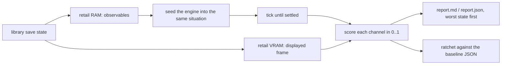

# Retail comparison corpus

A corpus-wide oracle: for every retail save state in the library that the
engine can be put into, seed the engine into the same situation, let it
settle, and score what it shows against what retail showed - per channel,
per state, with a ratcheted summary. It is the breadth sibling of the
single-subsystem oracles (`field_camera_zone_oracle`,
`w3a_retail_frame_oracles`, `vram-oracle`, `audio-trace`): those pin one
mechanism exactly, this one asks how far the whole port is from retail at
every captured moment, and ranks the moments by how far.

Nothing here runs an emulator. A save state's RAM holds every retail
observable the corpus compares, and its VRAM holds the frame on the TV - the
display registers say which rectangle - so retail's side is read offline, the
way `mednafen-state vram-dump --display-crop` reads it.

| Piece | Lives in | Role |
|---|---|---|
| corpus + channels + ratchet | [`retail_compare.rs`](../../crates/parity/src/retail_compare.rs) | Enumerate the library, read retail, seed the engine, score |
| battle half | [`retail_compare_battle.rs`](../../crates/parity/src/retail_compare_battle.rs) | Read the encounter out of a battle state, enter it, score the battle channels |
| script phase | [`retail_compare_script.rs`](../../crates/parity/src/retail_compare_script.rs) | Read the running field contexts off the actor lists, run the engine to the same script phase |
| frame channel | [`retail_compare_image.rs`](../../crates/parity/src/retail_compare_image.rs) | Crop retail's frame, render the engine's, the metric |
| `legaia-engine retail-compare` | [`retail_compare_cli.rs`](../../crates/parity/src/retail_compare_cli.rs) | Human report (markdown + JSON + side-by-side PNGs) |
| PCSX-Redux GPU reader | [`legaia_pcsxr::gpu`](../../crates/pcsxr/src/gpu.rs) | VRAM + GP1 control log out of a `.sstate` |
| driver | [`scripts/ci/retail-compare.py`](../../scripts/ci/retail-compare.py) | Resolves the gitignored data, builds, runs, blesses / checks |
| ratchet test | [`retail_compare_corpus.rs`](../../crates/engine-shell/tests/retail_compare_corpus.rs) | Disc-gated; fails on any per-state channel drop |
| baseline | [`retail-compare-baseline.json`](../../scripts/ci/retail-compare-baseline.json) | Scores and classes only - no pixels, no RAM |

## How it works



A state the engine cannot be seeded into stays in the report with its reason.
Start with [Running it](#running-it) and [Reading the report](#reading-the-report);
the sections after them define the model the scores come from.

## Contents

- [Running it](#running-it)
- [Reading the report](#reading-the-report)
- [The ratchet](#the-ratchet)
- [The corpus](#the-corpus)
- [Retail observables](#retail-observables)
- [The seeding model](#the-seeding-model)
- [Mid-script states](#mid-script-states)
- [Battle states](#battle-states)
- [Menu states](#menu-states)
- [Channels](#channels)
- [The image channel](#the-image-channel)
- [Divergence shapes](#divergence-shapes)
- [See also](#see-also)

## Running it

```bash
scripts/ci/retail-compare.py                  # state channels, report under captures/retail-compare/
scripts/ci/retail-compare.py --images         # + the image channel (needs a display)
scripts/ci/retail-compare.py --images --check # assert the baseline
scripts/ci/retail-compare.py --images --bless # fold a reviewed rise into the baseline
scripts/ci/retail-compare.py --filter town01  # only matching labels (a,b = either)

LEGAIA_SAVES_LIBRARY=... LEGAIA_EXTRACTED_DIR=... \
  cargo test -p legaia-engine-shell --profile release-test --test integration retail_compare_corpus:: -- --nocapture
```

The driver builds `legaia-engine` under the `release-test` profile first
(`--no-build` skips that), writes the report to `--out` (default
`captures/retail-compare/`), and exits 0 with a `[skip]` line when the
library or the extracted disc is missing; it looks for both in the worktree
and then in the main checkout.

The subcommand is `legaia-engine retail-compare`, which takes `--library`,
`--extracted-root`, `--manifest`, `--out`, `--images`, `--filter`,
`--flags-first`, `--write-baseline` (the driver's `--bless`) and
`--check-baseline` (the driver's `--check`).

## Reading the report

`report.md` opens with the channel means over the seeded states and the
class counts, then lists every seeded state **worst first**, each channel
with both sides' values and, when the frame ran, the side-by-side image.
The unseeded states close it, each with its reason. `report.json` carries
the same rows for scripts.

The worst states are the product. For each, decide first whether the
divergence is the instrument's - a [seeding gap](#the-seeding-model) - or
the engine's: a camera channel at 1 with a bad image is a rendering
question; a camera channel far off on a state whose label names a cutscene
is script progress; a `bgm` miss on an arrival state is capture timing
([below](#arrival-states-are-captured-before-the-town-runs)).

Two environment switches open up a battle state's `camera` channel:

| Switch | Adds |
|---|---|
| `LEGAIA_RC_CAM_TRACE=1` | to the `camera` detail: the engine's camera phase, live pose and glide target against retail's live pose and tween-table endpoints, the origin-alignment mask, and per combatant both sides' live pair, body pair, heading, clip and monster size class |
| `LEGAIA_RC_POS_TRACE=1` | on stderr, one line per drive tick: the acting seat, the action state and each of the first four combatants' live pair, body pair, heading, clip and target |

The first says which component of a framing misses its endpoint and which
input put it there - a heading, a body pair, a yaw counter; the second
replays how the combatants got where they stand. A run seeded from an
[undrifted](#battle-states) capture names the ground it was seeded on in
its drift, and the capture's own pairs in the trace.

## The ratchet

`scripts/ci/retail-compare-baseline.json` holds, per state label, each
measured channel's score, plus every state's class. The test
`retail_compare_corpus` re-runs the corpus and fails when any state's
channel falls more than `0.0005` (the JSON round-trip slack) below its
baselined score, when a baselined channel of a state the run did seed goes
unmeasured, when a seedable state fails to seed, or when no state is seeded
at all. A rise is allowed and is folded in
by a reviewed `--bless`. A bless merges into the existing file: a state
outside a `--filter`, or one the run could not seed, keeps its baselined
channels, and a run without a display keeps each state's baselined image
score. A state the run did seed otherwise takes the run's channel set, so a
channel that no longer applies to it (a field state re-classed `world_map`
has no `facing`) leaves the file rather than failing every later check as
`not measured`. A baselined state missing from the local library is
skipped (backups are per-machine), and the image channel is skipped unless
the run renders frames (`LEGAIA_RETAIL_COMPARE_IMAGES=1`, which needs a
display).

A state the manifest tags with a `resident_patch` was made on a patched
disc, so it replays a modified executable and its RAM and frame are not
retail's. Those states stay in the corpus and in the baseline file - several
are the only capture of their scene - but they sit outside both the headline
and the ratchet: the channel means and the mean state score are taken over
the retail-disc states, the patched-disc states get a channel table of their
own in the report, and a drop on one prints as `[patched-drift]` for review
instead of failing the check. A difference on a patched-disc state is a lead
to confirm against a retail capture, not a measured engine defect.

The test is disc-gated (`LEGAIA_DISC_BIN`) and finds the library and the
extracted disc through `LEGAIA_SAVES_LIBRARY` / `LEGAIA_EXTRACTED_DIR`
before the repo-relative defaults - in a git worktree the data lives in the
main checkout.

## The corpus

Every `[[scenarios]]` block in [`scripts/scenarios.toml`](../../scripts/scenarios.toml)
whose `backup_fingerprint` resolves to a file under `saves/library/mednafen/`
or `saves/library/pcsx-redux/` is one corpus state; a backup several
scenarios name is walked once, under the first label. Each state is classed
by the game-mode word and the scene label:

| Class | Retail condition | Seeded |
|---|---|---|
| `field` | mode `0x03`, a non-overworld scene, a plausible player pointer | yes |
| `world_map` | mode `0x03` on a kingdom overworld (`mapNN`) | yes |
| `field_init` | mode `0x02`, the scene mid-load | no |
| `battle` | mode `0x14` / `0x15` | yes ([below](#battle-states)) |
| `menu` | mode `0x17` (title, save screens, the pause menu) | the pause-menu screens ([below](#menu-states)) |
| `minigame` | mode `0x19` | no |
| `cutscene` | mode `0x1A` / `0x1B` (STR playback) | no |
| `other` | anything else | no |

Unseeded states stay in the report with their reason, so the summary counts
what the instrument cannot reach instead of dropping it. A minigame the
retail state shows *inside* a field-run frame (the casino floor, the dance
hall before the song) is a `field` state and is scored as the field it is.

A field-run state is named by the scene it is **running**, which is not
always the label. A walked door writes the destination label to `0x8007050C`
with the scene-change packet, frames before the field init loads the block
and stores its raw CDNAME define to `0x80084540`. A capture in that window
shows the outgoing scene - its frame, camera, player and track - under the
incoming label, so the corpus scores it as the scene the define names and
records the label as `pending_scene` in the detail
(`RetailObs::settle_on_loaded_scene`;
[the arrival states](#arrival-states-are-captured-before-the-town-runs)).

## Retail observables

| Observable | Address | Notes |
|---|---|---|
| scene label | `0x8007050C` | CDNAME label, 8 bytes |
| loaded scene | `0x80084540` | raw CDNAME define of the loaded block ([above](#the-corpus)) |
| game mode | `0x8007B83C` | the next-mode word the dispatcher reads |
| player `(X, footing, Z)` | `*0x8007C364 + 0x14/0x16/0x18` | `i16`s; the footing is the floor sample under the player |
| camera pitch / yaw | `0x8007B790` / `0x8007B792` | 12-bit angles |
| GTE `H` | `0x8007B6F4` | |
| camera eye | `0x800840B8/BC/C0` | the view builder's translation words |
| camera focus | `0x80089118` / `0x80089120` | the world X / Z the view orbits, stored negated |
| headings | `actor + 0x26` | the player's, and every field-actor-ticked (`FUN_8003BC08`) node's keyed by its flat record `+0x50` ([below](#the-facing-channel)) |
| BGM track word | `0x8007BAC8` | written by op `0x35`'s start arms |
| fog-pool gate | `0x8007B854` | written only by op `0x4C` nibble 3 ([field-ambient-fx](../subsystems/field-ambient-fx.md#mechanism-4---the-ambient-particle-emitter)) |
| party / flags / bag / gold | `0x80084140`, `0x1A18` bytes | the live game-state window |
| displayed frame | VRAM + display registers | [below](#the-image-channel) |

The live game-state window is byte for byte the front of a save block - the
save composer copies exactly these bytes over its buffer
([save-screen](../subsystems/save-screen.md#which-buffer-the-sum-runs-over)) -
so the corpus pads it to a block and lifts it through
`legaia_save::SaveFile::from_retail_sc_block`, the same parse a memory-card
load goes through. Party, story flags, the 256-slot bag and gold therefore
come out in the engine's own schema on both sides.

A PCSX-Redux state carries its GPU as one protobuf submessage: the `GPUSTAT`
word, a `0x400`-byte log of the last value written to each GP1 command, and
the 1 MiB VRAM. `legaia_pcsxr::gpu` finds it by shape (a `0x400` and a
`0x100000` member side by side) and reads the display start off `GP1(0x05)`
and the mode off `GP1(0x08)` - the same pair a mednafen state stores as
`DisplayFB_XStart/YStart` and `DisplayMode` - so both emulators crop the
displayed frame by one rule.

## The seeding model

**State channels** are measured headlessly. The engine is opened on the
state's scene and seeded through its own card-load path,
`BootSession::resume_save` over the lifted save (seed the story flags;
enter the scene; hydrate party, flags, bag, gold over whatever the entry
reset). Seeding the flags first is retail's order - the card load copies the save block over
the live game-state window before the field init runs - and it is what lets
an entry script or a bind-time prologue read the saved story: `rikuroa`'s
Genesis-tree objects arm their withered morph only while flag `0x142` is
clear. The player is then seated on retail's
`(X, Z)` with the floor-sampled `Y` (`SceneHost::debug_seat_standing` over
`World::debug_seat_player`, the kernel behind `LEGAIA_SEAT`; on a field scene
it is a warp landing and re-centres the region box and the windowed
static-object list on the seat), the zone camera's arrival snap is re-armed,
and the session ticks a fixed settle window with no input.

The snap composes from the state's own camera parameter block
(`0x8007B607..0x8007B627`, `ZoneFollow::arm_arrival_over`; `play-window`
takes it as `LEGAIA_SEAT_CAMERA_BLOCK`) rather than from a tile re-query.
The block holds whichever camera-region record a script or a walk-on loader
last installed, and that is walk history: `kor5`'s `P2[0]` / `P2[1]` are
one-op loaders on the walk-on band at tile X `28` / `26`, and the room's
camera (pitch `700`, `H` `400` against the re-query's `340` / `448`) is the
one the player last crossed into. The composer, the edge clamp and the ease
stay the engine's. The block is taken only when retail's camera has composed
from it - a staging descriptor (`0x801F3580`, the follow ease's, or
`0x801C6EA8`, op `0x45` APPLY's) carries its `H` - because a loader that runs
after the last compose leaves the live camera on the previous block until
the player moves: `kor5_field_card_boot` arrives on `P2[0]`'s tile, so its
block already reads `700` while the camera still shows the `340` shot the
re-query reproduces.

The seat is a player **standing** on the tile, not one crossing onto it: the
walk-on dispatcher's last-tile pair (`FUN_801D1EC4`) is stamped with the seat
tile, because a retail capture of a player stood on a trigger tile holds that
tile in the pair already. Seating without the stamp fired the tile's walk-on
record on the first tick - `kor5_post_43a_checkpoint` stands on `P2[4]`, whose
record walked the player out of the temple. The overworld's portals are
entity auto-engages rather than walk-on records, so on a world map the seat
also holds its tile against them until the player steps off
(`WorldMapState::seat_hold_tile`): a pending-door capture stands on the
portal that already fired, and re-engaging it crossed the door a second time
inside the settle window. BGM starts are recorded by a director on the scene
host's event route.

**The image channel** comes from `play-window`, the real renderer, run as a
child process from a scratch directory under the report, and seeded the same
way: the lifted save is written as a scratch LGSF file whose resume point is
the state's scene, and `play-window --resume-save` lands it through the same
`BootSession::resume_save` the headless side calls. `LEGAIA_SEAT=X,Z` then
seats the player on retail's position, and `--screenshot` captures at a
fixed world tick. Live NPCs are on in both the child and the headless
session: a placement's script runs only while its actor carries the engaged
bit (`+0x10 & 0x100`, raised by a touch), so an idle resume holds the seat
instead of letting a talk body walk the player off it.

A `--scene` door entry is **not** an equivalent seed. It stages the scene
for the free-roam picker (story-twin event flags, the entry BGM pause
dropped) and runs its arrival from the picker's seat, so an entry script
moves the player or points a dialogue shot before the seat applies - a
frame whose headless camera channel is exact would score the arrival
instead of the scene.

What the seeding does **not** carry - each is an instrument limit, not an
engine verdict:

- **Script progress outside a running record.** A state inside a running
  field record is run to that record's phase
  ([below](#mid-script-states)). What the phase gate does not reach - a
  record the engine never gets to, or progress held only in actor state
  (a camera aimed by a script that has since returned) - is the entry
  prologue's, not the retail script's.
- **Actor state.** NPC positions, animation phases, open doors and live
  effects are whatever the engine's own entry produces.
- **Timing.** Retail's frame is one instant; the engine's is a fixed tick
  after entry. Ambient animation and water CLUT-walk phases cannot be
  phase-aligned. The one phase the channel does align is the field
  party HUD's idle countdown (`_DAT_801F348C`, `FUN_801D0D38`): the settle
  window outlasts the `0x28`-frame near idle, while a card-load state is
  typically caught two or three frames into it, so an unaligned stationary
  seat draws a readout retail's frame is still most of a second short of.
  The countdown is read off the state and handed to the child as
  `LEGAIA_HUD_COUNTDOWN`; the window rearms the HUD until the countdown lands
  on that value at the capture tick
  (`world_map_panel_host::hud_phase_hold`). A state whose countdown has
  expired (`0`) scores the readout on both sides. The overworld runs the same
  HUD on its far idle (`0xA0` frames), longer than the run before the capture,
  so there the running countdown is also clamped to what it may still hold
  (`hud_countdown_cap`); without the clamp no overworld capture drew the
  readout retail's frame shows.

  The palette the mode-3 CLUT-cell cyclers write is aligned too. A cycler
  is a move-VM part (`FUN_80021DF4`, render mode `+0x5A = 3`) whose
  `FUN_80019D50` rewrite of its captured rect reads only its adds
  `+0x90/92/94`, its mode `+0x9E` and its white amount `+0x68`
  ([field-ambient-fx](../subsystems/field-ambient-fx.md)); the state's live
  parts are read off the actor lists (`retail_cell_fx`) and handed to the
  child as `LEGAIA_SEAT_CLUT_FX`, which writes them over the matching rects'
  own values (`AmbientFxState::cell_fx_seed`). The parts' move programs
  still run - only the written cell is the captured one. `jouine`'s flesh
  walls hue-cycle through green, and `cort_evolved_pre_battle` had scored
  its walls by the luck of the phase.

  So is the fog pool. Where its sheets have drifted to and how old they
  are is the `rand()` stream's history since the entry, which no seed
  replays; the image child installs the state's own live records (pool
  `_DAT_8007B7E0`, `retail_fog`, `LEGAIA_SEAT_FOG`) on the frame it
  captures (`FogPool::install_snapshot`), and the frame's render step ages,
  drifts and draws them as retail's did. With the records installed, the
  overworld mist of `field_walled_collision_pin` matches retail's frame to
  within the metric's noise - the sheet renderer is exact, and the spread
  was only where the pool had put its sheets. The headless seed keeps its
  own pool: its spawns draw the stream the battle half aligns on.

  The ambient tree's draw-kind-4 sprite-arm sheets are the same case: an
  emitter re-seats itself at a random point and yaw before each spawn
  (`garmel`'s cave mist, [field-ambient-fx](../subsystems/field-ambient-fx.md#a-spawned-sheet-drifts-along-its-spawners-yaw)),
  so the population matches retail's and the placement never does. The
  image child takes the state's live sheets (`retail_sprite_arms`: part tick
  `FUN_80021DF4`, `+0x56 == 4`, `+0x9E & 0x4000`, keyed by their stager
  record `+0x48` less the bundle base `_DAT_8007B8D0`) as
  `LEGAIA_SEAT_SPRITE_ARMS` and seats the engine's sheets of the same
  record on them on the capture frame (`World::install_sprite_arm_snapshot`):
  position, rotation banks, render scale, far colour and depth-cue level,
  and for a keyframe-pose node (`+0x5A == 6`, `map01`'s ridge bank) the
  packed clip entries of its `+0x4C` block, seated as both keyframes of every
  part so the mode-6 tail packs them back unchanged.

  The mode-4 VRAM scrollers get the same treatment: their rotation count
  is time since the entry, so the state's live scroller rects (`+0x5A = 4`,
  rect `+0xD0..+0xD6`, `retail_scroll_rects`) go to the child with the
  texels retail's VRAM holds there, through a `LEGAIA_SEAT_VRAM_RECTS` file,
  and are written over the engine's after every field VRAM pass
  (`AmbientFxState::vram_rect_seed`). `korout`'s cloud sea under
  `sol_to_karisto_worldmap` is one. The rects are taken back by the
  display lag first: a scroller whose countdown `+0xC6` drains `step` a
  tick and reloads to its period `+0xC4` fires every `period / step + 1`
  ticks, so the rotations it fired over the last two game frames are
  undone (`scroll_fires_within`, `unrotate_rect`). `jouine`'s two flesh
  columns, period `2` on a step-`3` frame, fire every tick.

  So are the VDF vertex-morph envelopes field actors run off op `0x4B`
  ([field-ambient-fx](../subsystems/field-ambient-fx.md#the-vdf-vertex-morph-chain)).
  Where an envelope stands is time since the arm: `town01`'s shoreline
  objects (`P0[7]` and its siblings, `4B 03 ..`) run a tide whose lanes carry
  the sea up the beach and back, and `town01_tetsu_topic_prompt` caught it
  out, with sand where the engine's settle window had the surf in. Every
  field-actor-ticked node with its envelope up (`+0x10 & 0x1000`) and armed
  lanes (`+0x6C`) goes to the child as `LEGAIA_SEAT_MORPHS` - lane weights
  `+0xA0 + i*2`, done mask `+0x7C`, control word `+0x62` (`retail_morphs`) -
  and is written over the matching morph the engine armed itself on the frame
  it captures (`World::seed_field_morph`, matched by flat index). The weights
  are the displayed frame's, not the RAM's: each lane runs its own ramp back
  over the two-frame lag (`rewind_morph_weights` - the `+0xB8` up-velocity
  while it has not peaked, the `+0xC8` down-velocity while it drains, times
  the frame step). `jouine`'s flesh wall (`cort_evolved_pre_battle`) rises
  `51` / `81` per vsync, and seeded on the RAM's weights it was drawn six
  vsyncs more swollen than the frame on the TV.

  So are the ambient walkers - every placement the facing channel counts as
  `ambient` ([below](#the-facing-channel)). Where a wanderer stands and which
  way it faces is its `rand()` picks since the entry, so the state's live
  seat (`+0x14` / `+0x18`, heading `+0x26`, `retail_walkers`) goes to the
  child as `LEGAIA_SEAT_WALKERS` and stands the walker there on the frame it
  captures, motion channel included (`World::seed_ambient_walker`). The
  displayed frame is two game frames older, so a walker caught mid-step can
  still sit a few units off its drawn place. The headless seed stands the
  same walkers - engaged ones too - at the resume tick, before a talk is
  engaged, because the talk snap turns a placement to the bearing from its
  own seat: `town01_npc16_dialogue_first_page`'s `P1[16]` had wandered off
  its `4C 51` tile before the press.

  So is an ending vignette's photo panel. The vignette record grabs the
  drawn frame into `(512, 0)` (`43 12`) and shows it through the image
  panel (`43 13`, shrunk to a corner by `43 14`), and a capture is usually
  parked in the credits record that runs after it - `ending_panel_corner`
  holds record 13 - so the seed, which resumes the running record, never
  spawns the panel. The state's live panel widget (`retail_panel`, handler
  `FUN_801F849C`) goes to the child as `LEGAIA_SEAT_PANEL`, installed on the
  frame it captures, and the texels it samples ride the
  `LEGAIA_SEAT_VRAM_RECTS` file beside the scroller rects. The second
  page's rect runs to the far edge its quad reaches, not the image's: the
  handler starts that quad at `u + 0x100 + 0xE` and ends it at
  `u + w0 + 0x10` (`0x801F8838..0x801F88B0`), sixteen texels past the
  `320`-wide grab, and the `43 12` split copies source `+0xF0` for `0x60`
  columns to cover them. A seed cut at the image's width left those texels
  unseeded and the panel's right edge drew whatever the engine held there.

  So is the frame's clear colour, the draw environment's `r0 / g0 / b0`
  (`0x8007BF5D..5F`) that op `4C 13` writes and the MAN loader zeroes: the
  state's bytes go to the child as `LEGAIA_SEAT_CLEAR` and are written over
  the engine's on the frame it captures (`retail_clear_rgb`). It is system
  script history. `town01`'s entry loop sets cave brown inside its cliff box
  on any pass the player is free for, and the opening holds the player from
  the install pass on, so `rim_elm_zoom_intro`'s system context is still
  parked on its install-pass PC (`+0x9F`) and the frame clears black; the
  seed's settle window ran the loop before the resume, the engine cleared
  brown, and the semi-transparent sea (`(B + F) / 2`) blended into it.

  The `cort_evolved_pre_battle` walls that still read differently are not
  a scroller's: they sample texture page `(512, 0)` through CLUT
  `(16, 502)` (the state's display list), outside both `jouine` scroller
  rects (`x = 576`), and that CLUT cell has no live cycler on either side.

`--flags-first` is a diagnostic arm for the headless side: hydrate, enter
through `enter_scene_live` directly (no resume landing, no saved seat),
hydrate again. Comparing its report with the default isolates what the
landing itself contributes.

## Mid-script states

A field capture taken while a spawned record runs holds that record's
context on the SCUS actor lists (`_DAT_8007C34C..`, linked through
`+0x00`): the field actor tick `FUN_8003BC08` at `+0x0C`, the engaged bit
`+0x10 & 0x100`, the script base `+0x90` (the record's script start) and
the PC `+0x9E` that the runner `FUN_80039B7C` reads, the flat MAN record
index `+0x50` (`FUN_8003BDE0` stores `N0 + N1 + i`) and the op-`0x4A` wait
accumulator `+0x54`. The cutscene camera mover (tick `FUN_801DC0BC`) on the
same lists gives the shot's progress: `+0x9C` counts up to the duration
`+0x9E`, and `+0x10 & 0x8` marks it landed. The scene system script (tick
`FUN_801DA51C`) and the player are not candidates.

Such a capture is not sampled a fixed window after the entry. The seed runs
the engine until its own context for the record - found by the record's
first 48 bytes, so the partition and the index need no mapping - holds the
retail PC with at least the retail wait and at most the retail glide left,
or has just executed the op retail is parked on (the engine clears some
parks inside one slice that retail holds across frames: a channel flag
already up, a walk already at its tile). A text segment is met once the
engine's box has typed its page and waits for the press - the press that
turns the page, or on the last page the press that closes the box - the
frame every such capture shows. Counting only the page-turn wait missed
every capture on a closing page (`garmel`'s Songi taunt), and the run
sampled the settle window instead. A capture with no camera mover on its
lists holds a landed shot (retail frees the mover when its glide ends), so
there the record's context is met on the gate PC only once the engine's glide
has landed too: `name_input_ui` is parked on the opening's `49 03` one op
after a 16-frame glide, and the first tick on that PC is the glide's first
frame. The run has a deadline of 9000 ticks; a gate it never
meets keeps the settle-window sample, and the `script` detail says which
it was.

The frame is gated two game frames earlier than the RAM. The field
double-buffers exactly as the battle does
([below](#replayed-casts)): the display scans out the frame built two
frames before the one the RAM holds, so the image child's gate takes
`2 * step` vsyncs off the retail wait (`ScriptGate::displayed_from_retail`,
the step rebuilt from the frame-duration history). The state channels keep
the RAM's wait. `minigame_dance_pcsx` is parked `21` vsyncs into the wait
after `34 01 FF FF FF 1E`, a subtractive white walk-in (`27` vsyncs once a
white blend-`2` target loses its eighth), on a step-`3` frame; gated on the
RAM's wait the engine frame was darkened six vsyncs further than the one
on screen, and on the displayed wait the lit dancers match retail's to a
grey level. `rikuroa_post_caruban`'s Genesis tree, mid-morph six vsyncs into
a wait, had grown past the sapling retail shows. A camera glide in flight is
taken back the same way: the displayed frame had `2 * step` more vsyncs of
glide left (`kor5_post_436_organic`'s closing shot).

The gate is met on the first engine tick whose glide has no more left than
that, which is not the same progress: the mover credits the adaptive
frame-skip factor per logic tick (`t = min(t + DAT_1F800393, d)`,
`FUN_801DC0BC`), so how far a glide has come at a script phase is the
frame-skip history since its beat, and the engine's counter lands a frame
or two past retail's. On the frame it captures, the image child puts the
glide exactly the gate's frames short of its end
(`Camera::align_glide_frames_left` for the mover the follow frame reads,
`CutsceneGlide::align_frames_left` for the op-`0x45` shot), keeping the
engine's own start and end poses. `kor5_post_436_organic` was one frame
further along an 80-frame linear glide (pitch `600` against retail's `590`,
eye Z `7622` against `7552`); on a tiled floor that one frame cost a quarter
of the image score.

A capture parked on the PC right after a record's `0x3F` scene change is
inside the departing scene's transition hold: the record spins on its
`26 FF FF` tail while the streaming actor (`FUN_8001FD44`) holds the old
scene. The engine retires the record on the tick it executes the `0x3F`, so
that PC is never one it holds; the gate is met once the record's context has
retired into a held transition, and then once the camera glide has no more
left than retail's. `son_arrival_from_doman` is such a capture: `map03`
`P2[13]`, the `son` portal cutscene, stages its shots with op `0x45`
configures (the last a 299-frame glide to pitch `814`, `H` `252`), and the
state is caught on its tail with that glide almost landed - the overworld's
"entry" camera there is that record's, not the zone camera's.

Three drives get the engine there without changing the retail state it
started from:

- **Resume.** A record the card-load entry does not start - its one-shot
  gate flag is already in the save, or its trigger is a walk-on tile the
  seat does not cross - is installed from its first opcode at the settle
  tick, ungated, as the modal timeline (a concurrent context when another
  timeline holds that slot). The record replays its own staging: its
  `MoveTo`s, camera beats and pokes run from the top. It is installed
  earlier when retail's system script says the record took the player
  before the scene's per-frame body ever ran
  ([below](#a-record-that-took-the-player-at-the-install-pass)). The system flags
  the record set in the straight-line run that ends on the gate PC (from
  its last jump, picker or flag test) are cleared first: retail executed
  that run to stand where it was captured, so its latches are already in
  the state, and a replay that tests them takes the other arm. `town0c`
  `P1[21]` sets `0x5C1` at `+0x7A` and tests it at `+0x76`; replayed with it
  up, the record went straight to the Queen Bee fight, past the shot
  `rim_elm_queen_bee_battle` is captured on. Engagement clears the same
  latches. They are also taken out of the save the seed lands
  (`RetailObs::seed_save`), so the scene entry never sees them: the
  record set them after that entry ran. `koin3` `P2[6]` sets `0x59C` two
  ops before the wait `minigame_dance_pcsx` is parked on, and the entry
  `P1[0]` reads that flag as "back from the dance floor" (`+0x178`): seeded
  with it up, the entry cleared it and spawned the judging record `P2[9]`,
  whose dialogue box sat over the frame. They are raised again at the
  settle tick, once the entry has run, so a record the seed never reaches
  still scores retail's flags; raised straight after the landing, an entry
  still running read them anyway. The comparand keeps the latches.
  A record the scene's
  own script **spawns** (op `0x44`) may be scored by the spawning arm rather
  than by itself: `rikuroa`'s `P1[0]` starts `2025` and spawns `44 5C`
  (`P2[50]`, the post-Caruban record) behind its `0x289` test, a marker
  `P2[50]` clears, so a card load takes the entry's other arm. The resume
  replays that arm's op-`0x35` words first
  (`man_field_scripts::walk_spawn_scores`: the last start within eight
  instructions of the `44`, through `World::replay_field_bgm_words`).
- **Engagement.** A capture inside a conversation holds the talked-to
  placement's own context, engaged. The engine keeps a placement's idle body
  on a channel and runs a talk on its inline runner, so a record the engine
  finds only on its idle channel is engaged at the settle tick through the
  interaction probe's own dispatch (`World::trigger_field_interact`), on the
  placement whose interaction record carries the capture's head bytes. The
  runner holds its PC on a segment's start while the box is up - the PC
  retail's `+0x9E` holds - and the gate reads it like a timeline. The
  headless seed runs talks on the inline runner as both play hosts do
  (`WorldToggles::use_vm_dialogue`); without it the record never left its
  idle channel and the innkeeper states were sampled with no box on screen.
  A capture past a fight its talk staged is engaged where that fight's talk
  ended: retail's talk and the placement are one context, the talk ends on
  the `21` after the `3E` with the PC past it, and the engagement after the
  fight resumes there (`post_battle_resume`). `v0_1_post_battle_tetsu_town`
  is held on "You did well." at `town01` `P1[10]` `+0x804`, past the
  sparring fight's `3E FF 04` / `21` at `+0x7F7`; opened at the entry, the
  talk only reached that line through the fight, and the frame was sampled
  with no box.
- **Paging.** From the settle tick on, while the record sits in a dialog box
  short of the gate PC, `Cross` is pressed every other tick - the presses
  the player made to page the conversation to where it was captured. A
  topic menu on the way is steered rather than confirmed blind: the cursor
  is walked onto the option whose branch target is the last one at or
  before the gate PC and confirmed there, with no press while the menu
  still slides in (one would commit its opening cursor). `Cross` alone took
  option 0 every time, and `v0_1_tetsu_dialogue_accept` looped on Tetsu's
  first topic, short of the spar arm (`town01` `P1[10]`, picker at
  `+0x17F`, third arm `+0x766`) it is captured in. Items the run gives on
  its way to the gate (op `0x39`, the same straight-line run whose flag
  sets are cleared above) are taken back before the replay, which grants
  them again: that arm gives item `119` at `+0x7A6`.

`play-window` takes the same gate as `LEGAIA_SCRIPT_GATE`, with the same
resume and paging, so the image channel frames the phase the state
channels scored; it is handed only when the headless run met the gate.

### A record that took the player at the install pass

The scene system script's context (tick `FUN_801DA51C`) is on the same actor
lists, and its PC `+0x9E` is where the entry script's last pass parked. The
system SM runs no pass while a record holds the player
([script-vm](../subsystems/script-vm.md#engagement-and-the-system-script)),
so in a capture inside a cutscene that PC is the pass the record interrupted.
The opening's records interrupt the first one: `town01`'s system context sits
on `+0x9F` through `rim_elm_zoom_intro`, `vahn_walks_out` and
`name_input_ui`, and `map01`'s on `+0x13F` in `s2_rimelm_town01` - in both the
PC right after the install slice's last `0x21`, with the per-frame loop
(`town01` from `+0xA3`, `map01` from `+0x143`) never entered.

A resume at the settle tick runs that loop sixty times first, with a free
player at the seat, and the loop's first pass selects a region there: it
raised `0x19D` / `0x19E` in `town01` and `0x528` in `map01`, bits no retail
state of the opening holds, and picked the cave-brown clear colour under
`rim_elm_zoom_intro`. So the seed carries the system PC on the gate
(`ScriptGate::system_pc`, the `:s<pc>` tail of `LEGAIA_SCRIPT_GATE`) and
starts the record on the first tick the engine's own system script stands
on it (`ScriptGate::drive_resume`), before the next pass. The record's
latches are then left to the replay rather than raised at the settle tick.

Only an install park is taken early. A park inside the loop - one a later
jump comes back to, `retail_compare_script::loops_back_to` - is a PC the
engine first stands on the tick *before* its own first pass, and retail's
body has run there: `rikuroa_post_caruban` and the `garmel` captures hold
the selector bit that pass raises, and keep the settle-tick resume.

What the replay exposes is the engine's own record execution, and two
shapes it has shown are worth knowing:

- **Talk bodies a cutscene never engages.** A placement's own script runs
  only while `+0x10 & 0x100` is up, and only a touch raises it; a poke, a
  walk or a placement from a cutscene record leaves it down
  ([`script-vm.md`](../subsystems/script-vm.md#engagement-and-the-system-script)).
  An engine that stepped every placement a record addressed ran their talk
  bodies: `dolk2_market_noa`'s Noa (`P1[2]`) set `0x2FE`, and the `town01`
  opening states picked up `0x20A` / `0x23D` from `P1[10]` / `P1[11]`.
- **Where a record waits on a walk.** A player compass walk (`B7 F8` /
  `C1 F8`) does not park its record: the record runs on and waits at its
  next op on the player. A gate on that next op is met while the leg still
  plays, and an engine that parked on the walk itself met it only after the
  leg, with every beat after the walk late by a leg
  ([below](#ending-vignettes-are-mid-script)).

## Battle states

A battle capture carries its encounter in RAM, all of it resident while the
fight runs ([battle](../subsystems/battle.md)):

| Observable | Address |
|---|---|
| party / monster count | battle context `*0x8007BD24`, `+0x00` / `+0x01` |
| command-flow byte, action-state cursor | context `+0x06` / `+0x07` |
| monster ids | formation cell `0x8007BD0C[0..4]` |
| scripted-fight bit | `0x8007BD60 & 0x80` |
| present party | `0x8007BD10` (1-based roster ids) |
| combatant HP / max / MP / max | actor table `0x801C9370[slot]`, `+0x14C` / `+0x14E` / `+0x150` / `+0x152` |
| camera | the field's rotation / translation globals; `H` is `256` |

The seed replays the fight from a running field and then places it at the
capture's phase. Each step below exists because leaving it out moves a channel
for a reason that is not a port defect:

| Step | What is taken from the capture | Engine side / knob |
|---|---|---|
| [Enter the fight](#seeding-the-fight) | formation cell, present party, stage variant, keep-object-1 byte | `World::force_encounter`, `LEGAIA_BATTLE_STAGE=variant,keep` |
| [Pin the stream](#the-stream-at-the-entry) | nothing - retail's RNG state is not in the capture | `LEGAIA_BATTLE_RNG_SEED`, `BATTLE_RNG_SEEDS`, `EncounterState::rng_hold` |
| [Match the image child](#the-image-child-plays-the-same-fight) | - | `LEGAIA_BATTLE_SETTLE`, `LEGAIA_BATTLE_BARS`, `BootSession::fog_render_tick` |
| [Stand the combatants](#where-the-combatants-stand) | live ground `+0x34` / `+0x38`, heading `+0x46`, tint lanes `+0x04` | `RetailBattle::seeded_ground`, the `:x:z[:facing][:d<hex>]` tail of `LEGAIA_BATTLE_BARS` |
| [Land the HUD](#hud-glides-the-capture-had-landed) | glide records at `ctx[+0x11B4]` | `LEGAIA_SEAT_HUD_GLIDES_LANDED`, `LEGAIA_SEAT_HUD_GLIDES` |
| [Take back double pushes](#a-push-the-capture-already-holds) | - (measured from the engine's own replay) | `RetailBattle::undrift`, `ground_residual` |
| [Take back rewards](#rewards-already-granted) | EXP share `gp+0xA04`, stat window, banner element `ctx[+0x26]` | `ungrant_results_rewards`, `ungrant_magic_level_up` |
| [Place the phase](#placing-the-phase) | command-flow byte `ctx[+0x06]`, cursor `ctx[+0x07]`, seat `ctx[+0x13]` | `SeedPlan` |

### Seeding the fight

The scene is entered through the card-load path and the field settles the same
window a field state does. The fight is entered from a running field, as
retail's was, so the scene's track has started.

- **Formation.** The formation cell is matched against the scene's registered
  MAN rows. A cell no row carries (a fight installed from another table) is
  registered as a formation of its own, carrying the scripted bit, with the
  monster archive's stats for its ids.
- **Party.** Retail's present list `0x8007BD10` becomes the engine's active
  party. A guest seat, or a battle-id fight whose init re-seeds the trio, is
  not the save window's field party.
- **Stage.** The stage variant `0x8007BD60 & 0x1F` and battle init's
  keep-object-1 byte `0x8007B64B` are stamped
  (`World::seed_battle_stage_variant` / `seed_battle_backdrop_keep_object_1`;
  `play-window` reads both as `LEGAIA_BATTLE_STAGE=variant,keep`). A battle
  capture's player actor is no longer the field walker whose tile names them,
  so both come from the region reader. The second matters: nilboa's Thunder
  Ravine region keeps the backdrop shell's object 1, the horizon mist ribbon.

`World::force_encounter` then arms the row through the ordinary transition -
the path `play-window --battle` takes, including the scripted carrier's
replayed tutorial arm and the carrier's replayed BGM words
([below](#the-track-word-in-battle)). When the mode flips, the retail
combatants' live HP / MP are written over the engine's, and the session is
placed at the capture's phase.

### The stream at the entry

Retail's RNG state at the instant its fight began is not in the capture. Left
alone, the engine's would be whatever the field settle happened to draw, so
every channel that rides a draw (a monster's pick and target, the battle
camera, the frame) would move whenever a field-side port changed how many
draws it takes.

- The world stream is set to a fixed seed just before `World::force_encounter`,
  on the headless seed and in the image child alike (`LEGAIA_BATTLE_RNG_SEED`).
- It is held there at the head of every tick of the field-side intro transition
  (`EncounterState::rng_hold`): the field's NPC and ambient programs keep
  drawing until the fight is in battle mode.
- A capture of something a draw decides is still one realisation of the stream.
  The seeds in `BATTLE_RNG_SEEDS` are tried in order, and the first under which
  the fight is still on, its opening reached a prompt, and the drive or replayed
  cast reached the capture's phase is the one scored. A state no seed satisfies
  keeps the first seed's run, `never reached`.
- A capture past the end signal also wants retail's win pose. The results
  sequencer draws it from the stream (`victory_pose_id`), and the results camera
  is that pose's own script (`battle_over_script`). The pose actor's latched
  `+0x1DB` is read (`RetailBattle::win_pose`); a seed that reaches the phase on
  another pose is kept only as the fallback, and the remaining seeds are tried
  for one that draws retail's (`noa_levelup_banner`).

### The image child plays the same fight

The frame is only evidence about the state the channels scored if the
`play-window` child replays that fight tick for tick. Three couplings make that
true:

| Coupling | Why it matters | Mechanism |
|---|---|---|
| Settle before arming | An encounter armed at boot owns the first tick, so the scene's entry scripts never run. On an overworld that leaves the ambient-particle gate clear, and the emitter that draws the stream once a frame never draws | The child settles `SETTLE_TICKS` first (`LEGAIA_BATTLE_SETTLE`) and installs the fight's roster after the settle, since a scripted duel's entry can re-seat the party |
| Fog render step | It is not presentation-only: it writes the live count and depth view the next tick's spawns read, and a spawn draws the stream | The headless seed runs `BootSession::fog_render_tick` after every tick; the child is tick-locked (one tick per redraw) |
| Mid-fight bars | A child on full bars has its monster AI pick from a different table | The seeded HP / MP reach the child on the same first battle tick (`LEGAIA_BATTLE_BARS`) |

### Where the combatants stand

Retail walks nobody home after an action
([battle-action.md](../subsystems/battle-action.md#where-an-action-leaves-its-combatants)),
so a capture of a running fight stands its combatants wherever earlier rounds
left them: `zora_glare_petrify_pre`'s Zora casts from `(649, -47)`, beside the
party, and the Delilas duels' monsters stand at the party's row. Every framing
case aims at those positions - case 6 on a caster, case 0 on a member, case
9's formation box.

- **Ground.** The first battle tick places every combatant on its captured live
  pair `+0x34` / `+0x38` (`RetailBattle::seeded_ground`, carried as the `:x:z`
  tail of each `LEGAIA_BATTLE_BARS` entry), on every plan but an opening
  capture, which is sampled before any round ran. The acting seat is placed
  too, even on a captured Attack whose pair is a point on the walk the drive
  replays: the walk ends at its target whatever it starts from.
- **Heading.** On a capture past the end signal each placed combatant takes its
  heading `+0x46` (a `:facing` field after `:x:z`). The attack band's recompute
  stores it every frame of a swing and nothing turns the actor back, so the
  member who struck last stands facing its target, and case 6's battle-over yaw
  is `0x800 - actor[+0x46]`. A capture of a running fight keeps the engine's
  own headings, which its replayed rounds set.
- **Defeat tint.** A body whose tint state `+0x21C` is the defeat fade takes its
  colour lanes `+0x04` (a `:d<hex>` field). A monster killed earlier has stepped
  them to black and is no longer drawn; without the field a `0`-HP body with
  resting lanes stands in the frame (`noa_levelup_banner`'s results camera sits
  inside the dead Gobu Gobu).

### HUD glides the capture had landed

The battle HUD's plates rise over sixteen vsyncs from the action seed
(`FUN_801D9BBC`'s records at `ctx[+0x11B4]`; a landed record reads
`total == 0`). A seat placed on its captured ground skips the approach retail
spent that time on, so a drive can reach an attack capture's phase with the
engine's plates still mid-rise while retail's had long since landed
(`battle_gaza2_park_0x19_summon_melee`, `player_steal_skeleton_pre`).

- **All landed.** When every retail record has landed, the image child lands the
  engine's at the capture (`LEGAIA_SEAT_HUD_GLIDES_LANDED`,
  `World::land_battle_hud_glides`).
- **Still in flight.** A record in flight seats its widget instead
  (`LEGAIA_SEAT_HUD_GLIDES`, `World::seat_battle_hud_glide`, the cluster's age
  on the host's HUD). Its target seat (`+0x04` / `+0x06`) names the widget:
  `(16, 12)` the actor plaque, `(16, 192)` the readout bar, another seat on the
  bar's row the target plaque, `x = 168` the combo cluster's anchor. Its
  `elapsed` byte, less the display lag, is how far the displayed frame shows it
  (`FUN_801D9BBC` adds the frame step a pass, so the byte counts vsyncs).

Two limits to read a residual by. The RAM cannot say how long ago a glide
landed, and the displayed frame is two frame steps older:
`battle_noa_miracle_art_combo`'s plates landed inside that window, so its frame
shows them still rising while the seat lands them. And a replayed cast or
strike reaches its phase on its own clock, which the raise does not share:
`nivora_duel_mid_blazing_slash` holds plaque and bar ten vsyncs into the raise
(six on screen), and `battle_melee_hit_spark`'s cluster is twelve vsyncs into
its slide (eight on screen), which leaves it off the right edge.

### A push the capture already holds

A capture inside an action stands its combatants where that action had already
moved them - a target shoved back by its hits, a member knocked down by a
spell. The drive replays the action from that ground, so every push lands twice
(`battle_gimard_tail_fire_a`'s Vahn ends `129` units behind his captured pair,
and the framing that follows him loses Gimard off the frame's edge).

No word in the capture holds the ground the action started from, but the
engine's own replay measures the push:

1. A driven action that reaches its phase is run once more on the same stream
   from `captured - drift` (`RetailBattle::undrift`, any axis moved by at least
   `UNDRIFT_MIN`).
2. The second run is kept when it stands the placed combatants nearer their
   captured pairs than the first (`ground_residual`).
3. The acting seat's own drift is its approach, whose direction is the heading
   every framing case subtracts. A seat that walked therefore moves with its
   **target's** drift (the pair keeps the first run's geometry); a caster that
   stood stays put.
4. A capture past the end signal is not re-run: the win pose's own travel is not
   a push the capture holds twice.

### Rewards already granted

A capture on the results frame or after it (`SpanGate::Results` / `Exit`) holds
the party past the EXP grant and the level-up applier `FUN_801E9504`. The seed
replays the fight, which grants again, so `RetailObs` takes the grant back first.

| Grant | How the capture shows it | Take-back |
|---|---|---|
| EXP + level-up | every living member holds the share `gp+0xA04`; a levelled member's record stat window `+0x11C..+0x12D` differs from the live window it is mirrored into one phase later | `retail_compare_battle::ungrant_results_rewards`: remove the share, restore the live values, lower the level byte by one (`noa_levelup_banner`) |
| Magic level-up | the summon return's level check `FUN_801E70BC` bumps the cast spell's level byte and stores the banner element `0x65` on `ctx[+0x26]` (`0x801E723C`), which the next action seed clears | `retail_compare_battle::ungrant_magic_level_up`: lower that spell's level on the acting member's record by one, leave its XP so the replayed cast levels it again (`shiny_refactor_gimard_levelup`) |

Without the take-back the replay grants nothing the second time and the engine
frame shows no "level increased" line or banner.

### Field script state and surprise openings

- **A parked dialogue.** A settled field carries its script state into the
  fight: in `nilboa` the settle leaves the Nivora duel's dialogue parked on a
  text page when the encounter is forced. Retail cannot show that box over a
  fight - its pager `FUN_801D84D0` lives in the field overlay (PROT 0897, slot
  A), which the battle overlay replaces. The engine matches:
  `World::script_dialog_panel`, which both hosts draw the box from, answers
  `None` in battle mode.
- **Render-coupled clip ends.** A battle clip's end is read off the window's
  pose sampling, so an effect-script spawn can land a few ticks apart between
  the headless seed and the child (the Delilas Spirit band `0x47`). Compare a
  per-tick trace of `World::rng_state` and the action SM from both sides to
  find such a split.
- **Surprise openings.** A seed whose entry rolled a formation advantage
  (`ctx+0x290` / its latch `+0x291`: a back attack or a pre-emptive strike) is
  passed over, except on an opening capture
  (`EngineBattle::surprise_opening`). A capture of a running fight is not its
  opening round, and a surprise opening hands one side a round of swings
  between the HP / MP the seed wrote and the replayed action, which reads as an
  HP miss.

### Placing the phase

The capture's command-flow byte `ctx[+0x06]` picks one of five plans
(`SeedPlan`):

| Retail `ctx[+0x06]` | Plan | What the engine runs |
|---|---|---|
| `0xFD`, `0x00`, `0x0A`, `0x0B`, `0x0C`, `0x14` | opening | nothing past the battle-mode flip; sampled there |
| `0x1E` | prompt | the opening to the first round prompt, then a fixed settle |
| a selection state above `0x1E` | menu | the pad path from the prompt to that surface, on the member cursor `ctx[+0x13]` ([below](#driving-to-the-phase)) |
| `0xFF`, summon band | cast | the capture's cast replayed ([below](#replayed-casts)) |
| `0xFF`, anything else | action | the pad path through rounds until the action SM holds `ctx[+0x07]` on seat `ctx[+0x13]` |

**The entry band** is everything below the round prompt
([battle](../subsystems/battle.md#the-battle-open-flow---ctx0x06-from-the-intro-timer-to-the-first-swing)):

| `ctx[+0x06]` | Meaning |
|---|---|
| `0xFD` | SCUS battle init's own store (`FUN_80055B6C`, `sb v0,0x6(v1)` at `0x80055FA8`), before the overlay's init writes `0x00` |
| `0x0A` / `0x0B` | the intro timer |
| `0x0C` | the boss stage module's baton |
| `0x14` | the one-frame turn setup |

Every value decodes to the engine's `Idle`, so an opening capture is compared
with the engine before its own opening has run, and its frame is taken there
too (`BattleDrive::Opening`): the first battle frame whose monsters are bound,
and for a capture past the intro timer (`0x0C` / `0x14`) the first one whose
enemy-name labels have cleared.

That comparison is only as good as the engine's opening. The port does not park
its command flow on the intro timer (`battle::intro_names` - the round prompt
opens with the names still up, which the recorded replays pace off), so an
ordinary fight holds its prompt already at the flip and an opening capture of
one reads `phase` `0`. The corpus's opening captures are all the sparring
fight, whose opening the tutorial holds back.

**The entry sweep.** An opening capture's `camera` reads the
[battle-entry sweep](../subsystems/battle.md#the-battle-entry-sweep) the SCUS
frame driver runs before the battle tick. The driver's entry counter `gp+0x330`
says how far in each capture is:

| State | `ctx[+0x06]` | `gp+0x330` | Pitch | `TR` |
|---|---|---|---|---|
| `v0_1_battle_loading_tetsu` | `0xFD` | `0x84` | `60` | `(0, 1472, 6912)` |
| `s5_tetsu_battle` | `0x00` | `0xAF` | `16` | `(0, 2010, 3552)` |

An opening capture is taken once the engine's own sweep has run as far
(`entry_sweep_reached`; the counter rides the drive as
`opening,<swept>,<counter>`), and a counter of `0xFF` - the sweep over - waits
for the engine's to end. Every other battle capture was taken after the sweep,
since retail's battle tick opens no prompt under it, while the engine's prompt
opens at the flip. So the seed waits the engine's sweep out before it counts
the first prompt, the in-flight cast seed dispatches only once it is over, and
the image child's pad drive holds until then.

A battle state whose RAM does not describe a seedable fight (the context
pointer not yet resident, counts out of range, an empty cell) is kept with a
`battle not seedable:` reason and counted as a classified limit, not as a
seed failure.

### Battle channels

| Channel | Score |
|---|---|
| `enemies` | fraction of retail monster seats whose id the engine seated in the same order |
| `enemy_hp` / `battle_party` | fraction of equal HP, max HP, MP and max MP fields over the retail combatants (max MP left out where the engine carries none) |
| `phase` | 1 when the engine's command-flow state equals retail's `ctx[+0x06]` decoded to the engine's band - and, for a replayed or driven action, the same action-SM state on the same seat; for a driven menu, the same member |
| `bgm` | retail's track word against the field track the engine will resume ([below](#the-track-word-in-battle)) |

`scene`, `mode` (engine `Battle`), `camera`, `flags`, `inventory` and `image`
keep their field meaning. HP / MP current values are seeded, so their misses
are what the settle window changed; the max values are the real check
(record-derived on the party, archive-derived on the monsters).

Two kinds of state carry fields the battle channels leave **unscored**, with
both values listed in the detail:

- **`resident_patch` states** were made on a patched disc and replay that
  build's executable; their `enemy_hp` / `battle_party` details say so. One
  patch effect is recognised rather than flagged: under a `shiny-seru` resident
  patch, a monster maximum that reads exactly the boost's `x135/100` (truncated)
  over the engine's disc value is the patch's write at battle init. The three
  `shiny_refactor_gimard_*` states hold `133` over the disc's `99` HP and `27`
  over `20` MP. Any other difference on those states still scores.
- **`ram_injected` fields** (`p0.mp_max`) name what a capture probe wrote into a
  combatant **after** battle init. Battle init copies each party record's maxima
  into its actor once (`FUN_80053CB8`), so a record poked later carries the
  probe's value while the actor keeps the copy: `evolved_0x90_midcast` /
  `_0x91_midcast` (`autorun_evolved_cast.lua`) grant `999` MP into Vahn's record
  (`+0x108` / `+0x10A` / `+0x11E`) over an actor whose `+0x152` still reads `27`,
  and the engine, seeded from the record, reads `999`.

### Driving to the phase

A menu or action capture is reached through the engine's own command surfaces
(`BattleDrive`), one press every other tick so each press is an edge. The image
child runs the same drive (`LEGAIA_BATTLE_DRIVE`) and captures the first frame
that holds the phase; a drive the headless side never completed is not imaged.

**What each seat commits.**

| Seat | Commit |
|---|---|
| Members ahead of the capture's seat | a plain Attack: the ring's Left arm, `Auto`, the first target |
| The capture's seat, menu capture | the arm that leads to the captured surface: Left then `Command` for the arts entry `0x50`, Up for the item window `0x3C`, Right for the magic window `0x46` |
| The capture's seat, action capture | the same Attack every round; Spirit when its committed category `+0x1DE` is `4` |
| A monster seat that was casting (`+0x1DE = 2`) | casts the capture's spell id `+0x1DF` on its next turn (`BattleState::forced_monster_cast`, with the capture's already-debited MP credited back) |
| The party, on such a monster-cast drive | Spirit instead of Attack, so the caster is still standing when its turn comes (Zeto's two mid-cast captures sit in a party that kills him in two swings) |
| Any seat, message box on screen | Cross |

Monster seats are translated from retail's fixed pool slots `3..` onto the
engine's seating straight after the party.

**Arts strings.** A party seat whose committed queue `+0x1DF..+0x1EE` holds an
art starter (`0x19` / `0x1A`) entered its turn through `Command`, so its drive
takes `Command` too and confirms the string the arts entry preseeds from the
character record (`FUN_801DA34C`). `Auto` builds a different queue under the
same state byte. Three refinements:

- **Gauge.** When the seat's live gauge `+0x154` stands above its base `+0x156`
  (a Spirit turn the replay does not play extended it), the drive restores it
  before the round. The extension selects the saved string's band and pays for
  its arrows: `player_steal_skeleton_banner`'s five-arrow `0F 0E 19 27 0E 19 27`
  needs the `153` gauge over the `104` base.
- **Entered arrows.** The saved string is not always the turn the player
  entered. `battle_melee_hit_spark`'s Vahn holds `0F 0E 0F 0E` in band A while
  his committed queue `0D 0F 0E 19 27` is Right Up Down Up; a bare confirm would
  strike Up, Down, Somersault, Down and sit in `0x20` on the last Down swing
  where retail plays the Somersault. The drive therefore carries the committed
  queue, reads it back as entered arrows (swings as they stand, each starter +
  art pair as its art's last arrow) and, when neither band holds them, writes
  them into both before the round. A queue the reading cannot invert (a Super
  or Miracle tail) keeps the saved string.
- **Strike cursor.** On a strike-loop age capture whose clip is a dynamic art
  slot (`0x10` / `0x11`) - the clips the swing-clip gate leaves open - the
  strike cursor `ctx[+0x15]` is gated too, since the age alone matches the
  turn's first clip that runs as long (`battle_vahn_tri_somersault_super`'s
  Somersault sits at cursor `5`; the age alone takes the first Down swing at
  `3`).

**Target.** A party attack capture's target byte `+0x1DD` is the monster the
player picked. The drive walks the target cursor (the command picker's, or the
arts entry's) onto that row before confirming: the strike shots look at the
target, and the picker's default row is whichever monster earlier turns left
first in the ring.

**When the phase is held.**

- A menu phase is held when the engine's flow state equals the capture's and,
  for a per-member surface, the member is the same. It also waits for the battle
  camera's glide to land (`BattleCamera::is_gliding`).
- An action phase is held when the round is executing and the same seat holds
  the same `ctx[+0x07]`.
- A menu surface, once reached, is then held with no input for `MENU_HOLD_TICKS`
  before it is sampled, on both the headless seed and the image child. A retail
  menu capture is a surface the player sat on, so its camera has finished the
  transition that opened it (the case-`0` glide onto the member, or the
  submenu-exit swing back to the far framing on the commit confirm). Sampled on
  the tick the surface opens, `camera` reads the transition's first step.
- The drive gives up after its budget or when the fight ends, and the `phase`
  detail then reads `driven by pad, never reached`.

**What is read where.** A drive plays rounds the retail history did not. A
driven capture's combatant, bag, flag and track channels are read at the first
prompt, before the drive - where the seed placed them - and only `phase` and
`camera` at the phase itself.

A drive that cannot reach a phase is a real finding, not a seeding limit. Two
engine behaviours the drive depends on: a Spirit commit plays the spirit band
`0x46..=0x48` (retail's seed sends category `4` there unconditionally,
`li v0,0x46` at `0x801E2F5C`), and the battle flow byte follows the player into
the item / magic / arts windows
([battle](../subsystems/battle.md#how-the-engine-raises-the-flow-state)).

#### Placing a capture inside a state

Every action-SM state spans frames. The drive reaches each on its first tick,
while a retail capture sits wherever the save was made, so a capture is placed
inside its state by retail's own clocks (`SpanGate`):

| Capture | Gate | Retail words it is placed by |
|---|---|---|
| Any action state | `SpanGate::Age` | close-up accumulator `ctx[+0x87C]` |
| Results sequence (past the end signal) | `SpanGate::Loading` / `Results` / `Exit` | `_DAT_8007BD2C`, `ctx[+0x6CE]`, `gp+0xA54` |
| Done band `0x51` / `0x52` | `SpanGate::DoneHold` | countdown `ctx[+0x6D8]` |
| Capture band `0x6E` / `0x6F` / `0x70` | `SpanGate::CaptureFade`, `BattleDrive::steer` | `ctx[+0x87C]`, `ctx[+0x6D0]`, `ctx[+0x6DA]` |
| `0x00` / `0x0A` / `0x0B` | `SpanGate::Landed` | tween table `ctx[+0x118C]`, seat from `ctx[+0x274]` |
| `0x70` under a directed module | module arm + countdown | `ctx[+0x279]`, [`capture_countdown_va`](../subsystems/cast-module.md#a-capture-class-module-owns-the-camera-in-0x70) |

**How far into the state (`SpanGate::Age`).** The acting actor's clip commit
zeroes `ctx[+0x87C]` and every framing call adds `8 * frame_step`. The drive
takes the first tick in the state whose engine accumulator has run as far; a
state the engine leaves sooner is re-run on the same stream and sampled on its
last tick (`EngineBattle::age_short`). Without the gate a monster's approach
`0x19` or a Spirit band `0x47` scores the glide onto the actor instead of its
framing.

- **Clip gate.** The strike loop `0x1E` commits one clip per queued swing, so an
  age alone names the first swing that runs as long. For a party seat on a swing
  clip the drive also waits for the engine's current clip to equal retail's
  committed clip `+0x1D9` (art clips on their dynamic slot `0x10` / `0x11`,
  which both sides store).
- **Idle clip.** A party seat's idle `0` is not gated - between the approach and
  the first strike retail commits it and the engine holds the walk clip - except
  in the return state `0x20`, whose first hold waits while the attacker's
  `+0x1D9 != 0` (`0x801E54EC`). A capture reading `0` there is past the last
  swing and its accumulator counts from the idle commit; ungated, the sample
  lands inside the last art clip (`player_steal_skeleton_banner`,
  `rim_elm_gimard_seru_capture_before`).

**Three draws the drive aligns to the capture** while the engine holds the
capture's state:

| Draw | Retail word | Roll | Alignment |
|---|---|---|---|
| Framing style | `ctx[+0xD]` | rolled by the action seed; the post-strike cases fork on it | set to retail's. Not inside the capture band: `0x70` pins the style to `1` without re-arming a framing, so a band capture's camera was placed under the rolled style |
| Yaw half-turn | `ctx[+0x6DA]` | a party attacker's first swing-clip commit re-seeds it to `(rand() % 2) * 0x800 + 0x280` (`FUN_8004E13C`); cases 6 to 8 film from the side that coin picks | `BattleCamera::align_action_yaw_half`, from the seat's seed pass to the capture's state; the drift is left to the engine |
| Track coin | `ctx[+0x26D]` | `FUN_8004E13C` stores `rand() % 2` on every clip commit whose header byte `+0x87` is non-zero; it picks the per-art track column and the `0x200` offset in case 8's dead-target yaw | `BattleCamera::align_phase_cursor` |

**Past the end signal.** Once the `0x5A` gate raises `DAT_8007BD71 = 0xFE` the
action SM is no longer stepped: `ctx[+0x07]` reads `0x5A` and `ctx[+0x13]` the
pose actor through the whole results sequence, so the state names a span of
several hundred vsyncs. Such a capture is placed by the sequencer's own words:
the phase word `_DAT_8007BD2C`, the phase halfword `ctx[+0x6CE]` and the results
hold `gp+0xA54`, against `World::battle.victory` on the same pose actor
([battle](../subsystems/battle.md#battle-end-retails-way---the-results-sequencer)).

The Done band is placed the same way. Its continuation `0x52` holds for its
countdown `ctx[+0x6D8]` (`0xB4` frames after an absorb), so a `0x52` capture
waits for the engine's countdown to run down to retail's. The fade-down `0x51`
ticks the same word (the `0x3C` tail timer `0x50` seeds) and is placed by it,
not by the accumulator: in the Done band the accumulator counts from whichever
idle or return commit the acting actor's clip lengths put last, and an engine
whose actor committed nothing since its cast clip reads it far past retail's.

**A monster's capture-class cast mid-load (`SpanGate::CaptureFade`).** The
capture band's `0x6E` and `0x6F` wait on the disc: `0x6E` on the CD-ready poll
`FUN_8003DE7C(1)` (`0x801E4F08`), `0x6F` on `FUN_8003F2B8(1)` (`0x801E5024`)
while the cast module streams in. The engine's polls are always ready, so
unheld it crosses both in a tick each. Retail's own words say how long the
reads took:

- every frame of either state calls `FUN_801D5854(ctx[+0x13], 6)`, whose
  prologue adds `8 * frame_step` to `ctx[+0x87C]`;
- `0x6F` ramps `ctx[+0x6D0]` down by `16 * frame_step`, a word `0x70` leaves
  alone;
- the yaw counter `ctx[+0x6DA]` counts from the seed (the seed stores `0x800`,
  the SM's prologue adds about one a frame unless the Battle Camera option is
  Far), where the accumulator counts only from the caster's last clip commit.

The drive holds the engine's polls busy (`BattleDrive::steer`) until its depth
has come down to retail's, its accumulator has run as far through `0x6E` as
retail's (less what the `0x6F` frames still to come add), and the yaw counter
agrees. The yaw matters under retail's ease-out camera: the three Delilas
specials (`che_delilas_megaton_press_mid_cast` and its two siblings) sit `34`
frames further into the wait than the accumulator shows, a fifth of a turn of
yaw. Held so, the engine lands where every such capture is framed - pitch `0`,
`TR y = 0x500`, focus on the caster's seat.

What a `0x70` capture still reads is the cast module's own shot (Cort's Ultra
Charge pulls out to `TR (0, 3072, 7315)`), which the body's camera director
arms ([cast-module](../subsystems/cast-module.md)); a body with no director
holds the case-6 pose `0x6F` left. A `0x70` capture of a module whose countdown
the engine directs carries the module arm `ctx[+0x279]` and the countdown word;
the phase is held until the engine's module sits in that arm with its word run
down as far, which places the module's shot in flight.

**Ahead of the seed pass (`SpanGate::Landed`).** `0x00`, `0x0A` and `0x0B` run
before the seed pass copies the next actor into `ctx[+0x13]` from `ctx[+0x274]`
(`0x801E2C50..0x801E2C5C`). A capture there reads the previous actor in
`ctx[+0x13]` - at a round's start, the last ring member - so its seat is
`ctx[+0x274]` instead. `0x0A` waits on the CD (`FUN_8003F2B8(1)`) for as long as
the actor's data takes. A capture whose tween table (`ctx[+0x118C]`) reads every
stepped component at its endpoint has sat there long enough for the far framing
to land: the drive holds the engine's wait until its own glide lands, and the
yaw - which case 9 passes through and nothing in `0x0A` writes - is aligned as
an orbit clock. `evil_medallion_rage_battle` is one.

#### Special captures

| Capture | What the RAM holds | What the drive does |
|---|---|---|
| Taken on the killing blow | a party action in flight whose target already reads `0` HP. Seeded so, the fight ends at the first `0x5A` wipe gate before the swing starts | When no seed reaches it with the HP as read, the search re-runs with each such victim at `1` HP (`RetailBattle::action_victims`); the victim's HP is then read at the phase. The other members commit Spirit (`BattleDrive::Action`'s `spare`), since any swing kills a `1`-HP victim |
| The killing blow's body | a `0`-HP victim is no target, so the auto-target picks the next standing monster | The phase is held only with the acting seat on that target (`ActionSteer::target`); otherwise the search moves on to the `1`-HP re-run |
| An absorbed Seru | the Done band's banner hold `0x52` carries the absorbed Seru in `ctx[+0x269]`, and the grant already prepended spell `seru + 0x80` to the acting character's list | The drive takes the spell back off that list on its first battle tick (`absorbed`), so the replayed kill's absorb lookup stages the banner instead of leaving `0x51` for `0x5A` |
| A counterattack's HUD | a timed message up (HUD element `0x66`, hold `0x801F6964` non-zero) carries its overlay string and the hold left; a target plaque whose content word is zero carries that too (the strike loop's counter swap clears it) | The drive reaches a counterer's strike loop through the member's own turn, so it raises both when it holds the state (`ActionSteer::message` / `plate_cleared`). The text is read off the engine's own PROT 0898 image (`battle_vahn_tri_somersault_super`) |

#### Monster casts the drive relies on

- **Capture-class specials.** Retail casts a monster's capture-class special
  (Cort's, Zeto's, Dohati's, the Delilas duels') through the capture band
  `0x6E..=0x71`, routed on the spell table's class byte. Every monster pick
  builds that record off the disc table (`World::monster_cast_def`), the seed's
  forced cast included, which is how the Cort and Delilas captures reach `0x6F`
  / `0x70`. Three behaviours sit behind it: Dohati's Chaos Breath arm 3 spends
  the caster's `+0x170` gauge the pick is gated on
  ([cast module](../subsystems/cast-module.md#the-twelve-bodies-the-trampoline-map-names));
  Mystic Circle and Doomsday report done so the band leaves `0x70`; and Cort's
  Mystic Shield halves the party's damage until he is at half HP and keeps his
  Evil Seru Magic shut until then
  ([cast module](../subsystems/cast-module.md#the-fourteen-trampoline-arms-that-are-the-bands-other-tick-bodies)).
  Neither boss fight involved is a scripted loss: no story flag 0 latch precedes
  `dohaty` P2[10]'s `3E FF 0A` (Dohati, monster `0x8A`) or `chitei2` P2[13]'s
  `3E FF 0D` (Cort, `0xB4`).
- **Plain cast clips.** Retail stages a monster cast's clip as the tag-`0x23`
  archive entry its pick walked to (`FUN_801E9FD4`, `sb s2,0x1e0(s4)` at
  `0x801EA540`), not an entry tagged with the spell id. The engine walks the
  same entries, which gives Gimard's Tail Fire its `0x2A` / `0x2B` chain after
  `0x29`
  ([monster animation](../formats/monster-animation.md#action-tags-and-the-0x1ef-reaction-map)).

#### Open cases

- **Zeto's waves.** The forced cast is armed but never consumed inside the
  budget - the monster pick that would take it is not reached on Zeto's seat -
  so `0x70` is not reached. Why is open.
- **Seat and timing.** A pick no seed reproduces (a monster's plain strike on a
  given seat) can run out of budget or end the fight first.

### Replayed casts

A capture taken inside the summon band is replayed rather than parked. That
means a party seat (`ctx[+0x13]`) on action-SM state `0x32..=0x36` with a spell
id queued at `+0x1DF`, or on the Done band it hands on to (`0x37` / `0x38`,
`0x50..=0x52`) with its category `2` still committed.

**The seed.** The engine is handed that cast (`World::battle.inflight_seed`,
target byte `+0x1DD`), dispatched the moment the first command prompt opens:

- the capture's MP charge is credited back, so the band's own debit lands on the
  captured figure;
- the seed carries every combatant's live `+0x34` / `+0x38` pair
  (`InflightCastSeed::ground`, the `;x:z,...` tail of `LEGAIA_BATTLE_INFLIGHT`),
  applied at the dispatch. Retail walks nobody home after an action
  ([battle-action.md](../subsystems/battle-action.md#where-an-action-leaves-its-combatants)),
  so the cast close-up frames wherever earlier actions left the caster. Nothing
  in the summon band itself moves the caster;
- the headless seed seats the creature unrendered
  (`World::seat_summon_creature_unrendered`, from the session's frame tail).
  With no creature seated PROT 0903's walk arm passes on its first tick and folds
  the hit there, so a capture mid-walk (`gimard_burning_attack`, victim still at
  full HP) would read the victim dead.

**The gate.** The session runs to the capture's **phase**, not a fixed settle.
`phase` compares the action-SM state as well, and `play-window` captures on the
same predicate (`LEGAIA_BATTLE_INFLIGHT`, `LEGAIA_CAPTURE_GATE`), stopping its
tick loop the frame it holds. The state byte alone names only a span's first
vsync, so each kind of capture adds the clock that places it inside:

| Capture | Extra clock | `LEGAIA_CAPTURE_GATE` suffix |
|---|---|---|
| Full-screen flash up | the flash's age in vsyncs (`FadeState::age_vsyncs`) | - |
| `0x33`, no flash yet | caster committed clip `9` and close-up accumulator `ctx[+0x87C]` (`BattleCamera::close_up_accum`) reached retail's | `a<acc>` |
| PROT 0903 walk arm (`11`) | yaw base `ctx[+0x6DA]`, which the arm swings `6 * scalar` a vsync from `0x200` | `y<yaw>` |
| PROT 0903 countdown arms (`1..=10`) | module countdown word `0x801F7960`, draining `scalar` a vsync (`ModuleCamState::countdown`) | `c<count>` |
| Done band `0x51` / `0x52` | hold countdown `ctx[+0x6D8]` (the pad-driven plan's `DoneHold`): `0x3C` frames, or `0x96` behind a magic level-up banner | `d<timer>` |
| `0x35` / `0x36` under a ported pacing director | module phase byte `ctx[+0x279]` (`PhaseGate::module_phase`) | `m<phase>` |

Notes on the rows:

- **Flash.** Retail's flash is a SCUS fade actor (tick word `FUN_80025000` at
  `+0x0C`, not done, kind `1`, id `1`), told apart from a creature's own fades
  by its per-frame delta. Its `+0x7C` block's countdowns give its age:
  `delay0 - delay` in the start delay, `delay0 + duration0 - duration - 1` once
  landed (the landing frame steps both).
- **Invoke clip.** `0x33` runs until the clip's first effect record fires. The
  clip's commit zeroes the accumulator, which then gains `8` a vsync. The
  framing prologue adds its `8` on the commit frame itself, so the accumulator
  reads `8 * (frames since the commit + 1)`; counting frames instead is one
  vsync late, which on a capture taken on the band's last `0x33` frame is a gate
  never met.
- **Walk arm.** The phase byte only names the arm's entry. An engine walk that
  arrives sooner leaves the arm first, and its exit is then the frame taken.
- **Countdown arms.** `shiny_refactor_gimard_plus35` is arm 9 at countdown
  `928`, some 16 vsyncs into the arm, after the breath has grown. The display
  lag is added back as for the other gates.

**The frame and the RAM are not the same instant.** Retail double-buffers its
packet pools, so while the CPU builds frame `N` the display scans out `N - 2`.
Of the flash's two full-screen `POLY_F4` packets, one carries the block's value
and the other the value one step earlier, and the displayed frame is one step
older than that. A step is the adaptive frame step `*(0x1F800393)` - `2` or `3`
vsyncs through the band, rebuilt from the frame-duration history at `0x80084098`
since the scratchpad is not in a main-RAM image. The flash on screen is
therefore `2 * step` vsyncs younger than the block says (a block at `178` shows
`123`). The RAM channels are sampled on the block's age; the image gate takes
the lag off (`RetailBattle::display_phase_gate`). Scored the other way, a
flash-in ramping by `12.75` a vsync reads as a white-out the retail frame never
shows.

**Who owns the camera.**

| States | Owner | Engine |
|---|---|---|
| `0x33` / `0x34` | the band: a low camera pitched up at the caster (`FUN_801DC0A0` case `0x12`), so the upper, darker half of the backdrop fills the frame. There is no separate darkening pass | `battle_cam_script::summon_cast_framing` |
| `0x35` / `0x36` | the slot-B module, which frames the **creature** (actor slot 7) and paces its arms on its own countdown ([`cast-module.md`](../subsystems/cast-module.md#the-module-owns-the-camera-and-the-bands-length)) | per module, below |

- **Pacing director ported (PROT 0903, 0905, 0908).** The band's length is the
  module's, so the capture is gated on `ctx[+0x279]` too. A walk arm is gated on
  its entry, not on how far the creature has walked, so a mid-walk capture reads
  its `camera` against the framing the walk starts from.
- **Camera-only director (the summon creatures).** It does not move the band's
  length, so its captures stay gated on the flash alone.
- **No director.** The module keeps case 6 on the caster through `0x35` /
  `0x36`, and its capture's `camera` reads that gap. PROT 0913 (Nova), whose
  opening arms wait on the creature's CD read, is the one `0x35` capture of that
  kind left.

Where the creature stands is the formation's: a fight whose engine seats differ
from retail's reads the difference in the creature focus too, since the module
places the creature relative to caster and victim.

Known image differences on a mid-cast frame: the caster's name plate draws over
retail's flash where the engine's flash covers it, and the engine captions the
spell name over the caster.

**The idle orbit.** The orbit's yaw is a clock (`-4` per camera step from
whatever azimuth the field left), so an unaligned prompt sample reads the
capture instant, not the scene. When retail's command-flow byte is one the
battle tick's orbit runs on (`0x1E` / `0x32` / `0x6E` / `0xFE`, `FUN_801D0748`
at `0x801D0784..0x801D07A4`) both sides align it, each only while the orbit owns
the yaw (`BattleCamera::align_orbit_yaw`): the headless seed sets its orbit to
retail's yaw before it samples `camera`, and the image child gets the yaw as
`LEGAIA_BATTLE_ORBIT_YAW` and holds its orbit there. It is the camera twin of
the field HUD countdown hold.

**Guests.** A party whose present list names a seat the save window's roster
does not seat (a guest combatant) reads as a short engine party in
`battle_party`.

**The image** comes from `play-window --resume-save <lifted save> --battle <row>
--party <ids>` with the retail stage variant. That is the card-load resume the
headless side takes, so the frame's party is retail's (levels, equipment and the
battle meshes assembled from it, the HP / MP the HUD prints) rather than the New
Game template a bare door entry seeds. It is captured a fixed number of ticks
past the fight's first prompt. The evolved-Cort arrival (PROT 0968) holds the
prompt back some two thousand vsync ticks longer than an ordinary opening (its
countdowns drain by the frame step a pass, so one a tick), and the headless
side's opening window runs long enough to wait it out. A fight with no MAN row
to name is not imaged; its reason is in the report.

### The track word in battle

Retail's track-select word `0x8007BAC8` keeps the **field** track through a
fight: every catalogued battle state holds a field or overworld id there, never
the battle theme, which is started without the op-`0x35` store. The engine
routes its battle swap through the same start event its field scripts use, so
its copy of the word reads the battle theme. The comparand is therefore the
track the engine stashed to resume (`World::audio.field_bgm_resume`), or its
word itself when the fight took no swap (a battle sound set of `-1`).

**The word is script progress.** A scripted boss's event starts its theme with
op `0x35` sub-op `9` just before the fight and selects the battle sound set with
sub-op `7`, and the retail word holds that theme:

| Record | Starts | Selects |
|---|---|---|
| `korb3`'s Gaza record | `2028` | `-1` |
| `jouine`'s Cort record `P2[5]` | `2071` | `8` |

The seed enters the scene fresh and forces the formation without running the
event, so it replays the record's words instead: the last start before the
record's `3E FF <row>`, the control words after it, and the last sound-set
selection (`World::replay_scripted_battle_score`, read off the MAN by
`man_field_scripts::walk_battle_entry_scores`; `play-window --battle` replays
the same words). Each goes through the field VM's own op-`0x35` handler.

**What the replay cannot reach** is a word an *earlier* beat chose. `nilboa`'s
entry picks its track by which duel-return marker is up, clears it and spawns
the post-duel record; each duel record raises its own marker immediately before
its `3E FF`:

| Marker up at entry | Track |
|---|---|
| `0x477` / `0x478` | `4096` |
| `0x479` | `2028` |
| `0x47A` | stop |
| none | `2054` |

A battle capture therefore holds the marker of the fight in progress, while
retail's word is the `4096` the **previous** duel's return parked - which no
flag in the capture names. The marker is one of the fight's
[entry latches](#a-pre-fight-flag-runs-the-entrys-post-battle-branch), so the
seed's entry does not see it and takes the no-marker arm:
`nivora_duel_pre_plasma_strike` (marker `0x478`) and
`nivora_duel_mid_blazing_slash` (Gi duel, row `31`, marker `0x479`) both read
`2054` against `4096`. Landing with the marker up would return from the wrong
fight (`0x478` picks `4096` by coincidence, `0x479` picks `2028`). The duel
record itself starts no track (it selects sound set `4`, which the replay does
carry), so there is no start to replay. See
[audio](../subsystems/audio.md#the-battle-sound-set-picks-the-fights-track).

## Menu states

A menu-class capture (mode `0x17`) names its screen in the menu overlay's
sub-screen word `DAT_801E46A4` ([save-screen](../subsystems/save-screen.md#sub-screen-function-pointer-table)).
The pause menu's screens are the root rows' routes - Items `0x05`, Magic
`0x0E`, Equip `0x12`, Status `0x15`, Options `0x17`, Load `0x18`, Save
`0x19` - plus the Equip row's two later steps, the slot browse `0x13` and the
candidate list `0x14` (`0x12` itself is Equip's character picker). Those are
seeded: the field seed runs (card-load resume, seat, settle), then the pause
menu is driven through its own pad path - `Start`, `Down` onto the row,
`Cross`; one more `Cross` past the character picker for `0x13`, and for
`0x14` a `Down` past Best Equipment and a `Cross` into the first slot's
candidates, one edge every `MENU_PRESS_GAP` ticks. The headless side
presses them into `BootSession`'s menu; the image side hands the same edges to
`play-window` as a `--pad-script` after the card-load resume.

The `menu` channel is 1 when the engine's menu holds the same sub-screen
(`0x01` on the root list, the open row's id; the engine's Equip screen reads
as `0x12` in its character picker, `0x13` on its slot list and `0x14` on its
candidates). `mode` wants the engine in `Menu`; the field channels keep their
meaning, since the menu opens over the seated field.

A capture with the word clear is the title / boot family (the attract loop,
the title picker, the card-boot save select) and a screen no root row routes
to is script-entered (the casino prize exchange, `0x20`); both are kept with
a `menu not seedable:` reason and counted as classified limits.

What a like-for-like menu frame shows is the engine's. The Status and Equip character lists are the present
party (`DAT_80084594` over `0x80084598`,
`field_menu_dispatch::status_snapshots` and `EquipScreenModel::party_row`), not
every roster record - the New Game template seeds all four records, so a
roster walk listed Noa, Gala and Terra beside a Vahn still travelling alone.
Each row's name is the record's own `+0x2A7` display name
(`field_menu_dispatch::roster_names`), so a save with a renamed hero shows
that name, as retail does.

## Channels

Each channel scores in `[0, 1]`; a state's score is the mean of its
measured channels.

| Channel | Score |
|---|---|
| `scene` | 1 when the engine landed in retail's scene |
| `mode` | 1 when the engine's mode is `Field` (field class) / `WorldMap` (overworld class) / `Battle` (battle class) |
| `position` | player `(X, Z)` after settling: 1 within 4 units, linear to 0 at 256 |
| `footing` | engine floor sample at retail's `(X, Z)` vs retail's footing: 1 within 2, 0 at 128 (field and overworld classes; not scored while a script holds retail's player height, [below](#a-script-held-height-is-not-a-footing)) |
| `camera` | mean of eight parts: pitch and yaw (1 within 16, 0 at 256, wrapped), `H` (1 within 4, 0 at 128), each eye word and each focus word (1 within 16, 0 at 1024) |
| `facing` | field class only: mean over the player and every placement standing on its retail seat, each heading 1 within 32, 0 at 512, wrapped ([below](#the-facing-channel)) |
| `bgm` | 1 when the engine's track-select word (`SceneHost::bgm_track_word`, the park sentinel `0x1000` included) equals retail's; the detail marks a held track on either side ([below](#a-held-track)) |
| `fog_gate` | 1 when the engine's fog-pool gate equals retail's |
| `party` | fraction of equal fields over retail's roster: HP / MP current and max, level, the eight equipment bytes |
| `flags` | 1 - differing bits / bits set on either side, over the whole story-flag bitmap |
| `inventory` | fraction of non-empty bag slots equal, slot for slot, plus gold |
| `enemies` / `enemy_hp` / `battle_party` / `phase` | battle states only ([above](#battle-states)) |
| `menu` | menu states only: 1 when the engine's pause menu holds retail's sub-screen ([above](#menu-states)) |
| `image` | fraction of `8 x 8` blocks within tolerance ([below](#the-image-channel)) |

`party` and `inventory` are seeded straight from the retail window, so on
their own they check the seeding and whatever the settle window changes (an
entry script that grants or takes an item, a heal). `flags` does the same
for the flag bank: its misses are bits the engine's entry scripts wrote
during the settle window, or bits the save round trip does not carry.

### The facing channel

Retail's heading is `+0x26` on every actor node; the engine keeps the
player's as `render_26` and each placement's in `World::npcs.headings`, both
a half-turn from retail's space (`engine = retail + 0x800`; a placement with
no entry is the spawn default, retail `0`). The player is scored only while retail's
heading still equals the arrival facing `_DAT_80073EFC` the entry script's
`4C 3A` gave it (a card load zeroes it, so every card-boot state is scored);
once the pad has turned the player the heading is walk history, which the
seat replays like the position (as the arrival facing, so an entry script's
`4C 3A` in the settle window hands over the same heading) and the channel does
not score. The image child takes retail's heading whichever way it was turned,
as `LEGAIA_SEAT_HEADING`. A non-zero
arrival facing is a door's, which the card-load seed zeroes, so the seed
seats it before settling. A retail node is matched to its
placement by the flat record index `+0x50` (`N0 + slot`, `FUN_8003A1E4`), and
is scored only when the engine holds that placement within 96 units of
retail's position - a placement in the wrong place is the position's miss,
not the heading's - and not on the off-map park seat, where nothing is drawn.
The detail lists every heading more than a sixteenth turn off with both
values, and tags the party-bank placements (`+0x10 & 0x01000000`). Set
`LEGAIA_RC_FACING_DUMP` to print every matched pair.

A placement the ambient motion VM is turning is not scored either
(`retail_ambient_heading`): its node runs `FUN_80038158` (`+0x10 & 0x80`, no
script or pursue context holding it under `+0x500`), and the stream variant
its PC sits in (`*(+0x80) + *(+0x84)`) carries a heading op - a directional
or home-relative step, a ramp `0x04` / `0x0D`, or the wander `0x18` - before
its loop-back. Its `+0x26` is where the stream stood at the capture instant:
a `0x04` ramp loop's phase is ticks since the entry (`cave01`'s Piura sway
between `0` and `0x800` on a 66-tick cycle, caught `24` ticks into a leg),
and a wanderer's compass point is the `rand()` stream's pick, held through
the next wait. Neither is replayed by the seed, so the heading is walk
history exactly as the player's is. The detail counts them as `ambient`; a
state whose only placements are ambient walkers measures no facing.

The channel measures whichever leg wrote the heading - an entry pose, a
cutscene face-at or rotate, a talk snap - so a remaining miss is a leg the
engine wrote differently or not at all. The phase gate
samples on the first frame the engine's record reaches retail's PC, which is
not always the frame retail is on: a record that sits on an op waiting for a
turn to land compares the engine's turn mid-ramp against retail's landed one.
`new_game_cutscene_intro_a` is held on `opdeene` `P2[18]` `+0x6F6`
(`B3 05 0A`, the wait on flat 5's compass walk `C1 05 00 C4`) behind flat 8's
40-vsync `B8 08 86 28`, and the capture itself says how long retail has sat
there: flat 5's walk cursor `+0x54` reads `54` of its `128`, with the turn
long landed. The gate aligns the two on the shot instead - the record's
4800-vsync camera glide, `939` vsyncs in on both sides - and on that clock the
engine's record reaches the walk `925` vsyncs after the glide starts where
retail's reached it after `885`, so the engine is sampled `15` vsyncs into
the turn. The forty vsyncs are the engine's record running long, and the
state brackets where: flat 8's looping clip `4` (bound by `A2 08 04` at
`+0x58E`, cursor `+0x68 = 144`) puts that bind about `401` vsyncs after the
glide starts, a dozen *later* than the engine's `388` - the `0x4A` waits
rounding up to retail's three-vsync frame. Retail therefore makes up some
fifty vsyncs between `+0x58E` and `+0x6EE`, where the only time that is not a
`0x4A` wait is the four end-latch spins on flat 5 (`AD 05 08` after clips
`8`, `9`, `8` reversed and `7`; `30`, `60`, `29` and `60` engine ticks by
`FUN_800204F8`'s step and wrap over the scene bank's frame counts). Which of
them retail clears sooner is not pinned.

## The image channel

Retail's drawing area is `320 x 224` at draw offset `(0, 4)` / `(0, 244)`,
and the display scans out from the same origin
([renderer](../subsystems/renderer.md#the-screen-the-gte-projects-onto-is-320x224-not-320x240)),
so the compared frame is the top `224` rows of the display crop - the rows
below are never drawn. The port keeps a `320 x 240` logical screen whose row
`y` is retail's draw row `y` (the `OFY = 114` bias puts the GTE origin on the
same row in both), rendered at an integer scale, so engine row `s * y` is
retail row `y`: the capture's top `224 * s` rows are box-filtered down by
`s`, and the port's bottom `16` logical rows are left out.

Two numbers per state:

- `mae` - mean absolute error per channel per pixel, 8-bit units;
- `within` - the fraction of `8 x 8` blocks whose mean colour is within
  `24` of retail's on every channel. This is the score.

Block means rather than pixels: the engine rasterises at its own resolution
with its own filtering, so a per-pixel test would mostly score dither,
filtering and sub-pixel edges. A block test moves on wrong camera, missing
or extra geometry, wrong CLUTs and wrong overlays, and not on rasteriser
noise. A retail frame whose mean luma is below `8` - a fade - is not scored:
a dark engine frame would match it and say nothing about the scene.

The engine frame comes from `play-window` run as a child in a scratch
directory whose options file pins `camera_distance = "retail"`. The window's
interactive default frames the field further out than retail, and a frame
compared at that distance scores the zoom rather than the scene.

Every presentation enhancement the window defaults on is turned off in the
child: enhanced lighting, the volumetric ground fog, the camera-occlusion
fade (it dissolves the walls around a hidden player that retail draws
opaque), the scene-entry VDF pulse, and the photosensitivity slew on the
ambient CLUT cyclers (`reduce_flashing = false` in the options file).

A `--screenshot` child is tick-locked - exactly one world tick per redraw,
whatever the wall clock did - because the draw pass feeds the simulation (the
fog step above). A wall-paced capture ran fogged scenes on a stream that
moved with machine load, which is what made image runs load-sensitive.

The report writes `retail | engine | |diff|` side by side for every scored
state. **Those PNGs are retail pixels**; the report directory must stay
gitignored (`captures/` is).

### A box on screen that the RAM has already closed

`retock_innkeeper_talk_open` shows the innkeeper's question box, but the
state's pager word `_DAT_801F2734` already reads `4`, a free state, and the
talk (`retock` `P1[26]`) is parked on `AD F8 08` at `+0xAC`, past the Yes
branch's player ops. The box on screen is the displayed frame's, two game
frames older than the RAM ([above](#mid-script-states)); the engine reaches
the same PC on the tick the picker commits, with its box already gone. A
gate with no wait to take the lag off cannot reach that earlier frame, so
the missing box is the display lag, not a pager defect.

### A black band across the top is a readback race

An engine frame whose top rows came back pure black - up to fifteen rows,
the lower edge stepping every 32 columns, every other pixel byte-identical
to a clean run of the same state - is a GPU readback race, not a frame the
scene drew: the step is the GPU's tile width, and the same child re-run
never reproduces it. It showed on a few runs in ten under heavy machine
load. `Renderer::capture_rgba` waits for the frame's own submission before
it encodes the copy, and the screenshot harness re-reads until two
consecutive readbacks agree (each disagreement is logged by the child and
counted by the parent), so a capture is always one a second readback
reproduces. The frame is also cropped from the stage rect the window drew
into (`pause_menu::stage_transform`), not from the capture's origin, so a
surface the window manager resized off `960 x 720` still compares the
picture.

### Comparing a frame draw by draw

A block score says where a frame differs, not which draw makes it differ.
The retail side of a per-draw comparison needs no emulator: a state's RAM
holds the frame's packets on its ordering tables
(`mednafen-state display-list --json`, `scripts/mednafen/display-list.py`
for a PCSX-Redux state), each with its CLUT, tpage, screen corners and
colour. The engine side is the draw census (`legaia_engine_core::draw_census`):
with `LEGAIA_DIAG_DRAWS=<path>` set, `play-window` keeps a census beside every
uploaded field mesh (scene meshes, the lit-row and morph copies, the ground
crop) and writes each frame's textured draws, folded through the draw's own
view-projection, as one JSON line per texture family `(CLUT, tpage & 0x1FF)`:
on-stage triangle count, how many of those wind clockwise and how many are
semi-transparent, clip-space depth range, screen bounds and mean colour word
(the VDF morph rebuilds are counted as drawn, not as authored), with the CPU
VRAM the pass samples beside it
(`<path>.vram`). Add the variable to a child's `cmd.sh`
(`LEGAIA_RC_CHILD_LOG=1`) and run

```
scripts/ci/draw-family-diff.py RETAIL.json ENGINE.jsonl
```

which prints the families one side draws and the other does not, or whose
count or colour parts. The census counts triangles before the shader's
winding test, so a family whose engine count is about twice retail's, split
between the windings, is one retail's `NCLIP` halves. Player, NPC and effect
meshes are not in the census. With `LEGAIA_DIAG_DRAW_TRIS=<clut hex>` beside
it, the child also writes that family's triangles one per line
(`<path>.tris`: draw index, screen corners, clip `w`, mesh-space corners), the per-packet level
to match against the display list's corners when a family's count parts.

### The frames either side of a gated capture

A gated child captures one frame, and a draw the retail frame shows may be
missing from it or only early or late. The child logs the tick it captured on
(`capture at tick N`), and `LEGAIA_DIAG_CAPTURE_TICK=<tick>` beside a kept
`cmd.sh` takes the frame at that world tick instead of on the gate, with
every seed and drive still running. A strip of such frames around `N` is what
showed Tail Fire's hit rays forty ticks ahead of the gate - the fold on the
wrong edge, not a missing effect
([battle-action](../subsystems/battle-action.md#a-monsters-cast-lands-from-its-homing-flight)).

## Divergence shapes

Shapes the corpus separates, each with what it indicates:

| Shape | Indicates |
|---|---|
| camera exact, frame smeared by stretched texture planes or one flat colour | a mesh retail does not draw there: a sky dome's back faces ([NCLIP](../subsystems/renderer.md#the-field-pass-culls-back-faces)), a never-spawned actor slot at the origin, a prop at the wrong [render scale](../subsystems/renderer.md#field-static-object-placement-town01), or a window-owned prop outside the region box |
| retail frame black beyond a rectangle, the engine's filled | the visible-tile window (op `0x46`); the port draws the whole scene |
| an idle status panel in the engine frame only | the engine's panel placement, or its suppress / rearm gates, against retail's - the countdown's phase is aligned |
| effect missing in the engine frame (save-point crystals, spell glows) | an actor or effect the fresh entry does not spawn, or one the port does not draw |
| camera and dialogue off together, `script` detail says the gate was not met | a record the phase gate could not bring the engine to ([above](#mid-script-states)) |
| flags `+sys` bits only the engine has, on a gated state | a placement the record poked ran its talk body in the engine ([above](#mid-script-states)) |
| flags `+sys` / `-sys` one bit apart inside `0x19B..0x1AA` | the entry script's one-hot region selector, re-evaluated at the seat ([below](#the-region-selector-band-and-the-entry-order)) |
| `fog_gate` and flag `0x01F` up in the engine only (`rikuroa_post_genesis_tree`) | script progress a card load undoes ([below](#a-flag-the-entry-raises-on-every-load)) |
| retail's camera focus thousands of units off its player (`kor5_post_43a_checkpoint`: player Z `5312`, focus Z `11840`) | a focus left behind - a probe poke, or a script carrying a movement-locked player; the seed lands retail's focus ([below](#a-poked-player-keeps-the-arrival-focus)) |
| a town label over the overworld's `H`, word `2000` and fog gate | a door caught before the town's field init ran; scored as the overworld `0x80084540` names ([below](#arrival-states-are-captured-before-the-town-runs)) |
| retail word held by a flag the entry script already consumed (`garmel`'s `0x196`) | script progress: the track was started by a beat that has since cleared its trigger flag, so a card load would not restart it |
| camera depth and position off on an ending vignette (`ending_vignette_rimelm_walkaway`) | a residue of about a dozen frames of the credits walk against the camera glide ([below](#ending-vignettes-are-mid-script)) |

### A script-held height is not a footing

Op `0x4C` nibble-4 sub-2 ramps an actor's `+0x8E` and, while the actor's
`+0x10 & 0x20000000` is up, writes `world_y = -value` over whatever the floor
says. `cort_evolved_approach_cutscene` is caught inside `jouind P2[4]` after
`CC F8 42 5D 02 0A 00` lifted Vahn to `Y = -605`, on tiles whose floor tier is
`0` - the floor under him is `0` in both games. The corpus reads the bit and
`+0x8E` off the state and leaves `footing` unscored for such a state, with
the held height in the detail, because the channel measures the floor model
and retail's `Y` there is not a floor reading.

### The region selector band and the entry order

A field entry script typically carries a one-hot **region selector** in
`0x19B..0x1AA`: its init clears the band, and each pass of its per-frame body
walks op `0x42` mode 0 over the region-type mask `_DAT_8007B8F4` and, on a
region whose bit is not yet the selected one, clears the band, sets that
region's bit and re-applies its view window (op `0x46`) and camera region.
The bit therefore records where the player stood the last time the system
loop ran a pass - and the system SM `FUN_801DA51C` runs no pass while a
record holds the player ([script-vm](../subsystems/script-vm.md#engagement-and-the-system-script)).

`cort_evolved_approach_cutscene` holds `0x19F` while `jouind P2[4]` has Vahn
on region type 3, where the body would select `0x19E`: retail chose `0x19F` at
the arrival tile and has sat out every pass since. The engine's seed enters,
hydrates and seats before its first tick, and in a scene the engine does not
pre-run (every scene but the three opening legs) the entry script's install
slice runs on that first tick - after the seat - so the band is cleared and
re-selected at the seat. Retail runs the install slice in the load frame
(`FUN_8003AB2C`, to the first executed `0x21`). Moving every scene's install
slice into the load frame closes this bit but runs the entry's BGM cue and fog
op before the seed's flags exist, and the corpus `bgm` channel fell by a
fifth (by a tenth even with `--flags-first`), so the order stands and the
bit is a seeding limit. The opening legs are pre-run already, and there the run
stops where retail's does (`World::pre_run_entry_script`), so the two
`opdeene` states carry retail's selector through the seed.

The same pass picks the frame's clear colour. `town01`'s entry loop sets
`4C 13` to the cave brown `(60, 40, 20)` while the player stands in its
tile box `[0, 0 .. 44, 55]` and black elsewhere
([script-vm-menuctrl](../subsystems/script-vm-menuctrl.md#0x4c-nibble-1-sub-3---the-field-clear-colour)).
`rim_elm_zoom_intro` holds black with the player at `(3456, 5632)`, inside
that box, because the opening record took the player before the loop ran a
pass at all. A seed that ran the loop at the seat picked brown, which showed
through the semi-transparent sea; the opening states now start their record
at the install pass
([above](#a-record-that-took-the-player-at-the-install-pass)), and the
selector bit and the colour stay down as retail's do.

### A pre-fight flag runs the entry's post-battle branch

A scripted fight's pending flag is still up in a capture of the fight. In
`town01` and `town0b` that flag is what the entry script tests for the
*return* from the fight: `town01`'s `P1[0]` init at `+0x91` tests `0x23C`,
clears it and runs `B1 2E 08`, engaging Tetsu's placement for the post-fight
scene; `town0b`'s per-frame loop does the same for `0x30C` .. `0x30E`
(`B1 2B 08` .. `B1 2D 08` at `+0x417..+0x43B`). Retail never ran that branch
before the fight - it raised the flag in the talk that staged it, after the
entry had run. A seed that lands the save with the flag up runs the branch:
it clears the flag, and the engaged placement holds the system loop as
retail's does on a real return
([script-vm](../subsystems/script-vm.md)), so no later pass re-selects the
region band the init cleared (`0x19D` in `town01`, `0x528` in `town0b`), and
the field camera the fight inherits its entry yaw from stays where the seat
left it. Retail's own return agrees: `v0_1_post_battle_tetsu_town` holds
`0x19D` down.

The seed therefore holds the fight's **entry latches** back from the
landing and raises them once the field has settled, where retail's record
raised them (`retail_compare_battle::entry_latches`,
`RetailBattle::entry_latches`; the image child lands the same save and
raises them after its own settle, `LEGAIA_BATTLE_LATCHES`). The latches are
read off the disc, not chosen: every system-flag `SET` inside the
battle-entry window of the `3E FF <row>` that names the capture's formation
row (`man_field_scripts::walk_battle_entry_arms`), where the capture's save
holds the flag. `town01`'s sparring record reads `50 19 · 50 00 · 52 3C ·
3E FF 04`, so the five Tetsu states (`s5_tetsu_battle`, `v0_1_battle_*`)
land without `0x23C` and carry both bits through the seed. The comparand
keeps the latches.

What the window does not reach stays a seeding limit. `town0b`'s Gimard
fight is row `2` and its pending flags are raised further from the entry op
than the window, so `rim_elm_gimard_*` and `shiny_refactor_gimard_*` still
read `-sys 0x30C` / `0x30E` and `-sys 0x528`. A capture whose formation
cell matches no registered row has no row to key the arms on.

The boss states made from a debug start (`cort_*`, `zora_glare_petrify_*`:
eleven system flags set, the same stale entry operand in two different
scenes) hold selector bit `0x19F` in both scenes. No pass of either scene's
loop selected it - the fights were entered without the scenes' own
arrivals - so the engine's settle, which does run a pass, reads `0x19D`.
That is capture history, not a selector the seed could seat.

### A flag the entry raises on every load

`rikuroa`'s entry script raises the fog gate and sets flag `0x01F` on every
load (`4C 30`, `50 1F` at `P1[0]` `+0x47`); the Genesis Tree beat `P2[54]`
lowers both (`4C 31`, `60 1F` at `+0x1FC`). `rikuroa_post_genesis_tree` was
taken after that beat in the same visit, so retail holds both down, and no
record is running. A card load of that save runs the entry script again and
raises both, which is what the engine's seed does: the divergence is history
the save does not carry.

The Genesis tree in `rikuroa_post_caruban` is the same history from the other
side. The tree's three objects (`P0[2..4]`) arm their withered vertex morph
in the bind prologue only while flag `0x142` is clear, and retail ran those
prologues on the scene's re-entry after the Caruban fight, before the
re-entry's `P2[50]` set the flag: the state holds every lane at `0x1000` with `0x142` up.
A card load of that save seats the objects with the flag already set, so the
engine draws the full tree where retail's frame shows the withered one.

### A dark wall is a lit row, not a missing one

`cave01_attached_light`'s right-hand cave wall reads, in the side-by-side,
as starting about 60 px further left in retail than in the port. It does
not: read against the retail panel's own origin, both walls start at the
same column (the third of the strip is the engine's), and every wall cell
is drawn in both games. What differs is the brightness. The cave's rock
columns (packs 29 and 37) are **light-source rows** - group flags `0x11`,
dispatch kind 8, `NCCS` - so retail shades each face through the GTE light
against its normal; under the scene-load light (back colour `0x202020`)
the right wall, whose faces turn from the light, falls to an eighth of its
texel and the left wall rises past neutral. A port that drew the lit rows
at the neutral `0x80` painted both walls at their raw texel
([`renderer.md`](../subsystems/renderer.md#the-light-source-rows)).

### A translucent wall drawn from both sides

`cort_evolved_pre_battle`'s flesh walls read uniformly brighter in the port
than in retail, every band of the frame by the same margin. The draw census
puts the difference on the semi-transparent strand overlays: retail's packets
for those families all carry one winding, the port's split between both. The
field pass culls back faces by a fragment test (`set_backface_cull`), and the
textured and untextured semi-transparency passes re-draw the semi prims
through their own fragment entries, which did not repeat the test - so every
translucent strand whose far side faced the camera blended a second time.
Retail's prim leaves apply `NCLIP` to a semi prim exactly as to an opaque one;
both blend entries now discard the same winding the opaque entry does (the
browser page runs one fragment program for both passes and already did).

What then looked like a residue - about ten front-facing strand triangles
the port drew and the display list had no packet for - was the decoder's.
The strand mesh carries two groups (32 `FT3`, flags `0x0020`; 100 `FT4`,
flags `0x0022`), and the display-list walker accepted a `POLY_FT3` only at
six payload words where the packet has seven (colour, then three `xy` /
`uv` pairs; the field leaf `FUN_80044C14` tags it `0x07`), so every `FT3`
in every decoded list was dropped - this state's own list holds 172. With
the length fixed the family matches triangle for triangle: retail `55`, the
port `54` front-facing of `128`.

### One glide frame ahead, or a few frames into an arrival

These field states miss retail for timing the seed does not replay, not for
a compose the port gets wrong:

- `kor5_post_436_organic` holds its camera mid-glide: the state's mover
  (`FUN_801DC0BC` on the actor lists) is `69` frames into an `80`-frame
  linear glide whose pair block runs pitch `-100 -> 700`, yaw `-780 -> 0`,
  eye Z `2740 -> 8320`, `H` `448 -> 400`. Retail reads `590 / -108 / 407`,
  eye Z `7552` - exactly the pairs at `69 / 80` - and the headless seed
  `600 / -98 / 406`, eye Z `7622`, the same pairs at `70 / 80`: the glide
  law and its endpoints agree, and the frame-skip history that put retail's
  counter on `69` does not replay. The `camera` channel keeps reporting
  that one frame; the image child lands the glide on retail's progress
  ([above](#mid-script-states)) and the frame matches.
- `retona_field_card_boot` was caught a few frames into the card load's
  arrival: the op `4C 12` word `0x8007BCB8..BA` reads `27` (mid-ramp), and
  the fog pool holds 27 particles whose ages are all under half of the
  `0x400` brightness ramp. The particles' colour is
  `grey * tint * brightness >> 15`, so retail's sheets are nearly black; the
  port, past its settle, draws them at full strength over the cave's holes.
  The same frame shows the scene geometry at full brightness while the word
  reads `27`, so the word is not a multiply on the whole field frame there.
- `keikoku_chest_open` shows the party HP readout over a chest whose record
  is already running: the chest actor (`P1`, `+0x50 = 19`) is engaged
  (`+0x10 & 0x100`), stepping (`+0x9C = 0`) and parked on its lid's end-latch
  wait `2D 08` at `+0x2F`. The player object (`*0x8007C364`) holds `+0x10 =
  0x090A0880`, the engaged bit **set** (`keikoku_chest_pre` holds
  `0x09020880`, clear), while the countdown `_DAT_801F348C` still reads `0`,
  where a rearm under Field HP Display Immediate stores `0x28`
  (`0x801D0E24..0x801D0E2C`). The order of the actor lists explains it, not a
  display lag: `FUN_801D0D38` runs inside the player's tick `FUN_801D1344`
  (`0x801D1660`), and the player node sits on `_DAT_8007C34C`, the first list
  `FUN_80016444` walks (`0x800165A4`), ahead of `_DAT_8007C354`, whose
  `FUN_8003BC08` steps the runner that raises the bit (`0x8003BD34`). On the
  frame a record first engages the player the routine still sees the bit
  clear and draws. Both hosts ask the rearm term one frame late
  (`FieldPartyHud::rearm_term`), and the suppress kernel no longer hides the
  readout on a conversation or interaction record by itself - retail hides it
  under one only through that rearm. The capture is script-gated, so the
  image child cannot phase-align the countdown to a tick (its `capture_tick`
  is only the gate's deadline); a gated capture whose retail countdown reads
  `0` pins the engine's at `0` instead.

### A poked player keeps the arrival focus

Retail writes the camera focus `0x80089118` / `0x80089120` on two legs only:
the snap, and the follow ease `FUN_801DB510` on a frame it runs **and** the
player moved. The ease's stationary test (`0x801DB578..0x801DB5A4`) compares
the player's position with its previous-position pair `+0x1C` / `+0x20` and
branches past the pin leg `0x801DB820`; and the player tick `FUN_801D1344`
does not call the ease at all while the player is movement-locked
(`+0x10 & 0x80000`, the branch at `0x801D17DC` - only the shake
`FUN_801D9D30` runs), unless scratchpad `0x1F800394 & 0x10000` lets it
through. A player that moves without an eased frame leaves the focus
behind:

- `retock_innkeeper_talk_open` and `retock_inn_stay_prompt` were captured by
  warping into the inn at `(15168, 1280)` and then **poking** the player to
  `(14816, 1728)` (`LEGAIA_POKE_POS`); the states hold the position and its
  previous pair equal, so the focus stays at the arrival tile (`-15168`,
  `-1280` stored).
- `kor5_post_43a_checkpoint` was poked onto `(32, 41)`; the focus Z reads
  `11840` (tile `92`, near the room's south end the route started from).
- `baka_fighter_entry_pretransition` is the organic shape: the sit script
  carries the movement-locked player from X `2854` onto the chair at `2752`,
  and the focus X stays `2854`.

The engine follows the same rule (`ZoneFollow`'s gate in
`Camera::zone_follow_tick`), but the seat is an arrival and its snap pins the
focus on the seat. So the corpus reads retail's focus pair whenever it is not
`-player` (`RetailObs::seat_focus`) and seats it with the position: the
headless seed arms it on the zone camera (`ZoneFollow::seat_focus_after_snap`)
and the image child takes it as `LEGAIA_SEAT_FOCUS`, and in both the snap
lands it after its clamp. The ease then leaves it until the player moves, so
the `camera` channel and the frame both look where retail's looked. It is
history the seat cannot replay, exactly as the camera parameter block is -
what the channel still scores is the pose the engine composes around it.

The same gate leaves the **rest** of the pose half-eased.
`town01_npc16_dialogue_first_page` was poked to `(3456, 3072)` and stepped
154 units down to Z `2918` before the talk locked the player, so its follow ease ran
for only those frames: the state holds eye `(-87, 1117, 11202)` where the
engine's snap composes `(-87, 1444, 11224)` at the same seat, pitch, yaw and
`H`. A PCSX-Redux run from the state confirms the engine's target: with the
talk open the globals never move (the lock), and once it closes a three-frame
step eases eye Y `1117 -> 1158 -> 1194 -> 1226`, each step about an eighth of
a gap that closes near `1450`. The eye is ease history like the focus, not a
compose the engine got wrong.

### Arrival states are captured before the town runs

`s2_rimelm_town01`, `doman_arrival_from_korb2` and `son_arrival_from_doman`
carry the town's scene label and field mode, but every other observable is
still the overworld's: GTE `H = 368` (the value every `world_map`-class state
holds, and no other `field`-class state), BGM word `2000`, the fog gate raised,
and an overworld footing. `son`'s scripts write no fog gate at all, and
`FUN_8003AEB0` clears the gate on every scene load that is not a warp return
(`sw zero,-0x47ac(v0)` at `0x8003B690`, behind the `_DAT_8007B8B8 != 2` test
at `0x8003B510`), so a `son` whose loader had run could not hold it raised.
The loaded-scene define settles it: `0x80084540` still reads `map01` (`85`)
or `map03` (`391`) in all three. The corpus therefore scores them as the
overworld ([above](#the-corpus)), where the word, the gate and the camera
agree; scored under the label, every one of those channels had compared the
overworld against the town.

`s2_rimelm_town01` also holds none of `0x526..0x531`, the band `map01`'s
per-frame body owns (each pass clears `0x527..0x52E` and sets `0x528` while
the player stands in the map). Its install slice clears the band
(`+0x36..+0x44`) and the opening's walk record takes the player before the
body runs once - the system context is parked on `+0x13F` - so the band stays
down for the whole walk to the door. The seed starts that record at the
install pass for the same reason
([above](#a-record-that-took-the-player-at-the-install-pass)).

### A held track

The word says which track a script selected, not whether it sounds. Retail's
field slot `0x8007052C` is attached and audible only while the playing word
`0x8007B708` is raised (the replay primitive `FUN_80026478` sets it; the stop,
pause and timed-release arms clear it) and the slot's `SsSeqSetVol` word
`+0x6` is non-zero (`FUN_8002657C`, zeroed by the same arms). The engine's
side is its director's last control op after its last start. The `bgm`
detail marks either side `(held)`; the score stays on the word, because
every held-versus-sounding split in the corpus is script progress - a
timeline pause (`rim_elm_zoom_intro`, `rikuroa_pre_caruban`), a minigame's
own stop (`minigame_dance_pcsx`), a swap in flight - which the seed cannot
resume.

A swap in flight is the shape the word misreads most. Op `0x35` sub-op `9`
stores the new id at once, but the old track keeps the slot until the script's
sub-op `0xA` commit ([audio](../subsystems/audio.md#the-track-swap-handshake-fun_800243f0--op-0x35-sub-op-0xa)):
`chapter2_garmel_pre_songi` and `_pre_zeto` hold `_DAT_8007B750 = 0x9`
(start pending, load settled), the word naming `2033` / `2052` while the
loaded barrier `0x8007BA9C` still names `2043` and the slot is silent. The
same limit covers a flag the running script wrote after the entry read it:
`koin1`'s slot-machine record (`P1[56]`) raises `0x4B8` before its warp, and
the entry parks the track (`0x1000`) when that flag is up, so a fresh entry
over `minigame_slot_machine_pcsx`'s flags parks where retail's earlier entry
started `2018`.

### Ending vignettes are mid-script

`ending_vignette_rimelm_walkaway` is `map01` inside the credits: retail reads
pitch / yaw / eye depth `416 / 75 / 10389`, the engine `370 / 0 / 6400` after
the settle. The engine's camera is not wrong, it is early. The seed enters
`map01` and seats the player, and the credits script starts over: one tick in
it moves Vahn to the start of the path and snaps the eye depth to `6400`
(op `0x45`, slot 5 alone); about sixty ticks later a glide beat pulls the
camera back and round (slots 0, 1, 3..8). Traced per tick, the engine's
globals reach `416 / 77 / 10477` near tick 190 of that walk - within two
angle units and a hundred depth units of the retail state.

Retail is parked on the record's `B8 F8 82 08` rotate at `+0x97` with the
player still walking the compass leg `C1 F8 03 C4` at `+0x93` (the player's
`+0x94`), and the camera mover 123 of 780 frames into its glide. That is
the compass-walk arm's own shape: it seats the leg on the player and returns
past the op, and the `B8 F8` waits in the dispatcher prologue until the leg
lands. The `45 0B` glide after `+0x6E` likewise starts with the `+0x6E` leg,
not after it. The engine plays the walk the same way, and the gated state
lands within a few dozen units of retail's player; what remains is about a
dozen frames between the walk and the glide (retail's glide is 123 frames
in after 111 walked units, the engine's after 123).

The same record re-skins Rim Elm's landmark: `CC 08 50 20 00` puts record 8
on model `32`, the village the frame's foreground shows. The engine had run
the op without drawing it - the swap landed on no table a host read, and the
landmark's context sat on its key tile two tiles north of the object, so the
record's own `A3 08 60 17` read as a move - and drew the `.MAP` slot's mesh
in its place ([world-map](../subsystems/world-map.md#placed-actors-and-the-mesh-resolver)).

### The dance-hall state is inside the contest-entry cutscene

`minigame_dance_pcsx` is `koin3` with the qualifier request (story flag
`0x134`) raised, captured on the frame the hall starts loading the dance. Its
NPCs stand where `koin3`'s partition-2 record 6 walks them: a run of
cross-context `4C 51` NPC-run ops (from MAN offset `0x3ACF`) moves the player
to tile `(46, 101)`, Gala to `(49, 101)`, the Disco King to `(6144, 12672)` and
Mary to `(5760, 13120)` - every one of those positions is the retail
actor's own - and four of the floor dancers the headers place are gone from
the state's actor list. The engine seeds a fresh
scene entry, so it draws the placement headers (the Disco King front and
centre at `(6144, 13248)`, the four dancers present) and the frame reads as
"dancers placed wrong". It is script progress, not placement; the retail
frame is also partway into the load fade.

The box an earlier engine frame held over the darkened scene was not this
record's. Record 6 sets `0x59C` just before the wait the state is parked on,
and the entry script reads that flag as the return from the dance floor; a
card load over the captured flags spawned the judging record `P2[9]` ("Now
for the judges' decision."). The seed now lands the save without the
record's own latches ([above](#mid-script-states)). The push itself is drawn
under any box, the order retail's ordering table gives a kind-2/8 push
(`FUN_80024EE4` links at bucket `a0`, the MES glyphs at bucket 1 -
[cutscene](../subsystems/cutscene.md)), and is framed at the displayed wait.

What still parts the frames is the stage. The back wall's three poster
panels are a video wall: `koin3`'s motion streams on `P0[5..=8]` cycle each
panel's mesh with op `0x0E` ([motion-vm](../subsystems/motion-vm.md#op-0x0e---the-model-swap)),
and the state holds the centre panel on a model whose nine cells tile one
large image of Mary. The engine runs those streams, and the image child seeds
each record's captured model (`retail_object_models`,
`LEGAIA_SEAT_OBJECT_MODELS`) on the frame it captures. The dance floor's
palette cells are on the strobe the photosensitivity section describes
([field-ambient-fx](../subsystems/field-ambient-fx.md#photosensitivity-guard)),
re-keyed every game tick.

The floor itself is drawn on both sides - every floor packet of the state's
display list has an engine triangle in the same family, place and colour. What
blacks it out in the port is the load fade: record 6's colour tween pushes a
full-screen `POLY_F4` under ABR `2` (`B - F`), and the push in the state's own
display list is grey `141`, linked after every scene packet. That list is the
one the GPU drew into the **back** buffer: VRAM's draw buffer holds a frame
whose floor the subtract has taken to black, while the displayed buffer is an
older frame under a lighter push, with the floor still green. The lag is the
usual two game frames, measured off the tween itself: the walk-in actor
(`_DAT_8007B62C`) reads clock `+0xC8 = 21` of a `27`-vsync ramp on a step-`3`
frame, so the tick the RAM holds built a push of clock `18` (grey `170`); the
draw buffer's list is the frame before (clock `15`, grey `141`), and the
displayed buffer's floor, read against the draw buffer's, sits under a push
of about `117..125` - clock `12`, one more frame back. The engine gates on
the displayed wait, but its frame step is `2` against retail's `3`, so the
push it draws comes from clock `14` rather than `12`; gating it earlier still
does not raise the score, because what parts the frames is not the fade.
Retail's own two buffers - one game frame apart - agree on only `0.80` of
the blocks: the floor's palette strobe and a spotlight beam (the CLUT-cell
cycler parts on row `507`) that is on in the displayed frame and off in the
drawn one. The engine frame agrees with the draw buffer on `0.84` and with
the display on `0.69`; the residual is that frame-to-frame strobe, a capture
limit.

The phase gate resumes record 6 and replays that staging, which puts the
camera exactly on retail's shot and the player on retail's `(5952, 12992)`.
An engine that stepped the placements the record pokes left the player at
`(6208, 13120)`; no poke engages a placement, so none runs.

### An attack-face capture frames the shot the state before it armed

The three `super_queue_replace_*` states are one base capture with a
RAM-injected action queue, so they carry the same camera words: `ctx[7]` is
`0x14`, `ctx[+0xD] = 3`, `DAT_8007BD71 = 0xFF`, eye `(0, 972, 2867)` at pitch
`0x80`. State `0x14` lasts one frame on both sides: its body (`0x801E305C`)
calls `FUN_801D5854(seat, 6)` and leaves for `0x19` or `0x1E` before it
returns. So the shot on screen is the one the `0x0C` seed armed, and both
sides take case 6's in-fight arm. The engine's framing is not the gap. The gap
is where the glide starts from:

- Retail's depth `2867` is `prescale(0x700)`, exactly one sixth of the way
  from the arts-entry close-up `prescale(0x600)` toward case 6's
  `prescale(0xC00)`. The acting member came straight out of its own arts
  entry. In the engine's round the monster acts first, and the pad drive takes
  Auto at the attack-mode prompt, so the engine's glide starts from the
  monster's end-of-action shot.
- The captured yaw `3205` is mid-glide, not a framing. The capture's tween
  table (`ctx[+0x118C]`) holds the endpoint `4062` = `0x800 + 0x800 -
  actor[+0x46]`: the seed pass's `ctx[+0x6DA] = 0x800` with style `3`'s
  half-turn, armed two frames before the save, which the counter's `0x200`
  (the Attack branch's store) has not yet re-armed.

Pitch `0x80` already reached and `TR.y = 972` do not fit a single glide step,
so the capture's own glide history is not fully explained either.

The order is not what parts the two sides, and replaying retail's round does
not close the gap. The capture is round `0` (`ctx[+0x28A] = 0`) with both
initiative keys `+0x16C` spent, and a key is spent only by the action SM's
`0x0C` dispatch (`sh zero,0x16c(s3)` at `0x801E2CDC`), so Gobu Gobu had
already dispatched in retail too - and all twelve battle streams put it
ahead of Vahn in the engine. What parts them is where that action left the
two: retail stands Gobu Gobu on `(0, 0)` and Vahn on `(-7, -338)`, the
engine's swing walks Gobu Gobu about `250` units on and pushes Vahn `164`
back. Seeding the spent keys into the replay (the monster sits the round
out) stands both on retail's ground but starts Vahn's glide from the commit
confirm's case-9 swing instead, and the frame scores worse on all three
(`image` `.493` to `.343`), as it does on most of the battle class's other
drives. Preferring a stream on which no bystander walked finds none that
seats Vahn first in round `0`; the one it takes plays a monster cast first
and scores `.278`.

### An ease-out camera carries its history

Retail rebuilds its camera tween every frame
([battle](../subsystems/battle.md#battle-camera-exact)), so a capture's camera
words are a framing *plus* the distance still to close, and that distance
depends on where the camera stood before and how long it has been easing.
The capture's step table (`ctx[+0x118C]`) records the endpoint, so the target
is checkable even where the pose is not.

**The glide's origin is aligned, the endpoint is not.** On a capture the pad
drive reached, both sides start the in-flight glide from retail's
live camera for every component whose engine endpoint agrees with the step
table's (`BattleCamera::align_glide_origin`; the headless seed before it
samples `camera`, the image child on the captured phase through
`LEGAIA_BATTLE_CAM_ALIGN`). Angles agree within `2` units, the eye trio within
`2`, the focus within `8` world units. A component whose endpoint disagrees
keeps the engine's own value, so a wrong framing - a yaw base, a focus on the
wrong body - still reads as one; what the alignment removes is the start,
which is the previous framing's leftover (an earlier action's side-and-tilt
coin, the orbit's clock at the commit) and is recorded nowhere in the state.
It is the in-action twin of [the orbit alignment](#battle-states).

The yaw counter `ctx[+0x6DA]` is aligned the same way, as the clock it is.
The action SM's prologue adds `max(1, 4 * frame_step / 3)` to it every pass
(`0x801E29E4..0x801E2A24`), from whichever rung of the per-action ladder the
seed or the swing-clip commit stored
([battle](../subsystems/battle.md#battle-camera-exact)), so its low bits at
a capture count the passes retail spent getting there - its frame-step
history and its CD waits, neither of which a replay shares. While the drive
holds the capture's own state, a counter within `0x3F` of retail's reads
retail's (`BattleDrive::steer`, on the headless seed and the image child
alike). The rungs stand `0x80` apart at the nearest (`0x200` / `0x280`), so
a wrong rung still reads as one. The capture band is left out - its drive
gates on the counter instead. `delilas_gi_spirit_artifact` held its Spirit
clip five passes later than retail's (`27` over the seed's `0x800` against
`22`), which left its yaw endpoint five units off, outside the origin
alignment's tolerance, and the channel read the start of the ease instead
of the framing.

Replayed
casts are left out: their close-ups and module shots measured worse aligned
(`flute_spikefish_midcast` `image` `.910` to `.828`,
`shiny_refactor_gimard_precast` `.904` to `.861`, with the camera channel
level), so the step table there is not the whole of what retail framed. A
correct camera can also cost a frame whose content differs: aligned,
`battle_melee_hit_spark` films the engine's mid-somersault Vahn closer up
(`camera` `.948` to `.990`, `image` `.566` to `.536`). The `super_queue_replace_*`
trio, captured two passes into `0x14`, read pitch `128` at rest in retail's
table - tilted by an earlier action's style - against the engine's `3`; with
the variant pinned and the origin aligned the trio's frames went from `.331`
to `.547`, the remaining gap the per-art yaw and the approach focus.

The variant needs a pin, not a stamp, to reach a capture that early: the
seed pass `0x0C` rolls `ctx[+0xD]` and hands the action to the state that
arms the framing on the same tick, so a stamp made before the tick is rolled
over and one made after it lands a pass late. The drive sets
`BattleActionCtx::camera_variant_pin` for its seat across the pre-seed states
and the seed itself; the seed stores the pin over its roll after the draws
(the `rand()` stream is unchanged).

The cases that led here, each a start no word records, and what still
separates them where an endpoint is off the engine's
(`battle_noa_miracle_art_combo`'s yaw endpoint stays unaligned: it carries
Noa's heading, and the strike band turns that onto the target's body pair
every pass, so it moves with the phase of both clips):

- **No clock under the Far option.** `battle_noa_miracle_art_combo` is
  captured in a component strike `0x1E` with Battle Camera Far
  (`0x800846C0 = 2`). Its endpoint is the engine's case-7 target to within the two
  combatants' pose phase (TR z `4915` exact; the focus midpoint `33` units
  and the yaw `31` apart, both read off body pairs - at the capture's
  accumulator the engine's swing clip stands about two frames further into
  its lunge than retail's body pair shows), but the yaw counter
  `ctx[+0x6DA]` is frozen at the Attack branch's `0x200` under Far, and the
  accumulator `ctx[+0x87C]` counts only from the component clip's commit. The
  queue itself is no obstacle - the player entered it through the arts input,
  and the drive replays the same entry from the saved command string - but no
  word says how long retail's camera had been easing off the input close-up,
  so the engine's strike still carries part of that close-up's pitch. The
  two eases are as far along - `587` and `589` units short of the endpoint -
  but close on it from opposite sides: retail's step table climbs
  (`+66` a pass, live `1191`), while the engine's starts at `3240`, where the
  commit's case-9 framing left it, and descends (`2360`). The start is the
  seeding limit; the frame reads it as the stage turned some 100 degrees.
- **The frame step.** The walker adds `increment * frame_step` a pass, with
  the step rebuilt each frame from the duration history at `0x80084098`
  (`frame_step`). The summon close-up's `a3 = 3` lands every pass at step `3`
  and trails its target by `14` units at step `2`, and the captures split
  that way: `theeder`, `gizam` and `nighto_summon_mid_cast` were saved on a
  step-`3` frame and read landed, `freed` and `swordie` on step `2` and read
  the lag. The capture's step is recoverable - the frame driver keeps the
  last sixteen frame times in RAM
  ([battle](../subsystems/battle.md#the-battle-frame-step-is-the-frames-own-cost)),
  and the step is their maximum - but only that window of it. A capture in
  `0x33` / `0x34` whose step is not the engine's `2` has the drive install
  it while the engine sits in that state (`RetailBattle::frame_step_seed`,
  `LEGAIA_BATTLE_FRAME_STEP` for the image child): `theeder` `image` `.380`
  to `.538`, `nighto` `.876` to `.984`. The seed stays off pad drives, which
  play every earlier round through the same states - seeded there,
  `battle_vahn_tri_somersault_super`'s drive reached its round 380 ticks
  later (camera `.864` to `.663`). With the camera's tweens kept in display
  frames under any step, a replayed cast in the module states `0x35` /
  `0x36` measured mixed (`gimard_burning_attack` `image` `+.022`, `camera`
  `-.026`), so those stay at the default step too.
- **A park lasts as long as retail sat in it.**
  `battle_gaza2_park_0x19_summon_melee` is a live-caught park: Gaza's
  fallback Move clip dies short of its target and the action holds in `0x19`
  indefinitely. By the save the case-6 tween had long landed (step-table
  increments `1`, the live yaw eight units behind its endpoint) and the yaw
  counter had drifted to `0x9AC`. The engine walks the approach out instead,
  and the drive takes the first `0x19` tick whose accumulator reads retail's
  `72` - nine frames in, while the ease is still closing on the monster's
  seat (pitch `34`, TR z `5017` against `5324`). Under the old linear glide
  the camera had landed by frame twelve, so the frame scored better against
  a pose retail reached only by parking. Reproducing the park would mean
  reproducing the defect that froze it. The framing itself is exact: case 6
  on the state's own inputs (Gaza at `(-785, 39)` facing `1056`, yaw base
  `2476`, depth `3328`) gives the step table's yaw `1420`, TR `(0, 0x500,
  5324)` and focus to the unit
  (`gaza2_park_action_framing_matches_the_retail_step_targets`). What the
  `camera` channel reads is the engine's Gaza still walking - its focus at
  `z = 830` against the parked `39` - and the yaw base's drift.
- **A glide starts where the last one left it.**
  `nivora_duel_mid_blazing_slash` (Gi's cast, state `0x6E`) is part-way
  through case 6's ease onto its target, and the target is the engine's to
  the unit (yaw `0x6DA - facing = 2058 - 2103`, step-table yaw `4051`, TR z
  `4915`). The two eases also stand at the same point - the live TR z reads
  `4368` on both sides. The yaw differs because the ease starts elsewhere: the
  step table's increments put retail's start near `1720`, a shortest arc
  *down* through the wrap to `4051`, while the drive hands `0x6E` the engine's
  `0x0C` framing at `2620`, a shortest arc up. No word in the state records
  the camera before the cast, so the start is a seeding limit.
- **A yaw base the settle arm zeroes.** `shiny_refactor_gimard_levelup` is
  held in the Done band's `0x51` after Gimard's breath killed its victim; the
  step table's endpoints are case 6 on the caster (yaw `ctx[+0x6DA] + 0x800 -
  facing`, `TR (0, 0x500, prescale(0x800))`). The walk's swing does not reach
  that word. PROT 0903's arm 12 calls case 8 on the caster every pass
  (`jal 0x801D5854` with `a1 = 8` at `0x801F761C`), and over a dead victim
  whose render word `+0x04` is still fading that is case 8's dead-target arm,
  which stores `0` over `ctx[+0x6DA]` (`sh zero,0x4(t0)` at `0x801D6B1C`). A
  write watch from `shiny_refactor_gimard_plus35` (the same run, arm 9) shows
  the two writers alternating each frame - the prologue's drift, then the
  zero - for the whole settle, so the Done band reads only the drift since
  arm 12 ended (`56` at the capture, 54 vsyncs at step 2). Arm 12 lasts as
  long as that fade: it also halves the victim's animation rate on every pass
  (`+0x21D = scalar >> 1`, past the countdown's `bgtz`), which slows the dead
  victim's knock-back clip, and it waits for the render word to reach zero
  after the clip lands. What the engine still reads differently is the
  caster's facing: the cast re-faces the caster onto the victim's seeded
  position, and the state holds the victim where its knock-back left it, not
  where it stood when the cast began (`4038` retail against `3983`) - a
  seeding limit.
- **A counter the drive has to wait for.**
  `battle_vahn_tri_somersault_super` is Vahn's Super Art played as a
  counterattack on a monster's swing. The drive plays rounds until a counter
  fires on the capture's seat and cursor, and that is many rounds in (the
  engine's Vahn reaches it some 1100 HP lower than retail's), so the swing it
  counters comes from another monster at another seat: the case-7 focus is
  the midpoint with a target on the far side of the party. The rounds are
  the drive's own; nothing in the capture recovers the history that put
  retail's counter on monster slot 4.
- **A numeral that sank instead of rising.** Retail's floating value rises
  `3/2` of its ring timer above the struck actor's display trio
  (`FUN_801DF6B8`, `0x801DF780..0x801DF7B4`), toward `-Y`. The hosts project
  it through their draw matrix, which ends in the Y flip that cancels the
  models' own, and the anchor went in unflipped: the run fell through the
  floor and left by the bottom of the stage, so no engine frame of a landed
  hit carried the figure retail's shows at row `32`
  (`battle_numerals::popup_rect`). Its size was off the same way round: the
  square's half-extent is half the ring timer in **view** units, added after
  the camera matrix has scaled the centre, and it went through the 4x stage
  scale with the anchor - at the 24-px cap from its fourth frame, where
  `battle_melee_hit_spark`'s two packet arenas draw one `15` at `18` and
  then `22` px.
- **A spell's damage is a draw.** `battle_gimard_tail_fire_a` / `_b` show
  Tail Fire's `16` on retail's Vahn and the engine's `7`: the
  summon-magic roll and the finisher's no-damage floor are `rand()` draws,
  and Vahn holds the Spirit stance in both (the doubled defence and the
  guard halve), so the figure is one realisation of the stream rather than
  a check of the kernel.
- **An effect's life against the flash.** In `meta_summon_mid_cast`
  (`0x34`, the flash-in nine vsyncs into its ramp) retail still draws the
  invoke clip's ray fan (21 `POLY_GT3` on the battle effect page `0x27`,
  CLUT `0x770E`) over the flash. The engine's fan is one table-form action
  scene that spawns on the cue tick, a tick before the flash, and its last
  ray draws at scene frame `29`: the gated frame is frame `30`, one past it.
  Both clocks run in vsyncs (the fade one per tick, the scene's waits drained
  `8` a tick), so the fan's program ends earlier than retail's for a reason
  the capture cannot show; the gate lands one frame after it.
- **A wait lasts as long as the stream took.** `flute_lippian_midcast` and
  `flute_spikefish_midcast` are captured in `0x32`, which runs case 6 on the
  caster every pass and holds until the sound bank is resident
  (`FUN_8003DE7C(1)`, `0x801E498C`). Retail's camera is part-way through
  that ease when the capture lands - the step table's TR z endpoint is
  `2457`, the live word `4279`, the accumulator `ctx[+0x87C]` at `96` - but
  the engine's bank is resident at once, so its `0x32` is one tick long and
  its frame is the ease's first. The accumulator says how long retail had
  waited; the engine's state does not last long enough to be gated on it,
  since the wait is CD timing.
- **An opening sampled after the sweep.** `v0_1_battle_start_tetsu` (flow
  `0x14`, past the intro timer) is taken once the engine's entry sweep and
  then its intro-name hold are over - the order retail runs them in, since
  the battle tick that owns the names starts only after the sweep. The
  camera reads exact on both sides; what moves the frame is Tetsu's idle
  clip, sampled at whatever phase of its loop that elapsed time lands on.
  The capture holds no word that pins the idle phase.
- **An approach that ends a step later.** `player_steal_skeleton_pre` is
  captured in `0x1E` with Vahn on `(-195, -214)`, where his approach ended,
  and the seed stands him there. The range law
  ([battle-action](../subsystems/battle-action.md)) measures his live pair
  against the skeleton's **body** pair and, for a size class of `3` or
  more, against `size << 4` - `352` for the skeleton's `22` (both sides
  read the same class). On the capture's own pose the metric reads `361`
  (Vahn's `+43` reach offset over the `318` to body `(20, 20)`): out of
  range, in a state only an in-range check enters. Retail's check passed
  with the two at least nine units nearer - on another pose of the
  skeleton, or before the separation pass moved them - and the capture
  does not say which; nothing re-tests the pair inside the loop. The engine's check runs against the idle pose the seed stands
  the skeleton in (`359`), fails, and its walk clip takes one step, `42`
  units, before the strike loop. From the nearer ground the strike band's
  heading is `463` against `484` and the case-7 yaw endpoint twenty units
  off, outside the origin alignment, so the channel scores the ease's
  start.
- **A pose two frames on.** `battle_noa_miracle_art_combo`'s case-7 focus
  is the midpoint of two body pairs, and at the capture's accumulator
  (`72`, nine vsyncs after the swing clip's commit) retail's Noa reads body
  `(318, -63)`, the pose the engine's clip shows between its sixth and
  seventh tick; the engine's ninth has lunged on to `(252, -67)`. Retail's
  pair is the one its draw stored the pass before
  ([battle-action](../subsystems/battle-action.md#where-an-action-leaves-its-combatants)),
  so the SM reads a pose one pass old, where the port refreshes the pair
  from the newest pose at the head of each tick. One capture does not fix
  the lag to a frame, so the port's refresh stands.
- **An idle loop restarts the accumulator.**
  `player_steal_skeleton_banner` is saved in `0x20` with Vahn back on his
  idle clip, the skeleton dead and the steal caption up. A looping clip's
  natural end re-commits it, and the commit zeroes `ctx[+0x87C]` for the
  acting actor ([battle-action](../subsystems/battle-action.md#the-animation-rate-byte-actor0x21d)),
  so the capture's `176` counts from the idle's last **wrap**, not from its
  first commit: the history ring (`actor[+0x17A]` cursors, one a frame)
  holds Vahn's idle wrapping 22 vsyncs before the save and the idle's
  first commit 58 back, and the skeleton's knockdown ending between them.
  The age alone matches the first cycle, before the knockdown has ended,
  so the drive also waits for the victim's defeat-fade lane (`+0x04`,
  `0xF0` here - 34 vsyncs of fade) and, since the caption is the steal
  roll's outcome, for the caption on a stream whose kill rolled it. The
  death commit itself lands where retail's does. The drive's ages are the
  camera's **clip age** (`BattleCamera::clip_age`): the accumulator with
  those loop re-commits left out, which keeps placing a phase whose
  engine clip loops where retail's held another clip - the parked Gaza of
  `battle_gaza2_park_0x19_target_vahn` sits on its 45-frame idle (wrapped
  69 vsyncs before the save, `552` exactly) while the engine's still walks.

## See also

- [recomp-differential](recomp-differential.md) - the frame-tagged
  differential against the static recomp.
- [host-drift](host-drift.md) - the three-host parity gates.
- [mednafen-automation](mednafen-automation.md) and
  [pcsx-redux-automation](pcsx-redux-automation.md) - how the library states
  are captured and catalogued.
